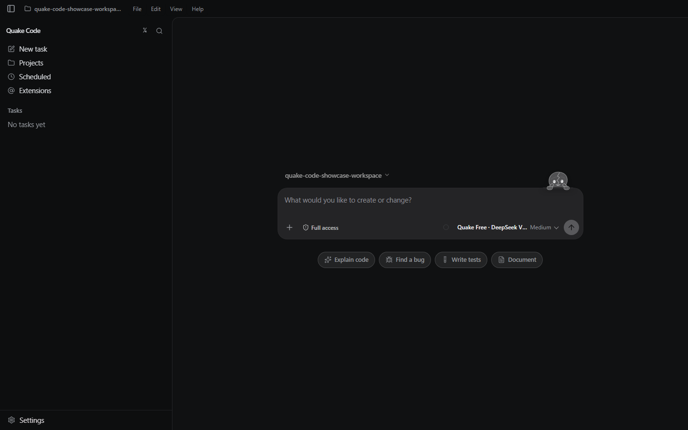
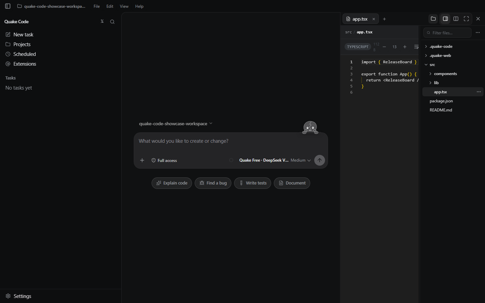
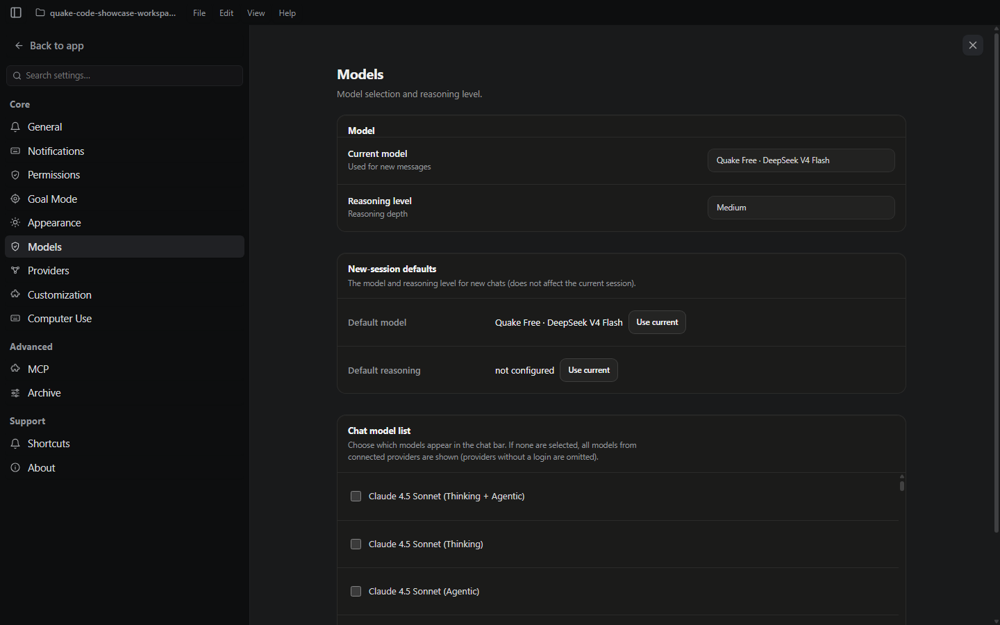

<p align="center">
  
</p>

<h1 align="center">Quake Code Desktop</h1>

<p align="center">
  <strong>A desktop command center for coding agents.</strong><br />
  Keep the conversation, code, files, terminal, browser, and recurring work in one focused workspace.
</p>

<p align="center">
  Windows 10/11 &middot; Electron &middot; React &middot; TypeScript &middot; MIT
</p>

> The screenshots below are captured from the packaged Windows application in English—not mockups or a development browser.



## One place for the whole agent loop

Quake Code is a local-first Windows desktop workspace for building with coding agents. Start from an intent, preserve the project context, inspect work as it happens, and move naturally between the chat, source files, tools, and the rest of your development environment.

- Agent conversations with a unified activity timeline
- Workspace-aware file editing, project navigation, and Monaco-powered code views
- Integrated terminal and browser surfaces alongside the conversation
- Side tasks, subagents, and scheduled recurring work
- Model, provider, reasoning, permission, and appearance controls

## Keep the code in view

Open a project file without leaving the conversation. The file workspace keeps the tree, active code, and agent composer together, so a request can stay anchored to the exact code it concerns.



## Choose the right model for the job

Quake Code exposes model selection and reasoning depth directly in the desktop app, with per-session defaults and a configurable chat model list.



## Run it locally

### Requirements

- Windows 10 or 11 (x64) for the packaged desktop app
- Node.js 22+ and npm 10+ for local development

### Development

```powershell
npm ci
npm run desktop:dev
```

The command starts Quake Code's local backend, Vite renderer, and Electron host.

### Build and verify

```powershell
npm run verify:public-source
npm run typecheck
npm test
npm run desktop:package:win
```

The Windows installer and SHA-256 checksum are written to `apps/quake-desktop/release/`. Builds are unsigned unless Windows code-signing credentials are configured; see the [Windows signing guide](apps/quake-desktop/docs/windows-signing.md).

## Optional Azure Realtime Voice Lab

The repository includes an isolated local lab for experimenting with Azure Realtime voice. Copy `apps/quake-desktop/gpt-realtime-tester/.env.example` to `.env.local`, provide a rotated Azure key locally, and run:

```powershell
npm run realtime:lab --workspace=@mrquake/quake-desktop
```

The key remains in the local Node proxy and is never sent to the browser.

## Project docs

- [Architecture](apps/quake-desktop/docs/architecture.md)
- [Keyboard shortcuts](apps/quake-desktop/docs/keyboard-shortcuts.md)
- [Localization](apps/quake-desktop/docs/localization.md)
- [Windows installation](apps/quake-desktop/docs/windows-install.md)
- [Security policy](SECURITY.md)

## Security, attribution, and license

Use an approval mode appropriate for the workspace: Quake Code can run commands and modify files. Never commit API keys, user sessions, local `.quake-code/` data, or packaged binaries.

Quake Code is released under the [MIT License](LICENSE). OpenAI Codex attribution and the Apache-2.0 license text retained by the project are available in [NOTICE](NOTICE) and [LICENSES/Apache-2.0.txt](LICENSES/Apache-2.0.txt).
