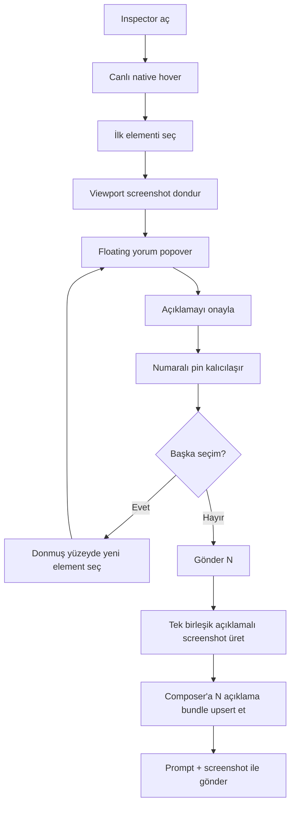
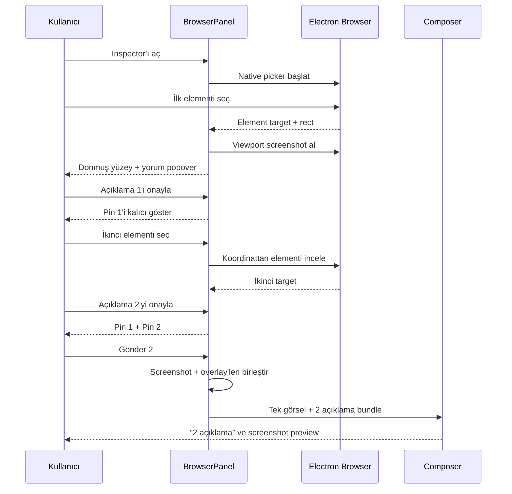

# Quake Plan Dosyası

> Bu dosya Quake Code plan modu tarafından otomatik üretildi.

## Bilgiler

| Alan | Değer |
| --- | --- |
| Durum | planning |
| İlerleme | 0/14 |
| Model | azure-mrquake-gpt56sol/gpt-56-sol-deploy |
| CWD | C:\quake code\apps\quake-desktop |
| Güncelleme | 2026-07-11T14:31:35.269Z |

## Kullanıcı Talebi

neden 2. elementi seçemiyoruz 1 le sınırlı? sen bu browser inspector olayını premium plus seviyeye çek üst düzey olmalı ne gerekiyorsa yapalım planlayalım

## Plan Özeti

<proposed_plan>

# Browser Inspector Premium Plus Planı

## Doğrulama bulguları

İkinci elementin seçilememesinin iki net sebebi var:

1. Electron’daki `startElementPicker()` tek seçimlik tasarlanmış. İlk tıklamada promise tamamlanıyor ve native picker temizleniyor.
2. İlk seçimden sonra gösterilen donmuş `pickViewport` için `handlePickSurfaceClick` yazılmış, fakat JSX’e bağlanmamış. Üst container da donmuş yüzey aktifken click handler’ı kapatıyor.

Ek olarak mevcut yapı çoklu açıklama için uygun değil:

- Tek `selectedElement` tutuluyor.
- Tek `pendingCommentEl` tutuluyor.
- Her açıklama için kırpılmış element görseli üretiliyor.
- Önceki seçim çerçeveleri ve pinler korunmuyor.
- Composer’a açıklama context’i ve görsel ayrı ayrı eklenerek tekrar oluşturulabiliyor.
- “Bitti”, geri al, sil, yeniden düzenle gibi çoklu seçim kontrolleri yok.

## Uygulama planı

1. **Inspector durum modelini tek seçimden çoklu açıklama oturumuna dönüştür**
   - Dosya: `src/client/src/components/dock/BrowserPanel.tsx`
   - Yeni `BrowserAnnotation` modeli:
     - Kalıcı benzersiz `id`
     - Sıralı `number`
     - `ElementInspectResult`
     - Ölçeklenebilir viewport rect’i
     - Açıklama metni
     - Oluşturulma zamanı
   - `selectedElement` ve sayaç merkezli yapı yerine:
     - `annotations[]`
     - `draftTarget`
     - `draftComment`
     - `activeAnnotationId`
     - `hoveredElement`
   - Aynı elementin tekrar seçilmesini engellemek yerine mevcut açıklamayı düzenlemeye aç.
   - Sayfa navigasyonu olduğunda stale seçimleri güvenli biçimde temizle veya kullanıcıya önce onaylat.

2. **İlk seçimden sonra kalıcı donmuş seçim yüzeyi oluştur**
   - Dosya: `src/client/src/components/dock/BrowserPanel.tsx`
   - Inspector açıldığında native picker yalnızca ilk hedefi bulmak için kullanılacak.
   - İlk seçimden sonra:
     - Tek bir viewport screenshot alınacak.
     - Native `WebContentsView` gizlenecek.
     - React donmuş screenshot yüzeyi aktif kalacak.
   - `pickViewport` üzerine gerçek `onMouseMove`, `onClick`, keyboard ve context-menu handler’ları bağlanacak.
   - Sonraki seçimler `inspectElementAt()` ile aynı donmuş viewport koordinatları üzerinden yapılacak.
   - Böylece ikinci, üçüncü ve devamındaki elementler picker yeniden başlatılmadan seçilebilecek.

3. **Tüm seçimleri aynı screenshot üzerinde kalıcı göster**
   - Dosyalar:
     - `src/client/src/components/dock/BrowserPanel.tsx`
     - `src/client/src/components/dock/BrowserPanel.module.css`
   - Her onaylı açıklama için:
     - İnce mavi seçim çerçevesi
     - Sol alt köşede numaralı pin
     - Hover sırasında kısa açıklama tooltip’i
   - Aktif draft seçimi daha parlak çerçeveyle gösterilecek.
   - Önceki seçimler soluk fakat okunabilir kalacak.
   - Pin üzerine gelindiğinde:
     - Açıklama özeti
     - Element etiketi
     - Boyut
     - Düzenle
     - Sil
   - Çakışan pinler için hafif offset uygulanacak.
   - Overlay’ler screenshot ölçek değişikliklerinde yeniden hesaplanacak.

4. **Floating yorum popover’ını referanstaki yerleşime literal olarak eşleştir**
   - Dosyalar:
     - `src/client/src/components/dock/BrowserPanel.tsx`
     - `src/client/src/components/dock/BrowserPanel.module.css`
   - Popover:
     - Seçim çerçevesinin hemen altında
     - Solunda numaralı pin
     - Küçük ayar/yorum simgesi
     - Tek satırlık `Yorum ekle…` alanı
     - Sağda beyaz daire içinde onay
   - Viewport altında yer yoksa seçimin üstüne açılacak.
   - Sağ veya sol sınırdan taşmayacak.
   - Klavye:
     - `Enter`: onayla
     - `Shift+Enter`: yeni satır
     - `Escape`: sadece draft seçimini iptal et
     - `Delete`: aktif açıklamayı kaldır
     - `Ctrl/Cmd+Z`: son açıklamayı geri al
   - Onaydan sonra popover kapanacak, pin kalacak ve seçim modu aktif devam edecek.

5. **Premium inspector üst kontrol şeridi ekle**
   - Dosyalar:
     - `src/client/src/components/dock/BrowserPanel.tsx`
     - `src/client/src/components/dock/BrowserPanel.module.css`
   - Donmuş viewport üzerinde üstte kompakt şerit:
     - `Açıklama ekleme · google.com`
     - Kapat
     - Tümünü temizle
     - Geri al
     - Seçim görünürlüğünü aç/kapat
     - `Gönder 3`
   - `Gönder N`, açıklama yokken pasif olacak.
   - Kullanıcı seçimleri topluca tamamlamadan native browser’a geri dönülmeyecek.
   - “Bitti/Gönder” sonrasında browser canlı görünümüne geri dönülecek; açıklamalar composer’da kalacak.

6. **Tek birleşik açıklamalı screenshot üret**
   - Yeni dosya: `src/client/src/lib/browser-annotations.ts`
   - Dosya: `src/client/src/components/dock/BrowserPanel.tsx`
   - Her seçim için ayrı kırpılmış görsel göndermek yerine:
     - Donmuş browser viewport screenshot’ı canvas’a çizilecek.
     - Tüm seçim çerçeveleri ve numaralı pinler canvas üzerine rasterize edilecek.
     - Tek bir birleşik PNG üretilecek.
   - Screenshot yalnızca seçim oturumu tamamlanırken veya açıklamalar değiştiğinde debounce ile yeniden üretilecek.
   - Orijinal screenshot çözünürlüğü korunacak.
   - Hassas DOM metni screenshot dışında ayrıca çoğaltılmayacak.

7. **Composer’a tek, güncellenebilir açıklama paketi bağla**
   - Dosyalar:
     - `src/client/src/main.tsx`
     - `src/client/src/types.ts`
     - `src/client/src/components/composer/ComposerHelpers.tsx`
     - `src/client/src/components/composer/ChatComposer.tsx`
     - `src/client/src/components/composer/ChatComposer.module.css`
   - Yeni `BrowserAnnotationBundle`:
     - URL
     - Sayfa başlığı
     - Birleşik screenshot
     - Açıklama listesi
     - Element selector/role/accessible name
   - Composer’da:
     - Tek screenshot preview
     - Üzerinde açıklama sayısı
     - `3 açıklama` chip’i
     - Hover’da açıklama listesi
     - Tek tek açıklama düzenleme/silme
     - Tüm paketi kaldırma
   - Her yeni seçimde yeni görsel eklemek yerine aynı bundle upsert edilecek.
   - Açıklama sayısı ile screenshot pin numaraları birebir eşleşecek.

8. **Modele gönderilen bağlamı düzenli ve güvenilir hale getir**
   - Dosya: `src/client/src/main.tsx`
   - Gönderilen içerik:
     ```text
     [Tarayıcı Açıklamaları]
     URL: https://...
     Görsel: browser-annotations.png

     1. textarea
        Selector: ...
        Açıklama: Daha uzun olmalı

     2. button
        Selector: ...
        Açıklama: Buraya ikon ekle
     ```
   - Görsel multimodal attachment olarak gönderilecek.
   - Selector, erişilebilir ad ve yorum metni structured context olacak.
   - Yalnızca gerekli metadata aktarılacak; devasa `outerHTML` prompt’a eklenmeyecek.
   - Açıklama sırası pin sırasıyla aynı olacak.

9. **Detay panelini ana akıştan çıkarıp isteğe bağlı inspector’a dönüştür**
   - Dosyalar:
     - `src/client/src/components/dock/BrowserPanel.tsx`
     - `src/client/src/components/dock/BrowserPanel.module.css`
   - Mevcut büyük `Element Detayları` paneli seçim sırasında varsayılan açılmayacak.
   - Pin context menüsünden “Detayları göster” ile açılacak.
   - Ana seçim deneyiminde yalnızca:
     - Çerçeve
     - Pin
     - Floating comment popover
     - Üst kontrol şeridi
   - Bu sayede seçim yüzeyi referanstaki gibi temiz kalacak.

10. **Electron picker sorumluluğunu sadeleştir**
    - Dosyalar:
      - `electron/browser-inspector.ts`
      - `electron/main.ts`
      - `electron/preload.ts`
      - `src/client/src/lib/desktop.ts`
    - Native picker ilk seçim ve canlı hover için kullanılmaya devam edecek.
    - İlk seçimden sonra çoklu açıklama kontrolü renderer’daki donmuş yüzeye devredilecek.
    - Gerekirse toplu hedef doğrulama/capture API’si eklenecek; her açıklamada ayrı IPC çağrısı yapılmayacak.
    - Selector path doğrulaması ve shadow DOM desteği korunacak.
    - Navigasyon, WebContents destruction ve picker cancellation cleanup’i idempotent olacak.
    - Risk: Electron main/preload değişirse tam dev stack restart gerekir; yalnızca renderer ile çözülebilen bölümler önce uygulanacak.

11. **Erişilebilirlik ve responsive davranış ekle**
    - Pinler keyboard ile seçilebilir olacak.
    - Popover focus trap kullanmadan kontrollü focus restore yapacak.
    - Screen reader metinleri:
      - `Açıklama 2, button elementi`
      - `Açıklamayı düzenle`
      - `Açıklamayı sil`
    - Renk tek durum göstergesi olmayacak; numara ve border biçimi korunacak.
    - Dar browser panelinde popover tam genişliğe yakın açılacak.
    - Reduced-motion’da popover ve pin geçişleri animasyonsuz olacak.

12. **Test kapsamını genişlet**
    - Dosyalar:
      - `test/browser-inspector.test.ts`
      - Yeni: `test/browser-annotations.test.ts`
      - Gerekirse: `test/e2e/browser-annotations.spec.ts`
    - Birim testleri:
      - İkinci ve üçüncü seçim eklenebiliyor.
      - Numara sırası doğru.
      - Silme sonrası numaralar deterministik.
      - Aynı element yeniden seçilince düzenleme açılıyor.
      - Viewport koordinatları doğru ölçekleniyor.
      - Screenshot canvas overlay koordinatları doğru.
      - Bundle güncelleniyor, duplicate attachment oluşmuyor.
      - Prompt context’i doğru üretiliyor.
    - E2E:
      - Picker aç
      - Birinci elementi seç ve yorumla
      - İkinci elementi seç ve yorumla
      - İki pinin görünmesini doğrula
      - Composer’da `2 açıklama` ve tek screenshot doğrula
      - Gönderim payload’ında iki açıklamayı doğrula

## Riskler

- **Koordinat kayması:** Donmuş screenshot ile canlı DOM farklılaşırsa seçim rect’leri sapabilir. Seçim oturumu boyunca sayfa navigasyonu ve scroll kilitlenecek.
- **Shadow DOM/iframe:** Mevcut selector path desteği korunmalı; cross-origin iframe seçimleri sınırlı kalabilir ve UI bunu açıkça belirtmeli.
- **Büyük screenshot maliyeti:** Canvas üretimi debounce edilmeli ve tek attachment upsert edilmelidir.
- **Electron lifecycle:** Main/preload değişikliklerinde Ctrl+R yetmez; dev stack shell üzerinden koordine edilerek yeniden başlatılmalıdır.
- **Prompt şişmesi:** `outerHTML` yerine yalnızca selector, role, accessible name, kısa text ve yorum gönderilmelidir.

## Doğrulama komutları

```bash
npm run typecheck
npm run test
npm run build
npm run test:e2e -- browser-annotations.spec.ts
```

Electron IPC değişirse ayrıca:

```bash
npm run desktop:build:main
npm run desktop:dev
```

## Akış





</proposed_plan>

## Kontrol Listesi

| Durum | # | Adım |
| --- | ---: | --- |
|   | 1 | **Inspector durum modelini tek seçimden çoklu açıklama oturumuna dönüştür |
|   | 2 | **İlk seçimden sonra kalıcı donmuş seçim yüzeyi oluştur |
|   | 3 | **Tüm seçimleri aynı screenshot üzerinde kalıcı göster |
|   | 4 | **Floating yorum popover’ını referanstaki yerleşime literal olarak eşleştir |
|   | 5 | **Premium inspector üst kontrol şeridi ekle |
|   | 6 | **Tek birleşik açıklamalı screenshot üret |
|   | 7 | **Composer’a tek, güncellenebilir açıklama paketi bağla |
|   | 8 | **Modele gönderilen bağlamı düzenli ve güvenilir hale getir |
|   | 9 | textarea |
|   | 10 | button |
|   | 11 | **Detay panelini ana akıştan çıkarıp isteğe bağlı inspector’a dönüştür |
|   | 12 | **Electron picker sorumluluğunu sadeleştir |
|   | 13 | **Erişilebilirlik ve responsive davranış ekle |
|   | 14 | **Test kapsamını genişlet |
