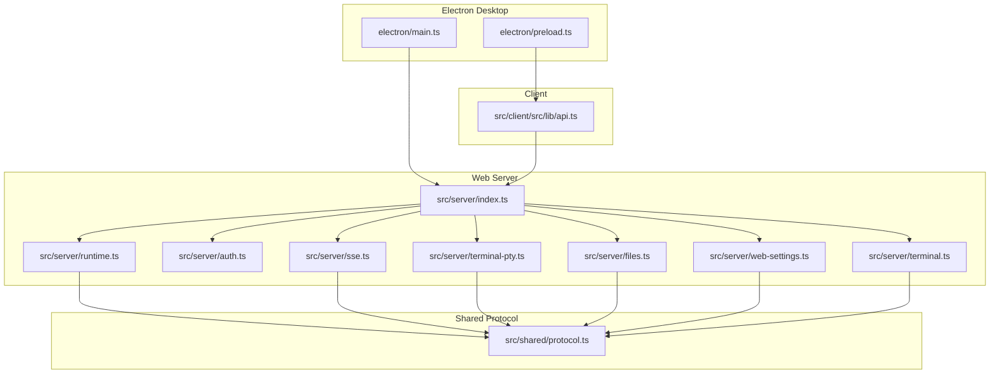
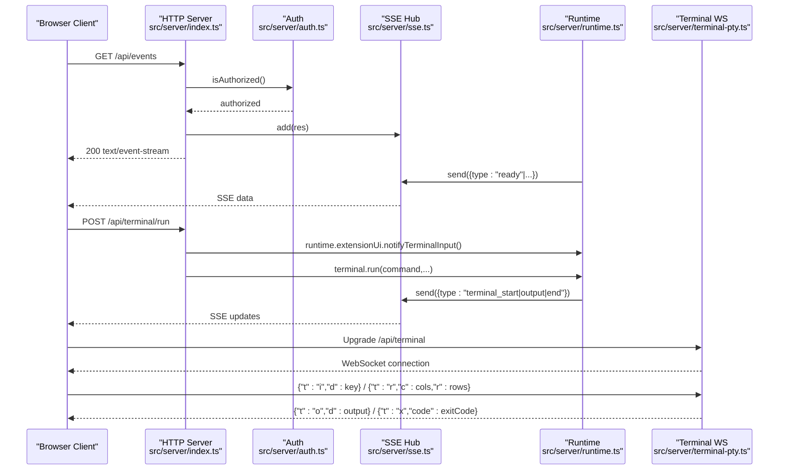
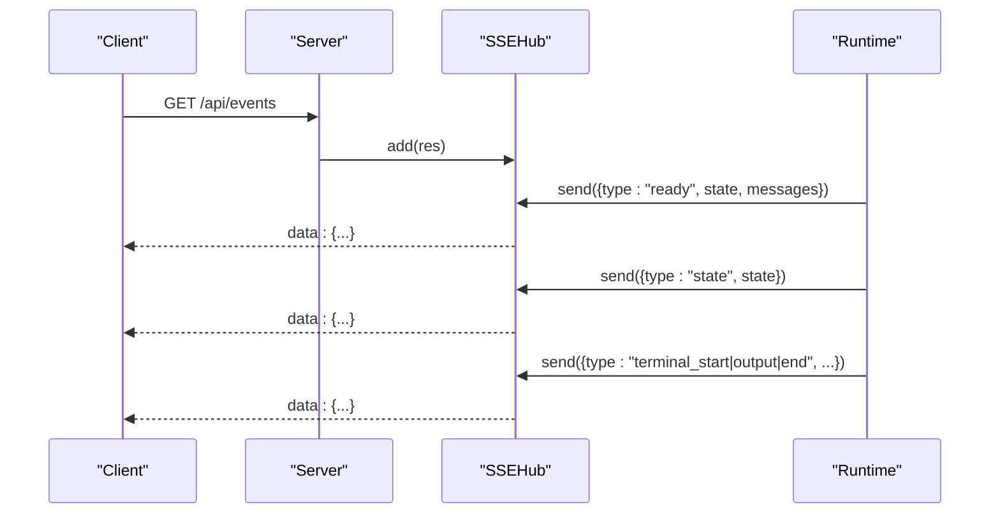
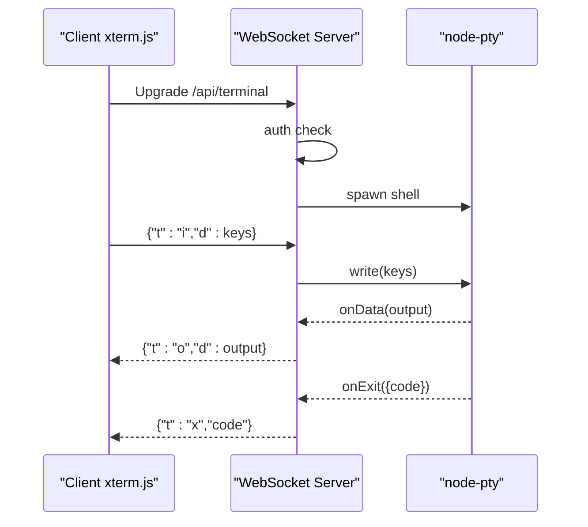
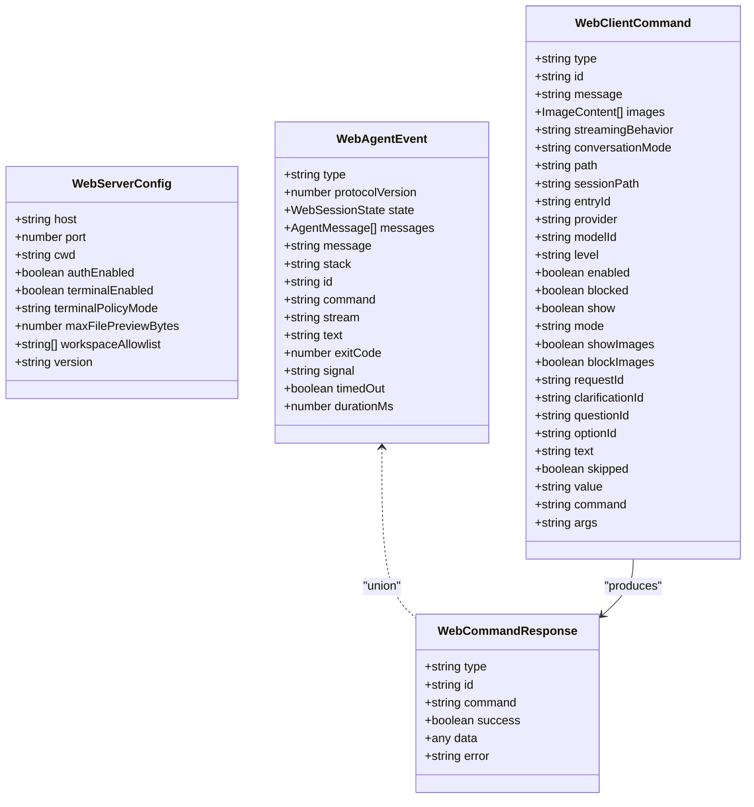
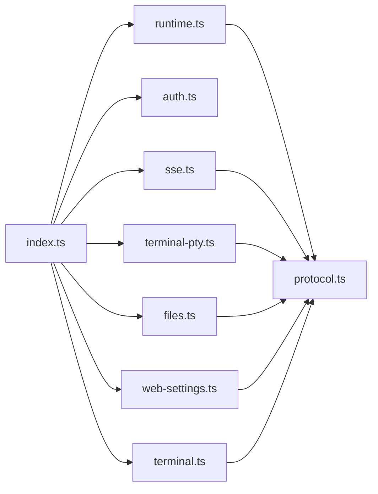

# API Reference

<cite>
**Referenced Files in This Document**
- [src/server/index.ts](file://src/server/index.ts)
- [src/shared/protocol.ts](file://src/shared/protocol.ts)
- [src/server/sse.ts](file://src/server/sse.ts)
- [src/server/auth.ts](file://src/server/auth.ts)
- [src/server/terminal-pty.ts](file://src/server/terminal-pty.ts)
- [src/server/runtime.ts](file://src/server/runtime.ts)
- [src/server/files.ts](file://src/server/files.ts)
- [src/server/web-settings.ts](file://src/server/web-settings.ts)
- [src/server/terminal.ts](file://src/server/terminal.ts)
- [src/client/src/lib/api.ts](file://src/client/src/lib/api.ts)
- [electron/main.ts](file://electron/main.ts)
- [electron/preload.ts](file://electron/preload.ts)
- [README.md](file://README.md)
</cite>

## Table of Contents
1. [Introduction](#introduction)
2. [Project Structure](#project-structure)
3. [Core Components](#core-components)
4. [Architecture Overview](#architecture-overview)
5. [Detailed Component Analysis](#detailed-component-analysis)
6. [Dependency Analysis](#dependency-analysis)
7. [Performance Considerations](#performance-considerations)
8. [Troubleshooting Guide](#troubleshooting-guide)
9. [Conclusion](#conclusion)
10. [Appendices](#appendices)

## Introduction
This document provides a comprehensive API reference for the Quake Code Web server and client. It covers:
- HTTP endpoints for configuration, runtime state, sessions, models, commands, settings, file operations, Git, scheduling, and terminal execution
- Authentication and security headers
- Server-Sent Events (SSE) for real-time updates
- WebSocket endpoints for interactive terminal sessions
- IPC communication patterns for the Electron desktop wrapper
- Shared protocol definitions, event types, and message formats
- Client SDK usage and integration guidelines

## Project Structure
The API surface is centered around a Node HTTP server that serves a React web app and exposes REST endpoints and SSE/WebSocket channels. The Electron main process embeds the server and exposes a narrow IPC bridge to the renderer.

**Diagram sources**
- [src/server/index.ts:401-662](file://src/server/index.ts#L401-L662)
- [src/server/runtime.ts:12-30](file://src/server/runtime.ts#L12-L30)
- [src/server/auth.ts:6-13](file://src/server/auth.ts#L6-L13)
- [src/server/sse.ts:6-31](file://src/server/sse.ts#L6-L31)
- [src/server/terminal-pty.ts:25-94](file://src/server/terminal-pty.ts#L25-L94)
- [src/server/files.ts:13-131](file://src/server/files.ts#L13-L131)
- [src/server/web-settings.ts:13-64](file://src/server/web-settings.ts#L13-L64)
- [src/server/terminal.ts:21-87](file://src/server/terminal.ts#L21-L87)
- [src/shared/protocol.ts:161-198](file://src/shared/protocol.ts#L161-L198)
- [src/client/src/lib/api.ts:9-59](file://src/client/src/lib/api.ts#L9-L59)
- [electron/main.ts:132-138](file://electron/main.ts#L132-L138)
- [electron/preload.ts:5-14](file://electron/preload.ts#L5-L14)

**Section sources**
- [README.md:88-103](file://README.md#L88-L103)
- [src/server/index.ts:401-662](file://src/server/index.ts#L401-L662)

## Core Components
- HTTP server entrypoint and routing: [src/server/index.ts](file://src/server/index.ts)
- SSE hub for real-time events: [src/server/sse.ts](file://src/server/sse.ts)
- Authentication and token handling: [src/server/auth.ts](file://src/server/auth.ts)
- WebSocket terminal bridge: [src/server/terminal-pty.ts](file://src/server/terminal-pty.ts)
- Runtime controller and event emission: [src/server/runtime.ts](file://src/server/runtime.ts)
- File service and safe file operations: [src/server/files.ts](file://src/server/files.ts)
- Web settings persistence: [src/server/web-settings.ts](file://src/server/web-settings.ts)
- Local terminal execution: [src/server/terminal.ts](file://src/server/terminal.ts)
- Shared protocol definitions: [src/shared/protocol.ts](file://src/shared/protocol.ts)
- Client SDK helpers: [src/client/src/lib/api.ts](file://src/client/src/lib/api.ts)
- Electron IPC bridge: [electron/main.ts](file://electron/main.ts), [electron/preload.ts](file://electron/preload.ts)

**Section sources**
- [src/server/index.ts:10-26](file://src/server/index.ts#L10-L26)
- [src/server/sse.ts:6-31](file://src/server/sse.ts#L6-L31)
- [src/server/auth.ts:6-13](file://src/server/auth.ts#L6-L13)
- [src/server/terminal-pty.ts:25-94](file://src/server/terminal-pty.ts#L25-L94)
- [src/server/runtime.ts:12-30](file://src/server/runtime.ts#L12-L30)
- [src/server/files.ts:13-131](file://src/server/files.ts#L13-L131)
- [src/server/web-settings.ts:13-64](file://src/server/web-settings.ts#L13-L64)
- [src/server/terminal.ts:21-87](file://src/server/terminal.ts#L21-L87)
- [src/shared/protocol.ts:161-198](file://src/shared/protocol.ts#L161-L198)
- [src/client/src/lib/api.ts:9-59](file://src/client/src/lib/api.ts#L9-L59)
- [electron/main.ts:132-138](file://electron/main.ts#L132-L138)
- [electron/preload.ts:5-14](file://electron/preload.ts#L5-L14)

## Architecture Overview
High-level API architecture:
- REST endpoints under /api/ for configuration, state, sessions, models, commands, settings, files, Git, scheduling, and terminal execution
- SSE endpoint /api/events for real-time runtime updates
- WebSocket endpoint /api/terminal for interactive terminal sessions
- Electron main process manages the embedded server and exposes minimal IPC to renderer

**Diagram sources**
- [src/server/index.ts:408-412](file://src/server/index.ts#L408-L412)
- [src/server/auth.ts:15-20](file://src/server/auth.ts#L15-L20)
- [src/server/sse.ts:9-26](file://src/server/sse.ts#L9-L26)
- [src/server/runtime.ts:56-58](file://src/server/runtime.ts#L56-L58)
- [src/server/terminal-pty.ts:28-42](file://src/server/terminal-pty.ts#L28-L42)
- [src/server/terminal-pty.ts:77-88](file://src/server/terminal-pty.ts#L77-L88)
- [src/server/terminal-pty.ts:68-75](file://src/server/terminal-pty.ts#L68-L75)

## Detailed Component Analysis

### Authentication and Authorization
- Token-based auth is enabled by default and enforced on all /api/* endpoints, SSE, and WebSocket terminal.
- Tokens are injected into served HTML and also accepted via X-Quake-Web-Token header or token query param.
- Token generation and persistence are handled locally unless disabled.

Key behaviors:
- Header or query param token validation
- 401 rejection response for unauthorized requests
- Client SDK adds token header automatically when present

**Section sources**
- [src/server/auth.ts:15-29](file://src/server/auth.ts#L15-L29)
- [src/server/auth.ts:31-35](file://src/server/auth.ts#L31-L35)
- [src/server/index.ts:404-407](file://src/server/index.ts#L404-L407)
- [src/client/src/lib/api.ts:9-25](file://src/client/src/lib/api.ts#L9-L25)

### Server-Sent Events (SSE)
- Endpoint: GET /api/events
- Headers: Content-Type text/event-stream; keep-alive; no-transform
- Payloads include ready, state, agent_event, terminal_* events, and extension UI requests
- Clients receive continuous updates without polling

**Diagram sources**
- [src/server/index.ts:408-412](file://src/server/index.ts#L408-L412)
- [src/server/sse.ts:9-26](file://src/server/sse.ts#L9-L26)
- [src/server/runtime.ts:56-58](file://src/server/runtime.ts#L56-L58)

**Section sources**
- [src/server/sse.ts:6-31](file://src/server/sse.ts#L6-L31)
- [src/shared/protocol.ts:161-169](file://src/shared/protocol.ts#L161-L169)

### WebSocket Terminal
- Endpoint: Upgrade /api/terminal (HTTP to WebSocket)
- Validates auth similarly to SSE
- Messages:
  - {"t":"i","d":"..."} for keystrokes
  - {"t":"r","c":cols,"r":rows} for resize
  - {"t":"o","d":"..."} for output
  - {"t":"x","code":exitCode} for exit

**Diagram sources**
- [src/server/terminal-pty.ts:28-42](file://src/server/terminal-pty.ts#L28-L42)
- [src/server/terminal-pty.ts:77-88](file://src/server/terminal-pty.ts#L77-L88)
- [src/server/terminal-pty.ts:68-75](file://src/server/terminal-pty.ts#L68-L75)

**Section sources**
- [src/server/terminal-pty.ts:25-94](file://src/server/terminal-pty.ts#L25-L94)

### HTTP REST Endpoints

#### Configuration and Status
- GET /api/config
  - Returns server configuration including host, port, cwd, authEnabled, terminalEnabled, terminalPolicyMode, maxFilePreviewBytes, workspaceAllowlist, version
  - Authentication required

- GET /api/state
  - Returns runtime state, messages, and lock status
  - Authentication required

- GET /api/settings
  - Returns runtime settings (default provider/model, thinking level, theme, image policies)
  - Authentication required

- GET /api/web-settings
  - Returns persisted web UI settings (selected model, panels visibility, extensionsEnabled)
  - Authentication required

- PATCH /api/web-settings
  - Updates web UI settings atomically
  - Authentication required

- POST /api/web-settings
  - Writes web UI settings (idempotent)
  - Authentication required

**Section sources**
- [src/server/index.ts:413-419](file://src/server/index.ts#L413-L419)
- [src/server/index.ts:421-427](file://src/server/index.ts#L421-L427)
- [src/server/index.ts:462-466](file://src/server/index.ts#L462-L466)
- [src/server/index.ts:465-466](file://src/server/index.ts#L465-L466)
- [src/server/index.ts:564-567](file://src/server/index.ts#L564-L567)
- [src/server/web-settings.ts:36-50](file://src/server/web-settings.ts#L36-L50)

#### Sessions and Conversation
- GET /api/sessions
  - Lists recent sessions; append ?all=1 to list all sessions in workspace
  - Authentication required

- POST /api/command
  - Sends a command to the runtime; returns command_response
  - Authentication required

- POST /api/terminal/run
  - Runs a command locally; emits terminal_start, terminal_output, terminal_end via SSE
  - Authentication required

- POST /api/terminal/stop
  - Stops a running terminal process by id
  - Authentication required

- POST /api/scheduled
  - Creates a scheduled task (name, cron, prompt, enabled)
  - Authentication required

- GET /api/scheduled
  - Lists scheduled tasks
  - Authentication required

- PATCH /api/scheduled/:id
  - Updates a scheduled task
  - Authentication required

- DELETE /api/scheduled/:id
  - Removes a scheduled task
  - Authentication required

- POST /api/scheduled/:id/run
  - Runs a scheduled task immediately
  - Authentication required

- GET /api/search?q=...
  - Searches across sessions using runtime search
  - Authentication required

- GET /api/commands
  - Lists available commands (builtin, extension, prompt, skill)
  - Authentication required

- GET /api/extensions
  - Lists extensions with enablement status
  - Authentication required

- POST /api/extensions/toggle
  - Toggles an extension enabled/disabled
  - Authentication required

- GET /api/skills
  - Lists skills
  - Authentication required

- GET /api/prompts
  - Lists prompt templates
  - Authentication required

- GET /api/models
  - Lists models with configuration status
  - Authentication required

- GET /api/workspace/roots
  - Lists workspace roots (current, home, desktop, downloads, documents, drives)
  - Authentication required

- GET /api/workspace/browse?path=...
  - Lists folders under a given path
  - Authentication required

- GET /api/workspace/changes
  - Summarizes workspace changes (files, added, removed, paths)
  - Authentication required

**Section sources**
- [src/server/index.ts:421-436](file://src/server/index.ts#L421-L436)
- [src/server/index.ts:626-630](file://src/server/index.ts#L626-L630)
- [src/server/index.ts:631-650](file://src/server/index.ts#L631-L650)
- [src/server/index.ts:528-536](file://src/server/index.ts#L528-L536)
- [src/server/index.ts:520-527](file://src/server/index.ts#L520-L527)
- [src/server/index.ts:538-563](file://src/server/index.ts#L538-L563)
- [src/server/index.ts:514-519](file://src/server/index.ts#L514-L519)
- [src/server/index.ts:433-442](file://src/server/index.ts#L433-L442)
- [src/server/index.ts:444-455](file://src/server/index.ts#L444-L455)
- [src/server/index.ts:456-461](file://src/server/index.ts#L456-L461)
- [src/server/index.ts:429-432](file://src/server/index.ts#L429-L432)
- [src/server/index.ts:466-469](file://src/server/index.ts#L466-L469)
- [src/server/index.ts:470-473](file://src/server/index.ts#L470-L473)
- [src/server/index.ts:474-477](file://src/server/index.ts#L474-L477)

#### File Operations
- GET /api/files?path=...&hidden=1&generated=1
  - Lists files/directories with optional inclusion of hidden/generated entries
  - Authentication required

- GET /api/files/search?q=...&hidden=1&generated=1&limit=200
  - Searches files recursively with a limit
  - Authentication required

- GET /api/file?path=...
  - Reads a file up to 1MB; returns path, content, size
  - Authentication required

- POST /api/file/write
  - Writes content to a file; optionally creates backup
  - Authentication required

- POST /api/file/patch
  - Applies patches to a file
  - Authentication required

- POST /api/file/delete
  - Deletes a file
  - Authentication required

- POST /api/file/mkdir
  - Creates a directory
  - Authentication required

- POST /api/file/rename
  - Renames a file or directory
  - Authentication required

- GET /api/file/history?path=...
  - Retrieves file history versions
  - Authentication required

- POST /api/file/restore
  - Restores a file to a specific version
  - Authentication required

Security and limits:
- Workspace root enforcement prevents traversal outside configured CWD
- Preview size limited to 1MB
- Hidden and generated directories filtered by default

**Section sources**
- [src/server/index.ts:568-625](file://src/server/index.ts#L568-L625)
- [src/server/files.ts:16-29](file://src/server/files.ts#L16-L29)
- [src/server/files.ts:31-52](file://src/server/files.ts#L31-L52)
- [src/server/files.ts:54-61](file://src/server/files.ts#L54-L61)
- [src/server/files.ts:84-101](file://src/server/files.ts#L84-L101)
- [src/server/files.ts:103-123](file://src/server/files.ts#L103-L123)

#### Git Integration
- GET /api/git/status
  - Returns current Git status summary
  - Authentication required

- GET /api/git/branch
  - Returns current branch
  - Authentication required

- GET /api/git/diff?path=...&staged=1
  - Returns diff for a file or staged changes
  - Authentication required

- POST /api/git/stage
  - Stages paths
  - Authentication required

- POST /api/git/unstage
  - Unstages paths
  - Authentication required

- POST /api/git/commit
  - Commits with a message
  - Authentication required

- POST /api/git/push
  - Pushes with automatic upstream setup if missing
  - Authentication required

- POST /api/git/pr
  - Creates a pull request
  - Authentication required

**Section sources**
- [src/server/index.ts:478-513](file://src/server/index.ts#L478-L513)

### Shared Protocol Definitions
Core types and contracts used by both client and server:
- WebServerConfig, WebSessionState, WebRuntimeSettings, WebFileEntry, WebPlanState, WebPlanClarificationState, WebAgentEvent, WebClientCommand, WebCommandResponse

**Diagram sources**
- [src/shared/protocol.ts:112-122](file://src/shared/protocol.ts#L112-L122)
- [src/shared/protocol.ts:161-169](file://src/shared/protocol.ts#L161-L169)
- [src/shared/protocol.ts:171-193](file://src/shared/protocol.ts#L171-L193)
- [src/shared/protocol.ts:195-198](file://src/shared/protocol.ts#L195-L198)

**Section sources**
- [src/shared/protocol.ts:112-198](file://src/shared/protocol.ts#L112-L198)

### Client SDK Usage
The client SDK provides typed helpers for authenticated HTTP requests and SSE URLs:
- apiGet, apiPost, apiPatch, apiDelete
- eventsUrl()

Usage pattern:
- Initialize authToken from window.__QUAKE_WEB_TOKEN__
- Call apiGet("/api/config") to bootstrap UI
- Subscribe to /api/events via EventSource and handle incoming messages
- Send commands via POST /api/command

**Section sources**
- [src/client/src/lib/api.ts:9-59](file://src/client/src/lib/api.ts#L9-L59)

### Electron IPC Communication
The Electron main process:
- Starts and supervises the Node HTTP server
- Exposes a minimal IPC bridge to renderer via preload
- Provides window controls and theming integration

IPC surfaces:
- window.minimize, window.maximizeToggle, window.close
- titlebar:setOverlay(color, symbolColor)

**Section sources**
- [electron/main.ts:45-66](file://electron/main.ts#L45-L66)
- [electron/preload.ts:5-14](file://electron/preload.ts#L5-L14)

## Dependency Analysis
The server composes multiple services behind a single HTTP entrypoint. Dependencies and coupling:
- src/server/index.ts depends on runtime, auth, SSE, terminal-pty, files, web-settings, terminal, git, scheduler, search
- runtime emits events consumed by SSE hub
- terminal-pty bridges WebSocket to node-pty
- client consumes SSE and REST endpoints

**Diagram sources**
- [src/server/index.ts:10-26](file://src/server/index.ts#L10-L26)
- [src/server/runtime.ts:8-11](file://src/server/runtime.ts#L8-L11)
- [src/server/sse.ts:2](file://src/server/sse.ts#L2)
- [src/server/terminal-pty.ts:5](file://src/server/terminal-pty.ts#L5)
- [src/server/files.ts:4](file://src/server/files.ts#L4)
- [src/server/web-settings.ts:6](file://src/server/web-settings.ts#L6)
- [src/server/terminal.ts:2](file://src/server/terminal.ts#L2)
- [src/shared/protocol.ts:1](file://src/shared/protocol.ts#L1)

**Section sources**
- [src/server/index.ts:10-26](file://src/server/index.ts#L10-L26)

## Performance Considerations
- SSE streaming: No-cache headers and keep-alive reduce overhead; clients should reconnect on disconnect
- Terminal output: Buffered streams with capped sizes; long-running commands are terminated after a timeout
- File previews: 1MB cap to prevent memory pressure
- Workspace browsing: Limits and filtering to avoid deep scans
- Scheduled tasks: Controlled via a scheduler with explicit error propagation

[No sources needed since this section provides general guidance]

## Troubleshooting Guide
Common issues and resolutions:
- 401 Unauthorized
  - Ensure X-Quake-Web-Token header or token query param matches server token
  - Verify token injection in served HTML when using local auth

- 403 Forbidden
  - Workspace path traversal attempts are rejected; confirm paths are within configured CWD

- 413 Payload Too Large
  - File preview exceeds 1MB limit; use smaller files or download externally

- Terminal command failures
  - Commands may be blocked by terminal policy; adjust policy mode or simplify command
  - Long-running commands are terminated; reduce scope or increase timeout

- SSE disconnections
  - Reconnect using /api/events; server sends ready event on initial connect

**Section sources**
- [src/server/auth.ts:22-29](file://src/server/auth.ts#L22-L29)
- [src/server/files.ts:59](file://src/server/files.ts#L59)
- [src/server/terminal.ts:42-43](file://src/server/terminal.ts#L42-L43)
- [src/server/index.ts:408-412](file://src/server/index.ts#L408-L412)

## Conclusion
Quake Code Web exposes a cohesive API surface combining REST endpoints, SSE for real-time updates, and WebSocket for interactive terminals. The shared protocol ensures type-safe contracts between client and server. Electron integration provides a secure desktop wrapper with minimal IPC exposure. For production use, enforce local auth, workspace allowlists, and terminal policy controls.

[No sources needed since this section summarizes without analyzing specific files]

## Appendices

### Authentication Requirements
- All /api/* endpoints require authentication
- SSE and WebSocket terminal endpoints require authentication
- Token can be supplied via X-Quake-Web-Token header or token query param

**Section sources**
- [src/server/index.ts:404-407](file://src/server/index.ts#L404-L407)
- [src/server/auth.ts:15-20](file://src/server/auth.ts#L15-L20)

### Error Codes
- 401 Unauthorized: Missing or invalid token
- 403 Forbidden: Workspace traversal or insufficient permissions
- 404 Not Found: Static assets or endpoints
- 413 Payload Too Large: File preview > 1MB
- 422 Unprocessable Entity: Validation errors (e.g., unsupported command)
- 5xx: Internal server errors

**Section sources**
- [src/server/index.ts:231-234](file://src/server/index.ts#L231-L234)
- [src/server/files.ts:19-20](file://src/server/files.ts#L19-L20)
- [src/server/files.ts:59](file://src/server/files.ts#L59)

### Client Integration Guidelines
- Initialize authToken from window.__QUAKE_WEB_TOKEN__
- Use apiGet/apiPost helpers for REST calls
- Subscribe to /api/events via EventSource
- Send commands via POST /api/command
- For terminal sessions, establish WebSocket to /api/terminal

**Section sources**
- [src/client/src/lib/api.ts:9-59](file://src/client/src/lib/api.ts#L9-L59)
- [src/server/index.ts:408-412](file://src/server/index.ts#L408-L412)
- [src/server/terminal-pty.ts:28-42](file://src/server/terminal-pty.ts#L28-L42)
