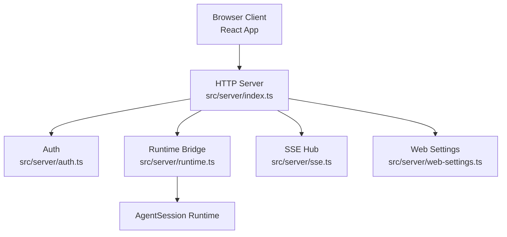
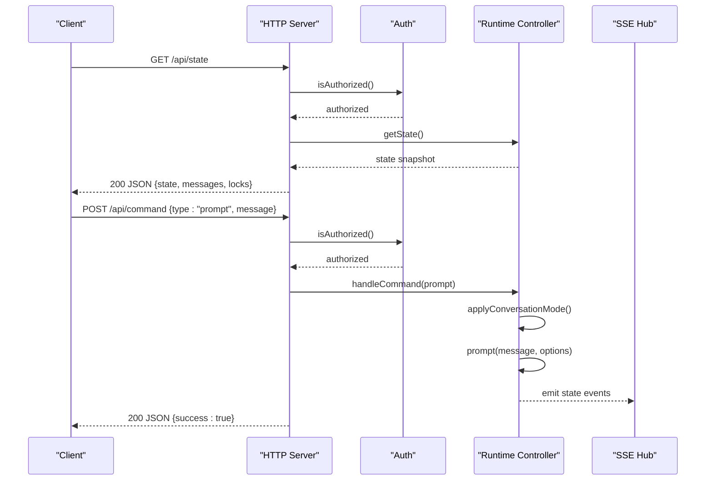
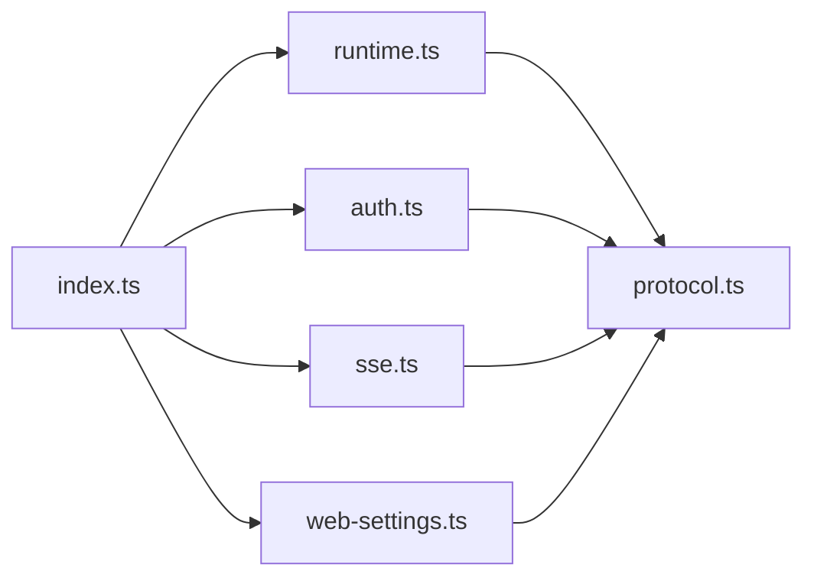

# Core Session & Command Endpoints

<cite>
**Referenced Files in This Document**
- [index.ts](file://src/server/index.ts)
- [protocol.ts](file://src/shared/protocol.ts)
- [runtime.ts](file://src/server/runtime.ts)
- [auth.ts](file://src/server/auth.ts)
- [sse.ts](file://src/server/sse.ts)
- [web-settings.ts](file://src/server/web-settings.ts)
- [api.ts](file://src/client/src/lib/api.ts)
- [README.md](file://README.md)
</cite>

## Table of Contents
1. [Introduction](#introduction)
2. [Project Structure](#project-structure)
3. [Core Components](#core-components)
4. [Architecture Overview](#architecture-overview)
5. [Detailed Component Analysis](#detailed-component-analysis)
6. [Dependency Analysis](#dependency-analysis)
7. [Performance Considerations](#performance-considerations)
8. [Troubleshooting Guide](#troubleshooting-guide)
9. [Conclusion](#conclusion)
10. [Appendices](#appendices)

## Introduction
This document provides comprehensive documentation for the core session management and command processing endpoints of the Quake Code Web server. It covers:
- /api/command for AI conversation handling and session control commands
- /api/sessions for listing and switching sessions
- /api/state for runtime state queries
- /api/settings for runtime configuration
- /api/models for model information

It includes request/response schemas, authentication requirements, error handling patterns, and practical curl examples. It also documents command types such as prompt, abort, extension_ui_response, and slash_command with their specific parameters and usage patterns.

## Project Structure
The server exposes HTTP endpoints implemented in a single Node.js HTTP server with SSE support. The core runtime is bridged via WebRuntimeController, which integrates with the AgentSession runtime and exposes session and model operations.

**Diagram sources**
- [index.ts:401-662](file://src/server/index.ts#L401-L662)
- [auth.ts:6-55](file://src/server/auth.ts#L6-L55)
- [runtime.ts:12-30](file://src/server/runtime.ts#L12-L30)
- [sse.ts:6-31](file://src/server/sse.ts#L6-L31)
- [web-settings.ts:13-63](file://src/server/web-settings.ts#L13-L63)

**Section sources**
- [README.md:88-103](file://README.md#L88-L103)
- [index.ts:401-662](file://src/server/index.ts#L401-L662)

## Core Components
- HTTP Server and Routing: Implements GET/POST endpoints under /api/* and serves static assets. Authentication is enforced for all /api/* routes.
- Runtime Controller: Bridges the AgentSession runtime and exposes session lifecycle, model listing, settings, and command handling.
- SSE Hub: Streams runtime events and command responses to clients.
- Authentication: Local token-based auth injected into the client HTML and required for API access.
- Web Settings: Manages web UI preferences persisted to disk.

**Section sources**
- [index.ts:401-662](file://src/server/index.ts#L401-L662)
- [runtime.ts:12-30](file://src/server/runtime.ts#L12-L30)
- [sse.ts:6-31](file://src/server/sse.ts#L6-L31)
- [auth.ts:6-55](file://src/server/auth.ts#L6-L55)
- [web-settings.ts:13-63](file://src/server/web-settings.ts#L13-L63)

## Architecture Overview
The server listens on a configurable host/port, validates workspace and security policies, and exposes endpoints for session management, runtime state, settings, and model discovery. Commands are parsed and dispatched to the runtime controller, which updates state and emits SSE events.

**Diagram sources**
- [index.ts:417-432](file://src/server/index.ts#L417-L432)
- [index.ts:626-630](file://src/server/index.ts#L626-L630)
- [runtime.ts:36-58](file://src/server/runtime.ts#L36-L58)
- [runtime.ts:60-62](file://src/server/runtime.ts#L60-L62)
- [sse.ts:21-26](file://src/server/sse.ts#L21-L26)

## Detailed Component Analysis

### Authentication and Authorization
- Purpose: Enforce local token-based access to /api/* endpoints, including SSE and terminal endpoints.
- Mechanism: Token passed via header X-Quake-Web-Token or query parameter token. On first run, a secure token is generated and stored in a file under the workspace directory.
- Client injection: The server injects the token into the served HTML head for the client to use.

Key behaviors:
- If QUAKE_WEB_AUTH is set to 0, authentication is disabled.
- Token file path defaults to .quake-code/web-token under the workspace directory.
- Reject responses return 401 Unauthorized with JSON payload.

**Section sources**
- [auth.ts:6-55](file://src/server/auth.ts#L6-L55)
- [index.ts:404-407](file://src/server/index.ts#L404-L407)
- [index.ts:31-35](file://src/server/index.ts#L31-L35)
- [api.ts:48-58](file://src/client/src/lib/api.ts#L48-L58)

### /api/command — Command Processing
Purpose: Submit commands to control conversation, session lifecycle, model selection, and plan/clarification flows.

Supported command types:
- prompt: Start or steer a conversation with optional images and streaming behavior.
- abort: Cancel ongoing interactions.
- new_session/open_workspace/switch_session/fork_session: Manage sessions and workspace.
- set_*: Adjust runtime settings (thinking level, model, defaults, images, terminal policy, plan mode).
- slash_command: Execute a slash command (e.g., /new, /status, /reload, /compact, /model, /resume, /settings, /checklist, /clarify, /clarify-skip, /plan, /plan-on, /plan-off, /skillcreator, /skill-creator, /skillcreate).
- plan_decision/plan_refine: Respond to plan decisions.
- plan_clarification_*: Answer, complete, or skip plan clarifications.
- extension_ui_response: Respond to extension UI requests.

Request schema (WebClientCommand):
- type: Literal indicating the command variant.
- id: Optional identifier for correlating responses.
- Additional fields vary by command type (see below).

Response schema (WebCommandResponse):
- success: Boolean indicating outcome.
- data: Optional data payload for successful commands.
- error: Error message for failures.

Command-specific parameters:
- prompt
  - message: Required string.
  - images: Optional array of image content objects.
  - streamingBehavior: Optional "steer" | "followUp".
  - conversationMode: Optional "execute" | "plan".
- abort
  - No additional fields.
- new_session/open_workspace/switch_session/fork_session
  - No additional fields (except open_workspace has path, switch_session has sessionPath, fork_session has entryId).
- set_thinking_level
  - level: Target thinking level.
- set_model/set_default_model
  - provider: Provider identifier.
  - modelId: Model identifier.
- set_default_thinking
  - level: Default thinking level.
- set_auto_compaction
  - enabled: Boolean toggle.
- set_block_images/set_show_images
  - blocked/show: Boolean flags.
- set_terminal_policy
  - mode: "safe" | "allow-all" | "disabled".
- set_plan_mode
  - enabled: Boolean toggle.
- slash_command
  - command: Slash command name (without leading slash).
  - args: Optional arguments string.
- plan_decision/plan_refine
  - requestId: Clarification or decision identifier.
  - value: Chosen option or refinement text.
- plan_clarification_answer
  - requestId: Clarification identifier.
  - clarificationId: Clarification instance identifier.
  - questionId: Question identifier.
  - optionId/text/skipped: Answer details.
- plan_clarification_complete
  - requestId: Clarification identifier.
  - clarificationId: Clarification instance identifier.
  - answers: Map of questionId to answer.
- plan_clarification_skip
  - requestId: Clarification identifier.
  - clarificationId: Clarification instance identifier.
- extension_ui_response
  - id: Request identifier.
  - value/confirmed/cancelled: Response values depending on the UI request type.

Processing logic:
- Certain commands trigger cancellation of pending interactions.
- Some commands run under a lock to prevent concurrent state mutations.
- Errors are caught and returned as command responses with success=false and error message.

Example curl usage:
- Start a prompt:
  - curl -X POST http://127.0.0.1:3737/api/command -H "Content-Type: application/json" -H "X-Quake-Web-Token: YOUR_TOKEN" -d '{"type":"prompt","message":"Hello"}'
- Abort current interaction:
  - curl -X POST http://127.0.0.1:3737/api/command -H "Content-Type: application/json" -H "X-Quake-Web-Token: YOUR_TOKEN" -d '{"type":"abort"}'
- Switch session:
  - curl -X POST http://127.0.0.1:3737/api/command -H "Content-Type: application/json" -H "X-Quake-Web-Token: YOUR_TOKEN" -d '{"type":"switch_session","sessionPath":"/path/to/session"}'
- Fork session:
  - curl -X POST http://127.0.0.1:3737/api/command -H "Content-Type: application/json" -H "X-Quake-Web-Token: YOUR_TOKEN" -d '{"type":"fork_session","entryId":"session-id"}'
- Set model:
  - curl -X POST http://127.0.0.1:3737/api/command -H "Content-Type: application/json" -H "X-Quake-Web-Token: YOUR_TOKEN" -d '{"type":"set_model","provider":"anthropic","modelId":"claude-3-opus-20240229"}'

**Section sources**
- [index.ts:255-374](file://src/server/index.ts#L255-L374)
- [protocol.ts:171-197](file://src/shared/protocol.ts#L171-L197)
- [runtime.ts:296-339](file://src/server/runtime.ts#L296-L339)

### /api/sessions — Session Lifecycle Management
Purpose: List sessions and manage session switching and forking.

Endpoints:
- GET /api/sessions
  - Query parameter all: Optional boolean to include sessions from all workspaces.
  - Response: { sessions: WebSessionSummary[] }.
- GET /api/state
  - Response: { state: WebSessionState, messages: AgentMessage[], locks: { terminal: boolean } }.
- GET /api/settings
  - Response: { settings: WebRuntimeSettings }.
- GET /api/models
  - Response: { models: WebModelSummary[] }.

Session operations via /api/command:
- new_session: Creates a new session.
- open_workspace: Opens a new workspace and resets runtime services.
- switch_session: Switches to an existing session.
- fork_session: Forks a session from an entry ID.

Example curl usage:
- List sessions:
  - curl http://127.0.0.1:3737/api/sessions -H "X-Quake-Web-Token: YOUR_TOKEN"
- List sessions across all workspaces:
  - curl "http://127.0.0.1:3737/api/sessions?all=1" -H "X-Quake-Web-Token: YOUR_TOKEN"
- Get runtime state:
  - curl http://127.0.0.1:3737/api/state -H "X-Quake-Web-Token: YOUR_TOKEN"
- Get runtime settings:
  - curl http://127.0.0.1:3737/api/settings -H "X-Quake-Web-Token: YOUR_TOKEN"
- Get models:
  - curl http://127.0.0.1:3737/api/models -H "X-Quake-Web-Token: YOUR_TOKEN"

**Section sources**
- [index.ts:417-432](file://src/server/index.ts#L417-L432)
- [runtime.ts:208-231](file://src/server/runtime.ts#L208-L231)
- [runtime.ts:172-181](file://src/server/runtime.ts#L172-L181)
- [runtime.ts:213-231](file://src/server/runtime.ts#L213-L231)

### /api/state — Runtime State Queries
Purpose: Retrieve the current session state, message list, and runtime locks.

Response fields:
- state: WebSessionState snapshot including session identifiers, model, thinking level, streaming/compaction flags, message counts, active tools, current working directory, conversation mode, and plan state.
- messages: AgentMessage[] representing the current conversation.
- locks: { terminal: boolean } indicating terminal operation activity.

Example curl usage:
- curl http://127.0.0.1:3737/api/state -H "X-Quake-Web-Token: YOUR_TOKEN"

**Section sources**
- [index.ts:417-419](file://src/server/index.ts#L417-L419)
- [runtime.ts:36-54](file://src/server/runtime.ts#L36-L54)

### /api/settings — Runtime Configuration
Purpose: Retrieve runtime settings such as default provider/model, default thinking level, theme, and image preferences.

Response fields:
- settings: WebRuntimeSettings containing defaultProvider, defaultModel, defaultThinkingLevel, theme, blockImages, showImages.

Example curl usage:
- curl http://127.0.0.1:3737/api/settings -H "X-Quake-Web-Token: YOUR_TOKEN"

**Section sources**
- [index.ts:425-427](file://src/server/index.ts#L425-L427)
- [runtime.ts:172-181](file://src/server/runtime.ts#L172-L181)

### /api/models — Model Information
Purpose: Enumerate available models, including provider, id, name, capabilities, and configuration status.

Response fields:
- models: WebModelSummary[] with provider, id, name, contextWindow, reasoning, supportsXhigh/supportsMax, input types, configured/current flags.

Example curl usage:
- curl http://127.0.0.1:3737/api/models -H "X-Quake-Web-Token: YOUR_TOKEN"

**Section sources**
- [index.ts:429-431](file://src/server/index.ts#L429-L431)
- [runtime.ts:213-231](file://src/server/runtime.ts#L213-L231)

### SSE Events and /api/events
Purpose: Establish a long-lived connection to receive runtime events and command responses.

Endpoint:
- GET /api/events
  - Adds the client to the SSE hub and sends a ready event with current state and messages.
  - Subsequent events include state updates, agent events, terminal output, and command responses.

Client usage:
- The client establishes a connection to /api/events with the token either via query parameter or injected header.
- The server responds with text/event-stream and writes periodic keepalive lines.

**Section sources**
- [index.ts:408-412](file://src/server/index.ts#L408-L412)
- [sse.ts:6-31](file://src/server/sse.ts#L6-L31)
- [runtime.ts:56-58](file://src/server/runtime.ts#L56-L58)

### Error Handling Patterns
- HTTP Status Mapping:
  - 401 Unauthorized: Authentication failure for protected endpoints.
  - 404 Not Found: Static resource or endpoint not found.
  - 405 Method Not Allowed: Unsupported HTTP method.
  - 500 Internal Server Error: Uncaught exceptions mapped to JSON error responses.
- Command Responses:
  - WebCommandResponse indicates success or failure with an error message.
- Client Error Messages:
  - The client maps common HTTP statuses to user-friendly messages.

**Section sources**
- [index.ts:231-234](file://src/server/index.ts#L231-L234)
- [index.ts:656-658](file://src/server/index.ts#L656-L658)
- [protocol.ts:195-197](file://src/shared/protocol.ts#L195-L197)
- [api.ts:52-58](file://src/client/src/lib/api.ts#L52-L58)

## Dependency Analysis
The server composes several modules:
- index.ts orchestrates routing, authentication, and SSE.
- runtime.ts bridges the AgentSession runtime and exposes session/model operations.
- auth.ts manages token generation and validation.
- sse.ts provides event streaming.
- web-settings.ts persists web UI preferences.

**Diagram sources**
- [index.ts:10-25](file://src/server/index.ts#L10-L25)
- [runtime.ts:6-10](file://src/server/runtime.ts#L6-L10)
- [auth.ts:1-6](file://src/server/auth.ts#L1-L6)
- [sse.ts:1-3](file://src/server/sse.ts#L1-L3)
- [web-settings.ts:1-6](file://src/server/web-settings.ts#L1-L6)
- [protocol.ts:1-3](file://src/shared/protocol.ts#L1-L3)

**Section sources**
- [index.ts:10-25](file://src/server/index.ts#L10-L25)
- [runtime.ts:6-10](file://src/server/runtime.ts#L6-L10)

## Performance Considerations
- SSE streaming: Efficiently pushes state and agent events to clients without polling.
- Locking: Certain commands run under locks to prevent race conditions during session/workspace changes.
- Workspace allowlist: Prevents traversal outside allowed roots, reducing I/O overhead and risk.
- Terminal policy: Controls command execution scope and duration to mitigate resource misuse.

[No sources needed since this section provides general guidance]

## Troubleshooting Guide
Common issues and resolutions:
- 401 Unauthorized:
  - Ensure X-Quake-Web-Token header matches the server token or pass token via query parameter.
  - Verify QUAKE_WEB_AUTH is not disabled unintentionally.
- 404 Not Found:
  - Confirm endpoint path and method. Static assets are served from the built or source client directory.
- 405 Method Not Allowed:
  - Use the correct HTTP method for the endpoint (e.g., POST for /api/command).
- Command Failures:
  - Inspect WebCommandResponse error field for details.
  - For plan-related commands, ensure the plan state is valid and not stale.

**Section sources**
- [index.ts:404-407](file://src/server/index.ts#L404-L407)
- [index.ts:656-658](file://src/server/index.ts#L656-L658)
- [protocol.ts:195-197](file://src/shared/protocol.ts#L195-L197)

## Conclusion
The Quake Code Web server provides a focused set of endpoints for session management, runtime state inspection, settings retrieval, model enumeration, and command processing. Authentication is mandatory for API access, and SSE enables real-time event streaming. The command system supports conversation control, session operations, and plan/clarification workflows, with robust error handling and user-friendly client messaging.

[No sources needed since this section summarizes without analyzing specific files]

## Appendices

### Endpoint Reference Summary
- GET /api/sessions
  - Description: List sessions (optionally all workspaces).
  - Auth: Required.
  - Response: { sessions: WebSessionSummary[] }.
- GET /api/state
  - Description: Current runtime state and messages.
  - Auth: Required.
  - Response: { state: WebSessionState, messages: AgentMessage[], locks: { terminal: boolean } }.
- GET /api/settings
  - Description: Runtime settings.
  - Auth: Required.
  - Response: { settings: WebRuntimeSettings }.
- GET /api/models
  - Description: Available models.
  - Auth: Required.
  - Response: { models: WebModelSummary[] }.
- POST /api/command
  - Description: Submit commands (prompt, abort, session ops, settings, plan/clarification, slash_command, extension_ui_response).
  - Auth: Required.
  - Request: WebClientCommand.
  - Response: WebCommandResponse.

**Section sources**
- [index.ts:417-432](file://src/server/index.ts#L417-L432)
- [protocol.ts:171-197](file://src/shared/protocol.ts#L171-L197)
