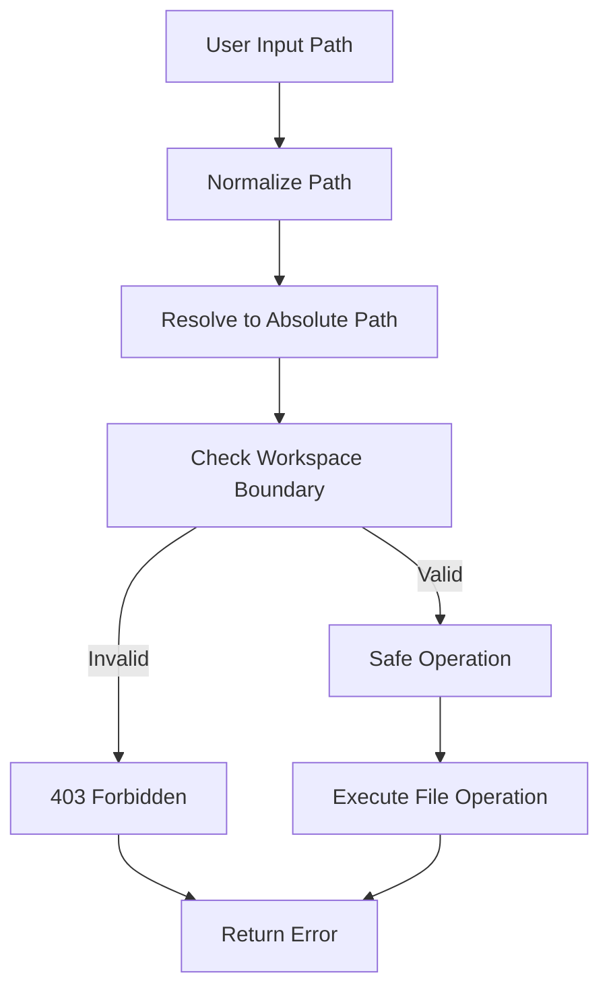
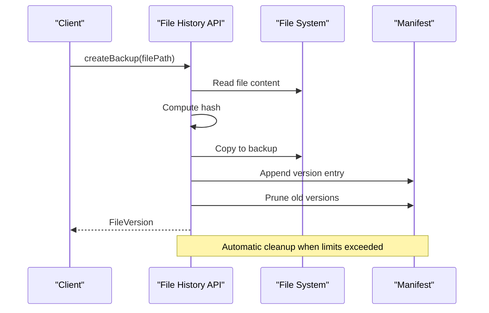
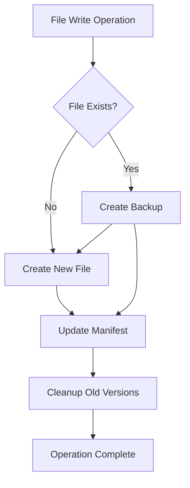

# File Operations & Management

<cite>
**Referenced Files in This Document**
- [index.ts](file://src/server/index.ts)
- [files.ts](file://src/server/files.ts)
- [file-mutations.ts](file://src/server/file-mutations.ts)
- [file-history.ts](file://src/server/file-history.ts)
- [protocol.ts](file://src/shared/protocol.ts)
- [auth.ts](file://src/server/auth.ts)
- [file-operations.spec.ts](file://test/e2e/file-operations.spec.ts)
</cite>

## Table of Contents
1. [Introduction](#introduction)
2. [API Overview](#api-overview)
3. [Authentication & Authorization](#authentication--authorization)
4. [Core Endpoints](#core-endpoints)
5. [File Operations](#file-operations)
6. [Directory Operations](#directory-operations)
7. [File History & Restoration](#file-history--restoration)
8. [Error Handling](#error-handling)
9. [Security Considerations](#security-considerations)
10. [Performance & Limits](#performance--limits)
11. [Implementation Details](#implementation-details)
12. [Troubleshooting Guide](#troubleshooting-guide)

## Introduction

The Quake Web application provides a comprehensive file system operations API that enables clients to browse, search, read, and modify files within a controlled workspace environment. This documentation covers all file-related endpoints including directory listing, file searching, content reading, and various mutation operations with complete parameter specifications, response formats, and practical examples.

The API operates within strict security boundaries to prevent unauthorized access to the host system while providing powerful file management capabilities for development workflows.

## API Overview

The file operations API follows a REST-like interface with the base URL `/api/` and includes the following endpoint families:

```mermaid
graph TD
subgraph "File Operations API"
A[/api/files] --> A1[List Directory]
A --> A2[Search Files]
B[/api/file] --> B1[Read Content]
B --> B2[Write Content]
B --> B3[Patch Content]
B --> B4[Delete File]
C[/api/file/mkdir] --> C1[Create Directory]
D[/api/file/rename] --> D1[Rename Entry]
E[/api/file/history] --> E1[Get History]
F[/api/file/restore] --> F1[Restore Version]
end
```

**Diagram sources**
- [index.ts:568-625](file://src/server/index.ts#L568-L625)

## Authentication & Authorization

All file operations endpoints require authentication except for basic static content serving. The authentication system uses a token-based approach with secure comparison mechanisms.

### Authentication Methods

| Method | Header | Parameter |
|--------|--------|-----------|
| Header | `x-quake-web-token` | N/A |
| Query Parameter | N/A | `token` |

### Token Generation & Storage

The system generates cryptographically secure tokens stored in the workspace directory:

- **Location**: `.quake-code/web-token` in the workspace root
- **Format**: Base64url encoded 24-byte random value
- **Permissions**: File permissions set to 0600 (read/write for owner only)
- **Validation**: Timing-safe constant-time comparison prevents timing attacks

**Section sources**
- [auth.ts:15-29](file://src/server/auth.ts#L15-L29)
- [auth.ts:37-54](file://src/server/auth.ts#L37-L54)

## Core Endpoints

### Directory Listing (`/api/files`)

Lists files and directories within a specified path with filtering options.

**HTTP Method**: GET  
**Authentication**: Required  
**Parameters**:

| Parameter | Type | Required | Default | Description |
|-----------|------|----------|---------|-------------|
| `path` | string | No | `"."` | Target directory path relative to workspace root |
| `hidden` | boolean | No | `false` | Include hidden files/directories (starting with `.`) |
| `generated` | boolean | No | `false` | Include generated directories (node_modules, dist, etc.) |

**Response Format**:
```typescript
{
  entries: WebFileEntry[]
}

interface WebFileEntry {
  name: string;
  path: string;
  type: "file" | "directory";
  size?: number;
  modified?: string;
}
```

**Example Request**:
```
GET /api/files?path=src&hidden=1&generated=1
```

**Example Response**:
```json
{
  "entries": [
    {
      "name": "components",
      "path": "src/components",
      "type": "directory",
      "size": null,
      "modified": "2024-01-15T10:30:00.000Z"
    },
    {
      "name": "main.tsx",
      "path": "src/main.tsx",
      "type": "file",
      "size": 1234,
      "modified": "2024-01-15T14:22:00.000Z"
    }
  ]
}
```

**Section sources**
- [index.ts:568-571](file://src/server/index.ts#L568-L571)
- [files.ts:16-29](file://src/server/files.ts#L16-L29)
- [protocol.ts:124-130](file://src/shared/protocol.ts#L124-L130)

### File Search (`/api/files/search`)

Searches for files containing specified text within the workspace with configurable limits.

**HTTP Method**: GET  
**Authentication**: Required  
**Parameters**:

| Parameter | Type | Required | Default | Description |
|-----------|------|----------|---------|-------------|
| `q` | string | Yes | N/A | Search query text |
| `hidden` | boolean | No | `false` | Include hidden files/directories |
| `generated` | boolean | No | `false` | Include generated directories |
| `limit` | number | No | `200` | Maximum results (1-500) |

**Response Format**:
```typescript
{
  entries: WebFileEntry[]
}
```

**Example Request**:
```
GET /api/files/search?q=component&hidden=1&limit=100
```

**Example Response**:
```json
{
  "entries": [
    {
      "name": "Button.tsx",
      "path": "src/components/Button.tsx",
      "type": "file",
      "size": 567,
      "modified": "2024-01-15T09:15:00.000Z"
    }
  ]
}
```

**Section sources**
- [index.ts:573-576](file://src/server/index.ts#L573-L576)
- [files.ts:31-52](file://src/server/files.ts#L31-L52)

## File Operations

### Read File Content (`/api/file`)

Retrieves the content of a file with size limitations for web preview.

**HTTP Method**: GET  
**Authentication**: Required  
**Parameters**:

| Parameter | Type | Required | Default | Description |
|-----------|------|----------|---------|-------------|
| `path` | string | Yes | N/A | Path to the file to read |

**Response Format**:
```typescript
{
  path: string;
  content: string;
  size: number;
}
```

**Size Limitations**:
- **Preview Limit**: 1,048,576 bytes (1 MB) for web preview
- **Mutation Limit**: 10,485,760 bytes (10 MB) for write/patch operations

**Example Request**:
```
GET /api/file?path=src/main.tsx
```

**Example Response**:
```json
{
  "path": "src/main.tsx",
  "content": "import React from 'react';\n\nfunction App() {\n  return <div>Hello World</div>;\n}\n\nexport default App;",
  "size": 1234
}
```

**Section sources**
- [index.ts:578-580](file://src/server/index.ts#L578-L580)
- [files.ts:54-61](file://src/server/files.ts#L54-L61)

### Write File (`/api/file/write`)

Creates or overwrites a file with the specified content and optional backup creation.

**HTTP Method**: POST  
**Authentication**: Required  
**Request Body**:
```typescript
{
  path: string;
  content: string;
  createBackup?: boolean;
}
```

**Response Format**:
```typescript
{
  path: string;
  bytes: number;
  backedUp: boolean;
}
```

**Behavior**:
- Creates parent directories automatically if they don't exist
- Creates backup before overwriting existing files (unless disabled)
- Enforces 10 MB size limit for content

**Example Request**:
```json
{
  "path": "src/new-file.txt",
  "content": "Hello World",
  "createBackup": true
}
```

**Example Response**:
```json
{
  "path": "src/new-file.txt",
  "bytes": 11,
  "backedUp": true
}
```

**Section sources**
- [index.ts:582-587](file://src/server/index.ts#L582-L587)
- [file-mutations.ts:21-34](file://src/server/file-mutations.ts#L21-L34)

### Patch File (`/api/file/patch`)

Applies text replacements to an existing file with atomic operations.

**HTTP Method**: POST  
**Authentication**: Required  
**Request Body**:
```typescript
{
  path: string;
  patches: Array<{
    oldText: string;
    newText: string;
  }>
}
```

**Response Format**:
```typescript
{
  path: string;
  edits: number;
  backedUp: boolean;
}
```

**Behavior**:
- Validates that each `oldText` exists before replacement
- Creates backup before modification
- Enforces 10 MB size limit
- Performs atomic replacement operations

**Example Request**:
```json
{
  "path": "src/app.tsx",
  "patches": [
    {
      "oldText": "Hello World",
      "newText": "Hello Universe"
    }
  ]
}
```

**Example Response**:
```json
{
  "path": "src/app.tsx",
  "edits": 1,
  "backedUp": true
}
```

**Section sources**
- [index.ts:589-594](file://src/server/index.ts#L589-L594)
- [file-mutations.ts:75-98](file://src/server/file-mutations.ts#L75-L98)

### Delete File (`/api/file/delete`)

Deletes a file or directory with recursive deletion support.

**HTTP Method**: POST  
**Authentication**: Required  
**Request Body**:
```typescript
{
  path: string;
}
```

**Response Format**:
```typescript
{
  path: string;
  wasDirectory: boolean;
}
```

**Behavior**:
- Supports both files and directories
- Recursively deletes directories
- Creates backup for files before deletion
- Returns whether the deleted item was a directory

**Example Request**:
```json
{
  "path": "src/temp-file.txt"
}
```

**Example Response**:
```json
{
  "path": "src/temp-file.txt",
  "wasDirectory": false
}
```

**Section sources**
- [index.ts:596-600](file://src/server/index.ts#L596-L600)
- [file-mutations.ts:36-49](file://src/server/file-mutations.ts#L36-L49)

## Directory Operations

### Create Directory (`/api/file/mkdir`)

Creates a new directory with automatic parent directory creation.

**HTTP Method**: POST  
**Authentication**: Required  
**Request Body**:
```typescript
{
  path: string;
}
```

**Response Format**:
```typescript
{
  path: string;
}
```

**Behavior**:
- Creates all parent directories if they don't exist
- Returns error if directory already exists
- Enforces workspace boundary restrictions

**Example Request**:
```json
{
  "path": "src/components/ui"
}
```

**Example Response**:
```json
{
  "path": "src/components/ui"
}
```

**Section sources**
- [index.ts:602-606](file://src/server/index.ts#L602-L606)
- [file-mutations.ts:51-57](file://src/server/file-mutations.ts#L51-L57)

### Rename Entry (`/api/file/rename`)

Renames or moves files and directories with validation.

**HTTP Method**: POST  
**Authentication**: Required  
**Request Body**:
```typescript
{
  from: string;
  to: string;
}
```

**Response Format**:
```typescript
{
  from: string;
  to: string;
}
```

**Behavior**:
- Validates that source exists and destination doesn't exist
- Creates parent directories for destination if needed
- Supports renaming within the same directory or moving between directories
- Enforces workspace boundary restrictions

**Example Request**:
```json
{
  "from": "src/old-name.txt",
  "to": "src/new-name.txt"
}
```

**Example Response**:
```json
{
  "from": "src/old-name.txt",
  "to": "src/new-name.txt"
}
```

**Section sources**
- [index.ts:608-612](file://src/server/index.ts#L608-L612)
- [file-mutations.ts:59-73](file://src/server/file-mutations.ts#L59-L73)

## File History & Restoration

### Get File History (`/api/file/history`)

Retrieves version history for a specific file.

**HTTP Method**: GET  
**Authentication**: Required  
**Parameters**:

| Parameter | Type | Required | Default | Description |
|-----------|------|----------|---------|-------------|
| `path` | string | Yes | N/A | Path to the file to get history for |

**Response Format**:
```typescript
{
  versions: FileVersion[]
}

interface FileVersion {
  id: string;
  path: string;
  timestamp: number;
  size: number;
  hash: string;
  backupPath: string;
}
```

**Behavior**:
- Maintains up to 20 versions per file
- Maximum 500 total versions across all files
- Stores backups in `.quake-web/file-history` directory
- Uses SHA-256 hash (first 12 characters) for content verification

**Example Request**:
```
GET /api/file/history?path=src/app.tsx
```

**Example Response**:
```json
{
  "versions": [
    {
      "id": "550e8400-e29b-41d4-a716-446655440000",
      "path": "src/app.tsx",
      "timestamp": 1705321800000,
      "size": 1234,
      "hash": "a1b2c3d4e5f6",
      "backupPath": "/path/to/workspace/.quake-web/file-history/550e8400-e29b-41d4-a716-446655440000.bak"
    }
  ]
}
```

**Section sources**
- [index.ts:614-618](file://src/server/index.ts#L614-L618)
- [file-history.ts:61-64](file://src/server/file-history.ts#L61-L64)

### Restore File Version (`/api/file/restore`)

Restores a specific version of a file to its original location.

**HTTP Method**: POST  
**Authentication**: Required  
**Request Body**:
```typescript
{
  versionId: string;
}
```

**Response Format**:
```typescript
{
  success: boolean;
}
```

**Behavior**:
- Restores content from backup file to original location
- Creates parent directories if needed
- Returns success status based on restoration outcome
- Automatically prunes old versions when limits are exceeded

**Example Request**:
```json
{
  "versionId": "550e8400-e29b-41d4-a716-446655440000"
}
```

**Example Response**:
```json
{
  "success": true
}
```

**Section sources**
- [index.ts:620-625](file://src/server/index.ts#L620-L625)
- [file-history.ts:78-93](file://src/server/file-history.ts#L78-L93)

## Error Handling

The API implements comprehensive error handling with specific HTTP status codes and meaningful error messages.

### Common Error Responses

| Status Code | Error Type | Description |
|-------------|------------|-------------|
| 400 | Bad Request | Invalid parameters, invalid file type, old text not found in patch |
| 401 | Unauthorized | Missing or invalid authentication token |
| 403 | Forbidden | Workspace boundary violation, insufficient permissions |
| 404 | Not Found | File or directory not found |
| 409 | Conflict | Resource already exists (directory creation) |
| 413 | Payload Too Large | File exceeds size limits (1 MB preview, 10 MB write/patch) |

### Error Response Format
```typescript
{
  error: string;
}
```

**Section sources**
- [index.ts:656-658](file://src/server/index.ts#L656-L658)
- [files.ts:19-20](file://src/server/files.ts#L19-L20)
- [file-mutations.ts:37-49](file://src/server/file-mutations.ts#L37-L49)

## Security Considerations

### Workspace Boundary Protection

All file operations enforce strict workspace boundary checks:



**Diagram sources**
- [files.ts:84-101](file://src/server/files.ts#L84-L101)
- [file-mutations.ts:128-136](file://src/server/file-mutations.ts#L128-L136)

### Generated Directory Filtering

The system automatically filters out generated directories by default:

- `node_modules`
- `dist`
- `build`
- `coverage`
- `.next`
- `.turbo`
- `.vite`
- `out`

### Hidden File Protection

Hidden files (starting with `.`) are excluded from listings by default to prevent accidental exposure of sensitive configuration files.

**Section sources**
- [files.ts:74-78](file://src/server/files.ts#L74-L78)
- [file-mutations.ts:100-126](file://src/server/file-mutations.ts#L100-L126)

## Performance & Limits

### Size Limits

| Operation | Limit | Purpose |
|-----------|-------|---------|
| File Preview | 1,048,576 bytes (1 MB) | Web browser memory constraints |
| File Write/Patch | 10,485,760 bytes (10 MB) | Server memory and performance limits |
| Search Results | 500 items | Prevent excessive memory usage |
| Directory Entries | 300 items | UI performance optimization |

### Rate Limiting

The server implements several protective measures:
- **Single Flight Pattern**: Prevents concurrent operations on the same resource
- **Async Locks**: Ensures thread-safe file operations
- **Memory Constraints**: Limits on search results and directory entries

### Encoding Considerations

- **File Content**: UTF-8 encoding for all file operations
- **API Responses**: UTF-8 character encoding
- **Path Handling**: Cross-platform path normalization
- **Search Operations**: Case-insensitive text matching

**Section sources**
- [files.ts:59](file://src/server/files.ts#L59)
- [file-mutations.ts:14](file://src/server/file-mutations.ts#L14)
- [files.ts:34](file://src/server/files.ts#L34)

## Implementation Details

### File History Management

The file history system maintains version control with automatic cleanup:



**Diagram sources**
- [file-history.ts:35-59](file://src/server/file-history.ts#L35-L59)
- [file-history.ts:104-116](file://src/server/file-history.ts#L104-L116)

### Backup Creation Workflow

Each write operation triggers automatic backup creation:



**Diagram sources**
- [file-mutations.ts:21-34](file://src/server/file-mutations.ts#L21-L34)
- [file-history.ts:95-116](file://src/server/file-history.ts#L95-L116)

**Section sources**
- [file-history.ts:20-27](file://src/server/file-history.ts#L20-L27)
- [file-history.ts:118-152](file://src/server/file-history.ts#L118-L152)

## Troubleshooting Guide

### Common Issues and Solutions

#### Authentication Problems
**Symptoms**: 401 Unauthorized responses
**Causes**: Missing or incorrect token header/parameter
**Solutions**: 
- Verify token is included in `x-quake-web-token` header
- Check token file permissions (should be 0600)
- Regenerate token if corrupted

#### Workspace Boundary Violations
**Symptoms**: 403 Forbidden errors
**Causes**: Attempting to access paths outside workspace
**Solutions**:
- Use only relative paths from workspace root
- Avoid `../` path traversal attempts
- Check workspace configuration

#### File Size Exceeded
**Symptoms**: 413 Payload Too Large errors
**Causes**: File larger than configured limits
**Solutions**:
- Split large files into smaller components
- Use external storage for large assets
- Compress files before upload

#### Permission Denied
**Symptoms**: 403 Forbidden during file operations
**Causes**: Insufficient filesystem permissions
**Solutions**:
- Check file/directory permissions
- Run with appropriate user privileges
- Verify workspace directory accessibility

#### Search Performance Issues
**Symptoms**: Slow search responses
**Causes**: Large workspace with many files
**Solutions**:
- Use `limit` parameter to constrain results
- Filter with `hidden=false` and `generated=false`
- Consider indexing alternatives for large projects

**Section sources**
- [auth.ts:22-29](file://src/server/auth.ts#L22-L29)
- [files.ts:19](file://src/server/files.ts#L19)
- [file-mutations.ts:79](file://src/server/file-mutations.ts#L79)

### Testing File Operations

The test suite provides comprehensive examples of all file operations:

**Section sources**
- [file-operations.spec.ts:1-109](file://test/e2e/file-operations.spec.ts#L1-L109)
