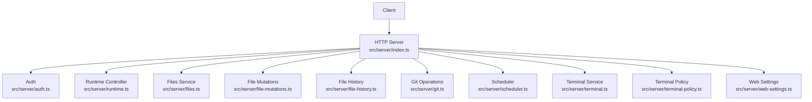
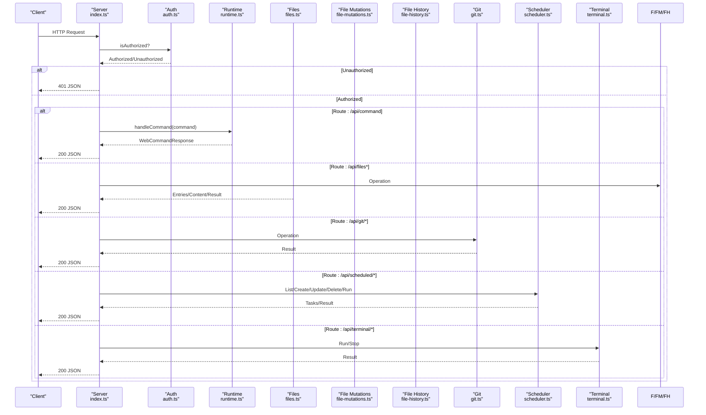
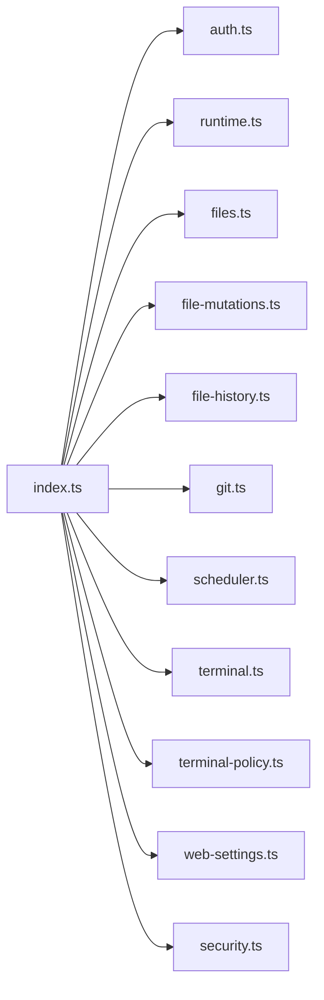

# HTTP Endpoints

<cite>
**Referenced Files in This Document**
- [index.ts](file://src/server/index.ts)
- [auth.ts](file://src/server/auth.ts)
- [files.ts](file://src/server/files.ts)
- [file-mutations.ts](file://src/server/file-mutations.ts)
- [file-history.ts](file://src/server/file-history.ts)
- [git.ts](file://src/server/git.ts)
- [scheduler.ts](file://src/server/scheduler.ts)
- [terminal.ts](file://src/server/terminal.ts)
- [terminal-policy.ts](file://src/server/terminal-policy.ts)
- [web-settings.ts](file://src/server/web-settings.ts)
- [runtime.ts](file://src/server/runtime.ts)
- [protocol.ts](file://src/shared/protocol.ts)
- [security.ts](file://src/server/security.ts)
</cite>

## Table of Contents
1. [Introduction](#introduction)
2. [Project Structure](#project-structure)
3. [Core Components](#core-components)
4. [Architecture Overview](#architecture-overview)
5. [Detailed Endpoint Documentation](#detailed-endpoint-documentation)
6. [Dependency Analysis](#dependency-analysis)
7. [Performance Considerations](#performance-considerations)
8. [Troubleshooting Guide](#troubleshooting-guide)
9. [Conclusion](#conclusion)

## Introduction
This document provides comprehensive documentation for all HTTP API endpoints exposed by the server. It covers endpoint URLs, HTTP methods, authentication requirements, request/response schemas, error handling, and practical usage examples. Endpoints are grouped into logical categories: session management, file operations, terminal commands, workspace management, Git operations, scheduling, and settings.

## Project Structure
The server is implemented as a single HTTP server that routes requests to specialized services. Authentication is enforced for API routes, and most endpoints return JSON responses. Static assets are served for the web client.

**Diagram sources**
- [index.ts:401-662](file://src/server/index.ts#L401-L662)
- [auth.ts:6-56](file://src/server/auth.ts#L6-L56)
- [runtime.ts:12-30](file://src/server/runtime.ts#L12-L30)
- [files.ts:13-131](file://src/server/files.ts#L13-L131)
- [file-mutations.ts:13-140](file://src/server/file-mutations.ts#L13-L140)
- [file-history.ts:20-159](file://src/server/file-history.ts#L20-L159)
- [git.ts:165-334](file://src/server/git.ts#L165-L334)
- [scheduler.ts:54-242](file://src/server/scheduler.ts#L54-L242)
- [terminal.ts:21-87](file://src/server/terminal.ts#L21-L87)
- [terminal-policy.ts:21-39](file://src/server/terminal-policy.ts#L21-L39)
- [web-settings.ts:13-64](file://src/server/web-settings.ts#L13-L64)

**Section sources**
- [index.ts:401-662](file://src/server/index.ts#L401-L662)

## Core Components
- Authentication: Enforced via a shared secret token passed via header or query parameter. Unauthorized requests receive a 401 response.
- Runtime: Manages sessions, models, plan mode, and executes commands.
- Files: Lists, reads, and searches files within the workspace.
- File Mutations: Writes, deletes, renames, creates directories, and applies text patches with optional backups.
- File History: Maintains versioned backups and enables restoration.
- Git: Status, diff, stage/unstage, commit, push, branch, and PR creation.
- Scheduler: Persistent cron-like scheduler for automated tasks.
- Terminal: Runs commands with policy enforcement and streaming events.
- Settings: Reads and patches web UI settings.

**Section sources**
- [auth.ts:15-29](file://src/server/auth.ts#L15-L29)
- [runtime.ts:12-30](file://src/server/runtime.ts#L12-L30)
- [files.ts:13-131](file://src/server/files.ts#L13-L131)
- [file-mutations.ts:13-140](file://src/server/file-mutations.ts#L13-L140)
- [file-history.ts:20-159](file://src/server/file-history.ts#L20-L159)
- [git.ts:165-334](file://src/server/git.ts#L165-L334)
- [scheduler.ts:54-242](file://src/server/scheduler.ts#L54-L242)
- [terminal.ts:21-87](file://src/server/terminal.ts#L21-L87)
- [web-settings.ts:13-64](file://src/server/web-settings.ts#L13-L64)

## Architecture Overview
The server exposes a unified API surface. Requests are routed in a central handler that validates authentication for API endpoints, then delegates to domain-specific services. Responses are JSON-encoded with appropriate status codes. Some endpoints stream terminal output via Server-Sent Events.

**Diagram sources**
- [index.ts:401-662](file://src/server/index.ts#L401-L662)
- [auth.ts:15-29](file://src/server/auth.ts#L15-L29)
- [runtime.ts:255-374](file://src/server/runtime.ts#L255-L374)
- [files.ts:16-61](file://src/server/files.ts#L16-L61)
- [file-mutations.ts:21-98](file://src/server/file-mutations.ts#L21-L98)
- [file-history.ts:35-93](file://src/server/file-history.ts#L35-L93)
- [git.ts:165-334](file://src/server/git.ts#L165-L334)
- [scheduler.ts:75-154](file://src/server/scheduler.ts#L75-L154)
- [terminal.ts:36-85](file://src/server/terminal.ts#L36-L85)

## Detailed Endpoint Documentation

### Authentication and Authorization
- Header: X-Quake-Web-Token
- Query parameter: token
- Behavior: If enabled, all /api/* routes require a valid token; otherwise, requests are rejected with 401.

**Section sources**
- [auth.ts:15-29](file://src/server/auth.ts#L15-L29)
- [index.ts:404-407](file://src/server/index.ts#L404-L407)

### Session Management
- POST /api/command
  - Purpose: Execute runtime commands (e.g., prompt, abort, new_session, open_workspace, switch_session, fork_session, set_*).
  - Authentication: Required if auth is enabled.
  - Request body: WebClientCommand (see protocol).
  - Response: WebCommandResponse (success or error).
  - Errors: 400 for unsupported command; 500 for exceptions.
  - Example curl:
    - curl -X POST http://127.0.0.1:3737/api/command -H "Content-Type: application/json" -H "X-Quake-Web-Token: YOUR_TOKEN" -d '{"type":"prompt","message":"Hello"}'

- GET /api/state
  - Purpose: Current runtime state and session messages.
  - Response: { state: WebSessionState, messages: AgentMessage[], locks: { terminal: boolean } }.

- GET /api/sessions
  - Purpose: List sessions; optional query param all=1 to list all.
  - Response: { sessions: WebSessionSummary[] }.

- GET /api/settings
  - Purpose: Runtime settings (default provider/model/thinking, theme, image policies).
  - Response: { settings: WebRuntimeSettings }.

- GET /api/models
  - Purpose: Available models with configuration status.
  - Response: { models: WebModelSummary[] }.

- GET /api/commands
  - Purpose: List available commands (built-in, prompts, skills).
  - Response: { commands: WebCommandInfo[] }.

- GET /api/extensions
  - Purpose: List extensions with enablement status.
  - Response: { extensions: { name, description, enabled }[] }.

- POST /api/extensions/toggle
  - Purpose: Toggle extension enabled/disabled.
  - Request body: { name, enabled }.
  - Response: { success, name, enabled }.

- GET /api/skills
  - Purpose: List skills.
  - Response: { skills: { name, description, source }[] }.

- GET /api/prompts
  - Purpose: List prompt templates.
  - Response: { prompts: { name, description }[] }.

- GET /api/web-settings
  - Purpose: Read web UI settings.
  - Response: { settings: WebSettings }.

- POST /api/web-settings
  - Purpose: Patch web UI settings.
  - Request body: Partial WebSettings.
  - Response: { settings: WebSettings }.

**Section sources**
- [index.ts:413-466](file://src/server/index.ts#L413-L466)
- [index.ts:626-630](file://src/server/index.ts#L626-L630)
- [runtime.ts:36-54](file://src/server/runtime.ts#L36-L54)
- [runtime.ts:208-211](file://src/server/runtime.ts#L208-L211)
- [runtime.ts:172-181](file://src/server/runtime.ts#L172-L181)
- [runtime.ts:233-259](file://src/server/runtime.ts#L233-L259)
- [web-settings.ts:21-60](file://src/server/web-settings.ts#L21-L60)
- [protocol.ts:171-197](file://src/shared/protocol.ts#L171-L197)

### File Operations
- GET /api/files
  - Purpose: List directory entries.
  - Query params: path (default "."), hidden (1 to include hidden), generated (1 to include generated dirs).
  - Response: { entries: WebFileEntry[] }.

- GET /api/files/search
  - Purpose: Search files recursively.
  - Query params: q (required), hidden (1 to include hidden), generated (1 to include generated), limit (default 200).
  - Response: { entries: WebFileEntry[] }.

- GET /api/file
  - Purpose: Read file content (preview, up to 1MB).
  - Query params: path (default ".").
  - Response: { path, content, size }.

- POST /api/file/write
  - Purpose: Write file content; optionally creates backup.
  - Request body: { path, content, createBackup?: boolean }.
  - Response: { path, bytes, backedUp }.

- POST /api/file/patch
  - Purpose: Apply text patches to existing file; creates backup.
  - Request body: { path, patches: { oldText, newText }[] }.
  - Response: { path, edits, backedUp }.

- POST /api/file/delete
  - Purpose: Delete file or directory; creates backup for files.
  - Request body: { path }.
  - Response: { path, wasDirectory }.

- POST /api/file/mkdir
  - Purpose: Create directory.
  - Request body: { path }.
  - Response: { path }.

- POST /api/file/rename
  - Purpose: Rename/move file or directory.
  - Request body: { from, to }.
  - Response: { from, to }.

- GET /api/file/history
  - Purpose: Get version history for a path.
  - Query params: path.
  - Response: { versions: FileVersion[] }.

- POST /api/file/restore
  - Purpose: Restore a specific version to workspace.
  - Request body: { versionId }.
  - Response: { success: boolean }.

Notes:
- Directory listings exclude hidden entries by default and filter out common generated directories.
- File reads enforce a maximum preview size.
- Mutations enforce workspace root boundaries and optional backups.

**Section sources**
- [index.ts:568-625](file://src/server/index.ts#L568-L625)
- [files.ts:16-61](file://src/server/files.ts#L16-L61)
- [files.ts:31-52](file://src/server/files.ts#L31-L52)
- [file-mutations.ts:21-98](file://src/server/file-mutations.ts#L21-L98)
- [file-history.ts:35-93](file://src/server/file-history.ts#L35-L93)
- [protocol.ts:124-130](file://src/shared/protocol.ts#L124-L130)

### Terminal Commands
- POST /api/terminal/run
  - Purpose: Run a command with policy enforcement; emits SSE events for output.
  - Request body: { id?, command, timeoutMs? }.
  - Response: { id, command, exitCode, signal, stdout, stderr, durationMs, timedOut }.
  - SSE events: terminal_start, terminal_output, terminal_end.

- POST /api/terminal/stop
  - Purpose: Stop a running command by id.
  - Request body: { id }.
  - Response: { stopped: boolean }.

- WebSocket /api/terminal (real-time interactive terminal)
  - Purpose: Real-time bidirectional terminal via node-pty.
  - Authentication: Via server-side attach hook.

Policy:
- Mode "safe": Blocks dangerous patterns (e.g., rm -rf, git reset --hard, piping downloads to shells).
- Mode "allow-all": Allows any command.
- Mode "disabled": Disallows all commands.

**Section sources**
- [index.ts:631-650](file://src/server/index.ts#L631-L650)
- [index.ts:662](file://src/server/index.ts#L662)
- [terminal.ts:36-85](file://src/server/terminal.ts#L36-L85)
- [terminal-policy.ts:21-39](file://src/server/terminal-policy.ts#L21-L39)

### Workspace Management
- GET /api/workspace/roots
  - Purpose: Enumerate workspace roots (current, home, Desktop, Downloads, Documents, drives).
  - Response: { roots: { label, path, kind }[] }.

- GET /api/workspace/browse
  - Purpose: Browse folder contents.
  - Query params: path (optional).
  - Response: { path, parent?, entries: { name, path }[] }.

- GET /api/workspace/changes
  - Purpose: Summarize Git changes (files count, added, removed, affected paths).
  - Response: { files, added, removed, paths }.

**Section sources**
- [index.ts:466-477](file://src/server/index.ts#L466-L477)
- [index.ts:123-147](file://src/server/index.ts#L123-L147)
- [index.ts:149-162](file://src/server/index.ts#L149-L162)
- [index.ts:181-209](file://src/server/index.ts#L181-L209)

### Git Operations
- GET /api/git/status
  - Purpose: Repository status with branch, ahead/behind counts, and file changes.
  - Response: { branch, ahead, behind, files: GitFile[] }.

- GET /api/git/branch
  - Purpose: Current branch.
  - Response: { branch }.

- GET /api/git/diff
  - Purpose: Unified diff for a path (working tree or staged).
  - Query params: path, staged (0|1).
  - Response: { path, diff }.

- POST /api/git/stage
  - Purpose: Stage files.
  - Request body: { paths: string[] }.
  - Response: { ok, error? }.

- POST /api/git/unstage
  - Purpose: Unstage files.
  - Request body: { paths: string[] }.
  - Response: { ok, error? }.

- POST /api/git/commit
  - Purpose: Commit staged changes.
  - Request body: { message }.
  - Response: { ok, hash?, error? }.

- POST /api/git/push
  - Purpose: Push current branch; sets upstream if missing.
  - Response: { ok, error? }.

- POST /api/git/pr
  - Purpose: Create Pull/Merge Request via GitHub CLI (gh).
  - Request body: { title, body }.
  - Response: { ok, url?, error? }.

**Section sources**
- [index.ts:478-513](file://src/server/index.ts#L478-L513)
- [git.ts:165-334](file://src/server/git.ts#L165-L334)

### Scheduling
- GET /api/scheduled
  - Purpose: List tasks.
  - Response: { tasks: ScheduledTask[] }.

- POST /api/scheduled
  - Purpose: Create a task.
  - Request body: { name, cron, prompt, enabled? }.
  - Response: { task: ScheduledTask }.

- POST /api/scheduled/:id/run
  - Purpose: Run a task immediately.
  - Response: { ok: true }.

- PATCH /api/scheduled/:id
  - Purpose: Update a task.
  - Request body: { name?, cron?, prompt?, enabled? }.
  - Response: { task: ScheduledTask }.

- DELETE /api/scheduled/:id
  - Purpose: Remove a task.
  - Response: { ok: true }.

Errors:
- 400 for invalid cron or missing fields.
- 404 for missing task.
- 503 when runner is not attached.

**Section sources**
- [index.ts:520-563](file://src/server/index.ts#L520-L563)
- [scheduler.ts:75-154](file://src/server/scheduler.ts#L75-L154)
- [scheduler.ts:250-257](file://src/server/scheduler.ts#L250-L257)

### Settings
- GET /api/settings
  - Purpose: Runtime settings.
  - Response: { settings: WebRuntimeSettings }.

- GET /api/web-settings
  - Purpose: Web UI settings.
  - Response: { settings: WebSettings }.

- POST /api/web-settings
  - Purpose: Patch web UI settings.
  - Request body: Partial WebSettings.
  - Response: { settings: WebSettings }.

- GET /api/models
  - Purpose: Available models.
  - Response: { models: WebModelSummary[] }.

- GET /api/commands
  - Purpose: Commands list.
  - Response: { commands: WebCommandInfo[] }.

- GET /api/extensions
  - Purpose: Extensions list with enablement.
  - Response: { extensions: { name, description, enabled }[] }.

- POST /api/extensions/toggle
  - Purpose: Toggle extension.
  - Request body: { name, enabled }.
  - Response: { success, name, enabled }.

**Section sources**
- [index.ts:425-449](file://src/server/index.ts#L425-L449)
- [web-settings.ts:21-60](file://src/server/web-settings.ts#L21-L60)
- [runtime.ts:172-181](file://src/server/runtime.ts#L172-L181)
- [runtime.ts:233-259](file://src/server/runtime.ts#L233-L259)

## Dependency Analysis
- Central routing depends on:
  - Auth for token validation.
  - Runtime for command execution and state.
  - Files/FileMutations/FileHistory for file operations.
  - Git for VCS operations.
  - Scheduler for cron tasks.
  - Terminal for command execution and policy.
  - WebSettings for UI preferences.
- Security validation ensures:
  - Remote access is only allowed when explicitly enabled.
  - Workspace root is within allowlist when configured.

**Diagram sources**
- [index.ts:401-662](file://src/server/index.ts#L401-L662)
- [auth.ts:6-56](file://src/server/auth.ts#L6-L56)
- [runtime.ts:12-30](file://src/server/runtime.ts#L12-L30)
- [files.ts:13-131](file://src/server/files.ts#L13-L131)
- [file-mutations.ts:13-140](file://src/server/file-mutations.ts#L13-L140)
- [file-history.ts:20-159](file://src/server/file-history.ts#L20-L159)
- [git.ts:165-334](file://src/server/git.ts#L165-L334)
- [scheduler.ts:54-242](file://src/server/scheduler.ts#L54-L242)
- [terminal.ts:21-87](file://src/server/terminal.ts#L21-L87)
- [terminal-policy.ts:21-39](file://src/server/terminal-policy.ts#L21-L39)
- [web-settings.ts:13-64](file://src/server/web-settings.ts#L13-L64)
- [security.ts:24-41](file://src/server/security.ts#L24-L41)

**Section sources**
- [index.ts:56-61](file://src/server/index.ts#L56-L61)
- [security.ts:24-41](file://src/server/security.ts#L24-L41)

## Performance Considerations
- File listing and search are bounded (limits on entries and recursion depth).
- File previews are capped at 1 MB.
- Terminal output buffers are bounded and trimmed to prevent memory growth.
- Scheduler ticks run at a fixed interval and avoid overlapping executions of the same task.
- Git operations use timeouts and bounded buffers.

[No sources needed since this section provides general guidance]

## Troubleshooting Guide
Common errors and resolutions:
- 401 Unauthorized: Ensure X-Quake-Web-Token header or token query parameter matches the server token.
- 403 Forbidden: Path traversal attempts outside workspace root are rejected.
- 404 Not Found: Resource does not exist (files, sessions, tasks).
- 413 Payload Too Large: File preview exceeds limits; use smaller files or download via other means.
- 422 Unprocessable Entity: Invalid cron expressions or missing fields in requests.
- 500 Internal Server Error: Unexpected runtime exceptions; check server logs.

**Section sources**
- [auth.ts:22-29](file://src/server/auth.ts#L22-L29)
- [files.ts:19-20](file://src/server/files.ts#L19-L20)
- [files.ts:59](file://src/server/files.ts#L59)
- [scheduler.ts:90-92](file://src/server/scheduler.ts#L90-L92)
- [index.ts:231-234](file://src/server/index.ts#L231-L234)

## Conclusion
The server provides a cohesive set of HTTP APIs for managing sessions, files, terminals, Git, scheduling, and settings. Authentication is mandatory for API routes, and strict security validations protect workspace boundaries. The design favors explicit schemas and clear error signaling, enabling robust client integrations.
