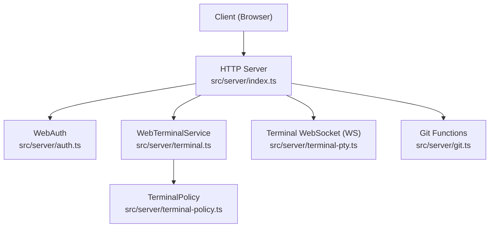
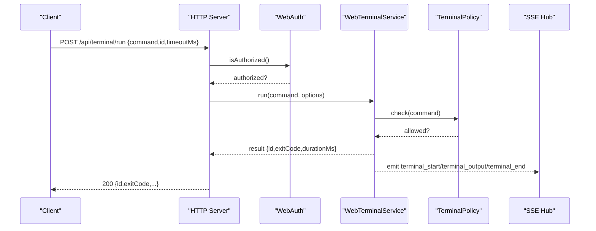
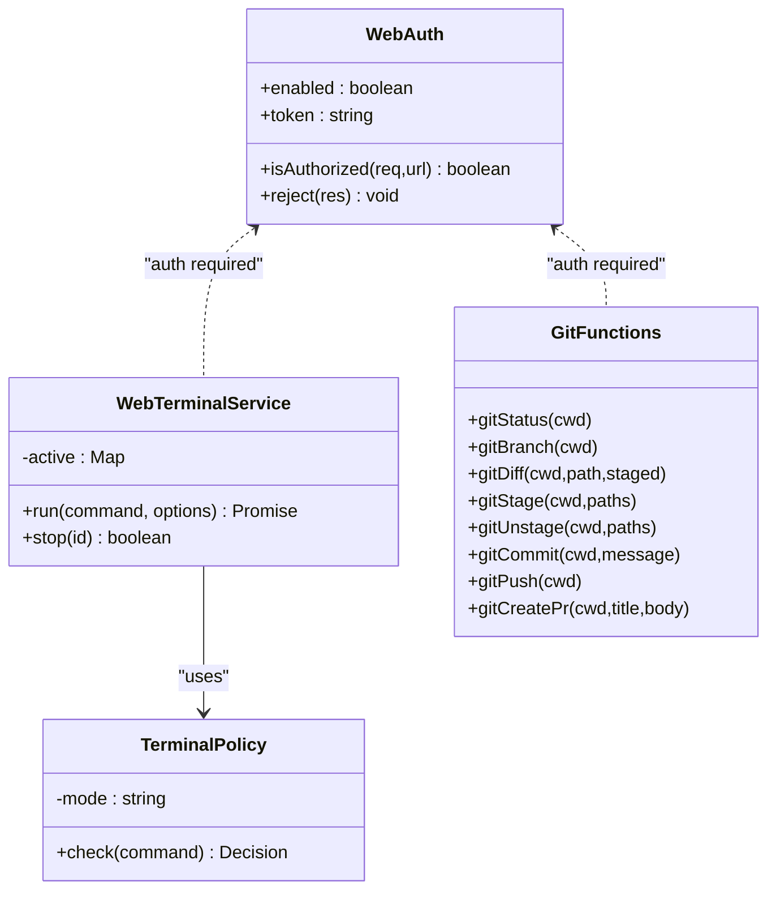

# Terminal & Git Operations

<cite>
**Referenced Files in This Document**
- [index.ts](file://src/server/index.ts)
- [terminal.ts](file://src/server/terminal.ts)
- [git.ts](file://src/server/git.ts)
- [terminal-policy.ts](file://src/server/terminal-policy.ts)
- [terminal-pty.ts](file://src/server/terminal-pty.ts)
- [auth.ts](file://src/server/auth.ts)
- [security.ts](file://src/server/security.ts)
- [protocol.ts](file://src/shared/protocol.ts)
- [api.ts](file://src/client/src/lib/api.ts)
- [TerminalPanel.tsx](file://src/client/src/components/terminal/TerminalPanel.tsx)
- [XtermTerminal.tsx](file://src/client/src/components/terminal/XtermTerminal.tsx)
- [terminal-utils.ts](file://src/client/src/components/terminal/terminal-utils.ts)
- [smoke.mjs](file://scripts/smoke.mjs)
</cite>

## Table of Contents
1. [Introduction](#introduction)
2. [Project Structure](#project-structure)
3. [Core Components](#core-components)
4. [Architecture Overview](#architecture-overview)
5. [Detailed Component Analysis](#detailed-component-analysis)
6. [Dependency Analysis](#dependency-analysis)
7. [Performance Considerations](#performance-considerations)
8. [Troubleshooting Guide](#troubleshooting-guide)
9. [Conclusion](#conclusion)

## Introduction
This document provides comprehensive documentation for terminal and Git operation endpoints exposed by the server. It covers:
- Terminal execution endpoints: POST /api/terminal/run and POST /api/terminal/stop
- Interactive WebSocket terminal: GET /api/terminal
- Git operations: GET /api/git/status, GET /api/git/branch, GET /api/git/diff, POST /api/git/stage, POST /api/git/unstage, POST /api/git/commit, POST /api/git/push, and POST /api/git/pr

It explains authentication requirements, command execution policies, output streaming, error handling, and practical usage examples for each endpoint category.

## Project Structure
The server exposes HTTP endpoints and a WebSocket endpoint under /api. Terminal operations are handled by a dedicated service with policy enforcement. Git operations are implemented as pure functions that execute git commands with timeouts and buffer limits. Authentication is enforced centrally, and SSE is used to stream terminal output.

**Diagram sources**
- [index.ts:401-662](file://src/server/index.ts#L401-L662)
- [auth.ts:6-55](file://src/server/auth.ts#L6-L55)
- [terminal.ts:21-86](file://src/server/terminal.ts#L21-L86)
- [terminal-policy.ts:21-38](file://src/server/terminal-policy.ts#L21-L38)
- [terminal-pty.ts:25-94](file://src/server/terminal-pty.ts#L25-L94)
- [git.ts:94-333](file://src/server/git.ts#L94-L333)

**Section sources**
- [index.ts:401-662](file://src/server/index.ts#L401-L662)

## Core Components
- WebTerminalService: Executes commands via the OS shell, enforces policy, streams output via SSE, and tracks active processes.
- TerminalPolicy: Enforces safe/allow-all/disabled modes with predefined dangerous patterns.
- Terminal WebSocket: Provides interactive terminal sessions via node-pty with resize and input handling.
- Git Functions: Pure functions wrapping git and gh commands with timeouts, buffer limits, and structured responses.
- Authentication: Centralized token-based auth via header or query param.

**Section sources**
- [terminal.ts:21-86](file://src/server/terminal.ts#L21-L86)
- [terminal-policy.ts:21-38](file://src/server/terminal-policy.ts#L21-L38)
- [terminal-pty.ts:25-94](file://src/server/terminal-pty.ts#L25-L94)
- [git.ts:94-333](file://src/server/git.ts#L94-L333)
- [auth.ts:6-55](file://src/server/auth.ts#L6-L55)

## Architecture Overview
The server routes requests to handlers that enforce authentication, then delegates to services or functions. Terminal output is streamed via SSE, and interactive terminals use WebSocket with node-pty.

**Diagram sources**
- [index.ts:631-650](file://src/server/index.ts#L631-L650)
- [terminal.ts:36-85](file://src/server/terminal.ts#L36-L85)
- [terminal-policy.ts:24-32](file://src/server/terminal-policy.ts#L24-L32)
- [protocol.ts:165-169](file://src/shared/protocol.ts#L165-L169)

## Detailed Component Analysis

### Authentication and Authorization
- Authentication is enabled when the QUAKE_WEB_AUTH environment variable is not "0".
- Tokens can be provided via X-Quake-Web-Token header or token query parameter.
- The server rejects unauthorized requests with 401 and injects the token into the client HTML when serving static assets.

Practical usage:
- Include header: X-Quake-Web-Token: YOUR_TOKEN
- Or append: ?token=YOUR_TOKEN

**Section sources**
- [auth.ts:6-55](file://src/server/auth.ts#L6-L55)
- [index.ts:404-407](file://src/server/index.ts#L404-L407)
- [api.ts:9-25](file://src/client/src/lib/api.ts#L9-L25)

### Terminal Execution Endpoints

#### POST /api/terminal/run
- Purpose: Execute a single command and stream output via SSE.
- Request body:
  - id: optional UUID to correlate events
  - command: string command to execute
  - timeoutMs: optional execution timeout (bounded 1sÔÇô120s)
- Response:
  - id, command, exitCode, signal, stdout, stderr, durationMs, timedOut
- SSE events emitted:
  - terminal_start: { id, command }
  - terminal_output: { id, stream, text }
  - terminal_end: { id, exitCode, signal, timedOut, durationMs }

Execution policy:
- Enforced by TerminalPolicy with mode "safe"|"allow-all"|"disabled".
- Dangerous patterns include rm -rf, git reset --hard, curl|wget piped to shells, etc.

Timeout and buffering:
- Minimum 1 second, maximum 120 seconds.
- Output buffers are capped at 256 KiB (sliding window).

Stop command:
- Use POST /api/terminal/stop to terminate a running process by id.

Example usage:
- Run a command and listen to SSE events for incremental output.

**Section sources**
- [index.ts:631-650](file://src/server/index.ts#L631-L650)
- [terminal.ts:36-85](file://src/server/terminal.ts#L36-L85)
- [terminal-policy.ts:24-32](file://src/server/terminal-policy.ts#L24-L32)
- [protocol.ts:165-169](file://src/shared/protocol.ts#L165-L169)

#### POST /api/terminal/stop
- Purpose: Stop a running terminal process by id.
- Request body: { id }
- Response: { stopped: boolean }

Behavior:
- Returns true if a matching process was found and terminated.

**Section sources**
- [index.ts:646-650](file://src/server/index.ts#L646-L650)
- [terminal.ts:29-34](file://src/server/terminal.ts#L29-L34)

#### GET /api/terminal (Interactive WebSocket)
- Purpose: Provide an interactive terminal session via WebSocket.
- Query params:
  - cols, rows: initial terminal size
  - token: authentication token
- Messages:
  - Client to Server: { t: "i", d: string } for input, { t: "r", c: number, r: number } for resize
  - Server to Client: { t: "o", d: string } for output, { t: "x", code: number } on exit

Behavior:
- Spawns a PTY using node-pty with appropriate shell per platform.
- Handles resizing and graceful cleanup on close.

**Section sources**
- [index.ts:661-662](file://src/server/index.ts#L661-L662)
- [terminal-pty.ts:25-94](file://src/server/terminal-pty.ts#L25-L94)
- [XtermTerminal.tsx:98](file://src/client/src/components/terminal/XtermTerminal.tsx#L98)

### Git Operation Endpoints

#### GET /api/git/status
- Purpose: Get repository status including branch ahead/behind counts and changed files.
- Response: { branch, ahead, behind, files[] }
  - files[] items include path, index/worktree indicators, staged flag, and add/remove counts.

Implementation highlights:
- Uses git status --porcelain=v1 -b with numstat for per-file stats.
- Parses branch info and normalizes renamed paths.

**Section sources**
- [index.ts:478-481](file://src/server/index.ts#L478-L481)
- [git.ts:165-212](file://src/server/git.ts#L165-L212)

#### GET /api/git/branch
- Purpose: Get current branch name.
- Response: { branch }

**Section sources**
- [index.ts:482-484](file://src/server/index.ts#L482-L484)
- [git.ts:304-311](file://src/server/git.ts#L304-L311)

#### GET /api/git/diff
- Purpose: Get unified diff for a given path.
- Query params:
  - path: target path
  - staged: 0|1 to diff working tree vs staged
- Response: { path, diff }

Notes:
- For untracked files, synthesizes a diff against /dev/null.

**Section sources**
- [index.ts:486-489](file://src/server/index.ts#L486-L489)
- [git.ts:218-239](file://src/server/git.ts#L218-L239)

#### POST /api/git/stage
- Purpose: Stage files.
- Request body: { paths: string[] }
- Response: { ok, error? }

**Section sources**
- [index.ts:490-494](file://src/server/index.ts#L490-L494)
- [git.ts:247-252](file://src/server/git.ts#L247-L252)

#### POST /api/git/unstage
- Purpose: Unstage files.
- Request body: { paths: string[] }
- Response: { ok, error? }

Notes:
- Treats "Unstaged changes after reset" as success when present in stdout/stderr.

**Section sources**
- [index.ts:495-499](file://src/server/index.ts#L495-L499)
- [git.ts:255-266](file://src/server/git.ts#L255-L266)

#### POST /api/git/commit
- Purpose: Commit staged changes.
- Request body: { message: string }
- Response: { ok, hash?, error? }

**Section sources**
- [index.ts:500-504](file://src/server/index.ts#L500-L504)
- [git.ts:269-282](file://src/server/git.ts#L269-L282)

#### POST /api/git/push
- Purpose: Push current branch; sets upstream if missing.
- Response: { ok, error? }

**Section sources**
- [index.ts:505-508](file://src/server/index.ts#L505-L508)
- [git.ts:285-301](file://src/server/git.ts#L285-L301)

#### POST /api/git/pr
- Purpose: Create a pull/merge request using GitHub CLI (gh).
- Request body: { title: string, body: string }
- Response: { ok, url?, error? }

Notes:
- Requires GitHub CLI installed; returns specific error when not found.

**Section sources**
- [index.ts:509-513](file://src/server/index.ts#L509-L513)
- [git.ts:317-333](file://src/server/git.ts#L317-L333)

### Client Integration Examples

- SSE Terminal Output:
  - The client listens to /api/events and handles terminal_* events emitted by the server.
  - Example smoke test validates that dangerous commands are blocked and that terminal events are emitted.

- Interactive Terminal:
  - The client opens a WebSocket to /api/terminal with token, cols, and rows query parameters.
  - Sends input messages and applies resize messages.

- Programmatic Terminal Execution:
  - The client posts to /api/terminal/run with a command and optional id.
  - Optionally posts to /api/terminal/stop to cancel.

**Section sources**
- [smoke.mjs:44-82](file://scripts/smoke.mjs#L44-L82)
- [api.ts:9-25](file://src/client/src/lib/api.ts#L9-L25)
- [TerminalPanel.tsx:9-79](file://src/client/src/components/terminal/TerminalPanel.tsx#L9-L79)
- [XtermTerminal.tsx:98](file://src/client/src/components/terminal/XtermTerminal.tsx#L98)

## Dependency Analysis

**Diagram sources**
- [auth.ts:6-55](file://src/server/auth.ts#L6-L55)
- [terminal.ts:21-86](file://src/server/terminal.ts#L21-L86)
- [terminal-policy.ts:21-38](file://src/server/terminal-policy.ts#L21-L38)
- [git.ts:94-333](file://src/server/git.ts#L94-L333)

**Section sources**
- [index.ts:401-662](file://src/server/index.ts#L401-L662)

## Performance Considerations
- Terminal execution:
  - Timeouts are bounded to prevent runaway processes.
  - Output buffers are capped to avoid memory pressure.
- Git operations:
  - Commands are executed with a fixed timeout and max buffer to prevent resource exhaustion.
  - Parallelization is used for related operations (e.g., status + numstat).
- WebSocket terminal:
  - PTY spawns shell with optimized environment variables for color and cursor support.
  - Resize messages are supported to adjust terminal dimensions.

[No sources needed since this section provides general guidance]

## Troubleshooting Guide
- Authentication failures:
  - Ensure the token is provided via X-Quake-Web-Token header or token query parameter.
  - Verify QUAKE_WEB_AUTH is not set to "0".

- Terminal execution blocked:
  - Certain commands are blocked by policy (e.g., rm -rf, git reset --hard).
  - Adjust terminal policy mode if appropriate.

- WebSocket terminal issues:
  - On Windows, ConPTY may require fallback; ensure environment allows PTY creation.
  - Verify token and query parameters (cols, rows).

- Git operations:
  - Missing upstream during push is handled by setting upstream automatically.
  - PR creation requires GitHub CLI (gh); install and configure credentials.

**Section sources**
- [auth.ts:15-29](file://src/server/auth.ts#L15-L29)
- [terminal-policy.ts:24-32](file://src/server/terminal-policy.ts#L24-L32)
- [terminal-pty.ts:50-66](file://src/server/terminal-pty.ts#L50-L66)
- [git.ts:285-301](file://src/server/git.ts#L285-L301)
- [git.ts:317-333](file://src/server/git.ts#L317-L333)

## Conclusion
The terminal and Git endpoints provide a secure, policy-enforced interface for executing commands and managing repositories. Authentication is mandatory for protected endpoints, output is streamed via SSE for long-running commands, and interactive terminals are available over WebSocket. Git operations are robust with timeouts and structured responses, while PR creation integrates with GitHub CLI.
