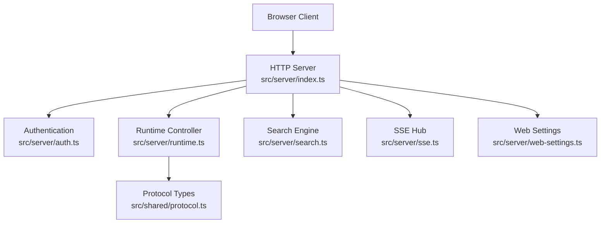
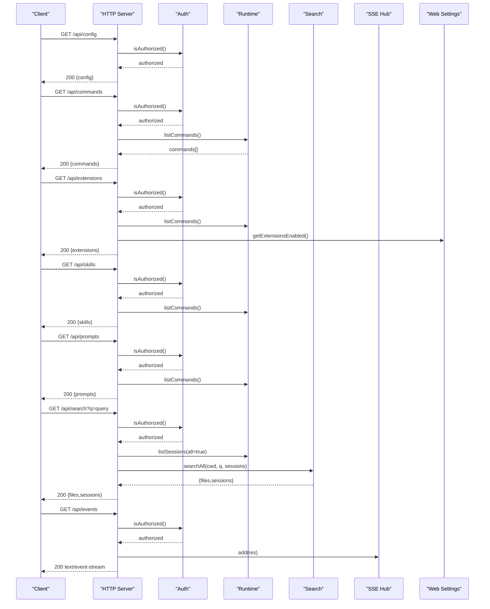
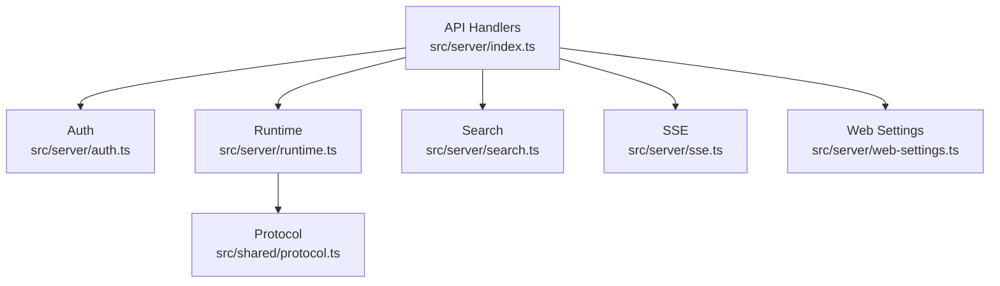

# Utility & Discovery Endpoints

<cite>
**Referenced Files in This Document**
- [index.ts](file://src/server/index.ts)
- [auth.ts](file://src/server/auth.ts)
- [protocol.ts](file://src/shared/protocol.ts)
- [search.ts](file://src/server/search.ts)
- [sse.ts](file://src/server/sse.ts)
- [runtime.ts](file://src/server/runtime.ts)
- [web-settings.ts](file://src/server/web-settings.ts)
- [README.md](file://README.md)
</cite>

## Table of Contents
1. [Introduction](#introduction)
2. [Project Structure](#project-structure)
3. [Core Components](#core-components)
4. [Architecture Overview](#architecture-overview)
5. [Detailed Component Analysis](#detailed-component-analysis)
6. [Dependency Analysis](#dependency-analysis)
7. [Performance Considerations](#performance-considerations)
8. [Troubleshooting Guide](#troubleshooting-guide)
9. [Conclusion](#conclusion)

## Introduction
This document provides comprehensive documentation for the utility and discovery endpoints that power the Quake Code Web application. These endpoints enable clients to discover available commands, manage extensions, explore skills, access prompt templates, search across the workspace, and receive real-time updates via Server-Sent Events. Authentication is enforced for all API endpoints except the static frontend assets.

## Project Structure
The utility endpoints are implemented in the server module and integrate with the runtime, authentication, and search subsystems. The primary entry point handles routing and delegates to specialized services.

**Diagram sources**
- [index.ts:401-659](file://src/server/index.ts#L401-L659)
- [auth.ts:6-56](file://src/server/auth.ts#L6-L56)
- [runtime.ts:12-30](file://src/server/runtime.ts#L12-L30)
- [search.ts:1-284](file://src/server/search.ts#L1-L284)
- [sse.ts:6-32](file://src/server/sse.ts#L6-L32)
- [web-settings.ts:13-64](file://src/server/web-settings.ts#L13-L64)
- [protocol.ts:112-198](file://src/shared/protocol.ts#L112-L198)

**Section sources**
- [index.ts:401-659](file://src/server/index.ts#L401-L659)
- [README.md:88-103](file://README.md#L88-L103)

## Core Components
- HTTP Server: Routes incoming requests to appropriate handlers, enforces authentication, and serves static assets.
- Authentication: Validates tokens via request headers or query parameters.
- Runtime Controller: Provides command discovery, skill enumeration, and prompt templates.
- Search Engine: Implements workspace-wide search across files and sessions.
- SSE Hub: Streams real-time events to clients.
- Web Settings: Manages extension enablement and web UI preferences.

**Section sources**
- [index.ts:401-659](file://src/server/index.ts#L401-L659)
- [auth.ts:6-56](file://src/server/auth.ts#L6-L56)
- [runtime.ts:233-287](file://src/server/runtime.ts#L233-L287)
- [search.ts:269-284](file://src/server/search.ts#L269-L284)
- [sse.ts:6-32](file://src/server/sse.ts#L6-L32)
- [web-settings.ts:13-64](file://src/server/web-settings.ts#L13-L64)

## Architecture Overview
The server exposes utility endpoints under the /api/ namespace. Requests are authenticated, then routed to handlers that gather data from the runtime, search engine, or settings service. Responses are JSON-encoded with appropriate status codes.

**Diagram sources**
- [index.ts:401-659](file://src/server/index.ts#L401-L659)
- [auth.ts:15-29](file://src/server/auth.ts#L15-L29)
- [runtime.ts:233-287](file://src/server/runtime.ts#L233-L287)
- [search.ts:269-284](file://src/server/search.ts#L269-L284)
- [sse.ts:9-26](file://src/server/sse.ts#L9-L26)
- [web-settings.ts:52-60](file://src/server/web-settings.ts#L52-L60)

## Detailed Component Analysis

### Authentication Requirements
All /api/* endpoints require authentication unless serving static assets. Authentication is performed by checking the X-Quake-Web-Token header or the token query parameter against a generated or configured token.

- Token source: Environment variable, token file, or generated per-process token.
- Enforcement: Applied before route dispatch for /api/* paths.
- Static assets: No authentication required.

**Section sources**
- [index.ts:404-407](file://src/server/index.ts#L404-L407)
- [auth.ts:15-29](file://src/server/auth.ts#L15-L29)
- [auth.ts:37-54](file://src/server/auth.ts#L37-L54)
- [README.md:110-114](file://README.md#L110-L114)

### Endpoint: /api/config
Purpose: Returns server configuration including host, port, workspace, authentication status, terminal policy, and version.

- Authentication: Required
- Method: GET
- Response: JSON object containing a config property with WebServerConfig fields
- Filtering: None
- Practical usage:
  - Fetch server capabilities and settings
  - Determine whether terminal is enabled and policy mode
  - Verify workspace allowlist and max preview size

Response schema:
- config.host: string
- config.port: number
- config.cwd: string
- config.authEnabled: boolean
- config.terminalEnabled: boolean
- config.terminalPolicyMode: "safe" | "allow-all" | "disabled"
- config.maxFilePreviewBytes: number
- config.workspaceAllowlist: string[]
- config.version: string

**Section sources**
- [index.ts:413-416](file://src/server/index.ts#L413-L416)
- [protocol.ts:112-122](file://src/shared/protocol.ts#L112-L122)

### Endpoint: /api/commands
Purpose: Lists all available commands including built-in commands, prompt templates, and skills.

- Authentication: Required
- Method: GET
- Response: JSON object containing a commands array
- Filtering: None
- Practical usage:
  - Populate command palette
  - Discover prompt templates and skills
  - Build dynamic menus

Response schema:
- commands[].name: string (e.g., "/new", "/plan")
- commands[].description: string
- commands[].source: "builtin" | "extension" | "prompt" | "skill"

**Section sources**
- [index.ts:433-436](file://src/server/index.ts#L433-L436)
- [runtime.ts:233-259](file://src/server/runtime.ts#L233-L259)
- [protocol.ts:35-39](file://src/shared/protocol.ts#L35-L39)

### Endpoint: /api/extensions
Purpose: Lists installed extensions with their enablement status.

- Authentication: Required
- Method: GET
- Response: JSON object containing an extensions array
- Filtering: None
- Practical usage:
  - Display extension list in settings
  - Show which extensions are currently enabled/disabled

Response schema:
- extensions[].name: string
- extensions[].description: string
- extensions[].enabled: boolean

**Section sources**
- [index.ts:437-443](file://src/server/index.ts#L437-L443)
- [web-settings.ts:52-60](file://src/server/web-settings.ts#L52-L60)

### Endpoint: /api/skills
Purpose: Lists skills discovered from the filesystem.

- Authentication: Required
- Method: GET
- Response: JSON object containing a skills array
- Filtering: None
- Practical usage:
  - Populate skills panel
  - Allow users to trigger skills via slash commands

Response schema:
- skills[].name: string (e.g., "/skill-name")
- skills[].description: string
- skills[].source: "skill"

**Section sources**
- [index.ts:450-455](file://src/server/index.ts#L450-L455)
- [runtime.ts:261-287](file://src/server/runtime.ts#L261-L287)
- [protocol.ts:35-39](file://src/shared/protocol.ts#L35-L39)

### Endpoint: /api/prompts
Purpose: Lists prompt templates available in the runtime.

- Authentication: Required
- Method: GET
- Response: JSON object containing a prompts array
- Filtering: None
- Practical usage:
  - Provide quick-access prompt templates
  - Enable users to apply predefined prompts

Response schema:
- prompts[].name: string (e.g., "/prompt-name")
- prompts[].description: string

**Section sources**
- [index.ts:456-461](file://src/server/index.ts#L456-L461)
- [runtime.ts:251-255](file://src/server/runtime.ts#L251-L255)

### Endpoint: /api/search
Purpose: Searches across workspace files and session summaries.

- Authentication: Required
- Method: GET
- Query parameters:
  - q: search query string
- Response: JSON object containing files and sessions arrays
- Filtering: None
- Practical usage:
  - Global workspace search
  - Combine with session browsing for context-aware results

Response schema:
- files[].path: string
- files[].line: number
- files[].text: string
- sessions[].path: string
- sessions[].name: string
- sessions[].snippet: string

**Section sources**
- [index.ts:514-519](file://src/server/index.ts#L514-L519)
- [search.ts:269-284](file://src/server/search.ts#L269-L284)

### Endpoint: /api/events
Purpose: Establishes a Server-Sent Events connection for real-time updates.

- Authentication: Required
- Method: GET
- Response: text/event-stream
- Filtering: None
- Practical usage:
  - Subscribe to runtime state changes
  - Receive agent events and terminal output
  - Monitor plan progress and UI requests

Event payload types:
- ready: initial state broadcast
- state: runtime state updates
- agent_event: agent-generated events
- terminal_start/terminal_output/terminal_end: terminal lifecycle
- extension_ui_request: UI interaction requests
- error: error notifications

**Section sources**
- [index.ts:408-412](file://src/server/index.ts#L408-L412)
- [sse.ts:6-32](file://src/server/sse.ts#L6-L32)
- [protocol.ts:161-169](file://src/shared/protocol.ts#L161-L169)

## Dependency Analysis
The utility endpoints depend on several internal services. The following diagram shows key dependencies:

**Diagram sources**
- [index.ts:401-659](file://src/server/index.ts#L401-L659)
- [auth.ts:6-56](file://src/server/auth.ts#L6-L56)
- [runtime.ts:12-30](file://src/server/runtime.ts#L12-L30)
- [search.ts:1-284](file://src/server/search.ts#L1-L284)
- [sse.ts:6-32](file://src/server/sse.ts#L6-L32)
- [web-settings.ts:13-64](file://src/server/web-settings.ts#L13-L64)
- [protocol.ts:112-198](file://src/shared/protocol.ts#L112-L198)

**Section sources**
- [index.ts:401-659](file://src/server/index.ts#L401-L659)
- [runtime.ts:233-287](file://src/server/runtime.ts#L233-L287)
- [search.ts:269-284](file://src/server/search.ts#L269-L284)
- [sse.ts:6-32](file://src/server/sse.ts#L6-L32)
- [web-settings.ts:13-64](file://src/server/web-settings.ts#L13-L64)

## Performance Considerations
- Search optimization: Uses ripgrep when available; falls back to JavaScript scanning with limits on depth, file size, and results.
- Event streaming: SSE maintains persistent connections; ensure clients handle reconnects gracefully.
- Response sizes: Config includes a maximum file preview size to prevent large payloads.
- Authentication overhead: Token comparison uses constant-time comparison to mitigate timing attacks.

**Section sources**
- [search.ts:72-81](file://src/server/search.ts#L72-L81)
- [search.ts:108-142](file://src/server/search.ts#L108-L142)
- [search.ts:169-220](file://src/server/search.ts#L169-L220)
- [auth.ts:49-54](file://src/server/auth.ts#L49-L54)
- [index.ts:92-95](file://src/server/index.ts#L92-L95)

## Troubleshooting Guide
Common issues and resolutions:
- Unauthorized requests: Ensure the X-Quake-Web-Token header or token query parameter matches the server token.
- Authentication disabled: Set QUAKE_WEB_AUTH=0 only for trusted local experiments; otherwise authentication is mandatory.
- Remote access restrictions: Binding to 0.0.0.0 requires QUAKE_WEB_ALLOW_REMOTE=1; otherwise defaults to localhost.
- SSE connection failures: Verify the /api/events endpoint is reachable and the client supports text/event-stream.
- Search not returning results: Install ripgrep for optimal performance; fallback scanning has limits on depth and file size.

**Section sources**
- [auth.ts:15-29](file://src/server/auth.ts#L15-L29)
- [README.md:110-130](file://README.md#L110-L130)
- [search.ts:72-81](file://src/server/search.ts#L72-L81)
- [index.ts:408-412](file://src/server/index.ts#L408-L412)

## Conclusion
The utility and discovery endpoints provide a robust foundation for discovering commands, managing extensions, accessing skills and prompts, searching the workspace, and subscribing to real-time updates. Authentication is consistently enforced across all API endpoints, and the design leverages the runtime for parity with the terminal UI. Proper configuration of authentication and workspace policies ensures secure operation in local environments.
