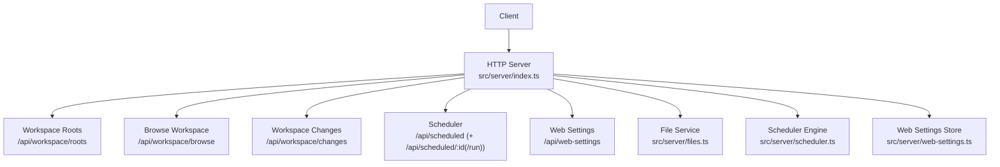
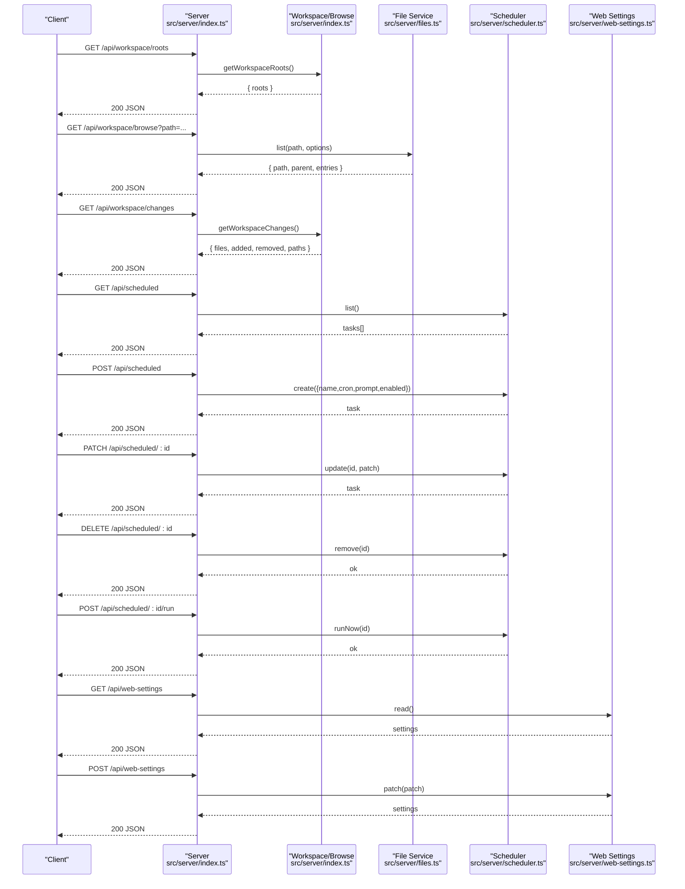
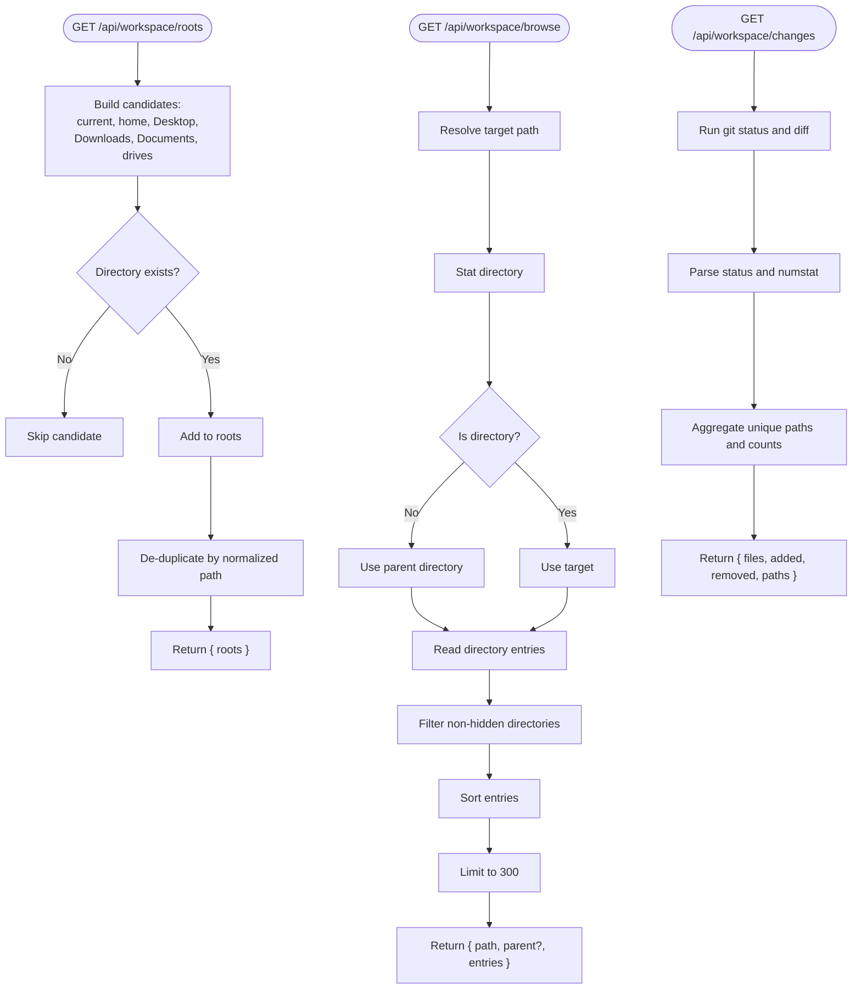
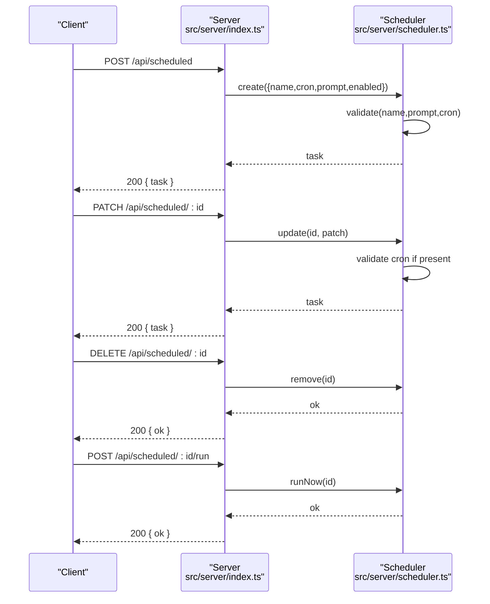
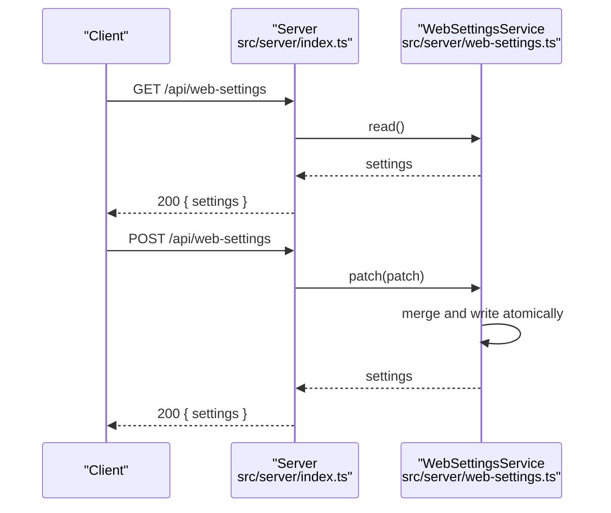
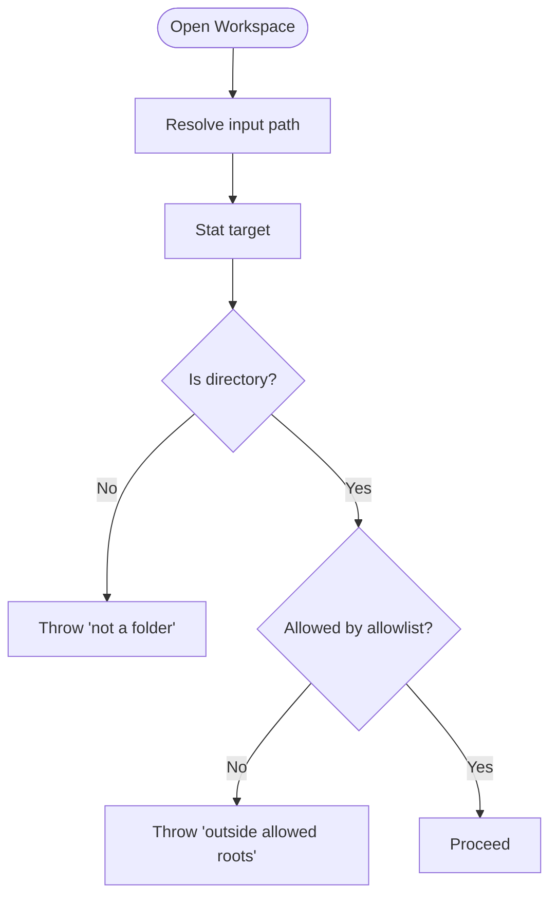
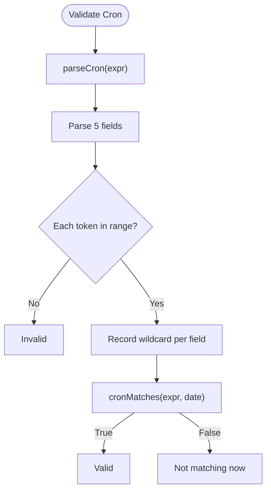
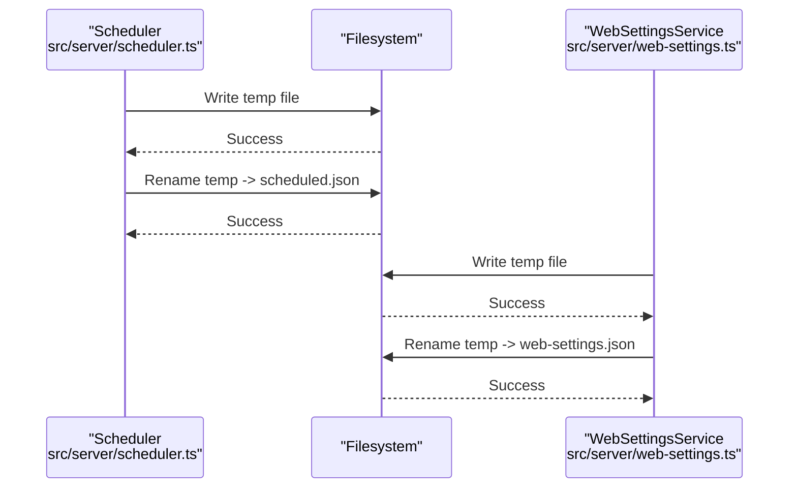
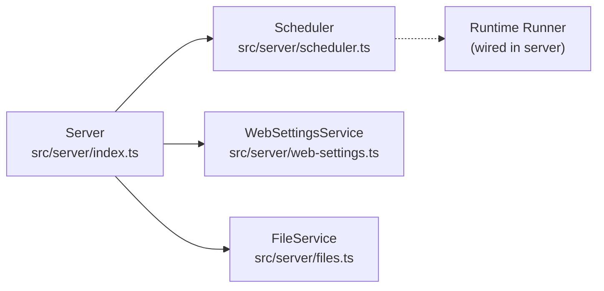

# Workspace & Scheduling Endpoints

<cite>
**Referenced Files in This Document**
- [index.ts](file://src/server/index.ts)
- [scheduler.ts](file://src/server/scheduler.ts)
- [web-settings.ts](file://src/server/web-settings.ts)
- [files.ts](file://src/server/files.ts)
- [api.ts](file://src/client/src/lib/api.ts)
</cite>

## Table of Contents
1. [Introduction](#introduction)
2. [Project Structure](#project-structure)
3. [Core Components](#core-components)
4. [Architecture Overview](#architecture-overview)
5. [Detailed Component Analysis](#detailed-component-analysis)
6. [Dependency Analysis](#dependency-analysis)
7. [Performance Considerations](#performance-considerations)
8. [Troubleshooting Guide](#troubleshooting-guide)
9. [Conclusion](#conclusion)

## Introduction
This document describes the workspace browsing and scheduling endpoints exposed by the server, along with user preference persistence. It covers:
- Workspace navigation endpoints: listing roots, browsing directories, and retrieving Git change statistics
- Task scheduling endpoints: listing, creating, updating, deleting, and forcing immediate execution of scheduled tasks
- User preferences endpoint: reading and patching web settings
It also documents workspace validation, scheduling syntax (cron expressions), and persistence mechanisms, with practical examples for workspace management and automated task execution.

## Project Structure
The server exposes REST endpoints under /api/. The relevant handlers are wired in the main server entrypoint and delegate to specialized services:
- Workspace endpoints: roots, browse, changes
- Scheduling endpoints: list, create, update, delete, run
- Web settings endpoints: read, patch
- File service utilities support workspace browsing and validation

**Diagram sources**
- [index.ts:466-567](file://src/server/index.ts#L466-L567)
- [scheduler.ts:54-242](file://src/server/scheduler.ts#L54-L242)
- [web-settings.ts:13-64](file://src/server/web-settings.ts#L13-L64)
- [files.ts:13-131](file://src/server/files.ts#L13-L131)

**Section sources**
- [index.ts:466-567](file://src/server/index.ts#L466-L567)

## Core Components
- Workspace endpoints
  - GET /api/workspace/roots: Returns platform-aware workspace roots (current, home, Desktop, Downloads, Documents, drives)
  - GET /api/workspace/browse: Lists folders under a given path (defaults to current workspace)
  - GET /api/workspace/changes: Computes changed files and totals from Git status and diff
- Scheduling endpoints
  - GET /api/scheduled: Lists tasks with recomputed nextRun
  - POST /api/scheduled: Creates a new task with name, cron, prompt, optional enabled flag
  - PATCH /api/scheduled/:id: Updates an existing task by ID
  - DELETE /api/scheduled/:id: Removes a task by ID
  - POST /api/scheduled/:id/run: Forces immediate execution of a task by ID
- Web settings endpoints
  - GET /api/web-settings: Reads persisted web settings
  - POST /api/web-settings: Patches web settings atomically

**Section sources**
- [index.ts:466-567](file://src/server/index.ts#L466-L567)

## Architecture Overview
The server routes requests to handlers that validate inputs, enforce workspace security, and call domain services. The scheduler is decoupled from runtime specifics and relies on a pluggable task runner. Web settings are persisted to a JSON file under the workspace.

**Diagram sources**
- [index.ts:466-567](file://src/server/index.ts#L466-L567)
- [scheduler.ts:75-146](file://src/server/scheduler.ts#L75-L146)
- [web-settings.ts:21-50](file://src/server/web-settings.ts#L21-L50)
- [files.ts:16-29](file://src/server/files.ts#L16-L29)

## Detailed Component Analysis

### Workspace Endpoints
- GET /api/workspace/roots
  - Purpose: Enumerate candidate workspace roots including current directory, home, Desktop, Downloads, Documents, and drives
  - Validation: Filters out non-existent paths; deduplicates by normalized absolute path
  - Response: { roots: [{ label, path, kind }] }
- GET /api/workspace/browse
  - Purpose: List subfolders of a given path (defaults to current workspace)
  - Validation: Resolves target safely; excludes hidden folders; caps at 300 entries
  - Response: { path, parent?, entries: [{ name, path }] }
- GET /api/workspace/changes
  - Purpose: Summarize Git changes (count and list of affected files)
  - Implementation: Runs git status and diff to collect affected paths and totals
  - Response: { files, added, removed, paths[] }

**Diagram sources**
- [index.ts:123-147](file://src/server/index.ts#L123-L147)
- [index.ts:149-162](file://src/server/index.ts#L149-L162)
- [index.ts:181-209](file://src/server/index.ts#L181-L209)

**Section sources**
- [index.ts:123-147](file://src/server/index.ts#L123-L147)
- [index.ts:149-162](file://src/server/index.ts#L149-L162)
- [index.ts:181-209](file://src/server/index.ts#L181-L209)

### Scheduling Endpoints
- GET /api/scheduled
  - Returns all tasks with nextRun recomputed for enabled tasks
- POST /api/scheduled
  - Validates name and prompt presence, validates cron syntax
  - Creates task with computed nextRun and createdAt
- PATCH /api/scheduled/:id
  - Updates name, prompt, cron, or enabled flag; validates cron if provided
- DELETE /api/scheduled/:id
  - Removes task by ID; throws 404 if not found
- POST /api/scheduled/:id/run
  - Forces immediate execution of a task by ID

**Diagram sources**
- [index.ts:520-563](file://src/server/index.ts#L520-L563)
- [scheduler.ts:85-146](file://src/server/scheduler.ts#L85-L146)

**Section sources**
- [index.ts:520-563](file://src/server/index.ts#L520-L563)
- [scheduler.ts:85-146](file://src/server/scheduler.ts#L85-L146)

### Web Settings Endpoints
- GET /api/web-settings
  - Reads persisted settings from .quake-code/web-settings.json
- POST /api/web-settings
  - Applies a patch atomically; merges nested objects (panels, extensionsEnabled)
  - Uses a temporary file and atomic rename to prevent corruption

**Diagram sources**
- [index.ts:462-467](file://src/server/index.ts#L462-L467)
- [index.ts:564-567](file://src/server/index.ts#L564-L567)
- [web-settings.ts:21-50](file://src/server/web-settings.ts#L21-L50)

**Section sources**
- [index.ts:462-467](file://src/server/index.ts#L462-L467)
- [index.ts:564-567](file://src/server/index.ts#L564-L567)
- [web-settings.ts:21-50](file://src/server/web-settings.ts#L21-L50)

### Workspace Validation and Security
- Workspace path validation
  - Ensures the path is a directory
  - Enforces allowlist: rejects if outside configured allowed roots
- File service safety
  - Prevents escaping the workspace root
  - Normalizes input paths and strips redundant prefixes
  - Filters hidden and generated directories by default

**Diagram sources**
- [index.ts:315-327](file://src/server/index.ts#L315-L327)
- [index.ts:211-219](file://src/server/index.ts#L211-L219)
- [files.ts:84-127](file://src/server/files.ts#L84-L127)

**Section sources**
- [index.ts:315-327](file://src/server/index.ts#L315-L327)
- [index.ts:211-219](file://src/server/index.ts#L211-L219)
- [files.ts:84-127](file://src/server/files.ts#L84-L127)

### Scheduling Syntax (Cron Expressions)
- Supported format: 5-field cron (minute hour day-of-month month day-of-week)
- Field syntax:
  - Values: single number, ranges (a-b), steps (/n), combinations (a-b/n)
  - Wildcards: * matches entire range
  - Lists: comma-separated values
- Special rules:
  - Day-of-week: 0 and 7 both represent Sunday
  - When both day-of-month and day-of-week are not wildcards, matching either is sufficient
- Validation:
  - isValidCron(expr) returns true for syntactically valid expressions
  - computeNextRun(expr, from) computes the next matching minute

**Diagram sources**
- [scheduler.ts:314-405](file://src/server/scheduler.ts#L314-L405)
- [scheduler.ts:403-426](file://src/server/scheduler.ts#L403-L426)

**Section sources**
- [scheduler.ts:314-405](file://src/server/scheduler.ts#L314-L405)
- [scheduler.ts:403-426](file://src/server/scheduler.ts#L403-L426)

### Persistence Mechanisms
- Scheduler persistence
  - Tasks stored in .quake-code/scheduled.json under the workspace
  - Atomic writes: temp file + rename to avoid corruption
- Web settings persistence
  - Stored in .quake-code/web-settings.json under the workspace
  - Atomic writes with temp file and rename

**Diagram sources**
- [scheduler.ts:229-241](file://src/server/scheduler.ts#L229-L241)
- [web-settings.ts:36-50](file://src/server/web-settings.ts#L36-L50)

**Section sources**
- [scheduler.ts:229-241](file://src/server/scheduler.ts#L229-L241)
- [web-settings.ts:36-50](file://src/server/web-settings.ts#L36-L50)

## Dependency Analysis
- Server routes depend on:
  - Workspace utilities for roots, browse, and changes
  - Scheduler for task lifecycle
  - WebSettingsService for user preferences
  - FileService for safe file operations
- Scheduler is decoupled from runtime; the server wires a task runner that invokes the runtime prompt

**Diagram sources**
- [index.ts:75-83](file://src/server/index.ts#L75-L83)
- [scheduler.ts:71-73](file://src/server/scheduler.ts#L71-L73)

**Section sources**
- [index.ts:75-83](file://src/server/index.ts#L75-L83)
- [scheduler.ts:71-73](file://src/server/scheduler.ts#L71-L73)

## Performance Considerations
- Workspace browsing
  - Directory listings capped at 300 entries to avoid heavy scans
  - Hidden and generated directories filtered by default
- Scheduler
  - 30-second tick interval balances responsiveness and CPU usage
  - Prevents duplicate firings within the same minute bucket
  - Avoids overlapping executions of the same task
- File reads
  - Preview size limited to 1 MB to keep responses lightweight
- Atomic writes
  - Temporary file pattern reduces contention and risk of partial writes

[No sources needed since this section provides general guidance]

## Troubleshooting Guide
- Workspace errors
  - "not a folder" when opening a non-directory path
  - "outside allowed roots" when path is not within configured allowlist
  - "workspace outside" when attempting to escape the workspace root
- Scheduling errors
  - "name required" or "prompt required" when missing fields
  - "invalid cron expression" when syntax is invalid
  - "task not found" when updating/deleting/running a non-existent task
  - "runner not attached" when firing tasks without a configured task runner
- Web settings errors
  - JSON parsing failures fall back to empty settings
  - Atomic write failures are retried internally

**Section sources**
- [index.ts:211-219](file://src/server/index.ts#L211-L219)
- [files.ts:16-29](file://src/server/files.ts#L16-L29)
- [scheduler.ts:90-92](file://src/server/scheduler.ts#L90-L92)
- [scheduler.ts:113-118](file://src/server/scheduler.ts#L113-L118)
- [scheduler.ts:149-154](file://src/server/scheduler.ts#L149-L154)
- [scheduler.ts:199](file://src/server/scheduler.ts#L199)
- [web-settings.ts:26-34](file://src/server/web-settings.ts#L26-L34)

## Conclusion
The workspace and scheduling endpoints provide a robust foundation for navigating and managing a development environment, automating recurring tasks with flexible cron expressions, and persisting user preferences safely. The design emphasizes security (workspace allowlists, safe path resolution), reliability (atomic writes, error handling), and performance (bounded scans, periodic ticks).
