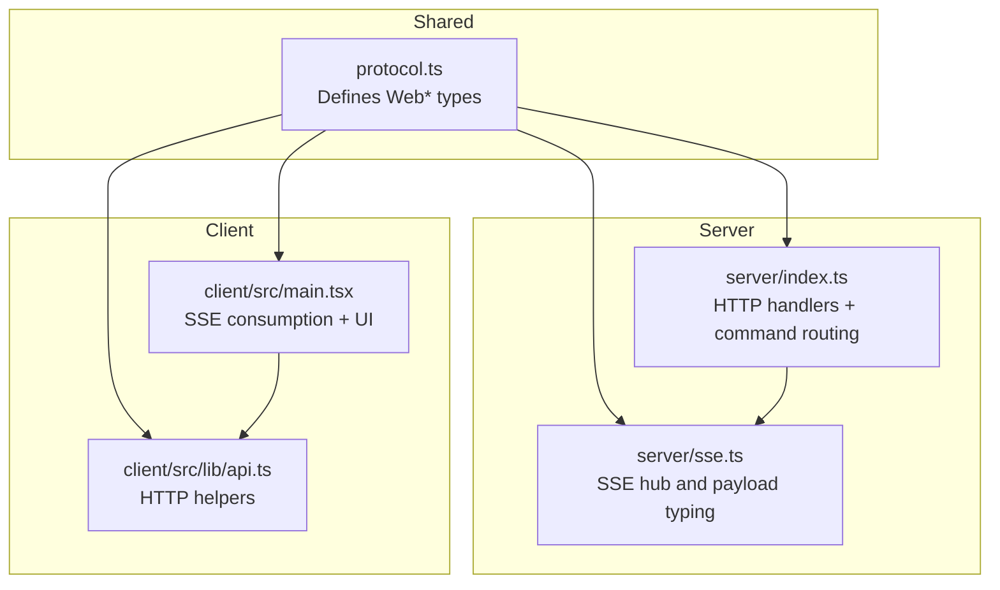
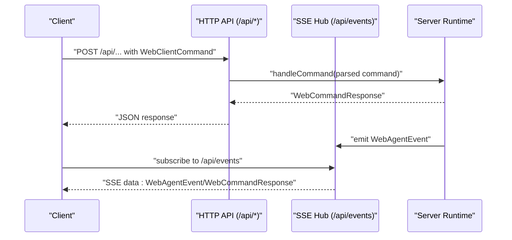
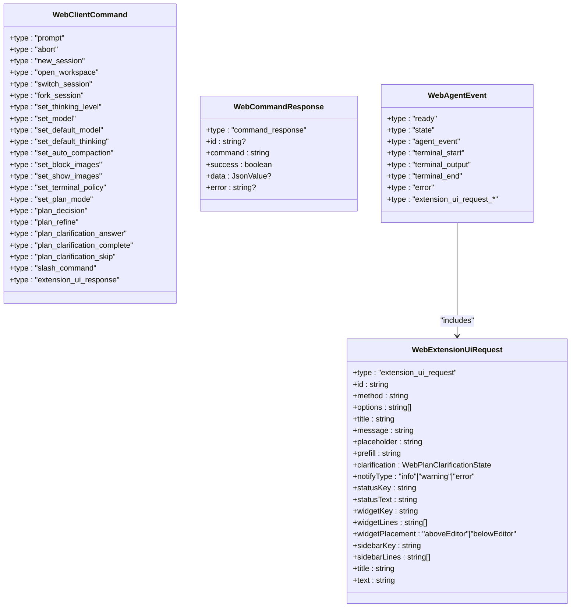
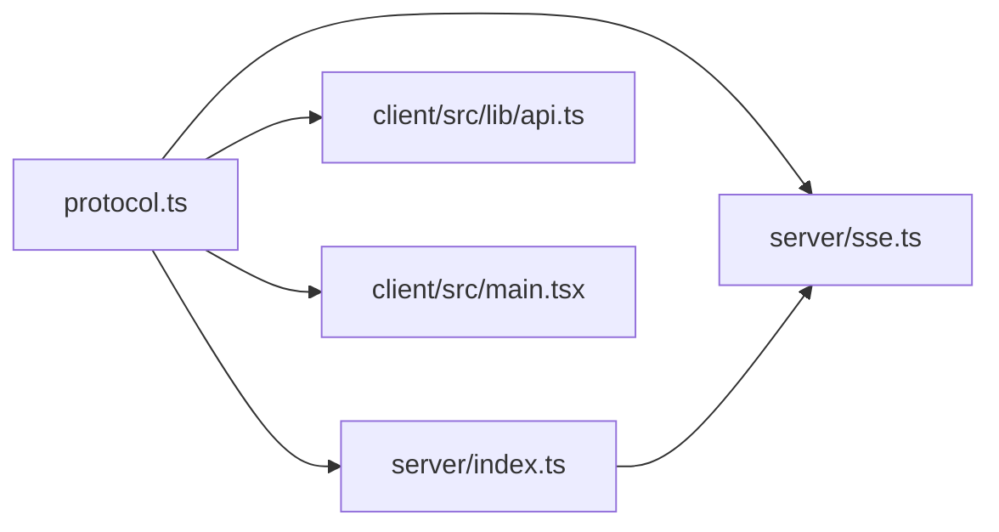

# Protocol Definitions

<cite>
**Referenced Files in This Document**
- [protocol.ts](file://src/shared/protocol.ts)
- [index.ts](file://src/server/index.ts)
- [sse.ts](file://src/server/sse.ts)
- [api.ts](file://src/client/src/lib/api.ts)
- [main.tsx](file://src/client/src/main.tsx)
- [architecture.md](file://docs/architecture.md)
</cite>

## Table of Contents
1. [Introduction](#introduction)
2. [Project Structure](#project-structure)
3. [Core Components](#core-components)
4. [Architecture Overview](#architecture-overview)
5. [Detailed Component Analysis](#detailed-component-analysis)
6. [Dependency Analysis](#dependency-analysis)
7. [Performance Considerations](#performance-considerations)
8. [Troubleshooting Guide](#troubleshooting-guide)
9. [Conclusion](#conclusion)

## Introduction
This document describes the shared protocol used for client-server communication in the application. It covers the TypeScript interfaces and types that define the message contract for commands sent from the client to the server, the server's response envelope, and the server-to-client events emitted via Server-Sent Events (SSE). It also documents the serialization format, versioning considerations, protocol evolution strategy, and practical integration patterns for both client and server implementations.

## Project Structure
The protocol definitions live in a single shared module and are consumed by both server and client code. The server exposes HTTP endpoints and SSE streams, while the client consumes these endpoints and SSE to drive UI updates and command execution.

**Diagram sources**
- [protocol.ts:1-198](file://src/shared/protocol.ts#L1-L198)
- [index.ts:240-439](file://src/server/index.ts#L240-L439)
- [sse.ts:1-32](file://src/server/sse.ts#L1-L32)
- [api.ts:1-59](file://src/client/src/lib/api.ts#L1-L59)
- [main.tsx:577-599](file://src/client/src/main.tsx#L577-L599)

**Section sources**
- [protocol.ts:1-198](file://src/shared/protocol.ts#L1-L198)
- [index.ts:240-439](file://src/server/index.ts#L240-L439)
- [sse.ts:1-32](file://src/server/sse.ts#L1-L32)
- [api.ts:1-59](file://src/client/src/lib/api.ts#L1-L59)
- [main.tsx:577-599](file://src/client/src/main.tsx#L577-L599)

## Core Components
This section documents the primary protocol types and their roles in the system.

- JsonValue: A recursive type representing JSON-compatible values used for flexible payload structures.
- WebSessionSummary: Lightweight session metadata for UI lists and navigation.
- WebModelSummary: Model metadata including provider, ID, name, capabilities, and configuration flags.
- WebCommandInfo: Describes available commands (built-in, extension, prompt, skill).
- WebRuntimeSettings: Runtime preferences such as default provider/model, thinking level, and UI/image preferences.
- WebConversationMode: Conversation modes (execute, plan).
- WebPlanStep: Individual steps in a plan with completion status.
- WebPlanDecision: Decision nodes with selectable options.
- WebPlanPhase: Lifecycle of plan execution (idle, clarifying, planning, ready, executing, complete).
- WebPlanClarificationOption: Options presented during plan clarification.
- WebPlanClarificationAnswer: Answers to clarification questions, supporting free-form text and option selection.
- WebPlanQuestion: Clarification question with optional options and recommendation.
- WebPlanClarificationState: Full state of a clarification flow.
- WebPlanState: Top-level plan state including enabled flag, execution phase, steps, decisions, and clarification.
- WebServerConfig: Server configuration exposed to the client (host, port, workspace policies, version).
- WebFileEntry: File/directory entries for browsing.
- WebSessionState: Current runtime state of the session (model, thinking level, streaming flags, tools, cwd, conversation mode, plan).
- WebExtensionUiRequest: Requests from the server to the extension UI (select, confirm, input, editor, planClarification, notify, setStatus, setWidget, setSidebar, setTitle, set_editor_text).
- WebAgentEvent: Server-to-client events including ready/state/agent_event/terminal_* and extension UI requests.
- WebClientCommand: Commands from client to server (prompt, abort, session management, model/thinking settings, plan actions, slash commands, extension UI responses).
- WebCommandResponse: Standardized response envelope for command execution with success/error semantics.

**Section sources**
- [protocol.ts:4-198](file://src/shared/protocol.ts#L4-L198)

## Architecture Overview
The protocol uses a hybrid transport:
- HTTP POST endpoints for commands (JSON payloads).
- Server-Sent Events (SSE) for server-to-client events and command responses.
- Terminal output streaming also uses SSE.

**Diagram sources**
- [index.ts:241-374](file://src/server/index.ts#L241-L374)
- [sse.ts:1-32](file://src/server/sse.ts#L1-L32)
- [api.ts:9-25](file://src/client/src/lib/api.ts#L9-L25)
- [main.tsx:577-599](file://src/client/src/main.tsx#L577-L599)

**Section sources**
- [architecture.md:42-45](file://docs/architecture.md#L42-L45)
- [index.ts:241-374](file://src/server/index.ts#L241-L374)
- [sse.ts:1-32](file://src/server/sse.ts#L1-L32)
- [api.ts:9-25](file://src/client/src/lib/api.ts#L9-L25)
- [main.tsx:577-599](file://src/client/src/main.tsx#L577-L599)

## Detailed Component Analysis

### Type-Safe Communication Patterns
- Discriminated unions for events and commands enable exhaustive matching and compile-time safety.
- Strongly typed payloads ensure that each command carries only the fields required for its operation.
- The response envelope provides a consistent success/error shape regardless of the underlying command.

**Diagram sources**
- [protocol.ts:148-198](file://src/shared/protocol.ts#L148-L198)

**Section sources**
- [protocol.ts:148-198](file://src/shared/protocol.ts#L148-L198)

### Serialization Formats
- Commands and responses are serialized as JSON for HTTP transport.
- SSE payloads are serialized as JSON and sent as SSE "data:" lines.

Practical implications:
- Use JSON.stringify for outbound payloads.
- Parse incoming payloads with JSON.parse and validate against the union types.

**Section sources**
- [index.ts:242-244](file://src/server/index.ts#L242-L244)
- [sse.ts:21-26](file://src/server/sse.ts#L21-L26)
- [api.ts:16-25](file://src/client/src/lib/api.ts#L16-L25)

### Versioning Considerations
- The "ready" event includes a protocolVersion field to signal compatibility expectations.
- The presence of a version field in the ready event enables future-proofing and graceful degradation.

Recommendations:
- Clients should check protocolVersion upon receiving the ready event.
- Future breaking changes should increment the version and maintain backward-compatible handling for older versions.

**Section sources**
- [protocol.ts:162-162](file://src/shared/protocol.ts#L162-L162)

### Protocol Evolution Strategy and Backward Compatibility
- The protocol is designed as a discriminated union of closely related shapes, enabling additive-only changes.
- New command variants and event types can be introduced without removing existing ones.
- Backward compatibility is preserved by ensuring that new fields are optional and existing consumers remain functional.

Guidelines:
- Do not remove or rename fields in existing shapes.
- Add new literal values to enums only when safe.
- Introduce new union members for commands and events to avoid breaking changes.

**Section sources**
- [protocol.ts:148-198](file://src/shared/protocol.ts#L148-L198)

### Command Construction Examples
Below are representative command shapes and where they are used in the server:

- Prompt with optional images and streaming behavior:
  - Shape: [protocol.ts:172-172](file://src/shared/protocol.ts#L172-L172)
  - Handler: [index.ts:267-270](file://src/server/index.ts#L267-L270)

- Abort current interaction:
  - Shape: [protocol.ts:173-173](file://src/shared/protocol.ts#L173-L173)
  - Handler: [index.ts:271-273](file://src/server/index.ts#L271-L273)

- Session management:
  - New session: [protocol.ts:174-174](file://src/shared/protocol.ts#L174-L174)
  - Open workspace: [protocol.ts:175-175](file://src/shared/protocol.ts#L175-L175)
  - Switch session: [protocol.ts:176-176](file://src/shared/protocol.ts#L176-L176)
  - Fork session: [protocol.ts:177-177](file://src/shared/protocol.ts#L177-L177)
  - Handlers: [index.ts:297-331](file://src/server/index.ts#L297-L331)

- Model and thinking settings:
  - Set thinking level: [protocol.ts:178-178](file://src/shared/protocol.ts#L178-L178)
  - Set model: [protocol.ts:179-179](file://src/shared/protocol.ts#L179-L179)
  - Set default model: [protocol.ts:180-180](file://src/shared/protocol.ts#L180-L180)
  - Set default thinking: [protocol.ts:181-181](file://src/shared/protocol.ts#L181-L181)
  - Handlers: [index.ts:332-343](file://src/server/index.ts#L332-L343)

- UI and policy toggles:
  - Auto compaction: [protocol.ts:182-182](file://src/shared/protocol.ts#L182-L182)
  - Block images: [protocol.ts:183-183](file://src/shared/protocol.ts#L183-L183)
  - Show images: [protocol.ts:184-184](file://src/shared/protocol.ts#L184-L184)
  - Terminal policy: [protocol.ts:185-185](file://src/shared/protocol.ts#L185-L185)
  - Plan mode: [protocol.ts:186-186](file://src/shared/protocol.ts#L186-L186)
  - Handlers: [index.ts:344-362](file://src/server/index.ts#L344-L362)

- Plan-related commands:
  - Decision: [protocol.ts:187-187](file://src/shared/protocol.ts#L187-L187)
  - Refine: [protocol.ts:188-188](file://src/shared/protocol.ts#L188-L188)
  - Clarification answer: [protocol.ts:189-189](file://src/shared/protocol.ts#L189-L189)
  - Clarification complete: [protocol.ts:190-190](file://src/shared/protocol.ts#L190-L190)
  - Clarification skip: [protocol.ts:191-191](file://src/shared/protocol.ts#L191-L191)
  - Handlers: [index.ts:276-296](file://src/server/index.ts#L276-L296)

- Slash command:
  - Shape: [protocol.ts:192-192](file://src/shared/protocol.ts#L192-L192)
  - Handler: [index.ts:363-365](file://src/server/index.ts#L363-L365)

- Extension UI response:
  - Shape: [protocol.ts:193-193](file://src/shared/protocol.ts#L193-L193)
  - Handler: [index.ts:274-275](file://src/server/index.ts#L274-L275)

**Section sources**
- [protocol.ts:171-193](file://src/shared/protocol.ts#L171-L193)
- [index.ts:255-374](file://src/server/index.ts#L255-L374)

### Response Handling Examples
- Successful command response:
  - Shape: [protocol.ts:195-197](file://src/shared/protocol.ts#L195-L197)
  - Builder: [index.ts:247-249](file://src/server/index.ts#L247-L249)

- Failed command response:
  - Shape: [protocol.ts:195-197](file://src/shared/protocol.ts#L195-L197)
  - Builder: [index.ts:251-253](file://src/server/index.ts#L251-L253)

- Error event emission:
  - Event: [protocol.ts:168-168](file://src/shared/protocol.ts#L168-L168)
  - SSE usage: [sse.ts:21-26](file://src/server/sse.ts#L21-L26)

**Section sources**
- [protocol.ts:195-197](file://src/shared/protocol.ts#L195-L197)
- [index.ts:247-253](file://src/server/index.ts#L247-L253)
- [sse.ts:21-26](file://src/server/sse.ts#L21-L26)

### Event Processing Examples
- Ready event with protocol version and initial state:
  - Shape: [protocol.ts:162-162](file://src/shared/protocol.ts#L162-L162)
  - SSE subscription: [main.tsx:577-599](file://src/client/src/main.tsx#L577-L599)

- State updates:
  - Shape: [protocol.ts:163-163](file://src/shared/protocol.ts#L163-L163)
  - SSE usage: [sse.ts:21-26](file://src/server/sse.ts#L21-L26)

- Terminal lifecycle:
  - Start: [protocol.ts:165-165](file://src/shared/protocol.ts#L165-L165)
  - Output: [protocol.ts:166-166](file://src/shared/protocol.ts#L166-L166)
  - End: [protocol.ts:167-167](file://src/shared/protocol.ts#L167-L167)
  - SSE usage: [sse.ts:21-26](file://src/server/sse.ts#L21-L26)

- Extension UI requests:
  - Shape: [protocol.ts:148-159](file://src/shared/protocol.ts#L148-L159)
  - SSE usage: [sse.ts:21-26](file://src/server/sse.ts#L21-L26)

**Section sources**
- [protocol.ts:161-169](file://src/shared/protocol.ts#L161-L169)
- [sse.ts:21-26](file://src/server/sse.ts#L21-L26)
- [main.tsx:577-599](file://src/client/src/main.tsx#L577-L599)

### Client Integration Patterns
- HTTP helpers:
  - GET/POST/PATCH/DELETE wrappers with token support: [api.ts:9-36](file://src/client/src/lib/api.ts#L9-L36)
  - SSE URL builder: [api.ts:48-50](file://src/client/src/lib/api.ts#L48-L50)

- SSE consumption:
  - Subscribe to /api/events and process incoming data: [main.tsx:577-599](file://src/client/src/main.tsx#L577-L599)

- Command dispatch:
  - Construct WebClientCommand objects and POST to appropriate endpoints: [protocol.ts:171-193](file://src/shared/protocol.ts#L171-L193), [api.ts:16-25](file://src/client/src/lib/api.ts#L16-L25)

**Section sources**
- [api.ts:9-36](file://src/client/src/lib/api.ts#L9-L36)
- [api.ts:48-50](file://src/client/src/lib/api.ts#L48-L50)
- [main.tsx:577-599](file://src/client/src/main.tsx#L577-L599)
- [protocol.ts:171-193](file://src/shared/protocol.ts#L171-L193)

### Server Integration Patterns
- Command parsing and routing:
  - Parse JSON body to WebClientCommand: [index.ts:242-244](file://src/server/index.ts#L242-L244)
  - Route to runtime handlers and return WebCommandResponse: [index.ts:255-374](file://src/server/index.ts#L255-L374)

- SSE broadcasting:
  - Add client connections and send WebAgentEvent/WebCommandResponse: [sse.ts:9-31](file://src/server/sse.ts#L9-L31)

**Section sources**
- [index.ts:242-374](file://src/server/index.ts#L242-L374)
- [sse.ts:9-31](file://src/server/sse.ts#L9-L31)

## Dependency Analysis
The protocol module is a pure type definition module consumed by both server and client. The server depends on the protocol for request/response typing and SSE payload typing. The client depends on the protocol for constructing commands and interpreting events.

**Diagram sources**
- [protocol.ts:1-198](file://src/shared/protocol.ts#L1-L198)
- [index.ts:240-439](file://src/server/index.ts#L240-L439)
- [sse.ts:1-32](file://src/server/sse.ts#L1-L32)
- [api.ts:1-59](file://src/client/src/lib/api.ts#L1-L59)
- [main.tsx:577-599](file://src/client/src/main.tsx#L577-L599)

**Section sources**
- [protocol.ts:1-198](file://src/shared/protocol.ts#L1-L198)
- [index.ts:240-439](file://src/server/index.ts#L240-L439)
- [sse.ts:1-32](file://src/server/sse.ts#L1-L32)
- [api.ts:1-59](file://src/client/src/lib/api.ts#L1-L59)
- [main.tsx:577-599](file://src/client/src/main.tsx#L577-L599)

## Performance Considerations
- SSE streaming is efficient for real-time updates; ensure clients handle backpressure and reconnection gracefully.
- Keep command payloads minimal; avoid unnecessary fields to reduce bandwidth.
- Use the standardized response envelope to avoid redundant error handling logic on the client.

## Troubleshooting Guide
Common issues and resolutions:
- Authentication failures: Verify token header usage in HTTP helpers and ensure the token is present in the window scope.
  - Reference: [api.ts:7-14](file://src/client/src/lib/api.ts#L7-L14)
- Command errors: Inspect the WebCommandResponse error field for detailed messages.
  - Reference: [index.ts:251-253](file://src/server/index.ts#L251-L253)
- SSE connection problems: Confirm the client subscribes to /api/events and handles network errors.
  - Reference: [main.tsx:577-599](file://src/client/src/main.tsx#L577-L599), [sse.ts:9-19](file://src/server/sse.ts#L9-L19)
- Unsupported command: The server responds with a failure indicating unsupported command type.
  - Reference: [index.ts:368-370](file://src/server/index.ts#L368-L370)

**Section sources**
- [api.ts:7-14](file://src/client/src/lib/api.ts#L7-L14)
- [index.ts:251-253](file://src/server/index.ts#L251-L253)
- [index.ts:368-370](file://src/server/index.ts#L368-L370)
- [main.tsx:577-599](file://src/client/src/main.tsx#L577-L599)
- [sse.ts:9-19](file://src/server/sse.ts#L9-L19)

## Conclusion
The protocol defines a robust, type-safe contract for client-server communication using JSON over HTTP and SSE. Its discriminated union design and standardized response envelope simplify development and maintenance. The ready event's protocolVersion field provides a foundation for future evolution while preserving backward compatibility. Following the integration patterns outlined here ensures reliable client and server implementations.
