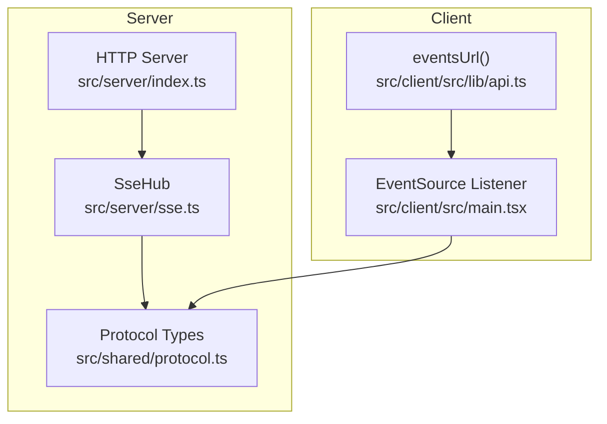
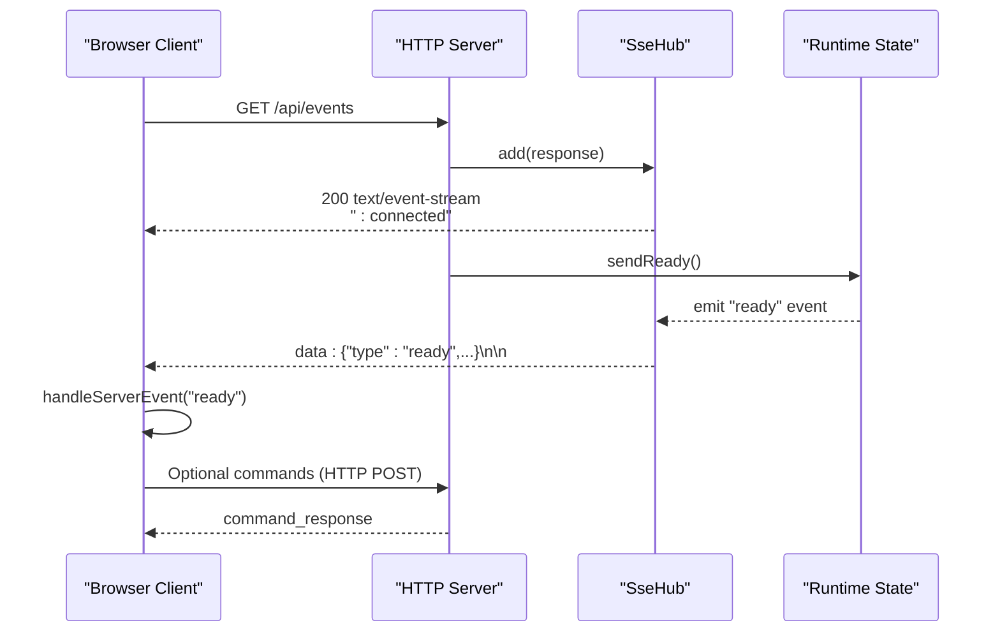
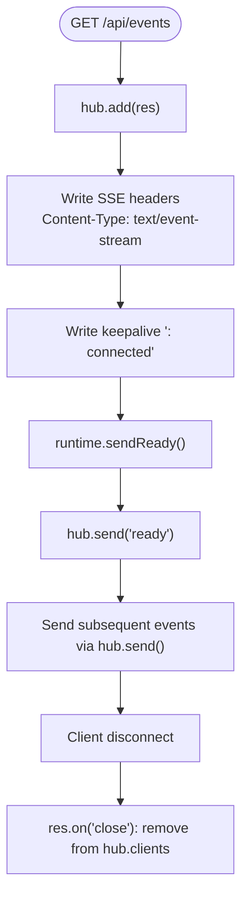
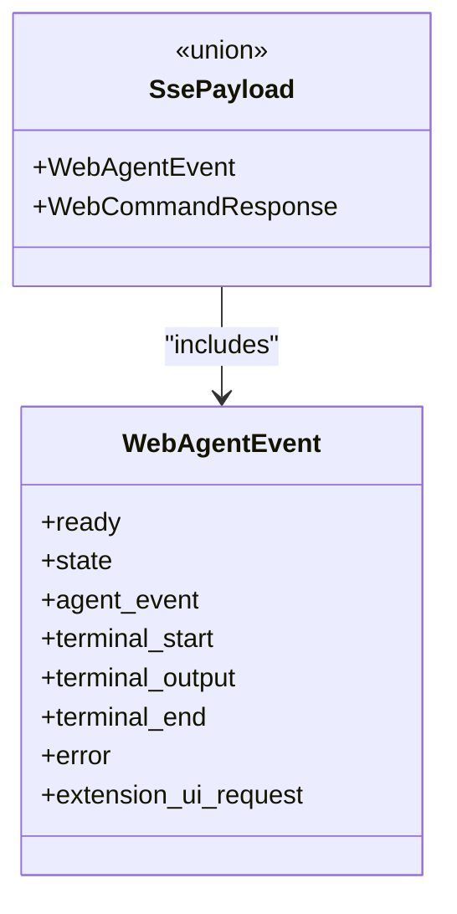
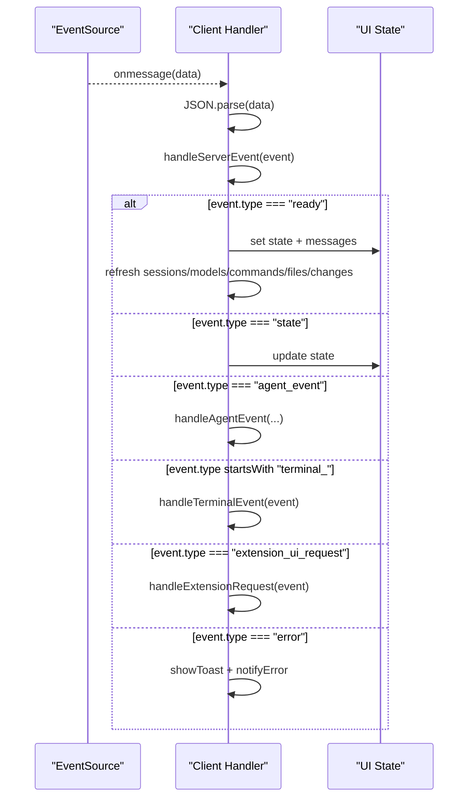
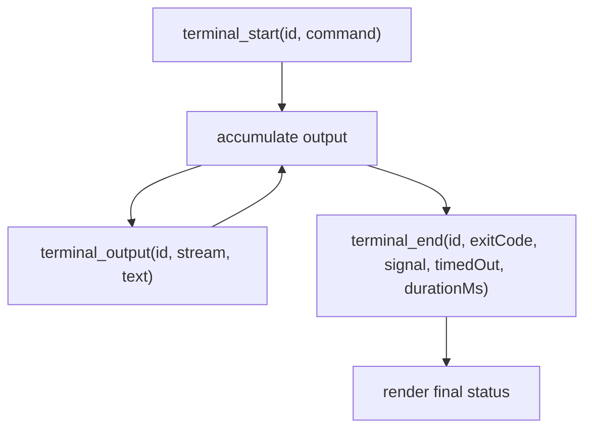
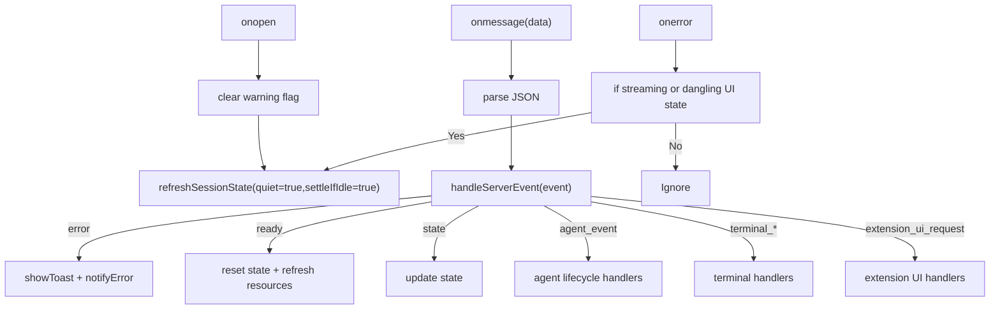
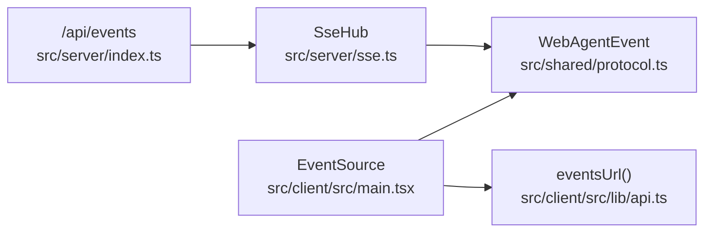

# Real-time Events

<cite>
**Referenced Files in This Document**
- [sse.ts](file://src/server/sse.ts)
- [index.ts](file://src/server/index.ts)
- [protocol.ts](file://src/shared/protocol.ts)
- [api.ts](file://src/client/src/lib/api.ts)
- [main.tsx](file://src/client/src/main.tsx)
- [architecture.md](file://docs/architecture.md)
</cite>

## Table of Contents
1. [Introduction](#introduction)
2. [Project Structure](#project-structure)
3. [Core Components](#core-components)
4. [Architecture Overview](#architecture-overview)
5. [Detailed Component Analysis](#detailed-component-analysis)
6. [Dependency Analysis](#dependency-analysis)
7. [Performance Considerations](#performance-considerations)
8. [Troubleshooting Guide](#troubleshooting-guide)
9. [Conclusion](#conclusion)

## Introduction
This document describes the Server-Sent Events (SSE) API used for real-time communication in the application. It covers the /api/events endpoint, event types, message formats, client connection handling, and practical guidance for building robust client-side listeners with reconnection and error handling strategies.

## Project Structure
The SSE implementation spans three primary areas:
- Server-side event hub and endpoint handler
- Shared protocol definitions for event payloads
- Client-side subscription and event processing

**Diagram sources**
- [sse.ts:1-32](file://src/server/sse.ts#L1-L32)
- [index.ts:401-412](file://src/server/index.ts#L401-L412)
- [protocol.ts:161-169](file://src/shared/protocol.ts#L161-L169)
- [api.ts:48-50](file://src/client/src/lib/api.ts#L48-L50)
- [main.tsx:570-588](file://src/client/src/main.tsx#L570-L588)

**Section sources**
- [sse.ts:1-32](file://src/server/sse.ts#L1-L32)
- [index.ts:401-412](file://src/server/index.ts#L401-L412)
- [protocol.ts:161-169](file://src/shared/protocol.ts#L161-L169)
- [api.ts:48-50](file://src/client/src/lib/api.ts#L48-L50)
- [main.tsx:570-588](file://src/client/src/main.tsx#L570-L588)

## Core Components
- SseHub: Manages SSE connections and broadcasts events to all connected clients.
- /api/events endpoint: Establishes SSE connections and initializes client state.
- Protocol types: Define the shape of server-to-client events and command responses.

Key responsibilities:
- Server: Accepts SSE connections, writes initial keepalive, and dispatches events to all clients.
- Client: Subscribes via EventSource, parses incoming events, and updates UI state.

**Section sources**
- [sse.ts:6-31](file://src/server/sse.ts#L6-L31)
- [index.ts:408-411](file://src/server/index.ts#L408-L411)
- [protocol.ts:161-169](file://src/shared/protocol.ts#L161-L169)

## Architecture Overview
The SSE transport is used for server-to-browser real-time updates alongside HTTP POST endpoints for commands. Terminal output streaming also leverages SSE.

**Diagram sources**
- [index.ts:408-411](file://src/server/index.ts#L408-L411)
- [sse.ts:9-18](file://src/server/sse.ts#L9-L18)
- [protocol.ts:161-169](file://src/shared/protocol.ts#L161-L169)
- [main.tsx:1144-1176](file://src/client/src/main.tsx#L1144-L1176)

**Section sources**
- [architecture.md:42-45](file://docs/architecture.md#L42-L45)
- [index.ts:408-411](file://src/server/index.ts#L408-L411)
- [sse.ts:9-18](file://src/server/sse.ts#L9-L18)
- [protocol.ts:161-169](file://src/shared/protocol.ts#L161-L169)
- [main.tsx:1144-1176](file://src/client/src/main.tsx#L1144-L1176)

## Detailed Component Analysis

### Server-Sent Events Endpoint (/api/events)
- Endpoint: GET /api/events
- Behavior:
  - Adds the response to the SSE hub to track the client.
  - Writes an initial keepalive line and sets SSE headers.
  - Immediately emits a "ready" event to initialize the client state.
- Connection lifecycle:
  - On connect: initializes client state and starts receiving events.
  - On disconnect: automatically removes the client from the hub.

**Diagram sources**
- [index.ts:408-411](file://src/server/index.ts#L408-L411)
- [sse.ts:9-18](file://src/server/sse.ts#L9-L18)

**Section sources**
- [index.ts:408-411](file://src/server/index.ts#L408-L411)
- [sse.ts:9-18](file://src/server/sse.ts#L9-L18)

### Event Types and Message Formats
The shared protocol defines the event payload union type used by the SSE hub. The primary event categories include:

- Session state and agent lifecycle:
  - ready: Initializes client state with current session state and messages.
  - state: Updates session state without resetting UI.
  - agent_event: Streams agent activity (e.g., queued suggestions, message lifecycle, tool execution).

- Terminal output:
  - terminal_start: Marks the beginning of a terminal run with id and command.
  - terminal_output: Streams stdout/stderr chunks with id and text.
  - terminal_end: Signals completion with exitCode, signal, timedOut, and durationMs.

- Extension UI requests:
  - extension_ui_request: Requests UI interactions (e.g., confirm, select, input, editor, setStatus, setWidget, setSidebar, setTitle, set_editor_text, notify).

- Error reporting:
  - error: Reports server-side errors with message and optional stack.

**Diagram sources**
- [protocol.ts:161-169](file://src/shared/protocol.ts#L161-L169)
- [sse.ts:4](file://src/server/sse.ts#L4)

**Section sources**
- [protocol.ts:161-169](file://src/shared/protocol.ts#L161-L169)
- [sse.ts:4](file://src/server/sse.ts#L4)

### Client-Side Event Listener Implementation
- Subscription:
  - Uses EventSource to connect to /api/events.
  - The eventsUrl() utility appends an optional token query parameter if present.
- Event handling:
  - onopen: Clears warnings and refreshes session state quietly.
  - onmessage: Parses JSON payload and delegates to handleServerEvent().
  - onerror: Triggers a quiet refresh if the session is still streaming or has dangling UI state.
- Event routing:
  - ready: Initializes state, messages, and clears streaming queues.
  - state: Updates session state; reconciles UI if streaming ends.
  - agent_event: Processes queue updates, message streaming lifecycle, and tool execution lifecycle.
  - terminal_*: Manages terminal runs, output accumulation, and completion.
  - extension_ui_request: Handles UI modal/dialog requests and status/widget/sidebar updates.
  - error: Displays toast and notifies error.

**Diagram sources**
- [main.tsx:570-588](file://src/client/src/main.tsx#L570-L588)
- [main.tsx:1144-1176](file://src/client/src/main.tsx#L1144-L1176)
- [main.tsx:1208-1261](file://src/client/src/main.tsx#L1208-L1261)
- [main.tsx:1328-1346](file://src/client/src/main.tsx#L1328-L1346)
- [main.tsx:1360-1371](file://src/client/src/main.tsx#L1360-L1371)

**Section sources**
- [api.ts:48-50](file://src/client/src/lib/api.ts#L48-L50)
- [main.tsx:570-588](file://src/client/src/main.tsx#L570-L588)
- [main.tsx:1144-1176](file://src/client/src/main.tsx#L1144-L1176)
- [main.tsx:1208-1261](file://src/client/src/main.tsx#L1208-L1261)
- [main.tsx:1328-1346](file://src/client/src/main.tsx#L1328-L1346)
- [main.tsx:1360-1371](file://src/client/src/main.tsx#L1360-L1371)

### Terminal Streaming Events
Terminal output is streamed via SSE during command execution:
- terminal_start: Creates a new terminal run with id and command.
- terminal_output: Appends stdout/stderr chunks to the run's output buffer.
- terminal_end: Finalizes the run with exit status, duration, and cleanup.

**Diagram sources**
- [protocol.ts:165-167](file://src/shared/protocol.ts#L165-L167)
- [main.tsx:1328-1346](file://src/client/src/main.tsx#L1328-L1346)

**Section sources**
- [protocol.ts:165-167](file://src/shared/protocol.ts#L165-L167)
- [main.tsx:1328-1346](file://src/client/src/main.tsx#L1328-L1346)

### Reconnection Strategies and Error Handling Patterns
- Automatic reconnection:
  - EventSource automatically attempts to reconnect on network failure or server restart.
- Client-side resilience:
  - onerror handler triggers a quiet refresh when streaming is active or UI state suggests reconciliation.
  - Periodic checks ensure state remains consistent if the last agent event was long ago.
- Idempotent initialization:
  - ready event resets internal state and refreshes supporting resources to recover from transient failures.
- Graceful degradation:
  - Unknown or malformed events are logged and skipped to keep the stream alive.

**Diagram sources**
- [main.tsx:570-588](file://src/client/src/main.tsx#L570-L588)
- [main.tsx:1144-1176](file://src/client/src/main.tsx#L1144-L1176)
- [main.tsx:1172-1175](file://src/client/src/main.tsx#L1172-L1175)

**Section sources**
- [main.tsx:570-588](file://src/client/src/main.tsx#L570-L588)
- [main.tsx:1144-1176](file://src/client/src/main.tsx#L1144-L1176)
- [main.tsx:1172-1175](file://src/client/src/main.tsx#L1172-L1175)

### Examples: Subscribing and Processing Event Streams
- Subscribe to the event stream:
  - Connect via EventSource to the URL returned by eventsUrl().
  - Listen for onmessage to receive JSON-encoded events.
- Process specific event types:
  - ready: Initialize UI state and fetch supporting data.
  - state: Update session state and reconcile UI if streaming completes.
  - agent_event: Manage queued suggestions, streaming message updates, and tool execution lifecycle.
  - terminal_*: Accumulate and render terminal output; finalize on completion.
  - extension_ui_request: Present modal dialogs or update UI widgets/status.
  - error: Surface user-visible errors.

**Section sources**
- [api.ts:48-50](file://src/client/src/lib/api.ts#L48-L50)
- [main.tsx:1144-1176](file://src/client/src/main.tsx#L1144-L1176)
- [main.tsx:1208-1261](file://src/client/src/main.tsx#L1208-L1261)
- [main.tsx:1328-1346](file://src/client/src/main.tsx#L1328-L1346)
- [main.tsx:1360-1371](file://src/client/src/main.tsx#L1360-L1371)

## Dependency Analysis
- Server depends on:
  - SseHub for connection management and broadcasting.
  - Runtime for emitting the initial "ready" event.
  - Protocol types for payload typing.
- Client depends on:
  - EventSource for SSE connectivity.
  - Protocol types for event parsing.
  - UI store for state updates.

**Diagram sources**
- [index.ts:408-411](file://src/server/index.ts#L408-L411)
- [sse.ts:6-31](file://src/server/sse.ts#L6-L31)
- [protocol.ts:161-169](file://src/shared/protocol.ts#L161-L169)
- [api.ts:48-50](file://src/client/src/lib/api.ts#L48-L50)
- [main.tsx:570-588](file://src/client/src/main.tsx#L570-L588)

**Section sources**
- [index.ts:408-411](file://src/server/index.ts#L408-L411)
- [sse.ts:6-31](file://src/server/sse.ts#L6-L31)
- [protocol.ts:161-169](file://src/shared/protocol.ts#L161-L169)
- [api.ts:48-50](file://src/client/src/lib/api.ts#L48-L50)
- [main.tsx:570-588](file://src/client/src/main.tsx#L570-L588)

## Performance Considerations
- SSE framing:
  - Server writes keepalive and flushes per event to maintain responsiveness.
- Client rendering:
  - Streaming message and tool updates are coalesced using requestAnimationFrame to avoid excessive re-renders.
- Backpressure:
  - Client buffers terminal output and applies limits to prevent memory pressure.

[No sources needed since this section provides general guidance]

## Troubleshooting Guide
Common issues and resolutions:
- Connection drops during streaming:
  - EventSource will reconnect automatically; onerror triggers a quiet refresh to reconcile state.
- Malformed events:
  - Unknown or unparsable events are skipped with a single warning to avoid disrupting the stream.
- Stalled terminal output:
  - Verify terminal_start/terminal_output/terminal_end sequences; ensure ids match across events.
- UI desynchronization:
  - The ready event resets state; if streaming stops unexpectedly, periodic checks trigger a quiet refresh.

**Section sources**
- [main.tsx:578-582](file://src/client/src/main.tsx#L578-L582)
- [main.tsx:1178-1191](file://src/client/src/main.tsx#L1178-L1191)
- [main.tsx:1144-1176](file://src/client/src/main.tsx#L1144-L1176)

## Conclusion
The SSE API provides a reliable, low-overhead mechanism for real-time updates. The /api/events endpoint establishes persistent connections, initializes clients with a ready event, and streams session state, agent activity, and terminal output. Clients should subscribe with EventSource, handle structured events, and implement reconnection and reconciliation strategies to ensure robust user experiences.
