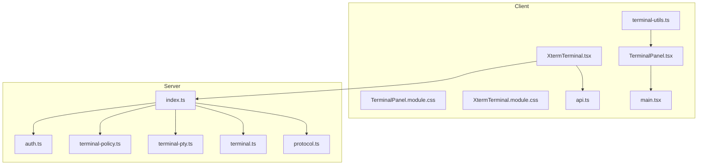
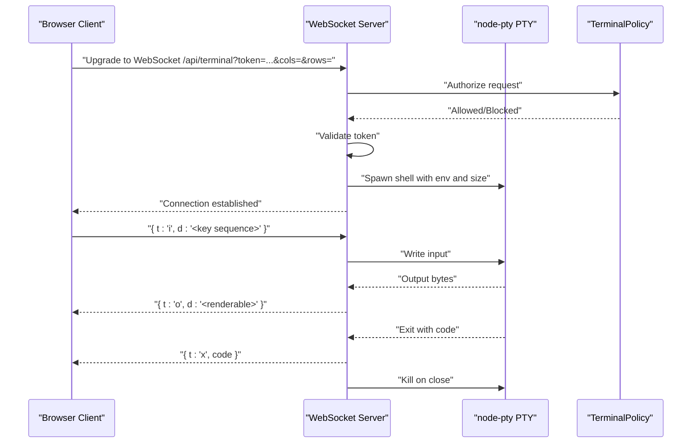
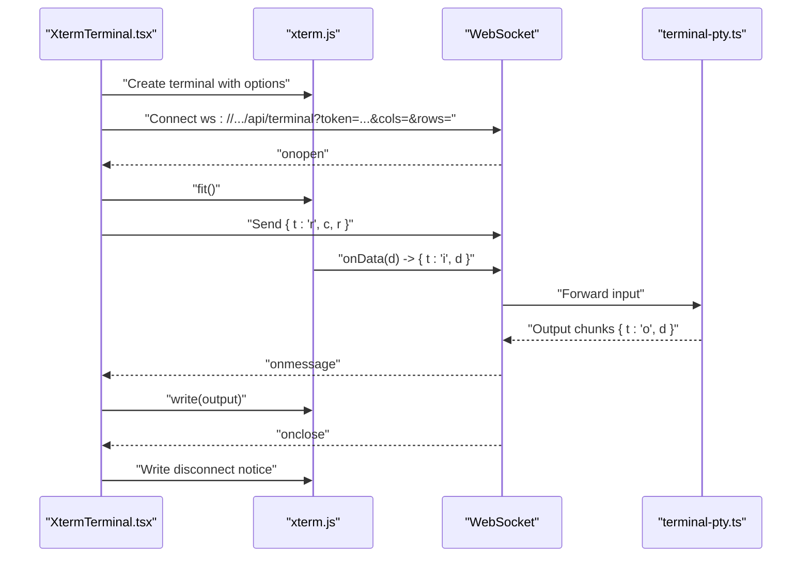
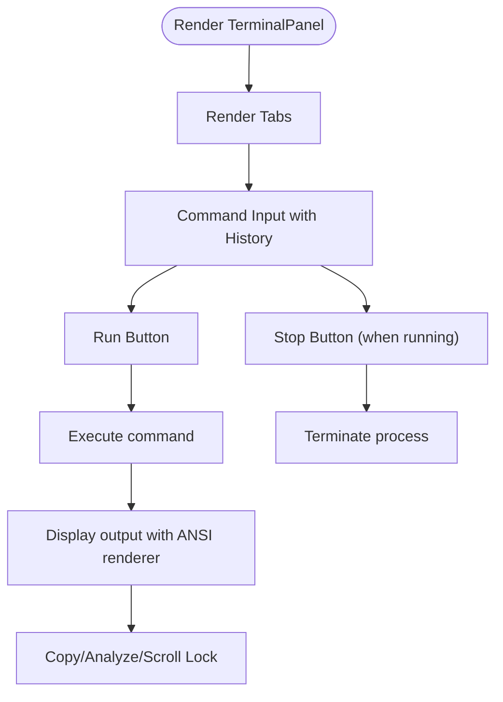
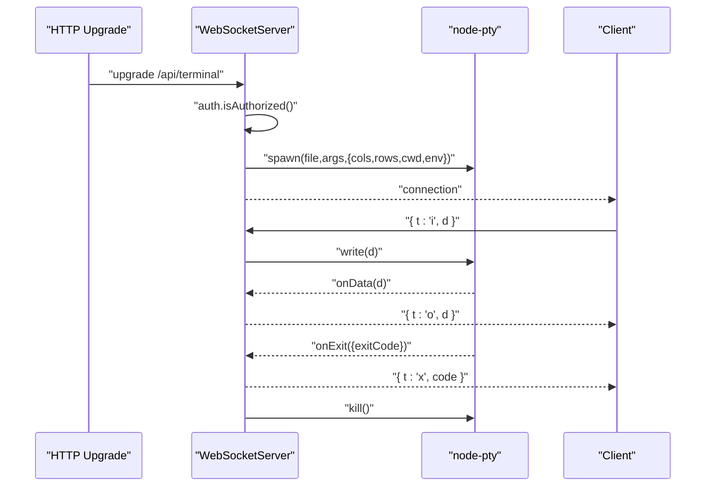
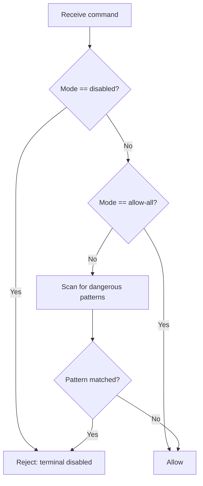
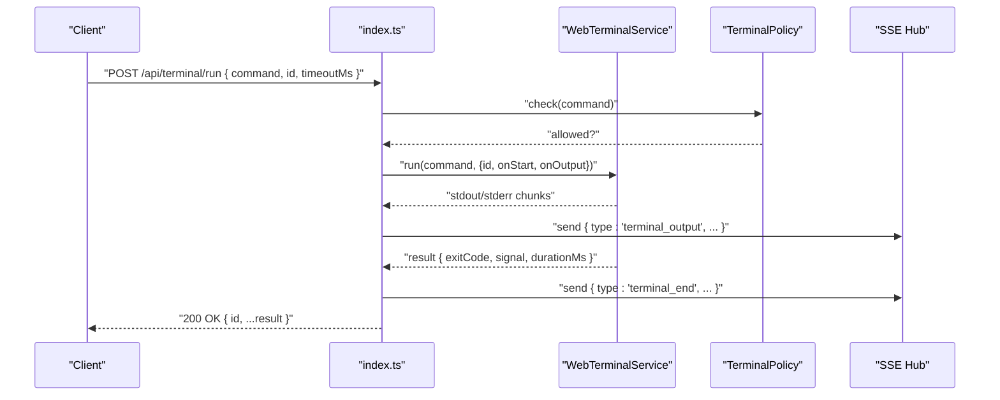
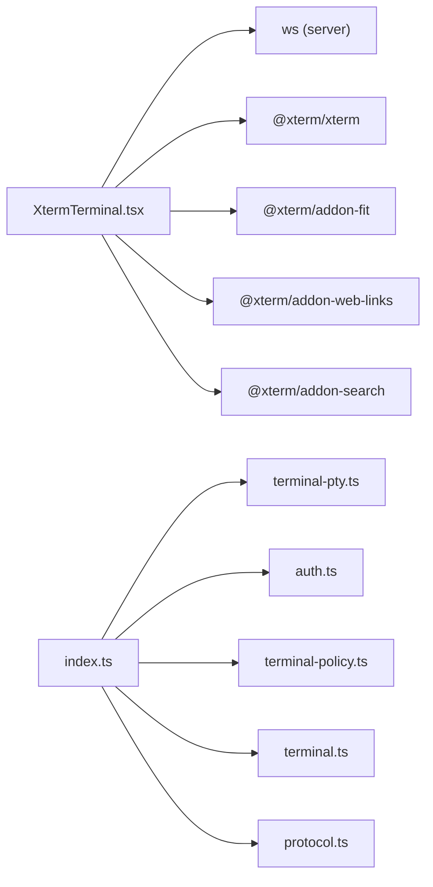

# WebSocket Terminal

<cite>
**Referenced Files in This Document**
- [XtermTerminal.tsx](file://src/client/src/components/terminal/XtermTerminal.tsx)
- [TerminalPanel.tsx](file://src/client/src/components/terminal/TerminalPanel.tsx)
- [terminal-utils.ts](file://src/client/src/components/terminal/terminal-utils.ts)
- [TerminalPanel.module.css](file://src/client/src/components/terminal/TerminalPanel.module.css)
- [XtermTerminal.module.css](file://src/client/src/components/terminal/XtermTerminal.module.css)
- [terminal.ts](file://src/server/terminal.ts)
- [terminal-pty.ts](file://src/server/terminal-pty.ts)
- [terminal-policy.ts](file://src/server/terminal-policy.ts)
- [auth.ts](file://src/server/auth.ts)
- [api.ts](file://src/client/src/lib/api.ts)
- [protocol.ts](file://src/shared/protocol.ts)
- [index.ts](file://src/server/index.ts)
- [main.tsx](file://src/client/src/main.tsx)
- [constants.ts](file://src/client/src/constants.ts)
</cite>

## Table of Contents
1. [Introduction](#introduction)
2. [Project Structure](#project-structure)
3. [Core Components](#core-components)
4. [Architecture Overview](#architecture-overview)
5. [Detailed Component Analysis](#detailed-component-analysis)
6. [Dependency Analysis](#dependency-analysis)
7. [Performance Considerations](#performance-considerations)
8. [Troubleshooting Guide](#troubleshooting-guide)
9. [Conclusion](#conclusion)

## Introduction
This document describes the WebSocket-based terminal communication system used by the application. It covers the terminal WebSocket endpoint, bidirectional message formats, PTY process management, session lifecycle, command execution flow, output streaming, and process termination. It also documents the client-side WebSocket implementation, xterm.js integration, and terminal UI components. Security considerations, process isolation, and resource management are included, along with practical examples for establishing connections, sending commands, and handling real-time output.

## Project Structure
The terminal system spans client and server layers:
- Client-side: xterm.js-based interactive terminal and React UI panels
- Server-side: HTTP server with WebSocket upgrade handling and PTY-backed terminal sessions

**Diagram sources**
- [XtermTerminal.tsx:1-138](file://src/client/src/components/terminal/XtermTerminal.tsx#L1-L138)
- [TerminalPanel.tsx:1-217](file://src/client/src/components/terminal/TerminalPanel.tsx#L1-L217)
- [terminal-utils.ts:1-6](file://src/client/src/components/terminal/terminal-utils.ts#L1-L6)
- [api.ts:1-59](file://src/client/src/lib/api.ts#L1-L59)
- [main.tsx:66-70](file://src/client/src/main.tsx#L66-L70)
- [index.ts:661-662](file://src/server/index.ts#L661-L662)
- [auth.ts:1-56](file://src/server/auth.ts#L1-L56)
- [terminal-policy.ts:1-39](file://src/server/terminal-policy.ts#L1-L39)
- [terminal-pty.ts:1-95](file://src/server/terminal-pty.ts#L1-L95)
- [terminal.ts:1-87](file://src/server/terminal.ts#L1-L87)
- [protocol.ts:161-169](file://src/shared/protocol.ts#L161-L169)

**Section sources**
- [index.ts:661-662](file://src/server/index.ts#L661-L662)
- [XtermTerminal.tsx:98-100](file://src/client/src/components/terminal/XtermTerminal.tsx#L98-L100)
- [main.tsx:66-70](file://src/client/src/main.tsx#L66-L70)

## Core Components
- Client-side interactive terminal: xterm.js instance with WebSocket transport
- Server-side WebSocket endpoint: upgrades HTTP requests to a PTY-backed terminal
- Terminal policy: safety enforcement for commands
- Authentication: token-based access control for WebSocket and HTTP APIs
- Protocol: typed event messages for terminal lifecycle and output streaming

Key responsibilities:
- Establishing and maintaining a persistent WebSocket connection
- Sending keystrokes to the PTY and receiving output streams
- Enforcing terminal policy and isolating processes per session
- Streaming terminal lifecycle events to the UI

**Section sources**
- [XtermTerminal.tsx:64-135](file://src/client/src/components/terminal/XtermTerminal.tsx#L64-L135)
- [terminal-pty.ts:24-94](file://src/server/terminal-pty.ts#L24-L94)
- [terminal-policy.ts:21-32](file://src/server/terminal-policy.ts#L21-L32)
- [auth.ts:15-20](file://src/server/auth.ts#L15-L20)
- [protocol.ts:161-169](file://src/shared/protocol.ts#L161-L169)

## Architecture Overview
The terminal subsystem integrates a browser-based xterm.js terminal with a Node.js WebSocket server backed by node-pty. The client connects via a WebSocket URL with an authentication token and sends/receives structured messages. The server spawns a PTY per connection, translates keystrokes to the PTY, and streams output back to the client.

**Diagram sources**
- [XtermTerminal.tsx:98-114](file://src/client/src/components/terminal/XtermTerminal.tsx#L98-L114)
- [terminal-pty.ts:28-93](file://src/server/terminal-pty.ts#L28-L93)
- [terminal-policy.ts:24-32](file://src/server/terminal-policy.ts#L24-L32)
- [auth.ts:15-20](file://src/server/auth.ts#L15-L20)

## Detailed Component Analysis

### Client-Side WebSocket Implementation (xterm.js)
The client establishes a WebSocket connection to the server, initializes an xterm.js terminal, and wires input/output:
- Connects to the terminal endpoint with token and initial terminal size
- Sends keystroke input as JSON messages
- Writes server output to the terminal
- Handles resize messages and emits resize requests
- Updates theme and handles disconnection gracefully

**Diagram sources**
- [XtermTerminal.tsx:67-132](file://src/client/src/components/terminal/XtermTerminal.tsx#L67-L132)
- [terminal-pty.ts:77-88](file://src/server/terminal-pty.ts#L77-L88)

**Section sources**
- [XtermTerminal.tsx:64-135](file://src/client/src/components/terminal/XtermTerminal.tsx#L64-L135)
- [api.ts:7](file://src/client/src/lib/api.ts#L7)

### Terminal UI Panel (React)
The terminal panel provides:
- Tabbed terminal sessions
- Command input with history navigation
- Run/Stop controls
- Output display with ANSI rendering
- Copy actions (with and without ANSI codes)
- Scroll lock toggle and analysis helpers

**Diagram sources**
- [TerminalPanel.tsx:9-78](file://src/client/src/components/terminal/TerminalPanel.tsx#L9-L78)
- [terminal-utils.ts:1-6](file://src/client/src/components/terminal/terminal-utils.ts#L1-L6)

**Section sources**
- [TerminalPanel.tsx:9-78](file://src/client/src/components/terminal/TerminalPanel.tsx#L9-L78)
- [TerminalPanel.module.css:1-121](file://src/client/src/components/terminal/TerminalPanel.module.css#L1-L121)
- [XtermTerminal.module.css:1-20](file://src/client/src/components/terminal/XtermTerminal.module.css#L1-L20)

### Server-Side WebSocket Endpoint (node-pty)
The server upgrades HTTP requests to a WebSocket and manages a PTY per connection:
- Validates authentication and path
- Spawns a shell with appropriate environment and size
- Forwards input to PTY and streams output back
- Handles resize messages and PTY exit
- Ensures cleanup on close

**Diagram sources**
- [terminal-pty.ts:28-93](file://src/server/terminal-pty.ts#L28-L93)

**Section sources**
- [terminal-pty.ts:24-94](file://src/server/terminal-pty.ts#L24-L94)

### Terminal Policy and Security
The terminal policy enforces safety rules for commands:
- Blocks destructive or dangerous patterns
- Supports modes: safe, allow-all, disabled
- Integrates with server configuration and runtime settings

**Diagram sources**
- [terminal-policy.ts:21-32](file://src/server/terminal-policy.ts#L21-L32)

**Section sources**
- [terminal-policy.ts:1-39](file://src/server/terminal-policy.ts#L1-L39)
- [auth.ts:15-20](file://src/server/auth.ts#L15-L20)

### Terminal Execution Flow (Non-interactive)
While the primary terminal is interactive via WebSocket, the server also exposes a non-interactive terminal runner for programmatic execution:
- Validates and enforces policy
- Spawns a shell process with timeout
- Streams stdout/stderr chunks
- Emits lifecycle events to SSE hub

**Diagram sources**
- [index.ts:631-644](file://src/server/index.ts#L631-L644)
- [terminal.ts:36-85](file://src/server/terminal.ts#L36-L85)
- [protocol.ts:165-167](file://src/shared/protocol.ts#L165-L167)

**Section sources**
- [index.ts:631-644](file://src/server/index.ts#L631-L644)
- [terminal.ts:21-85](file://src/server/terminal.ts#L21-L85)
- [protocol.ts:161-169](file://src/shared/protocol.ts#L161-L169)

## Dependency Analysis
The terminal system depends on:
- Client-side: xterm.js, addons (fit, links, search), CSS themes
- Server-side: ws for WebSocket, node-pty for PTY, internal auth and policy
- Shared: protocol types for SSE events

**Diagram sources**
- [XtermTerminal.tsx:2-6](file://src/client/src/components/terminal/XtermTerminal.tsx#L2-L6)
- [index.ts:25](file://src/server/index.ts#L25)
- [terminal-pty.ts:3](file://src/server/terminal-pty.ts#L3)

**Section sources**
- [XtermTerminal.tsx:1-138](file://src/client/src/components/terminal/XtermTerminal.tsx#L1-L138)
- [index.ts:1-679](file://src/server/index.ts#L1-L679)

## Performance Considerations
- Output buffering: client-side buffers and trims output to manage memory
- Resize handling: client fits terminal and sends size updates to server
- Timeout and limits: server enforces timeouts and caps output sizes
- Resource cleanup: server kills PTY on close; client disposes xterm resources

Recommendations:
- Keep terminal size reasonable to reduce bandwidth
- Limit long-running commands with timeouts
- Use scroll lock to avoid excessive reflows during bursts
- Monitor SSE hub for lifecycle events to keep UI synchronized

**Section sources**
- [constants.ts:19-20](file://src/client/src/constants.ts#L19-L20)
- [terminal.ts:56-73](file://src/server/terminal.ts#L56-L73)
- [XtermTerminal.tsx:89-93](file://src/client/src/components/terminal/XtermTerminal.tsx#L89-L93)

## Troubleshooting Guide
Common issues and resolutions:
- Unauthorized access: ensure the token header/query matches the server's token
- Connection failures: verify the WebSocket URL and that the server is running
- No output: confirm the PTY spawned successfully and the terminal is focused
- Slow rendering: adjust terminal size and disable unnecessary addons
- Policy violations: review terminal policy mode and command patterns

Operational checks:
- Verify authentication: server rejects unauthorized requests
- Inspect lifecycle events: SSE events indicate start, output, and end
- Validate resize messages: client should send resize after layout changes

**Section sources**
- [auth.ts:15-20](file://src/server/auth.ts#L15-L20)
- [terminal-pty.ts:61-66](file://src/server/terminal-pty.ts#L61-L66)
- [protocol.ts:165-167](file://src/shared/protocol.ts#L165-L167)

## Conclusion
The WebSocket terminal system provides a secure, responsive, and interactive terminal experience. The client leverages xterm.js with a robust WebSocket transport, while the server uses node-pty to manage PTY lifecycles and enforce safety policies. Together, they support real-time command execution, output streaming, and lifecycle management with strong security and resource controls.
