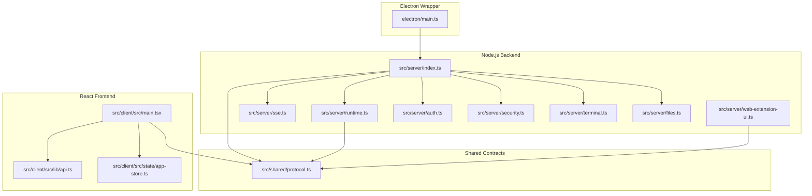
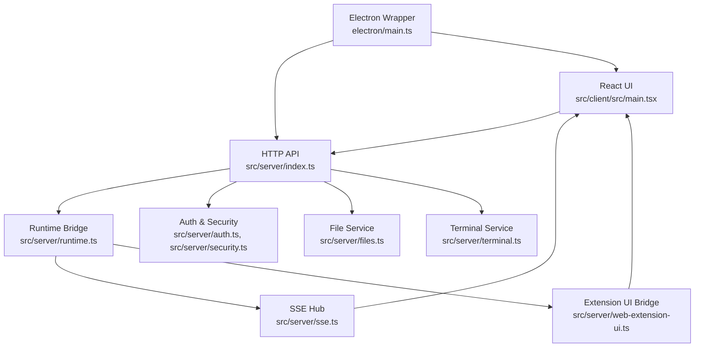
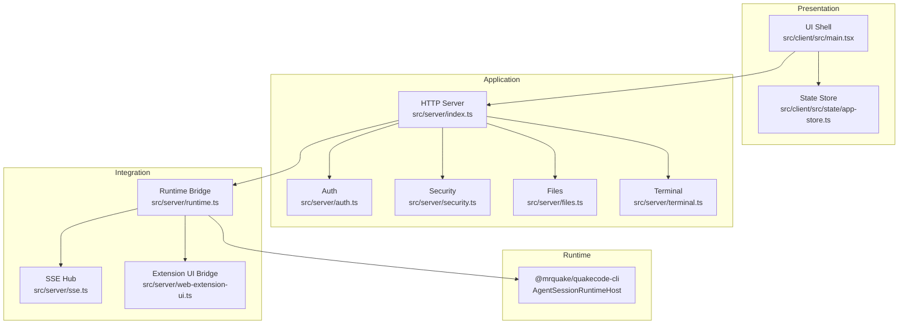
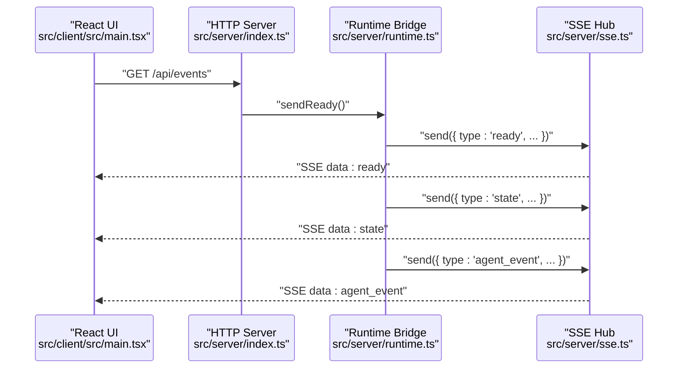
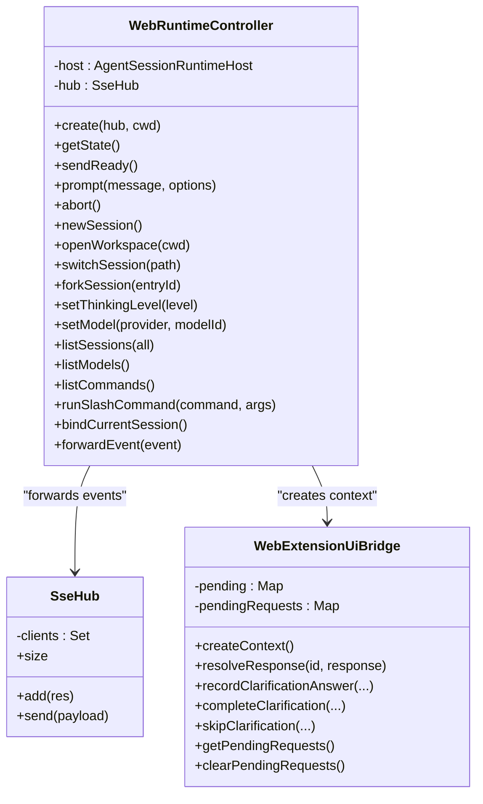
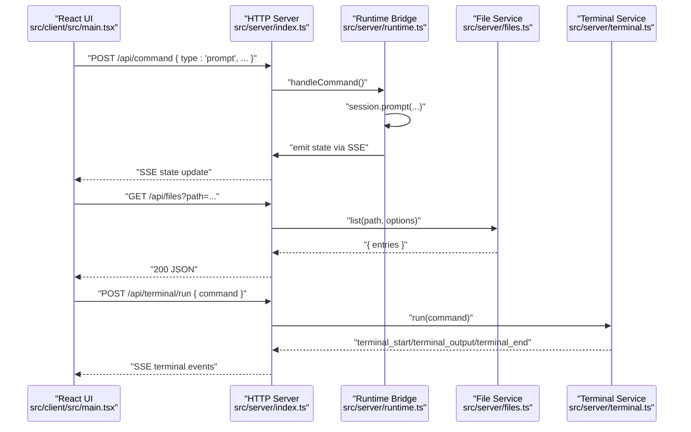
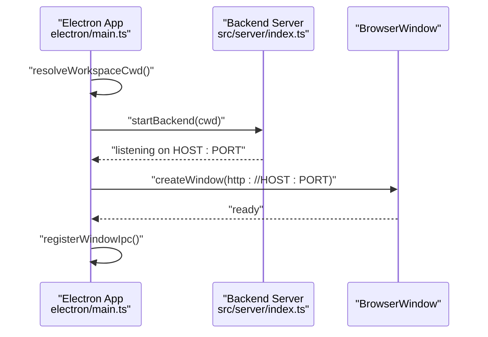
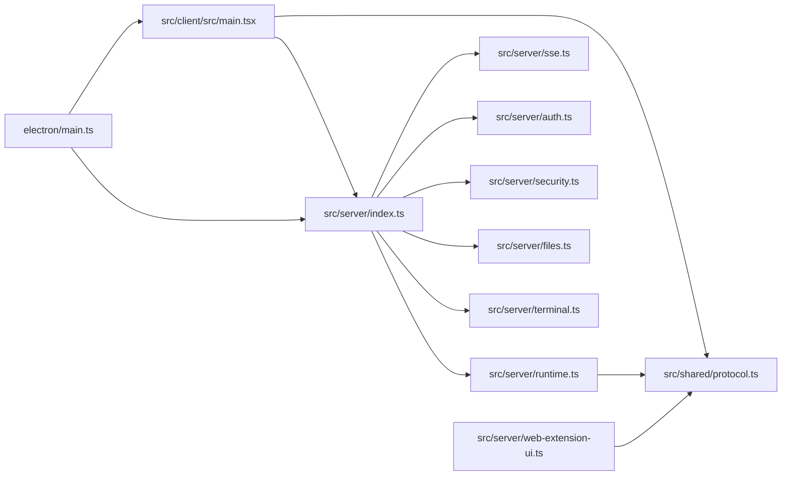

# Architecture Overview

<cite>
**Referenced Files in This Document**
- [README.md](file://README.md)
- [package.json](file://package.json)
- [vite.config.ts](file://vite.config.ts)
- [src/shared/protocol.ts](file://src/shared/protocol.ts)
- [src/server/index.ts](file://src/server/index.ts)
- [src/server/runtime.ts](file://src/server/runtime.ts)
- [src/server/sse.ts](file://src/server/sse.ts)
- [src/server/web-extension-ui.ts](file://src/server/web-extension-ui.ts)
- [src/server/auth.ts](file://src/server/auth.ts)
- [src/server/security.ts](file://src/server/security.ts)
- [src/server/terminal.ts](file://src/server/terminal.ts)
- [src/server/files.ts](file://src/server/files.ts)
- [src/client/src/main.tsx](file://src/client/src/main.tsx)
- [src/client/src/lib/api.ts](file://src/client/src/lib/api.ts)
- [src/client/src/state/app-store.ts](file://src/client/src/state/app-store.ts)
- [electron/main.ts](file://electron/main.ts)
</cite>

## Table of Contents
1. [Introduction](#introduction)
2. [Project Structure](#project-structure)
3. [Core Components](#core-components)
4. [Architecture Overview](#architecture-overview)
5. [Detailed Component Analysis](#detailed-component-analysis)
6. [Dependency Analysis](#dependency-analysis)
7. [Performance Considerations](#performance-considerations)
8. [Troubleshooting Guide](#troubleshooting-guide)
9. [Conclusion](#conclusion)

## Introduction
This document describes the architecture of Quake Code Web, a React-based browser application that shares the same AgentSession runtime as the terminal UI. The system consists of:
- React frontend (Vite) for UI and user interactions
- Node.js HTTP server with Server-Sent Events (SSE) for runtime event streaming
- Electron desktop wrapper for packaged distribution
- Shared protocol layer defining event and command contracts
- Integration with the AgentSession runtime via a bridge pattern

The architecture emphasizes separation of concerns: the UI focuses on presentation and ergonomics, while AI processing, tool execution, and runtime orchestration remain in the shared AgentSession runtime.

## Project Structure
The repository follows a layered structure:
- Frontend: React + TypeScript + Vite under src/client
- Backend: Node.js HTTP server under src/server
- Shared contracts: Protocol definitions under src/shared
- Desktop packaging: Electron wrapper under electron
- Build tooling: Vite configuration and scripts under package.json

**Diagram sources**
- [electron/main.ts:1-171](file://electron/main.ts#L1-L171)
- [src/server/index.ts:1-679](file://src/server/index.ts#L1-L679)
- [src/server/runtime.ts:1-499](file://src/server/runtime.ts#L1-L499)
- [src/server/sse.ts:1-32](file://src/server/sse.ts#L1-L32)
- [src/server/web-extension-ui.ts:1-309](file://src/server/web-extension-ui.ts#L1-L309)
- [src/server/auth.ts:1-56](file://src/server/auth.ts#L1-L56)
- [src/server/security.ts:1-47](file://src/server/security.ts#L1-L47)
- [src/server/terminal.ts:1-87](file://src/server/terminal.ts#L1-L87)
- [src/server/files.ts:1-131](file://src/server/files.ts#L1-L131)
- [src/client/src/main.tsx:1-800](file://src/client/src/main.tsx#L1-L800)
- [src/client/src/lib/api.ts:1-59](file://src/client/src/lib/api.ts#L1-L59)
- [src/client/src/state/app-store.ts:1-253](file://src/client/src/state/app-store.ts#L1-L253)
- [src/shared/protocol.ts:1-198](file://src/shared/protocol.ts#L1-L198)

**Section sources**
- [README.md:18-103](file://README.md#L18-L103)
- [package.json:1-69](file://package.json#L1-L69)
- [vite.config.ts:1-50](file://vite.config.ts#L1-L50)

## Core Components
- Electron wrapper: Launches the backend server and hosts the React app in a secure BrowserWindow. It manages development vs production startup and integrates with the backend lifecycle.
- Node.js HTTP server: Provides REST endpoints for configuration, sessions, models, files, terminal, and scheduling; exposes SSE for runtime events; handles authentication and security policies.
- AgentSession runtime bridge: Creates and manages the runtime, subscribes to session events, forwards events to the UI via SSE, and translates UI commands into runtime actions.
- Web extension UI bridge: Bridges extension UI requests (dialogs, notifications, widgets, status) to the frontend through SSE.
- Frontend React app: Implements UI chrome, panels, editors, and tool renderers; connects to SSE for real-time updates and sends commands via REST.
- Shared protocol: Defines typed contracts for runtime events, client commands, and UI requests to ensure loose coupling and clear boundaries.

**Section sources**
- [src/server/index.ts:1-679](file://src/server/index.ts#L1-L679)
- [src/server/runtime.ts:1-499](file://src/server/runtime.ts#L1-L499)
- [src/server/web-extension-ui.ts:1-309](file://src/server/web-extension-ui.ts#L1-L309)
- [src/client/src/main.tsx:1-800](file://src/client/src/main.tsx#L1-L800)
- [src/shared/protocol.ts:1-198](file://src/shared/protocol.ts#L1-L198)

## Architecture Overview
The system uses a layered, event-driven design:
- Presentation layer: React components manage UI state and user interactions.
- Application layer: API handlers translate HTTP requests into runtime commands and vice versa.
- Integration layer: SSE streams runtime events to the UI; the runtime bridge ensures UI state reflects runtime changes.
- Runtime layer: AgentSession orchestrates AI processing, tool execution, and extension interactions.

**Diagram sources**
- [src/client/src/main.tsx:1-800](file://src/client/src/main.tsx#L1-L800)
- [src/server/index.ts:1-679](file://src/server/index.ts#L1-L679)
- [src/server/runtime.ts:1-499](file://src/server/runtime.ts#L1-L499)
- [src/server/sse.ts:1-32](file://src/server/sse.ts#L1-L32)
- [src/server/web-extension-ui.ts:1-309](file://src/server/web-extension-ui.ts#L1-L309)
- [src/server/auth.ts:1-56](file://src/server/auth.ts#L1-L56)
- [src/server/security.ts:1-47](file://src/server/security.ts#L1-L47)
- [src/server/terminal.ts:1-87](file://src/server/terminal.ts#L1-L87)
- [src/server/files.ts:1-131](file://src/server/files.ts#L1-L131)
- [electron/main.ts:1-171](file://electron/main.ts#L1-L171)

## Detailed Component Analysis

### Layered Architecture Pattern
- Presentation layer: React components encapsulate UI chrome, panels, and editors; state management via Zustand.
- Application layer: HTTP endpoints expose configuration, sessions, models, files, terminal, and scheduling; SSE endpoint streams runtime events.
- Integration layer: Runtime bridge subscribes to AgentSession events and forwards them to the UI; extension UI bridge translates extension requests to UI actions.
- Runtime layer: AgentSession orchestrates AI processing, tool execution, and extension interactions; maintains session state and settings.

**Diagram sources**
- [src/client/src/main.tsx:1-800](file://src/client/src/main.tsx#L1-L800)
- [src/client/src/state/app-store.ts:1-253](file://src/client/src/state/app-store.ts#L1-L253)
- [src/server/index.ts:1-679](file://src/server/index.ts#L1-L679)
- [src/server/auth.ts:1-56](file://src/server/auth.ts#L1-L56)
- [src/server/security.ts:1-47](file://src/server/security.ts#L1-L47)
- [src/server/files.ts:1-131](file://src/server/files.ts#L1-L131)
- [src/server/terminal.ts:1-87](file://src/server/terminal.ts#L1-L87)
- [src/server/runtime.ts:1-499](file://src/server/runtime.ts#L1-L499)
- [src/server/sse.ts:1-32](file://src/server/sse.ts#L1-L32)
- [src/server/web-extension-ui.ts:1-309](file://src/server/web-extension-ui.ts#L1-L309)

**Section sources**
- [src/client/src/main.tsx:570-615](file://src/client/src/main.tsx#L570-L615)
- [src/server/index.ts:401-659](file://src/server/index.ts#L401-L659)
- [src/server/runtime.ts:413-426](file://src/server/runtime.ts#L413-L426)

### Event-Driven Communication with Server-Sent Events
The SSE hub streams runtime events to the UI:
- The UI establishes an SSE connection to receive real-time updates.
- The runtime bridge subscribes to AgentSession events and forwards them to the SSE hub.
- The UI updates state and renders new messages, tool outputs, and plan clarifications.

**Diagram sources**
- [src/client/src/main.tsx:570-588](file://src/client/src/main.tsx#L570-L588)
- [src/server/index.ts:408-412](file://src/server/index.ts#L408-L412)
- [src/server/runtime.ts:56-58](file://src/server/runtime.ts#L56-L58)
- [src/server/sse.ts:21-26](file://src/server/sse.ts#L21-L26)

**Section sources**
- [src/client/src/main.tsx:570-588](file://src/client/src/main.tsx#L570-L588)
- [src/server/sse.ts:6-31](file://src/server/sse.ts#L6-L31)
- [src/server/runtime.ts:452-455](file://src/server/runtime.ts#L452-L455)

### Bridge Pattern for Runtime Integration
The runtime bridge integrates the AgentSession runtime with the web server:
- Creates and manages the runtime host.
- Subscribes to session events and forwards them to the SSE hub.
- Translates UI commands into runtime actions (e.g., prompt, abort, session switching).
- Exposes extension UI context to extensions and forwards UI requests back to the UI.

**Diagram sources**
- [src/server/runtime.ts:12-456](file://src/server/runtime.ts#L12-L456)
- [src/server/sse.ts:6-31](file://src/server/sse.ts#L6-L31)
- [src/server/web-extension-ui.ts:27-244](file://src/server/web-extension-ui.ts#L27-L244)

**Section sources**
- [src/server/runtime.ts:24-30](file://src/server/runtime.ts#L24-L30)
- [src/server/runtime.ts:413-426](file://src/server/runtime.ts#L413-L426)
- [src/server/web-extension-ui.ts:48-134](file://src/server/web-extension-ui.ts#L48-L134)

### Data Flows Between Frontend and Backend
- UI commands: The UI sends commands (prompt, abort, session switches, settings) via POST /api/command to the server, which executes them against the runtime.
- Runtime state: The server periodically emits state updates via SSE; the UI refreshes session state and reconciles UI state on visibility changes.
- File operations: The UI requests file listings and previews via GET /api/files and GET /api/file; writes and mutations are handled via POST endpoints.
- Terminal operations: The UI runs terminal commands via POST /api/terminal/run; output is streamed via SSE terminal events.

**Diagram sources**
- [src/client/src/main.tsx:378-398](file://src/client/src/main.tsx#L378-L398)
- [src/server/index.ts:626-644](file://src/server/index.ts#L626-L644)
- [src/server/runtime.ts:60-62](file://src/server/runtime.ts#L60-L62)
- [src/server/files.ts:16-29](file://src/server/files.ts#L16-L29)
- [src/server/terminal.ts:36-85](file://src/server/terminal.ts#L36-L85)

**Section sources**
- [src/client/src/main.tsx:378-398](file://src/client/src/main.tsx#L378-L398)
- [src/server/index.ts:417-419](file://src/server/index.ts#L417-L419)
- [src/server/index.ts:626-644](file://src/server/index.ts#L626-L644)

### Electron Desktop Wrapper Integration
The Electron wrapper:
- Starts the backend server (development or production) and waits for it to listen.
- Creates a BrowserWindow hosting the React app and enforces security (external links, navigation limits).
- Manages IPC for window controls and theme overlays.
- Supports changing workspaces and restarting the backend with a new CWD.

**Diagram sources**
- [electron/main.ts:132-138](file://electron/main.ts#L132-L138)
- [electron/main.ts:26-43](file://electron/main.ts#L26-L43)
- [electron/main.ts:68-114](file://electron/main.ts#L68-L114)

**Section sources**
- [electron/main.ts:132-138](file://electron/main.ts#L132-L138)
- [electron/main.ts:26-43](file://electron/main.ts#L26-L43)
- [electron/main.ts:68-114](file://electron/main.ts#L68-L114)

## Dependency Analysis
The system exhibits clear separation of concerns:
- Frontend depends on shared protocol types and the HTTP API.
- Backend depends on the runtime bridge, SSE hub, and service layers.
- Electron wrapper depends on the backend entry and manages lifecycle.

**Diagram sources**
- [src/client/src/main.tsx:1-800](file://src/client/src/main.tsx#L1-L800)
- [src/shared/protocol.ts:1-198](file://src/shared/protocol.ts#L1-L198)
- [src/server/index.ts:1-679](file://src/server/index.ts#L1-L679)
- [src/server/runtime.ts:1-499](file://src/server/runtime.ts#L1-L499)
- [src/server/web-extension-ui.ts:1-309](file://src/server/web-extension-ui.ts#L1-L309)
- [electron/main.ts:1-171](file://electron/main.ts#L1-L171)

**Section sources**
- [src/shared/protocol.ts:161-198](file://src/shared/protocol.ts#L161-L198)
- [src/server/index.ts:10-25](file://src/server/index.ts#L10-L25)
- [package.json:25-56](file://package.json#L25-L56)

## Performance Considerations
- SSE streaming: Efficient for real-time updates; ensure minimal payload sizes and avoid excessive churn.
- Terminal output buffering: Limits output size and duration to prevent memory pressure.
- File preview limits: Enforces a maximum preview size to protect the UI.
- UI state normalization: Deduplicates messages and prunes tool outputs to maintain responsiveness.
- Chunking and lazy loading: Vite splits vendor bundles and defers heavy components (Monaco, terminal) to reduce initial load.

[No sources needed since this section provides general guidance]

## Troubleshooting Guide
Common issues and remedies:
- Authentication failures: Verify the token header or query parameter; check token generation and persistence.
- Remote binding restrictions: Ensure QUAKE_WEB_ALLOW_REMOTE=1 is set before binding to 0.0.0.0.
- Workspace allowlist violations: Confirm the current working directory is within allowed roots.
- Terminal policy blocking: Adjust terminal policy mode to allow-all or safe depending on environment.
- SSE connection drops: UI automatically refreshes state; check server logs for disconnects.

**Section sources**
- [src/server/auth.ts:15-29](file://src/server/auth.ts#L15-L29)
- [src/server/security.ts:24-41](file://src/server/security.ts#L24-L41)
- [src/server/terminal.ts:42-43](file://src/server/terminal.ts#L42-L43)
- [src/client/src/main.tsx:578-582](file://src/client/src/main.tsx#L578-L582)

## Conclusion
Quake Code Web's architecture cleanly separates UI presentation from AI processing by sharing the AgentSession runtime across the web and terminal interfaces. The event-driven SSE model, combined with a robust bridge pattern, enables real-time collaboration between the frontend and backend while maintaining strong security defaults. The Electron wrapper provides a seamless desktop experience, and the shared protocol ensures consistent contracts across components.
