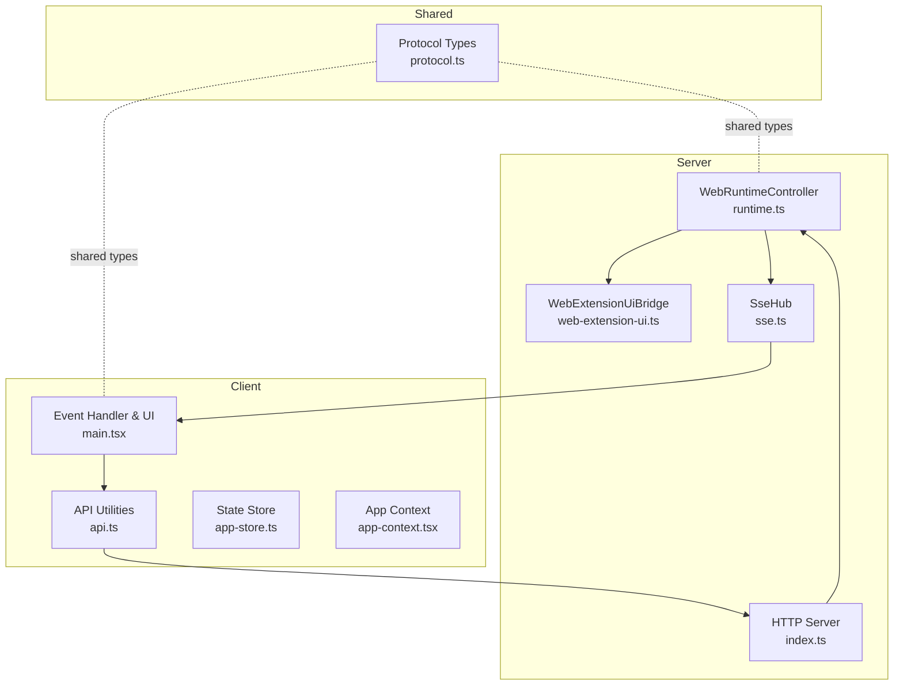
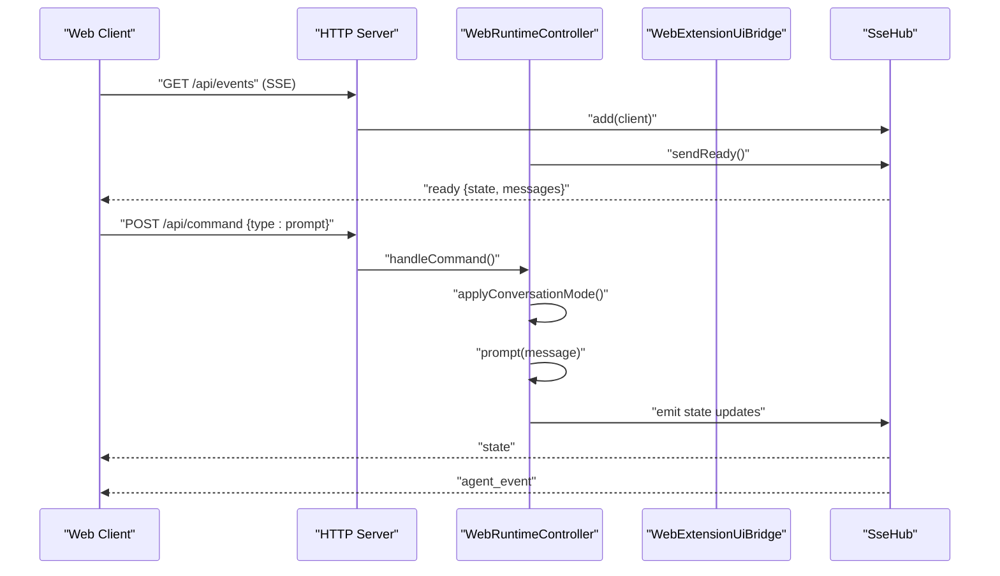
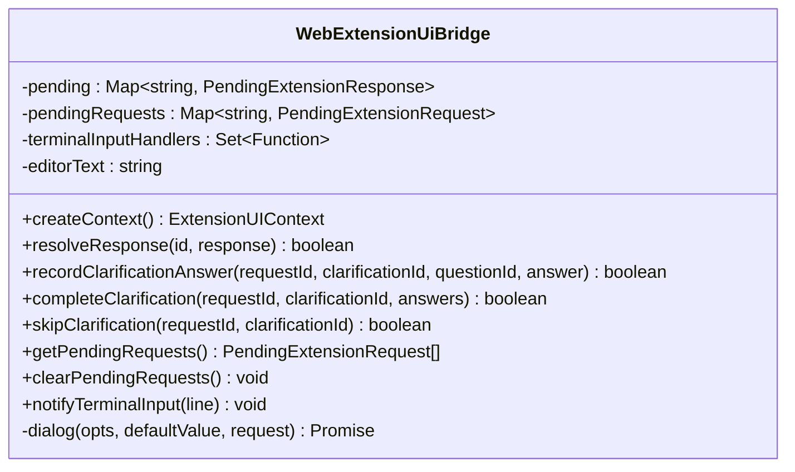
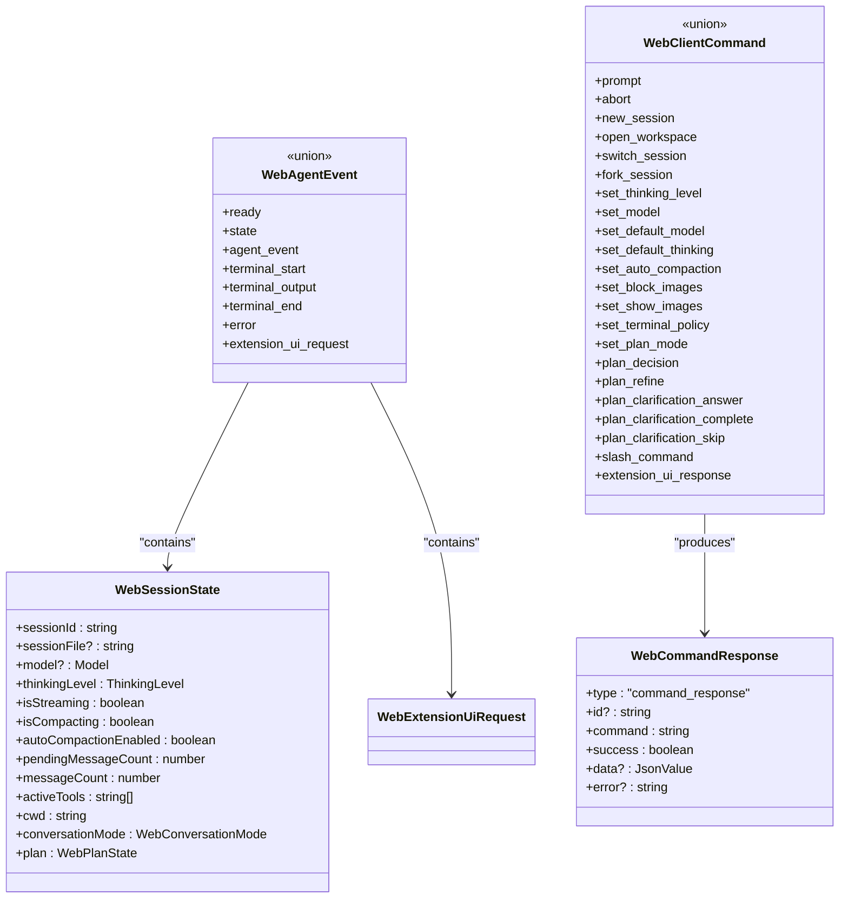
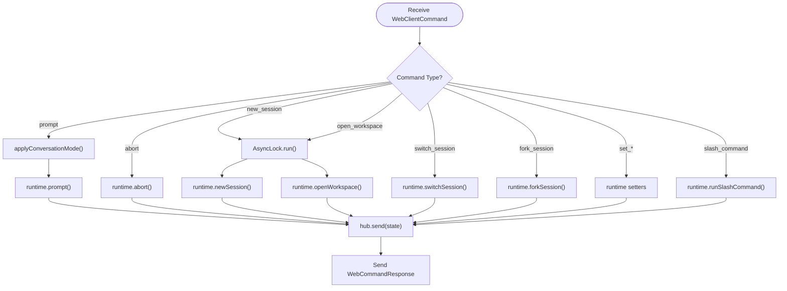
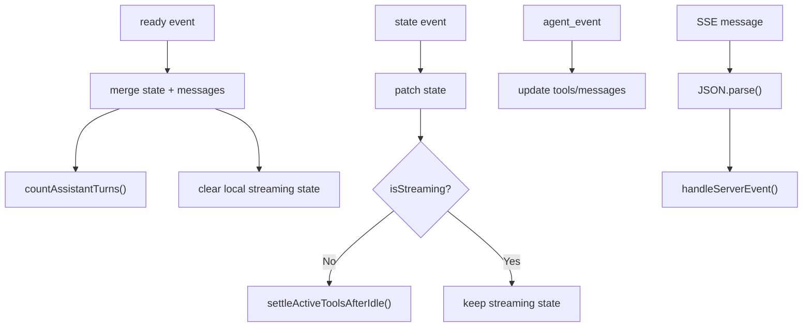
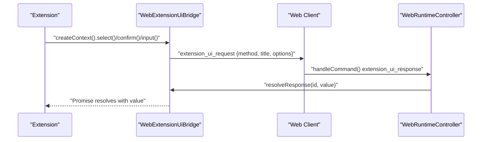
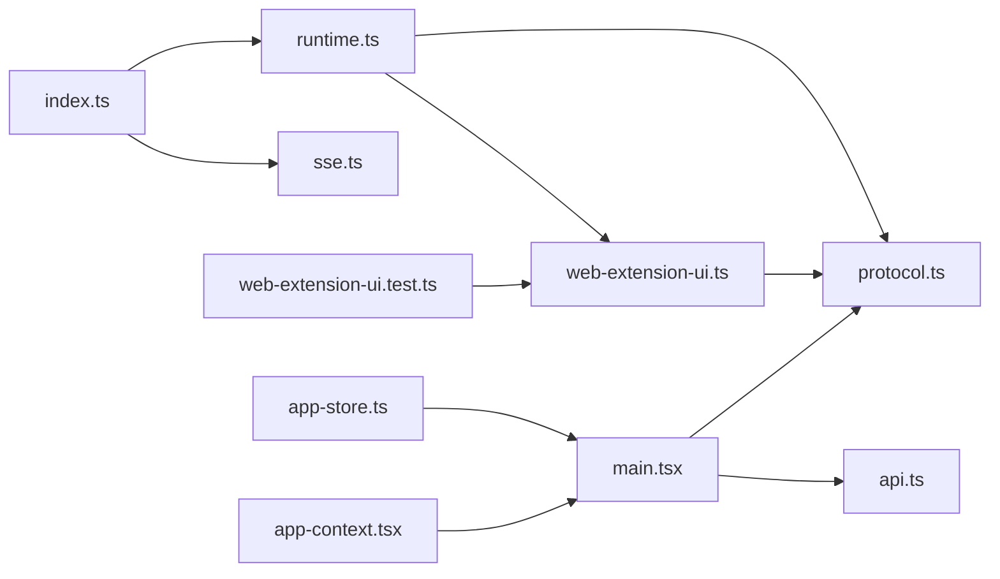

# AgentSession Runtime Integration

<cite>
**Referenced Files in This Document**
- [runtime.ts](file://src/server/runtime.ts)
- [protocol.ts](file://src/shared/protocol.ts)
- [web-extension-ui.ts](file://src/server/web-extension-ui.ts)
- [index.ts](file://src/server/index.ts)
- [sse.ts](file://src/server/sse.ts)
- [api.ts](file://src/client/src/lib/api.ts)
- [main.tsx](file://src/client/src/main.tsx)
- [app-store.ts](file://src/client/src/state/app-store.ts)
- [app-context.tsx](file://src/client/src/state/app-context.tsx)
- [web-extension-ui.test.ts](file://test/web-extension-ui.test.ts)
</cite>

## Table of Contents
1. [Introduction](#introduction)
2. [Project Structure](#project-structure)
3. [Core Components](#core-components)
4. [Architecture Overview](#architecture-overview)
5. [Detailed Component Analysis](#detailed-component-analysis)
6. [Dependency Analysis](#dependency-analysis)
7. [Performance Considerations](#performance-considerations)
8. [Troubleshooting Guide](#troubleshooting-guide)
9. [Conclusion](#conclusion)

## Introduction
This document describes the AgentSession runtime integration layer that connects the web interface with the AI processing engine. It covers the runtime controller architecture, command processing pipeline, state management coordination, and the WebExtension UI bridge for custom tool integration. The system uses a bidirectional communication pattern via Server-Sent Events (SSE) and a typed protocol for message serialization. The documentation includes examples of runtime initialization, command execution flows, and strategies for maintaining consistency across concurrent sessions. Performance considerations, memory management, and debugging capabilities are also addressed.

## Project Structure
The runtime integration spans three primary areas:
- Server-side runtime controller and SSE hub
- Shared protocol definitions for client-server messaging
- Client-side state management and event handling



**Diagram sources**
- [runtime.ts:12-30](file://src/server/runtime.ts#L12-L30)
- [web-extension-ui.ts:27-33](file://src/server/web-extension-ui.ts#L27-L33)
- [sse.ts:6-31](file://src/server/sse.ts#L6-L31)
- [index.ts:53-63](file://src/server/index.ts#L53-L63)
- [protocol.ts:1-198](file://src/shared/protocol.ts#L1-L198)
- [api.ts:1-59](file://src/client/src/lib/api.ts#L1-L59)
- [main.tsx:573-588](file://src/client/src/main.tsx#L573-L588)
- [app-store.ts:186-252](file://src/client/src/state/app-store.ts#L186-L252)
- [app-context.tsx:33-57](file://src/client/src/state/app-context.tsx#L33-L57)

**Section sources**
- [runtime.ts:12-30](file://src/server/runtime.ts#L12-L30)
- [protocol.ts:1-198](file://src/shared/protocol.ts#L1-L198)
- [web-extension-ui.ts:27-33](file://src/server/web-extension-ui.ts#L27-L33)
- [index.ts:53-63](file://src/server/index.ts#L53-L63)
- [sse.ts:6-31](file://src/server/sse.ts#L6-L31)
- [api.ts:1-59](file://src/client/src/lib/api.ts#L1-L59)
- [main.tsx:573-588](file://src/client/src/main.tsx#L573-L588)
- [app-store.ts:186-252](file://src/client/src/state/app-store.ts#L186-L252)
- [app-context.tsx:33-57](file://src/client/src/state/app-context.tsx#L33-L57)

## Core Components
- WebRuntimeController: Orchestrates the AgentSession runtime, exposes session state, handles commands, and binds extension UI contexts.
- WebExtensionUiBridge: Manages extension UI requests/responses, plan clarification workflows, and pending dialog lifecycles.
- SseHub: Broadcasts real-time events to connected clients via SSE.
- Protocol Types: Define the message schemas for commands, responses, agent events, and UI requests.
- Client-side State Management: Maintains UI state, tools, messages, and widgets; reconciles with server state.

Key responsibilities:
- Runtime initialization and session binding
- Command routing and validation
- Plan mode and clarification state derivation
- Bidirectional SSE communication
- Client-side state normalization and pruning

**Section sources**
- [runtime.ts:12-30](file://src/server/runtime.ts#L12-L30)
- [runtime.ts:36-54](file://src/server/runtime.ts#L36-L54)
- [runtime.ts:413-426](file://src/server/runtime.ts#L413-L426)
- [web-extension-ui.ts:27-33](file://src/server/web-extension-ui.ts#L27-L33)
- [web-extension-ui.ts:148-191](file://src/server/web-extension-ui.ts#L148-L191)
- [sse.ts:6-31](file://src/server/sse.ts#L6-L31)
- [protocol.ts:132-197](file://src/shared/protocol.ts#L132-L197)
- [app-store.ts:186-252](file://src/client/src/state/app-store.ts#L186-L252)

## Architecture Overview
The runtime integration follows a layered architecture:
- HTTP server exposes REST endpoints and SSE streams
- WebRuntimeController mediates between the UI and the AgentSession runtime
- WebExtensionUiBridge provides a bridge for extension dialogs and plan clarifications
- Client subscribes to SSE events and updates local state accordingly



**Diagram sources**
- [index.ts:401-412](file://src/server/index.ts#L401-L412)
- [runtime.ts:56-58](file://src/server/runtime.ts#L56-L58)
- [runtime.ts:255-374](file://src/server/runtime.ts#L255-L374)
- [sse.ts:21-26](file://src/server/sse.ts#L21-L26)
- [main.tsx:1144-1176](file://src/client/src/main.tsx#L1144-L1176)

## Detailed Component Analysis

### WebRuntimeController
Responsibilities:
- Initialize runtime with working directory
- Bind current session and subscribe to AgentSession events
- Expose session state and runtime settings
- Route slash commands and manage conversation modes
- Coordinate plan mode, clarifications, and extension UI requests
- Handle session lifecycle operations (new, switch, fork, open workspace)

```mermaid
classDiagram
class WebRuntimeController {
-host : AgentSessionRuntimeHost
-unsubscribe : Function
+extensionUi : WebExtensionUiBridge
-currentCwd : string
+create(hub, cwd) WebRuntimeController
+getState() WebSessionState
+sendReady() void
+prompt(message, options) Promise<void>
+setPlanMode(enabled) Promise<void>
+applyConversationMode(mode) Promise<void>
+recordPlanClarificationAnswer(args) void
+completePlanClarification(args) void
+skipPlanClarification(args) void
+abort() Promise<void>
+cancelPendingInteractions() void
+newSession() Promise<{cancelled}>
+openWorkspace(cwd) Promise<void>
+switchSession(sessionPath) Promise<{cancelled}>
+forkSession(entryId) Promise<{cancelled}>
+setThinkingLevel(level) Promise<void>
+getRuntimeSettings() WebRuntimeSettings
+setDefaultModel(provider, modelId) Promise<void>
+setDefaultThinkingLevel(level) Promise<void>
+setAutoCompactionEnabled(enabled) Promise<void>
+setBlockImages(blocked) Promise<void>
+setShowImages(show) Promise<void>
+listSessions(all) Promise<WebSessionSummary[]>
+listModels() Promise<WebModelSummary[]>
+listCommands() WebCommandInfo[]
+setModel(provider, modelId) Promise<void>
+runSlashCommand(command, args) Promise<void>
-getPlanState() WebPlanState
-toSessionSummary(session) WebSessionSummary
-emitState() void
-rebindAfterRuntimeChange() Promise<void>
-bindCurrentSession() Promise<void>
-createCommandActions() ExtensionCommandContextActions
-forwardEvent(event) void
}
```

**Diagram sources**
- [runtime.ts:12-30](file://src/server/runtime.ts#L12-L30)
- [runtime.ts:36-54](file://src/server/runtime.ts#L36-L54)
- [runtime.ts:413-426](file://src/server/runtime.ts#L413-L426)

**Section sources**
- [runtime.ts:24-30](file://src/server/runtime.ts#L24-L30)
- [runtime.ts:36-54](file://src/server/runtime.ts#L36-L54)
- [runtime.ts:413-426](file://src/server/runtime.ts#L413-L426)
- [runtime.ts:452-455](file://src/server/runtime.ts#L452-L455)

### WebExtensionUiBridge
Responsibilities:
- Create extension UI context for runtime-bound extensions
- Manage dialog lifecycles with timeouts and AbortSignal support
- Track and resolve pending extension UI requests
- Normalize and validate plan clarification answers
- Forward terminal input to extension listeners



**Diagram sources**
- [web-extension-ui.ts:27-33](file://src/server/web-extension-ui.ts#L27-L33)
- [web-extension-ui.ts:148-191](file://src/server/web-extension-ui.ts#L148-L191)

**Section sources**
- [web-extension-ui.ts:48-134](file://src/server/web-extension-ui.ts#L48-L134)
- [web-extension-ui.ts:148-191](file://src/server/web-extension-ui.ts#L148-L191)
- [web-extension-ui.ts:204-243](file://src/server/web-extension-ui.ts#L204-L243)

### Protocol Definitions and Serialization
The protocol defines:
- WebSessionState: runtime state snapshot
- WebAgentEvent: SSE event envelope
- WebClientCommand: client-to-server commands
- WebCommandResponse: server-to-client responses
- WebExtensionUiRequest: extension UI request variants

Serialization uses JSON over HTTP and SSE. The client validates responses and handles errors gracefully.



**Diagram sources**
- [protocol.ts:132-197](file://src/shared/protocol.ts#L132-L197)

**Section sources**
- [protocol.ts:132-197](file://src/shared/protocol.ts#L132-L197)

### Command Processing Pipeline
The server routes commands through a lock-protected handler that:
- Cancels pending interactions for session-changing commands
- Applies conversation mode when applicable
- Executes runtime operations (prompt, abort, session switches)
- Returns structured responses with success/error



**Diagram sources**
- [index.ts:255-374](file://src/server/index.ts#L255-L374)
- [runtime.ts:60-62](file://src/server/runtime.ts#L60-L62)
- [runtime.ts:114-116](file://src/server/runtime.ts#L114-L116)
- [runtime.ts:123-132](file://src/server/runtime.ts#L123-L132)
- [runtime.ts:145-154](file://src/server/runtime.ts#L145-L154)
- [runtime.ts:156-165](file://src/server/runtime.ts#L156-L165)
- [runtime.ts:167-196](file://src/server/runtime.ts#L167-L196)
- [runtime.ts:296-339](file://src/server/runtime.ts#L296-L339)

**Section sources**
- [index.ts:255-374](file://src/server/index.ts#L255-L374)
- [runtime.ts:60-62](file://src/server/runtime.ts#L60-L62)
- [runtime.ts:114-116](file://src/server/runtime.ts#L114-L116)
- [runtime.ts:123-132](file://src/server/runtime.ts#L123-L132)
- [runtime.ts:145-154](file://src/server/runtime.ts#L145-L154)
- [runtime.ts:156-165](file://src/server/runtime.ts#L156-L165)
- [runtime.ts:167-196](file://src/server/runtime.ts#L167-L196)
- [runtime.ts:296-339](file://src/server/runtime.ts#L296-L339)

### State Management Coordination
The client maintains a normalized state store with:
- Message deduplication and identity hashing
- Tool pruning and recency-based eviction
- Streaming message and tool card updates
- Widget, sidebar, and status management



**Diagram sources**
- [main.tsx:1144-1176](file://src/client/src/main.tsx#L1144-L1176)
- [app-store.ts:102-127](file://src/client/src/state/app-store.ts#L102-L127)
- [app-store.ts:137-170](file://src/client/src/state/app-store.ts#L137-L170)

**Section sources**
- [main.tsx:1144-1176](file://src/client/src/main.tsx#L1144-L1176)
- [app-store.ts:102-127](file://src/client/src/state/app-store.ts#L102-L127)
- [app-store.ts:137-170](file://src/client/src/state/app-store.ts#L137-L170)

### WebExtension UI Bridge for Custom Tools
The bridge enables extensions to:
- Request user decisions (select, confirm, input)
- Present plan clarifications with normalized questions and answers
- Notify terminal input handlers
- Update UI widgets and sidebars



**Diagram sources**
- [web-extension-ui.ts:48-134](file://src/server/web-extension-ui.ts#L48-L134)
- [web-extension-ui.ts:136-146](file://src/server/web-extension-ui.ts#L136-L146)
- [index.ts:274-276](file://src/server/index.ts#L274-L276)
- [main.tsx:1171](file://src/client/src/main.tsx#L1171)

**Section sources**
- [web-extension-ui.ts:48-134](file://src/server/web-extension-ui.ts#L48-L134)
- [web-extension-ui.ts:136-146](file://src/server/web-extension-ui.ts#L136-L146)
- [index.ts:274-276](file://src/server/index.ts#L274-L276)
- [main.tsx:1171](file://src/client/src/main.tsx#L1171)

## Dependency Analysis
The runtime integration exhibits clear separation of concerns:
- Server depends on runtime and extension UI bridge
- SSE hub decouples event broadcasting from runtime
- Client consumes protocol types and updates state store
- Tests validate extension UI behavior



**Diagram sources**
- [index.ts:53-63](file://src/server/index.ts#L53-L63)
- [runtime.ts:12-30](file://src/server/runtime.ts#L12-L30)
- [web-extension-ui.ts:27-33](file://src/server/web-extension-ui.ts#L27-L33)
- [protocol.ts:1-198](file://src/shared/protocol.ts#L1-198)
- [api.ts:1-59](file://src/client/src/lib/api.ts#L1-L59)
- [main.tsx:573-588](file://src/client/src/main.tsx#L573-L588)
- [app-store.ts:186-252](file://src/client/src/state/app-store.ts#L186-L252)
- [app-context.tsx:33-57](file://src/client/src/state/app-context.tsx#L33-L57)
- [web-extension-ui.test.ts:4-18](file://test/web-extension-ui.test.ts#L4-L18)

**Section sources**
- [index.ts:53-63](file://src/server/index.ts#L53-L63)
- [runtime.ts:12-30](file://src/server/runtime.ts#L12-L30)
- [web-extension-ui.ts:27-33](file://src/server/web-extension-ui.ts#L27-L33)
- [protocol.ts:1-198](file://src/shared/protocol.ts#L1-198)
- [api.ts:1-59](file://src/client/src/lib/api.ts#L1-L59)
- [main.tsx:573-588](file://src/client/src/main.tsx#L573-L588)
- [app-store.ts:186-252](file://src/client/src/state/app-store.ts#L186-L252)
- [app-context.tsx:33-57](file://src/client/src/state/app-context.tsx#L33-L57)
- [web-extension-ui.test.ts:4-18](file://test/web-extension-ui.test.ts#L4-L18)

## Performance Considerations
- Message normalization and deduplication reduce memory overhead and rendering cost.
- Tool pruning by recency prevents unbounded growth of tool cards.
- Streaming updates are scheduled with requestAnimationFrame to batch UI changes.
- SSE broadcast avoids polling and reduces server load.
- AsyncLock and SingleFlight prevent race conditions during session operations.
- Client-side reconciliation timers avoid stale UI when streaming stops unexpectedly.

Recommendations:
- Monitor message and tool counts; adjust limits if needed.
- Use streaming behavior options to steer or follow-up prompts.
- Enable auto-compaction judiciously to balance memory vs. context retention.
- Validate terminal policy mode to control resource usage.

**Section sources**
- [app-store.ts:102-127](file://src/client/src/state/app-store.ts#L102-L127)
- [app-store.ts:137-170](file://src/client/src/state/app-store.ts#L137-L170)
- [main.tsx:608-615](file://src/client/src/main.tsx#L608-L615)
- [index.ts:72-73](file://src/server/index.ts#L72-L73)

## Troubleshooting Guide
Common issues and resolutions:
- Event stream errors: The client warns once and attempts state reconciliation.
- Extension UI timeouts: Dialogs resolve with defaults after timeout or AbortSignal cancellation.
- Session switching failures: Ensure runtime is idle before switching; pending interactions are canceled.
- Plan clarification invalid: Attempted operations throw when clarification state changed; retry after state refresh.

Debugging tips:
- Inspect SSE connections and payloads in browser dev tools.
- Verify token-based authentication headers for protected endpoints.
- Use toast notifications and error events to surface runtime errors.
- Validate extension UI request IDs and clarify pending states.

**Section sources**
- [main.tsx:1193-1198](file://src/client/src/main.tsx#L1193-L1198)
- [web-extension-ui.ts:204-243](file://src/server/web-extension-ui.ts#L204-L243)
- [runtime.ts:263-264](file://src/server/runtime.ts#L263-L264)
- [web-extension-ui.test.ts:5-18](file://test/web-extension-ui.test.ts#L5-L18)

## Conclusion
The AgentSession runtime integration layer provides a robust, bidirectional bridge between the web UI and the AI processing engine. Through a well-defined protocol, SSE-based event streaming, and a coordinated state management approach, it ensures consistent behavior across concurrent sessions. The WebExtension UI bridge enables powerful custom tool integrations with structured dialog flows and plan clarifications. With careful attention to performance and debugging, the system scales effectively for interactive AI-assisted workflows.
