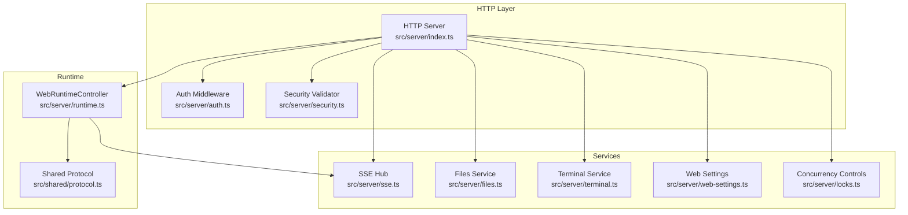
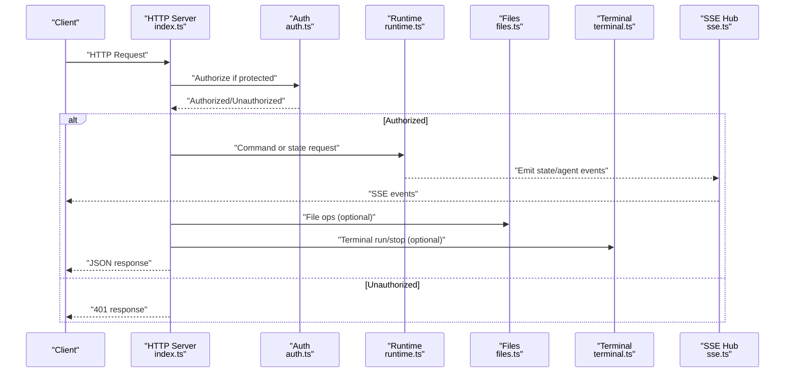
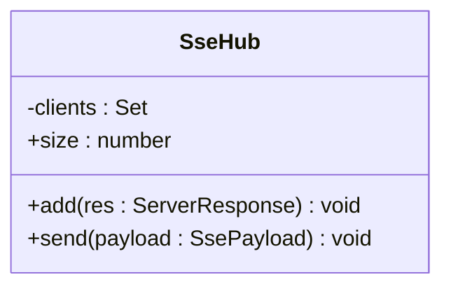
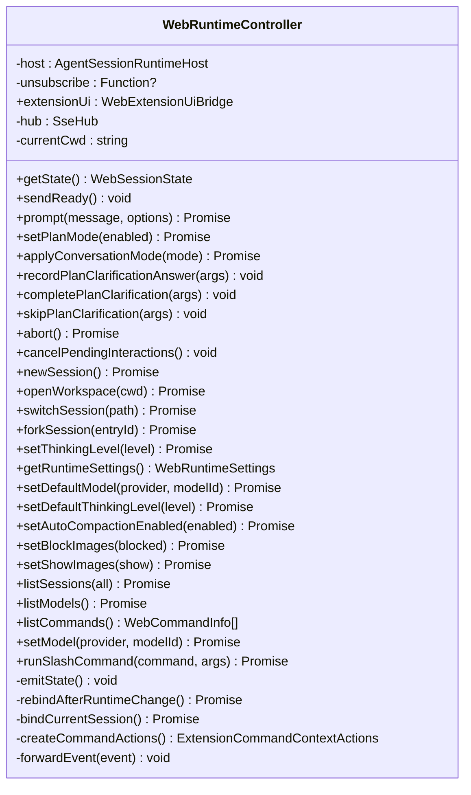
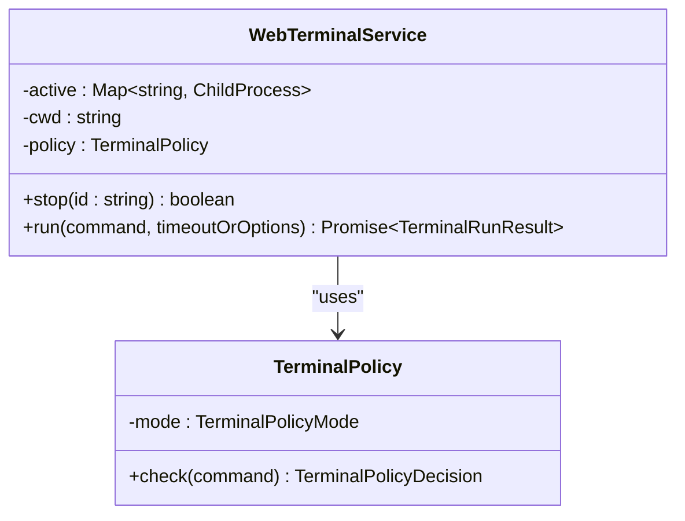
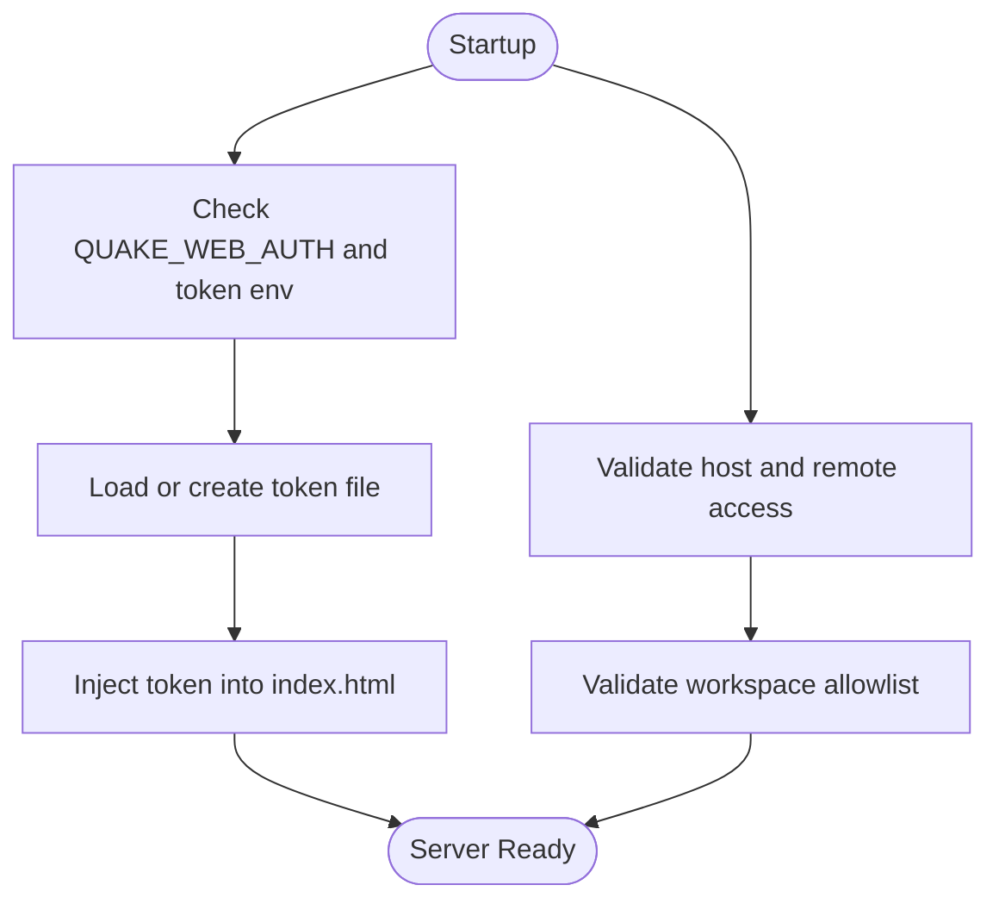
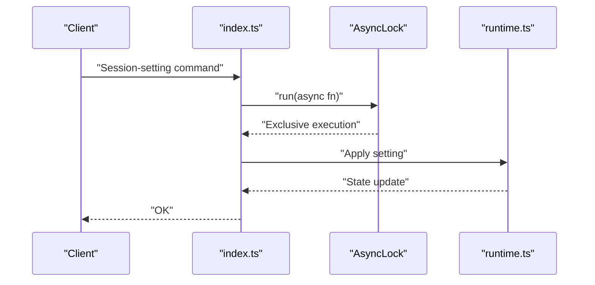
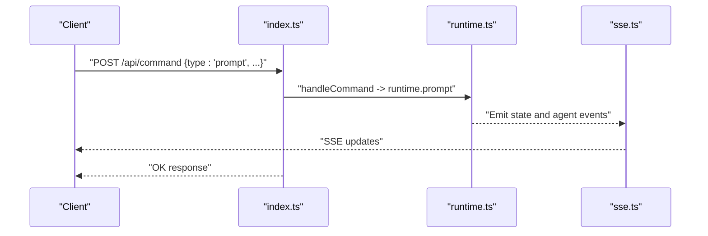
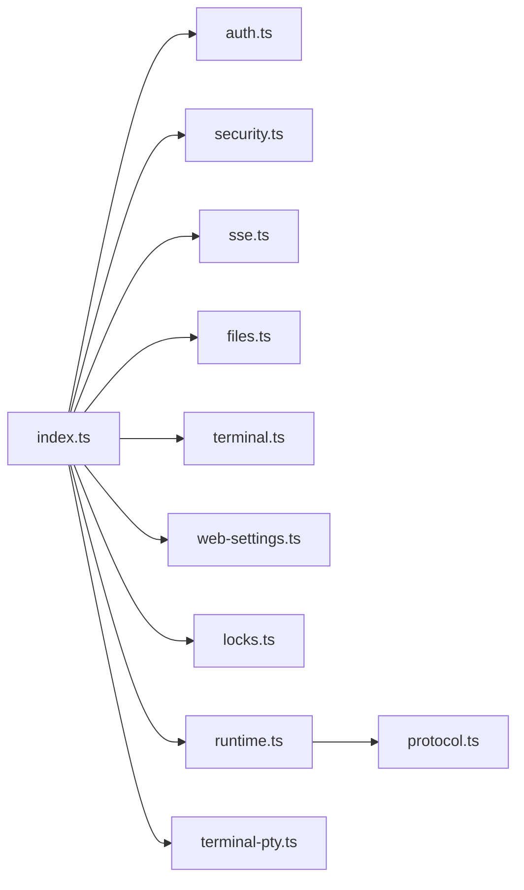

# Backend Architecture

<cite>
**Referenced Files in This Document**
- [index.ts](file://src/server/index.ts)
- [runtime.ts](file://src/server/runtime.ts)
- [sse.ts](file://src/server/sse.ts)
- [files.ts](file://src/server/files.ts)
- [terminal.ts](file://src/server/terminal.ts)
- [auth.ts](file://src/server/auth.ts)
- [security.ts](file://src/server/security.ts)
- [locks.ts](file://src/server/locks.ts)
- [terminal-policy.ts](file://src/server/terminal-policy.ts)
- [web-settings.ts](file://src/server/web-settings.ts)
- [protocol.ts](file://src/shared/protocol.ts)
</cite>

## Table of Contents
1. [Introduction](#introduction)
2. [Project Structure](#project-structure)
3. [Core Components](#core-components)
4. [Architecture Overview](#architecture-overview)
5. [Detailed Component Analysis](#detailed-component-analysis)
6. [Dependency Analysis](#dependency-analysis)
7. [Performance Considerations](#performance-considerations)
8. [Troubleshooting Guide](#troubleshooting-guide)
9. [Conclusion](#conclusion)

## Introduction
This document describes the backend architecture of the Node.js HTTP server that powers the web application. It focuses on the API routing system, the Server-Sent Events (SSE) hub, and the AgentSession runtime integration. The server is modular, with dedicated handlers for files, terminal, authentication, and security. It implements an event-driven communication model, robust request/response handling patterns, and concurrency controls to maintain state consistency across concurrent clients. The bridge between the HTTP API and the AgentSession runtime ensures seamless orchestration of conversational AI interactions, plan mode, and extension UI workflows.

## Project Structure
The server module is organized around a single entry point that wires together services, middleware, and the runtime. Key responsibilities:
- HTTP server bootstrap and routing
- Authentication and security enforcement
- SSE hub for real-time events
- File operations service
- Terminal execution service with policy enforcement
- Web settings persistence
- AgentSession runtime integration and state emission



**Diagram sources**
- [index.ts:401-662](file://src/server/index.ts#L401-L662)
- [auth.ts:6-55](file://src/server/auth.ts#L6-L55)
- [security.ts:24-41](file://src/server/security.ts#L24-L41)
- [sse.ts:6-31](file://src/server/sse.ts#L6-L31)
- [files.ts:13-131](file://src/server/files.ts#L13-L131)
- [terminal.ts:21-87](file://src/server/terminal.ts#L21-L87)
- [web-settings.ts:13-64](file://src/server/web-settings.ts#L13-L64)
- [runtime.ts:12-456](file://src/server/runtime.ts#L12-L456)
- [protocol.ts](file://src/shared/protocol.ts)

**Section sources**
- [index.ts:401-662](file://src/server/index.ts#L401-L662)

## Core Components
- HTTP Server and Routing: Centralized handler routes requests to appropriate endpoints, enforces auth for protected paths, and serves static assets.
- SSE Hub: Manages long-lived connections and broadcasts runtime and terminal events to subscribed clients.
- WebRuntimeController: Bridges HTTP commands to the AgentSession runtime, manages sessions, plan mode, and emits state updates.
- WebFileService: Provides secure file listing, search, and read operations with workspace boundary checks.
- WebTerminalService: Executes shell commands with policy enforcement, timeouts, and streaming output via SSE.
- WebAuth: Token-based authentication with secure comparison and client-side token injection.
- Security Validator: Validates host binding, remote access, and workspace allowlist constraints.
- Concurrency Controls: AsyncLock serializes sensitive runtime operations; SingleFlight prevents overlapping terminal runs.
- WebSettingsService: Persists and merges web UI preferences safely with atomic writes.

**Section sources**
- [index.ts:53-73](file://src/server/index.ts#L53-L73)
- [sse.ts:6-31](file://src/server/sse.ts#L6-L31)
- [runtime.ts:12-456](file://src/server/runtime.ts#L12-L456)
- [files.ts:13-131](file://src/server/files.ts#L13-L131)
- [terminal.ts:21-87](file://src/server/terminal.ts#L21-L87)
- [auth.ts:6-55](file://src/server/auth.ts#L6-L55)
- [security.ts:24-41](file://src/server/security.ts#L24-L41)
- [locks.ts:1-38](file://src/server/locks.ts#L1-L38)
- [web-settings.ts:13-64](file://src/server/web-settings.ts#L13-L64)

## Architecture Overview
The server follows a layered design:
- Transport: Node.js HTTP server
- Routing: Method/path-based dispatcher with auth gating
- Services: Modular handlers for files, terminal, settings, and Git operations
- Runtime: AgentSession runtime orchestrator emitting events and managing state
- SSE: Real-time event broadcast to clients
- Persistence: Atomic settings writes and file mutation services



**Diagram sources**
- [index.ts:401-662](file://src/server/index.ts#L401-L662)
- [auth.ts:15-29](file://src/server/auth.ts#L15-L29)
- [runtime.ts:56-58](file://src/server/runtime.ts#L56-L58)
- [sse.ts:21-26](file://src/server/sse.ts#L21-L26)
- [files.ts:16-61](file://src/server/files.ts#L16-L61)
- [terminal.ts:36-85](file://src/server/terminal.ts#L36-L85)

## Detailed Component Analysis

### HTTP Server and Routing
- Entry point initializes SSE hub, security validator, runtime controller, file/terminal/services, and locks.
- Central handler:
  - Enforces auth for protected routes under /api/.
  - SSE endpoint (/api/events) attaches clients and sends ready state.
  - Config/state/session/model/command/git/search/scheduler endpoints.
  - File operations: list, search, read, write, patch, delete, mkdir, rename, history, restore.
  - Terminal operations: run and stop with policy checks and streaming via SSE.
  - Static asset serving with MIME-type mapping and index token injection.
- Error handling:
  - Body parsing and JSON error responses with derived status codes.
  - Route-specific errors mapped to 4xx/5xx consistently.

```mermaid
flowchart TD
Start(["Incoming Request"]) --> ParseURL["Parse URL and Method"]
ParseURL --> AuthCheck{"Protected route?"}
AuthCheck --> |Yes| Authorize["WebAuth.isAuthorized"]
AuthCheck --> |No| RouteMatch["Route by Method/Path"]
Authorize --> |False| Respond401["Send 401 JSON"]
Authorize --> |True| RouteMatch
RouteMatch --> SSE["/api/events -> SSE.add"]
RouteMatch --> Config["/api/config -> JSON"]
RouteMatch --> State["/api/state -> JSON"]
RouteMatch --> Sessions["/api/sessions -> JSON"]
RouteMatch --> Settings["/api/settings -> JSON"]
RouteMatch --> Models["/api/models -> JSON"]
RouteMatch --> Commands["/api/commands -> JSON"]
RouteMatch --> Extensions["/api/extensions -> JSON"]
RouteMatch --> Skills["/api/skills -> JSON"]
RouteMatch --> Prompts["/api/prompts -> JSON"]
RouteMatch --> WebSettings["/api/web-settings -> JSON"]
RouteMatch --> WorkspaceRoots["/api/workspace/roots -> JSON"]
RouteMatch --> Browse["/api/workspace/browse -> JSON"]
RouteMatch --> Changes["/api/workspace/changes -> JSON"]
RouteMatch --> GitStatus["/api/git/status -> JSON"]
RouteMatch --> GitBranch["/api/git/branch -> JSON"]
RouteMatch --> GitDiff["/api/git/diff -> JSON"]
RouteMatch --> GitStage["/api/git/stage -> JSON"]
RouteMatch --> GitUnstage["/api/git/unstage -> JSON"]
RouteMatch --> GitCommit["/api/git/commit -> JSON"]
RouteMatch --> GitPush["/api/git/push -> JSON"]
RouteMatch --> GitPR["/api/git/pr -> JSON"]
RouteMatch --> Search["/api/search -> JSON"]
RouteMatch --> ScheduledList["/api/scheduled -> JSON"]
RouteMatch --> ScheduledCreate["/api/scheduled -> JSON"]
RouteMatch --> ScheduledOps["/api/scheduled/{id}/* -> JSON"]
RouteMatch --> PatchSettings["/api/web-settings -> JSON"]
RouteMatch --> FilesList["/api/files -> JSON"]
RouteMatch --> FilesSearch["/api/files/search -> JSON"]
RouteMatch --> FilesRead["/api/file -> JSON"]
RouteMatch --> FilesWrite["/api/file/write -> JSON"]
RouteMatch --> FilesPatch["/api/file/patch -> JSON"]
RouteMatch --> FilesDelete["/api/file/delete -> JSON"]
RouteMatch --> FilesMkdir["/api/file/mkdir -> JSON"]
RouteMatch --> FilesRename["/api/file/rename -> JSON"]
RouteMatch --> FileHistory["/api/file/history -> JSON"]
RouteMatch --> FileRestore["/api/file/restore -> JSON"]
RouteMatch --> CommandAPI["/api/command -> handleCommand"]
RouteMatch --> TerminalRun["/api/terminal/run -> TerminalService.run"]
RouteMatch --> TerminalStop["/api/terminal/stop -> TerminalService.stop"]
RouteMatch --> StaticServe["GET -> serveStatic"]
RouteMatch --> MethodNotAllowed["405 otherwise"]
SSE --> End
Config --> End
State --> End
Sessions --> End
Settings --> End
Models --> End
Commands --> End
Extensions --> End
Skills --> End
Prompts --> End
WebSettings --> End
WorkspaceRoots --> End
Browse --> End
Changes --> End
GitStatus --> End
GitBranch --> End
GitDiff --> End
GitStage --> End
GitUnstage --> End
GitCommit --> End
GitPush --> End
GitPR --> End
Search --> End
ScheduledList --> End
ScheduledCreate --> End
ScheduledOps --> End
PatchSettings --> End
FilesList --> End
FilesSearch --> End
FilesRead --> End
FilesWrite --> End
FilesPatch --> End
FilesDelete --> End
FilesMkdir --> End
FilesRename --> End
FileHistory --> End
FileRestore --> End
CommandAPI --> End
TerminalRun --> End
TerminalStop --> End
StaticServe --> End
MethodNotAllowed --> End
Respond401 --> End
End(["Response Sent"])
```



**Diagram sources**
- [index.ts:401-662](file://src/server/index.ts#L401-L662)

**Section sources**
- [index.ts:401-662](file://src/server/index.ts#L401-L662)

### Server-Sent Events Hub
- Maintains a set of active ServerResponse connections.
- Writes keep-alive headers and periodic heartbeats.
- Broadcasts payload to all clients; cleans up on close.
- Used to deliver runtime state, agent events, and terminal lifecycle updates.



**Diagram sources**
- [sse.ts:6-31](file://src/server/sse.ts#L6-L31)

**Section sources**
- [sse.ts:6-31](file://src/server/sse.ts#L6-L31)

### AgentSession Runtime Integration
- WebRuntimeController wraps the AgentSession runtime and exposes:
  - Conversation and plan mode control
  - Session management (new/open/switch/fork)
  - Model selection and settings
  - Command discovery and slash command execution
  - Event subscription and state emission
- Bridges runtime events to SSE for UI consumption.
- Integrates with WebExtensionUiBridge for plan clarifications and decisions.



**Diagram sources**
- [runtime.ts:12-456](file://src/server/runtime.ts#L12-L456)

**Section sources**
- [runtime.ts:12-456](file://src/server/runtime.ts#L12-L456)

### File Operations Service
- Secure file listing, search, and read with:
  - Path normalization and safe resolution within workspace root
  - Hidden and generated directory filtering
  - Size limits for previews
- Returns structured entries with metadata and relative paths.

```mermaid
classDiagram
class WebFileService {
-root : string
+list(dir, options) Promise<WebFileEntry[]>
+search(query, options) Promise<WebFileEntry[]>
+read(path) Promise<{path,content,size}>
-toEntry(fullPath, isDirectory) Promise
-shouldInclude(name, options) boolean
-sortEntries(entries) WebFileEntry[]
-resolveSafe(path) string
-safeTarget(path) string
-normalizeInputPath(path) string
-stripWorkspacePrefix(path) string
-toRelative(path) string
}
```

**Diagram sources**
- [files.ts:13-131](file://src/server/files.ts#L13-L131)

**Section sources**
- [files.ts:13-131](file://src/server/files.ts#L13-L131)

### Terminal Execution Service
- Spawns platform-appropriate shells and streams output to SSE.
- Enforces policy decisions (safe/allow-all/disabled) with pattern-based rules.
- Applies timeouts and caps output buffers.
- Supports stopping active processes and returns structured results.



**Diagram sources**
- [terminal.ts:21-87](file://src/server/terminal.ts#L21-L87)
- [terminal-policy.ts:21-39](file://src/server/terminal-policy.ts#L21-L39)

**Section sources**
- [terminal.ts:21-87](file://src/server/terminal.ts#L21-L87)
- [terminal-policy.ts:21-39](file://src/server/terminal-policy.ts#L21-L39)

### Authentication and Security
- WebAuth:
  - Enables/disables token auth via environment
  - Generates and persists a secure token file with restricted permissions
  - Provides timing-safe comparison and client-side token injection
- Security Validator:
  - Validates host binding and remote access policy
  - Enforces workspace allowlist membership
- Terminal Policy:
  - Disallows destructive or unsafe commands in safe mode
  - Supports allow-all and disabled modes



**Diagram sources**
- [auth.ts:10-55](file://src/server/auth.ts#L10-L55)
- [security.ts:24-41](file://src/server/security.ts#L24-L41)
- [terminal-policy.ts:24-32](file://src/server/terminal-policy.ts#L24-L32)

**Section sources**
- [auth.ts:6-55](file://src/server/auth.ts#L6-L55)
- [security.ts:24-41](file://src/server/security.ts#L24-L41)
- [terminal-policy.ts:1-39](file://src/server/terminal-policy.ts#L1-L39)

### Concurrency Control and Middleware Patterns
- AsyncLock:
  - Serializes sensitive runtime operations to prevent race conditions.
- SingleFlight:
  - Prevents overlapping terminal runs for a given operation.
- Middleware:
  - Auth middleware applied to protected routes
  - Security validator invoked during startup
  - SSE middleware for event streaming



**Diagram sources**
- [locks.ts:1-17](file://src/server/locks.ts#L1-L17)
- [index.ts:311-367](file://src/server/index.ts#L311-L367)
- [runtime.ts:167-170](file://src/server/runtime.ts#L167-L170)

**Section sources**
- [locks.ts:1-38](file://src/server/locks.ts#L1-L38)
- [index.ts:311-367](file://src/server/index.ts#L311-L367)

### Bridge Between HTTP API and AgentSession Runtime
- Command routing delegates to WebRuntimeController methods.
- Plan mode and clarification workflows are integrated via extension UI bridge.
- State emission ensures UI remains synchronized with runtime changes.



**Diagram sources**
- [index.ts:626-630](file://src/server/index.ts#L626-L630)
- [runtime.ts:60-62](file://src/server/runtime.ts#L60-L62)
- [sse.ts:21-26](file://src/server/sse.ts#L21-L26)

**Section sources**
- [index.ts:255-374](file://src/server/index.ts#L255-L374)
- [runtime.ts:452-455](file://src/server/runtime.ts#L452-L455)

## Dependency Analysis
- Internal dependencies:
  - index.ts depends on auth, security, runtime, files, terminal, web-settings, locks, sse, and terminal-pty for WebSocket terminal.
  - runtime.ts depends on sse.ts and protocol.ts for event types and state.
  - files.ts, terminal.ts, web-settings.ts encapsulate domain logic with minimal cross-dependencies.
- External dependencies:
  - AgentSession runtime from @mrquake/quakecode-cli
  - Node.js standard library for HTTP, FS, OS, PATH, Crypto, Child Process, Util, URL
  - Shared protocol types for client-server contracts



**Diagram sources**
- [index.ts:10-25](file://src/server/index.ts#L10-L25)
- [runtime.ts:1-11](file://src/server/runtime.ts#L1-L11)
- [protocol.ts](file://src/shared/protocol.ts)

**Section sources**
- [index.ts:10-25](file://src/server/index.ts#L10-L25)
- [runtime.ts:1-11](file://src/server/runtime.ts#L1-L11)

## Performance Considerations
- SSE buffering: Output buffers are capped to avoid memory growth during long-running terminal sessions.
- Request limits: File preview size is bounded; directory listings are truncated; search limits are enforced.
- Concurrency control: AsyncLock and SingleFlight serialize critical operations to reduce contention and ensure consistency.
- Static serving: MIME types and security headers minimize overhead and improve caching behavior.
- Scheduler integration: Background tasks are managed separately to avoid blocking request handling.

## Troubleshooting Guide
- Authentication failures:
  - Verify token presence in headers or query params; ensure token file permissions are restrictive.
- Workspace access denied:
  - Confirm working directory is within allowlist; check resolved paths for symlinks.
- Terminal policy violations:
  - Review disallowed patterns; adjust policy mode if necessary.
- SSE connection drops:
  - Ensure clients support keep-alive and long-lived connections; verify network proxies.
- File operation errors:
  - Check path normalization and workspace boundary; confirm file sizes and permissions.
- Runtime state inconsistencies:
  - Confirm exclusive execution via AsyncLock for session-changing commands; monitor SSE emissions.

**Section sources**
- [auth.ts:15-29](file://src/server/auth.ts#L15-L29)
- [security.ts:33-40](file://src/server/security.ts#L33-L40)
- [terminal-policy.ts:24-32](file://src/server/terminal-policy.ts#L24-L32)
- [files.ts:96-101](file://src/server/files.ts#L96-L101)
- [locks.ts:4-16](file://src/server/locks.ts#L4-L16)
- [sse.ts:9-19](file://src/server/sse.ts#L9-L19)

## Conclusion
The backend employs a clean separation of concerns with a robust HTTP layer, modular services, and a tightly integrated AgentSession runtime. SSE enables responsive, event-driven UI updates, while concurrency controls and security validations ensure reliability and safety. The design supports scalable enhancements and maintains strong consistency across concurrent clients.
