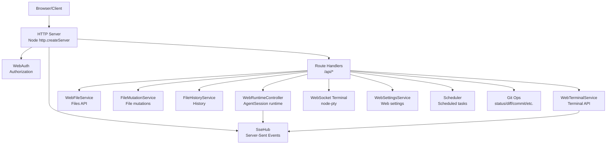
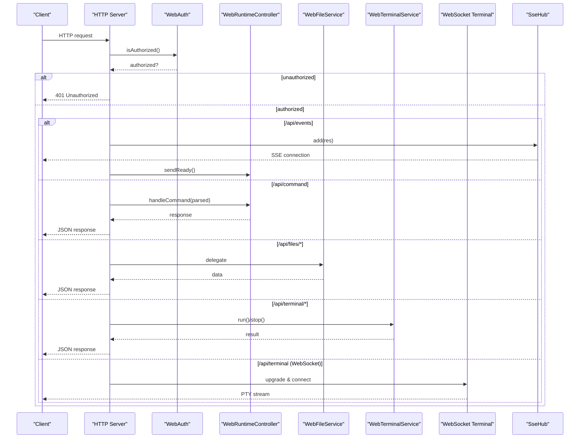
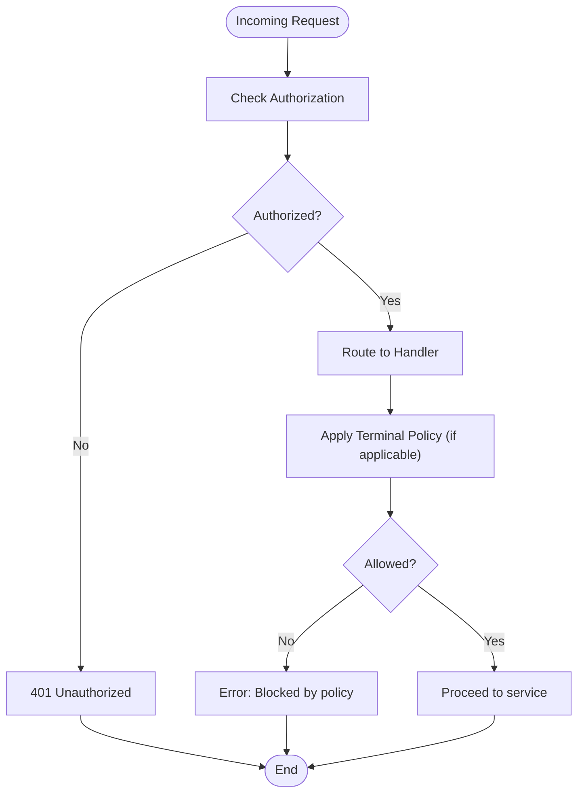
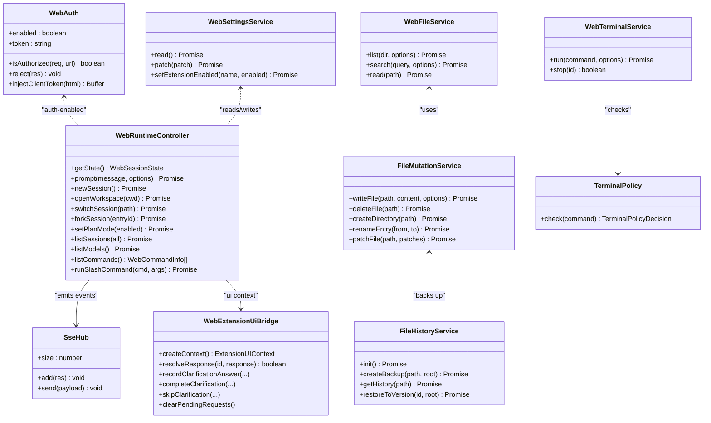

# HTTP Server and Routing

<cite>
**Referenced Files in This Document**
- [index.ts](file://src/server/index.ts)
- [auth.ts](file://src/server/auth.ts)
- [security.ts](file://src/server/security.ts)
- [runtime.ts](file://src/server/runtime.ts)
- [files.ts](file://src/server/files.ts)
- [file-mutations.ts](file://src/server/file-mutations.ts)
- [file-history.ts](file://src/server/file-history.ts)
- [terminal.ts](file://src/server/terminal.ts)
- [terminal-policy.ts](file://src/server/terminal-policy.ts)
- [terminal-pty.ts](file://src/server/terminal-pty.ts)
- [sse.ts](file://src/server/sse.ts)
- [locks.ts](file://src/server/locks.ts)
- [web-settings.ts](file://src/server/web-settings.ts)
- [web-extension-ui.ts](file://src/server/web-extension-ui.ts)
- [protocol.ts](file://src/shared/protocol.ts)
</cite>

## Table of Contents
1. [Introduction](#introduction)
2. [Project Structure](#project-structure)
3. [Core Components](#core-components)
4. [Architecture Overview](#architecture-overview)
5. [Detailed Component Analysis](#detailed-component-analysis)
6. [Dependency Analysis](#dependency-analysis)
7. [Performance Considerations](#performance-considerations)
8. [Troubleshooting Guide](#troubleshooting-guide)
9. [Conclusion](#conclusion)

## Introduction
This document explains the HTTP server and routing system of the application. It covers the Express-like server built on Node's http module, middleware-style request handling, authentication and security policies, request preprocessing, and the modular routing pattern that organizes APIs by domain (files, terminal, sessions, models, Git, scheduling, settings, and more). It also documents request validation, error handling, response formatting, and how the server remains stateless while coordinating with the AgentSession runtime via SSE and a lock-based concurrency model.

## Project Structure
The server is implemented as a single-entry HTTP server that routes requests to domain-specific services and the AgentSession runtime. Key responsibilities:
- Request routing and authentication checks
- Static asset serving
- SSE event broadcasting
- Terminal execution and interactive PTY WebSocket
- File listing, reading, mutation, and history
- Git operations
- Scheduler for recurring tasks
- Web settings persistence
- Authentication and security validation

**Diagram sources**
- [index.ts:401-662](file://src/server/index.ts#L401-L662)
- [auth.ts:6-55](file://src/server/auth.ts#L6-L55)
- [runtime.ts:12-30](file://src/server/runtime.ts#L12-L30)
- [files.ts:13-131](file://src/server/files.ts#L13-L131)
- [file-mutations.ts:13-140](file://src/server/file-mutations.ts#L13-L140)
- [file-history.ts:20-159](file://src/server/file-history.ts#L20-L159)
- [terminal.ts:21-87](file://src/server/terminal.ts#L21-L87)
- [terminal-pty.ts:25-95](file://src/server/terminal-pty.ts#L25-L95)
- [web-settings.ts:13-64](file://src/server/web-settings.ts#L13-L64)
- [sse.ts:6-32](file://src/server/sse.ts#L6-L32)

**Section sources**
- [index.ts:401-662](file://src/server/index.ts#L401-L662)

## Core Components
- HTTP Server and Router: Central server that handles all routes, performs auth checks, and delegates to domain services.
- Authentication: Token-based auth via header or query param with secure comparison.
- Security Validation: Host and workspace allowlist enforcement.
- AgentSession Runtime: Manages conversations, sessions, models, and emits events via SSE.
- File Services: Listing, searching, reading, and mutating files with safety checks.
- Terminal Services: Executing commands with policy enforcement and interactive PTY WebSocket.
- SSE Hub: Broadcasts runtime and terminal events to clients.
- Locks: AsyncLock and SingleFlight to serialize critical operations.
- Web Settings: Persistent web UI preferences.
- Protocol Types: Shared types for commands, responses, and events.

**Section sources**
- [index.ts:63-95](file://src/server/index.ts#L63-L95)
- [auth.ts:6-55](file://src/server/auth.ts#L6-L55)
- [security.ts:24-41](file://src/server/security.ts#L24-L41)
- [runtime.ts:12-456](file://src/server/runtime.ts#L12-L456)
- [files.ts:13-131](file://src/server/files.ts#L13-L131)
- [file-mutations.ts:13-140](file://src/server/file-mutations.ts#L13-L140)
- [file-history.ts:20-159](file://src/server/file-history.ts#L20-L159)
- [terminal.ts:21-87](file://src/server/terminal.ts#L21-L87)
- [terminal-pty.ts:25-95](file://src/server/terminal-pty.ts#L25-L95)
- [sse.ts:6-32](file://src/server/sse.ts#L6-L32)
- [locks.ts:1-38](file://src/server/locks.ts#L1-L38)
- [web-settings.ts:13-64](file://src/server/web-settings.ts#L13-L64)
- [protocol.ts:112-198](file://src/shared/protocol.ts#L112-L198)

## Architecture Overview
The server is a stateless HTTP endpoint that:
- Enforces authentication for protected routes
- Delegates to domain services for file operations, terminal execution, Git, scheduling, and settings
- Coordinates with the AgentSession runtime for conversational AI and emits real-time updates via SSE
- Provides an interactive terminal WebSocket for full TTY emulation

**Diagram sources**
- [index.ts:401-662](file://src/server/index.ts#L401-L662)
- [auth.ts:15-29](file://src/server/auth.ts#L15-L29)
- [runtime.ts:208-339](file://src/server/runtime.ts#L208-L339)
- [files.ts:16-61](file://src/server/files.ts#L16-L61)
- [terminal.ts:36-85](file://src/server/terminal.ts#L36-L85)
- [terminal-pty.ts:28-93](file://src/server/terminal-pty.ts#L28-L93)
- [sse.ts:9-26](file://src/server/sse.ts#L9-L26)

## Detailed Component Analysis

### HTTP Server and Routing
- Entry point creates an http.Server and registers a central request handler.
- Authentication is enforced for all /api/* routes via WebAuth.
- Route table:
  - GET /api/events → SSE hub for live updates
  - GET /api/config → server configuration
  - GET /api/state → runtime state and locks
  - GET /api/sessions, /api/settings, /api/models, /api/commands, /api/extensions, /api/skills, /api/prompts
  - POST /api/extensions/toggle
  - GET /api/web-settings, POST /api/web-settings
  - GET /api/workspace/roots, /api/workspace/browse, /api/workspace/changes
  - Git endpoints: /api/git/status, /api/git/branch, /api/git/diff, POST /api/git/stage, /api/git/unstage, /api/git/commit, /api/git/push, /api/git/pr
  - Scheduled tasks: GET/POST/PATCH/DELETE /api/scheduled[/id][/run]
  - Files: GET /api/files, /api/files/search, /api/file, POST /api/file/write, /api/file/patch, /api/file/delete, /api/file/mkdir, /api/file/rename, GET /api/file/history, POST /api/file/restore
  - Command bridge: POST /api/command → WebRuntimeController.handleCommand
  - Terminal: POST /api/terminal/run, /api/terminal/stop
  - Interactive terminal: WebSocket upgrade to /api/terminal
  - Static assets: fallback to serveStatic for non-/api/* GET requests
- Error handling: centralized try/catch with status code derivation and JSON error responses.

**Section sources**
- [index.ts:401-662](file://src/server/index.ts#L401-L662)
- [index.ts:221-254](file://src/server/index.ts#L221-L254)
- [index.ts:231-240](file://src/server/index.ts#L231-L240)
- [index.ts:242-245](file://src/server/index.ts#L242-L245)

### Authentication Middleware and Security Policies
- WebAuth:
  - Enables/disables auth via environment variable
  - Loads or generates a token stored securely on disk
  - Validates tokens via header or query param using constant-time comparison
  - Injects client token into HTML for SPA initialization
- Security validation:
  - Validates host binding and remote access setting
  - Enforces workspace allowlist to prevent out-of-root access
- Terminal policy:
  - Safe mode blocks dangerous patterns (rm -rf, git reset --hard, shell piping, chmod 777, etc.)
  - Allow-all mode permits arbitrary commands
  - Disabled mode blocks terminal entirely

**Diagram sources**
- [auth.ts:15-29](file://src/server/auth.ts#L15-L29)
- [security.ts:24-41](file://src/server/security.ts#L24-L41)
- [terminal-policy.ts:24-32](file://src/server/terminal-policy.ts#L24-L32)

**Section sources**
- [auth.ts:6-55](file://src/server/auth.ts#L6-L55)
- [security.ts:24-41](file://src/server/security.ts#L24-L41)
- [terminal-policy.ts:21-39](file://src/server/terminal-policy.ts#L21-L39)

### Request Preprocessing and Validation
- Body parsing: readBody aggregates chunks and parseCommand parses JSON payload for /api/command.
- Path safety:
  - File services resolve paths safely and reject attempts outside the workspace root.
  - File mutations enforce size limits and backup creation before destructive operations.
- Workspace validation: open_workspace validates new CWD against allowlist.
- Terminal run validation: enforces minimum/maximum timeouts, command length, and policy checks.

**Section sources**
- [index.ts:236-245](file://src/server/index.ts#L236-L245)
- [files.ts:84-101](file://src/server/files.ts#L84-L101)
- [file-mutations.ts:21-98](file://src/server/file-mutations.ts#L21-L98)
- [terminal.ts:36-44](file://src/server/terminal.ts#L36-L44)
- [index.ts:315-326](file://src/server/index.ts#L315-L326)

### Response Formatting and Error Handling
- JSON responses: sendJson sets security headers and Content-Type, writes body, and ends response.
- Status codes: errorStatusCode maps structured errors to 4xx/5xx ranges.
- Command responses: ok/fail wrap command outcomes consistently.

**Section sources**
- [index.ts:221-234](file://src/server/index.ts#L221-L234)
- [index.ts:247-253](file://src/server/index.ts#L247-L253)

### Modular Routing Pattern
- Domain separation:
  - Files: WebFileService and FileMutationService handle listing, searching, reading, writing, patching, deleting, renaming, and history.
  - Terminal: WebTerminalService executes commands; terminal-pty.ts upgrades to WebSocket for interactive sessions.
  - Sessions/Runtime: WebRuntimeController manages sessions, models, settings, and emits events.
  - Settings: WebSettingsService persists UI preferences.
  - Git: Git helpers provide status, diff, stage/unstage, commit, push, branch, and PR creation.
  - Scheduler: Task scheduling with create/list/update/remove and run-now semantics.
- Route grouping:
  - /api/files*, /api/file*, /api/file-history*
  - /api/terminal*, /api/terminal (WebSocket)
  - /api/sessions, /api/settings, /api/models, /api/commands, /api/extensions, /api/skills, /api/prompts
  - /api/git/*
  - /api/scheduled*

**Section sources**
- [files.ts:13-131](file://src/server/files.ts#L13-L131)
- [file-mutations.ts:13-140](file://src/server/file-mutations.ts#L13-L140)
- [file-history.ts:20-159](file://src/server/file-history.ts#L20-L159)
- [terminal.ts:21-87](file://src/server/terminal.ts#L21-L87)
- [terminal-pty.ts:25-95](file://src/server/terminal-pty.ts#L25-L95)
- [runtime.ts:12-456](file://src/server/runtime.ts#L12-L456)
- [web-settings.ts:13-64](file://src/server/web-settings.ts#L13-L64)

### SSE and Real-Time Updates
- SseHub maintains a set of ServerResponse connections and streams typed payloads (events, command responses).
- Runtime and terminal actions emit events; clients subscribe via /api/events.

**Section sources**
- [sse.ts:6-32](file://src/server/sse.ts#L6-L32)
- [runtime.ts:56-58](file://src/server/runtime.ts#L56-L58)
- [terminal.ts:636-643](file://src/server/terminal.ts#L636-L643)

### Concurrency Control and Statelessness
- Statelessness: The server does not persist state; it relies on runtime services and external files for state.
- Concurrency:
  - AsyncLock serializes critical runtime operations (session changes, settings updates).
  - SingleFlight prevents overlapping terminal runs for the same operation.
- Runtime coordination: WebRuntimeController binds to the AgentSession runtime and forwards events to SSE.

**Section sources**
- [locks.ts:1-38](file://src/server/locks.ts#L1-L38)
- [runtime.ts:311-367](file://src/server/runtime.ts#L311-L367)
- [terminal.ts:29-34](file://src/server/terminal.ts#L29-L34)

### Example Route Registration and Middleware Chaining
- Authentication guard is applied early in the request handler for all /api/* routes.
- Handlers are organized as a large if/else cascade, returning immediately upon match.
- Middleware-like chaining:
  - Auth check → SSE subscription → Config/state → Sessions/commands → Models → Extensions → Settings → Workspace → Git → Scheduler → Files → Terminal → Static fallback.

**Section sources**
- [index.ts:404-407](file://src/server/index.ts#L404-L407)
- [index.ts:408-654](file://src/server/index.ts#L408-L654)

## Dependency Analysis
The server composes several cohesive services with clear boundaries and minimal coupling.

**Diagram sources**
- [auth.ts:6-55](file://src/server/auth.ts#L6-L55)
- [sse.ts:6-32](file://src/server/sse.ts#L6-L32)
- [runtime.ts:12-456](file://src/server/runtime.ts#L12-L456)
- [files.ts:13-131](file://src/server/files.ts#L13-L131)
- [file-mutations.ts:13-140](file://src/server/file-mutations.ts#L13-L140)
- [file-history.ts:20-159](file://src/server/file-history.ts#L20-L159)
- [terminal.ts:21-87](file://src/server/terminal.ts#L21-L87)
- [terminal-policy.ts:21-39](file://src/server/terminal-policy.ts#L21-L39)
- [web-settings.ts:13-64](file://src/server/web-settings.ts#L13-L64)
- [web-extension-ui.ts:27-244](file://src/server/web-extension-ui.ts#L27-L244)

**Section sources**
- [index.ts:63-95](file://src/server/index.ts#L63-L95)
- [protocol.ts:112-198](file://src/shared/protocol.ts#L112-L198)

## Performance Considerations
- Streaming behavior: SSE ensures efficient real-time updates without polling.
- Concurrency control: AsyncLock and SingleFlight prevent resource contention during critical operations.
- Path and size limits: File services enforce reasonable limits to avoid excessive memory usage.
- Static caching: Serving static assets from the built client directory reduces dynamic overhead.
- Terminal timeouts: Reasonable defaults bound CPU and memory usage for long-running commands.

## Troubleshooting Guide
- 401 Unauthorized: Verify X-Quake-Web-Token header or token query param matches the server token.
- 403 Forbidden: Requests outside the workspace root or unsafe paths are rejected.
- 413 Payload Too Large: File operations exceed size limits; reduce payload or enable streaming alternatives.
- Terminal blocked: Check terminal policy mode and command patterns; adjust to “allow-allÔÇØ cautiously.
- SSE not receiving events: Ensure subscription to /api/events and that the client keeps the connection alive.
- Scheduler errors: Inspect status codes returned by scheduler endpoints for invalid cron expressions or missing prompts.

**Section sources**
- [auth.ts:22-29](file://src/server/auth.ts#L22-L29)
- [files.ts:59-61](file://src/server/files.ts#L59-L61)
- [terminal-policy.ts:24-32](file://src/server/terminal-policy.ts#L24-L32)
- [index.ts:408-411](file://src/server/index.ts#L408-L411)

## Conclusion
The server implements a clean, modular architecture around a central HTTP router, strong authentication and security policies, and domain-specific services. It remains stateless while orchestrating the AgentSession runtime and enabling real-time collaboration via SSE. The design balances safety (policy enforcement, workspace allowlists) with usability (interactive terminal, file operations, settings persistence), and provides robust error handling and response formatting.
