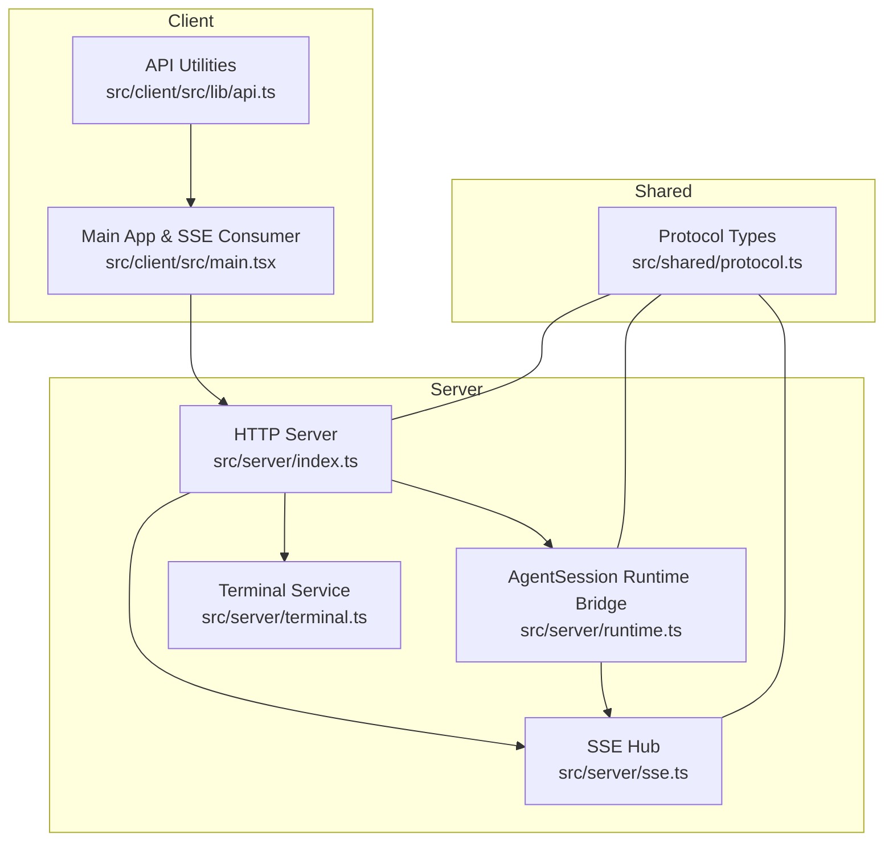
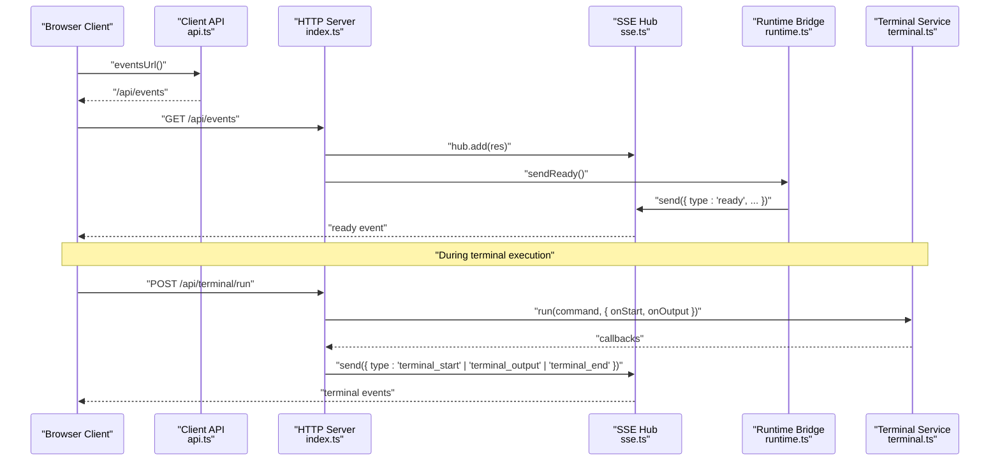
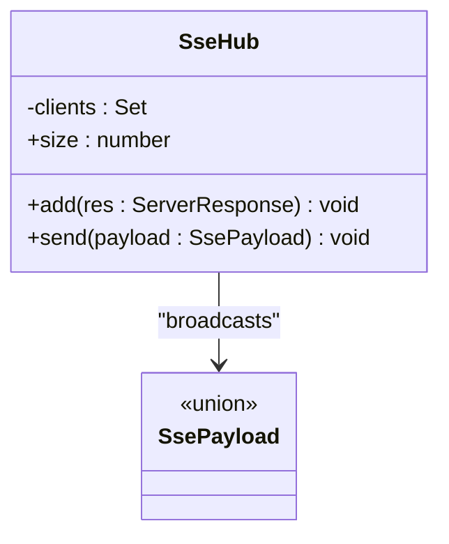
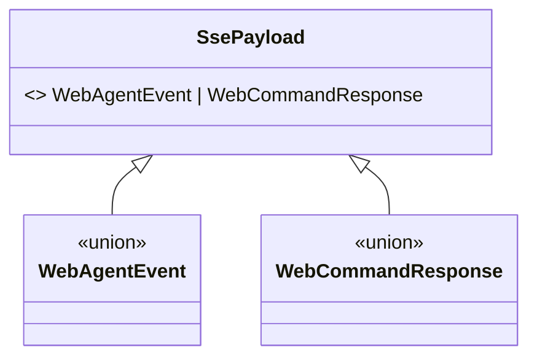
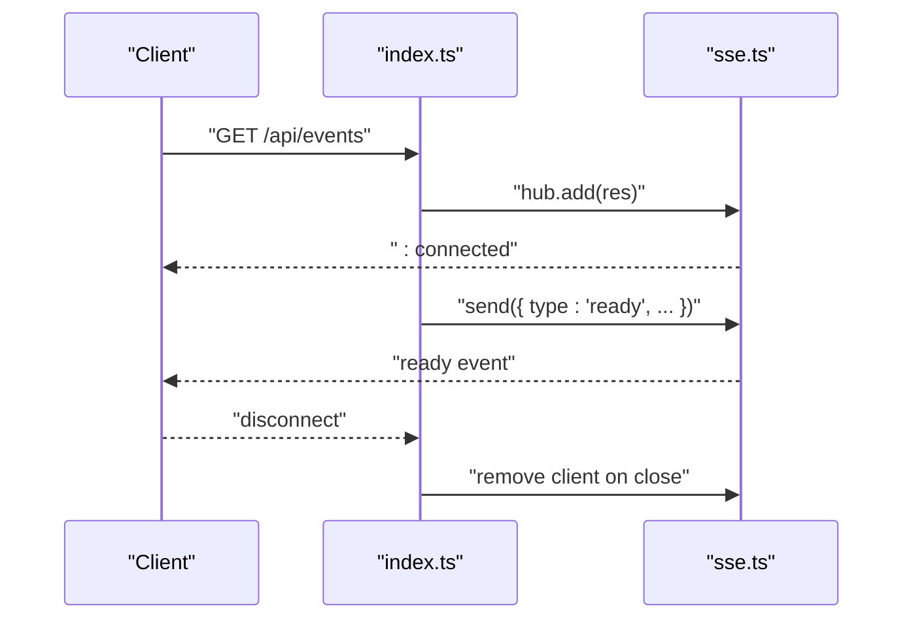
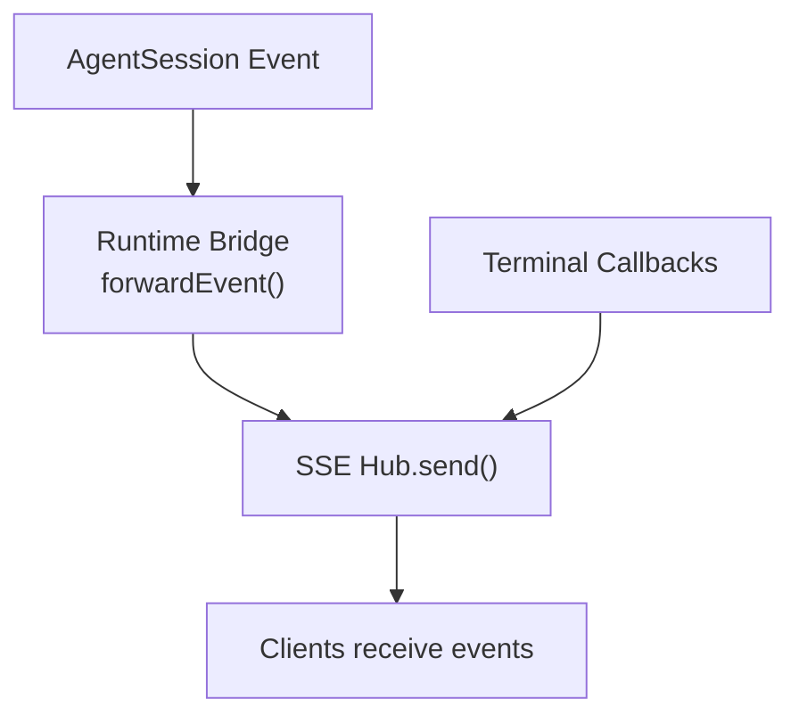
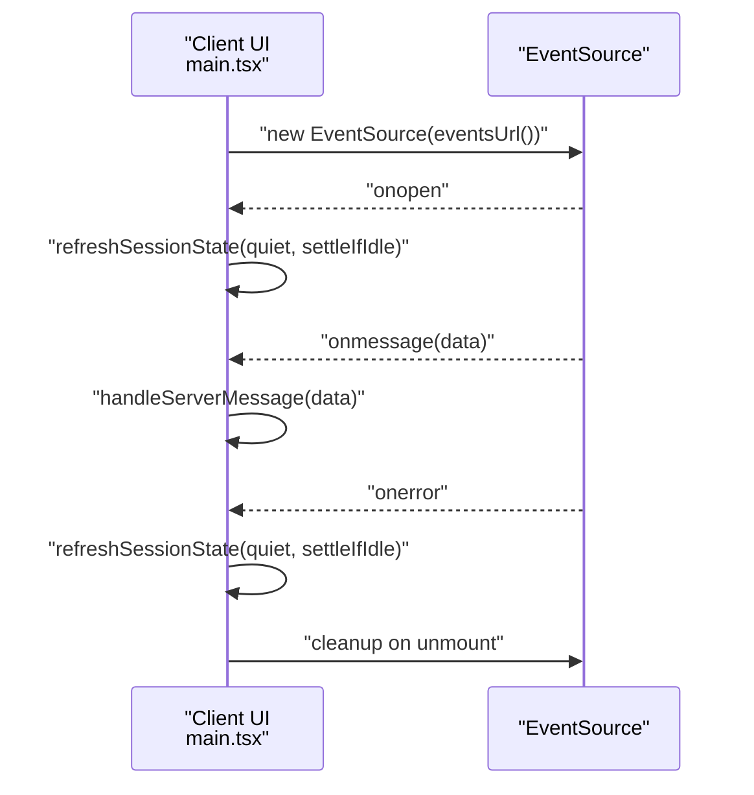
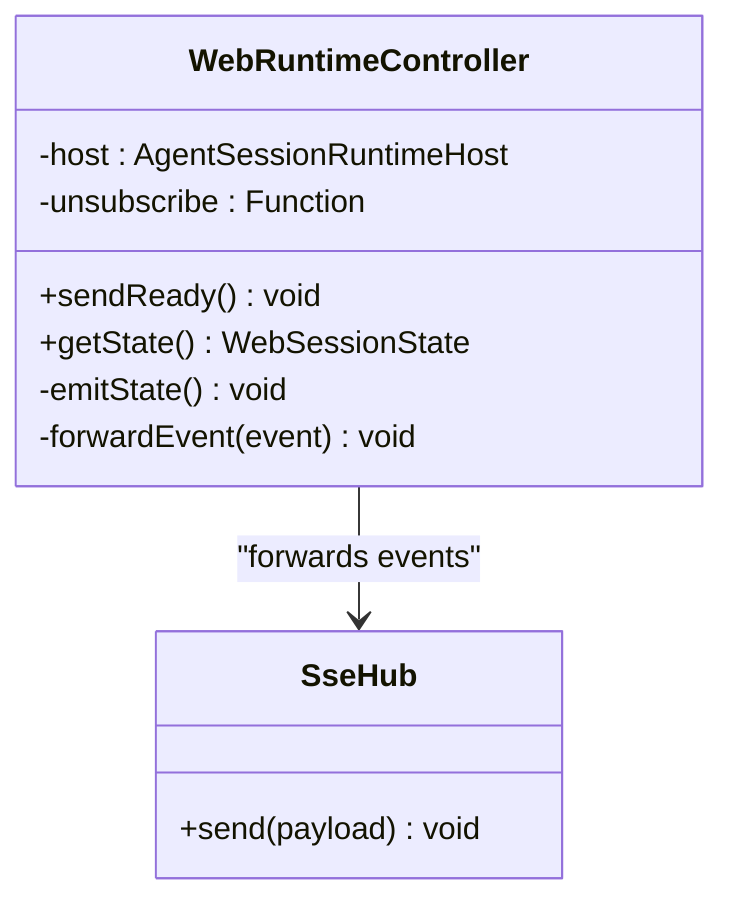
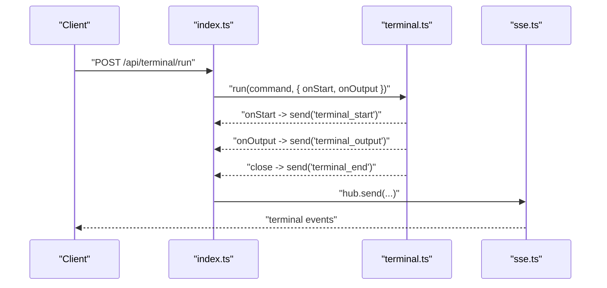
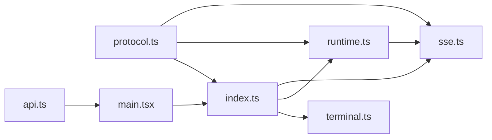

# Server-Sent Events Hub

<cite>
**Referenced Files in This Document**
- [sse.ts](file://src/server/sse.ts)
- [protocol.ts](file://src/shared/protocol.ts)
- [index.ts](file://src/server/index.ts)
- [runtime.ts](file://src/server/runtime.ts)
- [terminal.ts](file://src/server/terminal.ts)
- [api.ts](file://src/client/src/lib/api.ts)
- [main.tsx](file://src/client/src/main.tsx)
</cite>

## Table of Contents
1. [Introduction](#introduction)
2. [Project Structure](#project-structure)
3. [Core Components](#core-components)
4. [Architecture Overview](#architecture-overview)
5. [Detailed Component Analysis](#detailed-component-analysis)
6. [Dependency Analysis](#dependency-analysis)
7. [Performance Considerations](#performance-considerations)
8. [Troubleshooting Guide](#troubleshooting-guide)
9. [Conclusion](#conclusion)

## Introduction
This document describes the Server-Sent Events (SSE) implementation that powers real-time communication between the server and browser clients. It explains the event hub architecture, connection lifecycle, event broadcasting, and how SSE integrates with the AgentSession runtime to stream AI responses, file changes, and terminal outputs. It also covers event types, payload structures, subscription patterns, reconnection strategies, error recovery, and performance optimization techniques for high-frequency updates.

## Project Structure
The SSE system spans three layers:
- Server-side event hub and routing
- Protocol definitions for events and commands
- Client-side SSE consumption and UI reconciliation

**Diagram sources**
- [index.ts:401-412](file://src/server/index.ts#L401-L412)
- [sse.ts:6-31](file://src/server/sse.ts#L6-L31)
- [runtime.ts:12-30](file://src/server/runtime.ts#L12-L30)
- [terminal.ts:21-87](file://src/server/terminal.ts#L21-L87)
- [protocol.ts:161-198](file://src/shared/protocol.ts#L161-L198)
- [api.ts:48-50](file://src/client/src/lib/api.ts#L48-L50)
- [main.tsx:572-588](file://src/client/src/main.tsx#L572-L588)

**Section sources**
- [index.ts:401-412](file://src/server/index.ts#L401-L412)
- [sse.ts:6-31](file://src/server/sse.ts#L6-L31)
- [runtime.ts:12-30](file://src/server/runtime.ts#L12-L30)
- [terminal.ts:21-87](file://src/server/terminal.ts#L21-L87)
- [protocol.ts:161-198](file://src/shared/protocol.ts#L161-L198)
- [api.ts:48-50](file://src/client/src/lib/api.ts#L48-L50)
- [main.tsx:572-588](file://src/client/src/main.tsx#L572-L588)

## Core Components
- SSE Hub: Manages SSE connections and broadcasts events to all subscribed clients.
- Protocol Types: Define event shapes for agent state, terminal streams, UI requests, and command responses.
- Runtime Bridge: Subscribes to AgentSession events and forwards them via SSE; emits ready/state updates.
- Terminal Service: Executes commands and streams stdout/stderr via SSE callbacks.
- HTTP Server: Exposes /api/events endpoint, attaches runtime readiness, and wires terminal streaming.
- Client Consumers: Establish SSE connections, parse incoming events, reconcile UI state, and handle reconnection.

**Section sources**
- [sse.ts:6-31](file://src/server/sse.ts#L6-L31)
- [protocol.ts:161-198](file://src/shared/protocol.ts#L161-L198)
- [runtime.ts:413-426](file://src/server/runtime.ts#L413-L426)
- [terminal.ts:36-85](file://src/server/terminal.ts#L36-L85)
- [index.ts:401-412](file://src/server/index.ts#L401-L412)
- [api.ts:48-50](file://src/client/src/lib/api.ts#L48-L50)
- [main.tsx:572-588](file://src/client/src/main.tsx#L572-L588)

## Architecture Overview
The SSE architecture follows a publish-subscribe pattern:
- Clients connect to /api/events and receive a continuous stream of events.
- The server maintains a set of active connections and broadcasts events to all clients.
- AgentSession runtime subscribes to session events and forwards them as SSE payloads.
- Terminal runs spawn OS processes and stream output chunks via SSE callbacks.
- Clients consume events, update UI state, and gracefully handle disconnections.

**Diagram sources**
- [index.ts:401-412](file://src/server/index.ts#L401-L412)
- [index.ts:631-644](file://src/server/index.ts#L631-L644)
- [sse.ts:9-26](file://src/server/sse.ts#L9-L26)
- [runtime.ts:56-58](file://src/server/runtime.ts#L56-L58)
- [terminal.ts:36-85](file://src/server/terminal.ts#L36-L85)
- [api.ts:48-50](file://src/client/src/lib/api.ts#L48-L50)

## Detailed Component Analysis

### SSE Hub
The SSE hub manages active connections and broadcasts events to all clients. It sets appropriate SSE headers, writes an initial keepalive message, tracks connections, and cleans up on close.

**Diagram sources**
- [sse.ts:6-31](file://src/server/sse.ts#L6-L31)
- [protocol.ts:161-169](file://src/shared/protocol.ts#L161-L169)

Key behaviors:
- Headers enable SSE semantics and disable buffering.
- Initial keepalive ping ensures long-lived connections.
- On client disconnect, the connection is removed from the hub.

**Section sources**
- [sse.ts:9-19](file://src/server/sse.ts#L9-L19)
- [sse.ts:21-26](file://src/server/sse.ts#L21-L26)
- [sse.ts:28-30](file://src/server/sse.ts#L28-L30)

### Event Types and Payload Structures
The protocol defines two categories of SSE payloads:
- Agent events: Ready, state updates, agent internal events, terminal lifecycle, errors, and extension UI requests.
- Command responses: Acknowledgement or error for client commands.

Examples of agent event types:
- Ready: Initial handshake with session state and messages.
- State: Periodic or triggered state snapshots.
- Agent event: Internal runtime events forwarded to the UI.
- Terminal events: start, output (stdout/stderr), end with exit code/signals.
- Error: Error propagation from runtime or terminal.
- Extension UI requests: Interactive prompts for plan decisions, clarifications, and UI widgets.

**Diagram sources**
- [protocol.ts:161-169](file://src/shared/protocol.ts#L161-L169)
- [protocol.ts:195-198](file://src/shared/protocol.ts#L195-L198)

**Section sources**
- [protocol.ts:161-169](file://src/shared/protocol.ts#L161-L169)
- [protocol.ts:195-198](file://src/shared/protocol.ts#L195-L198)

### Connection Management and Lifecycle
- Endpoint: GET /api/events establishes the SSE stream.
- Initialization: On connect, the server adds the response to the hub and sends a ready event containing session state and messages.
- Cleanup: The server removes the client when the connection closes.

**Diagram sources**
- [index.ts:408-412](file://src/server/index.ts#L408-L412)
- [sse.ts:9-19](file://src/server/sse.ts#L9-L19)
- [runtime.ts:56-58](file://src/server/runtime.ts#L56-L58)

**Section sources**
- [index.ts:408-412](file://src/server/index.ts#L408-L412)
- [sse.ts:9-19](file://src/server/sse.ts#L9-L19)
- [runtime.ts:56-58](file://src/server/runtime.ts#L56-L58)

### Event Broadcasting Mechanisms
- Runtime bridge subscribes to AgentSession events and forwards them as SSE payloads. It also emits periodic state updates when appropriate.
- Terminal service invokes callbacks during process execution, emitting terminal_start, terminal_output, and terminal_end events.

**Diagram sources**
- [runtime.ts:452-455](file://src/server/runtime.ts#L452-L455)
- [index.ts:639-642](file://src/server/index.ts#L639-L642)
- [sse.ts:21-26](file://src/server/sse.ts#L21-L26)

**Section sources**
- [runtime.ts:452-455](file://src/server/runtime.ts#L452-L455)
- [index.ts:639-642](file://src/server/index.ts#L639-L642)
- [sse.ts:21-26](file://src/server/sse.ts#L21-L26)

### Subscription Patterns and Client Handling
- Client establishes an EventSource connection to /api/events.
- On open, the client refreshes session state quietly and settles if idle.
- On each message, the client parses the payload and updates UI state.
- On error, the client refreshes state if the session is still streaming or has dangling UI state.

**Diagram sources**
- [api.ts:48-50](file://src/client/src/lib/api.ts#L48-L50)
- [main.tsx:572-588](file://src/client/src/main.tsx#L572-L588)

**Section sources**
- [api.ts:48-50](file://src/client/src/lib/api.ts#L48-L50)
- [main.tsx:572-588](file://src/client/src/main.tsx#L572-L588)

### Integration with AgentSession Runtime
- The runtime bridge binds to the current session and subscribes to AgentSession events.
- It forwards agent events and emits state updates when needed.
- It handles plan mode toggles, clarifications, and extension UI requests.

**Diagram sources**
- [runtime.ts:12-30](file://src/server/runtime.ts#L12-L30)
- [runtime.ts:413-426](file://src/server/runtime.ts#L413-L426)
- [runtime.ts:452-455](file://src/server/runtime.ts#L452-L455)
- [runtime.ts:401-403](file://src/server/runtime.ts#L401-L403)

**Section sources**
- [runtime.ts:12-30](file://src/server/runtime.ts#L12-L30)
- [runtime.ts:413-426](file://src/server/runtime.ts#L413-L426)
- [runtime.ts:452-455](file://src/server/runtime.ts#L452-L455)
- [runtime.ts:401-403](file://src/server/runtime.ts#L401-L403)

### Terminal Streaming via SSE
- Terminal runs spawn a child process and stream stdout/stderr to the client via SSE callbacks.
- The server emits terminal_start, terminal_output, and terminal_end events.
- The client renders terminal output in real time.

**Diagram sources**
- [index.ts:631-644](file://src/server/index.ts#L631-L644)
- [terminal.ts:36-85](file://src/server/terminal.ts#L36-L85)
- [sse.ts:21-26](file://src/server/sse.ts#L21-L26)

**Section sources**
- [index.ts:631-644](file://src/server/index.ts#L631-L644)
- [terminal.ts:36-85](file://src/server/terminal.ts#L36-L85)
- [sse.ts:21-26](file://src/server/sse.ts#L21-L26)

## Dependency Analysis
The SSE system exhibits clear separation of concerns:
- Server routes define the SSE endpoint and integrate runtime/terminal services.
- SSE hub depends on protocol types for payload typing.
- Runtime bridge depends on SSE hub and AgentSession runtime.
- Client consumes SSE and reconciles UI state.

**Diagram sources**
- [protocol.ts:161-198](file://src/shared/protocol.ts#L161-L198)
- [sse.ts:6-31](file://src/server/sse.ts#L6-L31)
- [runtime.ts:12-30](file://src/server/runtime.ts#L12-L30)
- [index.ts:401-412](file://src/server/index.ts#L401-L412)
- [terminal.ts:21-87](file://src/server/terminal.ts#L21-L87)
- [api.ts:48-50](file://src/client/src/lib/api.ts#L48-L50)
- [main.tsx:572-588](file://src/client/src/main.tsx#L572-L588)

**Section sources**
- [protocol.ts:161-198](file://src/shared/protocol.ts#L161-L198)
- [sse.ts:6-31](file://src/server/sse.ts#L6-L31)
- [runtime.ts:12-30](file://src/server/runtime.ts#L12-L30)
- [index.ts:401-412](file://src/server/index.ts#L401-L412)
- [terminal.ts:21-87](file://src/server/terminal.ts#L21-L87)
- [api.ts:48-50](file://src/client/src/lib/api.ts#L48-L50)
- [main.tsx:572-588](file://src/client/src/main.tsx#L572-L588)

## Performance Considerations
- SSE headers: The hub disables caching and buffering to ensure low-latency delivery.
- Payload size: Keep individual event payloads concise; avoid large state snapshots unless necessary.
- Backpressure: The hub writes to each client synchronously; consider batching frequent updates to reduce write pressure.
- Connection count: Monitor hub.size to detect excessive concurrent clients and implement rate limiting or connection caps at the server level.
- Client-side throttling: The client refreshes state periodically when streaming is active to prevent stale UI.
- Terminal output limits: Terminal service truncates buffers to a fixed size to avoid memory growth.

[No sources needed since this section provides general guidance]

## Troubleshooting Guide
Common issues and remedies:
- No events received after connecting:
  - Verify the SSE endpoint is reachable and the client uses the correct URL.
  - Ensure the server sent the initial keepalive and ready event.
- Frequent reconnect loops:
  - Check client error handling and ensure it only refreshes state when needed.
  - Investigate network interruptions or proxy configurations affecting SSE.
- Missing terminal output:
  - Confirm the terminal run request succeeded and callbacks were invoked.
  - Verify terminal policy allows the command and the process exits cleanly.
- Stale UI state:
  - The client proactively refreshes state when streaming stops or visibility changes.
  - Trigger manual refresh if the client detects inconsistent state.

**Section sources**
- [index.ts:408-412](file://src/server/index.ts#L408-L412)
- [main.tsx:578-582](file://src/client/src/main.tsx#L578-L582)
- [index.ts:631-644](file://src/server/index.ts#L631-L644)
- [terminal.ts:49-84](file://src/server/terminal.ts#L49-L84)

## Conclusion
The SSE implementation provides a robust, low-latency channel for real-time updates from the AgentSession runtime and terminal subsystems to the browser. Its design emphasizes simplicity, clear separation of concerns, and graceful client reconnection. By leveraging typed payloads, careful connection lifecycle management, and targeted performance optimizations, the system supports responsive AI interactions, live terminal outputs, and dynamic UI updates.
