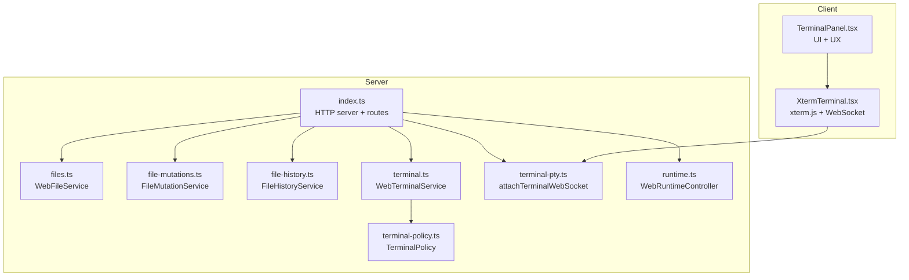
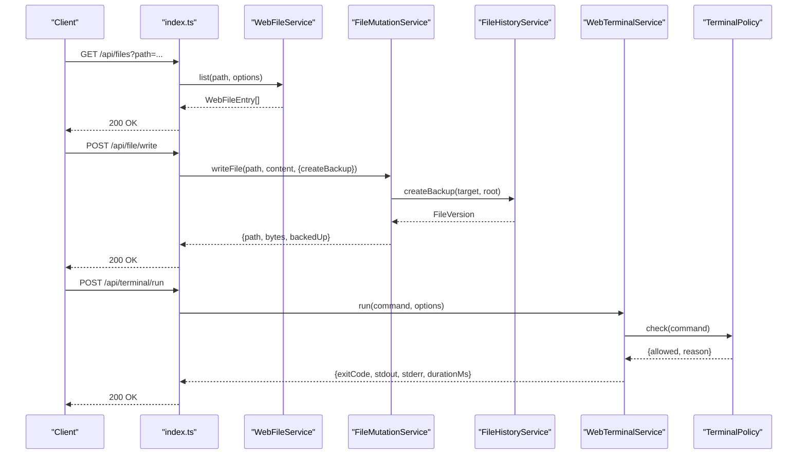
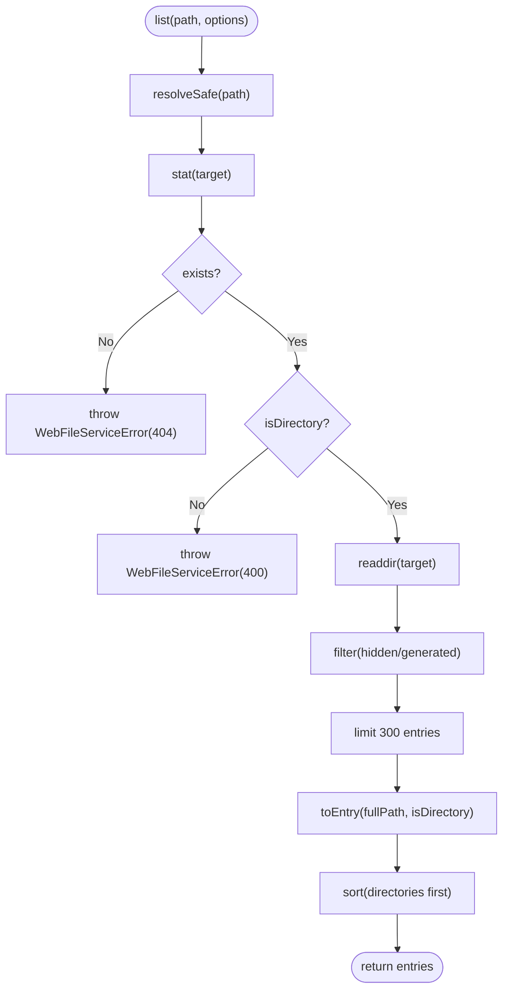
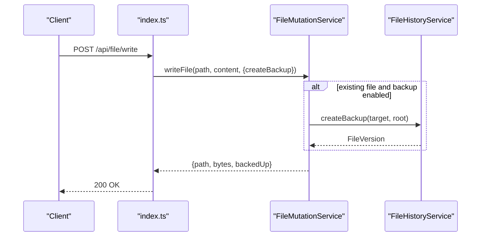
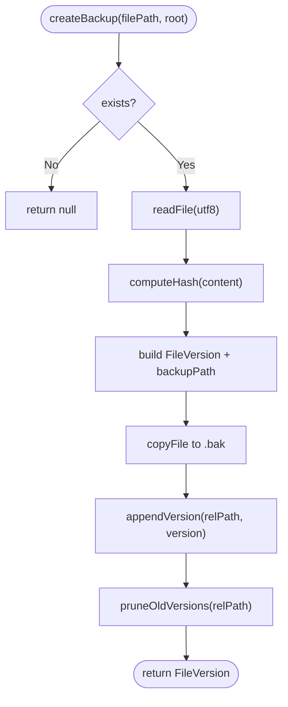
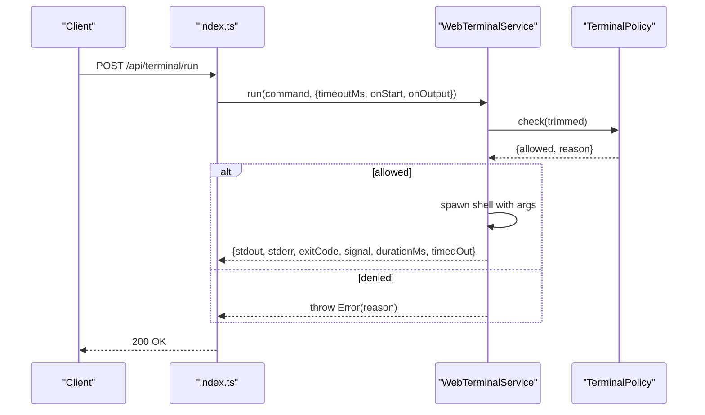
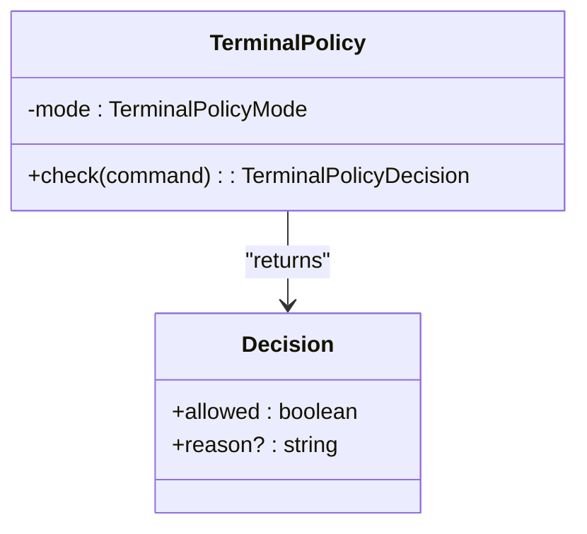
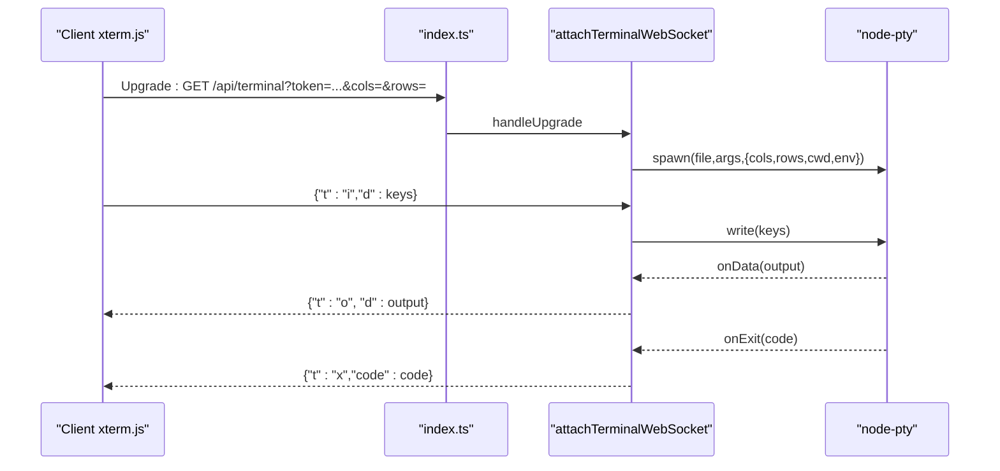
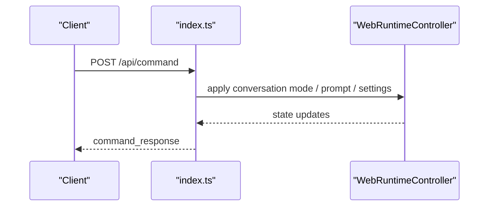
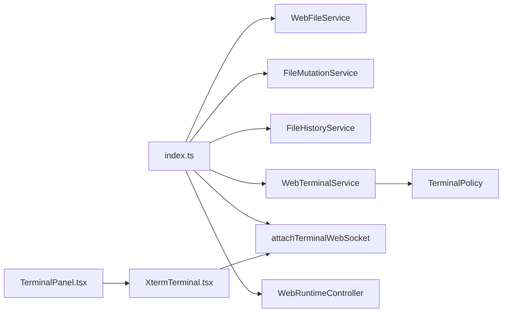

# Service Modules

<cite>
**Referenced Files in This Document**
- [files.ts](file://src/server/files.ts)
- [file-mutations.ts](file://src/server/file-mutations.ts)
- [file-history.ts](file://src/server/file-history.ts)
- [terminal.ts](file://src/server/terminal.ts)
- [terminal-policy.ts](file://src/server/terminal-policy.ts)
- [terminal-pty.ts](file://src/server/terminal-pty.ts)
- [index.ts](file://src/server/index.ts)
- [runtime.ts](file://src/server/runtime.ts)
- [protocol.ts](file://src/shared/protocol.ts)
- [XtermTerminal.tsx](file://src/client/src/components/terminal/XtermTerminal.tsx)
- [TerminalPanel.tsx](file://src/client/src/components/terminal/TerminalPanel.tsx)
</cite>

## Table of Contents
1. [Introduction](#introduction)
2. [Project Structure](#project-structure)
3. [Core Components](#core-components)
4. [Architecture Overview](#architecture-overview)
5. [Detailed Component Analysis](#detailed-component-analysis)
6. [Dependency Analysis](#dependency-analysis)
7. [Performance Considerations](#performance-considerations)
8. [Troubleshooting Guide](#troubleshooting-guide)
9. [Conclusion](#conclusion)

## Introduction
This document details the specialized service modules that power domain-specific operations in the runtime:
- File system service with safe browsing, preview, and mutation capabilities
- Terminal service with process execution, policy enforcement, and PTY integration
- File history tracking system and change log maintenance
- Terminal policy system enforcing command restrictions and security controls
It also covers service initialization, operation patterns, error handling strategies, performance optimization, resource management, and integration with the broader runtime architecture.

## Project Structure
The server exposes HTTP endpoints and a WebSocket for terminal interaction, orchestrating services for file operations, terminal execution, and history management. The client integrates terminal rendering and user interaction.

**Diagram sources**
- [index.ts:64-71](file://src/server/index.ts#L64-L71)
- [files.ts:13-128](file://src/server/files.ts#L13-L128)
- [file-mutations.ts:13-136](file://src/server/file-mutations.ts#L13-L136)
- [file-history.ts:20-158](file://src/server/file-history.ts#L20-L158)
- [terminal.ts:21-86](file://src/server/terminal.ts#L21-L86)
- [terminal-policy.ts:21-33](file://src/server/terminal-policy.ts#L21-L33)
- [terminal-pty.ts:25-94](file://src/server/terminal-pty.ts#L25-L94)
- [runtime.ts:12-30](file://src/server/runtime.ts#L12-L30)
- [XtermTerminal.tsx:64-135](file://src/client/src/components/terminal/XtermTerminal.tsx#L64-L135)
- [TerminalPanel.tsx:9-79](file://src/client/src/components/terminal/TerminalPanel.tsx#L9-L79)

**Section sources**
- [index.ts:64-71](file://src/server/index.ts#L64-L71)
- [files.ts:13-128](file://src/server/files.ts#L13-L128)
- [file-mutations.ts:13-136](file://src/server/file-mutations.ts#L13-L136)
- [file-history.ts:20-158](file://src/server/file-history.ts#L20-L158)
- [terminal.ts:21-86](file://src/server/terminal.ts#L21-L86)
- [terminal-policy.ts:21-33](file://src/server/terminal-policy.ts#L21-L33)
- [terminal-pty.ts:25-94](file://src/server/terminal-pty.ts#L25-L94)
- [runtime.ts:12-30](file://src/server/runtime.ts#L12-L30)
- [XtermTerminal.tsx:64-135](file://src/client/src/components/terminal/XtermTerminal.tsx#L64-L135)
- [TerminalPanel.tsx:9-79](file://src/client/src/components/terminal/TerminalPanel.tsx#L9-L79)

## Core Components
- WebFileService: Safe directory listing, search, and read operations with path normalization and sandboxing
- FileMutationService: Write, delete, rename, create directory, and patch operations with optional backups via FileHistoryService
- FileHistoryService: Versioned backups, manifest management, pruning, and restoration
- WebTerminalService: Non-interactive command execution with policy checks, timeouts, and output limits
- TerminalPolicy: Pattern-based command restriction with three modes (safe, allow-all, disabled)
- Terminal PTY: Interactive terminal over WebSocket using node-pty with xterm.js client
- WebRuntimeController: Orchestrates runtime sessions, commands, and state emission

**Section sources**
- [files.ts:13-128](file://src/server/files.ts#L13-L128)
- [file-mutations.ts:13-136](file://src/server/file-mutations.ts#L13-L136)
- [file-history.ts:20-158](file://src/server/file-history.ts#L20-L158)
- [terminal.ts:21-86](file://src/server/terminal.ts#L21-L86)
- [terminal-policy.ts:21-33](file://src/server/terminal-policy.ts#L21-L33)
- [terminal-pty.ts:25-94](file://src/server/terminal-pty.ts#L25-L94)
- [runtime.ts:12-30](file://src/server/runtime.ts#L12-L30)

## Architecture Overview
The server initializes services and wires endpoints. File operations route through WebFileService and FileMutationService, with FileHistoryService backing mutations. Terminal execution is split between a non-interactive HTTP endpoint (WebTerminalService) and an interactive WebSocket endpoint (node-pty). The runtime coordinates sessions and emits state updates.

**Diagram sources**
- [index.ts:568-625](file://src/server/index.ts#L568-L625)
- [files.ts:16-29](file://src/server/files.ts#L16-L29)
- [file-mutations.ts:21-34](file://src/server/file-mutations.ts#L21-L34)
- [file-history.ts:35-59](file://src/server/file-history.ts#L35-L59)
- [terminal.ts:36-85](file://src/server/terminal.ts#L36-L85)
- [terminal-policy.ts:24-32](file://src/server/terminal-policy.ts#L24-L32)

## Detailed Component Analysis

### File System Service (WebFileService)
Responsibilities:
- Safe directory listing with hidden/generated filtering and sorting
- Recursive search with depth and limit controls
- Read with size limits for web preview
- Path normalization, sandboxing, and relative path computation

Key behaviors:
- Input normalization and safe target resolution prevent traversal outside the workspace root
- Hidden and generated directories are excluded unless explicitly requested
- Listing and search are bounded to protect performance and resources
- Read enforces a maximum preview size

**Diagram sources**
- [files.ts:16-29](file://src/server/files.ts#L16-L29)
- [files.ts:74-82](file://src/server/files.ts#L74-L82)
- [files.ts:84-101](file://src/server/files.ts#L84-L101)

**Section sources**
- [files.ts:13-128](file://src/server/files.ts#L13-L128)

### File Mutation Service (FileMutationService)
Responsibilities:
- Write files with optional backup creation
- Delete files or directories with backup for files
- Create directories safely
- Rename entries with safety checks
- Patch files with ordered replacements and backup

Integration:
- Uses FileHistoryService to create backups before destructive operations
- Enforces workspace root boundaries and file size limits

**Diagram sources**
- [index.ts:582-587](file://src/server/index.ts#L582-L587)
- [file-mutations.ts:21-34](file://src/server/file-mutations.ts#L21-L34)
- [file-history.ts:35-59](file://src/server/file-history.ts#L35-L59)

**Section sources**
- [file-mutations.ts:13-136](file://src/server/file-mutations.ts#L13-L136)

### File History Service (FileHistoryService)
Responsibilities:
- Create versioned backups with content hashing
- Maintain a manifest per file with version metadata
- Prune old versions per-file and globally
- Restore specific versions to memory or disk

Design highlights:
- Manifest stored as JSON with version arrays
- Global cap on total versions prunes least-recently-used versions
- Backup files stored separately with UUID-based filenames

**Diagram sources**
- [file-history.ts:35-59](file://src/server/file-history.ts#L35-L59)
- [file-history.ts:95-116](file://src/server/file-history.ts#L95-L116)
- [file-history.ts:118-152](file://src/server/file-history.ts#L118-L152)

**Section sources**
- [file-history.ts:20-158](file://src/server/file-history.ts#L20-L158)

### Terminal Service (WebTerminalService)
Responsibilities:
- Execute commands in a controlled shell with policy enforcement
- Enforce timeouts and output size limits
- Track active processes and support stop
- Emit structured results with timing and termination signals

**Diagram sources**
- [index.ts:631-644](file://src/server/index.ts#L631-L644)
- [terminal.ts:36-85](file://src/server/terminal.ts#L36-L85)
- [terminal-policy.ts:24-32](file://src/server/terminal-policy.ts#L24-L32)

**Section sources**
- [terminal.ts:21-86](file://src/server/terminal.ts#L21-L86)
- [terminal-policy.ts:21-33](file://src/server/terminal-policy.ts#L21-L33)

### Terminal Policy System
Responsibilities:
- Define three modes: safe, allow-all, disabled
- Enforce a fixed set of dangerous patterns (e.g., recursive deletion, publishing, piping downloads to shells)
- Provide a parser to select mode from environment

**Diagram sources**
- [terminal-policy.ts:21-33](file://src/server/terminal-policy.ts#L21-L33)

**Section sources**
- [terminal-policy.ts:1-39](file://src/server/terminal-policy.ts#L1-L39)

### Interactive Terminal (PTY) Integration
Responsibilities:
- Upgrade HTTP requests to WebSocket at /api/terminal
- Spawn node-pty shells with appropriate environment and sizing
- Forward client keystrokes to PTY and PTY output to clients
- Handle resize events and process lifecycle

**Diagram sources**
- [index.ts:662](file://src/server/index.ts#L662)
- [terminal-pty.ts:25-94](file://src/server/terminal-pty.ts#L25-L94)
- [XtermTerminal.tsx:98-114](file://src/client/src/components/terminal/XtermTerminal.tsx#L98-L114)

**Section sources**
- [terminal-pty.ts:25-94](file://src/server/terminal-pty.ts#L25-L94)
- [XtermTerminal.tsx:64-135](file://src/client/src/components/terminal/XtermTerminal.tsx#L64-L135)
- [TerminalPanel.tsx:9-79](file://src/client/src/components/terminal/TerminalPanel.tsx#L9-L79)

### Runtime Integration and State Emission
Responsibilities:
- Initialize services and expose configuration
- Route commands to runtime and update state
- Wire scheduler and locks for concurrency control

**Diagram sources**
- [index.ts:255-374](file://src/server/index.ts#L255-L374)
- [runtime.ts:12-30](file://src/server/runtime.ts#L12-L30)

**Section sources**
- [index.ts:63-73](file://src/server/index.ts#L63-L73)
- [runtime.ts:12-30](file://src/server/runtime.ts#L12-L30)

## Dependency Analysis
High-level dependencies among services and their integration points:

**Diagram sources**
- [index.ts:64-71](file://src/server/index.ts#L64-L71)
- [terminal.ts:24-26](file://src/server/terminal.ts#L24-L26)
- [terminal-pty.ts:25](file://src/server/terminal-pty.ts#L25)
- [XtermTerminal.tsx:98-114](file://src/client/src/components/terminal/XtermTerminal.tsx#L98-L114)
- [TerminalPanel.tsx:9-79](file://src/client/src/components/terminal/TerminalPanel.tsx#L9-L79)

**Section sources**
- [index.ts:64-71](file://src/server/index.ts#L64-L71)
- [terminal.ts:24-26](file://src/server/terminal.ts#L24-L26)
- [terminal-pty.ts:25](file://src/server/terminal-pty.ts#L25)
- [XtermTerminal.tsx:98-114](file://src/client/src/components/terminal/XtermTerminal.tsx#L98-L114)
- [TerminalPanel.tsx:9-79](file://src/client/src/components/terminal/TerminalPanel.tsx#L9-L79)

## Performance Considerations
- File listing and search are capped to protect CPU and I/O:
  - List slice at 300 entries
  - Search recursion depth limited to 10 and configurable limit
- Read preview size limited to 1 MB
- Terminal output buffering caps at 256 KB
- Terminal timeout clamped between 1 second and 120 seconds
- File history pruning limits versions per file and globally
- Workspace allowlist and path normalization prevent excessive scanning
- Client-side ANSI parsing optimized for minimal DOM overhead

[No sources needed since this section provides general guidance]

## Troubleshooting Guide
Common issues and strategies:
- Path errors during file operations:
  - Ensure paths are resolved within the workspace root; errors indicate out-of-root attempts
- Large file previews:
  - Read operations enforce a maximum preview size; use list/search for navigation instead
- Terminal command denials:
  - Review TerminalPolicy mode and pattern matches; adjust mode or sanitize command
- Terminal timeouts:
  - Increase timeoutMs or simplify the command; long-running tasks should use PTY WebSocket
- History pruning:
  - Exceeding global version cap triggers pruning; older versions are removed automatically
- Authorization failures:
  - WebSocket upgrades and HTTP endpoints require valid tokens; verify token presence and validity

**Section sources**
- [files.ts:54-61](file://src/server/files.ts#L54-L61)
- [terminal.ts:36-43](file://src/server/terminal.ts#L36-L43)
- [file-history.ts:135-149](file://src/server/file-history.ts#L135-L149)
- [index.ts:404-407](file://src/server/index.ts#L404-L407)

## Conclusion
The service modules provide a secure, efficient foundation for file operations, terminal execution, and change tracking. They integrate tightly with the runtime and client to deliver a responsive, policy-enforced environment. Adhering to the documented initialization patterns, error handling strategies, and performance guidelines ensures reliable operation across diverse workloads.
