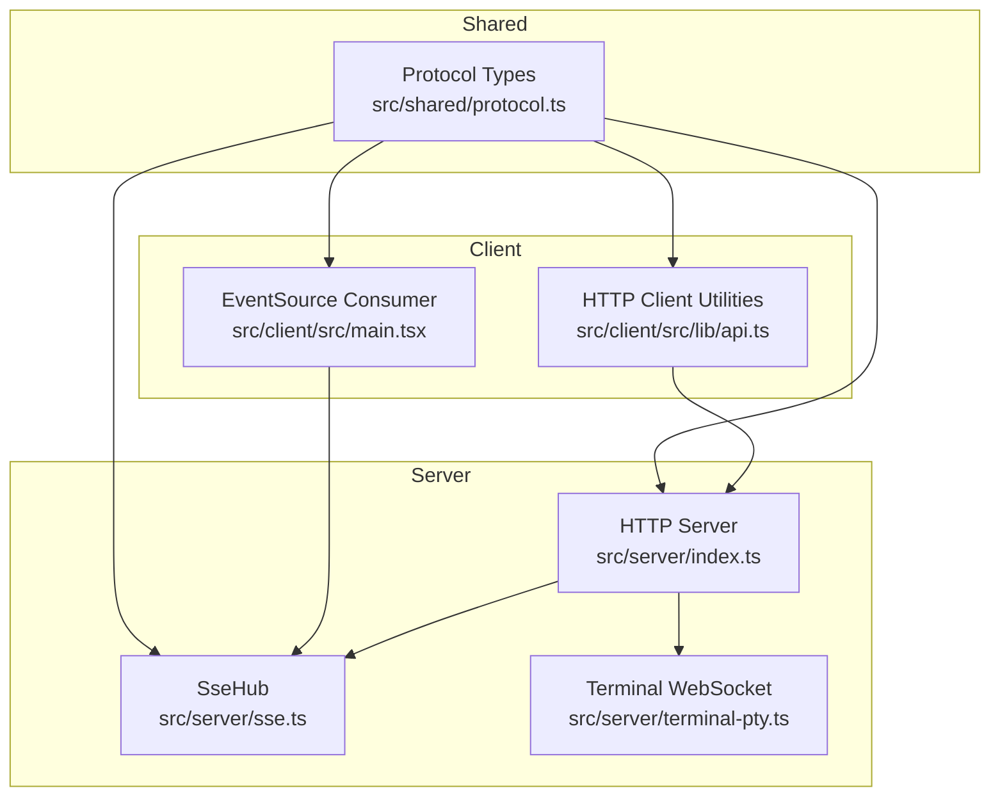
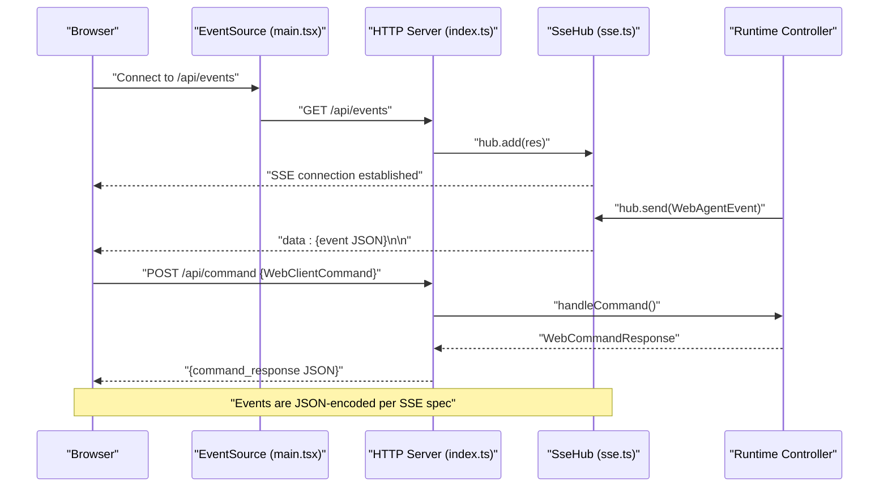
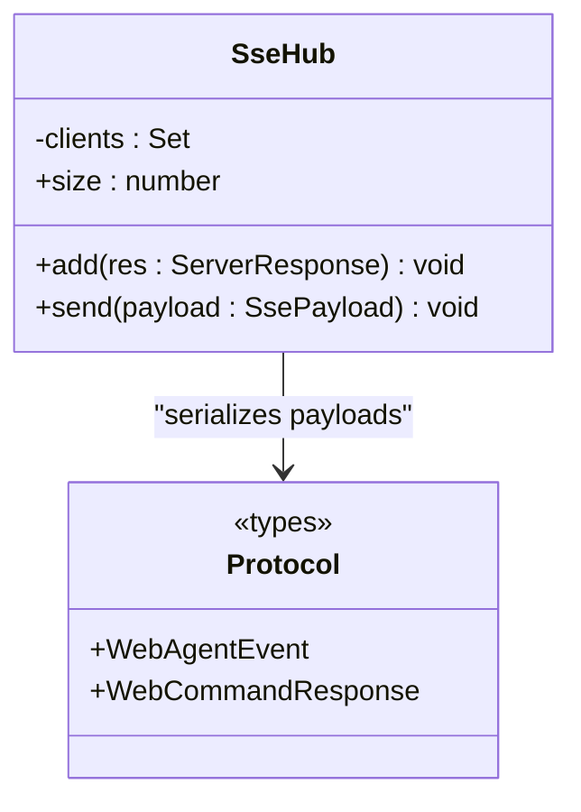
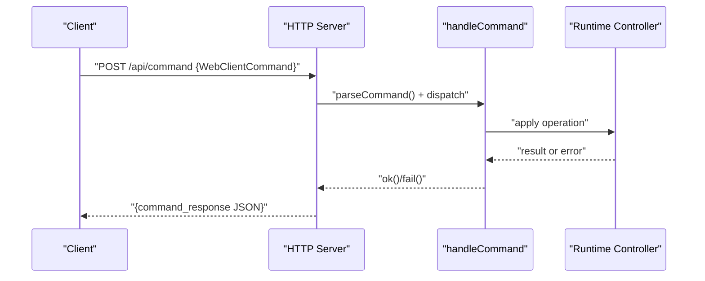
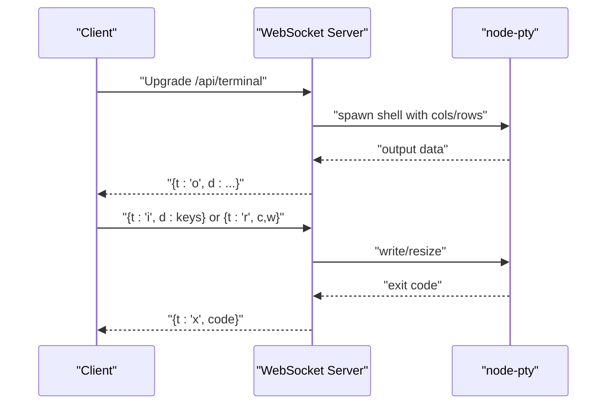
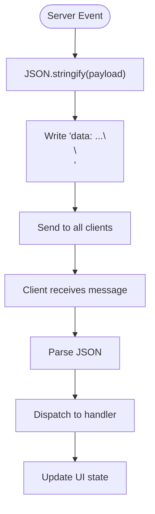
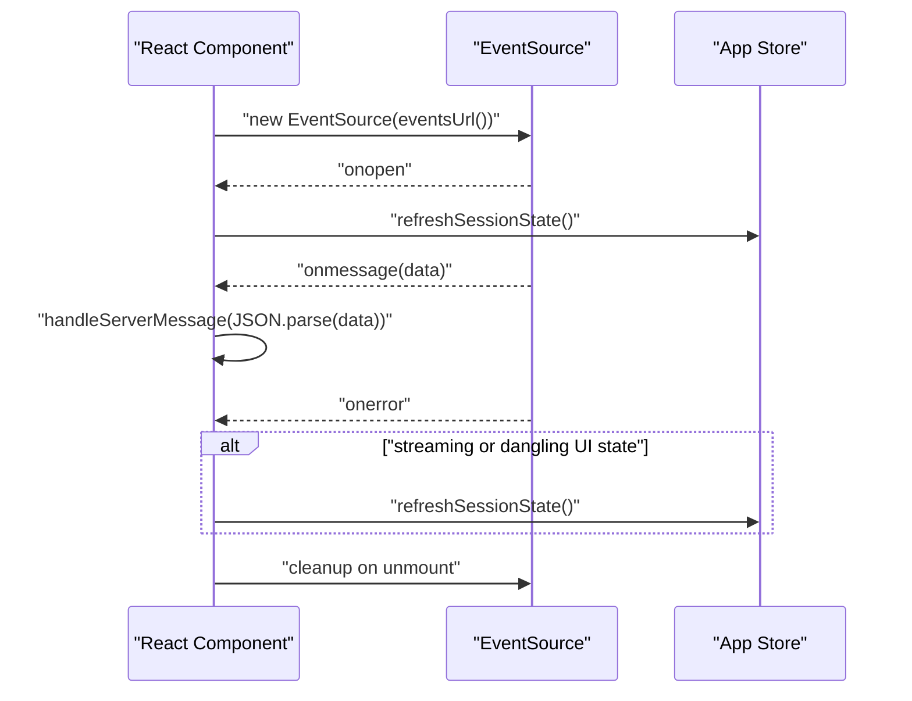
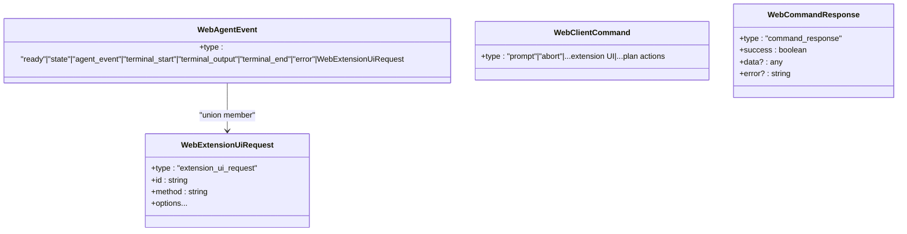
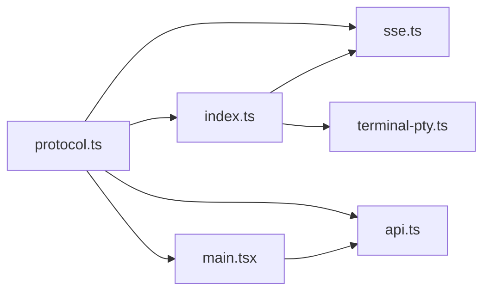

# Communication Patterns

<cite>
**Referenced Files in This Document**
- [sse.ts](file://src/server/sse.ts)
- [protocol.ts](file://src/shared/protocol.ts)
- [index.ts](file://src/server/index.ts)
- [api.ts](file://src/client/src/lib/api.ts)
- [main.tsx](file://src/client/src/main.tsx)
- [terminal-pty.ts](file://src/server/terminal-pty.ts)
- [architecture.md](file://docs/architecture.md)
</cite>

## Table of Contents
1. [Introduction](#introduction)
2. [Project Structure](#project-structure)
3. [Core Components](#core-components)
4. [Architecture Overview](#architecture-overview)
5. [Detailed Component Analysis](#detailed-component-analysis)
6. [Dependency Analysis](#dependency-analysis)
7. [Performance Considerations](#performance-considerations)
8. [Troubleshooting Guide](#troubleshooting-guide)
9. [Conclusion](#conclusion)

## Introduction
This document describes the communication patterns used by the system, focusing on:
- Server-Sent Events (SSE) for real-time server-to-browser updates
- HTTP API design for command processing
- WebSocket considerations for future enhancements
It explains the event streaming architecture, message serialization/deserialization, error handling in distributed scenarios, and how the system maintains reliability across network failures. It also documents protocol definitions, event schemas, and client-side event handling patterns.

## Project Structure
The communication layer spans three primary areas:
- Server-side SSE hub and HTTP endpoints
- Shared protocol definitions for typed messages
- Client-side SSE consumption and HTTP command dispatch

**Diagram sources**
- [sse.ts:1-32](file://src/server/sse.ts#L1-L32)
- [protocol.ts:1-198](file://src/shared/protocol.ts#L1-L198)
- [index.ts:1-679](file://src/server/index.ts#L1-L679)
- [api.ts:1-59](file://src/client/src/lib/api.ts#L1-L59)
- [main.tsx:570-588](file://src/client/src/main.tsx#L570-L588)
- [terminal-pty.ts:1-95](file://src/server/terminal-pty.ts#L1-L95)

**Section sources**
- [architecture.md:42-45](file://docs/architecture.md#L42-L45)
- [sse.ts:1-32](file://src/server/sse.ts#L1-L32)
- [protocol.ts:1-198](file://src/shared/protocol.ts#L1-L198)
- [index.ts:1-679](file://src/server/index.ts#L1-L679)
- [api.ts:1-59](file://src/client/src/lib/api.ts#L1-L59)
- [main.tsx:570-588](file://src/client/src/main.tsx#L570-L588)
- [terminal-pty.ts:1-95](file://src/server/terminal-pty.ts#L1-L95)

## Core Components
- SSE Hub: Manages SSE connections and broadcasts typed events to all connected clients.
- Protocol Types: Define the shape of server events, client commands, and command responses.
- HTTP Server: Routes requests to handlers, validates auth, and executes commands.
- Client SSE Consumer: Subscribes to SSE, parses incoming events, and reconciles UI state.
- HTTP Client Utilities: Provides typed helpers for GET/POST/PATCH/DELETE with token support.
- Terminal WebSocket: Real-time interactive terminal via WebSocket with PTY bridging.

**Section sources**
- [sse.ts:6-31](file://src/server/sse.ts#L6-L31)
- [protocol.ts:161-198](file://src/shared/protocol.ts#L161-L198)
- [index.ts:401-662](file://src/server/index.ts#L401-L662)
- [api.ts:9-59](file://src/client/src/lib/api.ts#L9-L59)
- [main.tsx:570-588](file://src/client/src/main.tsx#L570-L588)
- [terminal-pty.ts:24-95](file://src/server/terminal-pty.ts#L24-L95)

## Architecture Overview
The system uses a unidirectional SSE channel for server-to-browser updates and HTTP POST endpoints for command submission. Terminal output streaming leverages SSE, while interactive terminal sessions use WebSocket. Future phases may introduce WebSocket for bidirectional needs.

**Diagram sources**
- [main.tsx:570-588](file://src/client/src/main.tsx#L570-L588)
- [index.ts:408-412](file://src/server/index.ts#L408-L412)
- [sse.ts:9-26](file://src/server/sse.ts#L9-L26)
- [protocol.ts:161-198](file://src/shared/protocol.ts#L161-L198)

## Detailed Component Analysis

### Server-Sent Events Implementation
- SSE Hub manages a set of active connections and writes newline-delimited events with UTF-8 encoding.
- Each event is a JSON-serialized payload of either a server event or a command response.
- Clients receive a heartbeat-like initial message upon connection establishment.

**Diagram sources**
- [sse.ts:6-31](file://src/server/sse.ts#L6-L31)
- [protocol.ts:161-198](file://src/shared/protocol.ts#L161-L198)

**Section sources**
- [sse.ts:9-26](file://src/server/sse.ts#L9-L26)

### HTTP API Design for Command Processing
- Commands are submitted via POST /api/command with a JSON body matching WebClientCommand.
- The server parses the request body, delegates to runtime handlers, and returns WebCommandResponse.
- Authentication is enforced for protected routes; unauthorized requests are rejected early.
- The server centralizes endpoint routing and error-to-HTTP conversion.

**Diagram sources**
- [index.ts:626-630](file://src/server/index.ts#L626-L630)
- [index.ts:242-374](file://src/server/index.ts#L242-L374)
- [protocol.ts:171-193](file://src/shared/protocol.ts#L171-L193)

**Section sources**
- [index.ts:626-630](file://src/server/index.ts#L626-L630)
- [index.ts:242-245](file://src/server/index.ts#L242-L245)
- [index.ts:247-253](file://src/server/index.ts#L247-L253)

### WebSocket Considerations for Future Enhancements
- Interactive terminal sessions use WebSocket (/api/terminal) with PTY bridging.
- WebSocket is reserved for bidirectional needs such as terminal cancellation, richer extension dialogs, or multi-session interactivity.
- Current SSE covers most real-time needs; WebSocket remains deferred until Phase 2.

**Diagram sources**
- [terminal-pty.ts:24-95](file://src/server/terminal-pty.ts#L24-L95)

**Section sources**
- [terminal-pty.ts:24-95](file://src/server/terminal-pty.ts#L24-L95)
- [architecture.md:42-45](file://docs/architecture.md#L42-L45)

### Event Streaming Architecture and Message Serialization
- Server emits WebAgentEvent messages (ready, state updates, agent events, terminal lifecycle, errors, extension UI requests).
- Client consumes SSE via EventSource and parses each message into a structured event.
- Serialization uses JSON.stringify for SSE data fields; clients must guard against malformed payloads.

**Diagram sources**
- [sse.ts:21-26](file://src/server/sse.ts#L21-L26)
- [protocol.ts:161-169](file://src/shared/protocol.ts#L161-L169)
- [main.tsx:577-578](file://src/client/src/main.tsx#L577-L578)

**Section sources**
- [sse.ts:21-26](file://src/server/sse.ts#L21-L26)
- [protocol.ts:161-169](file://src/shared/protocol.ts#L161-L169)
- [main.tsx:577-578](file://src/client/src/main.tsx#L577-L578)

### Client-Side Event Handling Patterns
- Establishes SSE connection on mount, listens for open/message/error, and cleans up on unmount.
- On error, triggers a reconciliation refresh if streaming or UI state suggests ongoing activity.
- Uses a tokenized URL for SSE when available.

**Diagram sources**
- [main.tsx:570-588](file://src/client/src/main.tsx#L570-L588)

**Section sources**
- [main.tsx:570-588](file://src/client/src/main.tsx#L570-L588)
- [api.ts:48-50](file://src/client/src/lib/api.ts#L48-L50)

### Protocol Definitions and Event Schemas
- WebAgentEvent: Covers session readiness, state updates, agent events, terminal lifecycle, error reporting, and extension UI requests.
- WebClientCommand: Covers prompting, aborting, session management, settings toggles, plan-related actions, slash commands, and extension UI responses.
- WebCommandResponse: Standardized success/failure responses for commands.

**Diagram sources**
- [protocol.ts:161-198](file://src/shared/protocol.ts#L161-L198)

**Section sources**
- [protocol.ts:161-198](file://src/shared/protocol.ts#L161-L198)

## Dependency Analysis
- Server depends on shared protocol types for typed SSE payloads and command handling.
- Client consumes protocol types for event parsing and command construction.
- HTTP server orchestrates SSE hub and WebSocket attachment for terminal sessions.
- Client utilities encapsulate authentication tokens and HTTP semantics.

**Diagram sources**
- [protocol.ts:1-198](file://src/shared/protocol.ts#L1-L198)
- [sse.ts:1-32](file://src/server/sse.ts#L1-L32)
- [index.ts:1-679](file://src/server/index.ts#L1-L679)
- [api.ts:1-59](file://src/client/src/lib/api.ts#L1-L59)
- [main.tsx:570-588](file://src/client/src/main.tsx#L570-L588)
- [terminal-pty.ts:1-95](file://src/server/terminal-pty.ts#L1-L95)

**Section sources**
- [index.ts:1-679](file://src/server/index.ts#L1-L679)
- [terminal-pty.ts:1-95](file://src/server/terminal-pty.ts#L1-L95)

## Performance Considerations
- SSE buffering: The server disables buffering to ensure low-latency delivery.
- Keep-alive headers maintain persistent connections; clients should reconnect on failure.
- Large payloads: Prefer incremental updates (e.g., terminal_output) to avoid oversized single events.
- Concurrency: Command handling is serialized via locks to prevent race conditions on shared resources.

## Troubleshooting Guide
- SSE connection drops:
  - Client automatically attempts reconciliation when streaming or dangling UI state is detected.
  - Verify server logs for connection close events and ensure SSE endpoint is reachable.
- Authentication failures:
  - Protected endpoints reject unauthorized requests; confirm token presence and validity.
- Command errors:
  - Server returns standardized WebCommandResponse with error details; inspect response payload for diagnostics.
- Terminal WebSocket:
  - Ensure proper shell availability and permissions; PTY spawn failures are reported via WebSocket close with error text.

**Section sources**
- [main.tsx:579-582](file://src/client/src/main.tsx#L579-L582)
- [index.ts:404-407](file://src/server/index.ts#L404-L407)
- [index.ts:251-253](file://src/server/index.ts#L251-L253)
- [terminal-pty.ts:61-66](file://src/server/terminal-pty.ts#L61-L66)

## Conclusion
The system employs a robust, layered communication strategy:
- SSE delivers real-time updates with minimal overhead and clear error boundaries.
- HTTP POST endpoints provide a reliable command surface with centralized validation and error handling.
- WebSocket is reserved for specialized bidirectional needs, deferring complexity until Phase 2.
Together, these patterns enable a responsive, resilient client-server interaction model suitable for development workflows and interactive terminals.
