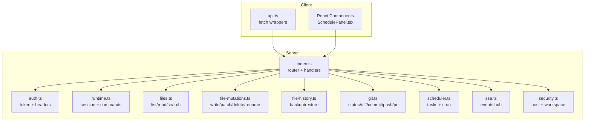
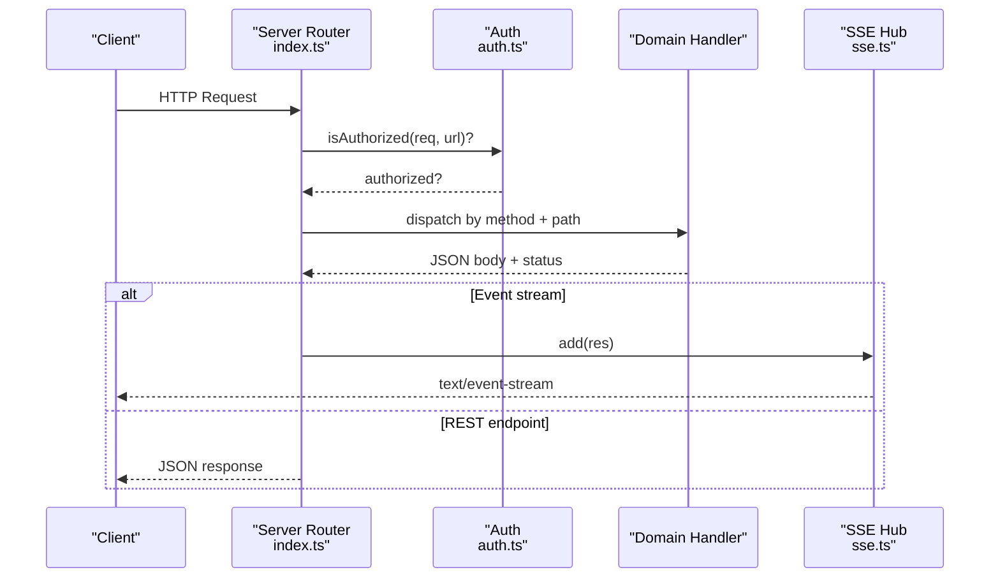
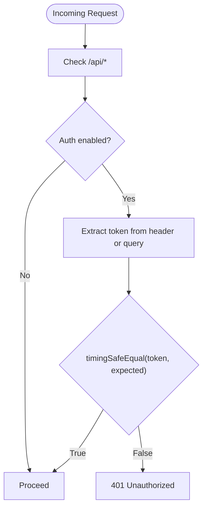
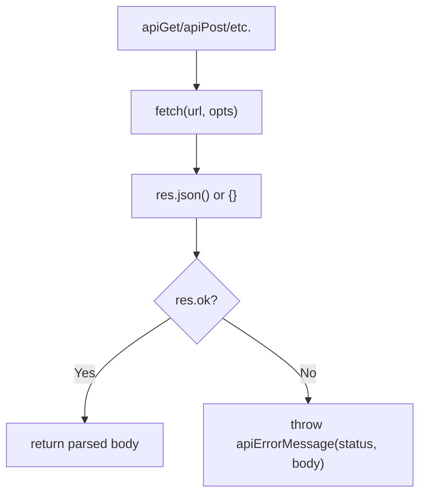
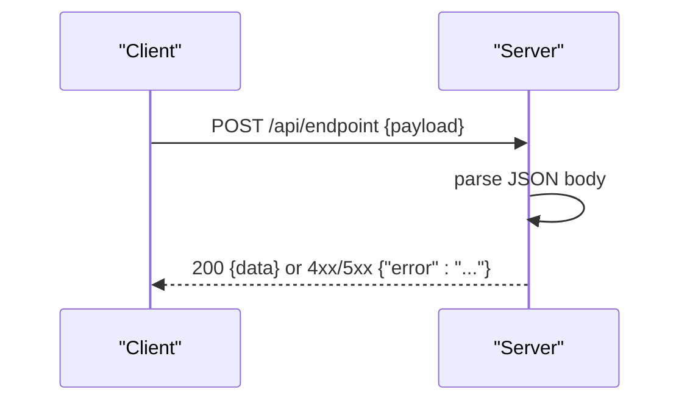
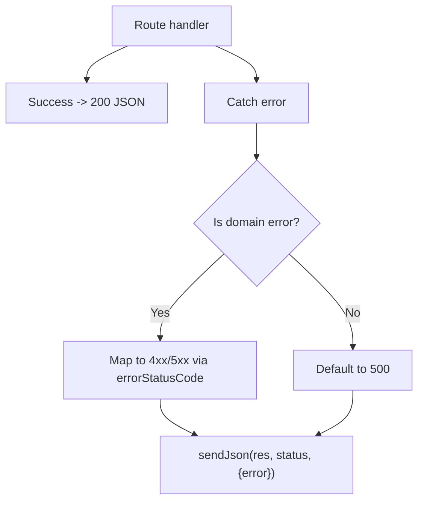
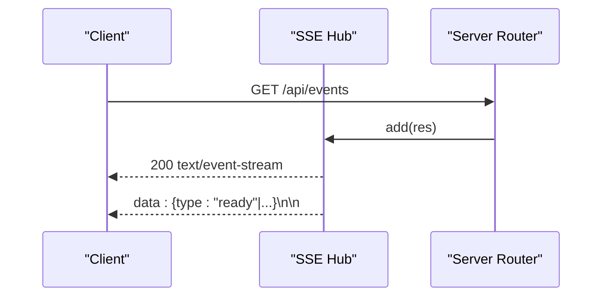
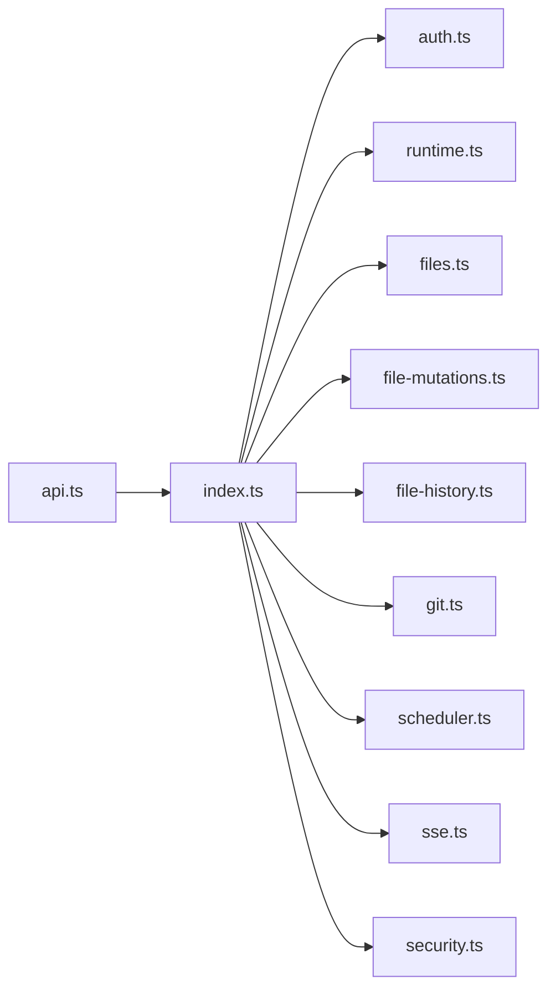

# HTTP API Design

<cite>
**Referenced Files in This Document**
- [api.ts](file://src/client/src/lib/api.ts)
- [index.ts](file://src/server/index.ts)
- [auth.ts](file://src/server/auth.ts)
- [protocol.ts](file://src/shared/protocol.ts)
- [sse.ts](file://src/server/sse.ts)
- [files.ts](file://src/server/files.ts)
- [file-mutations.ts](file://src/server/file-mutations.ts)
- [file-history.ts](file://src/server/file-history.ts)
- [git.ts](file://src/server/git.ts)
- [runtime.ts](file://src/server/runtime.ts)
- [scheduler.ts](file://src/server/scheduler.ts)
- [security.ts](file://src/server/security.ts)
- [SchedulePanel.tsx](file://src/client/src/components/dock/SchedulePanel.tsx)
</cite>

## Table of Contents
1. [Introduction](#introduction)
2. [Project Structure](#project-structure)
3. [Core Components](#core-components)
4. [Architecture Overview](#architecture-overview)
5. [Detailed Component Analysis](#detailed-component-analysis)
6. [Dependency Analysis](#dependency-analysis)
7. [Performance Considerations](#performance-considerations)
8. [Troubleshooting Guide](#troubleshooting-guide)
9. [Conclusion](#conclusion)
10. [Appendices](#appendices)

## Introduction
This document describes the HTTP API design and implementation of the Quake Code web server. It covers the RESTful endpoint structure, request/response schemas, authentication mechanisms, error handling patterns, and the client-side API utilities. It also explains how the system serializes requests, parses responses, handles HTTP status codes, and manages error scenarios. Practical examples, parameter validation, and best practices for extending the API surface are included.

## Project Structure
The HTTP API is implemented in the server module and consumed by the client. Shared data contracts define request/response schemas. The server exposes:
- Static assets and HTML
- REST endpoints under /api/*
- Server-Sent Events (SSE) for real-time updates
- Authentication via a token header or query parameter

**Diagram sources**
- [index.ts:401-662](file://src/server/index.ts#L401-L662)
- [api.ts:9-58](file://src/client/src/lib/api.ts#L9-L58)
- [auth.ts:6-55](file://src/server/auth.ts#L6-L55)
- [runtime.ts:12-456](file://src/server/runtime.ts#L12-L456)
- [files.ts:13-131](file://src/server/files.ts#L13-L131)
- [file-mutations.ts:13-140](file://src/server/file-mutations.ts#L13-L140)
- [file-history.ts:20-159](file://src/server/file-history.ts#L20-L159)
- [git.ts:63-334](file://src/server/git.ts#L63-L334)
- [scheduler.ts:54-257](file://src/server/scheduler.ts#L54-L257)
- [sse.ts:6-31](file://src/server/sse.ts#L6-L31)
- [security.ts:24-41](file://src/server/security.ts#L24-L41)

**Section sources**
- [index.ts:401-662](file://src/server/index.ts#L401-L662)
- [api.ts:9-58](file://src/client/src/lib/api.ts#L9-L58)

## Core Components
- Client API utilities: Typed fetch wrappers for GET/POST/PATCH/DELETE with token propagation and error extraction.
- Server router: Central handler that routes requests to domain-specific services and returns JSON with appropriate status codes.
- Authentication: Token-based protection via header or query parameter; injects token into client HTML.
- SSE hub: Real-time event broadcasting to clients subscribed to /api/events.
- Domain services: Files, mutations, history, Git, scheduler, runtime, and settings.

**Section sources**
- [api.ts:9-58](file://src/client/src/lib/api.ts#L9-L58)
- [index.ts:401-662](file://src/server/index.ts#L401-L662)
- [auth.ts:6-55](file://src/server/auth.ts#L6-L55)
- [sse.ts:6-31](file://src/server/sse.ts#L6-L31)

## Architecture Overview
The server is a single HTTP endpoint that serves static assets and exposes REST endpoints. Requests are authenticated when under /api/*, then routed to specialized services. Responses are JSON with explicit status codes. SSE is used for long-lived event streams.

**Diagram sources**
- [index.ts:401-662](file://src/server/index.ts#L401-L662)
- [auth.ts:15-29](file://src/server/auth.ts#L15-L29)
- [sse.ts:9-26](file://src/server/sse.ts#L9-L26)

## Detailed Component Analysis

### Authentication and Authorization
- Mechanism: Optional token-based auth. Enabled by default unless disabled via environment. Tokens can be provided via:
  - Header: X-Quake-Web-Token
  - Query parameter: token
- Token lifecycle: Generated on first run and stored securely; can be overridden via environment or file.
- Client injection: On serving index.html, the token is injected into the page script tag for automatic header propagation.

**Diagram sources**
- [index.ts:404-407](file://src/server/index.ts#L404-L407)
- [auth.ts:15-29](file://src/server/auth.ts#L15-L29)
- [auth.ts:31-35](file://src/server/auth.ts#L31-L35)

**Section sources**
- [auth.ts:6-55](file://src/server/auth.ts#L6-L55)
- [index.ts:404-407](file://src/server/index.ts#L404-L407)

### Client API Utilities
- Functions:
  - apiGet, apiPost, apiPatch, apiDelete
  - eventsUrl for SSE connection
- Behavior:
  - Propagates token via X-Quake-Web-Token header when present
  - Parses JSON body; falls back to empty object on parse failure
  - Throws on non-OK responses using a localized error mapper
- Additional helper in UI code demonstrates PATCH/DELETE usage with the same token scheme.

**Diagram sources**
- [api.ts:9-58](file://src/client/src/lib/api.ts#L9-L58)

**Section sources**
- [api.ts:9-58](file://src/client/src/lib/api.ts#L9-L58)
- [SchedulePanel.tsx:31-48](file://src/client/src/components/dock/SchedulePanel.tsx#L31-L48)

### Server Router and Endpoint Catalog
The central router handles:
- Static assets (HTML/CSS/JS) with security headers
- SSE at /api/events
- Configuration and state endpoints
- Sessions, settings, models, commands, extensions
- Git operations
- File listing, search, read, write, patch, delete, rename, history
- Scheduler CRUD and run-now
- Terminal run/stop
- Command dispatch to runtime

```mermaid
flowchart TD
Root["/"] --> Static["Serve static index.html"]
Root --> Api["/api/*"]
Api --> Events["GET /api/events"]
Api --> Config["GET /api/config"]
Api --> State["GET /api/state"]
Api --> Sessions["GET /api/sessions"]
Api --> Settings["GET /api/settings"]
Api --> Models["GET /api/models"]
Api --> Commands["GET /api/commands"]
Api --> Extensions["GET /api/extensions"]
Api --> ToggleExt["POST /api/extensions/toggle"]
Api --> Skills["GET /api/skills"]
Api --> Prompts["GET /api/prompts"]
Api --> WebSettings["GET /api/web-settings"]
Api --> WSRoots["GET /api/workspace/roots"]
Api --> WSBrowse["GET /api/workspace/browse"]
Api --> WSChanges["GET /api/workspace/changes"]
Api --> GitStatus["GET /api/git/status"]
Api --> GitBranch["GET /api/git/branch"]
Api --> GitDiff["GET /api/git/diff"]
Api --> GitStage["POST /api/git/stage"]
Api --> GitUnstage["POST /api/git/unstage"]
Api --> GitCommit["POST /api/git/commit"]
Api --> GitPush["POST /api/git/push"]
Api --> GitPr["POST /api/git/pr"]
Api --> Search["GET /api/search"]
Api --> ScheduledList["GET /api/scheduled"]
Api --> ScheduledCreate["POST /api/scheduled"]
Api --> ScheduledOps["/api/scheduled/{id}[/run]"]
Api --> WebSettingsPatch["POST /api/web-settings"]
Api --> FilesList["GET /api/files"]
Api --> FilesSearch["GET /api/files/search"]
Api --> FilesRead["GET /api/file"]
Api --> FilesWrite["POST /api/file/write"]
Api --> FilesPatch["POST /api/file/patch"]
Api --> FilesDelete["POST /api/file/delete"]
Api --> FilesMkdir["POST /api/file/mkdir"]
Api --> FilesRename["POST /api/file/rename"]
Api --> FileHistory["GET /api/file/history"]
Api --> FileRestore["POST /api/file/restore"]
Api --> Command["POST /api/command"]
Api --> TermRun["POST /api/terminal/run"]
Api --> TermStop["POST /api/terminal/stop"]
```

**Diagram sources**
- [index.ts:401-662](file://src/server/index.ts#L401-L662)

**Section sources**
- [index.ts:401-662](file://src/server/index.ts#L401-L662)

### Request Serialization and Response Parsing
- Client:
  - JSON payloads serialized via JSON.stringify
  - Responses parsed via res.json(); fallback to {} on parse errors
  - Non-OK responses raise an error constructed from a localized message mapper
- Server:
  - JSON responses written with explicit Content-Type and Content-Length
  - Body is JSON.stringify'ed before sending
  - Error responses include an error field; generic catch returns 500 with error message

**Diagram sources**
- [api.ts:16-25](file://src/client/src/lib/api.ts#L16-L25)
- [index.ts:221-229](file://src/server/index.ts#L221-L229)
- [index.ts:656-658](file://src/server/index.ts#L656-L658)

**Section sources**
- [api.ts:16-25](file://src/client/src/lib/api.ts#L16-L25)
- [index.ts:221-229](file://src/server/index.ts#L221-L229)
- [index.ts:656-658](file://src/server/index.ts#L656-L658)

### Error Handling Patterns
- Status code mapping:
  - 401/403: Unauthorized/Forbidden
  - 404: Not found
  - 5xx: Server error
  - Other: General failure
- Domain-specific errors:
  - File service throws WebFileServiceError with status codes (e.g., 404, 413)
  - File mutation service throws FileMutationError with status codes (e.g., 404, 409, 413)
  - Scheduler throws SchedulerError with mapped status (e.g., 400, 404, 503)
  - Git operations return structured results with ok/error fields and human-readable messages
- Generic catch-all:
  - Route-level errorStatusCode maps domain errors to 4xx/5xx; otherwise 500
  - Error bodies include an error string

**Diagram sources**
- [index.ts:231-234](file://src/server/index.ts#L231-L234)
- [files.ts:6-11](file://src/server/files.ts#L6-L11)
- [file-mutations.ts:6-11](file://src/server/file-mutations.ts#L6-L11)
- [scheduler.ts:250-257](file://src/server/scheduler.ts#L250-L257)

**Section sources**
- [index.ts:231-234](file://src/server/index.ts#L231-L234)
- [files.ts:6-11](file://src/server/files.ts#L6-L11)
- [file-mutations.ts:6-11](file://src/server/file-mutations.ts#L6-L11)
- [scheduler.ts:250-257](file://src/server/scheduler.ts#L250-L257)

### SSE (Server-Sent Events) for Real-Time Updates
- Endpoint: GET /api/events
- Behavior:
  - Sets SSE headers and writes a keepalive line
  - Maintains a set of active connections
  - Broadcasts typed events to all clients
- Client usage:
  - eventsUrl builds the URL with optional token query param
  - Client fetches with Accept: text/event-stream

**Diagram sources**
- [index.ts:408-412](file://src/server/index.ts#L408-L412)
- [sse.ts:9-26](file://src/server/sse.ts#L9-L26)

**Section sources**
- [index.ts:408-412](file://src/server/index.ts#L408-L412)
- [sse.ts:6-31](file://src/server/sse.ts#L6-L31)

### Request/Response Schemas
Shared protocol defines core types used across the API:
- WebServerConfig: server metadata and capabilities
- WebSessionState: runtime state snapshot
- WebSessionSummary, WebModelSummary, WebCommandInfo
- WebPlanState and related plan types
- WebFileEntry
- WebAgentEvent and WebExtensionUiRequest
- WebClientCommand and WebCommandResponse

These types guide request/response shapes for endpoints like /api/config, /api/state, /api/sessions, /api/models, /api/commands, /api/extensions, /api/files, and command dispatch.

**Section sources**
- [protocol.ts:6-198](file://src/shared/protocol.ts#L6-L198)

### File Operations API
Endpoints:
- GET /api/files, /api/files/search
- GET /api/file
- POST /api/file/write, /api/file/patch, /api/file/delete, /api/file/mkdir, /api/file/rename
- GET /api/file/history, POST /api/file/restore

Validation and limits:
- Path resolution prevents escaping workspace root
- Read preview limited to 1MB
- Patch requires exact substring matches
- Delete distinguishes files vs directories

**Section sources**
- [index.ts:568-625](file://src/server/index.ts#L568-L625)
- [files.ts:16-61](file://src/server/files.ts#L16-L61)
- [file-mutations.ts:21-98](file://src/server/file-mutations.ts#L21-L98)
- [file-history.ts:35-93](file://src/server/file-history.ts#L35-L93)

### Git Integration API
Endpoints:
- GET /api/git/status, /api/git/branch, /api/git/diff
- POST /api/git/stage, /api/git/unstage, /api/git/commit, /api/git/push, /api/git/pr

Behavior:
- Uses git and gh with timeouts and buffer limits
- Returns structured results with ok/error fields and human-readable messages
- Handles edge cases (no upstream branch, missing gh)

**Section sources**
- [index.ts:478-513](file://src/server/index.ts#L478-L513)
- [git.ts:63-334](file://src/server/git.ts#L63-L334)

### Scheduler API
Endpoints:
- GET /api/scheduled (list)
- POST /api/scheduled (create)
- POST /api/scheduled/{id}/run (run now)
- PATCH /api/scheduled/{id} (update)
- DELETE /api/scheduled/{id} (remove)

Behavior:
- Lightweight cron-like scheduler persisted under workspace
- Validates cron expressions and computes nextRun
- Errors carry HTTP-friendly status codes

**Section sources**
- [index.ts:520-563](file://src/server/index.ts#L520-L563)
- [scheduler.ts:54-257](file://src/server/scheduler.ts#L54-L257)

### Terminal API
Endpoints:
- POST /api/terminal/run (spawn and stream output via SSE)
- POST /api/terminal/stop (terminate by id)

Behavior:
- Enforces policy and timeouts
- Emits terminal_start/terminal_output/terminal_end events

**Section sources**
- [index.ts:631-650](file://src/server/index.ts#L631-L650)
- [runtime.ts:452-455](file://src/server/runtime.ts#L452-L455)

### Command Dispatch API
Endpoint:
- POST /api/command

Behavior:
- Parses JSON payload into WebClientCommand
- Routes to runtime with locking and concurrency safeguards
- Returns WebCommandResponse with success/error

**Section sources**
- [index.ts:626-630](file://src/server/index.ts#L626-L630)
- [runtime.ts:255-374](file://src/server/runtime.ts#L255-L374)

### Security and Host Validation
- Host validation: Binding to 0.0.0.0 (:: or empty) requires explicit allow-remote flag
- Workspace allowlist: Ensures runtime and file operations stay within allowed roots
- Security headers applied to JSON responses and static assets

**Section sources**
- [security.ts:24-41](file://src/server/security.ts#L24-L41)
- [index.ts:97-105](file://src/server/index.ts#L97-L105)
- [index.ts:383-399](file://src/server/index.ts#L383-L399)

## Dependency Analysis

**Diagram sources**
- [api.ts:9-58](file://src/client/src/lib/api.ts#L9-L58)
- [index.ts:401-662](file://src/server/index.ts#L401-L662)
- [auth.ts:6-55](file://src/server/auth.ts#L6-L55)
- [runtime.ts:12-456](file://src/server/runtime.ts#L12-L456)
- [files.ts:13-131](file://src/server/files.ts#L13-L131)
- [file-mutations.ts:13-140](file://src/server/file-mutations.ts#L13-L140)
- [file-history.ts:20-159](file://src/server/file-history.ts#L20-L159)
- [git.ts:63-334](file://src/server/git.ts#L63-L334)
- [scheduler.ts:54-257](file://src/server/scheduler.ts#L54-L257)
- [sse.ts:6-31](file://src/server/sse.ts#L6-L31)
- [security.ts:24-41](file://src/server/security.ts#L24-L41)

**Section sources**
- [index.ts:401-662](file://src/server/index.ts#L401-L662)

## Performance Considerations
- SSE streaming: Keep-alive and buffering are configured; clients should handle reconnects gracefully.
- File previews: 1MB limit for read operations to prevent large payloads.
- Scheduler: Periodic tick with minute-bucket deduplication to avoid double-fires.
- Terminal: Timeout and output truncation to bound resource usage.
- Static serving: MIME type mapping and security headers reduce overhead.

[No sources needed since this section provides general guidance]

## Troubleshooting Guide
Common issues and resolutions:
- 401 Unauthorized: Ensure X-Quake-Web-Token header or token query param is present and correct.
- 403 Forbidden: Static asset path traversal rejected; verify requested path is within served directory.
- 404 Not found: Resource does not exist; check endpoint path and parameters.
- 413 Payload too large: File read exceeds preview limit; use smaller files or download via other means.
- 400/409/413 from file operations: Validate paths, permissions, and sizes; confirm not escaping workspace root.
- Git failures: Verify git and gh availability and credentials; check stderr messages for details.
- Scheduler errors: Validate cron expressions and ensure task runner is wired.

**Section sources**
- [index.ts:231-234](file://src/server/index.ts#L231-L234)
- [files.ts:19-60](file://src/server/files.ts#L19-L60)
- [file-mutations.ts:36-98](file://src/server/file-mutations.ts#L36-L98)
- [git.ts:63-334](file://src/server/git.ts#L63-L334)
- [scheduler.ts:250-257](file://src/server/scheduler.ts#L250-L257)

## Conclusion
The HTTP API is a cohesive REST surface backed by a robust server router, strong authentication, and domain services. Client utilities provide a clean, typed interface for consuming endpoints, while SSE enables real-time collaboration and feedback. Error handling is explicit and localized, with clear status codes and messages. Extending the API follows established patterns: add endpoints in the router, implement domain services with proper validation and error types, and use shared protocol types for consistency.

[No sources needed since this section summarizes without analyzing specific files]

## Appendices

### Best Practices for Extending the API Surface
- Keep endpoints RESTful and consistent in naming and verb usage.
- Use shared protocol types to maintain schema consistency.
- Validate inputs early; throw domain-specific errors with appropriate status codes.
- Apply security headers and enforce workspace/root boundaries.
- Prefer SSE for long-lived streams; otherwise use standard JSON responses.
- Add tests for routing, auth, and error scenarios.

[No sources needed since this section provides general guidance]
