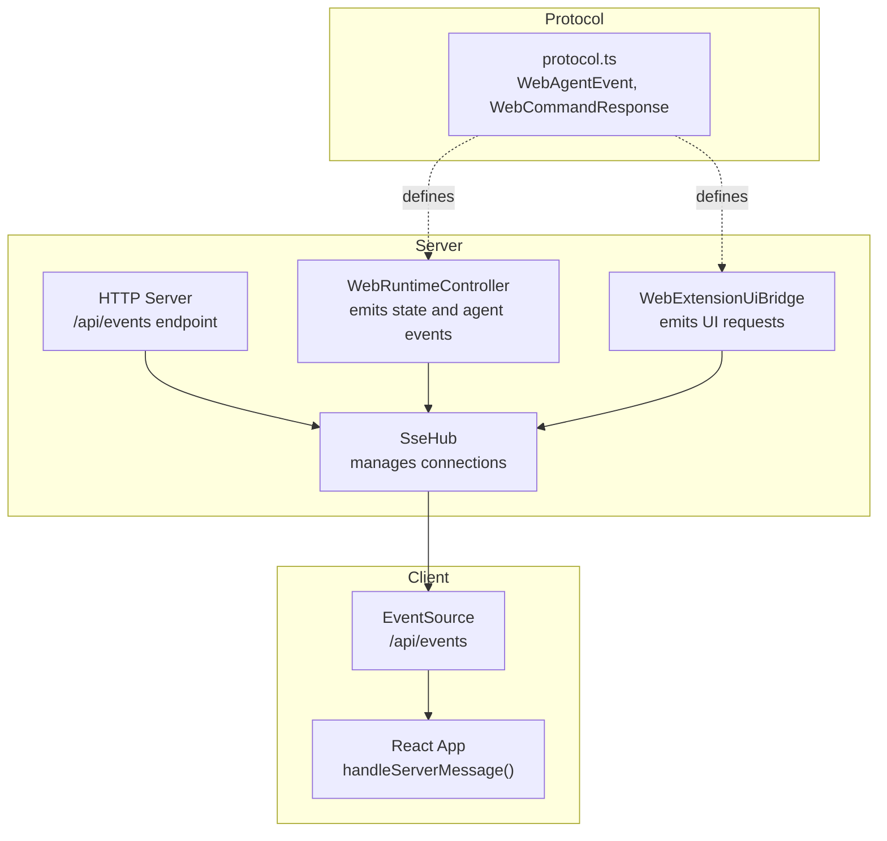
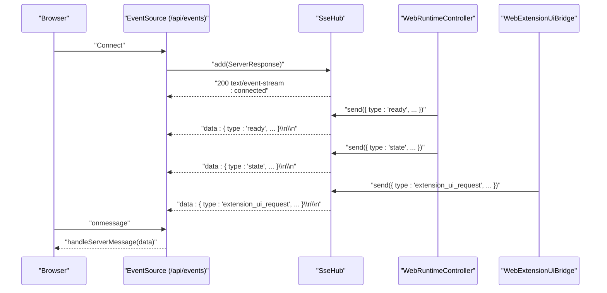
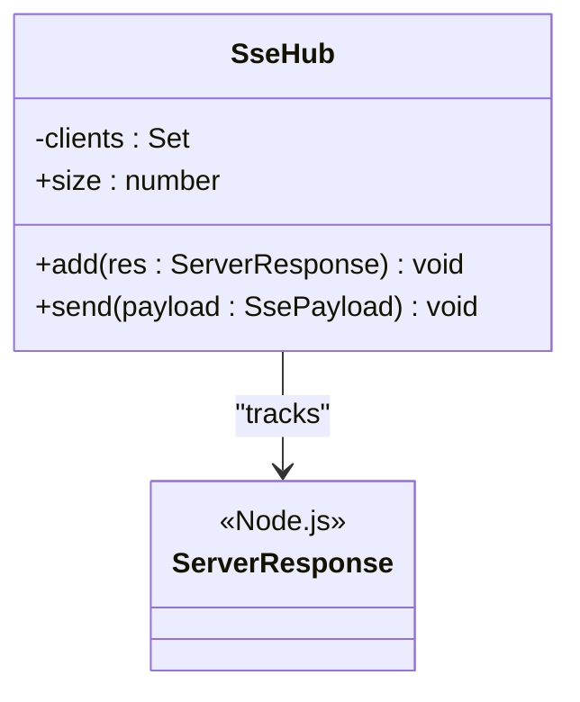
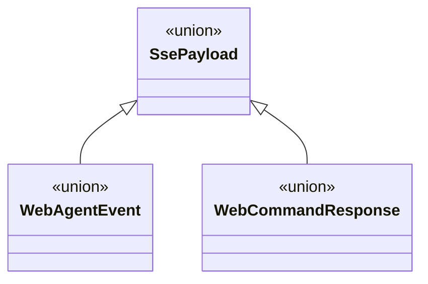
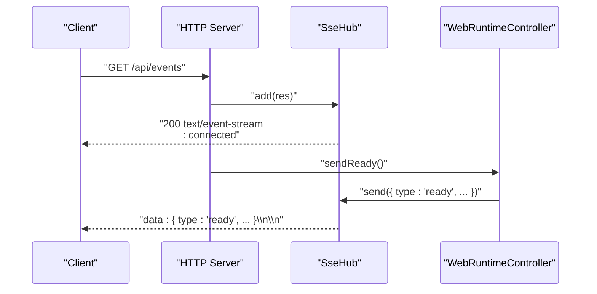
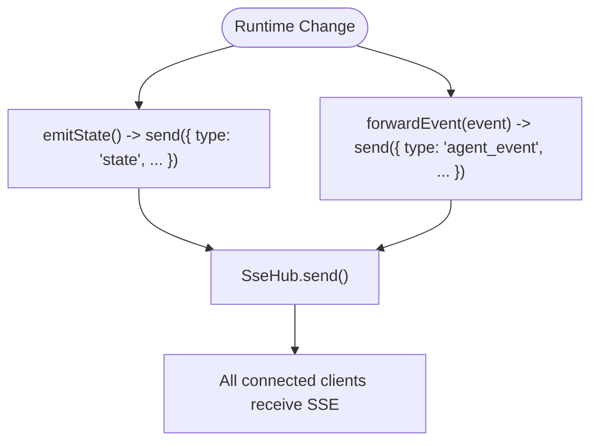
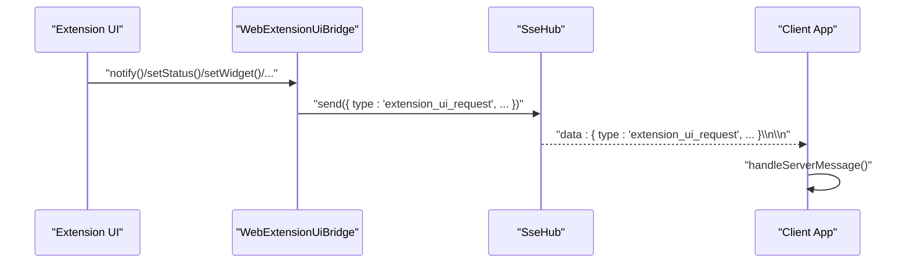
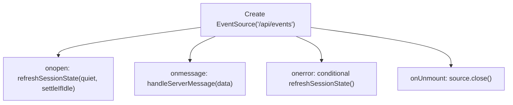
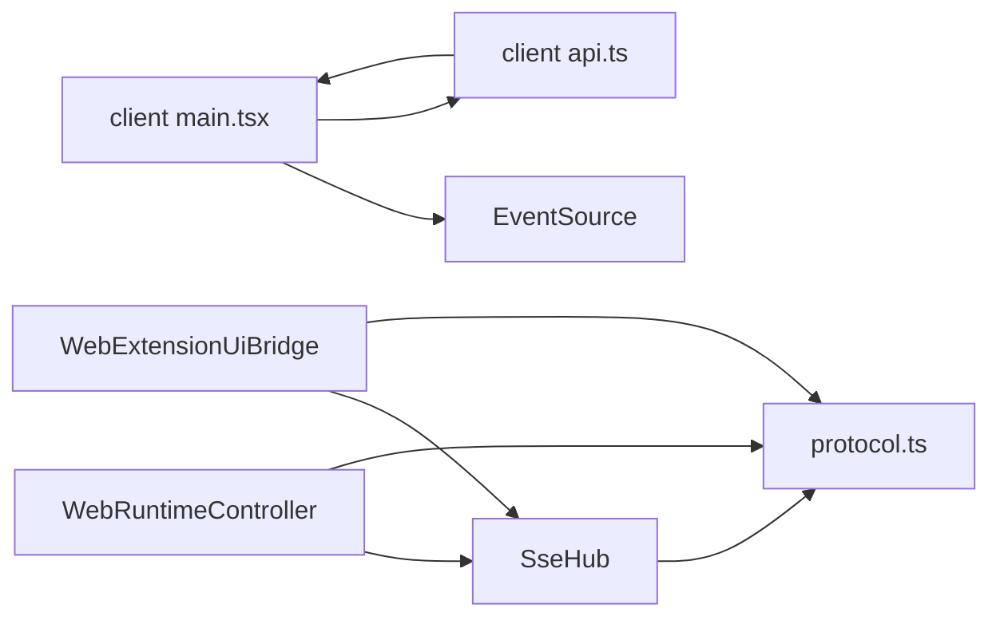

# Server-Sent Events (SSE)

<cite>
**Referenced Files in This Document**
- [sse.ts](file://src/server/sse.ts)
- [protocol.ts](file://src/shared/protocol.ts)
- [index.ts](file://src/server/index.ts)
- [runtime.ts](file://src/server/runtime.ts)
- [web-extension-ui.ts](file://src/server/web-extension-ui.ts)
- [main.tsx](file://src/client/src/main.tsx)
- [api.ts](file://src/client/src/lib/api.ts)
</cite>

## Table of Contents
1. [Introduction](#introduction)
2. [Project Structure](#project-structure)
3. [Core Components](#core-components)
4. [Architecture Overview](#architecture-overview)
5. [Detailed Component Analysis](#detailed-component-analysis)
6. [Dependency Analysis](#dependency-analysis)
7. [Performance Considerations](#performance-considerations)
8. [Troubleshooting Guide](#troubleshooting-guide)
9. [Conclusion](#conclusion)

## Introduction
This document explains the Server-Sent Events (SSE) implementation powering real-time updates in the application. It covers the SseHub class architecture, client connection lifecycle, event streaming patterns, payload serialization, protocol compliance, automatic reconnection handling, and performance characteristics for multiple concurrent clients. Practical examples describe how to emit events from the server and consume them on the client, along with error handling strategies.

## Project Structure
The SSE subsystem spans three layers:
- Server-side event hub and routing
- Protocol definitions for payloads
- Client-side event listener and reconciliation logic

**Diagram sources**
- [index.ts:401-412](file://src/server/index.ts#L401-L412)
- [sse.ts:6-31](file://src/server/sse.ts#L6-L31)
- [runtime.ts:401-426](file://src/server/runtime.ts#L401-L426)
- [web-extension-ui.ts:27-134](file://src/server/web-extension-ui.ts#L27-L134)
- [protocol.ts:161-197](file://src/shared/protocol.ts#L161-L197)
- [main.tsx:572-588](file://src/client/src/main.tsx#L572-L588)

**Section sources**
- [index.ts:401-412](file://src/server/index.ts#L401-L412)
- [sse.ts:6-31](file://src/server/sse.ts#L6-L31)
- [protocol.ts:161-197](file://src/shared/protocol.ts#L161-L197)
- [main.tsx:572-588](file://src/client/src/main.tsx#L572-L588)

## Core Components
- SseHub: Maintains a set of active ServerResponse connections, sets SSE headers, writes initial keepalive, and broadcasts payloads to all clients.
- WebRuntimeController: Emits session state and agent events via SseHub, and orchestrates runtime changes.
- WebExtensionUiBridge: Bridges extension UI requests and emits them as SSE payloads.
- Protocol types: Define the shape of WebAgentEvent and WebCommandResponse payloads.
- Client-side EventSource: Establishes and consumes the SSE stream, handling reconnects and errors.

Key responsibilities:
- Connection lifecycle: Add/remove connections, detect closure, and maintain a count.
- Payload serialization: JSON stringify payloads and wrap them in SSE “dataÔÇØ lines.
- Protocol compliance: Content-Type, cache-control, keep-alive, and newline-delimited events.

**Section sources**
- [sse.ts:6-31](file://src/server/sse.ts#L6-L31)
- [runtime.ts:401-426](file://src/server/runtime.ts#L401-L426)
- [web-extension-ui.ts:27-134](file://src/server/web-extension-ui.ts#L27-L134)
- [protocol.ts:161-197](file://src/shared/protocol.ts#L161-L197)
- [index.ts:401-412](file://src/server/index.ts#L401-L412)

## Architecture Overview
The SSE pipeline connects the browser's EventSource to the server's SseHub, which fans out events to all subscribed clients. The runtime controller and extension bridge publish domain-specific events.

**Diagram sources**
- [index.ts:401-412](file://src/server/index.ts#L401-L412)
- [sse.ts:9-26](file://src/server/sse.ts#L9-L26)
- [runtime.ts:56-58](file://src/server/runtime.ts#L56-L58)
- [runtime.ts:401-403](file://src/server/runtime.ts#L401-L403)
- [web-extension-ui.ts:62-118](file://src/server/web-extension-ui.ts#L62-L118)
- [main.tsx:572-578](file://src/client/src/main.tsx#L572-L578)

## Detailed Component Analysis

### SseHub: Connection Management and Broadcasting
- Adds SSE headers and writes an initial comment line to establish the connection.
- Tracks active connections in a Set and removes them on close.
- Serializes payloads as JSON and wraps them in SSE “dataÔÇØ lines, followed by a blank line separator.
- Exposes a size getter for diagnostics.

**Diagram sources**
- [sse.ts:6-31](file://src/server/sse.ts#L6-L31)

**Section sources**
- [sse.ts:9-26](file://src/server/sse.ts#L9-L26)

### Payload Types and Serialization
- SsePayload unions WebAgentEvent and WebCommandResponse.
- The server serializes payloads with JSON.stringify and prefixes with “data: ÔÇØ and suffixes with two newlines per SSE specification.
- The client receives raw data and parses it into structured events.

**Diagram sources**
- [protocol.ts:161-197](file://src/shared/protocol.ts#L161-L197)
- [sse.ts:4-4](file://src/server/sse.ts#L4-L4)

**Section sources**
- [protocol.ts:161-197](file://src/shared/protocol.ts#L161-L197)
- [sse.ts:21-26](file://src/server/sse.ts#L21-L26)

### Server Routing and Ready Emission
- The /api/events route initializes SSE for the client, adds the connection to SseHub, and sends a “readyÔÇØ event containing session state and messages.
- This ensures the client immediately receives a baseline state upon connect.

**Diagram sources**
- [index.ts:408-411](file://src/server/index.ts#L408-L411)
- [runtime.ts:56-58](file://src/server/runtime.ts#L56-L58)
- [sse.ts:9-16](file://src/server/sse.ts#L9-L16)

**Section sources**
- [index.ts:408-411](file://src/server/index.ts#L408-L411)
- [runtime.ts:56-58](file://src/server/runtime.ts#L56-L58)

### Runtime Events and State Updates
- WebRuntimeController emits “stateÔÇØ events after significant changes and forwards agent session events as “agent_eventÔÇØ.
- These events are broadcast to all clients via SseHub.

**Diagram sources**
- [runtime.ts:401-403](file://src/server/runtime.ts#L401-L403)
- [runtime.ts:452-455](file://src/server/runtime.ts#L452-L455)
- [sse.ts:21-26](file://src/server/sse.ts#L21-L26)

**Section sources**
- [runtime.ts:401-403](file://src/server/runtime.ts#L401-L403)
- [runtime.ts:452-455](file://src/server/runtime.ts#L452-L455)

### Extension UI Requests via SSE
- WebExtensionUiBridge translates extension UI requests into SSE payloads and sends them through SseHub.
- Methods include notifications, status updates, widgets, sidebar content, and editor text updates.

**Diagram sources**
- [web-extension-ui.ts:62-118](file://src/server/web-extension-ui.ts#L62-L118)
- [sse.ts:21-26](file://src/server/sse.ts#L21-L26)
- [main.tsx:572-578](file://src/client/src/main.tsx#L572-L578)

**Section sources**
- [web-extension-ui.ts:62-118](file://src/server/web-extension-ui.ts#L62-L118)

### Client-Side Event Consumption and Reconnection
- The client creates an EventSource to /api/events and listens for onopen, onmessage, and onerror.
- On open, it refreshes session state quietly and settles if idle.
- On message, it parses the data and applies updates to the UI.
- On error, it refreshes session state if the client is still expecting streaming or has dangling UI state.
- The client closes the EventSource on unmount and cancels timers to prevent leaks.

**Diagram sources**
- [main.tsx:572-588](file://src/client/src/main.tsx#L572-L588)
- [api.ts:48-50](file://src/client/src/lib/api.ts#L48-L50)

**Section sources**
- [main.tsx:572-588](file://src/client/src/main.tsx#L572-L588)
- [api.ts:48-50](file://src/client/src/lib/api.ts#L48-L50)

## Dependency Analysis
- SseHub depends on Node.js ServerResponse and the shared protocol types.
- WebRuntimeController depends on SseHub and the agent session runtime.
- WebExtensionUiBridge depends on SseHub and protocol types for UI requests.
- Client-side main.tsx depends on EventSource and the API module for constructing the events URL.

**Diagram sources**
- [sse.ts:1-4](file://src/server/sse.ts#L1-L4)
- [runtime.ts:8-11](file://src/server/runtime.ts#L8-L11)
- [web-extension-ui.ts:2-4](file://src/server/web-extension-ui.ts#L2-L4)
- [protocol.ts:161-197](file://src/shared/protocol.ts#L161-L197)
- [main.tsx:572-578](file://src/client/src/main.tsx#L572-L578)
- [api.ts:48-50](file://src/client/src/lib/api.ts#L48-L50)

**Section sources**
- [sse.ts:1-4](file://src/server/sse.ts#L1-L4)
- [runtime.ts:8-11](file://src/server/runtime.ts#L8-L11)
- [web-extension-ui.ts:2-4](file://src/server/web-extension-ui.ts#L2-L4)
- [protocol.ts:161-197](file://src/shared/protocol.ts#L161-L197)
- [main.tsx:572-578](file://src/client/src/main.tsx#L572-L578)
- [api.ts:48-50](file://src/client/src/lib/api.ts#L48-L50)

## Performance Considerations
- Connection fan-out cost: Broadcasting scales linearly with the number of clients. For N clients, each send performs N writes.
- Payload size: Large payloads increase bandwidth and parsing overhead. Prefer compact representations and avoid unnecessary fields.
- Backpressure: There is no explicit backpressure mechanism; clients must be able to keep up with event rate.
- Keep-alive and buffering: The server sets headers to maintain keep-alive and disable proxy buffering, which helps reduce latency for frequent small events.
- Concurrency: The hub tracks connections and cleans up on close, preventing memory leaks from stale connections.

Recommendations:
- Batch or throttle frequent updates when possible.
- Use selective subscription patterns if the number of clients grows large.
- Monitor hub.size to detect connection spikes and investigate bottlenecks.

**Section sources**
- [sse.ts:9-26](file://src/server/sse.ts#L9-L26)

## Troubleshooting Guide
Common issues and remedies:
- Connection drops during long-running operations:
  - The client refreshes session state on SSE errors when appropriate. Verify that the client's error handler triggers refreshes and that the server continues sending state updates.
- No events received after initial ready:
  - Ensure the runtime controller emits state changes and agent events. Check that SseHub.send is invoked and that clients are still connected.
- Authentication or token mismatch:
  - The events URL can include a token query parameter. Confirm the client passes the token and the server enforces authorization for /api routes.
- Client not reconnecting automatically:
  - EventSource reconnects automatically on network errors. If the page remains idle, rely on periodic refreshes and focus/visibility handlers to reconcile state.

Operational checks:
- Verify SSE headers are set on /api/events.
- Confirm JSON payloads are well-formed and properly serialized.
- Validate that the client closes EventSource on unmount and cancels timers.

**Section sources**
- [index.ts:408-411](file://src/server/index.ts#L408-L411)
- [main.tsx:572-588](file://src/client/src/main.tsx#L572-L588)
- [api.ts:48-50](file://src/client/src/lib/api.ts#L48-L50)

## Conclusion
The SSE implementation provides a lightweight, scalable mechanism for real-time updates. SseHub centralizes connection management and broadcasting, while WebRuntimeController and WebExtensionUiBridge deliver domain-specific events. The client consumes these events via EventSource, with built-in reconnection and reconciliation logic. For high concurrency, monitor connection counts, payload sizes, and consider batching strategies to maintain responsiveness.
