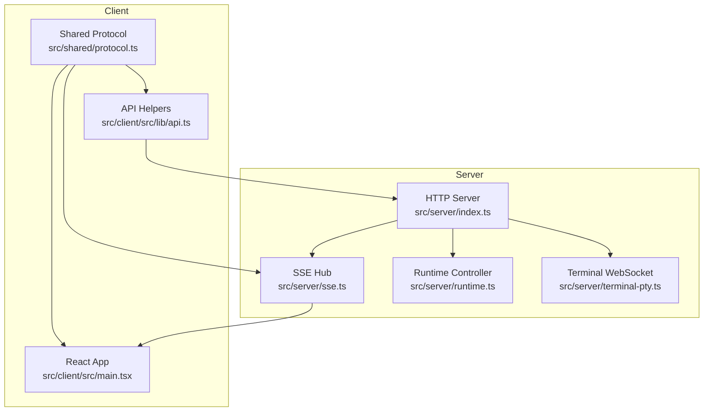
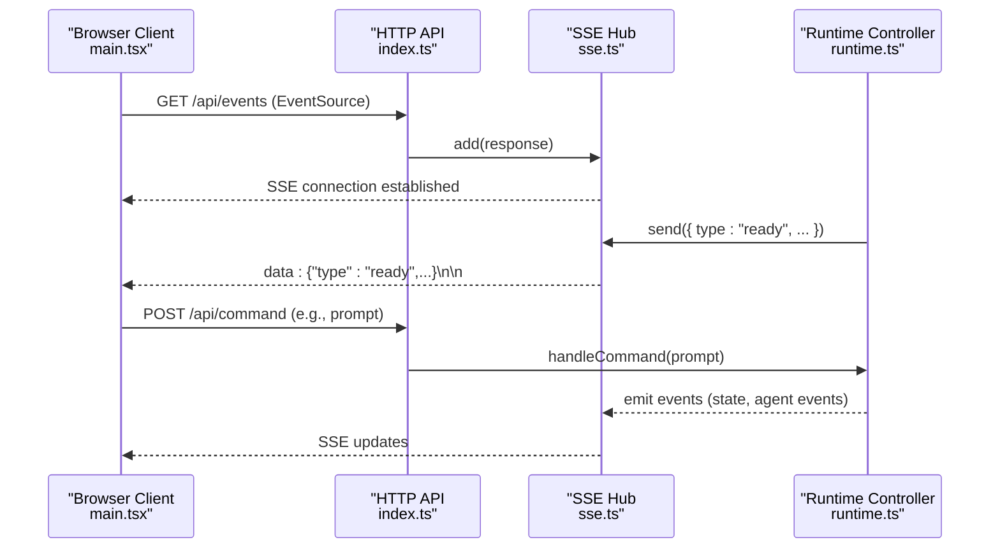
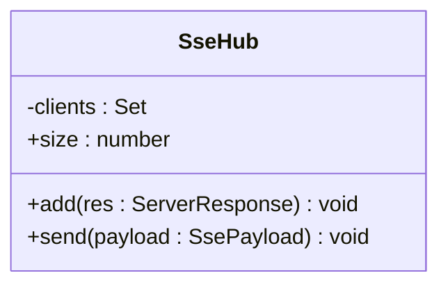
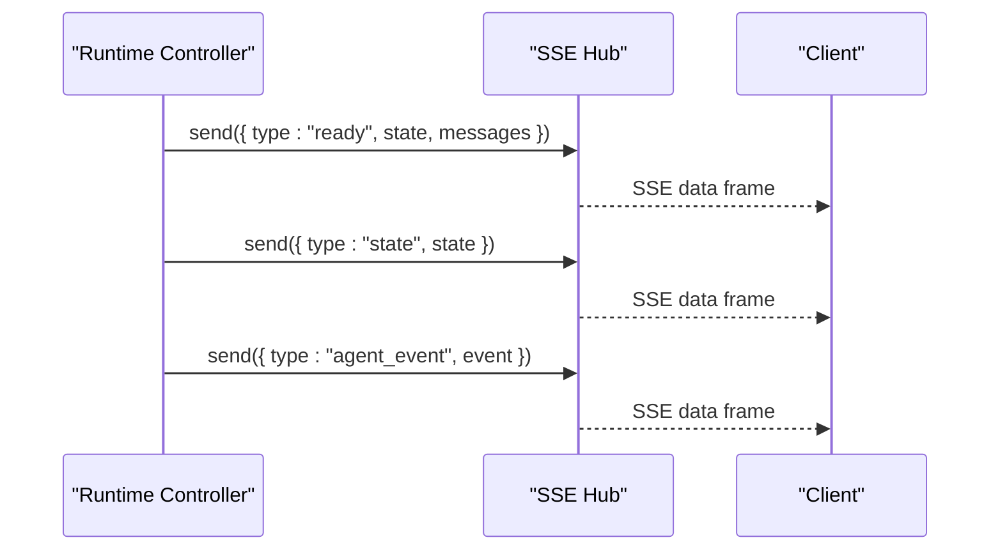
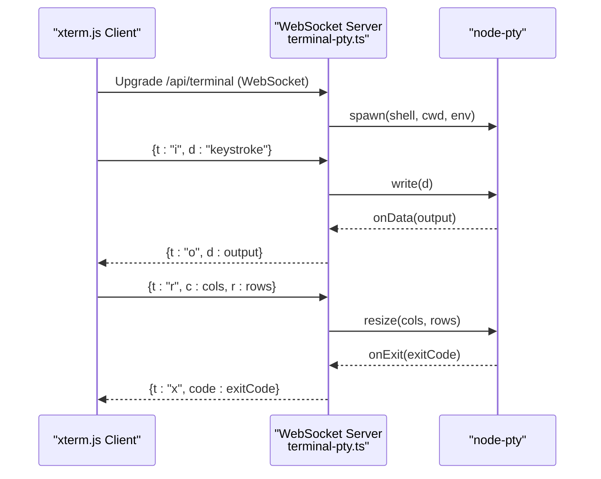
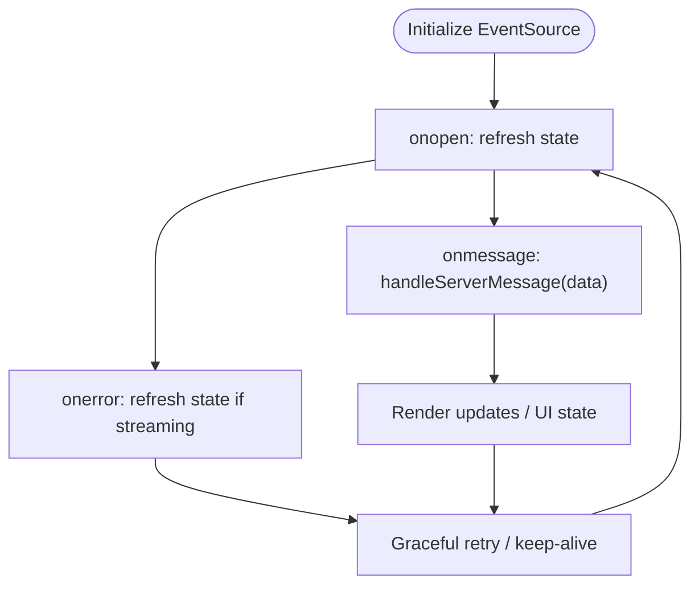
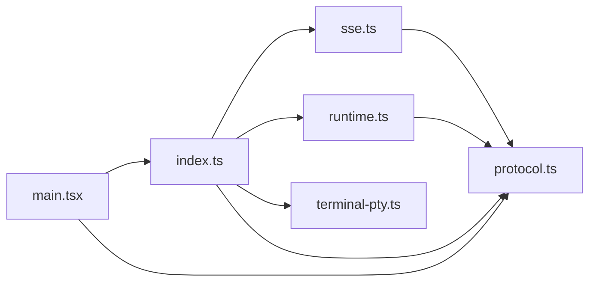
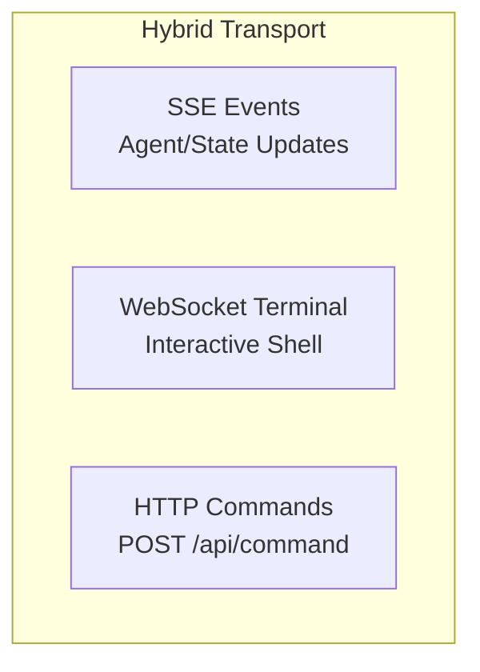
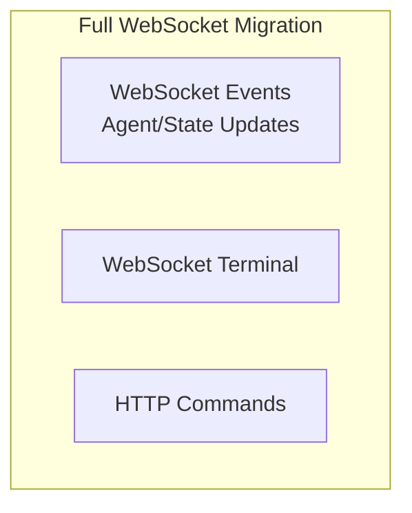

# WebSocket Considerations

<cite>
**Referenced Files in This Document**
- [architecture.md](file://docs/architecture.md)
- [sse.ts](file://src/server/sse.ts)
- [index.ts](file://src/server/index.ts)
- [terminal-pty.ts](file://src/server/terminal-pty.ts)
- [api.ts](file://src/client/src/lib/api.ts)
- [main.tsx](file://src/client/src/main.tsx)
- [protocol.ts](file://src/shared/protocol.ts)
- [runtime.ts](file://src/server/runtime.ts)
</cite>

## Table of Contents
1. [Introduction](#introduction)
2. [Project Structure](#project-structure)
3. [Core Components](#core-components)
4. [Architecture Overview](#architecture-overview)
5. [Detailed Component Analysis](#detailed-component-analysis)
6. [Dependency Analysis](#dependency-analysis)
7. [Performance Considerations](#performance-considerations)
8. [Migration Strategies](#migration-strategies)
9. [Protocol Evolution Considerations](#protocol-evolution-considerations)
10. [Bidirectional Communication Patterns](#bidirectional-communication-patterns)
11. [Connection Management Overhead](#connection-management-overhead)
12. [Troubleshooting Guide](#troubleshooting-guide)
13. [Conclusion](#conclusion)

## Introduction
This document analyzes WebSocket integration considerations for the quake-web project, focusing on the current SSE-based architecture, potential use cases for WebSocket, and migration strategies. It examines the existing server-to-client event delivery via Server-Sent Events (SSE), the client-side EventSource consumption, and the single active WebSocket used for interactive terminal sessions. The document outlines architectural implications, performance trade-offs, and practical migration paths from SSE to WebSocket while preserving existing functionality.

## Project Structure
The quake-web project follows a clear separation between server and client components:
- Server-side modules handle HTTP routing, SSE broadcasting, runtime orchestration, and terminal WebSocket integration.
- Client-side modules consume SSE events via EventSource and issue HTTP requests for commands.
- Shared protocol definitions unify event and command structures across client and server.

**Diagram sources**
- [index.ts:401-662](file://src/server/index.ts#L401-L662)
- [sse.ts:6-31](file://src/server/sse.ts#L6-L31)
- [runtime.ts:12-30](file://src/server/runtime.ts#L12-L30)
- [terminal-pty.ts:24-94](file://src/server/terminal-pty.ts#L24-L94)
- [main.tsx:570-588](file://src/client/src/main.tsx#L570-L588)
- [api.ts:48-50](file://src/client/src/lib/api.ts#L48-L50)
- [protocol.ts:161-197](file://src/shared/protocol.ts#L161-L197)

**Section sources**
- [architecture.md:17-44](file://docs/architecture.md#L17-L44)
- [index.ts:401-662](file://src/server/index.ts#L401-L662)

## Core Components
- SSE Hub: Manages SSE connections and broadcasts server-generated events to all connected clients.
- Runtime Controller: Bridges the agent runtime to the web interface, emitting state and agent events consumed by SSE.
- Terminal WebSocket: Provides bidirectional real-time terminal interaction via WebSocket for interactive shells.
- Client EventSource: Subscribes to SSE endpoints and processes incoming events.
- Shared Protocol: Defines event and command structures used across client and server.

**Section sources**
- [sse.ts:6-31](file://src/server/sse.ts#L6-L31)
- [runtime.ts:12-30](file://src/server/runtime.ts#L12-L30)
- [terminal-pty.ts:24-94](file://src/server/terminal-pty.ts#L24-L94)
- [main.tsx:570-588](file://src/client/src/main.tsx#L570-L588)
- [protocol.ts:161-197](file://src/shared/protocol.ts#L161-L197)

## Architecture Overview
The current architecture uses:
- SSE for server-to-client event delivery (agent events, state updates, terminal output).
- HTTP endpoints for client commands (e.g., prompting, session management).
- A dedicated WebSocket endpoint for interactive terminal sessions.

**Diagram sources**
- [index.ts:408-411](file://src/server/index.ts#L408-L411)
- [sse.ts:9-26](file://src/server/sse.ts#L9-L26)
- [runtime.ts:56-58](file://src/server/runtime.ts#L56-L58)
- [main.tsx:570-588](file://src/client/src/main.tsx#L570-L588)

## Detailed Component Analysis

### SSE Hub Analysis
The SSE Hub maintains a set of active connections and writes formatted SSE payloads to each client. It sets appropriate headers for long-lived connections and handles client disconnects.

**Diagram sources**
- [sse.ts:6-31](file://src/server/sse.ts#L6-L31)

**Section sources**
- [sse.ts:6-31](file://src/server/sse.ts#L6-L31)

### Runtime Controller and Event Emission
The Runtime Controller emits "ready" and subsequent state/agent events that are broadcast via SSE. These events include session state snapshots and agent lifecycle messages.

**Diagram sources**
- [runtime.ts:56-58](file://src/server/runtime.ts#L56-L58)
- [sse.ts:21-26](file://src/server/sse.ts#L21-L26)

**Section sources**
- [runtime.ts:56-58](file://src/server/runtime.ts#L56-L58)
- [protocol.ts:161-169](file://src/shared/protocol.ts#L161-L169)

### Terminal WebSocket Integration
The terminal WebSocket endpoint provides bidirectional communication for interactive terminal sessions. It spawns a PTY per connection and forwards keystrokes and resize events to the PTY while streaming output back to the client.

**Diagram sources**
- [terminal-pty.ts:24-94](file://src/server/terminal-pty.ts#L24-L94)

**Section sources**
- [terminal-pty.ts:24-94](file://src/server/terminal-pty.ts#L24-L94)

### Client EventSource Consumption
The client subscribes to the SSE endpoint using EventSource, processes incoming messages, and gracefully handles connection errors and reconnections.

**Diagram sources**
- [main.tsx:570-588](file://src/client/src/main.tsx#L570-L588)

**Section sources**
- [main.tsx:570-588](file://src/client/src/main.tsx#L570-L588)

## Dependency Analysis
The server orchestrates dependencies among SSE, runtime, and terminal services. The client depends on the shared protocol and API helpers to communicate with the server.

**Diagram sources**
- [index.ts:11-25](file://src/server/index.ts#L11-L25)
- [sse.ts:1-2](file://src/server/sse.ts#L1-L2)
- [runtime.ts:8-9](file://src/server/runtime.ts#L8-L9)
- [protocol.ts:161-197](file://src/shared/protocol.ts#L161-L197)
- [main.tsx:570-588](file://src/client/src/main.tsx#L570-L588)
- [api.ts:48-50](file://src/client/src/lib/api.ts#L48-L50)

**Section sources**
- [index.ts:11-25](file://src/server/index.ts#L11-L25)
- [sse.ts:1-2](file://src/server/sse.ts#L1-L2)
- [runtime.ts:8-9](file://src/server/runtime.ts#L8-L9)
- [protocol.ts:161-197](file://src/shared/protocol.ts#L161-L197)
- [main.tsx:570-588](file://src/client/src/main.tsx#L570-L588)
- [api.ts:48-50](file://src/client/src/lib/api.ts#L48-L50)

## Performance Considerations
- SSE characteristics:
  - Simplicity: One-way server-to-client streaming with minimal framing overhead.
  - Resource efficiency: Lower per-connection memory and CPU overhead compared to full-duplex sockets.
  - Browser compatibility: Widely supported via EventSource.
- WebSocket characteristics:
  - Bidirectional: Enables interactive controls, immediate feedback, and reduced polling.
  - Overhead: Higher connection and message handling costs; requires careful resource management.
  - Latency: Potentially lower latency for frequent small messages due to reduced framing.

[No sources needed since this section provides general guidance]

## Migration Strategies
Potential migration paths from SSE to WebSocket, considering the current architecture:

### Option 1: Hybrid Transport
- Keep SSE for server-to-client events (agent events, state updates).
- Replace terminal SSE with WebSocket for bidirectional terminal interaction.
- Retain HTTP endpoints for commands.

**Diagram sources**
- [index.ts:408-411](file://src/server/index.ts#L408-L411)
- [terminal-pty.ts:24-94](file://src/server/terminal-pty.ts#L24-L94)
- [api.ts:16-25](file://src/client/src/lib/api.ts#L16-L25)

### Option 2: Full WebSocket Migration
- Replace SSE with WebSocket for all server-to-client events.
- Maintain HTTP endpoints for commands.
- Update client to use WebSocket for event consumption.

**Diagram sources**
- [index.ts:408-411](file://src/server/index.ts#L408-L411)
- [terminal-pty.ts:24-94](file://src/server/terminal-pty.ts#L24-L94)
- [api.ts:16-25](file://src/client/src/lib/api.ts#L16-L25)

### Option 3: Gradual Rollout
- Introduce a new WebSocket endpoint alongside SSE.
- Allow clients to opt-in to WebSocket transport.
- Monitor performance and reliability metrics before deprecating SSE.

**Section sources**
- [architecture.md:42-44](file://docs/architecture.md#L42-L44)
- [index.ts:408-411](file://src/server/index.ts#L408-L411)
- [terminal-pty.ts:24-94](file://src/server/terminal-pty.ts#L24-L94)

## Protocol Evolution Considerations
- Current protocol supports SSE-friendly payloads (events and command responses).
- WebSocket migration should preserve the same payload structures to minimize client changes.
- Consider adding explicit protocol versioning to support backward compatibility during transitions.

**Section sources**
- [protocol.ts:161-197](file://src/shared/protocol.ts#L161-L197)

## Bidirectional Communication Patterns
- Current needs:
  - Interactive terminal control (already satisfied by WebSocket).
  - Future extension dialogs and multi-session interactivity (potential WebSocket use cases).
- Migration pattern:
  - Extend protocol with request/response envelopes suitable for WebSocket.
  - Maintain SSE compatibility during transition.

**Section sources**
- [architecture.md:42-44](file://docs/architecture.md#L42-L44)
- [terminal-pty.ts:77-88](file://src/server/terminal-pty.ts#L77-L88)

## Connection Management Overhead
- SSE:
  - Minimal overhead; server writes to each client without expecting acknowledgments.
  - Automatic reconnection via EventSource simplifies resilience.
- WebSocket:
  - Requires explicit connection lifecycle management (open, close, error handlers).
  - Needs ping/pong mechanisms and heartbeat strategies to detect dead connections.
  - Client-side connection pooling and reconnection logic become more complex.

**Section sources**
- [sse.ts:9-18](file://src/server/sse.ts#L9-L18)
- [main.tsx:570-588](file://src/client/src/main.tsx#L570-L588)

## Troubleshooting Guide
- SSE connection issues:
  - Verify headers and keep-alive settings.
  - Ensure clients handle onerror and reconnect appropriately.
- WebSocket terminal issues:
  - Validate shell spawning and environment configuration.
  - Monitor PTY lifecycle and cleanup on client disconnect.
- General:
  - Use structured logging for connection events and errors.
  - Implement health checks for both SSE and WebSocket endpoints.

**Section sources**
- [sse.ts:9-18](file://src/server/sse.ts#L9-L18)
- [terminal-pty.ts:44-94](file://src/server/terminal-pty.ts#L44-L94)
- [main.tsx:570-588](file://src/client/src/main.tsx#L570-L588)

## Conclusion
The quake-web project currently leverages SSE for scalable server-to-client event delivery and a dedicated WebSocket for interactive terminals. WebSocket integration offers benefits for bidirectional communication and reduced polling but introduces higher connection management overhead. A hybrid or gradual migration approach allows leveraging existing SSE infrastructure while extending WebSocket capabilities for interactive features. Maintaining protocol compatibility and carefully managing connection lifecycles are key to successful migration.
