# API Integration

<cite>
**Referenced Files in This Document**
- [api.ts](file://src/client/src/lib/api.ts)
- [sse.ts](file://src/server/sse.ts)
- [auth.ts](file://src/server/auth.ts)
- [index.ts](file://src/server/index.ts)
- [storage.ts](file://src/client/src/lib/storage.ts)
- [undo-stack.ts](file://src/client/src/lib/undo-stack.ts)
- [render.ts](file://src/client/src/lib/render.ts)
- [tool-activity.ts](file://src/client/src/lib/tool-activity.ts)
- [StreamingMarkdown.tsx](file://src/client/src/components/markdown/StreamingMarkdown.tsx)
- [MarkdownMessage.tsx](file://src/client/src/components/markdown/MarkdownMessage.tsx)
- [app-store.ts](file://src/client/src/state/app-store.ts)
- [main.tsx](file://src/client/src/main.tsx)
- [locks.ts](file://src/server/locks.ts)
- [notifications.ts](file://src/client/src/lib/notifications.ts)
</cite>

## Table of Contents
1. [Introduction](#introduction)
2. [Project Structure](#project-structure)
3. [Core Components](#core-components)
4. [Architecture Overview](#architecture-overview)
5. [Detailed Component Analysis](#detailed-component-analysis)
6. [Dependency Analysis](#dependency-analysis)
7. [Performance Considerations](#performance-considerations)
8. [Troubleshooting Guide](#troubleshooting-guide)
9. [Conclusion](#conclusion)

## Introduction
This document explains the frontend API integration patterns with a focus on the HTTP client implementation and Server-Sent Events (SSE) handling. It covers request/response processing, error management, authentication, and retry strategies. It also documents the event normalization pipeline for server-sent events, message queuing for user prompts, streaming response handling, and rendering helpers for markdown, images, and tool activity displays. Additionally, it describes the storage abstraction layer for local persistence, the undo stack implementation, and offline state management. Authentication patterns, request batching strategies, and performance optimizations for real-time updates are included.

## Project Structure
The API integration spans three primary areas:
- Frontend HTTP client and SSE handling
- Backend SSE hub and authentication
- Rendering and state management for streamed content and tool activities

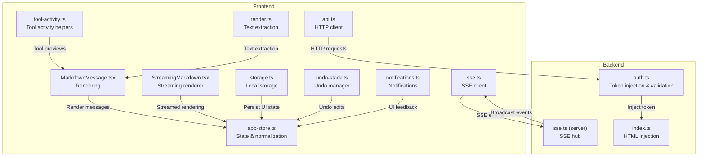

**Diagram sources**
- [api.ts:1-59](file://src/client/src/lib/api.ts#L1-L59)
- [sse.ts:1-31](file://src/server/sse.ts#L1-L31)
- [auth.ts:1-55](file://src/server/auth.ts#L1-L55)
- [index.ts:376-399](file://src/server/index.ts#L376-L399)
- [MarkdownMessage.tsx:1-120](file://src/client/src/components/markdown/MarkdownMessage.tsx#L1-L120)
- [StreamingMarkdown.tsx:1-60](file://src/client/src/components/markdown/StreamingMarkdown.tsx#L1-L60)
- [app-store.ts:1-120](file://src/client/src/state/app-store.ts#L1-L120)
- [storage.ts:1-49](file://src/client/src/lib/storage.ts#L1-L49)
- [undo-stack.ts:1-100](file://src/client/src/lib/undo-stack.ts#L1-L100)
- [render.ts:1-55](file://src/client/src/lib/render.ts#L1-L55)
- [tool-activity.ts:1-120](file://src/client/src/lib/tool-activity.ts#L1-L120)
- [notifications.ts:1-44](file://src/client/src/lib/notifications.ts#L1-L44)

**Section sources**
- [api.ts:1-59](file://src/client/src/lib/api.ts#L1-L59)
- [sse.ts:1-31](file://src/server/sse.ts#L1-L31)
- [auth.ts:1-55](file://src/server/auth.ts#L1-L55)
- [index.ts:376-399](file://src/server/index.ts#L376-L399)
- [MarkdownMessage.tsx:1-120](file://src/client/src/components/markdown/MarkdownMessage.tsx#L1-L120)
- [StreamingMarkdown.tsx:1-60](file://src/client/src/components/markdown/StreamingMarkdown.tsx#L1-L60)
- [app-store.ts:1-120](file://src/client/src/state/app-store.ts#L1-L120)
- [storage.ts:1-49](file://src/client/src/lib/storage.ts#L1-L49)
- [undo-stack.ts:1-100](file://src/client/src/lib/undo-stack.ts#L1-L100)
- [render.ts:1-55](file://src/client/src/lib/render.ts#L1-L55)
- [tool-activity.ts:1-120](file://src/client/src/lib/tool-activity.ts#L1-L120)
- [notifications.ts:1-44](file://src/client/src/lib/notifications.ts#L1-L44)

## Core Components
- HTTP client: Provides typed GET/POST/PATCH/DELETE wrappers with token injection and standardized error handling.
- SSE client: Connects to the server's SSE endpoint and normalizes incoming events into application state.
- Authentication: Injects a client-side token into the page and validates requests via header or query parameter.
- Rendering: Converts structured messages into markdown with streaming support and tool activity summaries.
- State management: Normalizes messages, deduplicates, prunes, and tracks streaming state.
- Persistence: Local storage utilities and undo stack for offline-friendly editing and navigation.
- Notifications: Configurable notification preferences and permission handling.

**Section sources**
- [api.ts:1-59](file://src/client/src/lib/api.ts#L1-L59)
- [sse.ts:1-31](file://src/server/sse.ts#L1-L31)
- [auth.ts:1-55](file://src/server/auth.ts#L1-L55)
- [MarkdownMessage.tsx:1-120](file://src/client/src/components/markdown/MarkdownMessage.tsx#L1-L120)
- [StreamingMarkdown.tsx:1-60](file://src/client/src/components/markdown/StreamingMarkdown.tsx#L1-L60)
- [app-store.ts:1-120](file://src/client/src/state/app-store.ts#L1-L120)
- [storage.ts:1-49](file://src/client/src/lib/storage.ts#L1-L49)
- [undo-stack.ts:1-100](file://src/client/src/lib/undo-stack.ts#L1-L100)
- [render.ts:1-55](file://src/client/src/lib/render.ts#L1-L55)
- [tool-activity.ts:1-120](file://src/client/src/lib/tool-activity.ts#L1-L120)
- [notifications.ts:1-44](file://src/client/src/lib/notifications.ts#L1-L44)

## Architecture Overview
The frontend integrates with the backend using:
- HTTP endpoints for configuration, sessions, and runtime state.
- SSE for real-time agent events and command responses.
- Token-based authentication injected into the client via the served HTML.

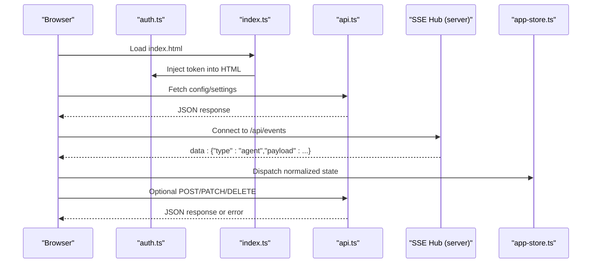

**Diagram sources**
- [auth.ts:31-35](file://src/server/auth.ts#L31-L35)
- [index.ts:392-396](file://src/server/index.ts#L392-L396)
- [api.ts:9-25](file://src/client/src/lib/api.ts#L9-L25)
- [sse.ts:21-26](file://src/server/sse.ts#L21-L26)
- [app-store.ts:186-202](file://src/client/src/state/app-store.ts#L186-L202)

## Detailed Component Analysis

### HTTP Client Implementation (api.ts)
- Authentication: Uses a global token injected by the backend to set an X-Quake-Web-Token header on requests.
- Request methods: Generic GET/POST/PATCH/DELETE with JSON serialization/deserialization.
- Error handling: Parses JSON bodies and throws a standardized error derived from status and body.
- SSE URL construction: Builds the events endpoint with optional token query parameter.

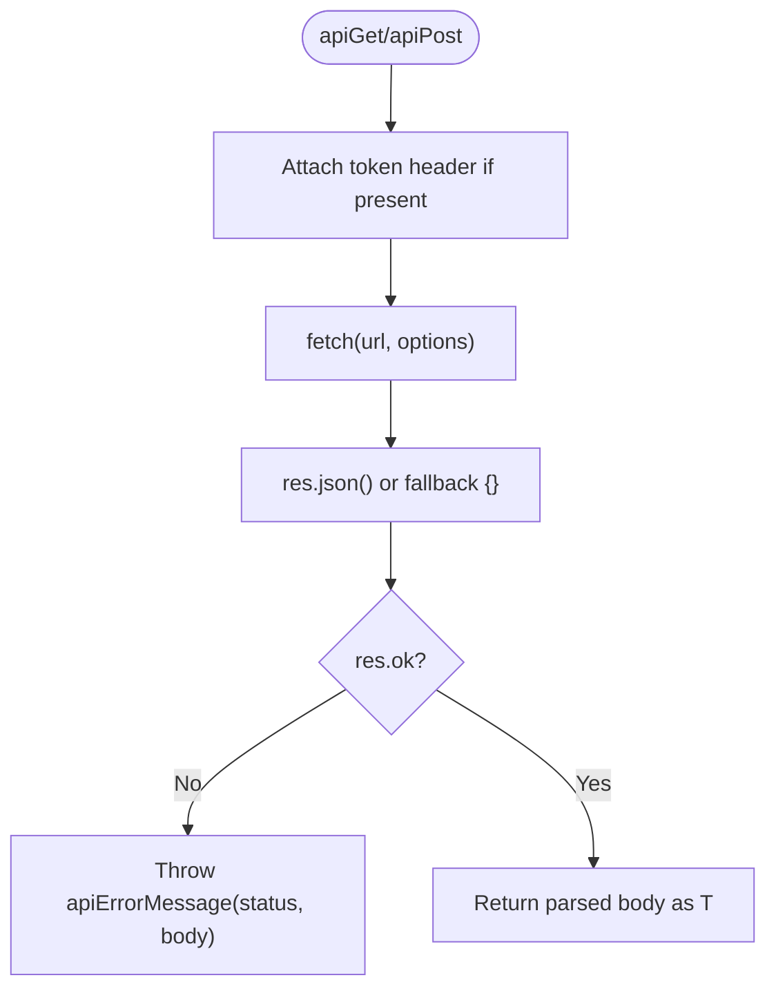

**Diagram sources**
- [api.ts:9-25](file://src/client/src/lib/api.ts#L9-L25)
- [api.ts:52-58](file://src/client/src/lib/api.ts#L52-L58)

**Section sources**
- [api.ts:1-59](file://src/client/src/lib/api.ts#L1-L59)

### SSE Event Handling
- Client connection: Establishes a persistent connection to the server's SSE endpoint.
- Event broadcasting: Sends JSON payloads to all connected clients.
- Frontend consumption: The client connects to the SSE endpoint and dispatches normalized state updates to the store.

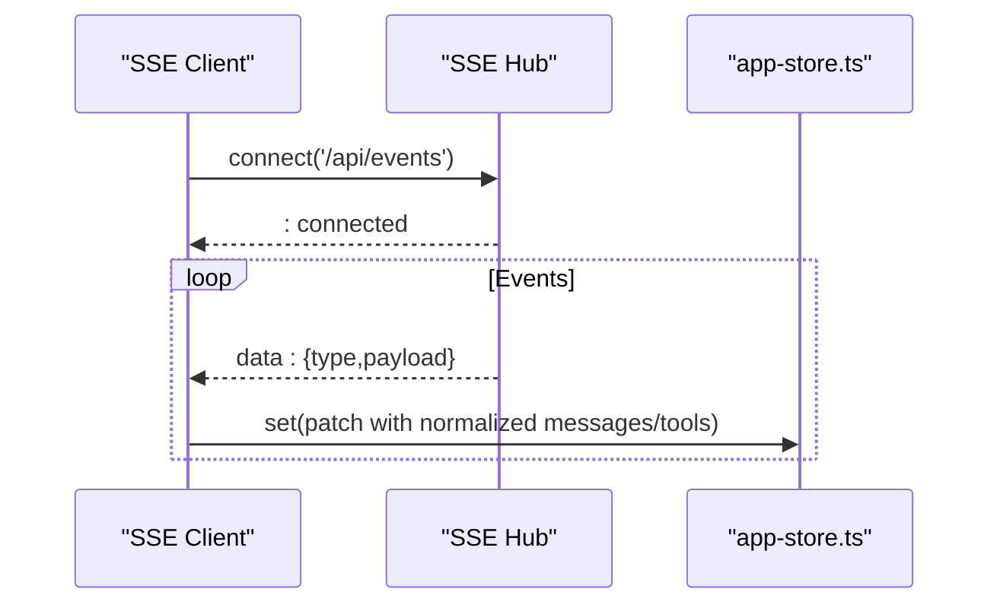

**Diagram sources**
- [sse.ts:6-31](file://src/server/sse.ts#L6-L31)
- [api.ts:48-50](file://src/client/src/lib/api.ts#L48-L50)
- [app-store.ts:186-202](file://src/client/src/state/app-store.ts#L186-L202)

**Section sources**
- [sse.ts:1-31](file://src/server/sse.ts#L1-L31)
- [api.ts:48-50](file://src/client/src/lib/api.ts#L48-L50)
- [app-store.ts:186-202](file://src/client/src/state/app-store.ts#L186-L202)

### Authentication Patterns
- Token injection: The backend injects a script into index.html that exposes a token variable for the frontend.
- Validation: Requests are authorized if either the X-Quake-Web-Token header or token query parameter matches the configured token.
- Reject behavior: Unauthorized requests receive a 401 with a JSON error payload.

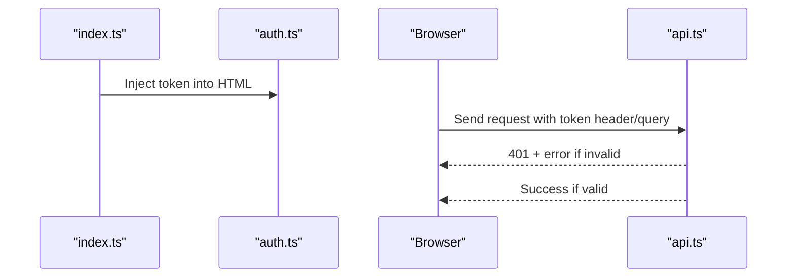

**Diagram sources**
- [auth.ts:31-35](file://src/server/auth.ts#L31-L35)
- [index.ts:392-396](file://src/server/index.ts#L392-L396)
- [auth.ts:15-20](file://src/server/auth.ts#L15-L20)
- [api.ts:9-11](file://src/client/src/lib/api.ts#L9-L11)

**Section sources**
- [auth.ts:1-55](file://src/server/auth.ts#L1-L55)
- [index.ts:376-399](file://src/server/index.ts#L376-L399)
- [api.ts:1-11](file://src/client/src/lib/api.ts#L1-L11)

### Event Normalization and Message Queuing
- Message deduplication: Maintains a rolling window and deduplicates messages based on identity keys.
- Visibility counting: Excludes toolResult messages from visibility counts.
- Tool pruning: Limits total tools and keeps recent active and settled tools.
- Streaming state: Tracks the current streaming message and turn ID for UI behavior.

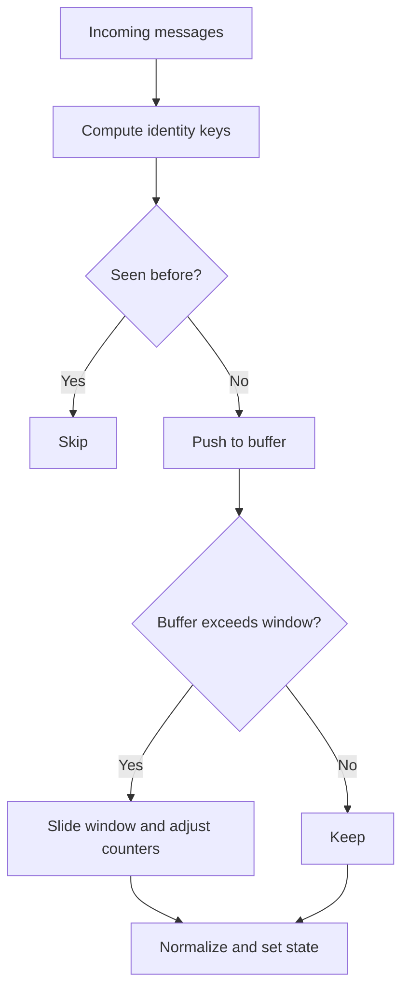

**Diagram sources**
- [app-store.ts:102-127](file://src/client/src/state/app-store.ts#L102-L127)
- [app-store.ts:137-170](file://src/client/src/state/app-store.ts#L137-L170)

**Section sources**
- [app-store.ts:68-127](file://src/client/src/state/app-store.ts#L68-L127)
- [app-store.ts:137-170](file://src/client/src/state/app-store.ts#L137-L170)

### Streaming Response Handling and Rendering
- StreamingMarkdown: Lightweight renderer optimized for incremental updates, using per-word React nodes with fade animations and memoized paragraph rendering.
- MarkdownMessage: Full-featured renderer with code highlighting, tool notices, tables, and inline markdown, integrating with tool activity helpers.

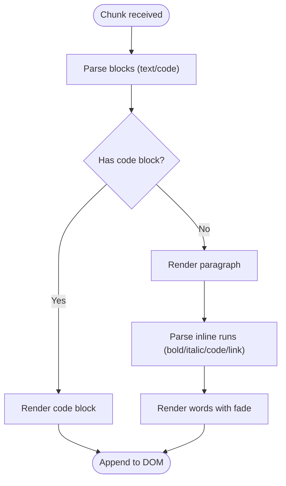

**Diagram sources**
- [StreamingMarkdown.tsx:26-50](file://src/client/src/components/markdown/StreamingMarkdown.tsx#L26-L50)
- [StreamingMarkdown.tsx:75-90](file://src/client/src/components/markdown/StreamingMarkdown.tsx#L75-L90)
- [StreamingMarkdown.tsx:105-125](file://src/client/src/components/markdown/StreamingMarkdown.tsx#L105-L125)
- [MarkdownMessage.tsx:75-87](file://src/client/src/components/markdown/MarkdownMessage.tsx#L75-L87)
- [MarkdownMessage.tsx:212-265](file://src/client/src/components/markdown/MarkdownMessage.tsx#L212-L265)

**Section sources**
- [StreamingMarkdown.tsx:1-211](file://src/client/src/components/markdown/StreamingMarkdown.tsx#L1-L211)
- [MarkdownMessage.tsx:1-120](file://src/client/src/components/markdown/MarkdownMessage.tsx#L1-L120)

### Rendering Helpers: Markdown, Images, Tool Activity
- Text extraction: Converts structured messages to plain text, handling thinking traces and tool calls.
- Tool activity: Computes display names, arguments summaries, execution previews, and line statistics for live tool runs.
- Image handling: Renders base64-encoded images from tool outputs.

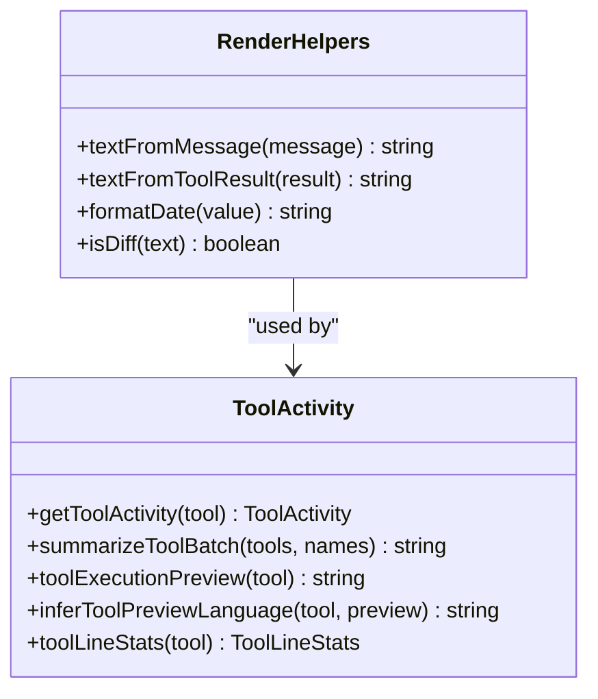

**Diagram sources**
- [render.ts:1-55](file://src/client/src/lib/render.ts#L1-L55)
- [tool-activity.ts:59-83](file://src/client/src/lib/tool-activity.ts#L59-L83)
- [tool-activity.ts:128-144](file://src/client/src/lib/tool-activity.ts#L128-L144)
- [tool-activity.ts:269-319](file://src/client/src/lib/tool-activity.ts#L269-L319)
- [tool-activity.ts:321-352](file://src/client/src/lib/tool-activity.ts#L321-L352)
- [tool-activity.ts:179-209](file://src/client/src/lib/tool-activity.ts#L179-L209)

**Section sources**
- [render.ts:1-55](file://src/client/src/lib/render.ts#L1-L55)
- [tool-activity.ts:1-120](file://src/client/src/lib/tool-activity.ts#L1-L120)
- [tool-activity.ts:128-209](file://src/client/src/lib/tool-activity.ts#L128-L209)
- [tool-activity.ts:269-352](file://src/client/src/lib/tool-activity.ts#L269-L352)

### Storage Abstraction Layer and Undo Stack
- Storage utilities: Safe wrappers around localStorage with JSON parsing and removal on errors.
- Undo stack: Generic stack with push/undo/redo and a file-specific manager for edits.

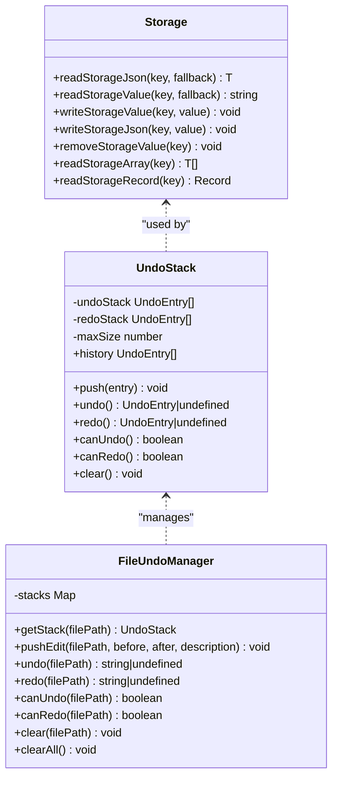

**Diagram sources**
- [storage.ts:1-49](file://src/client/src/lib/storage.ts#L1-L49)
- [undo-stack.ts:9-58](file://src/client/src/lib/undo-stack.ts#L9-L58)
- [undo-stack.ts:60-99](file://src/client/src/lib/undo-stack.ts#L60-L99)

**Section sources**
- [storage.ts:1-49](file://src/client/src/lib/storage.ts#L1-L49)
- [undo-stack.ts:1-100](file://src/client/src/lib/undo-stack.ts#L1-L100)

### Offline State Management and Notifications
- Offline persistence: Local storage utilities enable resilient UI state across reloads.
- Notifications: Configurable notification preferences and permission handling for task, operation, and error alerts.

**Section sources**
- [storage.ts:1-49](file://src/client/src/lib/storage.ts#L1-L49)
- [notifications.ts:1-44](file://src/client/src/lib/notifications.ts#L1-L44)

### Authentication and Request Batching Strategies
- Authentication: Token injection into HTML and validation via header or query parameter ensures secure access.
- Request batching: Parallel fetching of configuration and settings reduces round trips during initialization.

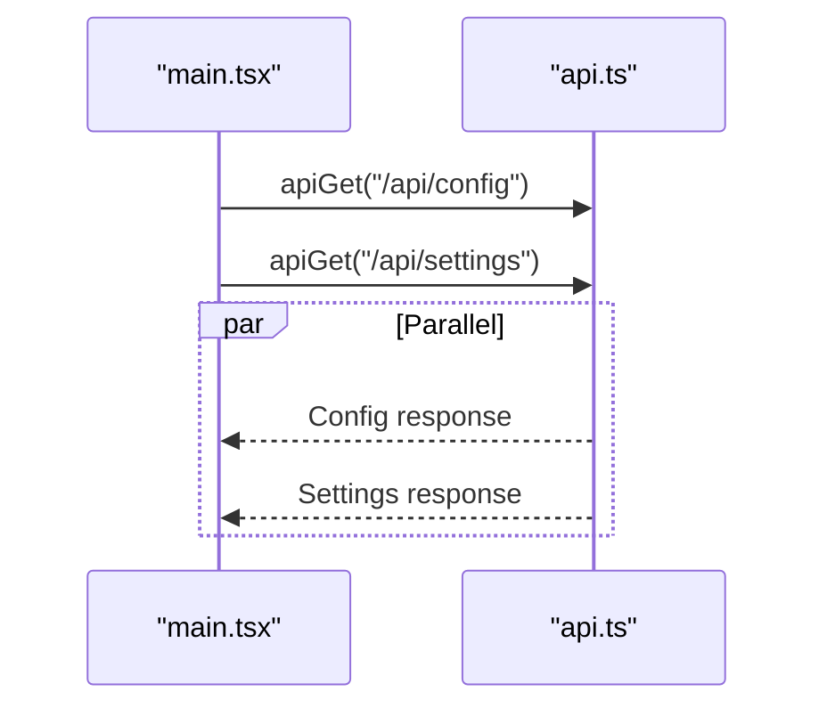

**Diagram sources**
- [main.tsx:797-800](file://src/client/src/main.tsx#L797-L800)
- [api.ts:9-14](file://src/client/src/lib/api.ts#L9-L14)

**Section sources**
- [auth.ts:15-20](file://src/server/auth.ts#L15-L20)
- [main.tsx:793-824](file://src/client/src/main.tsx#L793-L824)

## Dependency Analysis
- Frontend depends on backend for token injection and SSE broadcasting.
- Rendering components depend on tool activity helpers and state normalization.
- Storage and undo stack provide offline resilience and navigation aids.

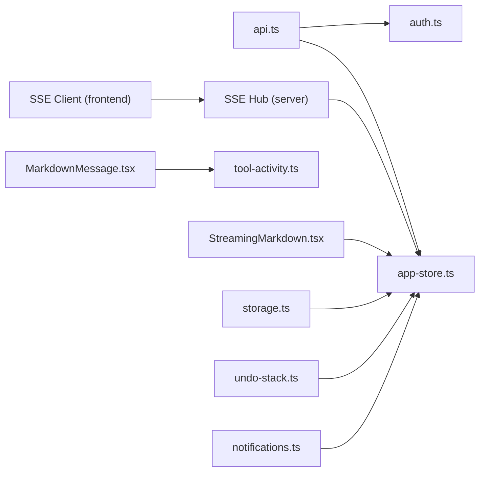

**Diagram sources**
- [api.ts:1-59](file://src/client/src/lib/api.ts#L1-L59)
- [auth.ts:1-55](file://src/server/auth.ts#L1-L55)
- [app-store.ts:1-120](file://src/client/src/state/app-store.ts#L1-L120)
- [sse.ts:1-31](file://src/server/sse.ts#L1-L31)
- [MarkdownMessage.tsx:1-120](file://src/client/src/components/markdown/MarkdownMessage.tsx#L1-L120)
- [StreamingMarkdown.tsx:1-60](file://src/client/src/components/markdown/StreamingMarkdown.tsx#L1-L60)
- [storage.ts:1-49](file://src/client/src/lib/storage.ts#L1-L49)
- [undo-stack.ts:1-100](file://src/client/src/lib/undo-stack.ts#L1-L100)
- [notifications.ts:1-44](file://src/client/src/lib/notifications.ts#L1-L44)

**Section sources**
- [api.ts:1-59](file://src/client/src/lib/api.ts#L1-L59)
- [auth.ts:1-55](file://src/server/auth.ts#L1-L55)
- [app-store.ts:1-120](file://src/client/src/state/app-store.ts#L1-L120)
- [sse.ts:1-31](file://src/server/sse.ts#L1-L31)
- [MarkdownMessage.tsx:1-120](file://src/client/src/components/markdown/MarkdownMessage.tsx#L1-L120)
- [StreamingMarkdown.tsx:1-60](file://src/client/src/components/markdown/StreamingMarkdown.tsx#L1-L60)
- [storage.ts:1-49](file://src/client/src/lib/storage.ts#L1-L49)
- [undo-stack.ts:1-100](file://src/client/src/lib/undo-stack.ts#L1-L100)
- [notifications.ts:1-44](file://src/client/src/lib/notifications.ts#L1-L44)

## Performance Considerations
- Streaming rendering: Lightweight incremental renderer avoids heavy re-renders by memoizing paragraphs and animating only newly appended words.
- Message normalization: Deduplication and sliding windows prevent memory growth and maintain responsiveness.
- Tool pruning: Limits the number of tracked tools and prioritizes active ones to reduce UI overhead.
- Request batching: Parallel fetching of configuration and settings minimizes startup latency.
- SSE efficiency: Server maintains a set of connected clients and writes events efficiently.

[No sources needed since this section provides general guidance]

## Troubleshooting Guide
- Unauthorized requests: Verify the token is present in the header or query parameter and matches the backend token.
- SSE connection issues: Ensure the client connects to the correct endpoint and that the server is broadcasting events.
- Storage failures: Wrap storage operations in try/catch; the utilities handle exceptions gracefully.
- Tool previews: Confirm tool arguments and outputs are structured correctly for preview generation.

**Section sources**
- [auth.ts:15-20](file://src/server/auth.ts#L15-L20)
- [api.ts:52-58](file://src/client/src/lib/api.ts#L52-L58)
- [storage.ts:1-49](file://src/client/src/lib/storage.ts#L1-L49)
- [tool-activity.ts:269-319](file://src/client/src/lib/tool-activity.ts#L269-L319)

## Conclusion
The frontend API integration combines a robust HTTP client with SSE for real-time updates, backed by strong authentication and efficient rendering. State normalization, tool activity helpers, and storage abstractions provide a responsive and resilient user experience. Request batching and streaming optimizations ensure smooth interactions during long-running operations.
