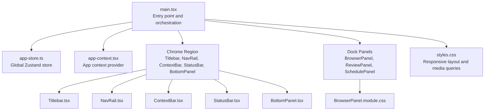
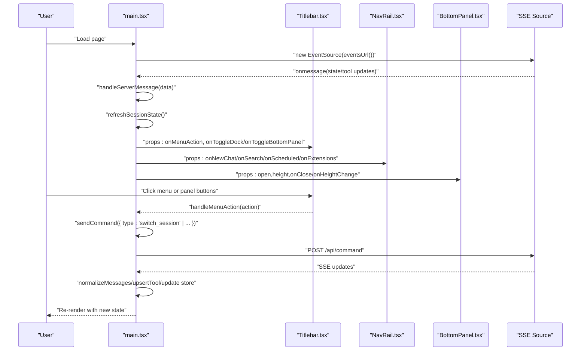
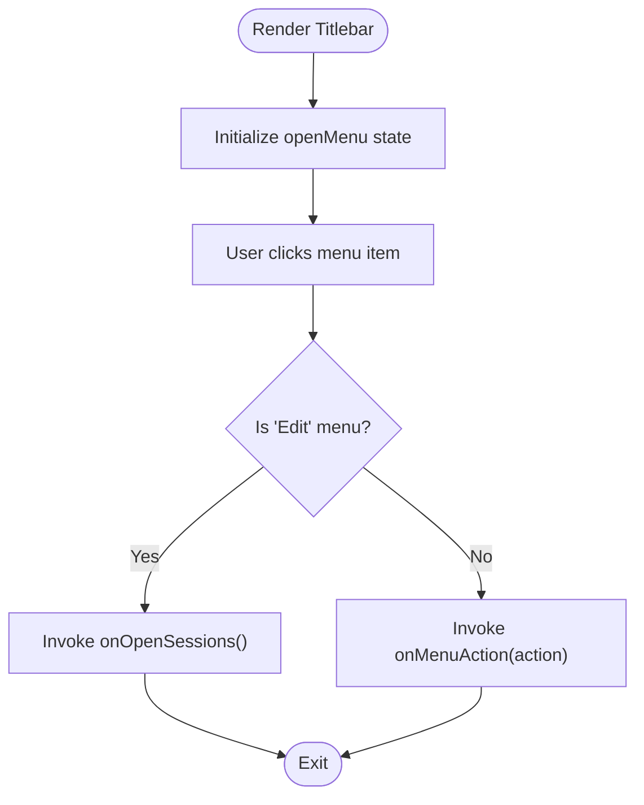
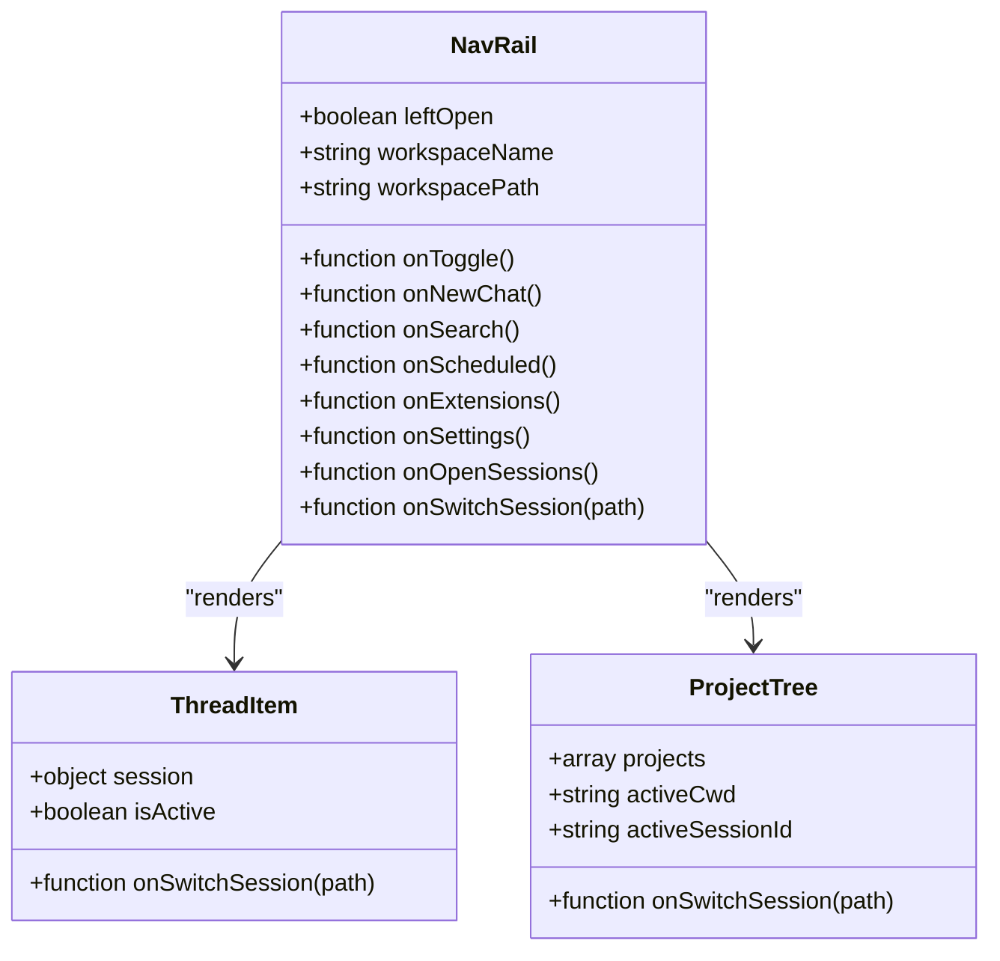
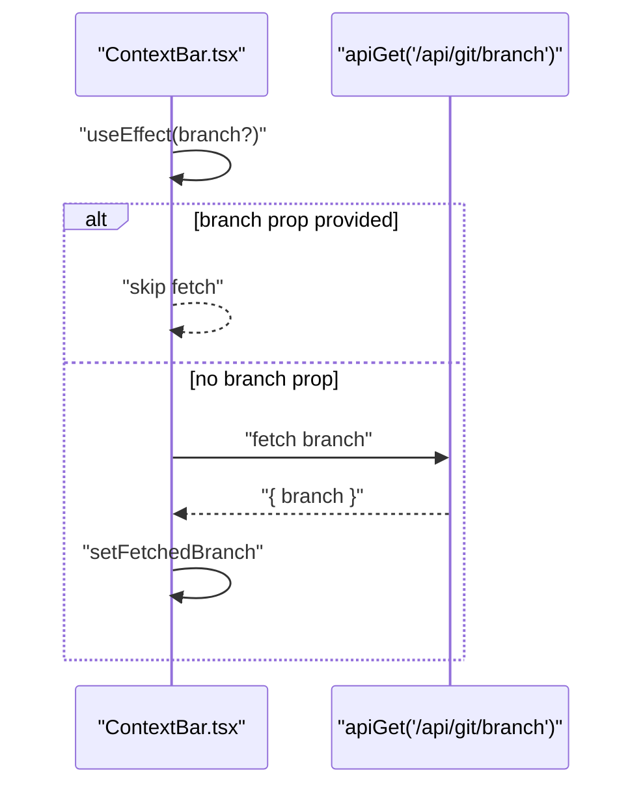
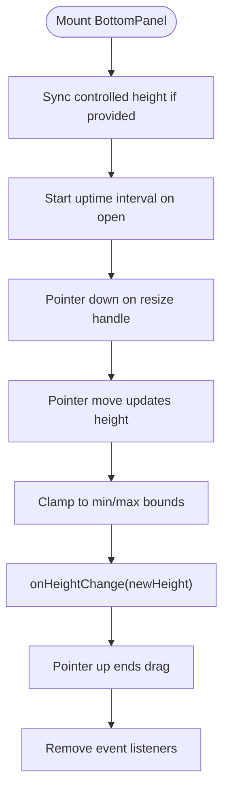
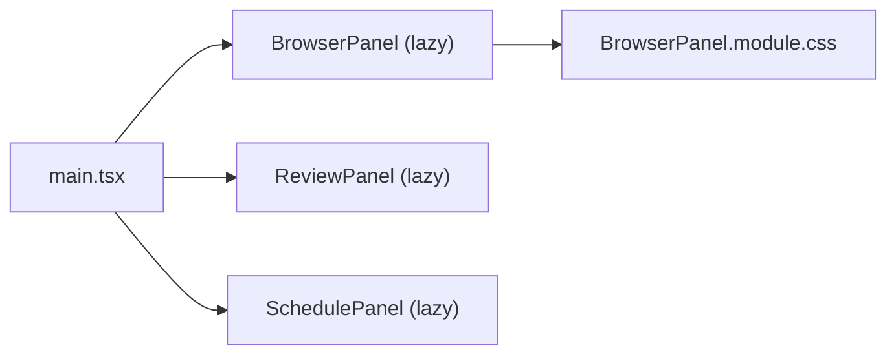
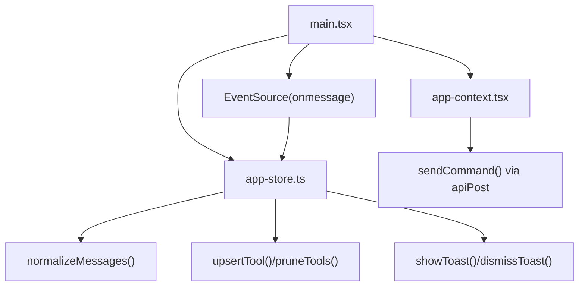

# Component Architecture

<cite>
**Referenced Files in This Document**
- [main.tsx](file://src/client/src/main.tsx)
- [app-store.ts](file://src/client/src/state/app-store.ts)
- [app-context.tsx](file://src/client/src/state/app-context.tsx)
- [Titlebar.tsx](file://src/client/src/components/chrome/Titlebar.tsx)
- [BottomPanel.tsx](file://src/client/src/components/chrome/BottomPanel.tsx)
- [NavRail.tsx](file://src/client/src/components/chrome/NavRail.tsx)
- [ContextBar.tsx](file://src/client/src/components/chrome/ContextBar.tsx)
- [StatusBar.tsx](file://src/client/src/components/chrome/StatusBar.tsx)
- [BrowserPanel.module.css](file://src/client/src/components/dock/BrowserPanel.module.css)
- [styles.css](file://src/client/src/styles.css)
</cite>

## Table of Contents
1. [Introduction](#introduction)
2. [Project Structure](#project-structure)
3. [Core Components](#core-components)
4. [Architecture Overview](#architecture-overview)
5. [Detailed Component Analysis](#detailed-component-analysis)
6. [Dependency Analysis](#dependency-analysis)
7. [Performance Considerations](#performance-considerations)
8. [Troubleshooting Guide](#troubleshooting-guide)
9. [Conclusion](#conclusion)

## Introduction
This document explains the React component architecture for the Chrome components (Titlebar, BottomPanel, NavRail, ContextBar, StatusBar) and the Dock panels system. It traces the component hierarchy from the application entry point, describes composition patterns, state management via Zustand, communication with the AgentSession runtime through Server-Sent Events (SSE), and covers drag-and-drop resizing, responsive design, and lazy loading for heavy components.

## Project Structure
The application entry point orchestrates global state, UI layout, and runtime integration. The Chrome region hosts the top-level navigation and status controls, while the Dock area hosts right-side panels. Panels are lazily loaded to optimize initial load performance.

**Diagram sources**
- [main.tsx:145-324](file://src/client/src/main.tsx#L145-L324)
- [app-store.ts:186-252](file://src/client/src/state/app-store.ts#L186-L252)
- [app-context.tsx:33-57](file://src/client/src/state/app-context.tsx#L33-L57)
- [Titlebar.tsx:32-77](file://src/client/src/components/chrome/Titlebar.tsx#L32-L77)
- [NavRail.tsx:37-83](file://src/client/src/components/chrome/NavRail.tsx#L37-L83)
- [ContextBar.tsx:14-43](file://src/client/src/components/chrome/ContextBar.tsx#L14-L43)
- [StatusBar.tsx:9-19](file://src/client/src/components/chrome/StatusBar.tsx#L9-L19)
- [BottomPanel.tsx:27-90](file://src/client/src/components/chrome/BottomPanel.tsx#L27-L90)
- [BrowserPanel.module.css:1-60](file://src/client/src/components/dock/BrowserPanel.module.css#L1-L60)
- [styles.css:2379-2420](file://src/client/src/styles.css#L2379-L2420)

**Section sources**
- [main.tsx:145-324](file://src/client/src/main.tsx#L145-L324)
- [styles.css:2379-2420](file://src/client/src/styles.css#L2379-L2420)

## Core Components
- Titlebar: Top-level frameless control bar with menu actions and panel toggles.
- NavRail: Left navigation rail with quick actions, pinned threads, and project/session trees.
- ContextBar: Composer context strip showing workspace, local working context, and optional branch.
- StatusBar: Persistent footer with workspace, model, and thinking level.
- BottomPanel: Draggable resizable terminal panel anchored at the bottom.
- Dock Panels: Right-side panels (BrowserPanel, ReviewPanel, SchedulePanel) lazily loaded.

These components share a cohesive layout and communicate through:
- Global Zustand store for state normalization and updates.
- App context provider for command dispatch and shared metadata.
- SSE-driven runtime updates for session state and tool activity.

**Section sources**
- [Titlebar.tsx:12-23](file://src/client/src/components/chrome/Titlebar.tsx#L12-L23)
- [NavRail.tsx:31-36](file://src/client/src/components/chrome/NavRail.tsx#L31-L36)
- [ContextBar.tsx:7-13](file://src/client/src/components/chrome/ContextBar.tsx#L7-L13)
- [StatusBar.tsx:5-8](file://src/client/src/components/chrome/StatusBar.tsx#L5-L8)
- [BottomPanel.tsx:5-25](file://src/client/src/components/chrome/BottomPanel.tsx#L5-L25)
- [main.tsx:58-79](file://src/client/src/main.tsx#L58-L79)

## Architecture Overview
The application initializes global state, sets up SSE event listeners, and composes the Chrome and Dock regions. The layout is driven by CSS Grid and media queries, with draggable resizers for the right and bottom panels.

**Diagram sources**
- [main.tsx:573-588](file://src/client/src/main.tsx#L573-L588)
- [main.tsx:678-694](file://src/client/src/main.tsx#L678-L694)
- [main.tsx:727-736](file://src/client/src/main.tsx#L727-L736)
- [Titlebar.tsx:74-77](file://src/client/src/components/chrome/Titlebar.tsx#L74-L77)
- [NavRail.tsx:94-98](file://src/client/src/components/chrome/NavRail.tsx#L94-L98)
- [BottomPanel.tsx:27-90](file://src/client/src/components/chrome/BottomPanel.tsx#L27-L90)

## Detailed Component Analysis

### Titlebar Component
- Purpose: Top-level control bar with OS-friendly draggable region and panel toggles.
- Props: Sidebar toggle, dock toggle, bottom panel toggle, menu actions.
- Behavior: Menu dropdowns with keyboard and click-outside dismissal; macOS-specific padding; integrates with desktop overlay.

**Diagram sources**
- [Titlebar.tsx:56-77](file://src/client/src/components/chrome/Titlebar.tsx#L56-L77)
- [Titlebar.tsx:110-117](file://src/client/src/components/chrome/Titlebar.tsx#L110-L117)

**Section sources**
- [Titlebar.tsx:32-77](file://src/client/src/components/chrome/Titlebar.tsx#L32-L77)

### NavRail Component
- Purpose: Left navigation with quick actions, pinned threads, and project/session trees.
- Features: Collapsible layout, expandable project groups, pin/archive actions, relative timestamps.
- Composition: Uses helper components for thread items and project trees.

**Diagram sources**
- [NavRail.tsx:37-83](file://src/client/src/components/chrome/NavRail.tsx#L37-L83)
- [NavRail.tsx:165-185](file://src/client/src/components/chrome/NavRail.tsx#L165-L185)
- [NavRail.tsx:267-287](file://src/client/src/components/chrome/NavRail.tsx#L267-L287)

**Section sources**
- [NavRail.tsx:37-154](file://src/client/src/components/chrome/NavRail.tsx#L37-L154)

### ContextBar Component
- Purpose: Composer context strip showing workspace, local working context, and optional branch.
- Behavior: Fetches branch info via API when not provided; hides branch element if empty.

**Diagram sources**
- [ContextBar.tsx:27-41](file://src/client/src/components/chrome/ContextBar.tsx#L27-L41)

**Section sources**
- [ContextBar.tsx:14-43](file://src/client/src/components/chrome/ContextBar.tsx#L14-L43)

### StatusBar Component
- Purpose: Persistent footer with workspace, model, and thinking level indicators.

**Section sources**
- [StatusBar.tsx:9-19](file://src/client/src/components/chrome/StatusBar.tsx#L9-L19)

### BottomPanel Component
- Purpose: Draggable bottom panel (primarily terminal) with resize handle and process indicator.
- Behavior: Pointer-based resizing with clamping; controlled height synchronization; uptime counter.

**Diagram sources**
- [BottomPanel.tsx:33-35](file://src/client/src/components/chrome/BottomPanel.tsx#L33-L35)
- [BottomPanel.tsx:43-49](file://src/client/src/components/chrome/BottomPanel.tsx#L43-L49)
- [BottomPanel.tsx:71-81](file://src/client/src/components/chrome/BottomPanel.tsx#L71-L81)
- [BottomPanel.tsx:51-61](file://src/client/src/components/chrome/BottomPanel.tsx#L51-L61)

**Section sources**
- [BottomPanel.tsx:27-90](file://src/client/src/components/chrome/BottomPanel.tsx#L27-L90)

### Dock Panels System
- BrowserPanel: Address bar toolbar with navigation and loading spinners.
- ReviewPanel and SchedulePanel: Additional dock panels (lazy-loaded).
- Layout: Right-side docking with draggable width and responsive behavior.

**Diagram sources**
- [main.tsx:73-75](file://src/client/src/main.tsx#L73-L75)
- [BrowserPanel.module.css:1-60](file://src/client/src/components/dock/BrowserPanel.module.css#L1-L60)

**Section sources**
- [main.tsx:73-75](file://src/client/src/main.tsx#L73-L75)
- [BrowserPanel.module.css:1-60](file://src/client/src/components/dock/BrowserPanel.module.css#L1-L60)

## Dependency Analysis
- State Management: Zustand store centralizes messages, tools, widgets, statuses, and toasts. Normalization ensures deduplication and bounded growth.
- Context Provider: App context exposes current model/thinking level, streaming flag, and command dispatcher.
- Runtime Integration: SSE source feeds incremental updates; focus/visibility reconciliation ensures consistency.

**Diagram sources**
- [app-store.ts:102-127](file://src/client/src/state/app-store.ts#L102-L127)
- [app-store.ts:208-218](file://src/client/src/state/app-store.ts#L208-L218)
- [app-store.ts:241-251](file://src/client/src/state/app-store.ts#L241-L251)
- [app-context.tsx:50-53](file://src/client/src/state/app-context.tsx#L50-L53)
- [main.tsx:573-588](file://src/client/src/main.tsx#L573-L588)

**Section sources**
- [app-store.ts:186-252](file://src/client/src/state/app-store.ts#L186-L252)
- [app-context.tsx:33-57](file://src/client/src/state/app-context.tsx#L33-L57)
- [main.tsx:573-588](file://src/client/src/main.tsx#L573-L588)

## Performance Considerations
- Lazy Loading: Heavy components (Editor, DiffEditor, TerminalPanel, XtermTerminal, SettingsPage, FilesPanel, CommandPalette, ReviewPanel, BrowserPanel, SchedulePanel, SearchOverlay, SchedulePage, ExtensionsPage, CodexCommandPalette) are dynamically imported to reduce initial bundle size.
- Resizable Panels: Controlled height and clamped resizing minimize layout thrashing; debounced persistence of sizes.
- SSE Reconciliation: Focus and visibility handlers periodically reconcile state to avoid stale UI during long-running sessions.
- CSS Grid and Media Queries: Responsive breakpoints collapse the right panel into a mobile-friendly overlay and hide the sidebar when collapsed.

**Section sources**
- [main.tsx:58-79](file://src/client/src/main.tsx#L58-L79)
- [main.tsx:738-780](file://src/client/src/main.tsx#L738-L780)
- [styles.css:2379-2420](file://src/client/src/styles.css#L2379-L2420)

## Troubleshooting Guide
- SSE Connection Issues: The application logs warnings and falls back to periodic refreshes. If the connection drops, state reconciliation is triggered on focus/visibility changes and at intervals.
- Stuck Streaming State: Local streaming state is cleared when the backend reports idle; dangling UI state is settled after periods of inactivity.
- Panel Resizing: If the right or bottom panel stops resizing, ensure mouse events are not blocked and that drag state is reset on pointer up.

**Section sources**
- [main.tsx:579-582](file://src/client/src/main.tsx#L579-L582)
- [main.tsx:590-606](file://src/client/src/main.tsx#L590-L606)
- [main.tsx:608-615](file://src/client/src/main.tsx#L608-L615)
- [main.tsx:738-780](file://src/client/src/main.tsx#L738-L780)

## Conclusion
The Chrome and Dock systems form a cohesive, responsive UI anchored by a centralized Zustand store and driven by SSE updates. Components are composed with minimal prop drilling through context and store selectors, while heavy features are lazy-loaded to maintain performance. Drag-and-drop resizing and media queries deliver a polished desktop-like experience across devices.
