# Frontend Architecture

<cite>
**Referenced Files in This Document**
- [main.tsx](file://src/client/src/main.tsx)
- [app-store.ts](file://src/client/src/state/app-store.ts)
- [api.ts](file://src/client/src/lib/api.ts)
- [app-context.tsx](file://src/client/src/state/app-context.tsx)
- [Titlebar.tsx](file://src/client/src/components/chrome/Titlebar.tsx)
- [BottomPanel.tsx](file://src/client/src/components/chrome/BottomPanel.tsx)
- [NavRail.tsx](file://src/client/src/components/chrome/NavRail.tsx)
- [BrowserPanel.tsx](file://src/client/src/components/dock/BrowserPanel.tsx)
- [ReviewPanel.tsx](file://src/client/src/components/dock/ReviewPanel.tsx)
- [render.ts](file://src/client/src/lib/render.ts)
- [tool-activity.ts](file://src/client/src/lib/tool-activity.ts)
- [types.ts](file://src/client/src/types.ts)
</cite>

## Table of Contents
1. [Introduction](#introduction)
2. [Project Structure](#project-structure)
3. [Core Components](#core-components)
4. [Architecture Overview](#architecture-overview)
5. [Detailed Component Analysis](#detailed-component-analysis)
6. [Dependency Analysis](#dependency-analysis)
7. [Performance Considerations](#performance-considerations)
8. [Troubleshooting Guide](#troubleshooting-guide)
9. [Conclusion](#conclusion)

## Introduction
This document describes the frontend architecture of the React/Vite application, focusing on the component hierarchy starting from the main entry point, the Zustand state management implementation, and the API client architecture. It explains the Chrome components (Titlebar, BottomPanel, NavRail), Dock panels (BrowserPanel, ReviewPanel), and the Timeline orchestration. It also details the event normalization system, rendering helpers, and how the frontend maintains state consistency. Component composition patterns, prop drilling solutions, and the bridge between UI components and the AgentSession runtime via Server-Sent Events (SSE) are covered.

## Project Structure
The frontend is organized around a clear separation of concerns:
- Entry point and orchestration: main.tsx
- State management: Zustand stores and context providers
- UI chrome and docks: Titlebar, NavRail, BottomPanel, Dock panels
- Rendering and normalization: render helpers and tool activity utilities
- API client: typed HTTP helpers for server communication
- Types: shared TypeScript types for the UI layer

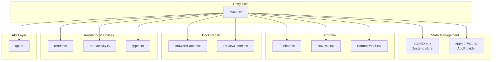

**Diagram sources**
- [main.tsx](file://src/client/src/main.tsx)
- [app-store.ts](file://src/client/src/state/app-store.ts)
- [app-context.tsx](file://src/client/src/state/app-context.tsx)
- [Titlebar.tsx](file://src/client/src/components/chrome/Titlebar.tsx)
- [NavRail.tsx](file://src/client/src/components/chrome/NavRail.tsx)
- [BottomPanel.tsx](file://src/client/src/components/chrome/BottomPanel.tsx)
- [BrowserPanel.tsx](file://src/client/src/components/dock/BrowserPanel.tsx)
- [ReviewPanel.tsx](file://src/client/src/components/dock/ReviewPanel.tsx)
- [render.ts](file://src/client/src/lib/render.ts)
- [tool-activity.ts](file://src/client/src/lib/tool-activity.ts)
- [types.ts](file://src/client/src/types.ts)
- [api.ts](file://src/client/src/lib/api.ts)

**Section sources**
- [main.tsx](file://src/client/src/main.tsx)
- [app-store.ts](file://src/client/src/state/app-store.ts)
- [api.ts](file://src/client/src/lib/api.ts)

## Core Components
- Application entry and orchestration: main.tsx orchestrates UI state, SSE event handling, and refresh cycles. It manages theme, density, layout preferences, and integrates lazy-loaded panels for performance.
- State management: app-store.ts defines the Zustand store with normalized message handling, tool state management, and toast notifications. It includes deduplication, pruning, and identity computation for messages and tools.
- API client: api.ts provides typed helpers for GET, POST, PATCH, DELETE requests and constructs SSE event URLs with optional authentication.
- App context: app-context.tsx exposes a provider that supplies configuration, current model/thinking level, and a sendCommand function to the rest of the UI.

Key responsibilities:
- Maintain UI state consistency via normalized message updates and tool state transitions.
- Bridge UI with AgentSession runtime via SSE events and command dispatch.
- Provide rendering helpers for messages and tool results.

**Section sources**
- [main.tsx](file://src/client/src/main.tsx)
- [app-store.ts](file://src/client/src/state/app-store.ts)
- [api.ts](file://src/client/src/lib/api.ts)
- [app-context.tsx](file://src/client/src/state/app-context.tsx)

## Architecture Overview
The frontend architecture follows a unidirectional data flow:
- UI components subscribe to Zustand slices via hooks.
- Commands are sent to the backend via the API client.
- SSE delivers real-time updates from the AgentSession runtime.
- The store normalizes incoming data and updates UI efficiently.

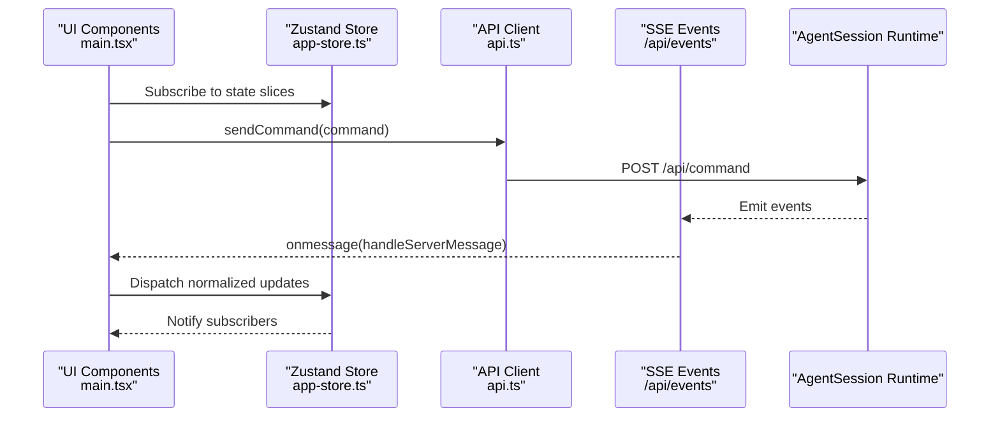

**Diagram sources**
- [main.tsx](file://src/client/src/main.tsx)
- [app-store.ts](file://src/client/src/state/app-store.ts)
- [api.ts](file://src/client/src/lib/api.ts)

## Detailed Component Analysis

### Main Application Orchestration (main.tsx)
- Initializes theme, density, and layout preferences from localStorage.
- Manages UI state: sessions, models, messages, tools, toasts, and panel visibility.
- Subscribes to SSE events and reconciles UI state on focus/visibility changes.
- Provides command dispatch via sendCommand and refreshAll helpers.
- Integrates lazy-loaded panels (Terminal, Settings, Files, Review, Browser, Schedule, etc.) for performance.

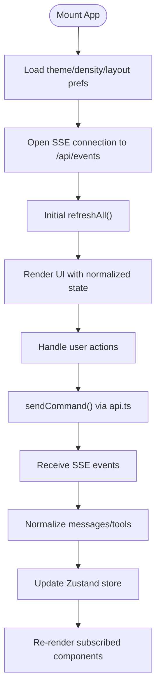

**Diagram sources**
- [main.tsx](file://src/client/src/main.tsx)
- [api.ts](file://src/client/src/lib/api.ts)
- [app-store.ts](file://src/client/src/state/app-store.ts)

**Section sources**
- [main.tsx](file://src/client/src/main.tsx)

### Zustand State Management (app-store.ts)
- Defines AppState with normalized messages, tools, widgets, sidebars, statuses, and toasts.
- Implements message normalization with deduplication and sliding windows.
- Prunes tools to limits and computes recency for eviction.
- Provides upsertTool with timestamps and output compaction.
- Exposes setters for streaming message, toasts, and widget/sidebar management.

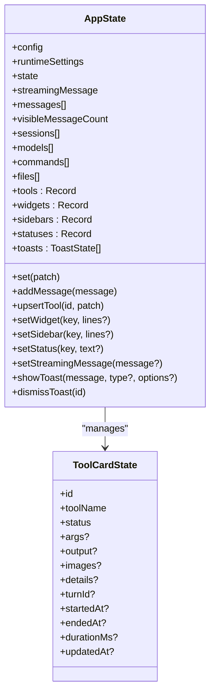

**Diagram sources**
- [app-store.ts](file://src/client/src/state/app-store.ts)

**Section sources**
- [app-store.ts](file://src/client/src/state/app-store.ts)

### API Client (api.ts)
- Provides typed helpers for HTTP operations with authentication header support.
- Constructs SSE event URL with optional token query param.
- Centralizes error handling and response parsing.

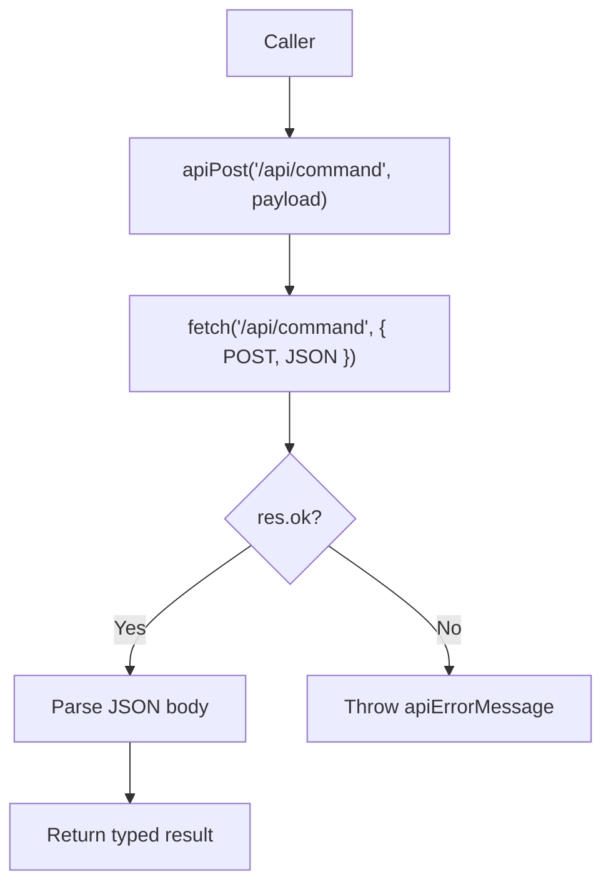

**Diagram sources**
- [api.ts](file://src/client/src/lib/api.ts)

**Section sources**
- [api.ts](file://src/client/src/lib/api.ts)

### App Context Provider (app-context.tsx)
- Wraps the app with a context providing configuration, current model/thinking level, and sendCommand.
- Delegates sendCommand to the API client dynamically to avoid import cycles.

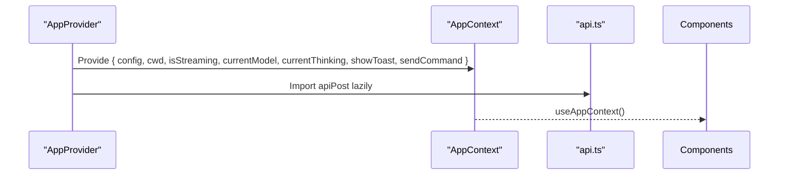

**Diagram sources**
- [app-context.tsx](file://src/client/src/state/app-context.tsx)
- [api.ts](file://src/client/src/lib/api.ts)

**Section sources**
- [app-context.tsx](file://src/client/src/state/app-context.tsx)

### Chrome Components

#### Titlebar (Titlebar.tsx)
- Codex-style 40px titlebar with left toggle, menu dropdowns, and dock/bottom panel toggles.
- Integrates with desktop overlay theming and handles menu actions.

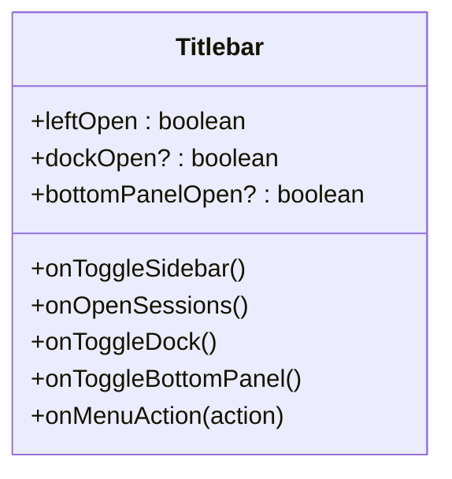

**Diagram sources**
- [Titlebar.tsx](file://src/client/src/components/chrome/Titlebar.tsx)

**Section sources**
- [Titlebar.tsx](file://src/client/src/components/chrome/Titlebar.tsx)

#### NavRail (NavRail.tsx)
- Left navigation rail with quick actions, pinned sessions, and project tree.
- Supports collapsing and switching sessions, pinning/archiving.

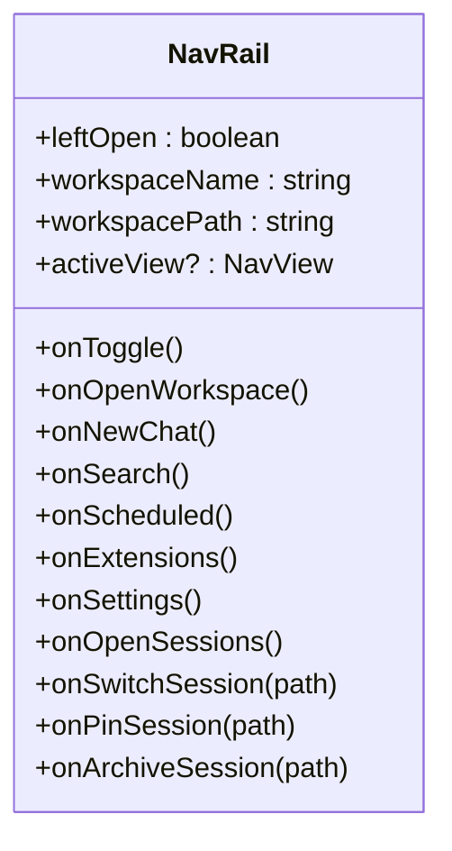

**Diagram sources**
- [NavRail.tsx](file://src/client/src/components/chrome/NavRail.tsx)

**Section sources**
- [NavRail.tsx](file://src/client/src/components/chrome/NavRail.tsx)

#### BottomPanel (BottomPanel.tsx)
- Resizable bottom panel with terminal-like controls and uptime counter.
- Handles drag-to-resize and controlled height synchronization.

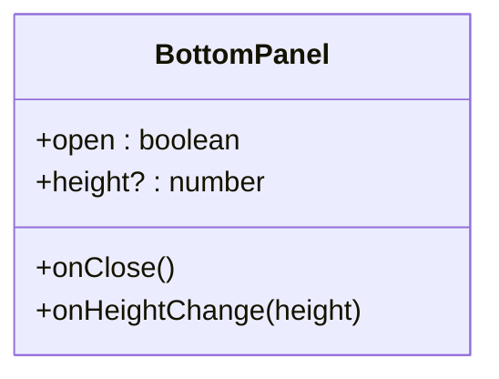

**Diagram sources**
- [BottomPanel.tsx](file://src/client/src/components/chrome/BottomPanel.tsx)

**Section sources**
- [BottomPanel.tsx](file://src/client/src/components/chrome/BottomPanel.tsx)

### Dock Panels

#### BrowserPanel (BrowserPanel.tsx)
- Embedded browser with address bar, navigation controls, and optional live screencast.
- Supports Electron webview and iframe fallbacks, input forwarding to agent.

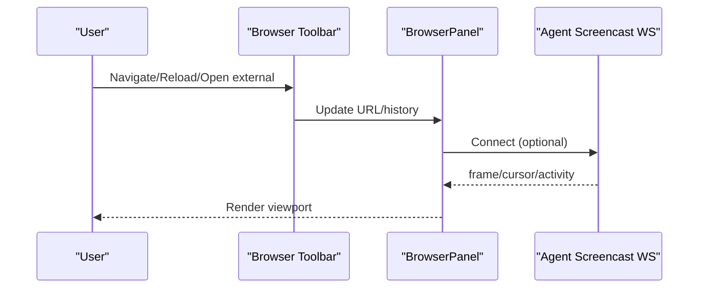

**Diagram sources**
- [BrowserPanel.tsx](file://src/client/src/components/dock/BrowserPanel.tsx)

**Section sources**
- [BrowserPanel.tsx](file://src/client/src/components/dock/BrowserPanel.tsx)

#### ReviewPanel (ReviewPanel.tsx)
- Git status and diff viewer with staging/unstaging, commit, push, and PR creation.
- Uses API endpoints for git operations and displays diffs.

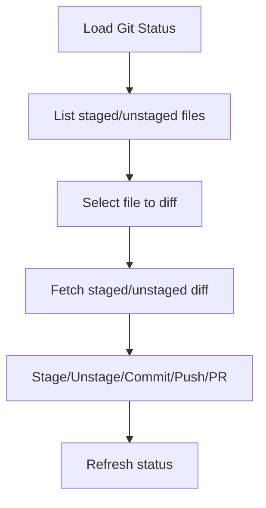

**Diagram sources**
- [ReviewPanel.tsx](file://src/client/src/components/dock/ReviewPanel.tsx)

**Section sources**
- [ReviewPanel.tsx](file://src/client/src/components/dock/ReviewPanel.tsx)

### Timeline Orchestration
The Timeline component renders the conversation and tool activity with efficient virtualization and filtering. It separates the streaming message from the main list to avoid per-frame recomputation and uses a sliding window with overscan for smooth scrolling.

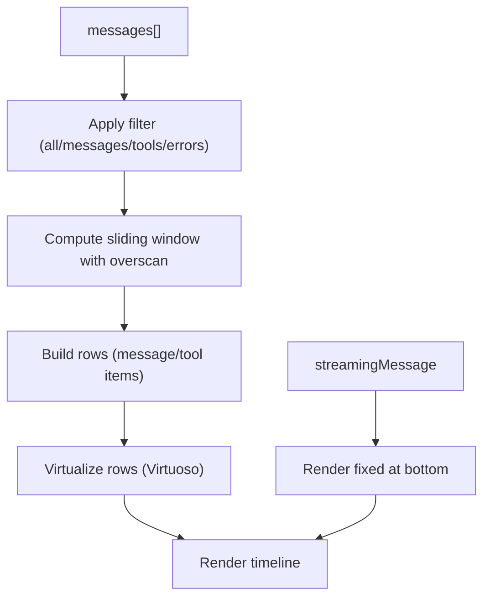

**Diagram sources**
- [main.tsx](file://src/client/src/main.tsx)
- [render.ts](file://src/client/src/lib/render.ts)
- [tool-activity.ts](file://src/client/src/lib/tool-activity.ts)

**Section sources**
- [main.tsx](file://src/client/src/main.tsx)
- [render.ts](file://src/client/src/lib/render.ts)
- [tool-activity.ts](file://src/client/src/lib/tool-activity.ts)

### Event Normalization and Rendering Helpers
- Message normalization: deduplicates by identity, maintains visible count, and slides the window.
- Tool state normalization: prunes to limits, computes recency, and compacts output.
- Rendering helpers: convert messages and tool results to text, detect diffs, and format dates.

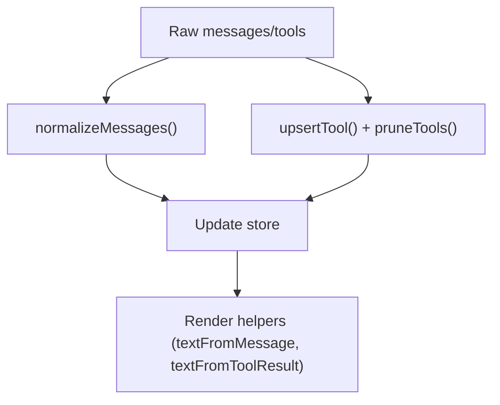

**Diagram sources**
- [app-store.ts](file://src/client/src/state/app-store.ts)
- [render.ts](file://src/client/src/lib/render.ts)

**Section sources**
- [app-store.ts](file://src/client/src/state/app-store.ts)
- [render.ts](file://src/client/src/lib/render.ts)

### Prop Drilling Solutions
- AppProvider exposes configuration and sendCommand via context, reducing prop drilling for deep components.
- Zustand selectors isolate subscriptions to minimal state slices, preventing unnecessary re-renders.

**Section sources**
- [app-context.tsx](file://src/client/src/state/app-context.tsx)
- [main.tsx](file://src/client/src/main.tsx)

### Bridge Between UI and AgentSession Runtime (SSE)
- SSE endpoint is opened on mount and refreshed on reconnect.
- onmessage handler triggers refreshSessionState and state reconciliation.
- Focus/visibility change listeners ensure UI stays in sync with runtime.

**Section sources**
- [main.tsx](file://src/client/src/main.tsx)
- [api.ts](file://src/client/src/lib/api.ts)

## Dependency Analysis
- UI depends on Zustand for state and on the API client for commands.
- AppProvider encapsulates configuration and command dispatch.
- Chrome and Dock components depend on main.tsx state and callbacks.
- Timeline depends on render helpers and tool activity utilities.

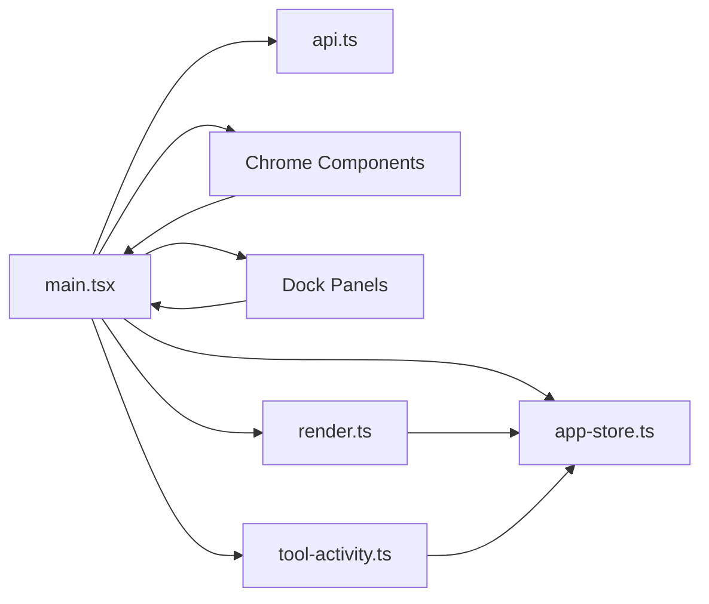

**Diagram sources**
- [main.tsx](file://src/client/src/main.tsx)
- [app-store.ts](file://src/client/src/state/app-store.ts)
- [api.ts](file://src/client/src/lib/api.ts)
- [render.ts](file://src/client/src/lib/render.ts)
- [tool-activity.ts](file://src/client/src/lib/tool-activity.ts)

**Section sources**
- [main.tsx](file://src/client/src/main.tsx)
- [app-store.ts](file://src/client/src/state/app-store.ts)
- [api.ts](file://src/client/src/lib/api.ts)
- [render.ts](file://src/client/src/lib/render.ts)
- [tool-activity.ts](file://src/client/src/lib/tool-activity.ts)

## Performance Considerations
- Lazy loading of heavy panels reduces initial bundle size.
- Virtualized timeline minimizes DOM nodes and reflows.
- Zustand selectors and shallow comparisons reduce re-renders.
- Message/tool normalization prevents memory growth and excessive recomputation.
- Streaming message rendered outside the virtualized list to avoid per-frame scans.

## Troubleshooting Guide
- SSE connectivity: If SSE closes unexpectedly, refreshSessionState is invoked to reconcile state. Check network connectivity and server availability.
- State desync: On focus/visibility changes, reconcileIfNeeded ensures UI reflects runtime state.
- Tool state cleanup: settleActiveToolsAfterIdle transitions lingering tools to done after idle detection.
- Toast notifications: showToast displays transient feedback; dismissToast removes toasts after timeouts.

**Section sources**
- [main.tsx](file://src/client/src/main.tsx)
- [app-store.ts](file://src/client/src/state/app-store.ts)

## Conclusion
The frontend architecture combines a reactive UI with a robust state management layer, efficient rendering, and a clean SSE bridge to the AgentSession runtime. The Chrome and Dock components provide a cohesive workspace, while the Timeline offers scalable conversation rendering. The design minimizes prop drilling, optimizes performance, and maintains state consistency through normalization and reconciliation strategies.
