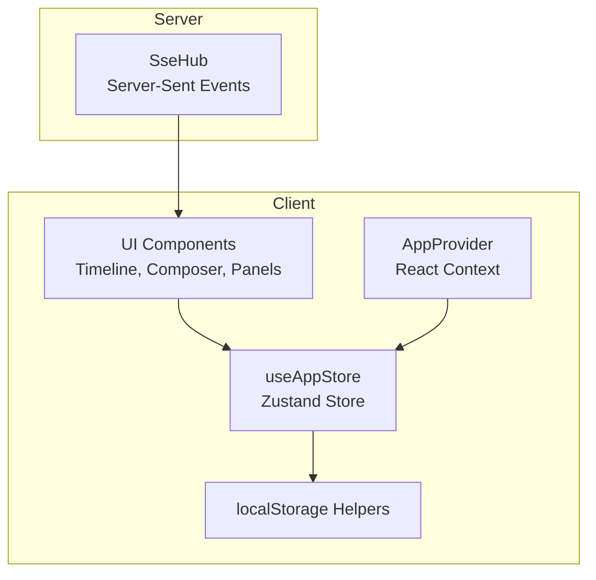
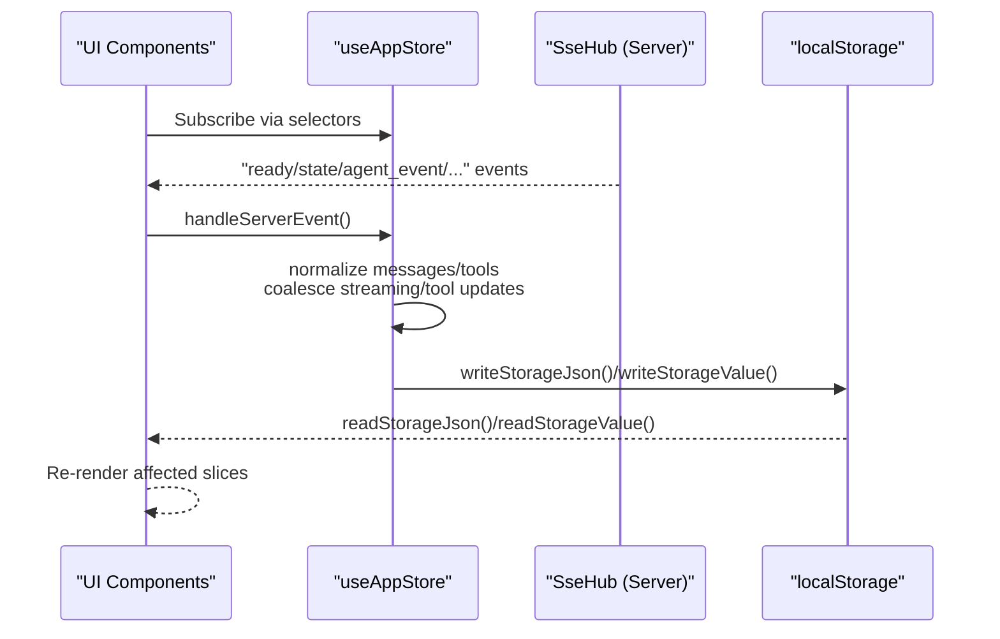
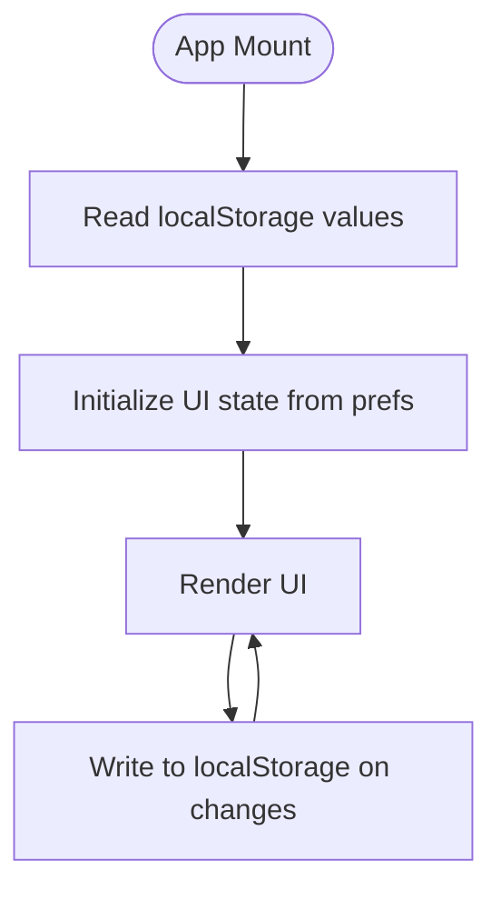
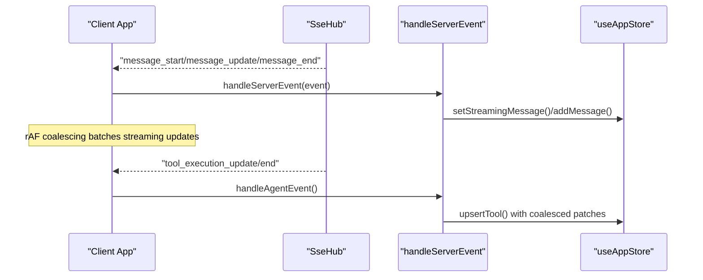
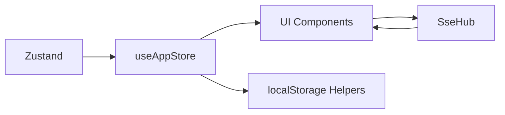

# State Management

<cite>
**Referenced Files in This Document**
- [app-store.ts](file://src/client/src/state/app-store.ts)
- [app-context.tsx](file://src/client/src/state/app-context.tsx)
- [main.tsx](file://src/client/src/main.tsx)
- [storage.ts](file://src/client/src/lib/storage.ts)
- [sse.ts](file://src/server/sse.ts)
</cite>

## Table of Contents
1. [Introduction](#introduction)
2. [Project Structure](#project-structure)
3. [Core Components](#core-components)
4. [Architecture Overview](#architecture-overview)
5. [Detailed Component Analysis](#detailed-component-analysis)
6. [Dependency Analysis](#dependency-analysis)
7. [Performance Considerations](#performance-considerations)
8. [Troubleshooting Guide](#troubleshooting-guide)
9. [Conclusion](#conclusion)

## Introduction
This document explains the Zustand-based state management system used by the application. It covers the global state shape, actions, selectors, subscription patterns, normalization strategies, persistence and hydration via localStorage, event-driven updates from server-sent events (SSE), optimistic updates, conflict resolution, performance optimizations, and state partitioning.

## Project Structure
The state management is centered around a single Zustand store with a thin provider wrapper for React consumption. Supporting utilities include localStorage helpers and an SSE hub on the server.

**Diagram sources**
- [app-store.ts:186-252](file://src/client/src/state/app-store.ts#L186-L252)
- [app-context.tsx:33-57](file://src/client/src/state/app-context.tsx#L33-L57)
- [main.tsx:573-588](file://src/client/src/main.tsx#L573-L588)
- [storage.ts:1-48](file://src/client/src/lib/storage.ts#L1-L48)
- [sse.ts:6-31](file://src/server/sse.ts#L6-L31)

**Section sources**
- [app-store.ts:186-252](file://src/client/src/state/app-store.ts#L186-L252)
- [app-context.tsx:33-57](file://src/client/src/state/app-context.tsx#L33-L57)
- [main.tsx:573-588](file://src/client/src/main.tsx#L573-L588)
- [storage.ts:1-48](file://src/client/src/lib/storage.ts#L1-L48)
- [sse.ts:6-31](file://src/server/sse.ts#L6-L31)

## Core Components
- Global store: A Zustand store exposing state slices and actions for messages, tools, UI widgets, statuses, toasts, and runtime settings.
- Provider: A React context/provider that exposes derived values (e.g., current model, workspace name) and convenience functions (e.g., sending commands).
- Utilities: localStorage helpers for persistence and hydration of preferences and lists.

Key responsibilities:
- Normalize and cap message history and tool records.
- Provide optimistic updates for user interactions (e.g., model selection).
- Coalesce frequent SSE updates (streaming and tool execution) to reduce renders.
- Persist and hydrate user preferences and lists.

**Section sources**
- [app-store.ts:33-58](file://src/client/src/state/app-store.ts#L33-L58)
- [app-store.ts:186-252](file://src/client/src/state/app-store.ts#L186-L252)
- [app-context.tsx:33-57](file://src/client/src/state/app-context.tsx#L33-L57)
- [storage.ts:1-48](file://src/client/src/lib/storage.ts#L1-L48)

## Architecture Overview
The store is the single source of truth for application state. UI components subscribe to specific slices via Zustand's selector pattern. SSE events drive real-time updates, which are normalized and merged into the store. Local preferences are persisted to and hydrated from localStorage.

**Diagram sources**
- [main.tsx:1144-1191](file://src/client/src/main.tsx#L1144-L1191)
- [app-store.ts:186-252](file://src/client/src/state/app-store.ts#L186-L252)
- [storage.ts:1-48](file://src/client/src/lib/storage.ts#L1-L48)
- [sse.ts:21-26](file://src/server/sse.ts#L21-L26)

## Detailed Component Analysis

### Global State Shape and Actions
The store defines a typed state interface and a set of actions. Notable fields include:
- Runtime slices: messages, streamingMessage, sessions, models, commands, files
- UI slices: widgets, sidebars, statuses, toasts
- Tools: a map keyed by tool call ID with normalized lifecycle fields
- Actions:
  - set: bulk patch with message normalization
  - addMessage: append a single message with deduplication and visibility counting
  - upsertTool: insert/update tool with timestamps, durations, pruning, and output compaction
  - setWidget/setSidebar/setStatus: manage lightweight UI slices
  - setStreamingMessage: manage live assistant message
  - showToast/dismissToast: toast stack management

Normalization and limits:
- Messages are deduplicated and capped by a sliding window.
- Tool records are pruned to a fixed maximum, prioritizing active and most recent entries.
- Tool output is compacted to a bounded length.

Optimistic updates:
- Model selection updates UI immediately, then reconciles with server asynchronously.

Conflict resolution:
- SSE “stateÔÇØ events merge only the session state; “readyÔÇØ resets state and messages.
- Streaming and tool updates are coalesced per-frame to avoid tearing.

**Section sources**
- [app-store.ts:33-58](file://src/client/src/state/app-store.ts#L33-L58)
- [app-store.ts:102-127](file://src/client/src/state/app-store.ts#L102-L127)
- [app-store.ts:137-170](file://src/client/src/state/app-store.ts#L137-L170)
- [app-store.ts:172-184](file://src/client/src/state/app-store.ts#L172-L184)
- [app-store.ts:186-252](file://src/client/src/state/app-store.ts#L186-L252)
- [main.tsx:826-843](file://src/client/src/main.tsx#L826-L843)

### Subscription Patterns and Selectors
Components subscribe to specific slices using Zustand's selector-based subscriptions. Examples:
- App-level subscription selects visibleMessageCount, sessions, models, and setters.
- Live tool summary uses a memoized selector over the tools map.
- Individual dialogs and inspectors subscribe to specific tool entries.

This pattern ensures fine-grained reactivity and avoids unnecessary renders.

**Section sources**
- [main.tsx:145-184](file://src/client/src/main.tsx#L145-L184)
- [main.tsx:185-187](file://src/client/src/main.tsx#L185-L187)
- [main.tsx:1665-1666](file://src/client/src/main.tsx#L1665-L1666)

### State Normalization Strategies
Message normalization:
- Deduplicates by identity derived from role, explicit IDs/timestamps, and a compacted text fingerprint.
- Maintains a rolling window and counts non-tool-result messages for visibility.

Tool normalization:
- Prunes to a maximum count, preferring active and recently updated tools.
- Compacts tool output to a bounded size.

These strategies prevent unbounded growth and maintain UI responsiveness.

**Section sources**
- [app-store.ts:70-100](file://src/client/src/state/app-store.ts#L70-L100)
- [app-store.ts:102-127](file://src/client/src/state/app-store.ts#L102-L127)
- [app-store.ts:137-170](file://src/client/src/state/app-store.ts#L137-L170)
- [app-store.ts:172-184](file://src/client/src/state/app-store.ts#L172-L184)

### Persistence and Hydration
Persistence:
- Preferences and lists are written to and read from localStorage via helper functions.
- Examples include prompt history, terminal history, theme, density, pinned sessions/archived sessions, and more.

Hydration:
- On mount, the app reads persisted values to initialize UI state and preferences.

**Diagram sources**
- [main.tsx:200-207](file://src/client/src/main.tsx#L200-L207)
- [main.tsx:274-281](file://src/client/src/main.tsx#L274-L281)
- [storage.ts:1-48](file://src/client/src/lib/storage.ts#L1-L48)

**Section sources**
- [main.tsx:200-207](file://src/client/src/main.tsx#L200-L207)
- [main.tsx:274-281](file://src/client/src/main.tsx#L274-L281)
- [storage.ts:1-48](file://src/client/src/lib/storage.ts#L1-L48)

### SSE-Driven Updates and Coalescing
Event handling:
- On connection open, the app refreshes session state and clears dangling UI state.
- On messages, the app parses and routes events to handlers:
  - ready: resets state and messages, clears streaming, settles tools, triggers background refreshes
  - state: merges session state; clears local streaming if idle
  - agent_event: handles streaming messages, tool execution lifecycle, and queued suggestions
  - terminal_: manages terminal runs
  - extension_ui_request: updates UI widgets/status/title/editor content
  - error: shows toast and notifies

Coalescing:
- Streaming message updates are scheduled per animation frame to batch incremental changes.
- Tool execution updates are coalesced per tool call ID per frame to avoid thrashing.

**Diagram sources**
- [main.tsx:573-588](file://src/client/src/main.tsx#L573-L588)
- [main.tsx:1144-1191](file://src/client/src/main.tsx#L1144-L1191)
- [main.tsx:1208-1261](file://src/client/src/main.tsx#L1208-L1261)
- [main.tsx:1263-1302](file://src/client/src/main.tsx#L1263-L1302)
- [sse.ts:21-26](file://src/server/sse.ts#L21-L26)

**Section sources**
- [main.tsx:573-588](file://src/client/src/main.tsx#L573-L588)
- [main.tsx:1144-1191](file://src/client/src/main.tsx#L1144-L1191)
- [main.tsx:1208-1261](file://src/client/src/main.tsx#L1208-L1261)
- [main.tsx:1263-1302](file://src/client/src/main.tsx#L1263-L1302)
- [sse.ts:21-26](file://src/server/sse.ts#L21-L26)

### Optimistic Updates and Conflict Resolution
Optimistic model selection:
- Immediately marks the chosen model as current in the UI.
- Sends the selection to the backend; on success, refreshes model lists; on failure, reverts and shows an error.

Conflict resolution:
- SSE “stateÔÇØ events merge only session state; if the server indicates idle, local streaming state is cleared and tools are settled.
- On focus/visibility changes or periodic checks, the app reconciles local state with server state.

**Section sources**
- [main.tsx:826-843](file://src/client/src/main.tsx#L826-L843)
- [main.tsx:1160-1167](file://src/client/src/main.tsx#L1160-L1167)
- [main.tsx:590-606](file://src/client/src/main.tsx#L590-L606)

### State Partitioning and Rendering Efficiency
- UI slices are separated (messages, tools, widgets, sidebars, statuses, toasts) to minimize re-renders.
- Components subscribe to narrow slices via selectors, avoiding full-store re-renders.
- Memoization is used for derived summaries (e.g., tool change summary) and expensive computations.

**Section sources**
- [main.tsx:145-184](file://src/client/src/main.tsx#L145-L184)
- [main.tsx:185-187](file://src/client/src/main.tsx#L185-L187)

## Dependency Analysis
The store depends on:
- Zustand for state creation and subscriptions
- localStorage helpers for persistence
- SSE hub for real-time updates

**Diagram sources**
- [app-store.ts:186-252](file://src/client/src/state/app-store.ts#L186-L252)
- [storage.ts:1-48](file://src/client/src/lib/storage.ts#L1-L48)
- [sse.ts:6-31](file://src/server/sse.ts#L6-L31)

**Section sources**
- [app-store.ts:186-252](file://src/client/src/state/app-store.ts#L186-L252)
- [storage.ts:1-48](file://src/client/src/lib/storage.ts#L1-L48)
- [sse.ts:6-31](file://src/server/sse.ts#L6-L31)

## Performance Considerations
- Shallow comparisons: Subscriptions use selector functions to avoid deep equality checks.
- Memoization: Derived summaries and expensive computations are memoized.
- Coalescing: Streaming and tool updates are batched per animation frame.
- Limits and pruning: Fixed caps on messages and tools prevent memory bloat.
- Partitioning: Separate slices reduce unnecessary re-renders.

[No sources needed since this section provides general guidance]

## Troubleshooting Guide
Common issues and remedies:
- Stale UI after SSE disconnect: The app periodically refreshes state and settles tools when idle.
- Streaming state inconsistencies: Local streaming state is cleared and session state patched upon SSE errors or focus/visibility reconciliation.
- Tool updates flooding the UI: Tool updates are coalesced per frame; if UI feels laggy, verify that updates are not bypassing the coalescing logic.

**Section sources**
- [main.tsx:590-606](file://src/client/src/main.tsx#L590-L606)
- [main.tsx:1160-1167](file://src/client/src/main.tsx#L1160-L1167)
- [main.tsx:1288-1302](file://src/client/src/main.tsx#L1288-L1302)

## Conclusion
The Zustand-based state management system provides a clear separation of concerns, efficient subscriptions, robust normalization, and resilient real-time synchronization via SSE. Optimistic updates and coalescing improve perceived performance, while persistence and hydration ensure continuity across sessions. The design balances simplicity with scalability, enabling responsive UIs even under high-frequency updates.
