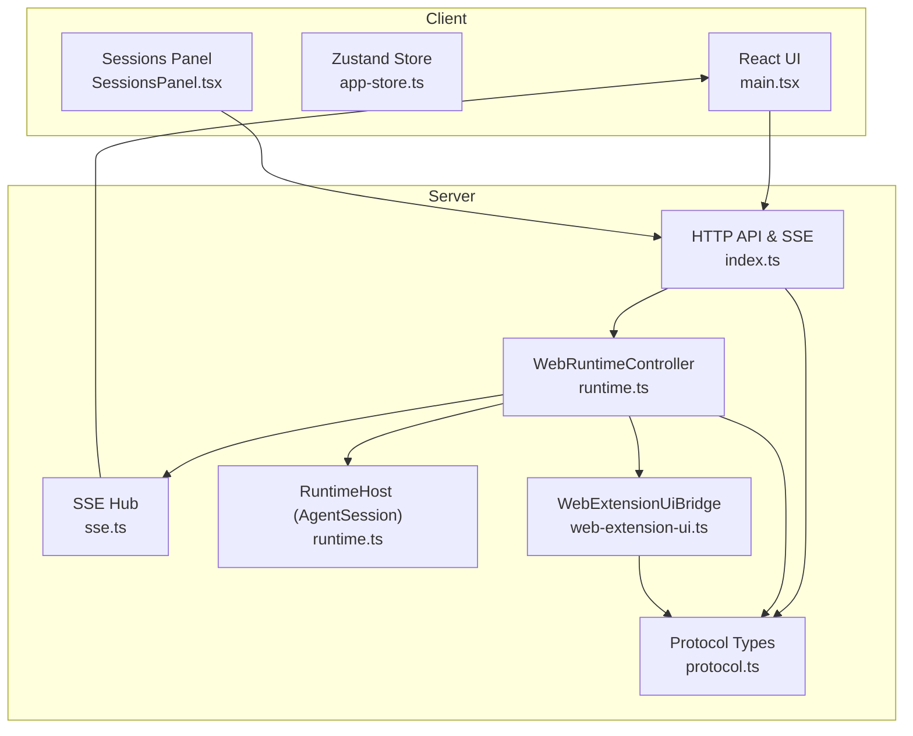
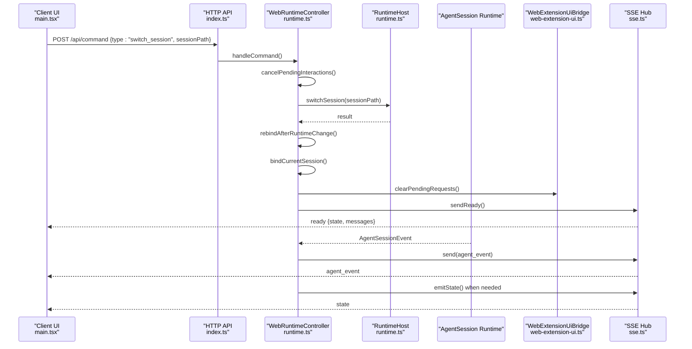
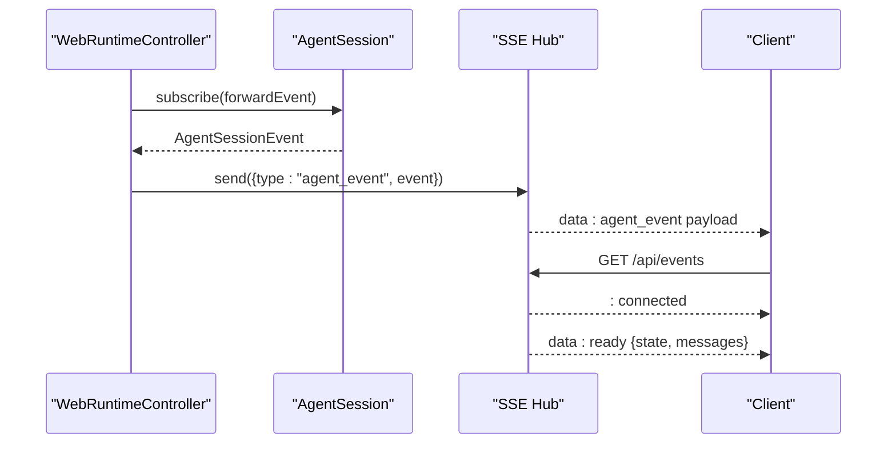
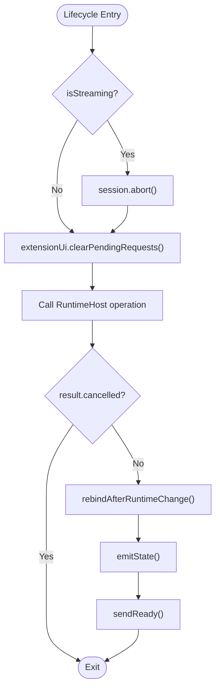
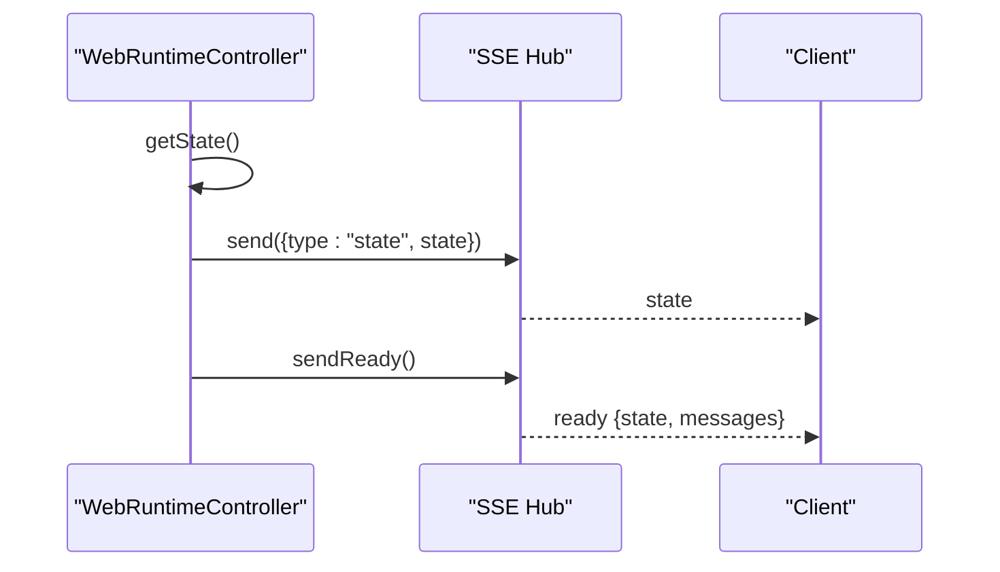
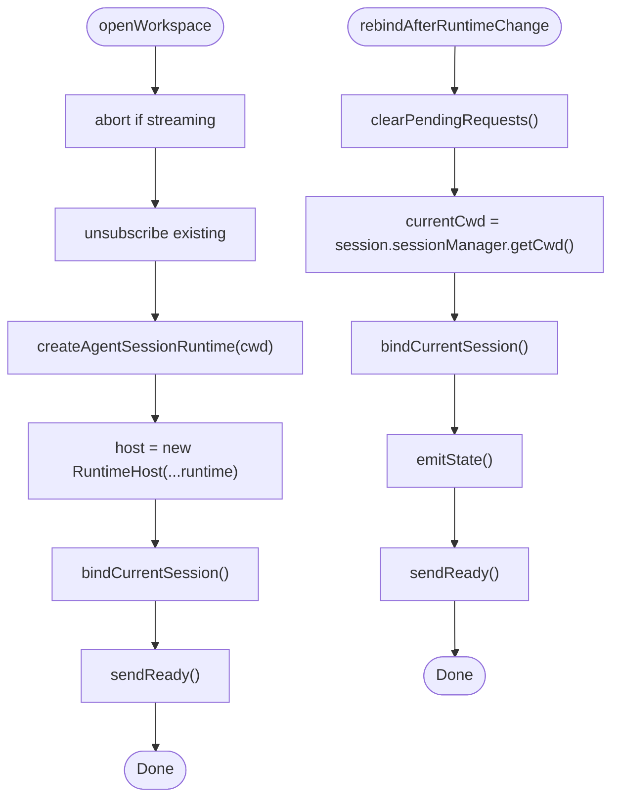
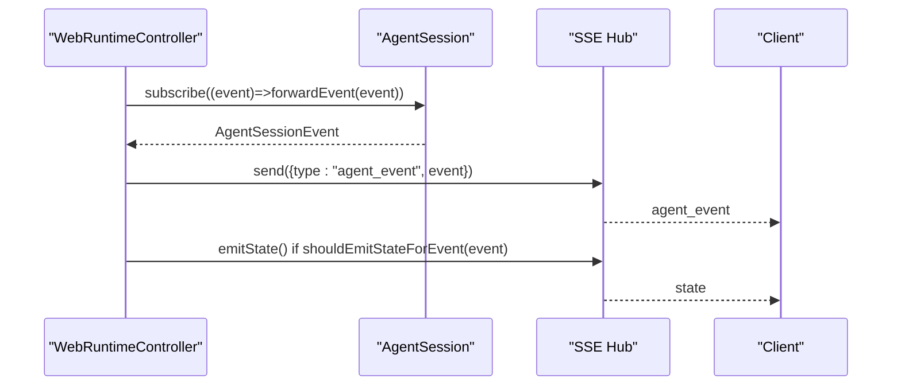
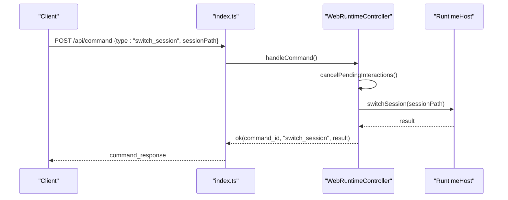
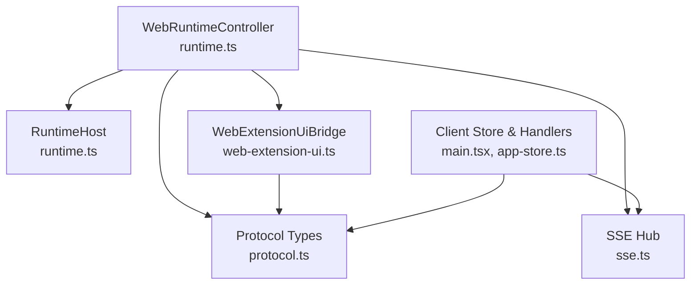

# AgentSession Bridge

<cite>
**Referenced Files in This Document**
- [runtime.ts](file://src/server/runtime.ts)
- [index.ts](file://src/server/index.ts)
- [sse.ts](file://src/server/sse.ts)
- [protocol.ts](file://src/shared/protocol.ts)
- [web-extension-ui.ts](file://src/server/web-extension-ui.ts)
- [main.tsx](file://src/client/src/main.tsx)
- [app-store.ts](file://src/client/src/state/app-store.ts)
- [SessionsPanel.tsx](file://src/client/src/components/sessions/SessionsPanel.tsx)
- [session-management.spec.ts](file://test/e2e/session-management.spec.ts)
</cite>

## Table of Contents
1. [Introduction](#introduction)
2. [Project Structure](#project-structure)
3. [Core Components](#core-components)
4. [Architecture Overview](#architecture-overview)
5. [Detailed Component Analysis](#detailed-component-analysis)
6. [Dependency Analysis](#dependency-analysis)
7. [Performance Considerations](#performance-considerations)
8. [Troubleshooting Guide](#troubleshooting-guide)
9. [Conclusion](#conclusion)

## Introduction
This document explains the AgentSession bridge implementation that connects the web interface to the shared AgentSession runtime. It focuses on how the WebRuntimeController acts as a bridge using the RuntimeHost pattern, manages session lifecycles, synchronizes state via SSE, and forwards AgentSession events to the client. It also covers the subscription pattern for AgentSession events, runtime change handling, and the relationship between web-specific commands and underlying AgentSession functionality.

## Project Structure
The AgentSession bridge spans server-side runtime orchestration, SSE transport, protocol definitions, and client-side state management:

- Server runtime orchestrator and session lifecycle: src/server/runtime.ts
- HTTP command routing and SSE initialization: src/server/index.ts
- SSE transport hub: src/server/sse.ts
- Protocol definitions for commands, events, and state: src/shared/protocol.ts
- Web extension UI bridge for plan clarifications and extension dialogs: src/server/web-extension-ui.ts
- Client-side state store and event handling: src/client/src/state/app-store.ts and src/client/src/main.tsx
- Session picker UI and E2E tests: src/client/src/components/sessions/SessionsPanel.tsx and test/e2e/session-management.spec.ts



**Diagram sources**
- [runtime.ts:12-456](file://src/server/runtime.ts#L12-L456)
- [index.ts:401-454](file://src/server/index.ts#L401-L454)
- [sse.ts:6-31](file://src/server/sse.ts#L6-L31)
- [protocol.ts:161-198](file://src/shared/protocol.ts#L161-L198)
- [web-extension-ui.ts:27-244](file://src/server/web-extension-ui.ts#L27-L244)
- [main.tsx:1144-1176](file://src/client/src/main.tsx#L1144-L1176)
- [app-store.ts:186-200](file://src/client/src/state/app-store.ts#L186-L200)
- [SessionsPanel.tsx:10-48](file://src/client/src/components/sessions/SessionsPanel.tsx#L10-L48)

**Section sources**
- [runtime.ts:12-456](file://src/server/runtime.ts#L12-L456)
- [index.ts:401-454](file://src/server/index.ts#L401-L454)
- [sse.ts:6-31](file://src/server/sse.ts#L6-L31)
- [protocol.ts:161-198](file://src/shared/protocol.ts#L161-L198)
- [web-extension-ui.ts:27-244](file://src/server/web-extension-ui.ts#L27-L244)
- [main.tsx:1144-1176](file://src/client/src/main.tsx#L1144-L1176)
- [app-store.ts:186-200](file://src/client/src/state/app-store.ts#L186-L200)
- [SessionsPanel.tsx:10-48](file://src/client/src/components/sessions/SessionsPanel.tsx#L10-L48)

## Core Components
- WebRuntimeController: Orchestrates AgentSession runtime via RuntimeHost, exposes session lifecycle methods, and binds extension UI contexts. It subscribes to AgentSession events and forwards them via SSE.
- RuntimeHost: Wraps the AgentSession runtime and provides session management operations (new, switch, fork).
- WebExtensionUiBridge: Bridges extension UI requests to the web client via SSE, tracks pending requests, and resolves responses.
- SSE Hub: Manages SSE connections and broadcasts events to clients.
- Protocol Types: Define command payloads, agent events, and state structures exchanged between client and server.

Key responsibilities:
- Lifecycle methods: newSession, switchSession, forkSession
- State synchronization: getState emits "ready" and "state" events
- Event forwarding: AgentSession events forwarded as "agent_event" with selective state emission
- Runtime changes: rebindAfterRuntimeChange updates subscriptions and current working directory

**Section sources**
- [runtime.ts:12-456](file://src/server/runtime.ts#L12-L456)
- [web-extension-ui.ts:27-244](file://src/server/web-extension-ui.ts#L27-L244)
- [sse.ts:6-31](file://src/server/sse.ts#L6-L31)
- [protocol.ts:132-198](file://src/shared/protocol.ts#L132-L198)

## Architecture Overview
The bridge follows a layered architecture:
- Client subscribes to SSE for real-time updates
- Server routes HTTP commands to WebRuntimeController
- WebRuntimeController delegates to RuntimeHost for session operations
- AgentSession emits events; WebRuntimeController forwards them via SSE
- WebExtensionUiBridge mediates extension UI requests and clarifications



**Diagram sources**
- [index.ts:255-374](file://src/server/index.ts#L255-L374)
- [runtime.ts:145-165](file://src/server/runtime.ts#L145-L165)
- [runtime.ts:405-426](file://src/server/runtime.ts#L405-L426)
- [runtime.ts:452-455](file://src/server/runtime.ts#L452-L455)
- [web-extension-ui.ts:197-202](file://src/server/web-extension-ui.ts#L197-L202)
- [sse.ts:21-26](file://src/server/sse.ts#L21-L26)

## Detailed Component Analysis

### WebRuntimeController and RuntimeHost Pattern
- Runtime creation: WebRuntimeController creates an AgentSession runtime and wraps it with RuntimeHost.
- Session binding: bindCurrentSession subscribes to AgentSession events and binds extension UI context with command actions.
- Lifecycle methods:
  - newSession: aborts streaming if needed, clears pending UI requests, delegates to RuntimeHost, then rebinds.
  - switchSession: aborts streaming, switches session via RuntimeHost, rebinds, clears pending UI requests.
  - forkSession: aborts streaming, forks via RuntimeHost, rebinds, clears pending UI requests.
- State synchronization: getState aggregates session state and plan state; emitState sends "state" via SSE; sendReady sends "ready" with initial state and messages.

```mermaid
classDiagram
class WebRuntimeController {
-host : AgentSessionRuntimeHost
-unsubscribe : Function
+session
+getState() WebSessionState
+sendReady() void
+prompt(message, options) Promise<void>
+newSession() Promise<{cancelled : boolean}>
+switchSession(sessionPath) Promise<{cancelled : boolean}>
+forkSession(entryId) Promise<{cancelled : boolean}>
+setThinkingLevel(level) Promise<void>
+openWorkspace(cwd) Promise<void>
-bindCurrentSession() Promise<void>
-rebindAfterRuntimeChange() Promise<void>
-forwardEvent(event) void
-createCommandActions() ExtensionCommandContextActions
}
class RuntimeHost {
+session
+newSession(options)
+switchSession(sessionPath)
+fork(entryId)
}
class WebExtensionUiBridge {
+createContext() ExtensionUIContext
+resolveResponse(id, response) boolean
+recordClarificationAnswer(...)
+completeClarification(...)
+skipClarification(...)
+clearPendingRequests() void
+getPendingRequests() PendingExtensionRequest[]
}
WebRuntimeController --> RuntimeHost : "delegates"
WebRuntimeController --> WebExtensionUiBridge : "binds UI context"
```

**Diagram sources**
- [runtime.ts:12-456](file://src/server/runtime.ts#L12-L456)
- [web-extension-ui.ts:27-244](file://src/server/web-extension-ui.ts#L27-L244)

**Section sources**
- [runtime.ts:24-456](file://src/server/runtime.ts#L24-L456)
- [runtime.ts:123-165](file://src/server/runtime.ts#L123-L165)
- [runtime.ts:413-426](file://src/server/runtime.ts#L413-L426)
- [runtime.ts:405-411](file://src/server/runtime.ts#L405-L411)

### SSE Subscription and Event Forwarding
- SSE Hub maintains active connections and writes events to all clients.
- WebRuntimeController subscribes to AgentSession events and forwards them as "agent_event".
- Some events trigger state emission to keep the client synchronized (e.g., non-update events).
- On connection, SSE Hub initializes clients with "ready" containing current state and messages.



**Diagram sources**
- [runtime.ts:415-415](file://src/server/runtime.ts#L415-L415)
- [runtime.ts:452-455](file://src/server/runtime.ts#L452-L455)
- [sse.ts:9-26](file://src/server/sse.ts#L9-L26)
- [index.ts:408-411](file://src/server/index.ts#L408-L411)

**Section sources**
- [sse.ts:6-31](file://src/server/sse.ts#L6-L31)
- [runtime.ts:452-455](file://src/server/runtime.ts#L452-L455)
- [index.ts:408-411](file://src/server/index.ts#L408-L411)

### Session Lifecycle Methods
- newSession: aborts streaming, clears pending UI requests, calls RuntimeHost.newSession, then rebinds and clears UI requests again.
- switchSession: aborts streaming, clears pending UI requests, calls RuntimeHost.switchSession, then rebinds and clears UI requests again.
- forkSession: aborts streaming, clears pending UI requests, calls RuntimeHost.fork, then rebinds and clears UI requests again.
- rebindAfterRuntimeChange: clears pending UI requests, updates current working directory from session, rebinds session, emits state, and sends "ready".



**Diagram sources**
- [runtime.ts:123-165](file://src/server/runtime.ts#L123-L165)
- [runtime.ts:405-411](file://src/server/runtime.ts#L405-L411)
- [runtime.ts:134-143](file://src/server/runtime.ts#L134-L143)

**Section sources**
- [runtime.ts:123-165](file://src/server/runtime.ts#L123-L165)
- [runtime.ts:405-411](file://src/server/runtime.ts#L405-L411)

### State Synchronization Mechanisms
- getState builds WebSessionState from AgentSession, including plan state derived from session manager entries.
- emitState sends "state" events; sendReady sends "ready" with initial messages.
- Client reconciles state on "ready" and "state" events, refreshing sessions, models, and commands.



**Diagram sources**
- [runtime.ts:36-58](file://src/server/runtime.ts#L36-L58)
- [runtime.ts:401-403](file://src/server/runtime.ts#L401-L403)
- [main.tsx:1144-1176](file://src/client/src/main.tsx#L1144-L1176)

**Section sources**
- [runtime.ts:36-58](file://src/server/runtime.ts#L36-L58)
- [runtime.ts:401-403](file://src/server/runtime.ts#L401-L403)
- [main.tsx:1144-1176](file://src/client/src/main.tsx#L1144-L1176)

### Runtime Changes and Re-binding
- openWorkspace: aborts streaming, clears subscriptions, creates a new AgentSession runtime for the new cwd, replaces host, rebinds session, and sends "ready".
- rebindAfterRuntimeChange: clears pending UI requests, updates cwd from session, rebinds session, emits state, and sends "ready".



**Diagram sources**
- [runtime.ts:134-143](file://src/server/runtime.ts#L134-L143)
- [runtime.ts:405-411](file://src/server/runtime.ts#L405-L411)

**Section sources**
- [runtime.ts:134-143](file://src/server/runtime.ts#L134-L143)
- [runtime.ts:405-411](file://src/server/runtime.ts#L405-L411)

### Subscription Pattern for AgentSession Events
- WebRuntimeController subscribes to AgentSession via session.subscribe and forwards events as "agent_event".
- shouldEmitStateForEvent filters out frequent update events ("message_update", "tool_execution_update") to avoid flooding the client.
- Client handles "agent_event" and updates UI accordingly.



**Diagram sources**
- [runtime.ts:415-415](file://src/server/runtime.ts#L415-L415)
- [runtime.ts:452-455](file://src/server/runtime.ts#L452-L455)
- [runtime.ts:495-498](file://src/server/runtime.ts#L495-L498)
- [main.tsx:1169-1169](file://src/client/src/main.tsx#L1169-L1169)

**Section sources**
- [runtime.ts:415-455](file://src/server/runtime.ts#L415-L455)
- [runtime.ts:495-498](file://src/server/runtime.ts#L495-L498)
- [main.tsx:1169-1169](file://src/client/src/main.tsx#L1169-L1169)

### Relationship Between Web Commands and AgentSession Functionality
- HTTP command routing maps web commands to WebRuntimeController methods.
- Commands like "prompt", "abort", "switch_session", "fork_session", "set_thinking_level", "set_model", "set_plan_mode", and slash commands are handled.
- Some commands cancel pending interactions before execution to ensure consistent state transitions.



**Diagram sources**
- [index.ts:255-374](file://src/server/index.ts#L255-L374)
- [runtime.ts:145-154](file://src/server/runtime.ts#L145-L154)

**Section sources**
- [index.ts:255-374](file://src/server/index.ts#L255-L374)
- [runtime.ts:145-154](file://src/server/runtime.ts#L145-L154)

### Examples of Session State Management
- Switching sessions: The UI triggers "switch_session" via HTTP; server cancels pending interactions, switches session, rebinds, and sends "ready" with updated state and messages.
- Forking sessions: Similar flow with "fork_session", leading to a new session derived from an entry ID.
- Opening a workspace: The server creates a new runtime for the new cwd, rebinds, and sends "ready".

**Section sources**
- [index.ts:328-331](file://src/server/index.ts#L328-L331)
- [runtime.ts:145-165](file://src/server/runtime.ts#L145-L165)
- [runtime.ts:134-143](file://src/server/runtime.ts#L134-L143)

### Error Handling During Runtime Operations
- Command failures are caught and returned as structured "command_response" with success=false and error message.
- Extension UI errors are forwarded via SSE "error" events with optional stack traces.
- Shutdown requests from extension context are reported as "error" events.

**Section sources**
- [index.ts:371-373](file://src/server/index.ts#L371-L373)
- [runtime.ts:419-424](file://src/server/runtime.ts#L419-L424)

### Client-Side State Management and Event Handling
- Client listens for SSE "ready", "state", "agent_event", and "error" events.
- On "ready", client sets state and messages, refreshes sessions/models/commands/files/workspace, and clears streaming state.
- On "state", client updates state and settles tools after idle.
- On "error", client shows toast and notifies error.

**Section sources**
- [main.tsx:1144-1176](file://src/client/src/main.tsx#L1144-L1176)
- [app-store.ts:186-200](file://src/client/src/state/app-store.ts#L186-L200)

## Dependency Analysis
- WebRuntimeController depends on RuntimeHost for session operations and on WebExtensionUiBridge for UI context and plan clarifications.
- SSE Hub is injected into WebRuntimeController and WebExtensionUiBridge to broadcast events.
- Protocol types define the contract for commands, events, and state structures.
- Client-side Zustand store integrates server events and drives UI updates.



**Diagram sources**
- [runtime.ts:12-456](file://src/server/runtime.ts#L12-L456)
- [web-extension-ui.ts:27-244](file://src/server/web-extension-ui.ts#L27-L244)
- [sse.ts:6-31](file://src/server/sse.ts#L6-L31)
- [protocol.ts:161-198](file://src/shared/protocol.ts#L161-L198)
- [main.tsx:1144-1176](file://src/client/src/main.tsx#L1144-L1176)
- [app-store.ts:186-200](file://src/client/src/state/app-store.ts#L186-L200)

**Section sources**
- [runtime.ts:12-456](file://src/server/runtime.ts#L12-L456)
- [web-extension-ui.ts:27-244](file://src/server/web-extension-ui.ts#L27-L244)
- [sse.ts:6-31](file://src/server/sse.ts#L6-L31)
- [protocol.ts:161-198](file://src/shared/protocol.ts#L161-L198)
- [main.tsx:1144-1176](file://src/client/src/main.tsx#L1144-L1176)
- [app-store.ts:186-200](file://src/client/src/state/app-store.ts#L186-L200)

## Performance Considerations
- Frequent update events are filtered to reduce SSE traffic; only significant state changes trigger emissions.
- Streaming operations are aborted before session changes to prevent inconsistent state.
- Client-side throttling and reconciliation minimize redundant UI updates during rapid state transitions.

## Troubleshooting Guide
Common issues and resolutions:
- Session switching fails: Verify the session path exists and the runtime is idle; ensure pending interactions are cleared before switching.
- Plan clarifications not applied: Ensure the request ID and clarification ID match; check that pending requests are not stale.
- SSE not receiving updates: Confirm the client is connected to /api/events and that the server sends "ready" on connect.
- Extension UI errors: Inspect "error" events for extensionPath and stack traces; ensure extension context is bound properly.

**Section sources**
- [runtime.ts:145-165](file://src/server/runtime.ts#L145-L165)
- [runtime.ts:98-112](file://src/server/runtime.ts#L98-L112)
- [index.ts:408-411](file://src/server/index.ts#L408-L411)
- [web-extension-ui.ts:197-202](file://src/server/web-extension-ui.ts#L197-L202)

## Conclusion
The AgentSession bridge leverages WebRuntimeController and RuntimeHost to mediate between the web UI and the shared AgentSession runtime. Through SSE, it synchronizes state and forwards AgentSession events to the client. The subscription pattern ensures timely updates, while lifecycle methods and re-binding handle runtime changes robustly. The WebExtensionUiBridge integrates extension UI requests and clarifications, maintaining a cohesive user experience across plan mode and interactive sessions.
