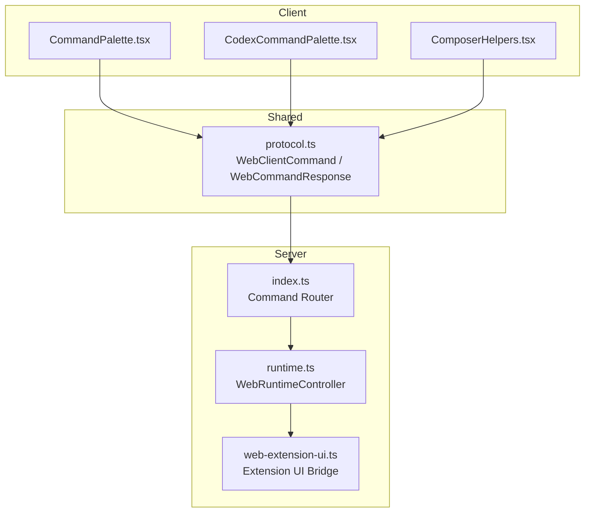
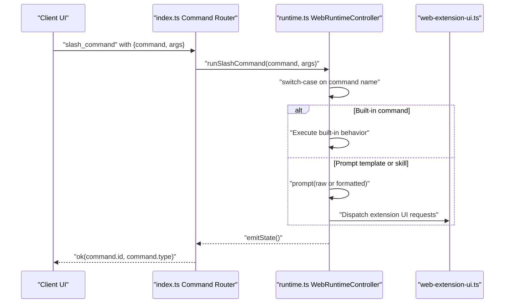
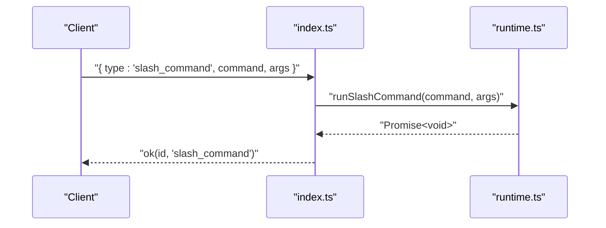
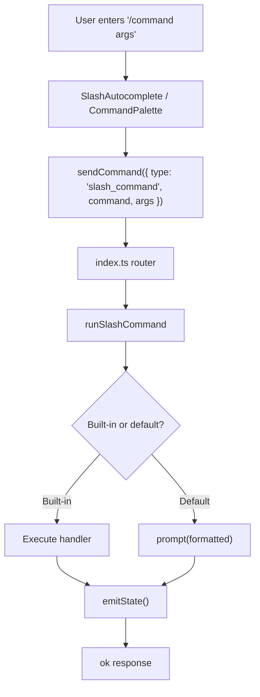
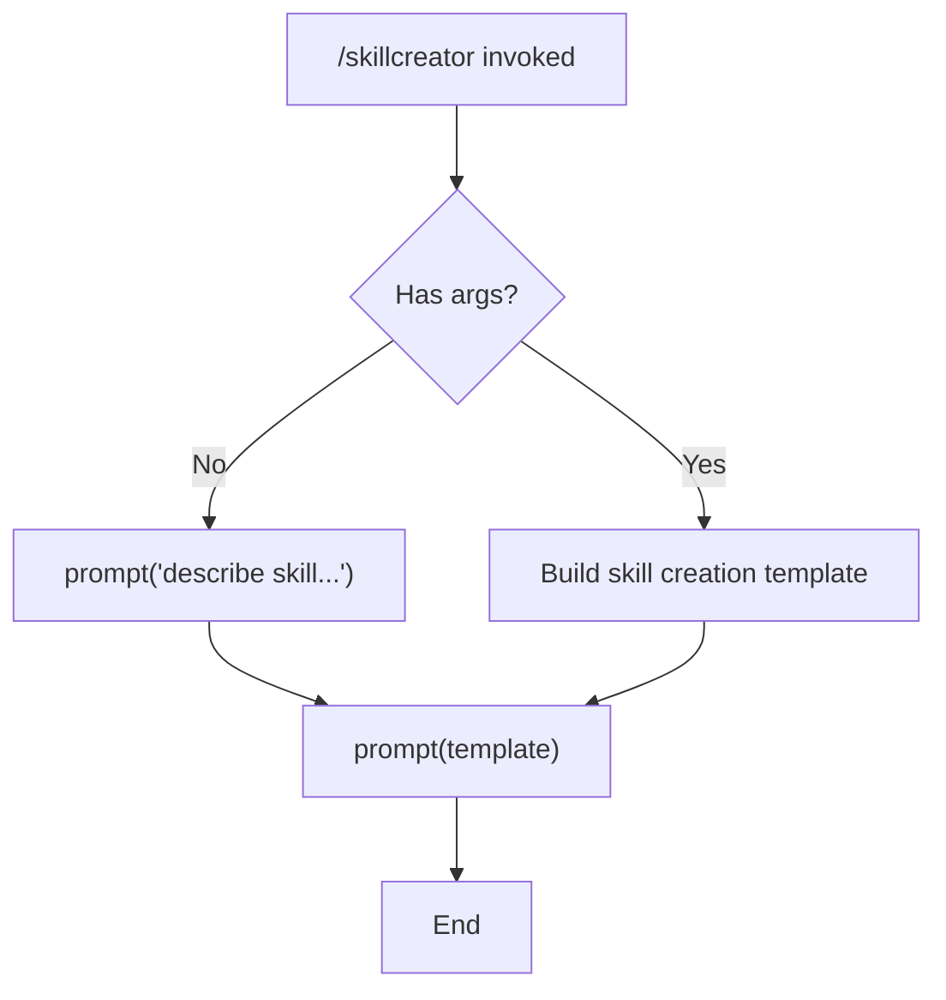
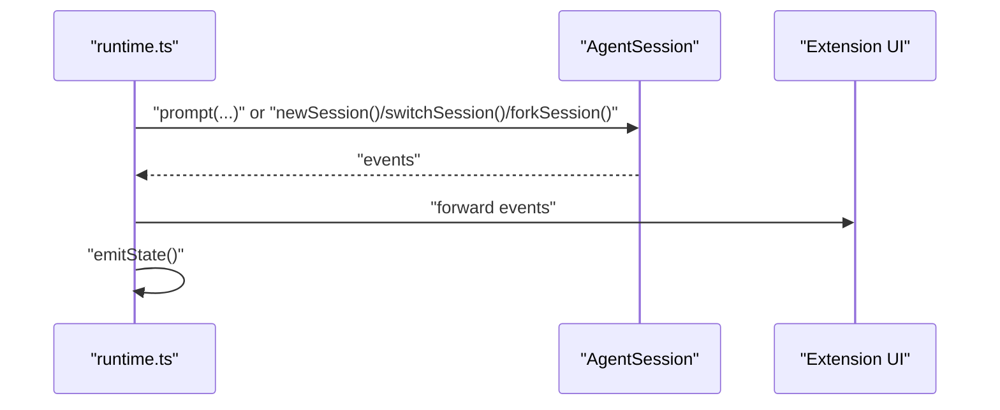
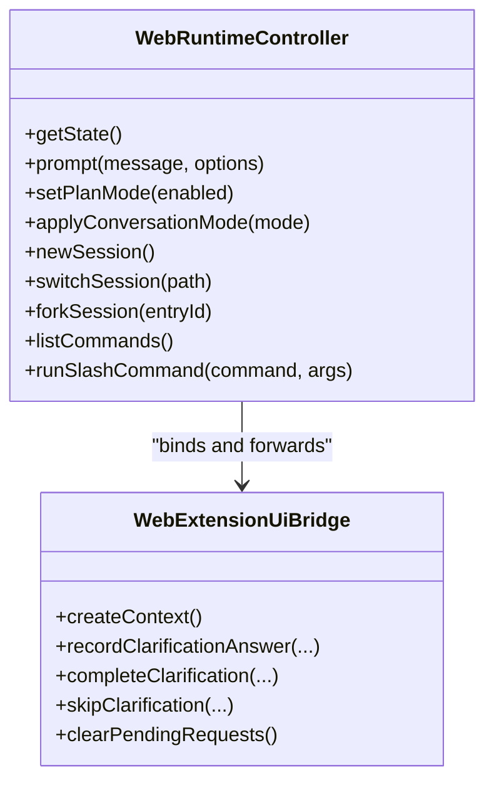
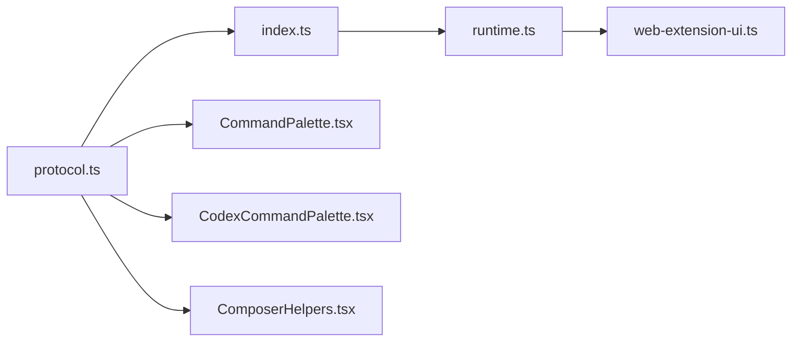

# Command Processing

<cite>
**Referenced Files in This Document**
- [runtime.ts](file://src/server/runtime.ts)
- [index.ts](file://src/server/index.ts)
- [protocol.ts](file://src/shared/protocol.ts)
- [web-extension-ui.ts](file://src/server/web-extension-ui.ts)
- [CommandPalette.tsx](file://src/client/src/components/command/CommandPalette.tsx)
- [CodexCommandPalette.tsx](file://src/client/src/components/command/CodexCommandPalette.tsx)
- [ComposerHelpers.tsx](file://src/client/src/components/composer/ComposerHelpers.tsx)
</cite>

## Table of Contents
1. [Introduction](#introduction)
2. [Project Structure](#project-structure)
3. [Core Components](#core-components)
4. [Architecture Overview](#architecture-overview)
5. [Detailed Component Analysis](#detailed-component-analysis)
6. [Dependency Analysis](#dependency-analysis)
7. [Performance Considerations](#performance-considerations)
8. [Troubleshooting Guide](#troubleshooting-guide)
9. [Conclusion](#conclusion)

## Introduction
This document explains the command processing pipeline in the runtime integration layer, focusing on how slash commands are parsed, routed, and executed. It covers built-in commands, prompt templates, skill commands, and the runSlashCommand method. It also documents parameter parsing, error handling, session state changes, and the relationship between commands and the extension system.

## Project Structure
The command processing pipeline spans three layers:
- Client-side command UI and composition helpers
- Server-side command router and runtime controller
- Shared protocol definitions for commands and responses



**Diagram sources**
- [index.ts:266-374](file://src/server/index.ts#L266-L374)
- [runtime.ts:12-30](file://src/server/runtime.ts#L12-L30)
- [web-extension-ui.ts:48-71](file://src/server/web-extension-ui.ts#L48-L71)
- [protocol.ts:171-198](file://src/shared/protocol.ts#L171-L198)

**Section sources**
- [index.ts:266-374](file://src/server/index.ts#L266-L374)
- [runtime.ts:12-30](file://src/server/runtime.ts#L12-L30)
- [protocol.ts:171-198](file://src/shared/protocol.ts#L171-L198)

## Core Components
- Command Router: Accepts incoming commands, validates types, and delegates to runtime methods.
- WebRuntimeController: Implements runSlashCommand, manages session state, and interacts with the extension system.
- Extension UI Bridge: Handles extension-driven UI requests and plan-related interactions.
- Protocol Types: Define command shapes and responses for client-server communication.

Key responsibilities:
- Parse and route slash commands to appropriate handlers
- Manage built-in commands (/new, /status, /reload, /compact)
- Dispatch prompt templates and skill commands via the underlying session
- Toggle plan mode and reflect state changes
- Emit state updates and handle errors gracefully

**Section sources**
- [runtime.ts:233-339](file://src/server/runtime.ts#L233-L339)
- [index.ts:266-374](file://src/server/index.ts#L266-L374)
- [protocol.ts:171-198](file://src/shared/protocol.ts#L171-L198)

## Architecture Overview
The command pipeline follows a clear flow from client to server and into the runtime controller.



**Diagram sources**
- [index.ts:363-365](file://src/server/index.ts#L363-L365)
- [runtime.ts:296-339](file://src/server/runtime.ts#L296-L339)
- [web-extension-ui.ts:48-71](file://src/server/web-extension-ui.ts#L48-L71)

## Detailed Component Analysis

### runSlashCommand Method Implementation
The runSlashCommand method normalizes the input command, extracts the base name, and routes to either:
- Built-in commands: New session, status refresh, reload, compact, UI focus triggers, skill creation prompts
- Default dispatch: Sends the raw or formatted message to the underlying session via prompt()

```mermaid
flowchart TD
Start(["runSlashCommand(command, args)"]) --> Normalize["Normalize '/' prefix"]
Normalize --> Extract["Extract command name"]
Extract --> Switch{"Switch on name"}
Switch --> |"/new"| New["newSession()"]
Switch --> |"/status"| Status["sendReady()"]
Switch --> |"/reload"| Reload["session.reload() + bindCurrentSession() + sendReady()"]
Switch --> |"/compact"| Compact["session.compact(args)"]
Switch --> |"/model","/resume","/settings","/checklist"| Focus["extension_ui_request setStatus"]
Switch --> |"/skillcreator","/skill-creator","/skillcreate"| Skill["prompt skill creation or template"]
Switch --> |default| Dispatch["prompt(formatted)"]
New --> Emit["emitState()"] --> End(["Return"])
Status --> Emit --> End
Reload --> Emit --> End
Compact --> End
Focus --> End
Skill --> Emit --> End
Dispatch --> Emit --> End
```

**Diagram sources**
- [runtime.ts:296-339](file://src/server/runtime.ts#L296-L339)

**Section sources**
- [runtime.ts:296-339](file://src/server/runtime.ts#L296-L339)

### Built-in Commands
- /new: Starts a new session and rebinding; clears pending extension requests.
- /status: Emits a ready event with current state and messages.
- /reload: Reloads extensions/resources and rebinds the session.
- /compact: Compacts the current conversation.
- /model, /resume, /settings, /checklist: Triggers extension UI focus via setStatus.
- /plan family: Controlled via setPlanMode; toggles plan mode safely and validates state.

These commands are enumerated in listCommands and surfaced to the UI for discovery and autocomplete.

**Section sources**
- [runtime.ts:233-259](file://src/server/runtime.ts#L233-L259)
- [runtime.ts:300-321](file://src/server/runtime.ts#L300-L321)
- [runtime.ts:64-75](file://src/server/runtime.ts#L64-L75)

### Prompt Templates and Skills
- Prompt templates: Exposed as commands with source "prompt".
- Skills: Loaded from ~/.quake-code/agent/skills/<name>/SKILL.md and surfaced as commands with source "skill".

The listCommands method aggregates built-ins, prompt templates, and skills into a unified command list.

**Section sources**
- [runtime.ts:251-259](file://src/server/runtime.ts#L251-L259)
- [runtime.ts:261-287](file://src/server/runtime.ts#L261-L287)

### Command Routing Logic
The server's command router accepts a typed command and delegates to runtime methods. For slash_command, it invokes runSlashCommand with the provided command and args.



**Diagram sources**
- [index.ts:363-365](file://src/server/index.ts#L363-L365)
- [protocol.ts:192](file://src/shared/protocol.ts#L192)

**Section sources**
- [index.ts:266-374](file://src/server/index.ts#L266-L374)
- [protocol.ts:192](file://src/shared/protocol.ts#L192)

### Parameter Parsing and Execution Flow
- Client-side composition helpers support slash autocompletion and command palette integration.
- The command palette filters and groups commands, prompting the client to send slash_command with normalized command and args.
- The server parses the command, ensures it starts with '/', and routes appropriately.



**Diagram sources**
- [ComposerHelpers.tsx:5-18](file://src/client/src/components/composer/ComposerHelpers.tsx#L5-L18)
- [CommandPalette.tsx:110-128](file://src/client/src/components/command/CommandPalette.tsx#L110-L128)
- [index.ts:363-365](file://src/server/index.ts#L363-L365)
- [runtime.ts:296-339](file://src/server/runtime.ts#L296-L339)

**Section sources**
- [ComposerHelpers.tsx:5-18](file://src/client/src/components/composer/ComposerHelpers.tsx#L5-L18)
- [CommandPalette.tsx:110-128](file://src/client/src/components/command/CommandPalette.tsx#L110-L128)
- [index.ts:363-365](file://src/server/index.ts#L363-L365)

### Special Command Handling
- Skill creation: If invoked without arguments, prompts a guided instruction; if arguments are present, constructs a tailored skill creation prompt and sends it to the session.
- Plan mode toggling: Uses setPlanMode to safely enable/disable plan mode and validates the resulting state.
- Extension UI focus: Certain commands trigger setStatus to bring specific UI areas into focus.



**Diagram sources**
- [runtime.ts:321-331](file://src/server/runtime.ts#L321-L331)

**Section sources**
- [runtime.ts:321-331](file://src/server/runtime.ts#L321-L331)
- [runtime.ts:64-75](file://src/server/runtime.ts#L64-L75)

### Relationship Between Commands and Session State Changes
- runSlashCommand emits state after built-in actions and prompt dispatches.
- setPlanMode validates plan state transitions and emits state upon success.
- newSession, switchSession, forkSession manage session lifecycle and rebind the extension context.



**Diagram sources**
- [runtime.ts:413-426](file://src/server/runtime.ts#L413-L426)
- [runtime.ts:452-455](file://src/server/runtime.ts#L452-L455)

**Section sources**
- [runtime.ts:401-411](file://src/server/runtime.ts#L401-L411)
- [runtime.ts:452-455](file://src/server/runtime.ts#L452-L455)

### Extension System Integration
- The runtime binds the current session to the extension system and forwards extension UI requests.
- setPlanMode ensures plan-mode extension commands are available before toggling.
- Extension UI bridge handles select/confirm/input/dialogs and plan clarifications.



**Diagram sources**
- [runtime.ts:12-30](file://src/server/runtime.ts#L12-L30)
- [runtime.ts:413-426](file://src/server/runtime.ts#L413-L426)
- [web-extension-ui.ts:48-71](file://src/server/web-extension-ui.ts#L48-L71)

**Section sources**
- [runtime.ts:413-426](file://src/server/runtime.ts#L413-L426)
- [web-extension-ui.ts:48-71](file://src/server/web-extension-ui.ts#L48-L71)

## Dependency Analysis
- Client command UI depends on shared protocol types for command shapes.
- Server router depends on runtime controller for execution.
- Runtime controller depends on the extension UI bridge for interactive flows.
- All components share protocol definitions for type safety.



**Diagram sources**
- [protocol.ts:171-198](file://src/shared/protocol.ts#L171-L198)
- [index.ts:266-374](file://src/server/index.ts#L266-L374)
- [runtime.ts:12-30](file://src/server/runtime.ts#L12-L30)
- [web-extension-ui.ts:48-71](file://src/server/web-extension-ui.ts#L48-L71)

**Section sources**
- [protocol.ts:171-198](file://src/shared/protocol.ts#L171-L198)
- [index.ts:266-374](file://src/server/index.ts#L266-L374)

## Performance Considerations
- Minimize unnecessary state emissions: Built-in commands and prompt dispatches should only emit state when meaningful changes occur.
- Defer heavy operations: Skill creation prompts and reload operations can be expensive; ensure they are gated by checks and avoid redundant work.
- Client filtering: The command palette filters and limits candidates to improve responsiveness.

## Troubleshooting Guide
Common issues and resolutions:
- Unknown command: Ensure the command name is recognized; built-ins are enumerated in listCommands.
- Plan mode toggle failures: setPlanMode requires the plan-mode extension command to be available; verify extension availability and retry.
- Extension UI timeouts: Extension UI requests carry timeouts; check network conditions and extension health.
- State drift: Built-in commands and prompt dispatches emit state; if UI appears stale, verify that emitState is triggered after operations.

**Section sources**
- [runtime.ts:64-75](file://src/server/runtime.ts#L64-L75)
- [runtime.ts:401-411](file://src/server/runtime.ts#L401-L411)

## Conclusion
The command processing pipeline integrates client-side command UI with a robust server-side router and runtime controller. Built-in commands, prompt templates, and skills are unified under a single slash command mechanism, while the extension system enables dynamic UI interactions and plan management. Proper state emission and error handling ensure predictable behavior across diverse command types.
