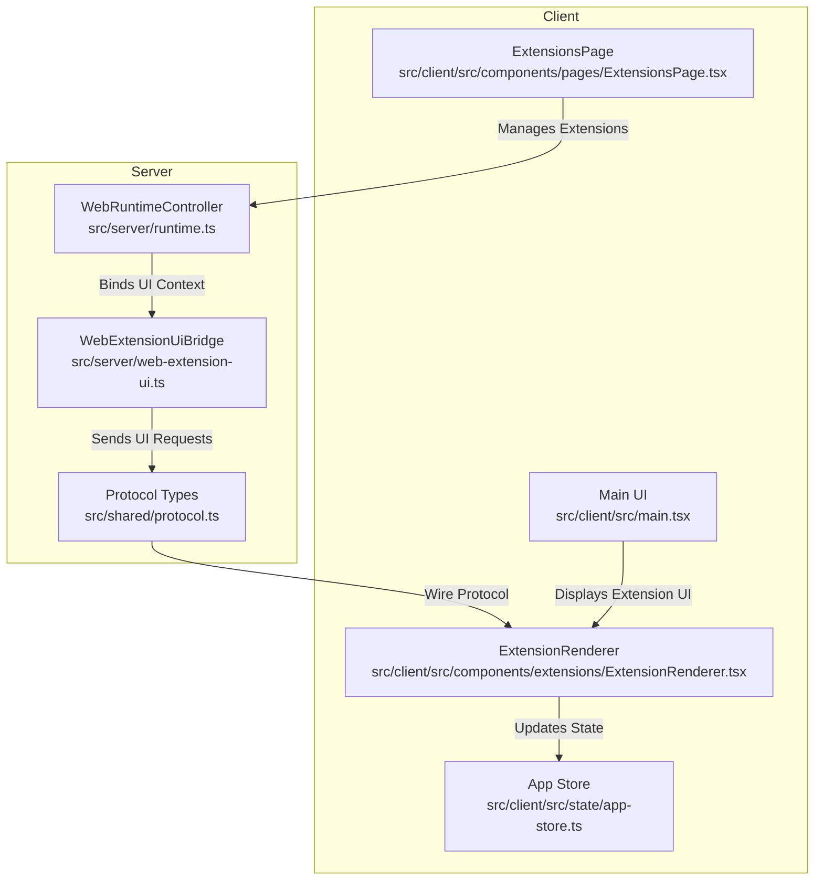
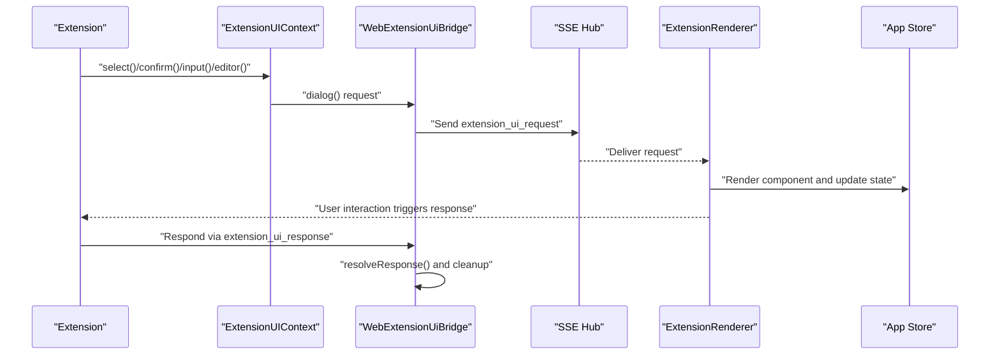
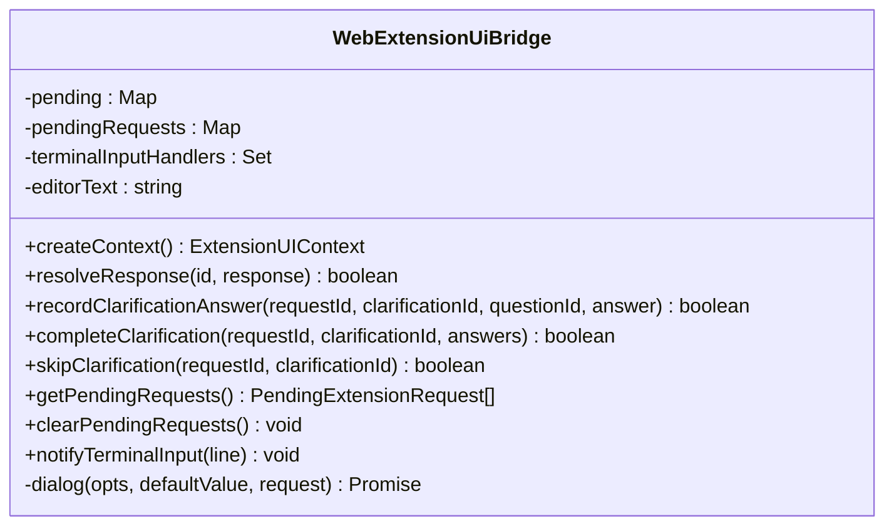
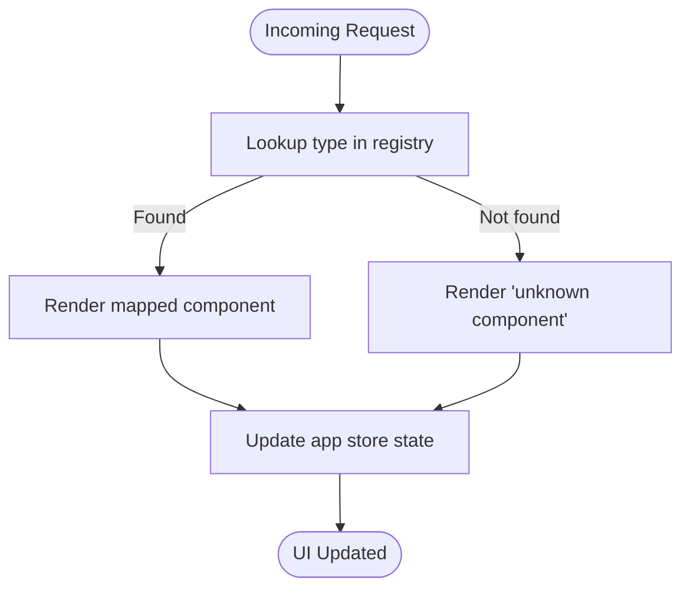
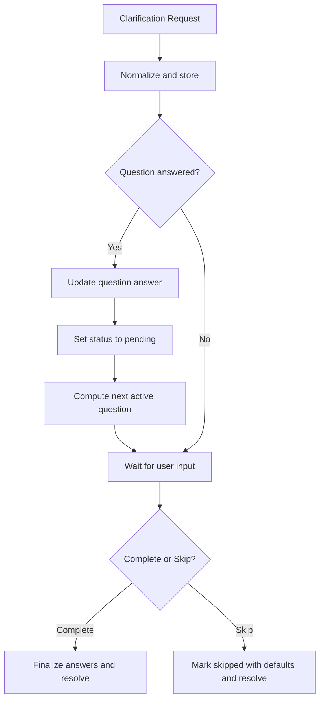
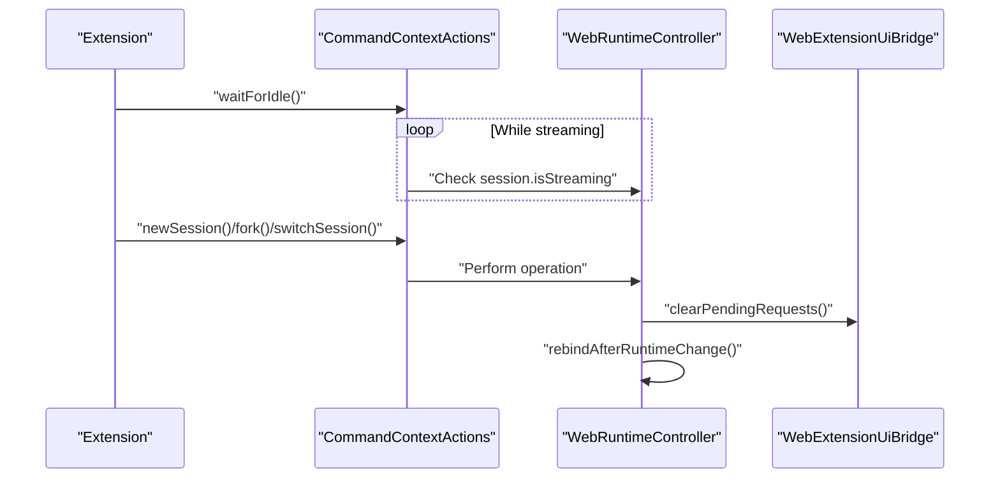
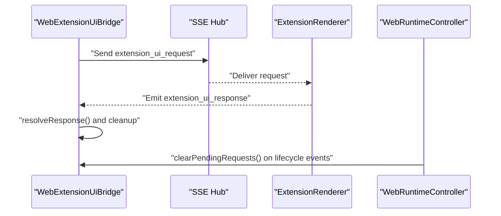
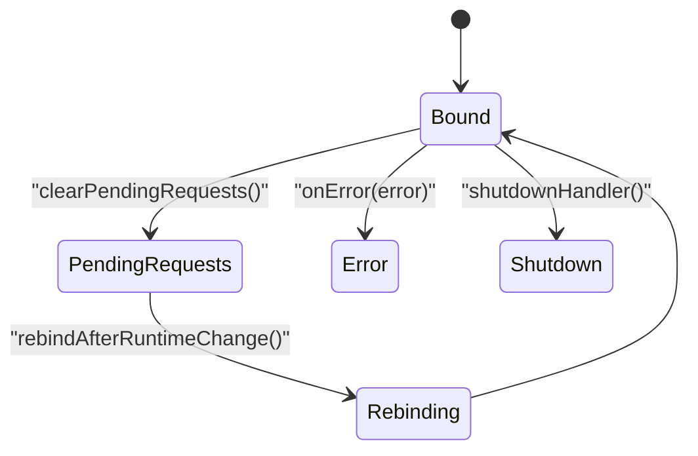
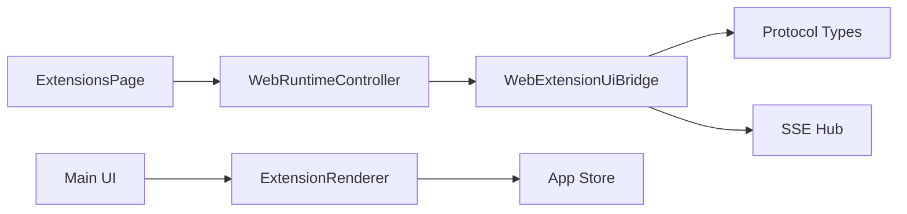

# Extension UI Bridge

<cite>
**Referenced Files in This Document**
- [web-extension-ui.ts](file://src/server/web-extension-ui.ts)
- [runtime.ts](file://src/server/runtime.ts)
- [protocol.ts](file://src/shared/protocol.ts)
- [ExtensionRenderer.tsx](file://src/client/src/components/extensions/ExtensionRenderer.tsx)
- [ExtensionsPage.tsx](file://src/client/src/components/pages/ExtensionsPage.tsx)
- [main.tsx](file://src/client/src/main.tsx)
- [app-store.ts](file://src/client/src/state/app-store.ts)
- [api.ts](file://src/client/src/lib/api.ts)
- [web-extension-ui.test.ts](file://test/web-extension-ui.test.ts)
</cite>

## Table of Contents
1. [Introduction](#introduction)
2. [Project Structure](#project-structure)
3. [Core Components](#core-components)
4. [Architecture Overview](#architecture-overview)
5. [Detailed Component Analysis](#detailed-component-analysis)
6. [Dependency Analysis](#dependency-analysis)
7. [Performance Considerations](#performance-considerations)
8. [Troubleshooting Guide](#troubleshooting-guide)
9. [Conclusion](#conclusion)

## Introduction
The Extension UI Bridge system enables rich extension components to integrate seamlessly with the web interface. It provides a controlled context for extensions to request UI interactions, manage state, and communicate bidirectionally with the web runtime. This document explains the context creation pattern, command context actions, UI request handling, lifecycle management, registration of UI components, bidirectional communication, rendering examples, event handling, security model, idle waiting mechanisms, and error reporting.

## Project Structure
The Extension UI Bridge spans server-side and client-side components:
- Server-side bridge: creates UI contexts, handles extension requests, and normalizes plan clarifications.
- Client-side renderer: renders extension UI components and updates application state.
- Shared protocol: defines the wire format for extension UI requests and responses.
- Runtime integration: binds extension UI context and command actions into the web runtime.

**Diagram sources**
- [web-extension-ui.ts:27-244](file://src/server/web-extension-ui.ts#L27-L244)
- [runtime.ts:1-200](file://src/server/runtime.ts#L1-L200)
- [protocol.ts:148-169](file://src/shared/protocol.ts#L148-L169)
- [ExtensionRenderer.tsx:1-138](file://src/client/src/components/extensions/ExtensionRenderer.tsx#L1-L138)
- [app-store.ts:186-252](file://src/client/src/state/app-store.ts#L186-L252)
- [ExtensionsPage.tsx:1-432](file://src/client/src/components/pages/ExtensionsPage.tsx#L1-L432)
- [main.tsx:1550-1555](file://src/client/src/main.tsx#L1550-L1555)

**Section sources**
- [web-extension-ui.ts:1-309](file://src/server/web-extension-ui.ts#L1-L309)
- [runtime.ts:1-200](file://src/server/runtime.ts#L1-L200)
- [protocol.ts:148-169](file://src/shared/protocol.ts#L148-L169)
- [ExtensionRenderer.tsx:1-138](file://src/client/src/components/extensions/ExtensionRenderer.tsx#L1-L138)
- [app-store.ts:186-252](file://src/client/src/state/app-store.ts#L186-L252)
- [ExtensionsPage.tsx:1-432](file://src/client/src/components/pages/ExtensionsPage.tsx#L1-L432)
- [main.tsx:1550-1555](file://src/client/src/main.tsx#L1550-L1555)

## Core Components
- WebExtensionUiBridge: central orchestrator for extension UI interactions, pending requests, plan clarifications, and SSE-based UI updates.
- Extension UI Context: a sandboxed API surface exposed to extensions via the runtime binding.
- ExtensionRenderer: client-side component registry that renders extension UI requests as React components.
- App Store: client-side state for widgets, sidebars, statuses, and toasts.
- Protocol Types: standardized request/response shapes for extension UI and agent events.

Key responsibilities:
- Context creation and lifecycle: create UI context, handle timeouts, abort signals, and cancellation.
- Plan clarification: normalize, track, update, and finalize clarification questions.
- UI request routing: translate context actions into SSE events consumed by the client.
- Client rendering: map request types to React components and update state.

**Section sources**
- [web-extension-ui.ts:27-244](file://src/server/web-extension-ui.ts#L27-L244)
- [protocol.ts:148-169](file://src/shared/protocol.ts#L148-L169)
- [ExtensionRenderer.tsx:18-26](file://src/client/src/components/extensions/ExtensionRenderer.tsx#L18-L26)
- [app-store.ts:44-58](file://src/client/src/state/app-store.ts#L44-L58)

## Architecture Overview
The bridge sits between the extension runtime and the web UI. Extensions request UI interactions through the UI context; the bridge forwards normalized requests via SSE to the client, which renders them using ExtensionRenderer and updates the app store.

**Diagram sources**
- [web-extension-ui.ts:204-243](file://src/server/web-extension-ui.ts#L204-L243)
- [protocol.ts:148-169](file://src/shared/protocol.ts#L148-L169)
- [ExtensionRenderer.tsx:12-16](file://src/client/src/components/extensions/ExtensionRenderer.tsx#L12-L16)
- [app-store.ts:219-239](file://src/client/src/state/app-store.ts#L219-L239)

## Detailed Component Analysis

### WebExtensionUiBridge
Responsibilities:
- Create UI context with methods for dialogs, notifications, status updates, widgets, sidebar, editor text manipulation, and terminal input forwarding.
- Manage pending requests with UUIDs, timeouts, and AbortSignal support.
- Normalize and track plan clarifications, enabling incremental updates and completion.
- Clear pending requests on session changes or runtime transitions.

**Diagram sources**
- [web-extension-ui.ts:27-244](file://src/server/web-extension-ui.ts#L27-L244)

**Section sources**
- [web-extension-ui.ts:27-244](file://src/server/web-extension-ui.ts#L27-L244)

### Extension UI Context Actions
The context exposes a rich API surface:
- Dialogs: select, confirm, input, editor, planClarification.
- Notifications: notify with severity.
- Status: setStatus, setWorkingMessage, setHiddenThinkingLabel.
- Widgets/Sidebar: setWidget, setSidebar.
- Editor: pasteToEditor, setEditorText, getEditorText, setTitle.
- Terminal: onTerminalInput subscription.
- Theme and tools: placeholders for theme and tools expansion.

These actions are translated into SSE extension_ui_request messages and rendered by ExtensionRenderer.

**Section sources**
- [web-extension-ui.ts:48-134](file://src/server/web-extension-ui.ts#L48-L134)
- [protocol.ts:148-159](file://src/shared/protocol.ts#L148-L159)

### ExtensionRenderer and UI Rendering
ExtensionRenderer maps request types to React components:
- Registry keys: filepicker, codeeditor, formbuilder, select, confirm, input, notify.
- Props: passed from the request payload; requestId used for correlating responses.
- Rendering: containerized with module styles; unknown types fall back to an “unknown componentÔÇØ message.

**Diagram sources**
- [ExtensionRenderer.tsx:12-16](file://src/client/src/components/extensions/ExtensionRenderer.tsx#L12-L16)
- [ExtensionRenderer.tsx:18-26](file://src/client/src/components/extensions/ExtensionRenderer.tsx#L18-L26)

**Section sources**
- [ExtensionRenderer.tsx:1-138](file://src/client/src/components/extensions/ExtensionRenderer.tsx#L1-L138)
- [app-store.ts:219-239](file://src/client/src/state/app-store.ts#L219-L239)

### Plan Clarification Handling
The bridge normalizes clarification requests, tracks active questions, and supports incremental updates and completion:
- Normalization: validates and enriches clarification state.
- Incremental updates: recordClarificationAnswer updates a single question.
- Completion: completeClarification finalizes answers and resolves the promise.
- Skipping: skipClarification marks clarification as skipped with defaults.

**Diagram sources**
- [web-extension-ui.ts:148-191](file://src/server/web-extension-ui.ts#L148-L191)
- [web-extension-ui.ts:246-292](file://src/server/web-extension-ui.ts#L246-L292)

**Section sources**
- [web-extension-ui.ts:148-191](file://src/server/web-extension-ui.ts#L148-L191)
- [web-extension-ui.ts:246-292](file://src/server/web-extension-ui.ts#L246-L292)

### Command Context Actions and Idle Waiting
The runtime provides command context actions that extensions can invoke:
- waitForIdle: waits until streaming completes.
- newSession, fork, switchSession, reload: lifecycle operations that rebind the extension context after changes.

**Diagram sources**
- [runtime.ts:120-200](file://src/server/runtime.ts#L120-L200)
- [web-extension-ui.ts:197-202](file://src/server/web-extension-ui.ts#L197-L202)

**Section sources**
- [runtime.ts:120-200](file://src/server/runtime.ts#L120-L200)
- [web-extension-ui.ts:197-202](file://src/server/web-extension-ui.ts#L197-L202)

### Bidirectional Communication and SSE
The bridge uses SSE to deliver UI requests to the client and receive responses:
- Server sends extension_ui_request messages with method-specific payloads.
- Client renders UI and emits extension_ui_response back to the server.
- The bridge resolves promises and cleans up pending state.

**Diagram sources**
- [protocol.ts:148-169](file://src/shared/protocol.ts#L148-L169)
- [web-extension-ui.ts:204-243](file://src/server/web-extension-ui.ts#L204-L243)
- [runtime.ts:120-200](file://src/server/runtime.ts#L120-L200)

**Section sources**
- [protocol.ts:148-169](file://src/shared/protocol.ts#L148-L169)
- [web-extension-ui.ts:204-243](file://src/server/web-extension-ui.ts#L204-L243)
- [runtime.ts:120-200](file://src/server/runtime.ts#L120-L200)

### Extension Lifecycle Management
Lifecycle hooks:
- Binding: bindCurrentSession sets up subscription and passes uiContext and commandContextActions.
- Session changes: newSession, switchSession, fork trigger clearPendingRequests and rebindAfterRuntimeChange.
- Shutdown: shutdownHandler and onError callbacks report extension lifecycle events and errors.

**Diagram sources**
- [runtime.ts:120-200](file://src/server/runtime.ts#L120-L200)
- [web-extension-ui.ts:197-202](file://src/server/web-extension-ui.ts#L197-L202)

**Section sources**
- [runtime.ts:120-200](file://src/server/runtime.ts#L120-L200)
- [web-extension-ui.ts:197-202](file://src/server/web-extension-ui.ts#L197-L202)

### Security Model
Security considerations:
- SSE-based isolation: UI requests are sent via SSE, keeping extension code separate from the main UI.
- Controlled context: extensions only receive a restricted API surface via ExtensionUIContext.
- Error reporting: onError callback forwards extension errors to the UI with stack traces.
- Token-based API: client API helpers support authentication tokens.

**Section sources**
- [runtime.ts:120-200](file://src/server/runtime.ts#L120-L200)
- [api.ts:1-59](file://src/client/src/lib/api.ts#L1-L59)

## Dependency Analysis
The Extension UI Bridge depends on:
- Shared protocol types for request/response shapes.
- SSE hub for event delivery.
- Client app store for state updates.
- Runtime controller for lifecycle and command actions.

**Diagram sources**
- [web-extension-ui.ts:1-309](file://src/server/web-extension-ui.ts#L1-L309)
- [protocol.ts:148-169](file://src/shared/protocol.ts#L148-L169)
- [ExtensionRenderer.tsx:1-138](file://src/client/src/components/extensions/ExtensionRenderer.tsx#L1-L138)
- [app-store.ts:186-252](file://src/client/src/state/app-store.ts#L186-L252)
- [runtime.ts:1-200](file://src/server/runtime.ts#L1-L200)
- [main.tsx:1550-1555](file://src/client/src/main.tsx#L1550-L1555)
- [ExtensionsPage.tsx:1-432](file://src/client/src/components/pages/ExtensionsPage.tsx#L1-L432)

**Section sources**
- [web-extension-ui.ts:1-309](file://src/server/web-extension-ui.ts#L1-L309)
- [protocol.ts:148-169](file://src/shared/protocol.ts#L148-L169)
- [ExtensionRenderer.tsx:1-138](file://src/client/src/components/extensions/ExtensionRenderer.tsx#L1-L138)
- [app-store.ts:186-252](file://src/client/src/state/app-store.ts#L186-L252)
- [runtime.ts:1-200](file://src/server/runtime.ts#L1-L200)
- [main.tsx:1550-1555](file://src/client/src/main.tsx#L1550-L1555)
- [ExtensionsPage.tsx:1-432](file://src/client/src/components/pages/ExtensionsPage.tsx#L1-L432)

## Performance Considerations
- Pending request cleanup: clearPendingRequests cancels outstanding UI interactions to avoid stale state.
- Timeout handling: dialog() respects timeout and AbortSignal to prevent indefinite waits.
- State pruning: app store limits widget/sidebars/statuses to manageable sizes.
- Plan clarification normalization: avoids redundant data and ensures minimal updates.

[No sources needed since this section provides general guidance]

## Troubleshooting Guide
Common scenarios:
- Pending requests remain unresolved after session change: verify clearPendingRequests is invoked during lifecycle transitions.
- Plan clarification not updating: ensure recordClarificationAnswer is called with matching requestId and clarificationId.
- UI not rendering: check ExtensionRenderer registry lookup and component props mapping.
- Errors from extensions: inspect onError callback messages and stacks.

Validation tests:
- Pending plan UI requests cleared on session change.

**Section sources**
- [web-extension-ui.test.ts:1-19](file://test/web-extension-ui.test.ts#L1-L19)
- [web-extension-ui.ts:197-202](file://src/server/web-extension-ui.ts#L197-L202)

## Conclusion
The Extension UI Bridge provides a robust, secure, and extensible mechanism for integrating extension UI interactions into the web interface. Through a controlled context, normalized plan clarifications, and SSE-driven communication, it supports rich extension experiences while maintaining clear lifecycle boundaries and error reporting. The client-side renderer and app store ensure responsive UI updates, and the runtime's command context actions enable extensions to coordinate with the broader system state.
