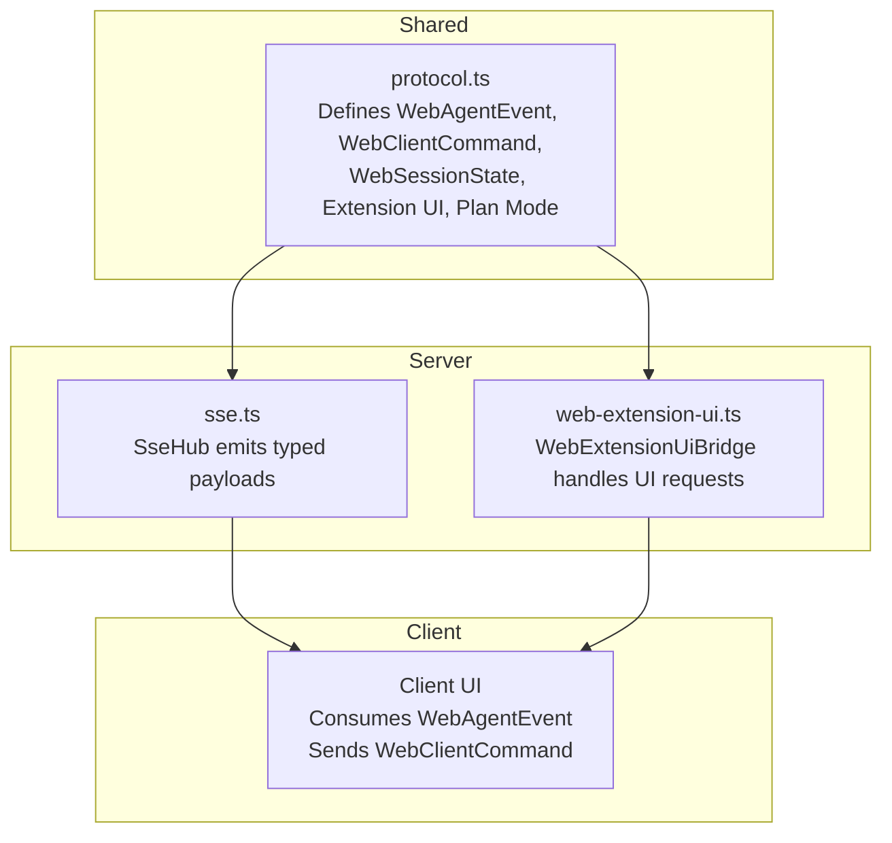
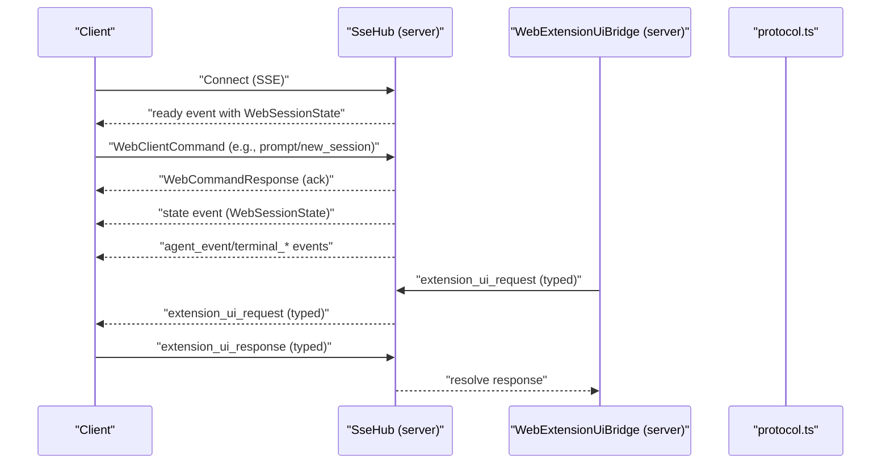
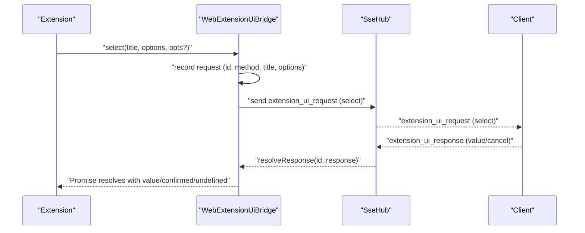
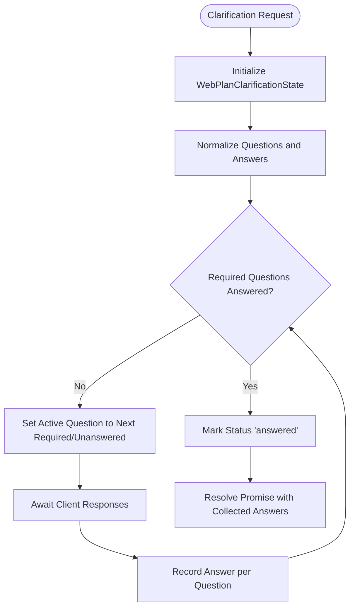
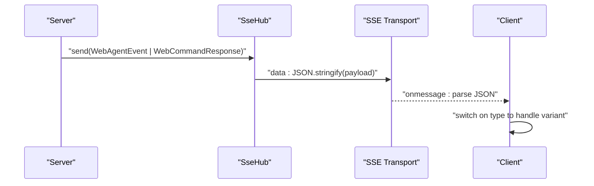
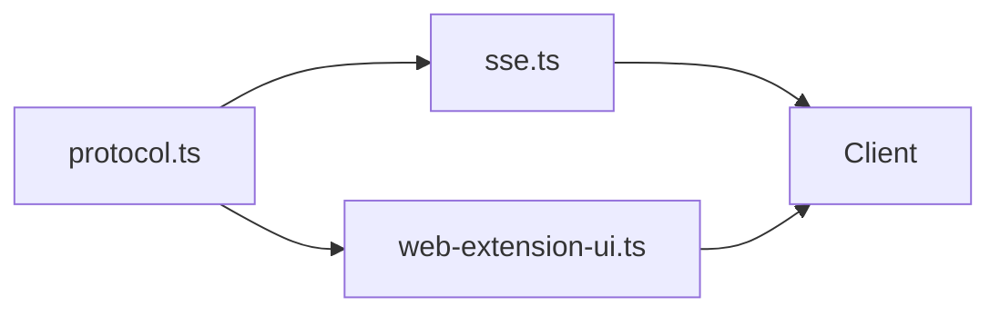

# Protocol Definitions

<cite>
**Referenced Files in This Document**
- [protocol.ts](file://src/shared/protocol.ts)
- [web-extension-ui.ts](file://src/server/web-extension-ui.ts)
- [sse.ts](file://src/server/sse.ts)
</cite>

## Table of Contents
1. [Introduction](#introduction)
2. [Project Structure](#project-structure)
3. [Core Components](#core-components)
4. [Architecture Overview](#architecture-overview)
5. [Detailed Component Analysis](#detailed-component-analysis)
6. [Dependency Analysis](#dependency-analysis)
7. [Performance Considerations](#performance-considerations)
8. [Troubleshooting Guide](#troubleshooting-guide)
9. [Conclusion](#conclusion)

## Introduction
This document specifies the shared protocol definitions enabling type-safe communication between the web client and server. It covers:
- WebAgentEvent types emitted by the server to the client
- WebClientCommand schemas accepted from the client
- WebSessionState structure representing the session's runtime state
- Extension UI protocol for interactive dialogs and UI updates
- Plan mode protocol for clarification and decision workflows
- Serialization/deserialization patterns, protocol versioning, and streaming vs synchronous operations
- Validation rules and error handling strategies

The protocol leverages TypeScript union types and strict interfaces to prevent runtime errors, ensuring compile-time guarantees for message shapes exchanged via Server-Sent Events.

## Project Structure
The protocol is defined centrally and consumed by both server and client:
- Shared protocol definitions live in a single module imported by both sides
- Server-side SSE hub emits typed events and responses
- Extension UI bridge translates extension requests into protocol messages and manages lifecycle resolution
- Client consumes events and sends commands typed at compile time

**Diagram sources**
- [protocol.ts:161-198](file://src/shared/protocol.ts#L161-L198)
- [sse.ts:1-32](file://src/server/sse.ts#L1-L32)
- [web-extension-ui.ts:27-244](file://src/server/web-extension-ui.ts#L27-L244)

**Section sources**
- [protocol.ts:161-198](file://src/shared/protocol.ts#L161-L198)
- [sse.ts:1-32](file://src/server/sse.ts#L1-L32)
- [web-extension-ui.ts:27-244](file://src/server/web-extension-ui.ts#L27-L244)

## Core Components
This section documents the primary protocol constructs and their roles.

- WebAgentEvent: Server-to-client events including ready/state updates, terminal streams, errors, and extension UI requests
- WebClientCommand: Client-to-server commands for prompting, session management, model/thinking settings, plan mode controls, and extension UI responses
- WebSessionState: Runtime snapshot of the session including model, thinking level, streaming flags, tool activation, working directory, conversation mode, and plan state
- WebExtensionUiRequest: Typed extension UI requests (select, confirm, input, editor, planClarification, notify, setStatus, setWidget, setSidebar, setTitle, set_editor_text)
- WebCommandResponse: Typed command acknowledgment with success/failure semantics

These types form a contract that prevents mismatched payloads and enables robust streaming and synchronous workflows.

**Section sources**
- [protocol.ts:161-198](file://src/shared/protocol.ts#L161-L198)
- [protocol.ts:132-146](file://src/shared/protocol.ts#L132-L146)
- [protocol.ts:148-159](file://src/shared/protocol.ts#L148-L159)
- [protocol.ts:195-198](file://src/shared/protocol.ts#L195-L198)

## Architecture Overview
The protocol operates over Server-Sent Events with a hub managing connections and broadcasting typed payloads. The extension UI bridge translates extension-driven UI needs into protocol messages and resolves them asynchronously.

**Diagram sources**
- [protocol.ts:161-198](file://src/shared/protocol.ts#L161-L198)
- [sse.ts:6-31](file://src/server/sse.ts#L6-L31)
- [web-extension-ui.ts:27-244](file://src/server/web-extension-ui.ts#L27-L244)

## Detailed Component Analysis

### WebAgentEvent Types
WebAgentEvent is a discriminated union of server-emitted events:
- Ready: Initial handshake with protocol version and session state plus initial messages
- State: Subsequent session state updates
- Agent event: Generic agent event payload
- Terminal events: Start, streaming output (stdout/stderr), and end with exit code/signal/timed-out
- Error: Human-readable error with optional stack
- Extension UI request: Typed extension UI prompts and updates

These variants ensure exhaustive handling on the client and prevent accidental misrouting of messages.

**Section sources**
- [protocol.ts:161-169](file://src/shared/protocol.ts#L161-L169)

### WebClientCommand Schemas
Client commands are strongly typed:
- Prompt: Message with optional images and streaming behavior; optional conversation mode
- Abort: Cancel ongoing operation
- Session management: New/open/switch/fork with identifiers
- Model/thinking settings: Set current model/provider, defaults, thinking level, and related toggles
- Auto-compaction and media policy: Enable/disable auto-compaction and image blocking/showing
- Terminal policy: Configure safe/allow-all/disabled modes
- Plan mode: Toggle plan mode and handle plan decisions/refinements and clarifications
- Slash command: Execute a named command with optional arguments
- Extension UI response: Resolve a prior extension_ui_request

Each variant carries only the fields required for that action, preventing invalid configurations.

**Section sources**
- [protocol.ts:171-193](file://src/shared/protocol.ts#L171-L193)

### WebSessionState Structure
WebSessionState captures the runtime state of a session:
- Identifiers and file metadata
- Model selection and thinking level
- Streaming and compaction flags
- Pending and total message counts
- Active tools and working directory
- Conversation mode
- Plan state including steps, decisions, and clarification

This structure allows the client to render accurate UI and maintain consistent state across updates.

**Section sources**
- [protocol.ts:132-146](file://src/shared/protocol.ts#L132-L146)

### Extension UI Protocol
The extension UI protocol enables extensions to request user input or update UI elements:
- Methods: select, confirm, input, editor, planClarification, notify, setStatus, setWidget, setSidebar, setTitle, set_editor_text
- Lifecycle: Requests are recorded with IDs; responses resolve promises on the server side
- Clarification: Supports multi-question workflows with required/optional questions, recommended options, and normalized answers
- Timeout and abort: Requests support timeouts and cancellation via AbortSignal

The bridge validates and normalizes incoming clarification requests and maintains request state until resolved.

**Diagram sources**
- [web-extension-ui.ts:27-244](file://src/server/web-extension-ui.ts#L27-L244)
- [protocol.ts:148-159](file://src/shared/protocol.ts#L148-L159)

**Section sources**
- [web-extension-ui.ts:27-244](file://src/server/web-extension-ui.ts#L27-L244)
- [protocol.ts:148-159](file://src/shared/protocol.ts#L148-L159)

### Plan Mode Protocol
Plan mode introduces structured planning with clarifications and decisions:
- WebPlanState: Tracks enabled/executing phase, steps, active step, pending decision, and clarification
- WebPlanPhase: Enumerates idle, clarifying, planning, ready, executing, complete
- WebPlanStep: Ordered steps with completion status
- WebPlanDecision: Decision nodes with options
- WebPlanClarificationState: Multi-question workflow with questions, active question, and status
- Commands: plan_decision, plan_refine, plan_clarification_answer, plan_clarification_complete, plan_clarification_skip

The server validates and normalizes clarification answers and transitions states accordingly.

**Diagram sources**
- [web-extension-ui.ts:148-191](file://src/server/web-extension-ui.ts#L148-L191)
- [web-extension-ui.ts:246-292](file://src/server/web-extension-ui.ts#L246-L292)

**Section sources**
- [protocol.ts:99-110](file://src/shared/protocol.ts#L99-L110)
- [protocol.ts:52-97](file://src/shared/protocol.ts#L52-L97)
- [web-extension-ui.ts:148-191](file://src/server/web-extension-ui.ts#L148-L191)
- [web-extension-ui.ts:246-292](file://src/server/web-extension-ui.ts#L246-L292)

### Type Safety and Runtime Error Prevention
- Discriminated unions: Each event/command has a unique type field enabling exhaustive switch handling on the client
- Strict interfaces: Fields are typed precisely; optional fields are marked optional
- JSON-compatible primitives: JsonValue ensures payloads are serializable
- SSE typing: SseHub accepts only WebAgentEvent or WebCommandResponse, preventing arbitrary payloads
- Extension UI normalization: Incoming clarification requests are validated and normalized before dispatch

These measures eliminate common runtime errors such as missing fields, wrong types, and malformed messages.

**Section sources**
- [protocol.ts:4](file://src/shared/protocol.ts#L4)
- [protocol.ts:161-198](file://src/shared/protocol.ts#L161-L198)
- [sse.ts:4](file://src/server/sse.ts#L4)

### Event Serialization and Deserialization
- Serialization: Server converts typed payloads to JSON and writes them as SSE data lines
- Deserialization: Client receives JSON and expects a top-level type discriminator to route handling
- Extension UI: Requests/responses carry a stable ID allowing correlation across the wire

**Diagram sources**
- [sse.ts:21-26](file://src/server/sse.ts#L21-L26)
- [protocol.ts:161-198](file://src/shared/protocol.ts#L161-L198)

**Section sources**
- [sse.ts:21-26](file://src/server/sse.ts#L21-L26)

### Protocol Versioning Strategy
- Ready event includes a protocolVersion field to signal compatibility
- Clients can guard against future breaking changes by checking version
- Backward-compatible additions can extend existing unions/fields without bumping version

**Section sources**
- [protocol.ts:162](file://src/shared/protocol.ts#L162)

### Streaming vs Synchronous Operations
- Streaming: Terminal output events arrive incrementally; client renders progressively
- Synchronous: Commands return WebCommandResponse immediately upon acceptance or failure
- Hybrid: Plan mode combines streaming-like incremental updates with synchronous command acknowledgments

**Section sources**
- [protocol.ts:165-167](file://src/shared/protocol.ts#L165-L167)
- [protocol.ts:195-198](file://src/shared/protocol.ts#L195-L198)

### Relationship Between Web Types and Underlying AgentSession Types
- WebSessionState mirrors AgentSession runtime state (model, thinking level, tools, cwd, plan)
- WebAgentEvent mirrors AgentSession events (ready, state, terminal, error)
- WebClientCommand maps to AgentSession operations (prompt, session management, settings)
- Extension UI and plan mode are web-specific abstractions layered on top of the agent session

This separation keeps the agent domain agnostic while exposing a web-friendly surface.

**Section sources**
- [protocol.ts:132-146](file://src/shared/protocol.ts#L132-L146)
- [protocol.ts:161-169](file://src/shared/protocol.ts#L161-L169)
- [protocol.ts:171-193](file://src/shared/protocol.ts#L171-L193)

## Dependency Analysis
The protocol module is the central dependency for both server and client:
- Server depends on protocol types for SSE payloads and extension UI bridge
- Extension UI bridge depends on protocol types for clarification and request/response shapes
- SSE hub depends on protocol union types for payload typing

**Diagram sources**
- [protocol.ts:161-198](file://src/shared/protocol.ts#L161-L198)
- [sse.ts:1-32](file://src/server/sse.ts#L1-L32)
- [web-extension-ui.ts:1-309](file://src/server/web-extension-ui.ts#L1-L309)

**Section sources**
- [protocol.ts:161-198](file://src/shared/protocol.ts#L161-L198)
- [sse.ts:1-32](file://src/server/sse.ts#L1-L32)
- [web-extension-ui.ts:1-309](file://src/server/web-extension-ui.ts#L1-L309)

## Performance Considerations
- Prefer incremental terminal output events to avoid large payloads
- Batch state updates when possible to reduce UI re-renders
- Use timeouts and cancellations for long-running extension UI requests
- Keep plan clarification questions minimal and required fields clearly marked to reduce back-and-forth

## Troubleshooting Guide
Common issues and resolutions:
- Missing type discriminator: Ensure each event/command includes a type field; the client uses this to route handling
- Invalid clarification answer: Answers are normalized; ensure option IDs and text meet validation rules
- Aborted or timed-out requests: Respect AbortSignal and timeout options; clean up pending requests
- Serialization errors: Verify payloads are JSON-serializable; avoid cyclic references

Validation helpers:
- Clarification normalization enforces presence of IDs, trims text, and sets defaults
- Command responses distinguish success/failure for deterministic handling

**Section sources**
- [web-extension-ui.ts:246-292](file://src/server/web-extension-ui.ts#L246-L292)
- [web-extension-ui.ts:136-146](file://src/server/web-extension-ui.ts#L136-L146)
- [protocol.ts:195-198](file://src/shared/protocol.ts#L195-L198)

## Conclusion
The shared protocol establishes a type-safe contract between client and server, enabling robust streaming and synchronous operations. Its discriminated unions, strict interfaces, and SSE-based transport minimize runtime errors while supporting advanced features like plan mode and extension UI workflows. The ready event's protocol version field provides a foundation for forward-compatible evolution.
