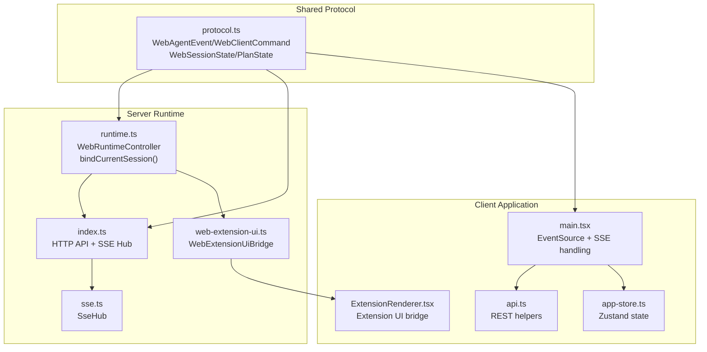
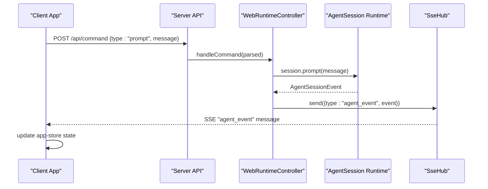
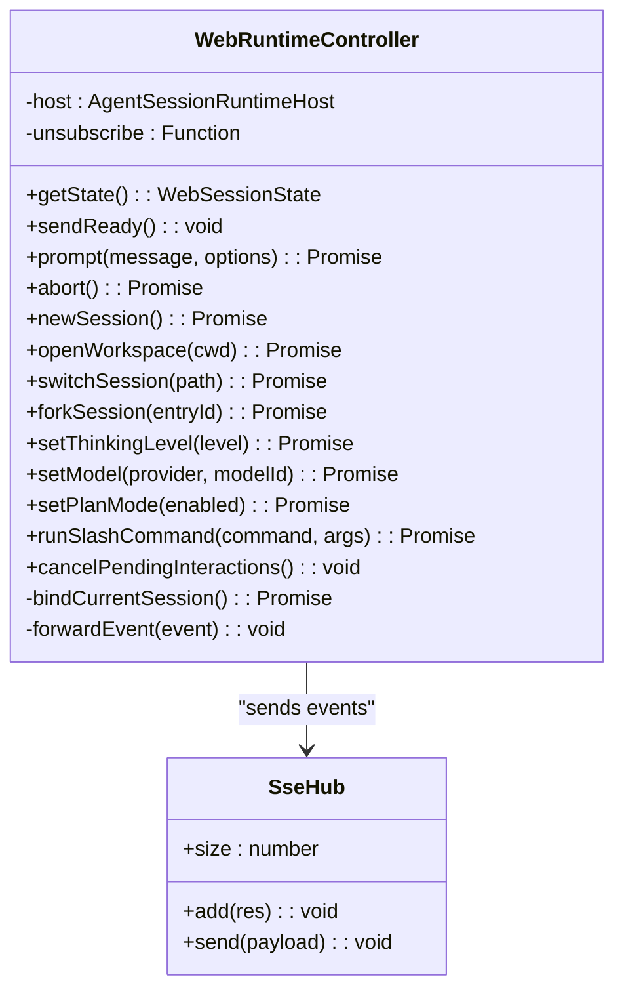
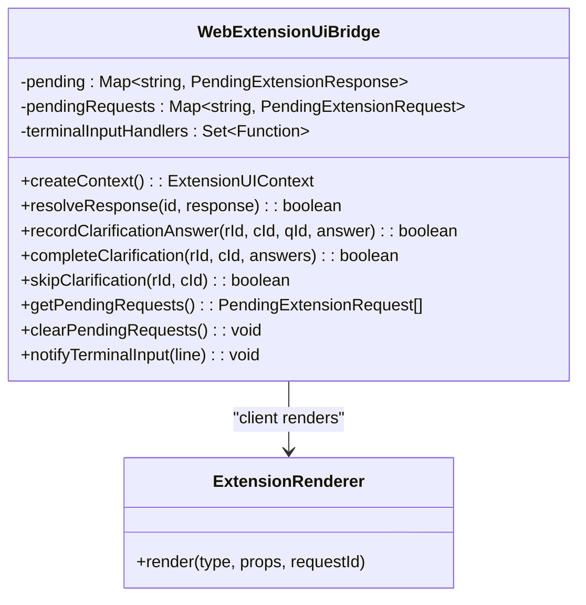
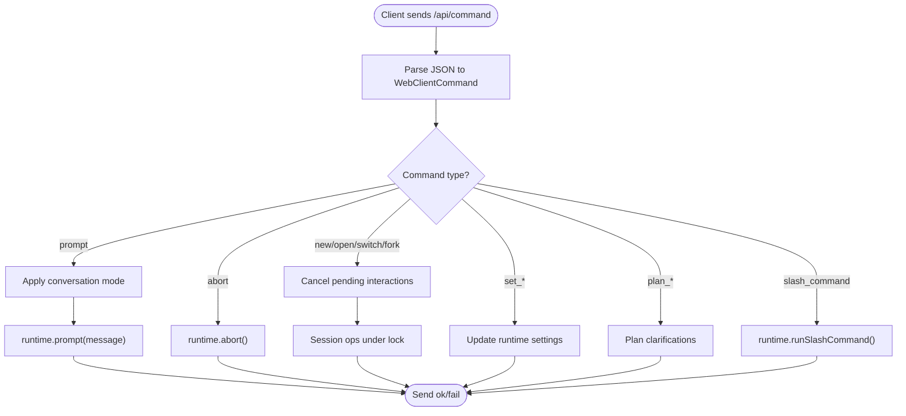
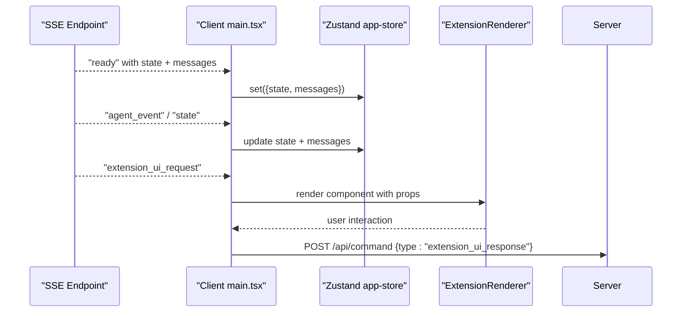
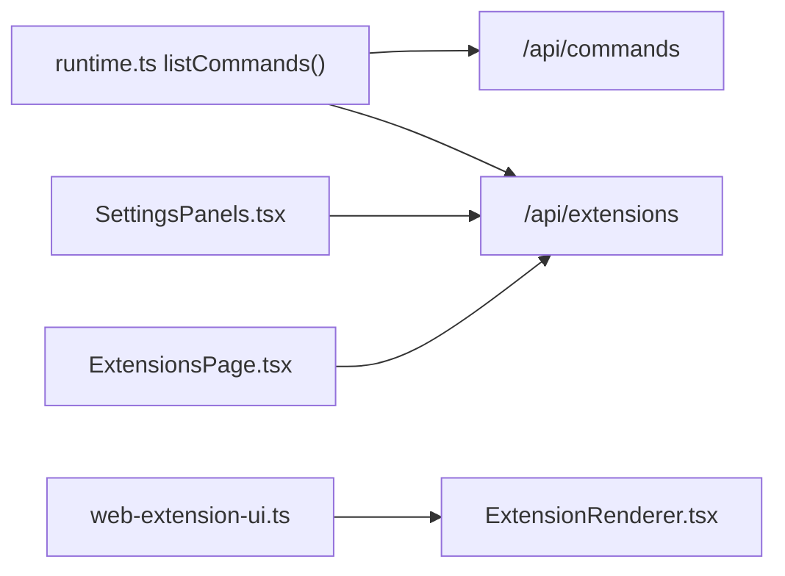
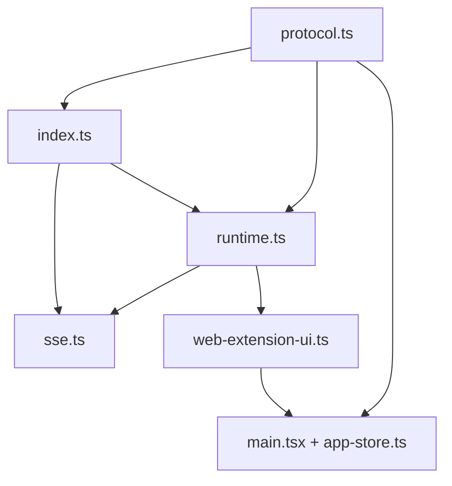

# Runtime Integration

<cite>
**Referenced Files in This Document**
- [protocol.ts](file://src/shared/protocol.ts)
- [runtime.ts](file://src/server/runtime.ts)
- [index.ts](file://src/server/index.ts)
- [sse.ts](file://src/server/sse.ts)
- [web-extension-ui.ts](file://src/server/web-extension-ui.ts)
- [main.tsx](file://src/client/src/main.tsx)
- [api.ts](file://src/client/src/lib/api.ts)
- [app-store.ts](file://src/client/src/state/app-store.ts)
- [ExtensionRenderer.tsx](file://src/client/src/components/extensions/ExtensionRenderer.tsx)
- [SettingsPanels.tsx](file://src/client/src/components/settings/SettingsPanels.tsx)
- [ExtensionsPage.tsx](file://src/client/src/components/pages/ExtensionsPage.tsx)
</cite>

## Table of Contents
1. [Introduction](#introduction)
2. [Project Structure](#project-structure)
3. [Core Components](#core-components)
4. [Architecture Overview](#architecture-overview)
5. [Detailed Component Analysis](#detailed-component-analysis)
6. [Dependency Analysis](#dependency-analysis)
7. [Performance Considerations](#performance-considerations)
8. [Troubleshooting Guide](#troubleshooting-guide)
9. [Conclusion](#conclusion)

## Introduction
This document explains the AgentSession runtime integration layer that connects the web interface to the shared AgentSession runtime. It covers the type-safe protocol definitions, the runtime host pattern, command processing through the AI engine, the extension UI bridge for custom tool integration, and how the system maintains consistency between web and TUI interfaces. It also documents the extension system architecture, tool registration patterns, and concurrency handling for multiple sessions and state management.

## Project Structure
The runtime integration spans three layers:
- Shared protocol definitions that define the type-safe contract between client and server.
- Server runtime controller that hosts the AgentSession runtime, exposes APIs, and streams events via Server-Sent Events (SSE).
- Client application that consumes SSE events, renders UI, and sends typed commands to the server.

**Diagram sources**
- [protocol.ts:1-198](file://src/shared/protocol.ts#L1-L198)
- [runtime.ts:12-456](file://src/server/runtime.ts#L12-L456)
- [index.ts:1-679](file://src/server/index.ts#L1-L679)
- [sse.ts:1-32](file://src/server/sse.ts#L1-L32)
- [web-extension-ui.ts:27-244](file://src/server/web-extension-ui.ts#L27-L244)
- [main.tsx:570-588](file://src/client/src/main.tsx#L570-L588)
- [api.ts:1-59](file://src/client/src/lib/api.ts#L1-L59)
- [app-store.ts:1-253](file://src/client/src/state/app-store.ts#L1-L253)
- [ExtensionRenderer.tsx:1-138](file://src/client/src/components/extensions/ExtensionRenderer.tsx#L1-L138)

**Section sources**
- [protocol.ts:1-198](file://src/shared/protocol.ts#L1-L198)
- [runtime.ts:12-456](file://src/server/runtime.ts#L12-L456)
- [index.ts:1-679](file://src/server/index.ts#L1-L679)
- [sse.ts:1-32](file://src/server/sse.ts#L1-L32)
- [web-extension-ui.ts:27-244](file://src/server/web-extension-ui.ts#L27-L244)
- [main.tsx:570-588](file://src/client/src/main.tsx#L570-L588)
- [api.ts:1-59](file://src/client/src/lib/api.ts#L1-L59)
- [app-store.ts:1-253](file://src/client/src/state/app-store.ts#L1-L253)
- [ExtensionRenderer.tsx:1-138](file://src/client/src/components/extensions/ExtensionRenderer.tsx#L1-L138)

## Core Components
- Type-safe protocol: Defines WebAgentEvent, WebClientCommand, WebSessionState, and plan-related structures used across client and server.
- Runtime controller: Hosts the AgentSession runtime, binds extension UI context, and forwards events to the client via SSE.
- SSE hub: Manages SSE connections and broadcasts typed events.
- Extension UI bridge: Translates extension UI requests into UI components and manages pending dialogs and clarifications.
- Client runtime integration: Subscribes to SSE, normalizes state/messages, and sends typed commands to the server.

**Section sources**
- [protocol.ts:161-198](file://src/shared/protocol.ts#L161-L198)
- [runtime.ts:12-456](file://src/server/runtime.ts#L12-L456)
- [sse.ts:6-31](file://src/server/sse.ts#L6-L31)
- [web-extension-ui.ts:27-244](file://src/server/web-extension-ui.ts#L27-L244)
- [main.tsx:570-588](file://src/client/src/main.tsx#L570-L588)

## Architecture Overview
The runtime integration follows a host pattern:
- The server initializes a WebRuntimeController bound to an AgentSession runtime.
- The controller subscribes to AgentSession events and forwards them as WebAgentEvent over SSE.
- The client subscribes to SSE and updates Zustand app state accordingly.
- Commands from the client are validated and executed by the runtime controller, which may trigger extension UI dialogs or plan clarifications.

**Diagram sources**
- [index.ts:255-374](file://src/server/index.ts#L255-L374)
- [runtime.ts:60-62](file://src/server/runtime.ts#L60-L62)
- [sse.ts:21-26](file://src/server/sse.ts#L21-L26)
- [main.tsx:573-578](file://src/client/src/main.tsx#L573-L578)

**Section sources**
- [index.ts:255-374](file://src/server/index.ts#L255-L374)
- [runtime.ts:452-455](file://src/server/runtime.ts#L452-L455)
- [sse.ts:21-26](file://src/server/sse.ts#L21-L26)
- [main.tsx:573-578](file://src/client/src/main.tsx#L573-L578)

## Detailed Component Analysis

### Protocol Definitions
The shared protocol defines:
- WebAgentEvent union for server-to-client events (ready, state, agent_event, terminal_*).
- WebClientCommand union for client-to-server commands (prompt, abort, session management, settings, plan actions).
- WebSessionState and plan state structures for UI synchronization.
- WebExtensionUiRequest union for extension-driven UI interactions.

These types ensure type safety across the client-server boundary and enable consistent state management in the UI.

**Section sources**
- [protocol.ts:161-198](file://src/shared/protocol.ts#L161-L198)
- [protocol.ts:132-146](file://src/shared/protocol.ts#L132-L146)
- [protocol.ts:148-159](file://src/shared/protocol.ts#L148-L159)

### Runtime Host Pattern
The WebRuntimeController encapsulates the AgentSession runtime host:
- Creates and binds the runtime host during initialization.
- Exposes typed methods for prompting, switching sessions, forking, setting models/thinking level, and toggling plan mode.
- Subscribes to AgentSession events and forwards them as WebAgentEvent over SSE.
- Normalizes plan state and emits ready/state events.

**Diagram sources**
- [runtime.ts:12-456](file://src/server/runtime.ts#L12-L456)
- [sse.ts:6-31](file://src/server/sse.ts#L6-L31)

**Section sources**
- [runtime.ts:12-456](file://src/server/runtime.ts#L12-L456)
- [sse.ts:6-31](file://src/server/sse.ts#L6-L31)

### Extension UI Bridge
The WebExtensionUiBridge translates extension UI requests into client-rendered components:
- Provides a context with methods like select, confirm, input, planClarification, notify, setStatus, setWidget, setSidebar, setTitle, setEditorText, and onTerminalInput.
- Maintains pending requests keyed by UUID and resolves promises when the client responds.
- Normalizes plan clarifications and tracks active questions and answers.
- Emits extension_ui_request events over SSE for the client to render.

**Diagram sources**
- [web-extension-ui.ts:27-244](file://src/server/web-extension-ui.ts#L27-L244)
- [ExtensionRenderer.tsx:12-26](file://src/client/src/components/extensions/ExtensionRenderer.tsx#L12-L26)

**Section sources**
- [web-extension-ui.ts:27-244](file://src/server/web-extension-ui.ts#L27-L244)
- [ExtensionRenderer.tsx:1-138](file://src/client/src/components/extensions/ExtensionRenderer.tsx#L1-L138)

### Command Processing Pipeline
The server routes commands from the client to the runtime:
- Validates and cancels pending interactions for session-changing commands.
- Applies conversation mode for prompts.
- Executes runtime operations (prompt, abort, session management, settings, plan actions).
- Returns typed command responses indicating success/failure.

**Diagram sources**
- [index.ts:255-374](file://src/server/index.ts#L255-L374)
- [runtime.ts:60-170](file://src/server/runtime.ts#L60-L170)

**Section sources**
- [index.ts:255-374](file://src/server/index.ts#L255-L374)
- [runtime.ts:60-170](file://src/server/runtime.ts#L60-L170)

### Client-Side SSE Handling and State Management
The client subscribes to SSE events and updates the UI:
- Uses EventSource to receive WebAgentEvent messages.
- Updates Zustand app-store with normalized messages and state snapshots.
- Handles extension_ui_request by rendering appropriate components and sending responses back to the server.
- Implements reconciliation logic to recover from network interruptions.

**Diagram sources**
- [main.tsx:573-578](file://src/client/src/main.tsx#L573-L578)
- [app-store.ts:186-252](file://src/client/src/state/app-store.ts#L186-L252)
- [ExtensionRenderer.tsx:12-26](file://src/client/src/components/extensions/ExtensionRenderer.tsx#L12-L26)
- [api.ts:9-25](file://src/client/src/lib/api.ts#L9-L25)

**Section sources**
- [main.tsx:570-588](file://src/client/src/main.tsx#L570-L588)
- [app-store.ts:186-252](file://src/client/src/state/app-store.ts#L186-L252)
- [ExtensionRenderer.tsx:1-138](file://src/client/src/components/extensions/ExtensionRenderer.tsx#L1-L138)
- [api.ts:9-25](file://src/client/src/lib/api.ts#L9-L25)

### Extension System Architecture and Tool Registration
- The server enumerates commands from built-in, prompt templates, and skills, exposing them via /api/commands and /api/extensions.
- The client renders extension toggles and skill lists in settings and extensions pages.
- The extension UI bridge maps extension UI requests to React components and manages lifecycle of pending requests.

**Diagram sources**
- [runtime.ts:233-287](file://src/server/runtime.ts#L233-L287)
- [SettingsPanels.tsx:465-511](file://src/client/src/components/settings/SettingsPanels.tsx#L465-L511)
- [ExtensionsPage.tsx:20-48](file://src/client/src/components/pages/ExtensionsPage.tsx#L20-L48)
- [web-extension-ui.ts:48-134](file://src/server/web-extension-ui.ts#L48-L134)
- [ExtensionRenderer.tsx:12-26](file://src/client/src/components/extensions/ExtensionRenderer.tsx#L12-L26)

**Section sources**
- [runtime.ts:233-287](file://src/server/runtime.ts#L233-L287)
- [SettingsPanels.tsx:465-511](file://src/client/src/components/settings/SettingsPanels.tsx#L465-L511)
- [ExtensionsPage.tsx:20-48](file://src/client/src/components/pages/ExtensionsPage.tsx#L20-L48)
- [web-extension-ui.ts:48-134](file://src/server/web-extension-ui.ts#L48-L134)
- [ExtensionRenderer.tsx:1-138](file://src/client/src/components/extensions/ExtensionRenderer.tsx#L1-L138)

### Concurrency and State Consistency
- Async lock ensures serialized session-changing operations.
- Single-flight terminal operations prevent overlapping runs.
- SSE-based state emission avoids polling and keeps UI synchronized.
- Client reconciliation logic periodically refreshes state when streaming stops or visibility changes.

**Section sources**
- [index.ts:72-73](file://src/server/index.ts#L72-L73)
- [index.ts:631-644](file://src/server/index.ts#L631-L644)
- [main.tsx:590-615](file://src/client/src/main.tsx#L590-L615)

## Dependency Analysis
The runtime integration exhibits low coupling and high cohesion:
- Server depends on shared protocol types and runtime controller.
- Client depends on protocol types and SSE for real-time updates.
- Extension UI bridge is decoupled from the runtime host and only interacts via SSE.

**Diagram sources**
- [protocol.ts:1-198](file://src/shared/protocol.ts#L1-L198)
- [runtime.ts:12-456](file://src/server/runtime.ts#L12-L456)
- [index.ts:1-679](file://src/server/index.ts#L1-L679)
- [sse.ts:1-32](file://src/server/sse.ts#L1-L32)
- [web-extension-ui.ts:27-244](file://src/server/web-extension-ui.ts#L27-L244)
- [main.tsx:570-588](file://src/client/src/main.tsx#L570-L588)
- [app-store.ts:186-252](file://src/client/src/state/app-store.ts#L186-L252)

**Section sources**
- [protocol.ts:1-198](file://src/shared/protocol.ts#L1-L198)
- [runtime.ts:12-456](file://src/server/runtime.ts#L12-L456)
- [index.ts:1-679](file://src/server/index.ts#L1-L679)
- [sse.ts:1-32](file://src/server/sse.ts#L1-L32)
- [web-extension-ui.ts:27-244](file://src/server/web-extension-ui.ts#L27-L244)
- [main.tsx:570-588](file://src/client/src/main.tsx#L570-L588)
- [app-store.ts:186-252](file://src/client/src/state/app-store.ts#L186-L252)

## Performance Considerations
- SSE minimizes latency for real-time updates compared to polling.
- Client-side deduplication and normalization reduce memory overhead for long conversations.
- Tool output compaction prevents excessive DOM rendering for large tool results.
- Locks and single-flight mechanisms avoid race conditions during session operations.

[No sources needed since this section provides general guidance]

## Troubleshooting Guide
Common issues and resolutions:
- SSE connection drops: The client automatically refreshes state when the SSE error handler fires.
- Stuck pending UI requests: Clearing pending interactions cancels unresolved dialogs and resumes normal operation.
- Plan clarification conflicts: Answers are validated against the active clarification; mismatches raise errors and require re-sync.
- Terminal command routing: Terminal input handlers are notified of commands for TUI parity.

**Section sources**
- [main.tsx:579-582](file://src/client/src/main.tsx#L579-L582)
- [runtime.ts:118-121](file://src/server/runtime.ts#L118-L121)
- [web-extension-ui.ts:148-191](file://src/server/web-extension-ui.ts#L148-L191)
- [index.ts:635-643](file://src/server/index.ts#L635-L643)

## Conclusion
The runtime integration layer provides a robust, type-safe bridge between the web interface and the AgentSession runtime. Through a well-defined protocol, SSE-based event streaming, and a flexible extension UI bridge, it enables seamless command processing, plan mode orchestration, and consistent state management across web and TUI interfaces. The extension system and tool registration patterns further enhance customization and composability.
