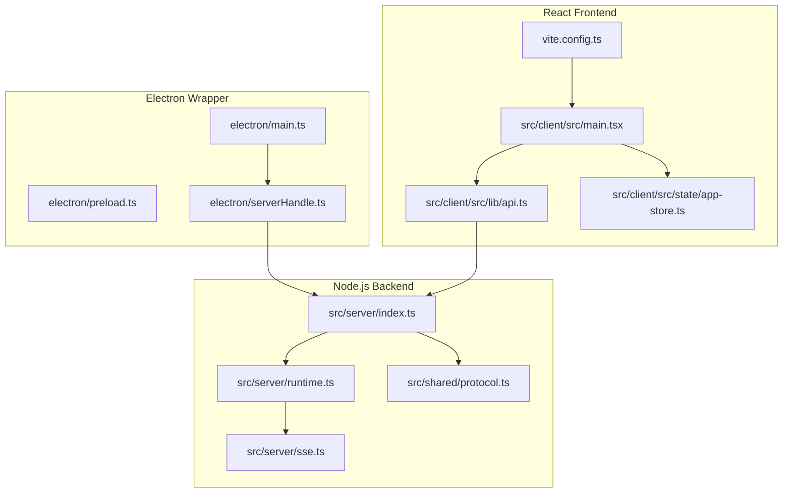
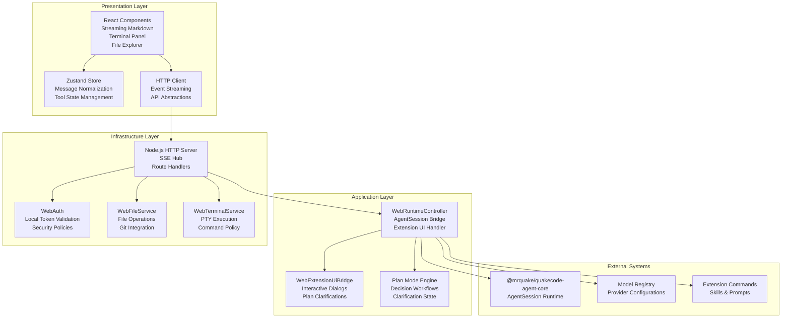
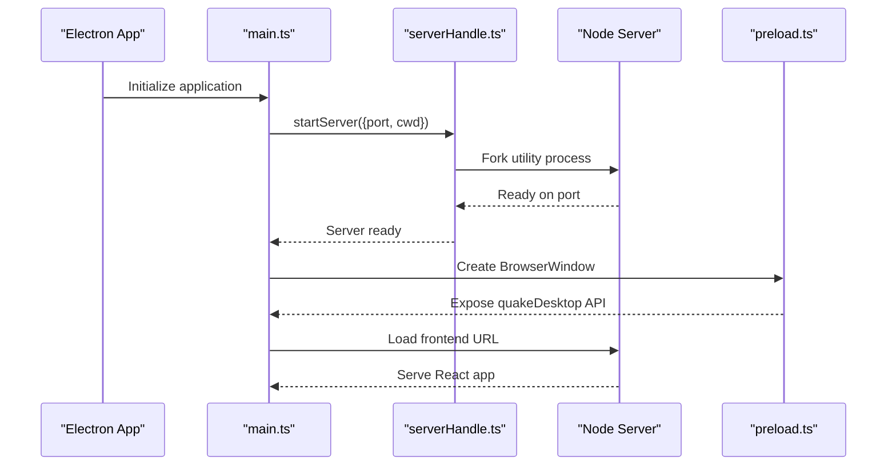
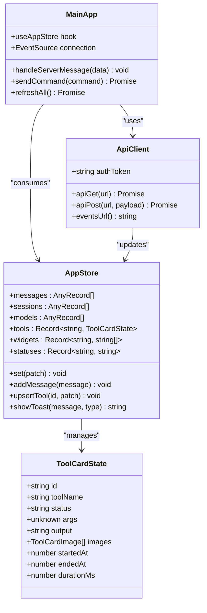
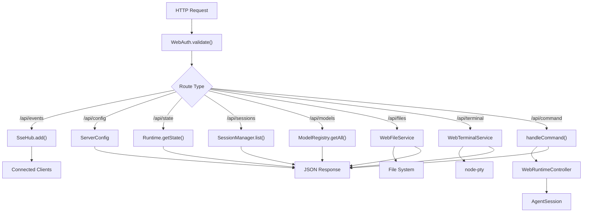
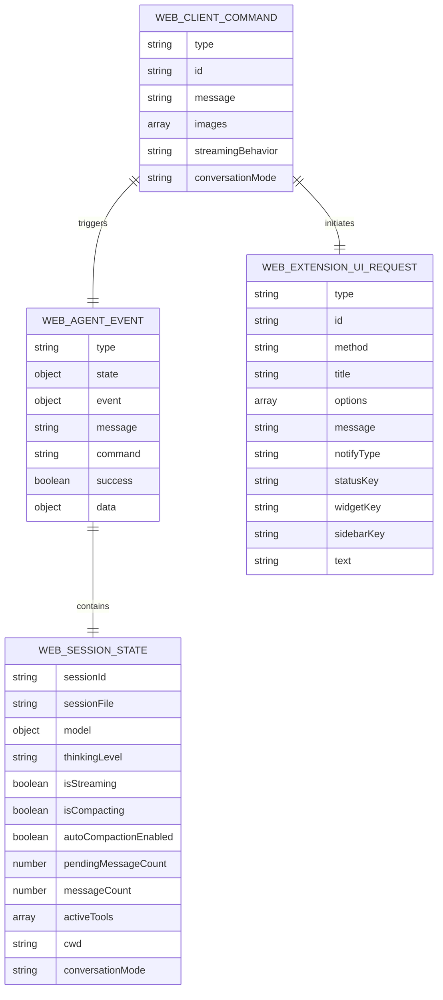
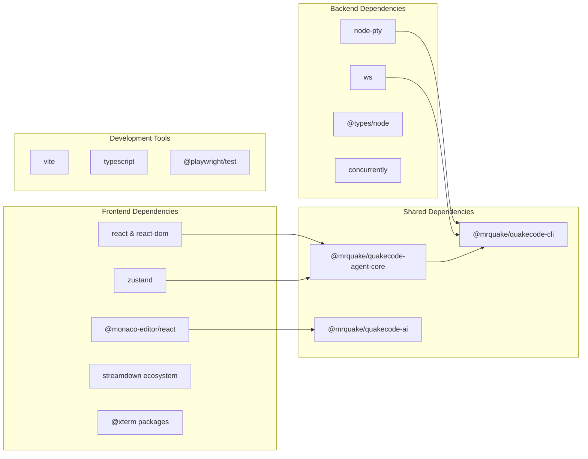

# System Overview

<cite>
**Referenced Files in This Document**
- [README.md](file://README.md)
- [package.json](file://package.json)
- [src/server/index.ts](file://src/server/index.ts)
- [src/server/runtime.ts](file://src/server/runtime.ts)
- [src/server/sse.ts](file://src/server/sse.ts)
- [src/server/web-extension-ui.ts](file://src/server/web-extension-ui.ts)
- [src/shared/protocol.ts](file://src/shared/protocol.ts)
- [src/client/src/main.tsx](file://src/client/src/main.tsx)
- [src/client/src/lib/api.ts](file://src/client/src/lib/api.ts)
- [src/client/src/state/app-store.ts](file://src/client/src/state/app-store.ts)
- [vite.config.ts](file://vite.config.ts)
- [electron/main.ts](file://electron/main.ts)
- [electron/preload.ts](file://electron/preload.ts)
- [electron/serverHandle.ts](file://electron/serverHandle.ts)
</cite>

## Table of Contents
1. [Introduction](#introduction)
2. [Project Structure](#project-structure)
3. [Core Components](#core-components)
4. [Architecture Overview](#architecture-overview)
5. [Detailed Component Analysis](#detailed-component-analysis)
6. [Dependency Analysis](#dependency-analysis)
7. [Performance Considerations](#performance-considerations)
8. [Troubleshooting Guide](#troubleshooting-guide)
9. [Conclusion](#conclusion)

## Introduction
Quake Code Web is a browser-native IDE shell that shares the same AgentSession runtime, model registry, session files, extensions, skills, and built-in tools as the terminal UI. It provides a modern React-based web interface with a Node.js backend and optional Electron desktop wrapper. The system emphasizes runtime parity, local-first security, and a layered architecture separating UI presentation, AI processing, and system services.

## Project Structure
The repository follows a clear separation of concerns:
- Frontend: React + TypeScript + Vite application under src/client/
- Backend: Node.js HTTP server under src/server/
- Shared contracts: Protocol definitions under src/shared/
- Desktop wrapper: Electron application under electron/

**Diagram sources**
- [electron/main.ts:1-171](file://electron/main.ts#L1-L171)
- [electron/preload.ts:1-15](file://electron/preload.ts#L1-L15)
- [electron/serverHandle.ts:1-47](file://electron/serverHandle.ts#L1-L47)
- [src/client/src/main.tsx:1-800](file://src/client/src/main.tsx#L1-L800)
- [src/client/src/lib/api.ts:1-59](file://src/client/src/lib/api.ts#L1-L59)
- [src/client/src/state/app-store.ts:1-253](file://src/client/src/state/app-store.ts#L1-L253)
- [vite.config.ts:1-50](file://vite.config.ts#L1-L50)
- [src/server/index.ts:1-679](file://src/server/index.ts#L1-L679)
- [src/server/runtime.ts:1-499](file://src/server/runtime.ts#L1-L499)
- [src/server/sse.ts:1-32](file://src/server/sse.ts#L1-L32)
- [src/shared/protocol.ts:1-198](file://src/shared/protocol.ts#L1-L198)

**Section sources**
- [README.md:18-103](file://README.md#L18-L103)
- [package.json:1-69](file://package.json#L1-L69)

## Core Components
The system consists of three primary layers:

### Layer 1: UI Presentation (React Frontend)
The React application provides:
- Real-time event streaming via Server-Sent Events
- Interactive chat interface with streaming markdown rendering
- File explorer, terminal panel, and settings management
- State management using Zustand with sophisticated message normalization
- Responsive design with Tailwind CSS and custom theming

### Layer 2: AI Processing (AgentSession Runtime)
The runtime layer manages:
- AgentSession execution with streaming capabilities
- Plan mode orchestration and clarification workflows
- Extension UI bridge for interactive dialogs
- Model selection and thinking level controls
- Session management (new, switch, fork, resume)

### Layer 3: System Services (Node.js Backend)
The backend provides:
- HTTP API endpoints for file operations, terminal execution, and settings
- Authentication with local token validation
- Workspace management and Git integration
- Task scheduling and file mutation services
- Security policies and workspace allowlists

**Section sources**
- [src/client/src/main.tsx:145-800](file://src/client/src/main.tsx#L145-L800)
- [src/server/runtime.ts:12-499](file://src/server/runtime.ts#L12-L499)
- [src/server/index.ts:1-679](file://src/server/index.ts#L1-L679)

## Architecture Overview
The system employs a layered architecture with clear separation of concerns:

**Diagram sources**
- [src/client/src/main.tsx:145-800](file://src/client/src/main.tsx#L145-L800)
- [src/client/src/state/app-store.ts:186-253](file://src/client/src/state/app-store.ts#L186-L253)
- [src/client/src/lib/api.ts:9-59](file://src/client/src/lib/api.ts#L9-L59)
- [src/server/runtime.ts:12-499](file://src/server/runtime.ts#L12-L499)
- [src/server/web-extension-ui.ts](file://src/server/web-extension-ui.ts)
- [src/server/index.ts:1-679](file://src/server/index.ts#L1-L679)
- [src/server/auth.ts](file://src/server/auth.ts)
- [src/server/files.ts](file://src/server/files.ts)
- [src/server/terminal.ts](file://src/server/terminal.ts)

## Detailed Component Analysis

### Electron Desktop Wrapper
The Electron wrapper provides a native desktop experience while maintaining the same backend runtime:

**Diagram sources**
- [electron/main.ts:132-138](file://electron/main.ts#L132-L138)
- [electron/serverHandle.ts:17-31](file://electron/serverHandle.ts#L17-L31)
- [electron/preload.ts:5-14](file://electron/preload.ts#L5-L14)

The wrapper maintains strict security boundaries:
- Uses sandboxed renderer with context isolation
- Exposes only minimal desktop APIs via contextBridge
- Prevents external navigation outside localhost
- Manages separate Node.js process for backend

**Section sources**
- [electron/main.ts:1-171](file://electron/main.ts#L1-L171)
- [electron/serverHandle.ts:1-47](file://electron/serverHandle.ts#L1-L47)
- [electron/preload.ts:1-15](file://electron/preload.ts#L1-L15)

### React Frontend Architecture
The frontend implements a sophisticated state management system:

**Diagram sources**
- [src/client/src/state/app-store.ts:33-253](file://src/client/src/state/app-store.ts#L33-L253)
- [src/client/src/lib/api.ts:9-59](file://src/client/src/lib/api.ts#L9-L59)
- [src/client/src/main.tsx:145-800](file://src/client/src/main.tsx#L145-L800)

Key frontend features include:
- Sophisticated message deduplication and normalization
- Tool state management with automatic pruning
- Streaming markdown rendering with multiple engines
- Real-time synchronization via Server-Sent Events
- Responsive design with dynamic theming

**Section sources**
- [src/client/src/state/app-store.ts:1-253](file://src/client/src/state/app-store.ts#L1-L253)
- [src/client/src/main.tsx:1-800](file://src/client/src/main.tsx#L1-L800)
- [src/client/src/lib/api.ts:1-59](file://src/client/src/lib/api.ts#L1-L59)

### Node.js Backend Services
The backend implements a comprehensive HTTP API with security and service layering:

**Diagram sources**
- [src/server/index.ts:401-662](file://src/server/index.ts#L401-L662)
- [src/server/runtime.ts:12-499](file://src/server/runtime.ts#L12-L499)
- [src/server/sse.ts:6-32](file://src/server/sse.ts#L6-L32)

The backend provides:
- Comprehensive file system operations with safety limits
- Secure terminal execution with policy enforcement
- Git integration for workspace management
- Task scheduling and automation
- Extension UI bridge for interactive workflows

**Section sources**
- [src/server/index.ts:1-679](file://src/server/index.ts#L1-L679)
- [src/server/runtime.ts:1-499](file://src/server/runtime.ts#L1-L499)
- [src/server/sse.ts:1-32](file://src/server/sse.ts#L1-L32)

### Protocol and Contract Layer
The shared protocol defines the communication contract between frontend and backend:

**Diagram sources**
- [src/shared/protocol.ts:171-198](file://src/shared/protocol.ts#L171-L198)
- [src/shared/protocol.ts:161-170](file://src/shared/protocol.ts#L161-L170)
- [src/shared/protocol.ts:148-159](file://src/shared/protocol.ts#L148-L159)
- [src/shared/protocol.ts:132-146](file://src/shared/protocol.ts#L132-L146)

**Section sources**
- [src/shared/protocol.ts:1-198](file://src/shared/protocol.ts#L1-198)

## Dependency Analysis
The system exhibits strong modular separation with well-defined boundaries:

**Diagram sources**
- [package.json:25-67](file://package.json#L25-L67)

Key dependency characteristics:
- Frontend focuses on UI libraries and rendering
- Backend emphasizes system services and security
- Shared core packages provide runtime parity
- Development tools support testing and building

**Section sources**
- [package.json:1-69](file://package.json#L1-L69)

## Performance Considerations
The system implements several performance optimization strategies:

### Streaming Architecture
- Server-Sent Events for real-time updates without WebSocket overhead
- Incremental message updates with deduplication
- Tool state management with automatic pruning
- Virtualized lists for large datasets

### Resource Management
- Memory-efficient message normalization with identity hashing
- Output truncation for long tool results
- Chunked file previews with size limits
- Automatic cleanup of inactive tools and messages

### Build Optimization
- Code splitting for heavy components (Monaco Editor, terminals)
- Vendor chunking for React and Monaco dependencies
- Proxy configuration for development efficiency
- Tailwind CSS isolation for build stability

## Troubleshooting Guide
Common issues and resolutions:

### Authentication Problems
- Verify local token generation and injection
- Check QUAKE_WEB_TOKEN environment variable
- Ensure proper header forwarding in development proxy

### Runtime Issues
- Monitor SSE connection health and reconnect logic
- Check AgentSession subscription status
- Validate workspace path permissions and allowlists

### Performance Issues
- Monitor memory usage in Zustand store
- Check tool output size limits and truncation
- Verify streaming message deduplication effectiveness

**Section sources**
- [src/client/src/lib/api.ts:52-59](file://src/client/src/lib/api.ts#L52-L59)
- [src/client/src/main.tsx:573-588](file://src/client/src/main.tsx#L573-L588)
- [src/client/src/state/app-store.ts:70-184](file://src/client/src/state/app-store.ts#L70-L184)

## Conclusion
Quake Code Web demonstrates a well-architected system that successfully separates concerns across three distinct layers while maintaining runtime parity with the terminal interface. The React frontend provides a modern, responsive user experience, the Node.js backend delivers robust system services with strong security guarantees, and the Electron wrapper extends native capabilities while preserving architectural integrity.

The layered approach enables clear separation of responsibilities:
- UI presentation handles user interaction and rendering
- AI processing manages agent execution and plan orchestration  
- System services provide secure infrastructure and resource management

This architecture supports the project's goals of runtime parity, local-first security, and maintainable code organization while enabling future enhancements like WebSocket support and advanced multi-session capabilities.
