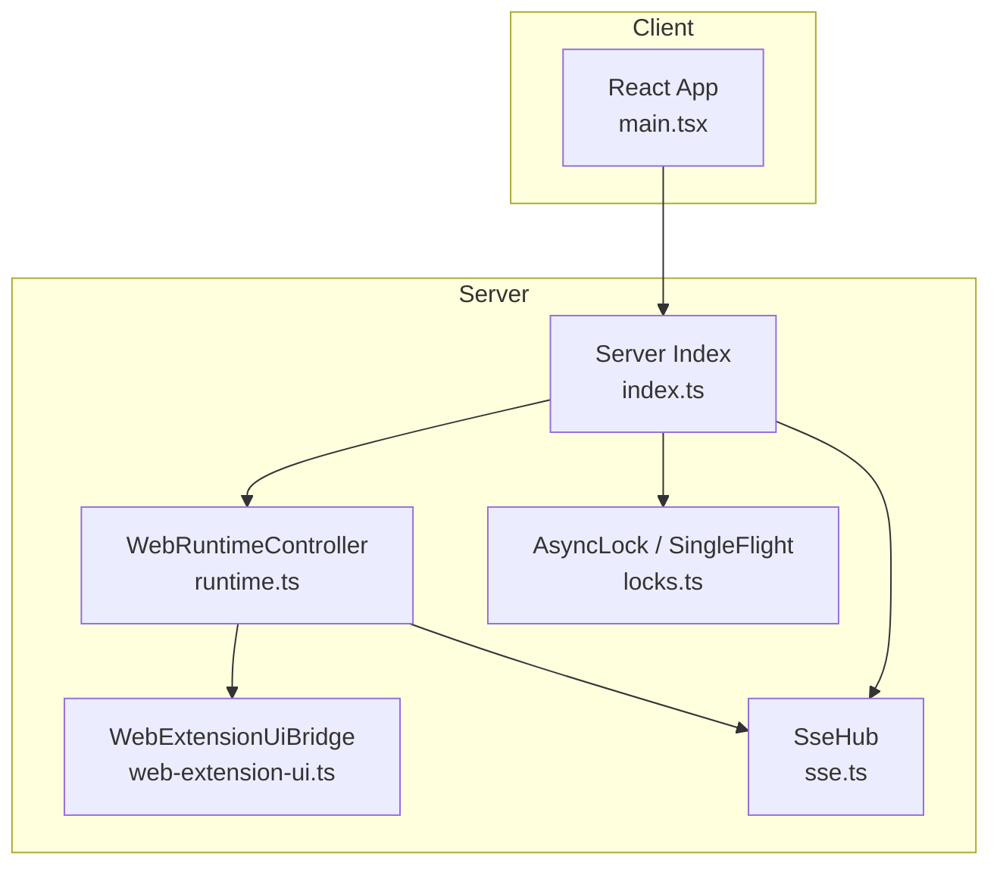
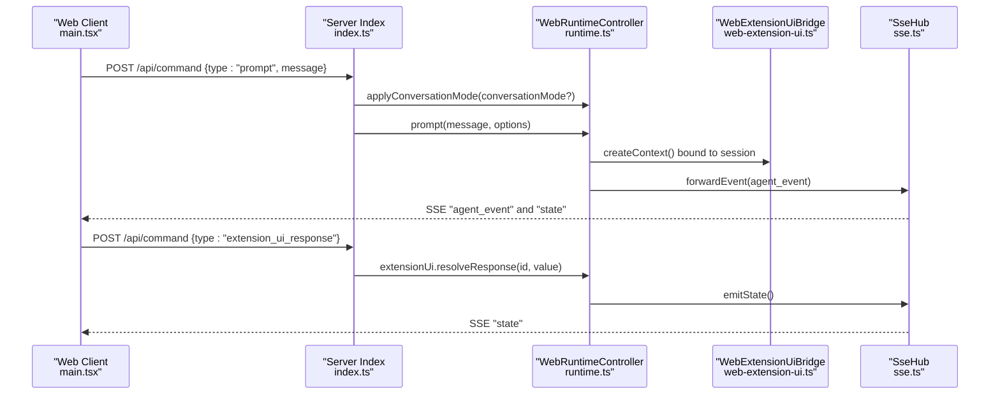
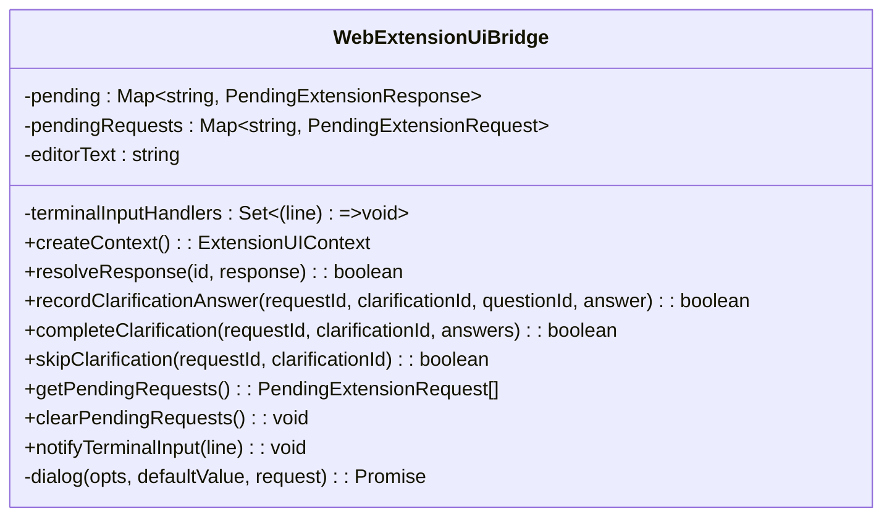
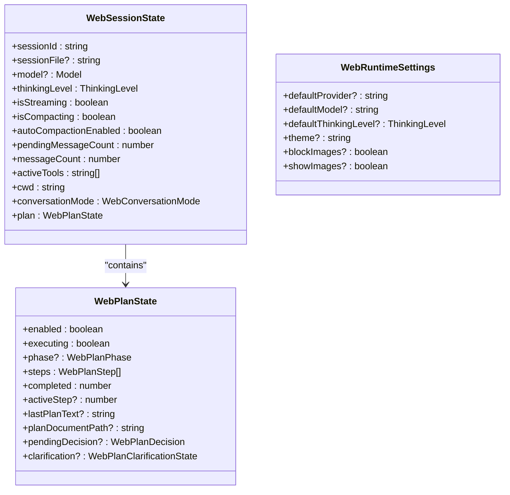
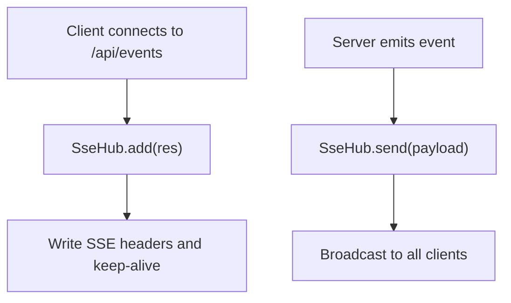
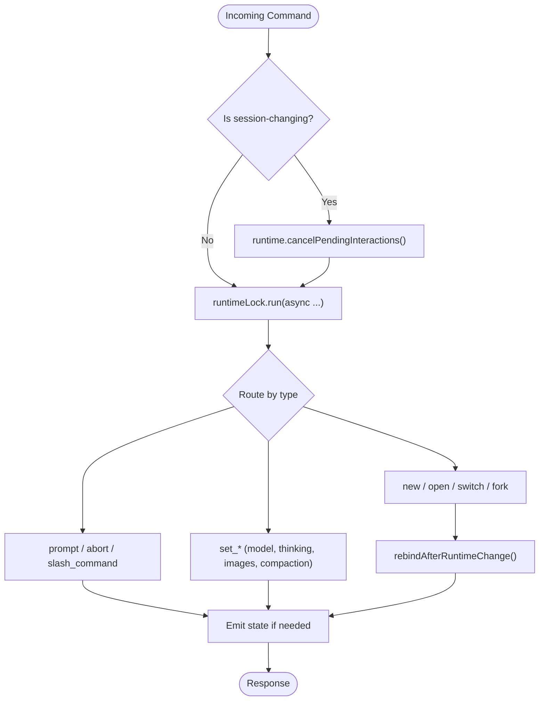
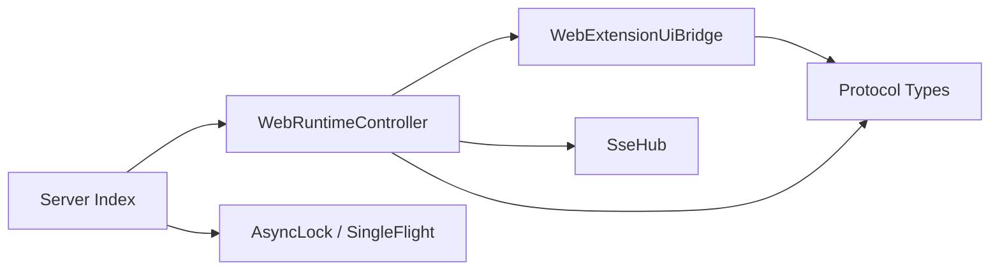

# AgentSession Runtime Controller

<cite>
**Referenced Files in This Document**
- [runtime.ts](file://src/server/runtime.ts)
- [web-extension-ui.ts](file://src/server/web-extension-ui.ts)
- [protocol.ts](file://src/shared/protocol.ts)
- [sse.ts](file://src/server/sse.ts)
- [index.ts](file://src/server/index.ts)
- [locks.ts](file://src/server/locks.ts)
- [main.tsx](file://src/client/src/main.tsx)
- [web-extension-ui.test.ts](file://test/web-extension-ui.test.ts)
</cite>

## Table of Contents
1. [Introduction](#introduction)
2. [Project Structure](#project-structure)
3. [Core Components](#core-components)
4. [Architecture Overview](#architecture-overview)
5. [Detailed Component Analysis](#detailed-component-analysis)
6. [Dependency Analysis](#dependency-analysis)
7. [Performance Considerations](#performance-considerations)
8. [Troubleshooting Guide](#troubleshooting-guide)
9. [Conclusion](#conclusion)

## Introduction
This document provides comprehensive technical documentation for the AgentSession runtime controller that bridges the web interface with the AI agent system. It covers runtime lifecycle management, session handling, command processing, state synchronization, conversation mode switching, thinking level control, model selection, and extension UI integration. It also explains the runtime lock mechanism, pending interaction cancellation, and error handling strategies, with practical examples for configuration, session management, and extension integration patterns.

## Project Structure
The runtime controller resides in the server module and integrates tightly with the web client via Server-Sent Events (SSE). The key components are:
- WebRuntimeController: Orchestrates the AgentSession runtime, manages sessions, handles commands, and synchronizes state.
- WebExtensionUiBridge: Manages extension UI requests, dialogs, and plan clarification workflows.
- Protocol types: Define the shared data contracts for state, commands, and events.
- SSE Hub: Streams real-time updates to the web client.
- Server entry point: Coordinates command routing, locking mechanisms, and service wiring.



**Diagram sources**
- [runtime.ts:12-456](file://src/server/runtime.ts#L12-L456)
- [web-extension-ui.ts:27-244](file://src/server/web-extension-ui.ts#L27-L244)
- [sse.ts:6-31](file://src/server/sse.ts#L6-L31)
- [index.ts:63-374](file://src/server/index.ts#L63-L374)
- [locks.ts:1-37](file://src/server/locks.ts#L1-L37)
- [main.tsx:365-398](file://src/client/src/main.tsx#L365-L398)

**Section sources**
- [runtime.ts:12-456](file://src/server/runtime.ts#L12-L456)
- [web-extension-ui.ts:27-244](file://src/server/web-extension-ui.ts#L27-L244)
- [protocol.ts:132-198](file://src/shared/protocol.ts#L132-L198)
- [sse.ts:6-31](file://src/server/sse.ts#L6-L31)
- [index.ts:63-374](file://src/server/index.ts#L63-L374)
- [locks.ts:1-37](file://src/server/locks.ts#L1-L37)
- [main.tsx:365-398](file://src/client/src/main.tsx#L365-L398)

## Core Components
- WebRuntimeController: Creates and hosts the AgentSession runtime, binds extension UI contexts, subscribes to session events, exposes session state, and handles commands for prompts, sessions, models, thinking levels, and plan mode.
- WebExtensionUiBridge: Provides an extension UI context, manages pending requests, resolves responses, and normalizes plan clarification states.
- Protocol types: Define WebSessionState, WebPlanState, WebRuntimeSettings, and command/event contracts for client-server communication.
- SSE Hub: Broadcasts ready/state/agent events and extension UI requests to the client.
- Server Index: Routes HTTP commands, applies runtime locks, and coordinates runtime operations.

**Section sources**
- [runtime.ts:12-456](file://src/server/runtime.ts#L12-L456)
- [web-extension-ui.ts:27-244](file://src/server/web-extension-ui.ts#L27-L244)
- [protocol.ts:132-198](file://src/shared/protocol.ts#L132-L198)
- [sse.ts:6-31](file://src/server/sse.ts#L6-L31)
- [index.ts:255-374](file://src/server/index.ts#L255-L374)

## Architecture Overview
The runtime controller sits between the web client and the AgentSession runtime. Commands from the client trigger server-side handlers that enforce concurrency control, update runtime state, and propagate changes via SSE.



**Diagram sources**
- [index.ts:255-374](file://src/server/index.ts#L255-L374)
- [runtime.ts:60-121](file://src/server/runtime.ts#L60-L121)
- [web-extension-ui.ts:136-146](file://src/server/web-extension-ui.ts#L136-L146)
- [sse.ts:21-26](file://src/server/sse.ts#L21-L26)

**Section sources**
- [index.ts:255-374](file://src/server/index.ts#L255-L374)
- [runtime.ts:60-121](file://src/server/runtime.ts#L60-L121)
- [web-extension-ui.ts:136-146](file://src/server/web-extension-ui.ts#L136-L146)
- [sse.ts:21-26](file://src/server/sse.ts#L21-L26)

## Detailed Component Analysis

### WebRuntimeController
Responsibilities:
- Lifecycle management: Create runtime, bind session, subscribe to events, and rebind after runtime changes.
- Session management: New, switch, fork, and workspace change operations with proper cancellation of pending interactions.
- State synchronization: Compute WebSessionState, derive plan state, and emit state updates.
- Command processing: Prompt, abort, slash commands, plan mode toggling, thinking level, model selection, and runtime settings.
- Extension integration: Bind extension UI context, expose command actions, and handle shutdown/onError callbacks.

Key methods and flows:
- Creation and binding: Initializes runtime, creates host, binds current session, and forwards events.
- State computation: Aggregates session metadata, active tools, and plan state into WebSessionState.
- Conversation mode switching: Applies plan mode based on requested mode and current plan state.
- Plan clarification: Records, completes, and skips plan clarifications with validation and state emission.
- Pending interaction cancellation: Clears pending extension UI requests and emits state.
- Session operations: Abort streaming, clear pending requests, and rebind after runtime/session changes.
- Runtime settings: Get and set default model/thinking level, image policies, and auto-compaction.

```mermaid
classDiagram
class WebRuntimeController {
-host : AgentSessionRuntimeHost
-unsubscribe() : void
+extensionUi : WebExtensionUiBridge
-currentCwd : string
+getState() : WebSessionState
+sendReady() : void
+prompt(message, options?) : Promise<void>
+setPlanMode(enabled) : Promise<void>
+applyConversationMode(mode) : Promise<void>
+recordPlanClarificationAnswer(args) : void
+completePlanClarification(args) : void
+skipPlanClarification(args) : void
+abort() : Promise<void>
+cancelPendingInteractions() : void
+newSession() : Promise<{cancelled : boolean}>
+openWorkspace(cwd) : Promise<void>
+switchSession(sessionPath) : Promise<{cancelled : boolean}>
+forkSession(entryId) : Promise<{cancelled : boolean}>
+setThinkingLevel(level) : Promise<void>
+getRuntimeSettings() : WebRuntimeSettings
+setDefaultModel(provider, modelId) : Promise<void>
+setDefaultThinkingLevel(level) : Promise<void>
+setAutoCompactionEnabled(enabled) : Promise<void>
+setBlockImages(blocked) : Promise<void>
+setShowImages(show) : Promise<void>
+listSessions(all?) : Promise<WebSessionSummary[]>
+listModels() : Promise<WebModelSummary[]>
+listCommands() : WebCommandInfo[]
+setModel(provider, modelId) : Promise<void>
+runSlashCommand(command, args?) : Promise<void>
-getPlanState() : WebPlanState
-toSessionSummary(session) : WebSessionSummary
-emitState() : void
-rebindAfterRuntimeChange() : Promise<void>
-bindCurrentSession() : Promise<void>
-createCommandActions() : ExtensionCommandContextActions
-forwardEvent(event) : void
}
```

**Diagram sources**
- [runtime.ts:12-456](file://src/server/runtime.ts#L12-L456)

**Section sources**
- [runtime.ts:12-456](file://src/server/runtime.ts#L12-L456)

### WebExtensionUiBridge
Responsibilities:
- Extension UI context creation: Provides select, confirm, input, planClarification, notify, terminal input hooks, status widgets, and editor text manipulation.
- Pending request management: Tracks pending dialogs and clarifications with timeouts and abort signals.
- Clarification handling: Normalizes, records, completes, and skips plan clarifications; resolves promises appropriately.
- Event forwarding: Sends extension UI requests via SSE and notifies terminal input handlers.



**Diagram sources**
- [web-extension-ui.ts:27-244](file://src/server/web-extension-ui.ts#L27-L244)

**Section sources**
- [web-extension-ui.ts:27-244](file://src/server/web-extension-ui.ts#L27-L244)

### Protocol Types
Defines the shared contracts for state, commands, and events:
- WebSessionState: Includes session identifiers, model, thinking level, streaming/compaction flags, message counts, active tools, cwd, and plan state.
- WebPlanState: Encapsulates plan enablement/executing flags, phase derivation, steps, completed counts, active step, plan document path, pending decisions, and clarifications.
- WebRuntimeSettings: Default provider/model/thinking level, theme, and image policies.
- Command and event contracts: Define client-to-server commands and server-to-client events.



**Diagram sources**
- [protocol.ts:132-198](file://src/shared/protocol.ts#L132-L198)

**Section sources**
- [protocol.ts:132-198](file://src/shared/protocol.ts#L132-L198)

### SSE Hub
Manages SSE connections and broadcasts events:
- Adds clients and maintains a set of active connections.
- Sends payload to all connected clients.
- Exposes connection count for monitoring.



**Diagram sources**
- [sse.ts:6-31](file://src/server/sse.ts#L6-L31)

**Section sources**
- [sse.ts:6-31](file://src/server/sse.ts#L6-L31)

### Server Command Routing and Locking
The server enforces concurrency control:
- Runtime lock: Ensures only one mutating operation runs at a time.
- Terminal single-flight: Prevents overlapping terminal operations.
- Precedence: Certain commands cancel pending interactions before acquiring the runtime lock.



**Diagram sources**
- [index.ts:255-374](file://src/server/index.ts#L255-L374)
- [locks.ts:1-37](file://src/server/locks.ts#L1-L37)

**Section sources**
- [index.ts:255-374](file://src/server/index.ts#L255-L374)
- [locks.ts:1-37](file://src/server/locks.ts#L1-L37)

## Dependency Analysis
- WebRuntimeController depends on:
  - AgentSession runtime host for session operations.
  - WebExtensionUiBridge for UI context and plan clarifications.
  - SSE Hub for state and event broadcasting.
- WebExtensionUiBridge depends on:
  - Protocol types for plan clarification and request shapes.
  - SSE Hub for forwarding UI requests.
- Server index depends on:
  - WebRuntimeController for command handling.
  - AsyncLock and SingleFlight for concurrency control.
  - Services for file, terminal, settings, and Git operations.



**Diagram sources**
- [runtime.ts:12-456](file://src/server/runtime.ts#L12-L456)
- [web-extension-ui.ts:27-244](file://src/server/web-extension-ui.ts#L27-L244)
- [protocol.ts:132-198](file://src/shared/protocol.ts#L132-L198)
- [index.ts:63-374](file://src/server/index.ts#L63-L374)
- [locks.ts:1-37](file://src/server/locks.ts#L1-L37)

**Section sources**
- [runtime.ts:12-456](file://src/server/runtime.ts#L12-L456)
- [web-extension-ui.ts:27-244](file://src/server/web-extension-ui.ts#L27-L244)
- [protocol.ts:132-198](file://src/shared/protocol.ts#L132-L198)
- [index.ts:63-374](file://src/server/index.ts#L63-L374)
- [locks.ts:1-37](file://src/server/locks.ts#L1-L37)

## Performance Considerations
- Concurrency control: The runtime lock prevents race conditions during session mutations; use it judiciously to avoid blocking long-running operations.
- SSE broadcasting: Minimal payload sizes and selective state emissions reduce bandwidth; avoid emitting frequent low-value updates.
- Plan clarifications: Pending requests are tracked per-dialog; ensure timeouts and abort signals are configured to prevent indefinite waits.
- Image handling: Block/show image settings can reduce payload sizes for streaming responses.
- Auto-compaction: Enable automatic compaction to manage memory and improve responsiveness in long sessions.

## Troubleshooting Guide
Common issues and resolutions:
- Pending plan clarification cannot be canceled: Ensure cancelPendingInteractions is called before session-changing commands and that the bridge resolves pending requests with cancellation sentinels.
- Plan mode toggle fails: Verify the plan-mode extension command exists and that the runtime confirms the plan state after prompting.
- Extension UI responses not received: Confirm that extension_ui_response commands are routed to the runtime and that the bridge resolves the pending promise with the appropriate value.
- State not updating: Check that forwardEvent emits state for significant events and that the client refreshes state appropriately.

Validation references:
- Pending plan interaction cancellation: The test suite verifies clearing pending requests and resolving them with cancellation.
- Runtime lock precedence: End-to-end tests assert that session-changing commands cancel pending interactions before acquiring the runtime lock.

**Section sources**
- [web-extension-ui.test.ts:4-17](file://test/web-extension-ui.test.ts#L4-L17)
- [index.ts:263-264](file://src/server/index.ts#L263-L264)

## Conclusion
The AgentSession runtime controller provides a robust bridge between the web interface and the AI agent system. It ensures safe, synchronized, and responsive interactions through careful lifecycle management, extension UI integration, and strict concurrency control. By leveraging the runtime lock, SSE state synchronization, and structured plan clarification workflows, it enables reliable conversation mode switching, model selection, thinking level control, and extension integration patterns.
