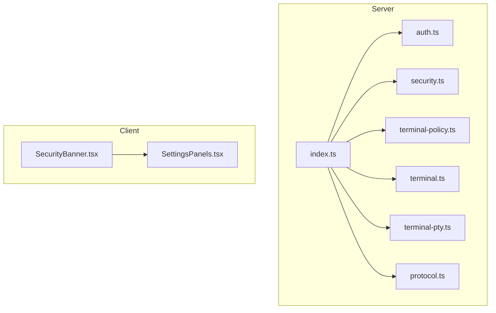
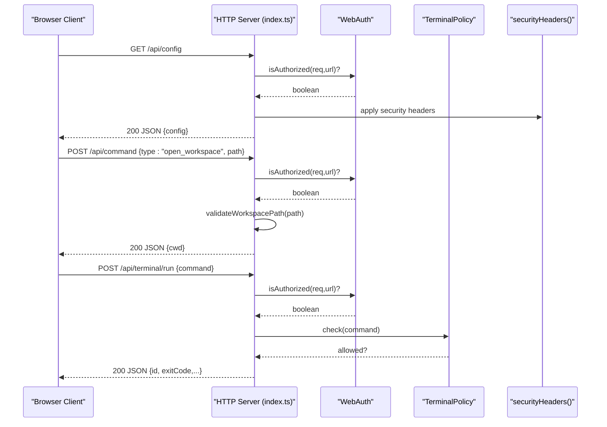
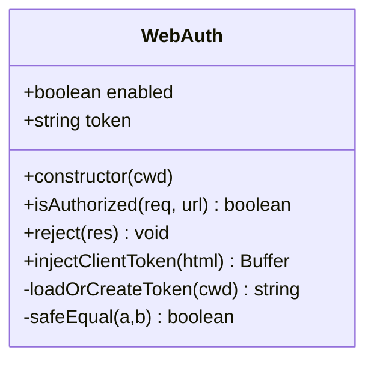
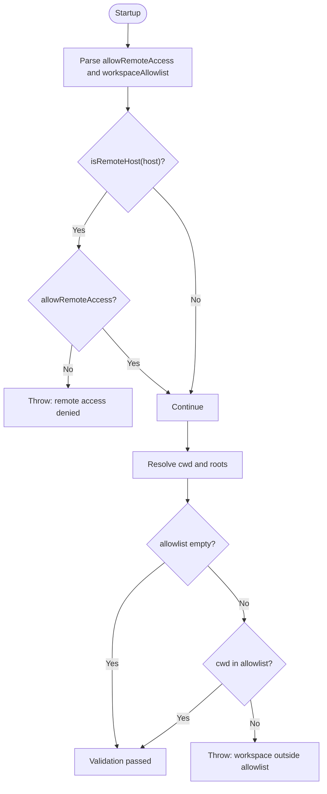
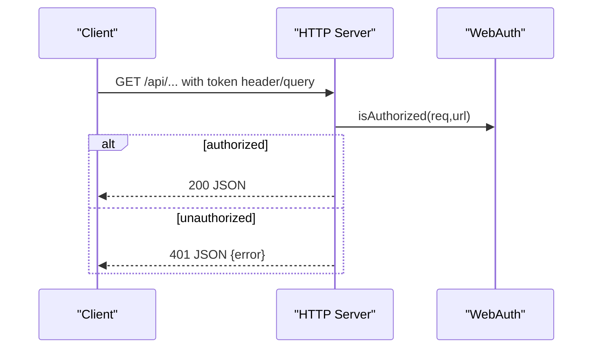
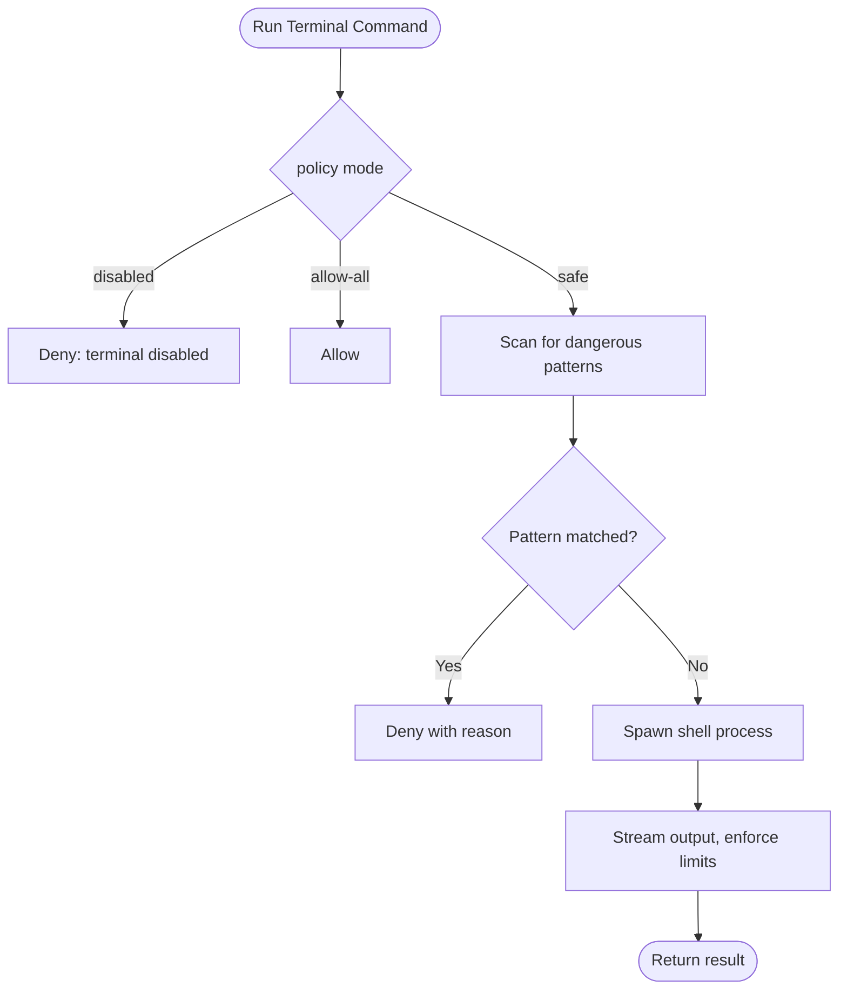
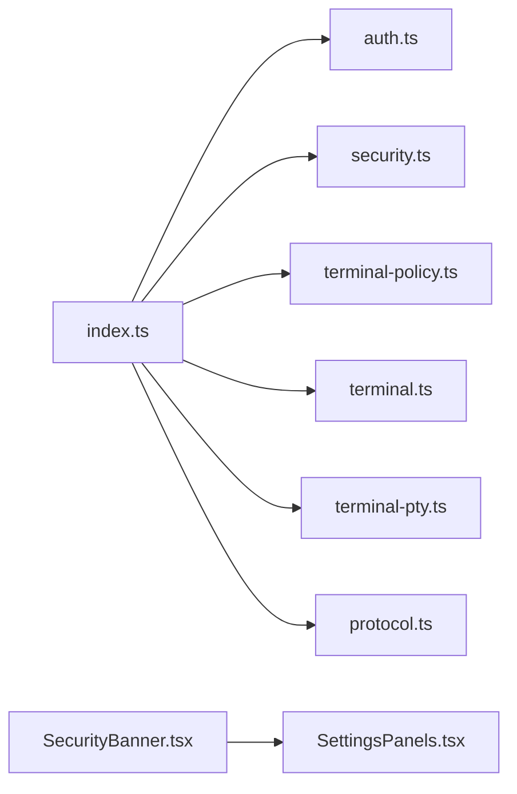

# Authentication and Security

<cite>
**Referenced Files in This Document**
- [auth.ts](file://src/server/auth.ts)
- [security.ts](file://src/server/security.ts)
- [index.ts](file://src/server/index.ts)
- [terminal-policy.ts](file://src/server/terminal-policy.ts)
- [terminal.ts](file://src/server/terminal.ts)
- [terminal-pty.ts](file://src/server/terminal-pty.ts)
- [SecurityBanner.tsx](file://src/client/src/components/security/SecurityBanner.tsx)
- [SettingsPanels.tsx](file://src/client/src/components/settings/SettingsPanels.tsx)
- [protocol.ts](file://src/shared/protocol.ts)
- [security.md](file://docs/security.md)
</cite>

## Table of Contents
1. [Introduction](#introduction)
2. [Project Structure](#project-structure)
3. [Core Components](#core-components)
4. [Architecture Overview](#architecture-overview)
5. [Detailed Component Analysis](#detailed-component-analysis)
6. [Dependency Analysis](#dependency-analysis)
7. [Performance Considerations](#performance-considerations)
8. [Troubleshooting Guide](#troubleshooting-guide)
9. [Conclusion](#conclusion)
10. [Appendices](#appendices)

## Introduction
This document explains the authentication and security systems of the Quake Code Web application. It covers local token authentication, workspace security validation, access control mechanisms, security headers, workspace allowlists, remote access policies, terminal command safety, and compliance considerations. It also provides configuration examples, authentication setup guidance, and workspace isolation patterns.

## Project Structure
The security subsystem spans server-side modules and client UI components:
- Server-side authentication and authorization logic
- Workspace allowlist and remote access enforcement
- Terminal command policy and runtime execution safeguards
- Security headers applied to HTTP responses
- Client-side security banner and settings UI

**Diagram sources**
- [index.ts:1-679](file://src/server/index.ts#L1-L679)
- [auth.ts:1-56](file://src/server/auth.ts#L1-L56)
- [security.ts:1-47](file://src/server/security.ts#L1-L47)
- [terminal-policy.ts:1-39](file://src/server/terminal-policy.ts#L1-L39)
- [terminal.ts:1-87](file://src/server/terminal.ts#L1-L87)
- [terminal-pty.ts:1-95](file://src/server/terminal-pty.ts#L1-L95)
- [protocol.ts:1-198](file://src/shared/protocol.ts#L1-L198)
- [SecurityBanner.tsx:1-21](file://src/client/src/components/security/SecurityBanner.tsx#L1-L21)
- [SettingsPanels.tsx:382-413](file://src/client/src/components/settings/SettingsPanels.tsx#L382-L413)

**Section sources**
- [index.ts:1-679](file://src/server/index.ts#L1-L679)
- [auth.ts:1-56](file://src/server/auth.ts#L1-L56)
- [security.ts:1-47](file://src/server/security.ts#L1-L47)
- [terminal-policy.ts:1-39](file://src/server/terminal-policy.ts#L1-L39)
- [terminal.ts:1-87](file://src/server/terminal.ts#L1-L87)
- [terminal-pty.ts:1-95](file://src/server/terminal-pty.ts#L1-L95)
- [protocol.ts:1-198](file://src/shared/protocol.ts#L1-L198)
- [SecurityBanner.tsx:1-21](file://src/client/src/components/security/SecurityBanner.tsx#L1-L21)
- [SettingsPanels.tsx:382-413](file://src/client/src/components/settings/SettingsPanels.tsx#L382-L413)

## Core Components
- Local token authentication with secure comparison and optional token persistence
- Workspace allowlist enforcement and safe path resolution
- Remote access policy with host binding validation
- Terminal command policy with predefined dangerous pattern detection
- Security headers for hardened HTTP responses
- Client-side security banner and settings UI indicators

**Section sources**
- [auth.ts:6-56](file://src/server/auth.ts#L6-L56)
- [security.ts:4-47](file://src/server/security.ts#L4-L47)
- [index.ts:97-105](file://src/server/index.ts#L97-L105)
- [terminal-policy.ts:1-39](file://src/server/terminal-policy.ts#L1-L39)
- [SecurityBanner.tsx:4-21](file://src/client/src/components/security/SecurityBanner.tsx#L4-L21)
- [SettingsPanels.tsx:382-413](file://src/client/src/components/settings/SettingsPanels.tsx#L382-L413)

## Architecture Overview
The server initializes security configuration, applies authentication checks to API routes, enforces workspace boundaries, and applies security headers. The client displays security state and allows users to adjust terminal policy and open workspaces.

**Diagram sources**
- [index.ts:401-407](file://src/server/index.ts#L401-L407)
- [index.ts:413-415](file://src/server/index.ts#L413-L415)
- [index.ts:315-326](file://src/server/index.ts#L315-L326)
- [index.ts:626-644](file://src/server/index.ts#L626-L644)
- [auth.ts:15-20](file://src/server/auth.ts#L15-L20)
- [terminal-policy.ts:24-32](file://src/server/terminal-policy.ts#L24-L32)
- [index.ts:97-105](file://src/server/index.ts#L97-L105)

## Detailed Component Analysis

### Local Token Authentication
- Authentication is enabled unless explicitly disabled via environment variable.
- The token is either provided via environment variable or persisted to a file under the workspace directory.
- Requests to protected API endpoints must include the token via a dedicated header or query parameter.
- The comparison uses constant-time equality to mitigate timing attacks.
- On static HTML delivery, the token is injected into the page for development proxy scenarios.

**Diagram sources**
- [auth.ts:6-56](file://src/server/auth.ts#L6-L56)

**Section sources**
- [auth.ts:6-56](file://src/server/auth.ts#L6-L56)
- [index.ts:393-394](file://src/server/index.ts#L393-L394)
- [index.ts:404-407](file://src/server/index.ts#L404-L407)

### Workspace Security Validation and Allowlists
- Remote access is disallowed by default when binding to wildcard hosts.
- The workspace allowlist restricts valid working directories to specific roots.
- Path resolution accounts for symlinks and missing paths to avoid bypass attempts.
- Workspace switching validates the new path against allowlist rules.

**Diagram sources**
- [security.ts:24-41](file://src/server/security.ts#L24-L41)
- [index.ts:55-61](file://src/server/index.ts#L55-L61)
- [index.ts:211-219](file://src/server/index.ts#L211-L219)

**Section sources**
- [security.ts:4-47](file://src/server/security.ts#L4-L47)
- [index.ts:55-61](file://src/server/index.ts#L55-L61)
- [index.ts:211-219](file://src/server/index.ts#L211-L219)

### Access Control Mechanisms
- API endpoints under /api require authentication unless disabled.
- Static HTML injection includes the token for development proxies.
- WebSocket upgrade for interactive terminals also enforces authentication.
- Error responses consistently use JSON bodies with appropriate status codes.

**Diagram sources**
- [index.ts:404-407](file://src/server/index.ts#L404-L407)
- [auth.ts:15-20](file://src/server/auth.ts#L15-L20)

**Section sources**
- [index.ts:393-394](file://src/server/index.ts#L393-L394)
- [index.ts:404-407](file://src/server/index.ts#L404-L407)
- [auth.ts:15-29](file://src/server/auth.ts#L15-L29)

### Security Headers Implementation
- Hardened headers include content-type sniffing prevention, referrer policy, cross-origin resource policy, opener policy, and permissions policy.
- Applied to all JSON responses and static HTML/CSS/JS assets.

**Section sources**
- [index.ts:97-105](file://src/server/index.ts#L97-L105)
- [index.ts:221-229](file://src/server/index.ts#L221-L229)
- [index.ts](file://src/server/index.ts#L394)

### Terminal Command Policy and Threat Mitigation
- Terminal policy modes: safe, allow-all, disabled.
- Safe mode blocks known destructive or dangerous command patterns (e.g., recursive deletion, publishing, piping downloads to shells).
- Interactive terminal WebSocket requires authentication and runs within the current workspace directory.
- Command length limits and timeouts protect against abuse.

**Diagram sources**
- [terminal-policy.ts:21-33](file://src/server/terminal-policy.ts#L21-L33)
- [terminal.ts:36-44](file://src/server/terminal.ts#L36-L44)
- [terminal-pty.ts:25-42](file://src/server/terminal-pty.ts#L25-L42)

**Section sources**
- [terminal-policy.ts:1-39](file://src/server/terminal-policy.ts#L1-L39)
- [terminal.ts:1-87](file://src/server/terminal.ts#L1-L87)
- [terminal-pty.ts:1-95](file://src/server/terminal-pty.ts#L1-L95)

### Client-Side Security UI
- Security banner aggregates warnings for authentication state, token presence, remote bind, and workspace boundary.
- Settings panel surfaces connection and authentication status and terminal policy controls.

**Section sources**
- [SecurityBanner.tsx:4-21](file://src/client/src/components/security/SecurityBanner.tsx#L4-L21)
- [SettingsPanels.tsx:382-413](file://src/client/src/components/settings/SettingsPanels.tsx#L382-L413)

## Dependency Analysis
- The server entry depends on authentication, security validation, terminal policy, and protocol definitions.
- Terminal services depend on policy decisions.
- Client UI components consume server-provided configuration and runtime settings.

**Diagram sources**
- [index.ts:15-25](file://src/server/index.ts#L15-L25)
- [terminal.ts:1-3](file://src/server/terminal.ts#L1-L3)
- [terminal-pty.ts:1-6](file://src/server/terminal-pty.ts#L1-L6)
- [protocol.ts:112-122](file://src/shared/protocol.ts#L112-L122)

**Section sources**
- [index.ts:1-679](file://src/server/index.ts#L1-L679)
- [terminal.ts:1-87](file://src/server/terminal.ts#L1-L87)
- [terminal-pty.ts:1-95](file://src/server/terminal-pty.ts#L1-L95)
- [protocol.ts:112-122](file://src/shared/protocol.ts#L112-L122)

## Performance Considerations
- Constant-time token comparison prevents timing attacks without significant overhead.
- Terminal output buffers are capped to limit memory growth during long-running commands.
- Command length limits and timeouts prevent resource exhaustion.
- Static asset serving avoids unnecessary processing and applies caching-friendly headers.

## Troubleshooting Guide
Common issues and resolutions:
- 401 Unauthorized on /api requests: Ensure the token header or query parameter matches the configured token. Verify authentication is not disabled unintentionally.
- Remote access blocked: Set the remote access flag after configuring authentication and workspace allowlists.
- Workspace change rejected: Confirm the new path is within the allowlist roots and is a directory.
- Terminal command denied: Switch terminal policy to allow-all for testing or fix the command to avoid blocked patterns.
- Security banner warnings: Open settings to review authentication, token presence, host binding, and workspace boundary status.

**Section sources**
- [auth.ts:22-29](file://src/server/auth.ts#L22-L29)
- [security.ts:24-41](file://src/server/security.ts#L24-L41)
- [index.ts:211-219](file://src/server/index.ts#L211-L219)
- [terminal-policy.ts:24-32](file://src/server/terminal-policy.ts#L24-L32)
- [SecurityBanner.tsx:13-20](file://src/client/src/components/security/SecurityBanner.tsx#L13-L20)

## Conclusion
The Quake Code Web application implements a layered security model centered on local token authentication, strict workspace allowlists, and hardened HTTP responses. Terminal command policy provides strong protection against destructive operations. Together with client-side security indicators, these mechanisms deliver a secure, local-first development environment suitable for sensitive workspaces.

## Appendices

### Security Configuration Examples
- Enable authentication and set a fixed token
- Allow remote access only after securing authentication and workspace policies
- Configure workspace allowlist roots
- Choose terminal policy mode

Environment variables and their effects are documented in the security guide.

**Section sources**
- [security.md:15-28](file://docs/security.md#L15-L28)

### Authentication Setup
- Authentication is enabled by default; disable only for trusted environments.
- Tokens are persisted under the workspace directory if not provided.
- Inject token into development HTML for proxy compatibility.

**Section sources**
- [auth.ts:10-13](file://src/server/auth.ts#L10-L13)
- [index.ts:393-394](file://src/server/index.ts#L393-L394)

### Workspace Isolation Patterns
- Restrict working directories to allowlisted roots.
- Validate workspace changes against allowlist rules.
- Use safe path resolution to handle symbolic links and missing paths.

**Section sources**
- [security.ts:11-18](file://src/server/security.ts#L11-L18)
- [security.ts:43-46](file://src/server/security.ts#L43-L46)
- [index.ts:211-219](file://src/server/index.ts#L211-L219)
