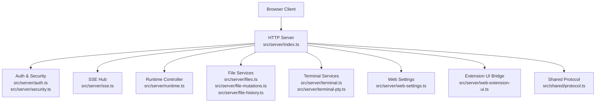
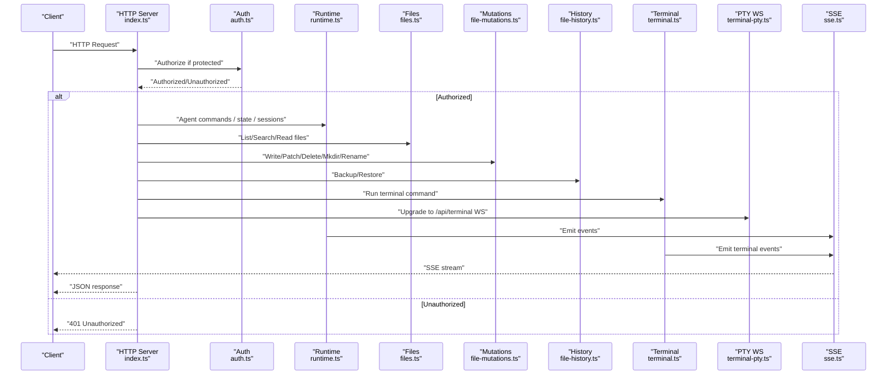
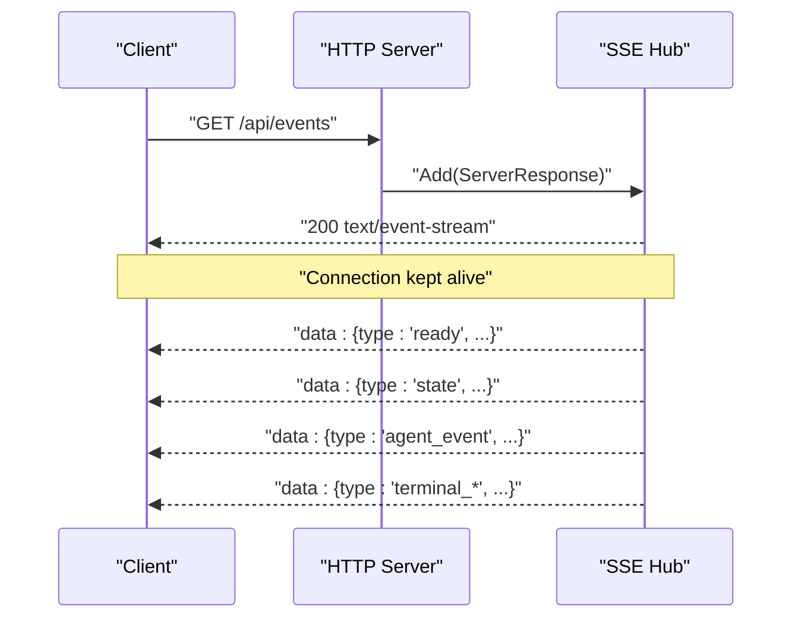
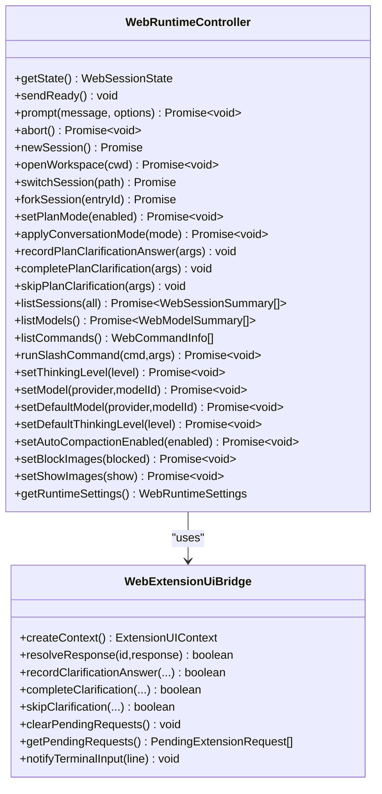
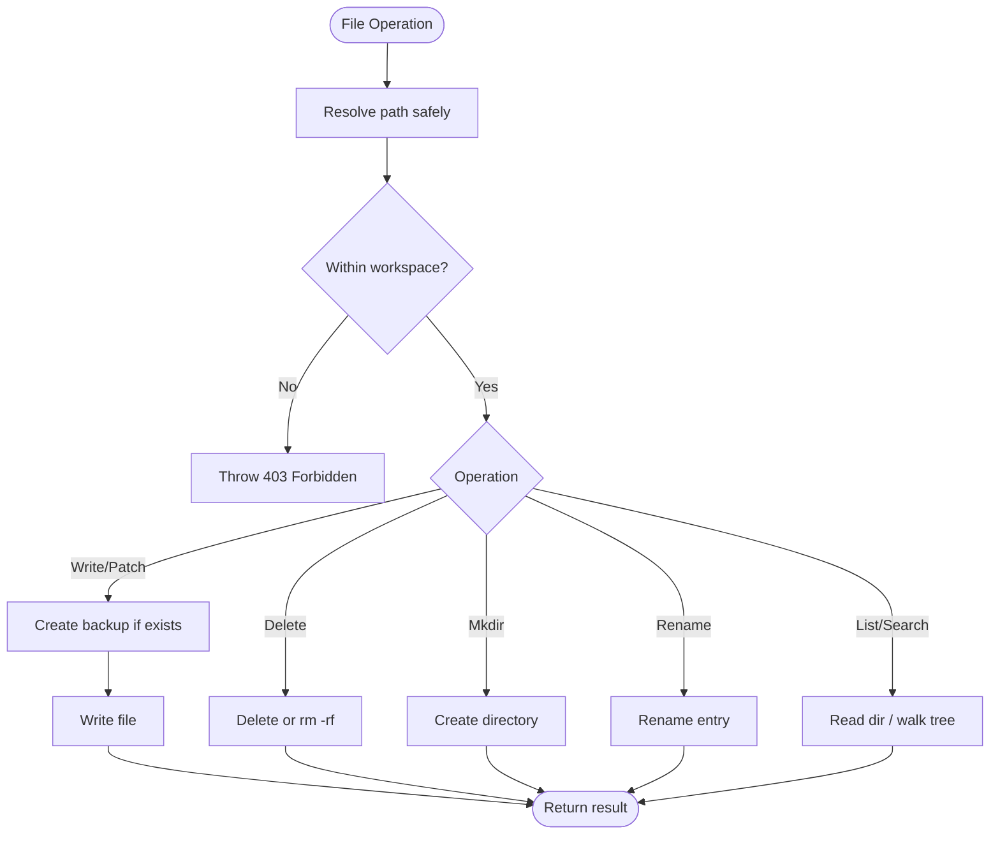
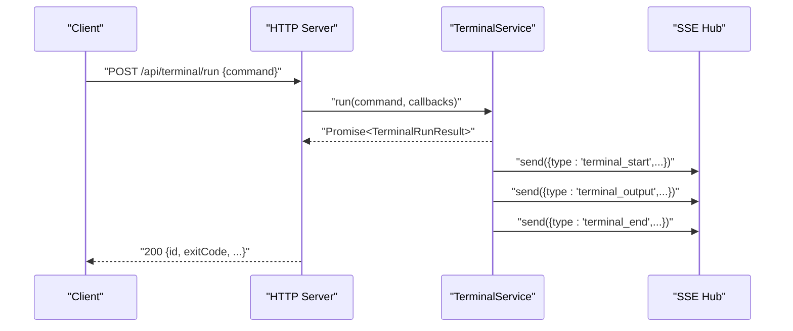
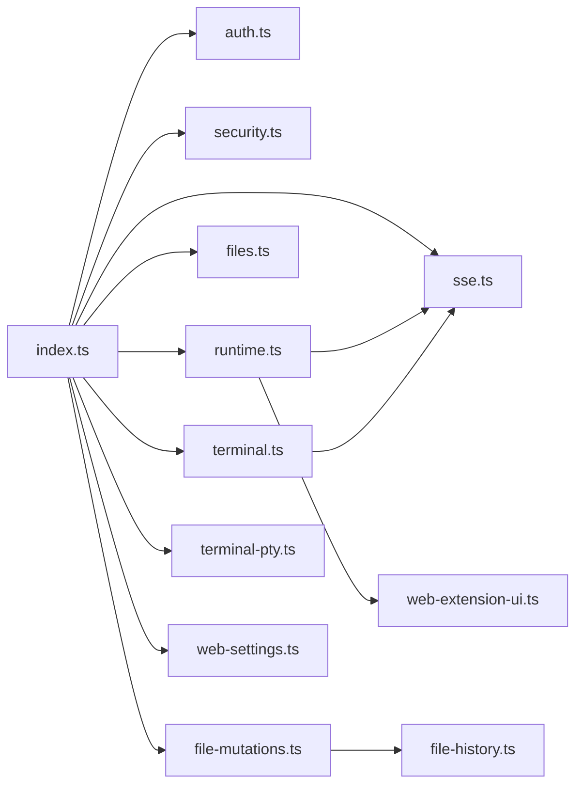

# Backend Server

<cite>
**Referenced Files in This Document**
- [index.ts](file://src/server/index.ts)
- [runtime.ts](file://src/server/runtime.ts)
- [sse.ts](file://src/server/sse.ts)
- [terminal.ts](file://src/server/terminal.ts)
- [auth.ts](file://src/server/auth.ts)
- [files.ts](file://src/server/files.ts)
- [file-mutations.ts](file://src/server/file-mutations.ts)
- [file-history.ts](file://src/server/file-history.ts)
- [terminal-pty.ts](file://src/server/terminal-pty.ts)
- [security.ts](file://src/server/security.ts)
- [locks.ts](file://src/server/locks.ts)
- [web-settings.ts](file://src/server/web-settings.ts)
- [terminal-policy.ts](file://src/server/terminal-policy.ts)
- [web-extension-ui.ts](file://src/server/web-extension-ui.ts)
- [protocol.ts](file://src/shared/protocol.ts)
</cite>

## Table of Contents
1. [Introduction](#introduction)
2. [Project Structure](#project-structure)
3. [Core Components](#core-components)
4. [Architecture Overview](#architecture-overview)
5. [Detailed Component Analysis](#detailed-component-analysis)
6. [Dependency Analysis](#dependency-analysis)
7. [Performance Considerations](#performance-considerations)
8. [Troubleshooting Guide](#troubleshooting-guide)
9. [Conclusion](#conclusion)

## Introduction
This document describes the backend server implementation for the Quake Code web application. It covers the Node.js HTTP server, API routing, service layer architecture, AgentSession runtime integration, Server-Sent Events (SSE) hub, file system operations, and terminal service implementation. It also explains HTTP endpoint structure, request/response handling, authentication mechanisms, security policies, runtime controller responsibilities, event streaming architecture, service orchestration patterns, error handling strategies, logging implementation, and performance considerations for concurrent connections.

## Project Structure
The backend server is organized around a single HTTP entrypoint that routes requests to specialized services. Key responsibilities are separated into cohesive modules:
- HTTP server and routing
- Authentication and security
- AgentSession runtime orchestration
- SSE event hub
- File system services (listing, reading, mutations, history)
- Terminal services (batch runs and interactive PTY)
- Web settings persistence
- Scheduler and Git integration (referenced via router)

**Diagram sources**
- [index.ts:401-662](file://src/server/index.ts#L401-L662)
- [auth.ts:6-56](file://src/server/auth.ts#L6-L56)
- [security.ts:24-41](file://src/server/security.ts#L24-L41)
- [sse.ts:6-32](file://src/server/sse.ts#L6-L32)
- [runtime.ts:12-456](file://src/server/runtime.ts#L12-L456)
- [files.ts:13-131](file://src/server/files.ts#L13-L131)
- [file-mutations.ts:13-140](file://src/server/file-mutations.ts#L13-L140)
- [file-history.ts:20-159](file://src/server/file-history.ts#L20-L159)
- [terminal.ts:21-87](file://src/server/terminal.ts#L21-L87)
- [terminal-pty.ts:25-95](file://src/server/terminal-pty.ts#L25-L95)
- [web-settings.ts:13-64](file://src/server/web-settings.ts#L13-L64)
- [web-extension-ui.ts:27-244](file://src/server/web-extension-ui.ts#L27-L244)
- [protocol.ts:112-198](file://src/shared/protocol.ts#L112-L198)

**Section sources**
- [index.ts:401-662](file://src/server/index.ts#L401-L662)

## Core Components
- HTTP Server and Routing: Centralized request router with explicit GET/POST handlers for APIs, SSE, static assets, and WebSocket upgrades.
- Authentication and Security: Token-based auth with optional enforcement and security validation for host and workspace allowlists.
- SSE Hub: Broadcasts runtime events and terminal updates to subscribed clients.
- Runtime Controller: Manages AgentSession lifecycle, conversation modes, plan state, and extension UI bridge.
- File Services: Safe file listing, search, read, and mutation with workspace boundary checks and backups.
- Terminal Services: Non-interactive batch runs with policy enforcement and interactive PTY over WebSocket.
- Web Settings: Persistent per-workspace settings with atomic writes.
- Shared Protocol: Typed definitions for server config, session state, agent events, and client commands.

**Section sources**
- [index.ts:53-95](file://src/server/index.ts#L53-L95)
- [auth.ts:6-56](file://src/server/auth.ts#L6-L56)
- [sse.ts:6-32](file://src/server/sse.ts#L6-L32)
- [runtime.ts:12-456](file://src/server/runtime.ts#L12-L456)
- [files.ts:13-131](file://src/server/files.ts#L13-L131)
- [file-mutations.ts:13-140](file://src/server/file-mutations.ts#L13-L140)
- [terminal.ts:21-87](file://src/server/terminal.ts#L21-L87)
- [terminal-pty.ts:25-95](file://src/server/terminal-pty.ts#L25-L95)
- [web-settings.ts:13-64](file://src/server/web-settings.ts#L13-L64)
- [protocol.ts:112-198](file://src/shared/protocol.ts#L112-L198)

## Architecture Overview
The server composes multiple services behind a single HTTP entrypoint. Requests are authenticated when required, routed to domain-specific services, and responses are returned as JSON. SSE streams runtime and terminal events to clients. Interactive terminals use WebSocket with node-pty for PTY emulation.

**Diagram sources**
- [index.ts:401-662](file://src/server/index.ts#L401-L662)
- [auth.ts:15-29](file://src/server/auth.ts#L15-L29)
- [runtime.ts:452-455](file://src/server/runtime.ts#L452-L455)
- [terminal.ts:36-85](file://src/server/terminal.ts#L36-L85)
- [terminal-pty.ts:28-94](file://src/server/terminal-pty.ts#L28-L94)
- [sse.ts:21-26](file://src/server/sse.ts#L21-L26)

## Detailed Component Analysis

### HTTP Server and Routing
- Creates an HTTP server and registers route handlers for:
  - SSE: GET /api/events
  - Config: GET /api/config
  - State: GET /api/state
  - Sessions: GET /api/sessions
  - Settings: GET /api/settings
  - Models: GET /api/models
  - Commands: GET /api/commands
  - Extensions: GET /api/extensions, POST /api/extensions/toggle
  - Skills: GET /api/skills
  - Prompts: GET /api/prompts
  - Web settings: GET /api/web-settings, POST /api/web-settings
  - Workspace: GET /api/workspace/roots, /api/workspace/browse, /api/workspace/changes
  - Git: GET /api/git/*, POST /api/git/*
  - Search: GET /api/search
  - Scheduler: GET/POST /api/scheduled and CRUD under /api/scheduled/:id[/run]
  - Files: GET /api/files, /api/files/search, /api/file, POST /api/file/write, /api/file/patch, /api/file/delete, /api/file/mkdir, /api/file/rename
  - File history: GET /api/file/history, POST /api/file/restore
  - Command API: POST /api/command
  - Terminal: POST /api/terminal/run, POST /api/terminal/stop
  - Static assets: GET /*
- Authentication is enforced for all /api/* endpoints via a token header or query param.
- Security headers are applied to JSON responses.
- Error handling maps thrown errors to appropriate HTTP status codes.

**Section sources**
- [index.ts:401-662](file://src/server/index.ts#L401-L662)
- [index.ts:221-253](file://src/server/index.ts#L221-L253)
- [index.ts:231-240](file://src/server/index.ts#L231-L240)
- [index.ts:376-381](file://src/server/index.ts#L376-L381)

### Authentication and Security
- Token-based authentication:
  - Enabled unless disabled by environment variable.
  - Token can be provided via header or query parameter.
  - Uses constant-time comparison to prevent timing attacks.
  - Generates a persistent token file if none exists.
- Client injection:
  - Injects token into served HTML for SPA initialization.
- Security validation:
  - Validates host binding to prevent remote exposure unless explicitly allowed.
  - Enforces workspace allowlist to restrict operations outside allowed roots.
  - Resolves real paths to detect symlinks and prevent traversal.

**Section sources**
- [auth.ts:6-56](file://src/server/auth.ts#L6-L56)
- [security.ts:24-41](file://src/server/security.ts#L24-L41)

### SSE Hub and Event Streaming
- Maintains a set of active ServerResponse connections.
- Writes SSE frames with automatic keepalive and buffering hints.
- Emits typed payloads (agent events, terminal events, extension UI requests, errors).
- On connection close, removes client from the set.

**Diagram sources**
- [index.ts:408-411](file://src/server/index.ts#L408-L411)
- [sse.ts:9-26](file://src/server/sse.ts#L9-L26)

**Section sources**
- [sse.ts:6-32](file://src/server/sse.ts#L6-L32)

### AgentSession Runtime Integration
- Initializes AgentSession runtime with a working directory and binds the current session.
- Exposes operations to:
  - Prompt the agent with optional image content and streaming behavior.
  - Abort ongoing interactions.
  - Manage sessions: new, open workspace, switch, fork.
  - Configure runtime settings: thinking level, model, defaults, compaction, image visibility.
  - Toggle plan mode and manage plan clarification flows via the extension UI bridge.
  - List sessions, models, commands, skills, and prompts.
  - Emit ready/state events to SSE hub.
- Orchestrates extension UI requests and responses, forwarding terminal input notifications.

**Diagram sources**
- [runtime.ts:12-456](file://src/server/runtime.ts#L12-L456)
- [web-extension-ui.ts:27-244](file://src/server/web-extension-ui.ts#L27-L244)

**Section sources**
- [runtime.ts:12-456](file://src/server/runtime.ts#L12-L456)
- [web-extension-ui.ts:27-244](file://src/server/web-extension-ui.ts#L27-L244)

### File System Operations
- Listing and search:
  - Lists directory entries with hidden/generated filters and safety checks.
  - Searches recursively up to a limited depth and returns sorted results.
- Reading:
  - Reads file content with size limits for preview.
- Mutations:
  - Write, patch, delete, mkdir, rename with workspace boundary enforcement and backups.
  - Patch requires exact substring matches; enforces maximum file size.
- History:
  - Creates backups before mutating files and maintains a manifest of versions.
  - Prunes old versions to cap per-file and global counts.

**Diagram sources**
- [files.ts:16-61](file://src/server/files.ts#L16-L61)
- [files.ts:84-127](file://src/server/files.ts#L84-L127)
- [file-mutations.ts:21-98](file://src/server/file-mutations.ts#L21-L98)
- [file-history.ts:35-93](file://src/server/file-history.ts#L35-L93)

**Section sources**
- [files.ts:13-131](file://src/server/files.ts#L13-L131)
- [file-mutations.ts:13-140](file://src/server/file-mutations.ts#L13-L140)
- [file-history.ts:20-159](file://src/server/file-history.ts#L20-L159)

### Terminal Service Implementation
- Non-interactive runs:
  - Spawns shell with configurable timeout and captures stdout/stderr.
  - Enforces policy decisions and limits output buffer size.
  - Emits terminal_start/terminal_output/terminal_end events via SSE.
- Interactive PTY:
  - Upgrades HTTP to WebSocket at /api/terminal with authentication.
  - Spawns node-pty with terminal dimensions and environment.
  - Bridges client keystrokes to PTY and PTY output to client.

**Diagram sources**
- [index.ts:631-644](file://src/server/index.ts#L631-L644)
- [terminal.ts:36-85](file://src/server/terminal.ts#L36-L85)
- [terminal-pty.ts:44-94](file://src/server/terminal-pty.ts#L44-L94)

**Section sources**
- [terminal.ts:21-87](file://src/server/terminal.ts#L21-L87)
- [terminal-pty.ts:25-95](file://src/server/terminal-pty.ts#L25-L95)
- [terminal-policy.ts:21-39](file://src/server/terminal-policy.ts#L21-L39)

### Web Settings Persistence
- Reads and patches settings atomically using temporary files and rename.
- Merges nested objects like panels and extensionsEnabled.
- Ensures directory creation and consistent JSON formatting.

**Section sources**
- [web-settings.ts:13-64](file://src/server/web-settings.ts#L13-L64)

### Scheduler and Git Integration
- Scheduler endpoints support listing, creating, updating, removing, and immediate execution of scheduled tasks.
- Git endpoints expose status, branch, diff, stage/unstage, commit, push, and PR creation.

**Section sources**
- [index.ts:520-562](file://src/server/index.ts#L520-L562)
- [index.ts:478-513](file://src/server/index.ts#L478-L513)

## Dependency Analysis
The server composes services with clear boundaries and minimal coupling. The runtime controller depends on the SSE hub and extension UI bridge. File services depend on the history service for backups. Terminal services integrate with both SSE and PTY. Authentication and security validations are centralized.

**Diagram sources**
- [index.ts:401-662](file://src/server/index.ts#L401-L662)
- [runtime.ts:12-456](file://src/server/runtime.ts#L12-L456)
- [terminal.ts:21-87](file://src/server/terminal.ts#L21-L87)
- [terminal-pty.ts:25-95](file://src/server/terminal-pty.ts#L25-L95)
- [files.ts:13-131](file://src/server/files.ts#L13-L131)
- [file-mutations.ts:13-140](file://src/server/file-mutations.ts#L13-L140)
- [file-history.ts:20-159](file://src/server/file-history.ts#L20-L159)
- [web-settings.ts:13-64](file://src/server/web-settings.ts#L13-L64)
- [web-extension-ui.ts:27-244](file://src/server/web-extension-ui.ts#L27-L244)
- [sse.ts:6-32](file://src/server/sse.ts#L6-L32)

**Section sources**
- [index.ts:401-662](file://src/server/index.ts#L401-L662)

## Performance Considerations
- Concurrency control:
  - AsyncLock serializes sensitive runtime operations to avoid race conditions.
  - SingleFlight prevents overlapping terminal runs for a given operation.
- Streaming and buffering:
  - SSE uses keep-alive headers and avoids buffering where possible.
  - Terminal output buffers are capped to limit memory usage.
- I/O limits:
  - File previews restricted to a maximum size.
  - Search and listing operations enforce caps on results and recursion depth.
- Resource cleanup:
  - WebSocket and child process handles are cleaned up on close/error.
- Timeouts:
  - Terminal runs enforce timeouts with SIGTERM signaling.

**Section sources**
- [locks.ts:1-38](file://src/server/locks.ts#L1-L38)
- [terminal.ts:49-85](file://src/server/terminal.ts#L49-L85)
- [files.ts:59-60](file://src/server/files.ts#L59-L60)
- [terminal-pty.ts:77-93](file://src/server/terminal-pty.ts#L77-L93)

## Troubleshooting Guide
- Authentication failures:
  - Ensure the token header or query parameter matches the generated token.
  - Verify that authentication is not disabled unintentionally.
- Remote access blocked:
  - If binding to 0.0.0.0, enable remote access explicitly.
  - Confirm workspace allowlist includes the current working directory.
- Workspace path errors:
  - Paths outside the workspace root are rejected.
  - Hidden and generated directories are filtered by default in listings.
- Terminal policy violations:
  - Dangerous patterns are blocked by default; adjust policy mode if necessary.
- Terminal PTY startup:
  - Some environments require useConpty adjustments; verify shell availability and permissions.
- SSE not receiving events:
  - Confirm subscription to /api/events and that the runtime is initialized.
- File mutation errors:
  - Check for missing files, conflicts, and size limits.
  - Backups are created before destructive operations.

**Section sources**
- [auth.ts:15-29](file://src/server/auth.ts#L15-L29)
- [security.ts:24-41](file://src/server/security.ts#L24-L41)
- [files.ts:96-101](file://src/server/files.ts#L96-L101)
- [terminal-policy.ts:24-32](file://src/server/terminal-policy.ts#L24-L32)
- [terminal-pty.ts:51-66](file://src/server/terminal-pty.ts#L51-L66)
- [sse.ts:9-19](file://src/server/sse.ts#L9-L19)
- [file-mutations.ts:75-98](file://src/server/file-mutations.ts#L75-L98)

## Conclusion
The backend server integrates a robust HTTP router, secure authentication, AgentSession-driven runtime orchestration, SSE-based event streaming, comprehensive file operations with safety and history, and terminal services supporting both batch execution and interactive PTY sessions. The design emphasizes separation of concerns, concurrency control, and strong security boundaries, enabling reliable operation in diverse environments.
