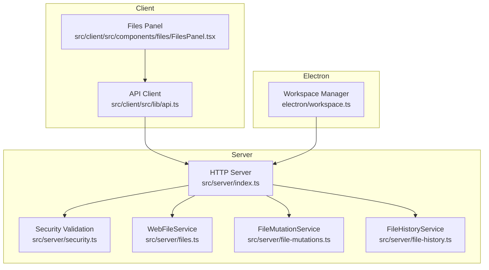
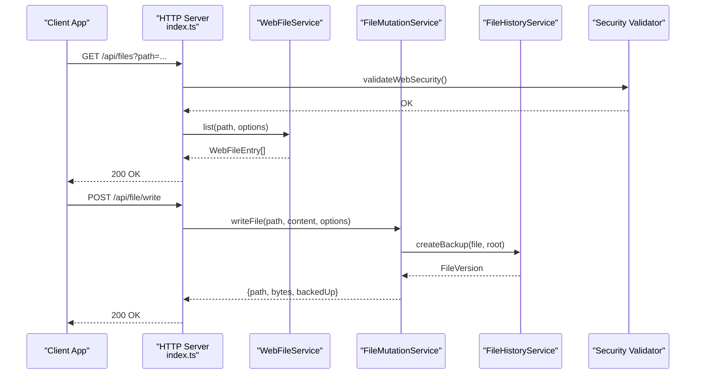
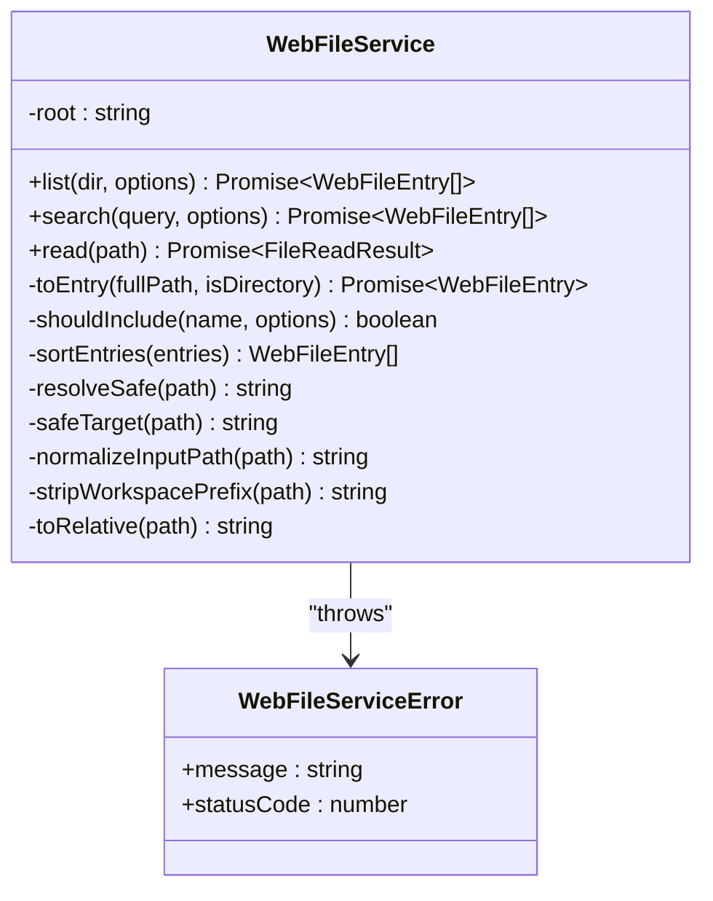
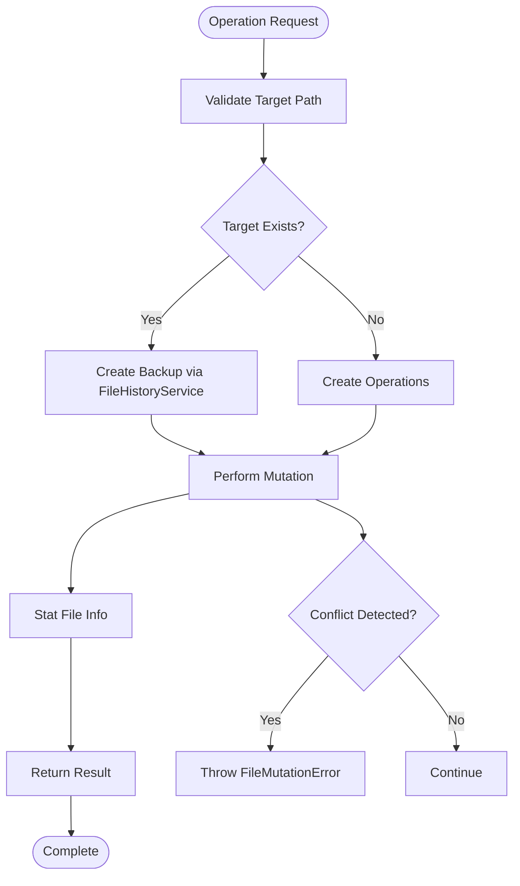
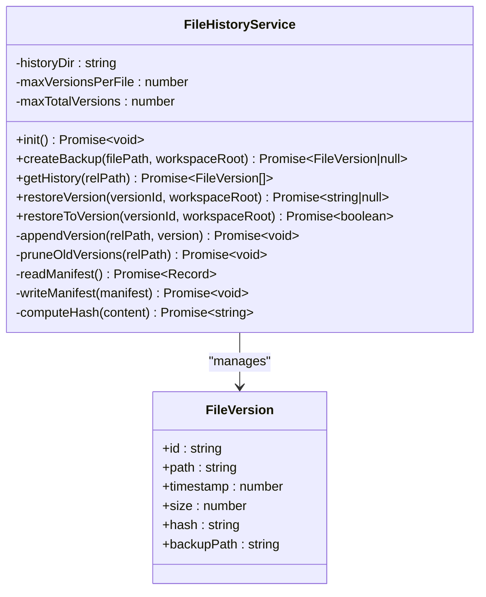
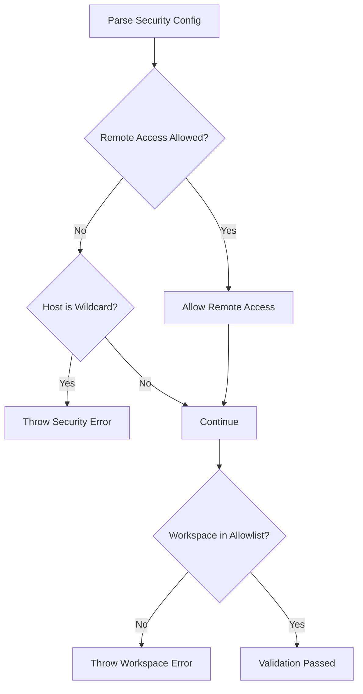
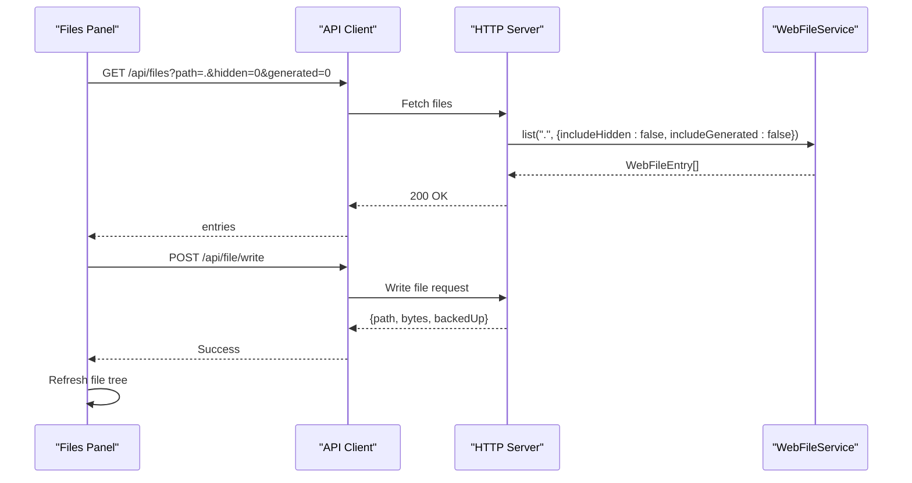
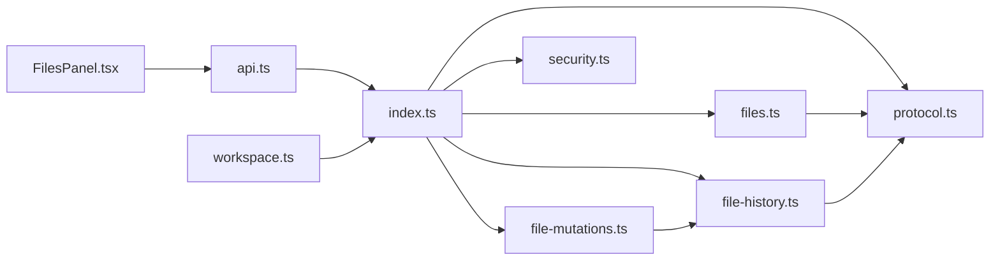
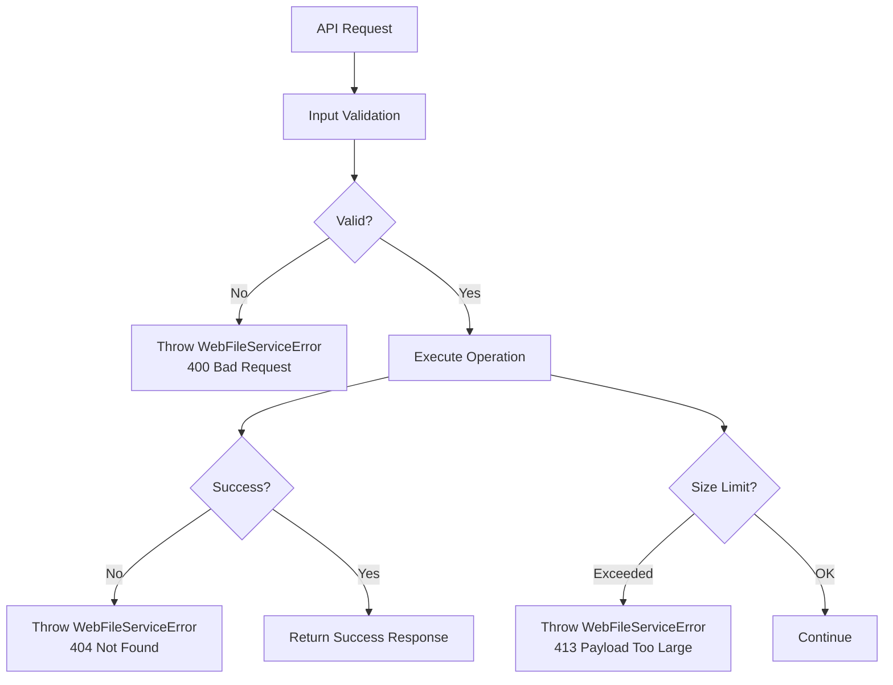

# File System Operations

<cite>
**Referenced Files in This Document**
- [files.ts](file://src/server/files.ts)
- [file-mutations.ts](file://src/server/file-mutations.ts)
- [file-history.ts](file://src/server/file-history.ts)
- [security.ts](file://src/server/security.ts)
- [index.ts](file://src/server/index.ts)
- [protocol.ts](file://src/shared/protocol.ts)
- [workspace.ts](file://electron/workspace.ts)
- [FilesPanel.tsx](file://src/client/src/components/files/FilesPanel.tsx)
- [api.ts](file://src/client/src/lib/api.ts)
- [file-operations.spec.ts](file://test/e2e/file-operations.spec.ts)
- [security.md](file://docs/security.md)
</cite>

## Table of Contents
1. [Introduction](#introduction)
2. [Project Structure](#project-structure)
3. [Core Components](#core-components)
4. [Architecture Overview](#architecture-overview)
5. [Detailed Component Analysis](#detailed-component-analysis)
6. [Dependency Analysis](#dependency-analysis)
7. [Performance Considerations](#performance-considerations)
8. [Troubleshooting Guide](#troubleshooting-guide)
9. [Conclusion](#conclusion)

## Introduction
This document provides comprehensive documentation for the file system operation services in the Quake Code Web application. It covers file browsing, reading, writing, and history management, along with safe file operations, workspace validation, and security policies. The documentation explains the file mutation service for atomic operations, backup creation, and conflict resolution, as well as the file history service for version tracking and restoration. Practical examples demonstrate file operations, workspace security, and error handling.

## Project Structure
The file system operations are implemented primarily in the server-side modules under `src/server`, with client-side integration in `src/client`. The key components include:
- File browsing and reading services
- File mutation service for atomic operations
- File history service for versioning and restoration
- Security validation for workspace boundaries
- Client-side file explorer integration

**Diagram sources**
- [index.ts:1-679](file://src/server/index.ts#L1-L679)
- [files.ts:1-131](file://src/server/files.ts#L1-L131)
- [file-mutations.ts:1-140](file://src/server/file-mutations.ts#L1-L140)
- [file-history.ts:1-159](file://src/server/file-history.ts#L1-L159)
- [security.ts:1-47](file://src/server/security.ts#L1-L47)
- [FilesPanel.tsx:1-267](file://src/client/src/components/files/FilesPanel.tsx#L1-L267)
- [api.ts:1-59](file://src/client/src/lib/api.ts#L1-L59)
- [workspace.ts:1-66](file://electron/workspace.ts#L1-L66)

**Section sources**
- [index.ts:1-679](file://src/server/index.ts#L1-L679)
- [files.ts:1-131](file://src/server/files.ts#L1-L131)
- [file-mutations.ts:1-140](file://src/server/file-mutations.ts#L1-L140)
- [file-history.ts:1-159](file://src/server/file-history.ts#L1-L159)
- [security.ts:1-47](file://src/server/security.ts#L1-L47)
- [FilesPanel.tsx:1-267](file://src/client/src/components/files/FilesPanel.tsx#L1-L267)
- [api.ts:1-59](file://src/client/src/lib/api.ts#L1-L59)
- [workspace.ts:1-66](file://electron/workspace.ts#L1-L66)

## Core Components
This section outlines the primary file system operation components and their responsibilities.

- WebFileService: Provides file browsing, listing, searching, and reading with safety validations and filtering options.
- FileMutationService: Handles atomic file operations including write, delete, create directory, rename, patch, and directory listing with backup creation.
- FileHistoryService: Manages file versioning, backup creation, version pruning, and restoration to previous versions.
- Security Validation: Enforces workspace boundaries, remote access restrictions, and workspace allowlists.
- Client Integration: The Files Panel integrates with the server APIs to provide a user-friendly file explorer.

Key capabilities:
- Safe path resolution preventing traversal outside the workspace root
- Hidden and generated file filtering
- File size limits for previews and mutations
- Backup creation before destructive operations
- Version pruning to manage storage usage
- Comprehensive error handling with meaningful status codes

**Section sources**
- [files.ts:13-131](file://src/server/files.ts#L13-L131)
- [file-mutations.ts:13-140](file://src/server/file-mutations.ts#L13-L140)
- [file-history.ts:20-159](file://src/server/file-history.ts#L20-L159)
- [security.ts:24-47](file://src/server/security.ts#L24-L47)

## Architecture Overview
The file system operations follow a layered architecture with clear separation of concerns:

**Diagram sources**
- [index.ts:568-625](file://src/server/index.ts#L568-L625)
- [files.ts:16-29](file://src/server/files.ts#L16-L29)
- [file-mutations.ts:21-34](file://src/server/file-mutations.ts#L21-L34)
- [file-history.ts:35-59](file://src/server/file-history.ts#L35-L59)
- [security.ts:24-47](file://src/server/security.ts#L24-L47)

The architecture ensures:
- All operations pass through security validation
- File mutations trigger automatic backup creation
- History management maintains version metadata
- Client requests are routed through a centralized HTTP server

**Section sources**
- [index.ts:1-679](file://src/server/index.ts#L1-L679)

## Detailed Component Analysis

### WebFileService
The WebFileService provides comprehensive file browsing and reading capabilities with robust safety measures.

**Diagram sources**
- [files.ts:13-131](file://src/server/files.ts#L13-L131)

Key features:
- Path normalization and safe resolution preventing traversal attacks
- Directory and file filtering with hidden/generated file support
- File size validation for preview limits
- Sorting and pagination of results
- Comprehensive error handling with specific status codes

Safety mechanisms:
- Workspace boundary enforcement using realpath comparison
- Input sanitization and path normalization
- Generated directory exclusion (node_modules, dist, build, etc.)
- Hidden file filtering controlled by options

**Section sources**
- [files.ts:13-131](file://src/server/files.ts#L13-L131)

### FileMutationService
The FileMutationService handles atomic file operations with backup creation and conflict resolution.

**Diagram sources**
- [file-mutations.ts:21-98](file://src/server/file-mutations.ts#L21-L98)
- [file-history.ts:35-59](file://src/server/file-history.ts#L35-L59)

Atomic operation guarantees:
- Backup creation before destructive operations
- Recursive directory creation for writes
- Atomic rename operations with existence checks
- Patch validation ensuring old text matches before replacement

Conflict resolution:
- Existence checks prevent overwriting existing files during creation
- Rename operations validate both source and destination
- Patch operations verify old text presence before modification

**Section sources**
- [file-mutations.ts:13-140](file://src/server/file-mutations.ts#L13-L140)

### FileHistoryService
The FileHistoryService manages file versioning with automatic backup creation and intelligent pruning.

**Diagram sources**
- [file-history.ts:20-159](file://src/server/file-history.ts#L20-L159)

Version management features:
- Automatic backup creation with SHA-256 hash verification
- Manifest-based version tracking per file
- Intelligent pruning limiting versions per file and globally
- Restoration to specific versions or latest backups

Storage optimization:
- Per-file version cap (default 20)
- Global version cap (default 500)
- Hash-based deduplication of identical content
- Cleanup of obsolete backup files

**Section sources**
- [file-history.ts:20-159](file://src/server/file-history.ts#L20-L159)

### Security and Workspace Validation
The security system enforces strict workspace boundaries and access controls.

**Diagram sources**
- [security.ts:24-47](file://src/server/security.ts#L24-L47)

Security policies:
- Remote access disabled by default for wildcard hosts
- Workspace allowlist validation with realpath resolution
- Token-based authentication for API endpoints
- Client-side security banner displaying current security state

**Section sources**
- [security.ts:24-47](file://src/server/security.ts#L24-L47)
- [security.md:1-48](file://docs/security.md#L1-L48)

### Client-Side Integration
The client provides a comprehensive file explorer integrated with server-side operations.

**Diagram sources**
- [FilesPanel.tsx:72-93](file://src/client/src/components/files/FilesPanel.tsx#L72-L93)
- [api.ts:9-25](file://src/client/src/lib/api.ts#L9-L25)
- [index.ts:568-625](file://src/server/index.ts#L568-L625)

Client features:
- Real-time file tree navigation with lazy loading
- Search across the entire workspace
- Visibility toggles for hidden and generated files
- Keyboard navigation support
- Toast notifications for errors and feedback

**Section sources**
- [FilesPanel.tsx:1-267](file://src/client/src/components/files/FilesPanel.tsx#L1-L267)
- [api.ts:1-59](file://src/client/src/lib/api.ts#L1-L59)

## Dependency Analysis
The file system operation services have well-defined dependencies and minimal coupling.

**Diagram sources**
- [index.ts:1-679](file://src/server/index.ts#L1-L679)
- [files.ts:1-131](file://src/server/files.ts#L1-L131)
- [file-mutations.ts:1-140](file://src/server/file-mutations.ts#L1-L140)
- [file-history.ts:1-159](file://src/server/file-history.ts#L1-L159)
- [security.ts:1-47](file://src/server/security.ts#L1-L47)
- [protocol.ts:124-130](file://src/shared/protocol.ts#L124-L130)
- [FilesPanel.tsx:1-267](file://src/client/src/components/files/FilesPanel.tsx#L1-L267)
- [api.ts:1-59](file://src/client/src/lib/api.ts#L1-L59)
- [workspace.ts:1-66](file://electron/workspace.ts#L1-L66)

Key dependency relationships:
- HTTP server orchestrates all file operations
- FileMutationService depends on FileHistoryService for backups
- WebFileService uses protocol types for consistent data structures
- Client components depend on API client for server communication
- Electron workspace manager provides initial workspace selection

**Section sources**
- [index.ts:1-679](file://src/server/index.ts#L1-L679)

## Performance Considerations
The file system operations are designed with performance and scalability in mind:

- File listing limits: Results are limited to 300 entries per directory to prevent excessive memory usage
- Search limits: Maximum 500 results with configurable depth (10 levels) to balance completeness and performance
- Preview size limits: 1MB file size limit for web previews to prevent large memory allocations
- Version pruning: Automatic cleanup of old versions prevents unbounded growth of backup storage
- Lazy loading: File tree uses lazy loading to load directory contents on demand
- Caching: Client-side caching reduces repeated API calls for the same directory contents

Optimization opportunities:
- Implement server-side pagination for large directory listings
- Add file size caching to avoid repeated stat calls
- Consider background version cleanup for better real-time performance
- Implement file change detection to reduce unnecessary refreshes

## Troubleshooting Guide

### Common Error Scenarios

**Workspace Boundary Violations**
- Error: "Çalışma alanı dışına çıkılamaz" (Cannot escape workspace)
- Cause: Attempting to access paths outside the workspace root
- Solution: Use relative paths within the workspace or adjust workspace root

**File Not Found Errors**
- Error: "Dosya bulunamadı" (File not found) or "Klasör bulunamadı" (Directory not found)
- Cause: Non-existent file or directory path
- Solution: Verify the path exists or create the missing directories

**Permission Denied Issues**
- Error: "İstek reddedildi" (Request denied) or 403 status
- Cause: Authentication failure or workspace security violation
- Solution: Ensure proper authentication token is included or adjust security settings

**Large File Operations**
- Error: "Dosya çok büyük" (File too large) or "Dosya web önizlemesi için çok büyük"
- Cause: Exceeding configured size limits (10MB for mutations, 1MB for previews)
- Solution: Use appropriate file sizes or adjust server configuration

### Error Handling Patterns

The system implements consistent error handling across all components:

**Diagram sources**
- [files.ts:54-61](file://src/server/files.ts#L54-L61)
- [file-mutations.ts:75-98](file://src/server/file-mutations.ts#L75-L98)

### Testing Examples

The test suite demonstrates practical usage patterns:

- File creation and reading operations
- Patch operations with validation
- Directory creation and deletion
- Rename operations with conflict detection
- Workspace boundary enforcement
- History tracking and restoration

**Section sources**
- [file-operations.spec.ts:1-109](file://test/e2e/file-operations.spec.ts#L1-L109)

## Conclusion
The Quake Code Web file system operations provide a secure, efficient, and user-friendly interface for managing files within a controlled workspace environment. The layered architecture ensures strong security boundaries while maintaining excellent performance characteristics. Key strengths include comprehensive safety validations, automatic backup creation, intelligent version management, and seamless client-server integration. The system balances usability with security, making it suitable for development workflows while preventing unauthorized access or destructive operations.

Future enhancements could include advanced search capabilities, batch operations, and improved error recovery mechanisms. The modular design allows for incremental improvements without disrupting existing functionality.
