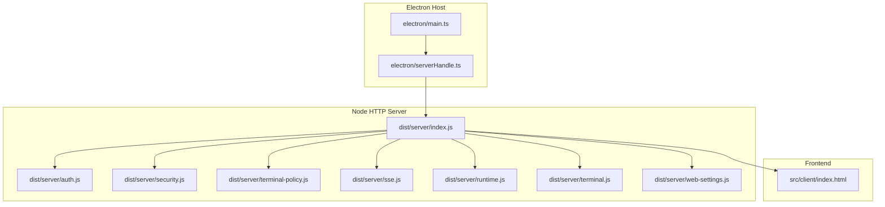
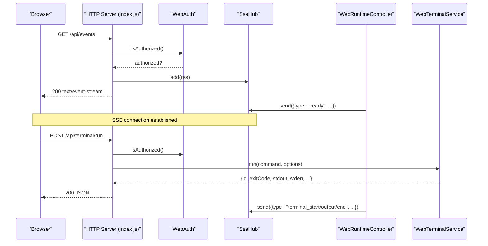
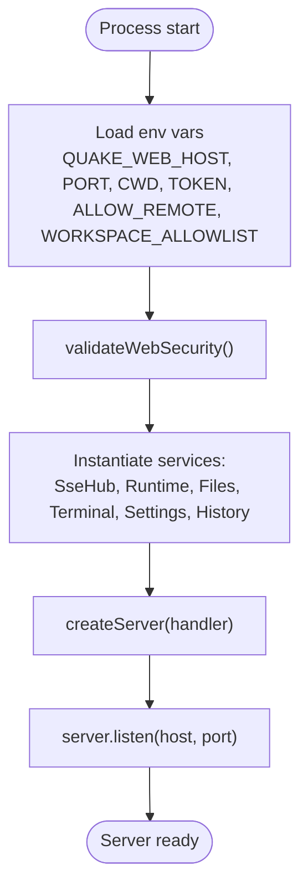
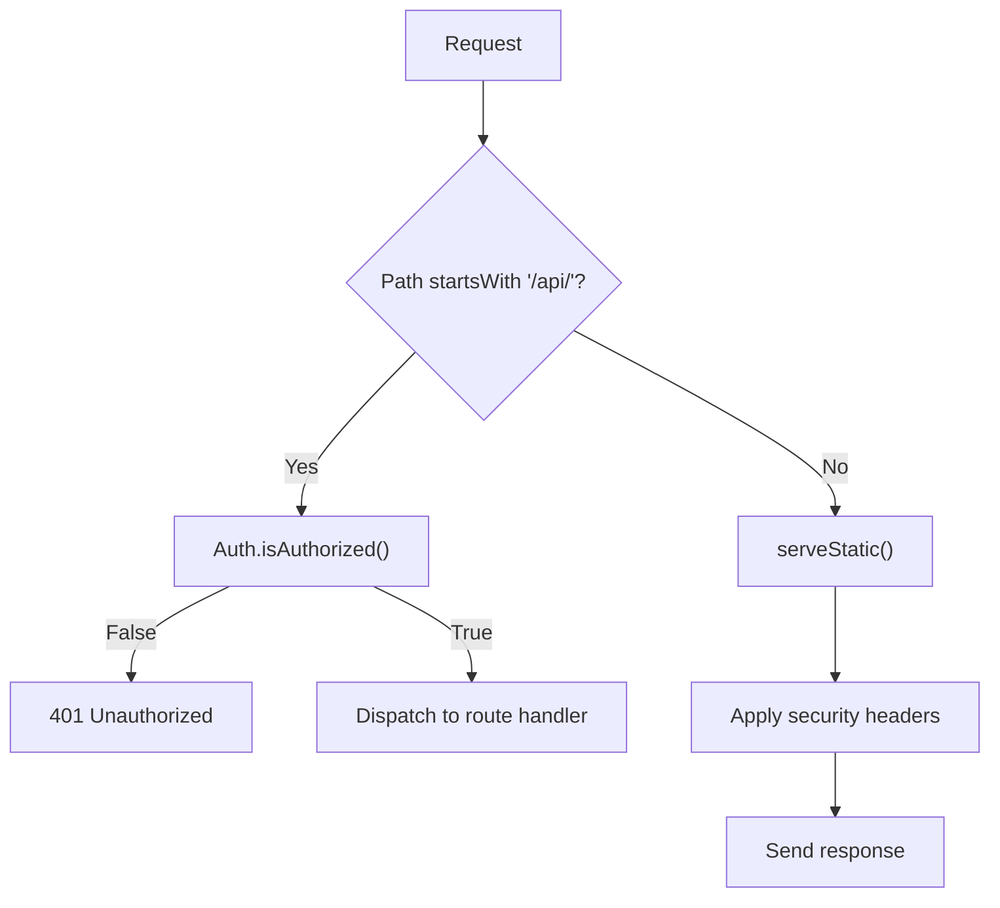
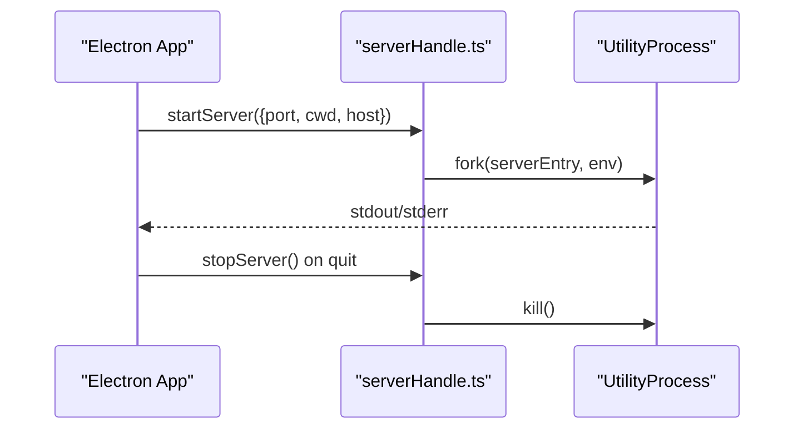
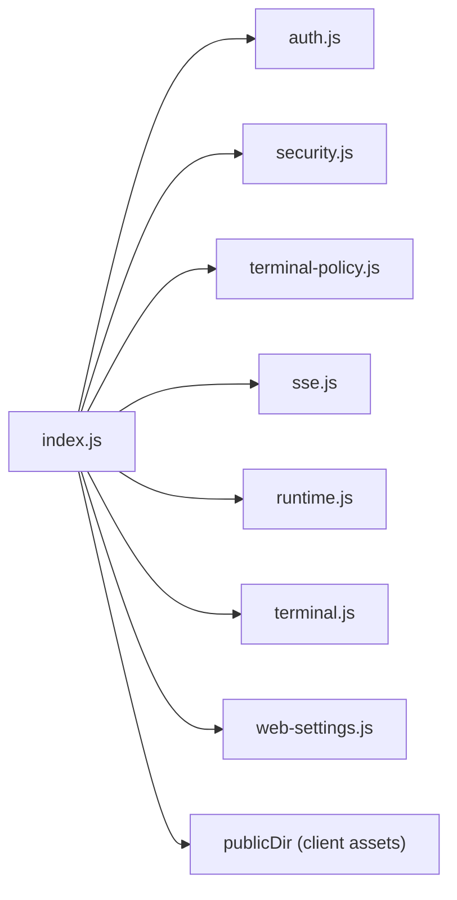

# HTTP Server

<cite>
**Referenced Files in This Document**
- [dist/server/index.js](file://dist/server/index.js)
- [dist/server/auth.js](file://dist/server/auth.js)
- [dist/server/security.js](file://dist/server/security.js)
- [dist/server/terminal-policy.js](file://dist/server/terminal-policy.js)
- [dist/server/sse.js](file://dist/server/sse.js)
- [dist/server/runtime.js](file://dist/server/runtime.js)
- [dist/server/web-settings.js](file://dist/server/web-settings.js)
- [dist/server/terminal.js](file://dist/server/terminal.js)
- [electron/serverHandle.ts](file://electron/serverHandle.ts)
- [electron/main.ts](file://electron/main.ts)
- [package.json](file://package.json)
- [README.md](file://README.md)
- [docs/security.md](file://docs/security.md)
</cite>

## Table of Contents
1. [Introduction](#introduction)
2. [Project Structure](#project-structure)
3. [Core Components](#core-components)
4. [Architecture Overview](#architecture-overview)
5. [Detailed Component Analysis](#detailed-component-analysis)
6. [Dependency Analysis](#dependency-analysis)
7. [Performance Considerations](#performance-considerations)
8. [Troubleshooting Guide](#troubleshooting-guide)
9. [Conclusion](#conclusion)
10. [Appendices](#appendices)

## Introduction
This document describes the Node.js HTTP server implementation powering the Quake Code Web application. It covers server initialization, configuration options, request routing, middleware-like behavior, security headers, static file serving, CORS policies, server lifecycle management, graceful shutdown, and error handling strategies. It also includes practical examples for configuration, environment variable usage, and deployment considerations.

## Project Structure
The HTTP server is implemented as a standalone Node.js HTTP server with a React/Vite frontend. Electron orchestrates the server lifecycle and serves as the desktop host.

**Diagram sources**
- [electron/main.ts:1-171](file://electron/main.ts#L1-L171)
- [electron/serverHandle.ts:1-47](file://electron/serverHandle.ts#L1-L47)
- [dist/server/index.js:1-545](file://dist/server/index.js#L1-L545)
- [dist/server/auth.js:1-52](file://dist/server/auth.js#L1-L52)
- [dist/server/security.js:1-34](file://dist/server/security.js#L1-L34)
- [dist/server/terminal-policy.js:1-35](file://dist/server/terminal-policy.js#L1-L35)
- [dist/server/sse.js:1-24](file://dist/server/sse.js#L1-L24)
- [dist/server/runtime.js:1-462](file://dist/server/runtime.js#L1-L462)
- [dist/server/terminal.js:1-74](file://dist/server/terminal.js#L1-L74)
- [dist/server/web-settings.js:1-51](file://dist/server/web-settings.js#L1-L51)

**Section sources**
- [README.md:88-103](file://README.md#L88-L103)
- [package.json:1-69](file://package.json#L1-L69)

## Core Components
- HTTP server entry and router: Initializes services, sets up routes, applies security headers, and handles API/static requests.
- Authentication: Local token-based auth for protected endpoints.
- Security validator: Enforces host binding, remote access, and workspace allowlist rules.
- Terminal policy: Command filtering to prevent destructive operations.
- SSE hub: Real-time event streaming to clients.
- Runtime controller: Bridges the AgentSession runtime to the web UI.
- Terminal service: Executes commands under controlled policies and timeouts.
- Web settings service: Manages persisted web UI preferences.

**Section sources**
- [dist/server/index.js:40-76](file://dist/server/index.js#L40-L76)
- [dist/server/auth.js:1-52](file://dist/server/auth.js#L1-L52)
- [dist/server/security.js:1-34](file://dist/server/security.js#L1-L34)
- [dist/server/terminal-policy.js:1-35](file://dist/server/terminal-policy.js#L1-L35)
- [dist/server/sse.js:1-24](file://dist/server/sse.js#L1-L24)
- [dist/server/runtime.js:1-462](file://dist/server/runtime.js#L1-L462)
- [dist/server/terminal.js:1-74](file://dist/server/terminal.js#L1-L74)
- [dist/server/web-settings.js:1-51](file://dist/server/web-settings.js#L1-L51)

## Architecture Overview
The server is a single-process Node.js HTTP server with:
- A central request handler that dispatches to API endpoints or static file serving.
- Protected API endpoints gated by token authentication.
- Real-time updates via Server-Sent Events (SSE).
- Integrated terminal execution with policy enforcement.
- Workspace-scoped file operations and settings persistence.

**Diagram sources**
- [dist/server/index.js:366-539](file://dist/server/index.js#L366-L539)
- [dist/server/auth.js:11-17](file://dist/server/auth.js#L11-L17)
- [dist/server/sse.js:3-19](file://dist/server/sse.js#L3-L19)
- [dist/server/runtime.js:48-49](file://dist/server/runtime.js#L48-L49)
- [dist/server/terminal.js:18-72](file://dist/server/terminal.js#L18-L72)

## Detailed Component Analysis

### Server Initialization and Lifecycle
- Environment configuration:
  - Host, port, working directory, and security flags are read at startup.
  - Workspace allowlist is parsed and validated against the current CWD.
- Service instantiation:
  - SSE hub, runtime controller, file services, terminal service, settings, and history services are created.
- HTTP server creation and listening:
  - An HTTP server is created and bound to configured host/port.
  - Logs the server address and token (when enabled).

**Diagram sources**
- [dist/server/index.js:43-76](file://dist/server/index.js#L43-L76)
- [dist/server/index.js:540-544](file://dist/server/index.js#L540-L544)
- [dist/server/security.js:15-28](file://dist/server/security.js#L15-L28)

**Section sources**
- [dist/server/index.js:43-76](file://dist/server/index.js#L43-L76)
- [dist/server/index.js:540-544](file://dist/server/index.js#L540-L544)
- [dist/server/security.js:15-28](file://dist/server/security.js#L15-L28)

### Request Routing Logic
The central handler performs:
- Token validation for protected routes under /api/.
- SSE subscription for /api/events.
- Config/state endpoints for UI bootstrap.
- Sessions, settings, models, skills, and prompts listings.
- File operations (list, search, read, write, patch, delete, mkdir, rename).
- File history retrieval and restore.
- Command execution via a command endpoint.
- Terminal run/stop operations.
- Fallback to static file serving for non-API GET requests.

```mermaid
flowchart TD
A["Incoming request"] --> B{"Method + Path"}
B --> |GET /api/events| C["Add to SSE hub"]
B --> |GET /api/config| D["Return serverConfig"]
B --> |GET /api/state| E["Return runtime state"]
B --> |GET /api/sessions| F["List sessions"]
B --> |GET /api/settings| G["Get runtime settings"]
B --> |GET /api/models| H["List models"]
B --> |GET /api/commands| I["List commands"]
B --> |GET /api/extensions| J["List extensions"]
B --> |POST /api/extensions/toggle| K["Toggle extension"]
B --> |GET /api/skills| L["List skills"]
B --> |GET /api/prompts| M["List prompts"]
B --> |GET /api/web-settings| N["Read web settings"]
B --> |GET /api/workspace/roots| O["List workspace roots"]
B --> |GET /api/workspace/browse| P["Browse folders"]
B --> |GET /api/workspace/changes| Q["Git changes summary"]
B --> |POST /api/web-settings| R["Patch web settings"]
B --> |GET /api/files| S["List files"]
B --> |GET /api/files/search| T["Search files"]
B --> |GET /api/file| U["Read file"]
B --> |POST /api/file/write| V["Write file"]
B --> |POST /api/file/patch| W["Patch file"]
B --> |POST /api/file/delete| X["Delete file"]
B --> |POST /api/file/mkdir| Y["Create directory"]
B --> |POST /api/file/rename| Z["Rename entry"]
B --> |GET /api/file/history| AA["Get file history"]
B --> |POST /api/file/restore| AB["Restore version"]
B --> |POST /api/command| AC["Execute command"]
B --> |POST /api/terminal/run| AD["Run terminal command"]
B --> |POST /api/terminal/stop| AE["Stop terminal command"]
B --> |GET other| AF["serveStatic()"]
B --> |Other| AG["405 Method Not Allowed"]
```

**Diagram sources**
- [dist/server/index.js:366-539](file://dist/server/index.js#L366-L539)

**Section sources**
- [dist/server/index.js:366-539](file://dist/server/index.js#L366-L539)

### Middleware Handling
- Authentication middleware:
  - Enforced for all /api/* routes.
  - Validates token via header or query parameter.
  - Rejects unauthorized requests with 401.
- Static serving middleware:
  - Serves built or source client assets.
  - Injects client token into index.html when auth is enabled.
  - Guards against path traversal and responds 403/404 as appropriate.
- Security headers middleware:
  - Applied to JSON responses and static assets.
  - Includes strict security headers to mitigate common attacks.

**Diagram sources**
- [dist/server/index.js:369-372](file://dist/server/index.js#L369-L372)
- [dist/server/auth.js:11-17](file://dist/server/auth.js#L11-L17)
- [dist/server/index.js:356-364](file://dist/server/index.js#L356-L364)
- [dist/server/index.js:77-84](file://dist/server/index.js#L77-L84)

**Section sources**
- [dist/server/auth.js:11-25](file://dist/server/auth.js#L11-L25)
- [dist/server/index.js:347-365](file://dist/server/index.js#L347-L365)
- [dist/server/index.js:77-84](file://dist/server/index.js#L77-L84)

### Security Headers Implementation
The server applies the following security headers to JSON and static responses:
- X-Content-Type-Options: nosniff
- Referrer-Policy: no-referrer
- Cross-Origin-Resource-Policy: same-origin
- Cross-Origin-Opener-Policy: same-origin
- Permissions-Policy: camera=(), microphone=(), geolocation=()

These headers are defined centrally and reused across handlers.

**Section sources**
- [dist/server/index.js:77-84](file://dist/server/index.js#L77-L84)

### Static File Serving
- Determines the public directory (built client if present, otherwise source).
- Resolves requested path under public directory and guards against path traversal.
- Reads index.html and injects the client token when auth is enabled.
- Sets appropriate Content-Type based on extension.

**Section sources**
- [dist/server/index.js:40-42](file://dist/server/index.js#L40-L42)
- [dist/server/index.js:347-365](file://dist/server/index.js#L347-L365)
- [dist/server/auth.js:26-31](file://dist/server/auth.js#L26-L31)
- [dist/server/index.js:341-346](file://dist/server/index.js#L341-L346)

### CORS Policies
- The server does not explicitly set CORS headers.
- Electron enforces same-origin navigation and window-open restrictions for the desktop app.
- For production deployments, consider adding explicit CORS headers and origin validation if exposing the server beyond localhost.

**Section sources**
- [electron/main.ts:96-105](file://electron/main.ts#L96-L105)

### Server Lifecycle Management and Graceful Shutdown
- Electron manages the Node server process lifecycle:
  - Starts the server in a separate process with environment variables.
  - Watches for server exit and relaunches the app if the backend crashes unexpectedly.
  - On quit, stops the server gracefully.
- The server itself listens on the configured host/port and logs startup information.

**Diagram sources**
- [electron/main.ts:26-43](file://electron/main.ts#L26-L43)
- [electron/main.ts:157-165](file://electron/main.ts#L157-L165)
- [electron/serverHandle.ts:17-31](file://electron/serverHandle.ts#L17-L31)
- [electron/serverHandle.ts:33-42](file://electron/serverHandle.ts#L33-L42)

**Section sources**
- [electron/main.ts:26-43](file://electron/main.ts#L26-L43)
- [electron/main.ts:157-165](file://electron/main.ts#L157-L165)
- [electron/serverHandle.ts:17-42](file://electron/serverHandle.ts#L17-L42)

### Error Handling Strategies
- Centralized error response:
  - Converts thrown errors to JSON responses with appropriate status codes.
  - Uses a helper to derive status codes from error objects.
- Route-level try/catch:
  - Wraps API handlers to ensure consistent error responses.
- Terminal execution:
  - Enforces command length limits and policy checks.
  - Applies timeouts and tracks stdout/stderr limits.
- File operations:
  - Validates workspace paths against allowlist and resolves absolute paths safely.

**Section sources**
- [dist/server/index.js:205-208](file://dist/server/index.js#L205-L208)
- [dist/server/index.js:536-538](file://dist/server/index.js#L536-L538)
- [dist/server/terminal.js:22-28](file://dist/server/terminal.js#L22-L28)
- [dist/server/terminal.js:40-50](file://dist/server/terminal.js#L40-L50)
- [dist/server/index.js:186-194](file://dist/server/index.js#L186-L194)

### Environment Variables and Configuration
Key environment variables:
- QUAKE_WEB_HOST: Server host binding (default: 127.0.0.1)
- QUAKE_WEB_PORT: Server port (default: 3737)
- QUAKE_WEB_CWD: Working directory for the workspace
- QUAKE_WEB_TOKEN: Fixed token for local auth
- QUAKE_WEB_TOKEN_FILE: Path to persist token file
- QUAKE_WEB_AUTH: Disable auth when set to 0
- QUAKE_WEB_ALLOW_REMOTE: Allow binding to 0.0.0.0 when set to 1
- QUAKE_WEB_WORKSPACE_ALLOWLIST: Paths allowed for workspaces (delimiter-separated)
- QUAKE_WEB_TERMINAL_POLICY: safe | allow-all | disabled

**Section sources**
- [dist/server/index.js:43-47](file://dist/server/index.js#L43-L47)
- [dist/server/auth.js:32-42](file://dist/server/auth.js#L32-L42)
- [dist/server/security.js:3-10](file://dist/server/security.js#L3-L10)
- [dist/server/terminal-policy.js:30-34](file://dist/server/terminal-policy.js#L30-L34)
- [README.md:116-128](file://README.md#L116-L128)
- [docs/security.md:15-26](file://docs/security.md#L15-L26)

### Deployment Considerations
- Local-first defaults:
  - Server binds to localhost by default.
  - Token-based auth is enabled unless explicitly disabled.
- Remote access:
  - Binding to 0.0.0.0 requires QUAKE_WEB_ALLOW_REMOTE=1.
  - Consider adding CORS headers and stronger authentication before enabling remote access.
- Workspace boundaries:
  - Use QUAKE_WEB_WORKSPACE_ALLOWLIST to restrict valid workspaces.
- Terminal safety:
  - Default policy is safe; adjust QUAKE_WEB_TERMINAL_POLICY as needed.
- Production builds:
  - Build the React client and run the server via Node.

**Section sources**
- [docs/security.md:5-13](file://docs/security.md#L5-L13)
- [README.md:105-130](file://README.md#L105-L130)

## Dependency Analysis
The server composes multiple cohesive modules with clear responsibilities and minimal coupling.

**Diagram sources**
- [dist/server/index.js:10-20](file://dist/server/index.js#L10-L20)
- [dist/server/index.js:40-42](file://dist/server/index.js#L40-L42)

**Section sources**
- [dist/server/index.js:10-20](file://dist/server/index.js#L10-L20)

## Performance Considerations
- SSE buffering:
  - SSE hub writes to all clients; ensure client-side consumption to avoid memory pressure.
- Terminal output limits:
  - Stdout/stderr buffers are capped; very large outputs are truncated.
- Static file serving:
  - MIME types are inferred from extensions; ensure correct file extensions for optimal caching.
- Request body parsing:
  - Command bodies are parsed as JSON; keep payloads reasonable to avoid excessive memory usage.

[No sources needed since this section provides general guidance]

## Troubleshooting Guide
Common issues and resolutions:
- Unauthorized requests to /api/*:
  - Ensure the X-quake-web-token header matches the server token or pass token as a query parameter.
- Forbidden path traversal:
  - Requests outside the public directory are rejected; verify asset paths.
- Workspace not allowed:
  - If QUAKE_WEB_WORKSPACE_ALLOWLIST is set, ensure the selected workspace resides under an allowed root.
- Remote binding blocked:
  - Set QUAKE_WEB_ALLOW_REMOTE=1 before binding to 0.0.0.0.
- Terminal command denied:
  - Review terminal policy; destructive patterns are blocked by default.
- Server crash or unexpected exit:
  - Electron restarts the app automatically; check server logs for errors.

**Section sources**
- [dist/server/auth.js:18-25](file://dist/server/auth.js#L18-L25)
- [dist/server/index.js:351-354](file://dist/server/index.js#L351-L354)
- [dist/server/security.js:16-18](file://dist/server/security.js#L16-L18)
- [dist/server/terminal-policy.js:18-28](file://dist/server/terminal-policy.js#L18-L28)
- [electron/main.ts:35-40](file://electron/main.ts#L35-L40)

## Conclusion
The HTTP server provides a secure, local-first foundation for the Quake Code Web application. It integrates tightly with the AgentSession runtime, offers real-time updates via SSE, and enforces strong security defaults. With proper environment configuration and cautious remote exposure, it can be deployed reliably for local development and production use.

[No sources needed since this section summarizes without analyzing specific files]

## Appendices

### API Surface Summary
- SSE: GET /api/events
- Config/state: GET /api/config, GET /api/state
- Sessions: GET /api/sessions
- Settings: GET /api/settings, POST /api/web-settings
- Models and commands: GET /api/models, GET /api/commands, GET /api/skills, GET /api/prompts
- Extensions: GET /api/extensions, POST /api/extensions/toggle
- Workspace: GET /api/workspace/roots, GET /api/workspace/browse, GET /api/workspace/changes
- Files: GET /api/files, GET /api/files/search, GET /api/file, POST /api/file/write, POST /api/file/patch, POST /api/file/delete, POST /api/file/mkdir, POST /api/file/rename, GET /api/file/history, POST /api/file/restore
- Commands: POST /api/command
- Terminal: POST /api/terminal/run, POST /api/terminal/stop

**Section sources**
- [dist/server/index.js:373-529](file://dist/server/index.js#L373-L529)
