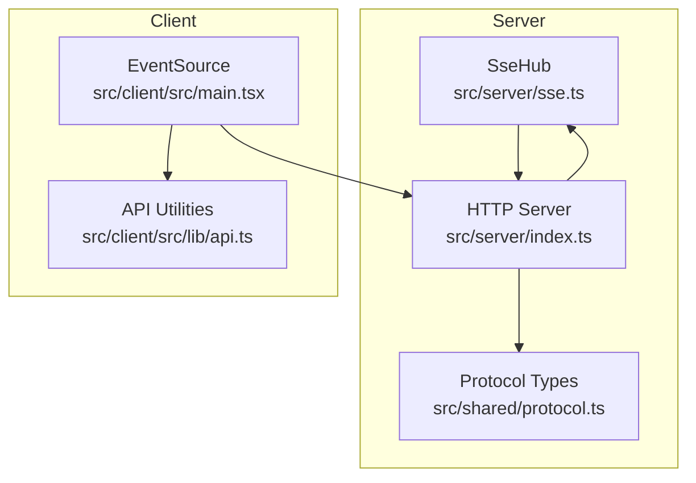
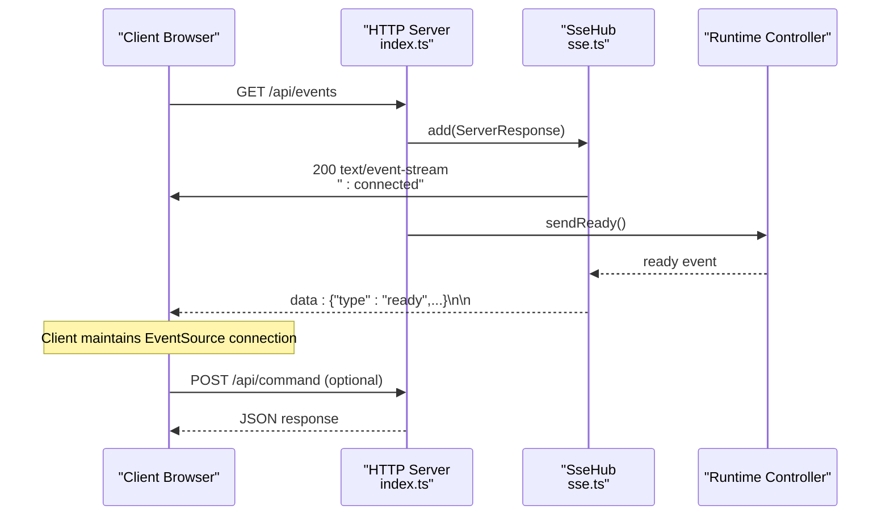
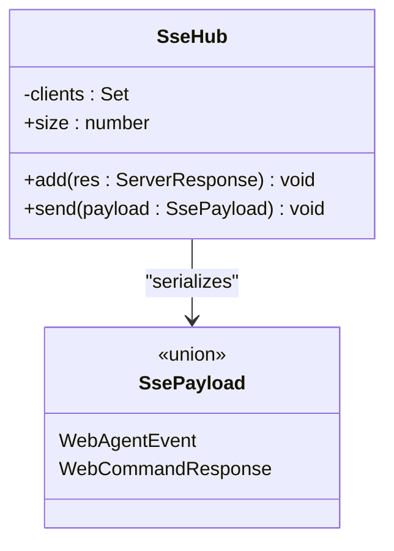
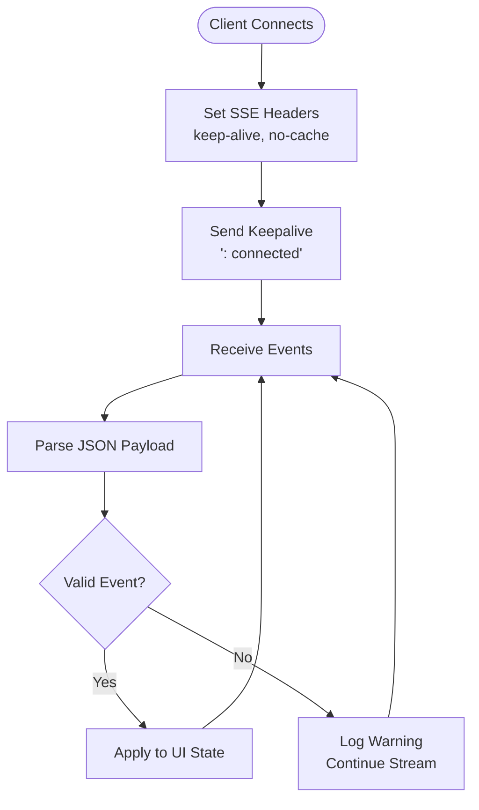
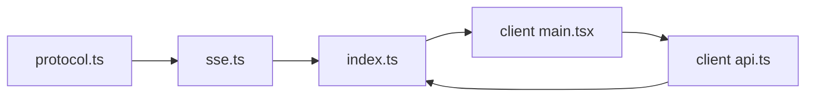

# Server-Sent Events Hub

<cite>
**Referenced Files in This Document**
- [sse.ts](file://src/server/sse.ts)
- [index.ts](file://src/server/index.ts)
- [protocol.ts](file://src/shared/protocol.ts)
- [main.tsx](file://src/client/src/main.tsx)
- [api.ts](file://src/client/src/lib/api.ts)
- [architecture.md](file://docs/architecture.md)
</cite>

## Table of Contents
1. [Introduction](#introduction)
2. [Project Structure](#project-structure)
3. [Core Components](#core-components)
4. [Architecture Overview](#architecture-overview)
5. [Detailed Component Analysis](#detailed-component-analysis)
6. [Dependency Analysis](#dependency-analysis)
7. [Performance Considerations](#performance-considerations)
8. [Troubleshooting Guide](#troubleshooting-guide)
9. [Conclusion](#conclusion)

## Introduction
This document provides comprehensive documentation for the Server-Sent Events (SSE) hub implementation in the quake-web project. It explains the event streaming architecture, client connection management, real-time communication patterns, and the broadcasting mechanism. It covers configuration, connection lifecycle, message serialization, connection limits, performance considerations, and practical examples for event handling, client reconnection logic, and debugging techniques for real-time communication.

## Project Structure
The SSE hub is implemented as a lightweight server-side component that manages persistent connections and broadcasts events to subscribed clients. The server integrates the SSE hub with the broader HTTP API surface, while the client consumes the SSE endpoint via the browser's EventSource API.

**Diagram sources**
- [sse.ts:6-31](file://src/server/sse.ts#L6-L31)
- [index.ts:1-679](file://src/server/index.ts#L1-L679)
- [protocol.ts:161-197](file://src/shared/protocol.ts#L161-L197)
- [main.tsx:570-588](file://src/client/src/main.tsx#L570-L588)
- [api.ts:48-50](file://src/client/src/lib/api.ts#L48-L50)

**Section sources**
- [sse.ts:1-32](file://src/server/sse.ts#L1-L32)
- [index.ts:1-679](file://src/server/index.ts#L1-L679)
- [protocol.ts:1-198](file://src/shared/protocol.ts#L1-L198)
- [main.tsx:570-588](file://src/client/src/main.tsx#L570-L588)
- [api.ts:1-59](file://src/client/src/lib/api.ts#L1-L59)

## Core Components
The SSE hub consists of a single class responsible for managing client connections and broadcasting events. It serializes payloads to the Server-Sent Events format and writes them to all connected clients.

Key responsibilities:
- Accepting new SSE connections and setting appropriate headers
- Maintaining an in-memory registry of active connections
- Broadcasting serialized events to all connected clients
- Cleaning up connections on close

Implementation highlights:
- Uses Node.js HTTP ServerResponse for streaming
- Serializes payloads to JSON and wraps them in SSE data frames
- Tracks client count for monitoring and diagnostics

**Section sources**
- [sse.ts:6-31](file://src/server/sse.ts#L6-L31)

## Architecture Overview
The SSE hub integrates with the HTTP server to provide a dedicated endpoint for real-time updates. Clients connect to the SSE endpoint and receive events as they occur. The server also handles command requests via HTTP POST endpoints, enabling bidirectional control while maintaining unidirectional event streaming.

**Diagram sources**
- [index.ts:408-412](file://src/server/index.ts#L408-L412)
- [sse.ts:9-18](file://src/server/sse.ts#L9-L18)
- [protocol.ts:161-169](file://src/shared/protocol.ts#L161-L169)

**Section sources**
- [index.ts:401-412](file://src/server/index.ts#L401-L412)
- [sse.ts:6-31](file://src/server/sse.ts#L6-L31)
- [protocol.ts:161-169](file://src/shared/protocol.ts#L161-L169)

## Detailed Component Analysis

### SSE Hub Class
The SseHub class encapsulates the core SSE functionality with a minimal, focused API.

**Diagram sources**
- [sse.ts:6-31](file://src/server/sse.ts#L6-L31)
- [protocol.ts:161-197](file://src/shared/protocol.ts#L161-L197)

Key behaviors:
- Connection establishment: Sets SSE headers, sends initial keepalive, registers the connection
- Event broadcasting: Wraps JSON payloads in SSE data frames and writes to all clients
- Cleanup: Removes closed connections from the registry

Connection lifecycle:
- New connections receive SSE headers and an initial keepalive message
- Connections remain open until the client disconnects or the server closes
- On close, the connection is automatically removed from the registry

**Section sources**
- [sse.ts:9-18](file://src/server/sse.ts#L9-L18)
- [sse.ts:21-26](file://src/server/sse.ts#L21-L26)

### Server Integration
The HTTP server integrates the SSE hub by:
- Creating a singleton SseHub instance
- Handling the SSE endpoint to register new clients
- Triggering runtime readiness after client registration
- Broadcasting various event types through the hub

Important integration points:
- SSE endpoint registration and initial handshake
- Runtime readiness signaling to newly connected clients
- Broadcasting terminal events and other runtime events

**Section sources**
- [index.ts:53-53](file://src/server/index.ts#L53-L53)
- [index.ts:408-412](file://src/server/index.ts#L408-L412)
- [index.ts:631-644](file://src/server/index.ts#L631-L644)

### Client-Side Consumption
The client establishes an EventSource connection to the SSE endpoint and processes incoming events. The client-side implementation includes robust error handling and reconnection logic.

Client-side responsibilities:
- Establishing EventSource connection with optional token query parameter
- Handling open, message, and error events
- Parsing and validating incoming event payloads
- Reconciling state when streams encounter errors

Reconnection and resilience:
- Automatic reconnection attempts on network errors
- Periodic state reconciliation during extended idle periods
- Graceful degradation when streams are interrupted

**Section sources**
- [main.tsx:570-588](file://src/client/src/main.tsx#L570-L588)
- [main.tsx:1178-1191](file://src/client/src/main.tsx#L1178-L1191)
- [api.ts:48-50](file://src/client/src/lib/api.ts#L48-L50)

### Message Serialization and Payload Types
The SSE hub serializes payloads using a union type that encompasses both agent events and command responses. The protocol defines the complete set of event types that can be broadcast.

Serialization details:
- Payloads are JSON-encoded and wrapped in SSE data frames
- Each event is terminated with a blank line to conform to SSE specification
- The hub does not implement per-client filtering; all clients receive all events

Payload categories:
- Ready and state updates for runtime synchronization
- Terminal output and lifecycle events
- Error notifications and extension UI requests
- Command responses for administrative operations

**Section sources**
- [sse.ts:21-26](file://src/server/sse.ts#L21-L26)
- [protocol.ts:161-197](file://src/shared/protocol.ts#L161-L197)

### Real-Time Communication Patterns
The system implements several real-time communication patterns:

1. **Event Broadcasting**: All connected clients receive identical event streams
2. **Terminal Streaming**: Terminal output events are broadcast as they occur
3. **State Synchronization**: Ready events provide initial state snapshots
4. **Command Responses**: HTTP POST endpoints return structured responses

**Diagram sources**
- [sse.ts:10-16](file://src/server/sse.ts#L10-L16)
- [main.tsx:1178-1191](file://src/client/src/main.tsx#L1178-L1191)

**Section sources**
- [protocol.ts:161-169](file://src/shared/protocol.ts#L161-L169)
- [main.tsx:1178-1191](file://src/client/src/main.tsx#L1178-L1191)

## Dependency Analysis
The SSE hub has minimal external dependencies and maintains clear boundaries with the rest of the system.

**Diagram sources**
- [protocol.ts:1-198](file://src/shared/protocol.ts#L1-L198)
- [sse.ts:1-5](file://src/server/sse.ts#L1-L5)
- [index.ts:1-25](file://src/server/index.ts#L1-L25)
- [main.tsx:1-10](file://src/client/src/main.tsx#L1-L10)
- [api.ts:1-10](file://src/client/src/lib/api.ts#L1-L10)

Key dependencies:
- Protocol definitions: Defines the shape of all events and commands
- HTTP server: Provides the transport layer for SSE connections
- Client: Consumes events via EventSource and maintains connection state

**Section sources**
- [index.ts:1-25](file://src/server/index.ts#L1-L25)
- [protocol.ts:161-197](file://src/shared/protocol.ts#L161-L197)

## Performance Considerations
Current implementation characteristics:
- Memory footprint: Each connection holds a ServerResponse reference in memory
- Broadcast overhead: Linear scan of all registered clients for each event
- No built-in rate limiting or connection limits
- Minimal CPU overhead for JSON serialization

Performance implications:
- Scalability: The hub maintains all connections in memory, limiting horizontal scalability
- Throughput: Broadcasting to many clients can become CPU-intensive
- Network efficiency: SSE headers and keepalive messages add minimal overhead

Optimization opportunities:
- Connection pooling and backpressure mechanisms
- Client-specific event filtering
- Connection limits and graceful degradation
- Compression for large payloads

**Section sources**
- [sse.ts:7-7](file://src/server/sse.ts#L7-L7)
- [sse.ts:23-25](file://src/server/sse.ts#L23-L25)

## Troubleshooting Guide

### Common Issues and Resolutions

**Connection Problems**
- Symptoms: Client cannot establish SSE connection
- Causes: Authentication failures, CORS issues, server misconfiguration
- Resolution: Verify token handling, check server logs, confirm endpoint accessibility

**Event Delivery Issues**
- Symptoms: Events arrive late or not at all
- Causes: Network interruptions, client-side parsing errors
- Resolution: Implement client reconnection logic, add error logging

**Memory Leaks**
- Symptoms: Increasing memory usage over time
- Causes: Unintentionally retained ServerResponse references
- Resolution: Ensure proper cleanup on connection close

### Debugging Techniques

**Server-Side Debugging**
- Monitor client count via hub.size property
- Log connection lifecycle events
- Track error rates and payload sizes

**Client-Side Debugging**
- Enable verbose logging for EventSource
- Implement retry logic with exponential backoff
- Add heartbeat monitoring and automatic reconnection

**Diagnostic Information**
- Connection establishment timestamps
- Event delivery latency measurements
- Error frequency and types

**Section sources**
- [main.tsx:578-582](file://src/client/src/main.tsx#L578-L582)
- [main.tsx:1193-1198](file://src/client/src/main.tsx#L1193-L1198)

## Conclusion
The SSE hub provides a clean, minimal implementation of real-time event streaming for the quake-web application. Its design emphasizes simplicity and reliability, with clear separation between event production and consumption. While the current implementation focuses on basic broadcasting capabilities, it establishes a solid foundation for future enhancements such as connection limits, client filtering, and improved resilience mechanisms.

The architecture demonstrates effective use of SSE for server-to-browser communication, complemented by HTTP endpoints for command processing. This hybrid approach balances simplicity with functionality, supporting the application's real-time needs while maintaining maintainable code structure.
