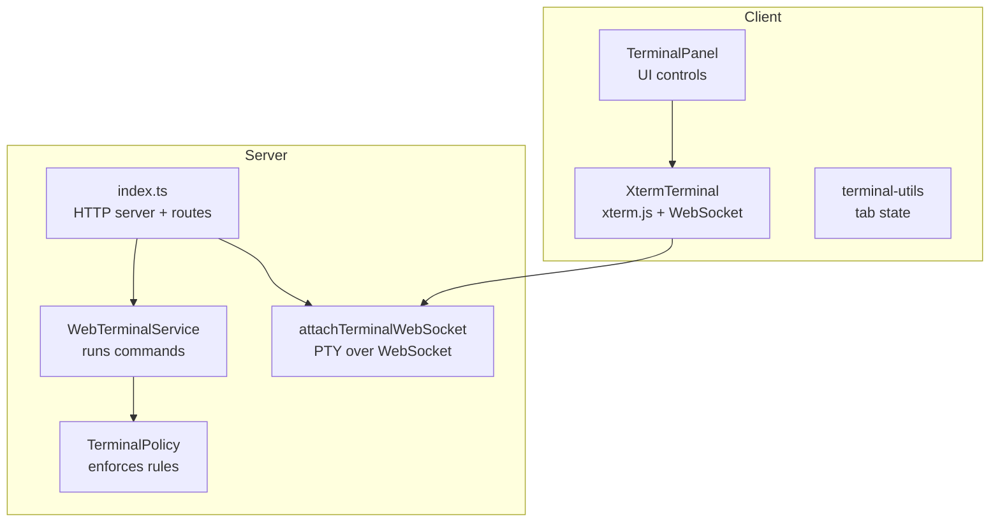
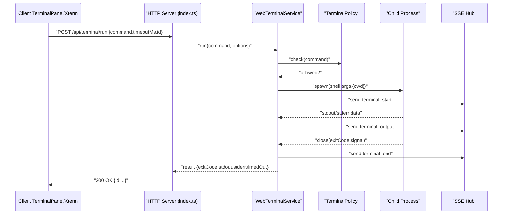
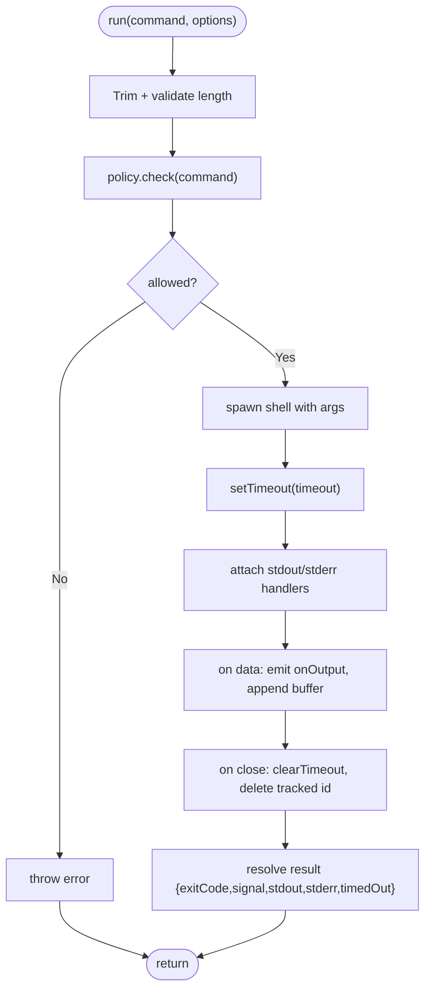
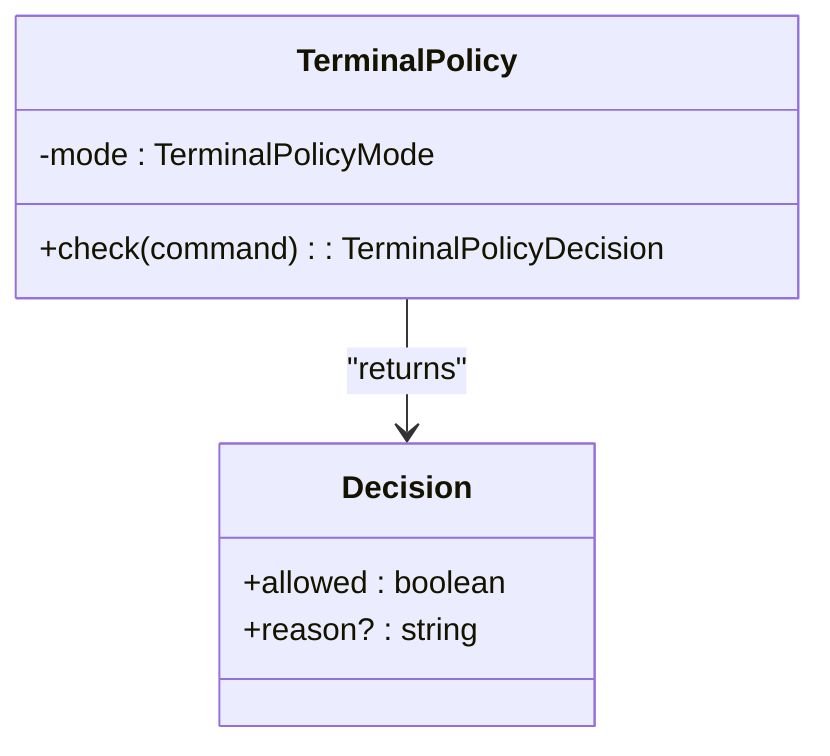
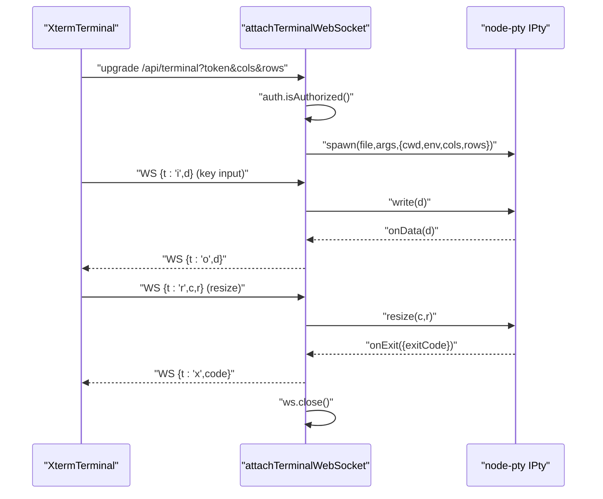
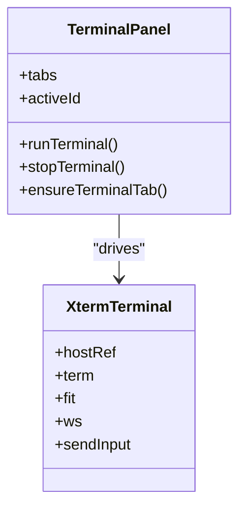
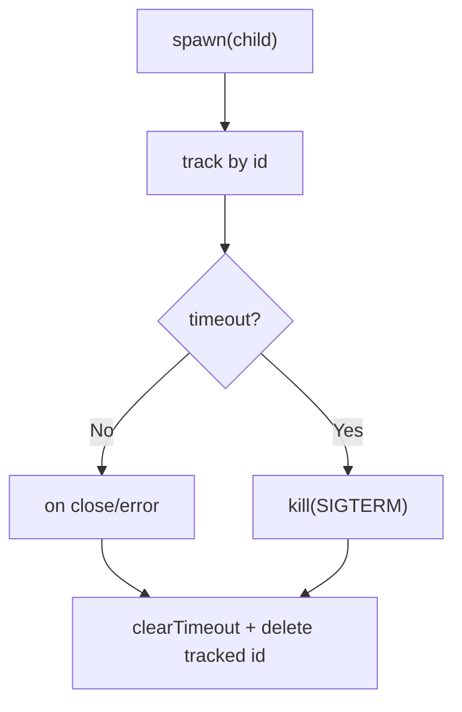
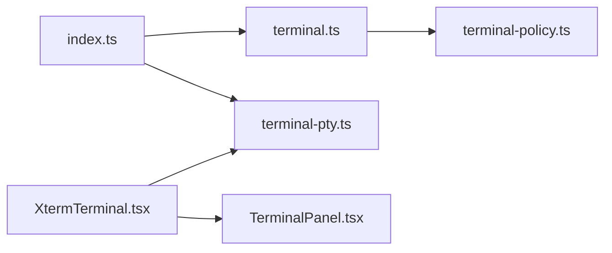

# Terminal Service

<cite>
**Referenced Files in This Document**
- [terminal.ts](file://src/server/terminal.ts)
- [terminal-policy.ts](file://src/server/terminal-policy.ts)
- [terminal-pty.ts](file://src/server/terminal-pty.ts)
- [index.ts](file://src/server/index.ts)
- [TerminalPanel.tsx](file://src/client/src/components/terminal/TerminalPanel.tsx)
- [XtermTerminal.tsx](file://src/client/src/components/terminal/XtermTerminal.tsx)
- [terminal-utils.ts](file://src/client/src/components/terminal/terminal-utils.ts)
- [locks.ts](file://src/server/locks.ts)
- [protocol.ts](file://src/shared/protocol.ts)
- [security.md](file://docs/security.md)
- [terminal.spec.ts](file://test/e2e/terminal.spec.ts)
</cite>

## Table of Contents
1. [Introduction](#introduction)
2. [Project Structure](#project-structure)
3. [Core Components](#core-components)
4. [Architecture Overview](#architecture-overview)
5. [Detailed Component Analysis](#detailed-component-analysis)
6. [Dependency Analysis](#dependency-analysis)
7. [Performance Considerations](#performance-considerations)
8. [Troubleshooting Guide](#troubleshooting-guide)
9. [Conclusion](#conclusion)
10. [Appendices](#appendices)

## Introduction
This document explains the terminal service implementation in the web application, covering local command execution, policy enforcement, and WebSocket integration. It documents the terminal policy system, command filtering, and security restrictions; describes PTY integration, real-time output streaming, and process management; and explains the terminal lock mechanism, timeout handling, and resource cleanup. Practical examples demonstrate terminal configuration, policy setup, and secure command execution patterns.

## Project Structure
The terminal service spans both server and client layers:
- Server-side execution and policy enforcement
- Interactive PTY-backed terminal via WebSocket
- Client-side terminal UI with xterm.js integration
- Shared protocol for events and commands

**Diagram sources**
- [index.ts:631-662](file://src/server/index.ts#L631-L662)
- [terminal.ts:21-87](file://src/server/terminal.ts#L21-L87)
- [terminal-policy.ts:21-39](file://src/server/terminal-policy.ts#L21-L39)
- [terminal-pty.ts:25-95](file://src/server/terminal-pty.ts#L25-L95)
- [TerminalPanel.tsx:9-79](file://src/client/src/components/terminal/TerminalPanel.tsx#L9-L79)
- [XtermTerminal.tsx:64-138](file://src/client/src/components/terminal/XtermTerminal.tsx#L64-L138)
- [terminal-utils.ts:1-6](file://src/client/src/components/terminal/terminal-utils.ts#L1-L6)

**Section sources**
- [index.ts:631-662](file://src/server/index.ts#L631-L662)
- [terminal.ts:21-87](file://src/server/terminal.ts#L21-L87)
- [terminal-policy.ts:21-39](file://src/server/terminal-policy.ts#L21-L39)
- [terminal-pty.ts:25-95](file://src/server/terminal-pty.ts#L25-L95)
- [TerminalPanel.tsx:9-79](file://src/client/src/components/terminal/TerminalPanel.tsx#L9-L79)
- [XtermTerminal.tsx:64-138](file://src/client/src/components/terminal/XtermTerminal.tsx#L64-L138)
- [terminal-utils.ts:1-6](file://src/client/src/components/terminal/terminal-utils.ts#L1-L6)

## Core Components
- WebTerminalService: Executes commands locally with timeouts, output capture, and optional ID tracking.
- TerminalPolicy: Enforces a configurable policy mode with predefined dangerous-pattern detection.
- attachTerminalWebSocket: Provides interactive PTY terminals over WebSocket for xterm.js clients.
- Client terminal UI: Renders terminal output, handles input, and displays warnings for risky commands.
- Protocol and server routes: Define events and HTTP endpoints for terminal execution and PTY connections.

**Section sources**
- [terminal.ts:21-87](file://src/server/terminal.ts#L21-L87)
- [terminal-policy.ts:21-39](file://src/server/terminal-policy.ts#L21-L39)
- [terminal-pty.ts:25-95](file://src/server/terminal-pty.ts#L25-L95)
- [TerminalPanel.tsx:9-79](file://src/client/src/components/terminal/TerminalPanel.tsx#L9-L79)
- [XtermTerminal.tsx:64-138](file://src/client/src/components/terminal/XtermTerminal.tsx#L64-L138)
- [protocol.ts:161-169](file://src/shared/protocol.ts#L161-L169)
- [index.ts:631-662](file://src/server/index.ts#L631-L662)

## Architecture Overview
The terminal service integrates two execution modes:
- Batch execution via HTTP endpoint for non-interactive command runs with output capture and SSE events.
- Interactive PTY terminal via WebSocket for real-time, bidirectional terminal sessions with xterm.js.

**Diagram sources**
- [index.ts:631-644](file://src/server/index.ts#L631-L644)
- [terminal.ts:36-85](file://src/server/terminal.ts#L36-L85)
- [terminal-policy.ts:24-32](file://src/server/terminal-policy.ts#L24-L32)
- [protocol.ts:165-167](file://src/shared/protocol.ts#L165-L167)

## Detailed Component Analysis

### Terminal Execution Engine (WebTerminalService)
Responsibilities:
- Validates and trims commands, enforces policy, spawns OS shell processes, captures output streams, applies timeouts, and cleans up resources.
- Supports optional identifiers for tracking multiple concurrent executions and emits lifecycle events.

Key behaviors:
- Command validation: rejects empty or overly long commands.
- Policy enforcement: consults TerminalPolicy before spawning.
- Timeout handling: kills process on timeout and marks result as timedOut.
- Output buffering: maintains bounded stdout/stderr buffers.
- Lifecycle hooks: onStart/onOutput callbacks for integration.

**Diagram sources**
- [terminal.ts:36-85](file://src/server/terminal.ts#L36-L85)
- [terminal-policy.ts:24-32](file://src/server/terminal-policy.ts#L24-L32)

**Section sources**
- [terminal.ts:21-87](file://src/server/terminal.ts#L21-L87)

### Terminal Policy System
Policy modes:
- safe: blocks known dangerous patterns.
- allow-all: permits all commands.
- disabled: blocks all commands.

Dangerous patterns include recursive deletion, disk formatting, destructive Git operations, publishing, piping downloads to shells, PowerShell Invoke-Expression, and chmod 777.

**Diagram sources**
- [terminal-policy.ts:21-39](file://src/server/terminal-policy.ts#L21-L39)

**Section sources**
- [terminal-policy.ts:1-39](file://src/server/terminal-policy.ts#L1-L39)
- [security.md:13](file://docs/security.md#L13)

### Interactive PTY Terminal (WebSocket)
Interactive terminal flow:
- Server upgrades HTTP requests to WebSocket at /api/terminal with authentication.
- Spawns a PTY using node-pty with appropriate shell and environment.
- Forwards client input to PTY and PTY output back to client.
- Handles resize events and process exit.

**Diagram sources**
- [terminal-pty.ts:25-95](file://src/server/terminal-pty.ts#L25-L95)
- [XtermTerminal.tsx:98-114](file://src/client/src/components/terminal/XtermTerminal.tsx#L98-L114)

**Section sources**
- [terminal-pty.ts:1-95](file://src/server/terminal-pty.ts#L1-L95)
- [XtermTerminal.tsx:64-138](file://src/client/src/components/terminal/XtermTerminal.tsx#L64-L138)

### Client Terminal UI
Client responsibilities:
- TerminalPanel renders command input, history navigation, run/stop buttons, output area, and ANSI rendering.
- XtermTerminal manages xterm.js instance, WebSocket connection, input forwarding, output writing, resizing, and theme updates.
- Risk indicators warn about potentially destructive commands.

**Diagram sources**
- [TerminalPanel.tsx:9-79](file://src/client/src/components/terminal/TerminalPanel.tsx#L9-L79)
- [XtermTerminal.tsx:64-138](file://src/client/src/components/terminal/XtermTerminal.tsx#L64-L138)
- [terminal-utils.ts:1-6](file://src/client/src/components/terminal/terminal-utils.ts#L1-L6)

**Section sources**
- [TerminalPanel.tsx:9-79](file://src/client/src/components/terminal/TerminalPanel.tsx#L9-L79)
- [XtermTerminal.tsx:64-138](file://src/client/src/components/terminal/XtermTerminal.tsx#L64-L138)
- [terminal-utils.ts:1-6](file://src/client/src/components/terminal/terminal-utils.ts#L1-L6)

### Terminal Lock Mechanism and Resource Cleanup
- Terminal lock: The server tracks active child processes by optional IDs and ensures graceful cleanup on close/error.
- Timeout handling: Processes are terminated after a bounded timeout window.
- WebSocket cleanup: PTY is killed on client disconnect; xterm.js resources are disposed on unmount.

**Diagram sources**
- [terminal.ts:29-85](file://src/server/terminal.ts#L29-L85)
- [terminal-pty.ts:90-93](file://src/server/terminal-pty.ts#L90-L93)

**Section sources**
- [terminal.ts:21-87](file://src/server/terminal.ts#L21-L87)
- [terminal-pty.ts:90-93](file://src/server/terminal-pty.ts#L90-L93)

## Dependency Analysis
- Server entrypoint wires terminal service, policy, and WebSocket handler.
- Terminal execution depends on policy and spawns child processes.
- Interactive terminal depends on node-pty and WebSocket server.
- Client depends on xterm.js and WebSocket transport.

**Diagram sources**
- [index.ts:631-662](file://src/server/index.ts#L631-L662)
- [terminal.ts:21-87](file://src/server/terminal.ts#L21-L87)
- [terminal-policy.ts:21-39](file://src/server/terminal-policy.ts#L21-L39)
- [terminal-pty.ts:25-95](file://src/server/terminal-pty.ts#L25-L95)
- [XtermTerminal.tsx:64-138](file://src/client/src/components/terminal/XtermTerminal.tsx#L64-L138)
- [TerminalPanel.tsx:9-79](file://src/client/src/components/terminal/TerminalPanel.tsx#L9-L79)

**Section sources**
- [index.ts:631-662](file://src/server/index.ts#L631-L662)
- [terminal.ts:21-87](file://src/server/terminal.ts#L21-L87)
- [terminal-policy.ts:21-39](file://src/server/terminal-policy.ts#L21-L39)
- [terminal-pty.ts:25-95](file://src/server/terminal-pty.ts#L25-L95)
- [XtermTerminal.tsx:64-138](file://src/client/src/components/terminal/XtermTerminal.tsx#L64-L138)
- [TerminalPanel.tsx:9-79](file://src/client/src/components/terminal/TerminalPanel.tsx#L9-L79)

## Performance Considerations
- Output buffering: Server caps buffered output to prevent memory growth.
- Timeouts: Enforced with a bounded window to avoid runaway processes.
- WebSocket throughput: Client fits terminal to container and sends resize events to optimize rendering.
- Rendering: Client-side ANSI parsing and selective re-rendering minimize DOM overhead.

[No sources needed since this section provides general guidance]

## Troubleshooting Guide
Common issues and resolutions:
- Authentication failures for WebSocket: Ensure token is present and valid; server checks authorization during upgrade.
- Terminal disabled: Verify terminal policy mode is not disabled; server config reflects terminalEnabled accordingly.
- Excessive output: Output is truncated to a bounded size; consider reducing command verbosity or increasing limits carefully.
- Timeout errors: Increase timeoutMs or simplify the command; ensure the process completes within the allowed window.
- Interactive terminal not starting: Check shell availability and environment; server reports initialization errors to the client.

**Section sources**
- [terminal-pty.ts:36-42](file://src/server/terminal-pty.ts#L36-L42)
- [index.ts:90-91](file://src/server/index.ts#L90-L91)
- [terminal.ts:56-67](file://src/server/terminal.ts#L56-L67)
- [terminal.ts:57-60](file://src/server/terminal.ts#L57-L60)
- [terminal-pty.ts:61-66](file://src/server/terminal-pty.ts#L61-L66)

## Conclusion
The terminal service combines a secure, policy-enforced batch execution engine with a responsive, interactive PTY terminal over WebSocket. Together, they provide safe, real-time command execution with robust security controls, predictable timeouts, and efficient resource management.

[No sources needed since this section summarizes without analyzing specific files]

## Appendices

### Secure Command Execution Patterns
- Prefer the interactive PTY terminal for iterative work requiring real-time feedback.
- Use the batch endpoint for automated tasks with explicit timeouts and output capture.
- Configure terminal policy to “safeÔÇØ for production environments; adjust to “allow-allÔÇØ only in trusted contexts.
- Monitor SSE events for terminal lifecycle and output streams.

**Section sources**
- [index.ts:631-644](file://src/server/index.ts#L631-L644)
- [terminal.ts:36-85](file://src/server/terminal.ts#L36-L85)
- [terminal-policy.ts:21-39](file://src/server/terminal-policy.ts#L21-L39)
- [security.md:13](file://docs/security.md#L13)

### Example: Terminal Configuration and Policy Setup
- Environment variables:
  - QUAKES_WEB_TERMINAL_POLICY: safe | allow-all | disabled
  - QUAKES_WEB_AUTH: enable/disable API auth
  - QUAKES_WEB_ALLOW_REMOTE: permit non-local access
- Runtime configuration:
  - Server exposes terminalEnabled and terminalPolicyMode in /api/config.
  - Client receives server config and updates UI accordingly.

**Section sources**
- [security.md:15-26](file://docs/security.md#L15-L26)
- [index.ts:85-95](file://src/server/index.ts#L85-L95)
- [protocol.ts:112-122](file://src/shared/protocol.ts#L112-L122)

### Example: Running Commands via Tests
End-to-end tests demonstrate:
- Executing echo commands and verifying output.
- Creating new terminal tabs and copying output.
- Warning indicators for dangerous commands.

**Section sources**
- [terminal.spec.ts:13-37](file://test/e2e/terminal.spec.ts#L13-L37)
- [terminal.spec.ts:39-43](file://test/e2e/terminal.spec.ts#L39-L43)
- [terminal.spec.ts:45-50](file://test/e2e/terminal.spec.ts#L45-L50)
- [terminal.spec.ts:59-70](file://test/e2e/terminal.spec.ts#L59-L70)
