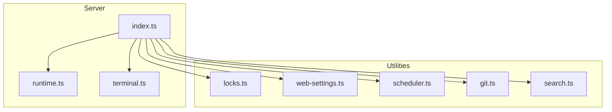
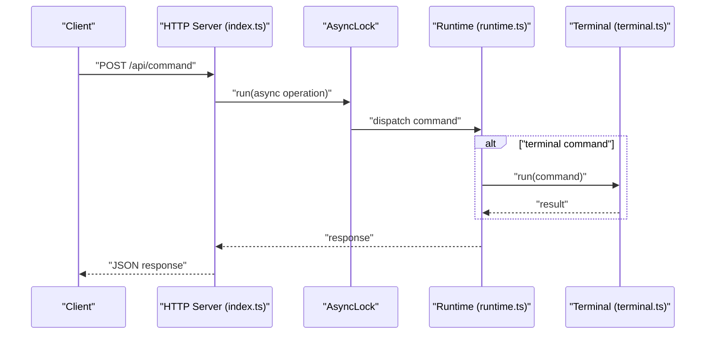
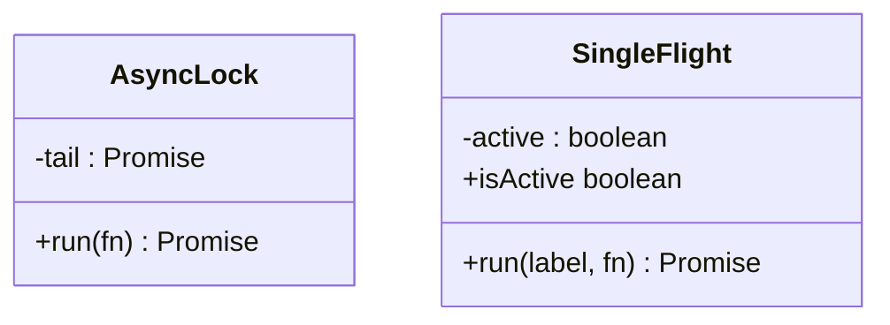
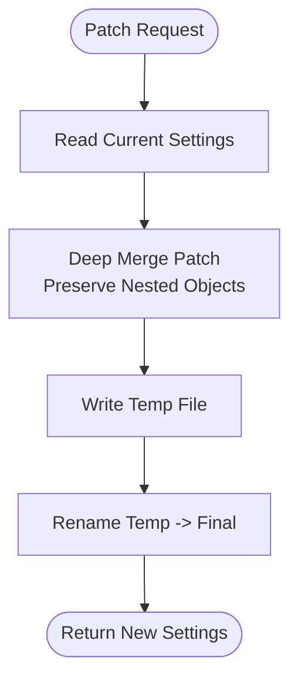
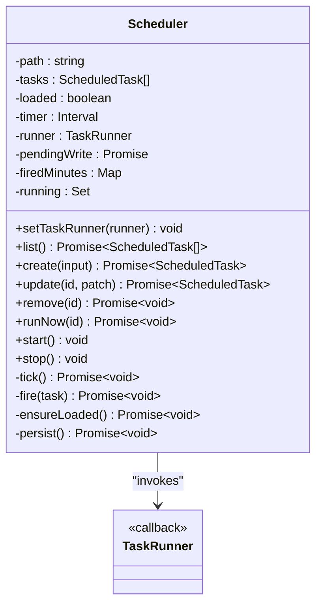
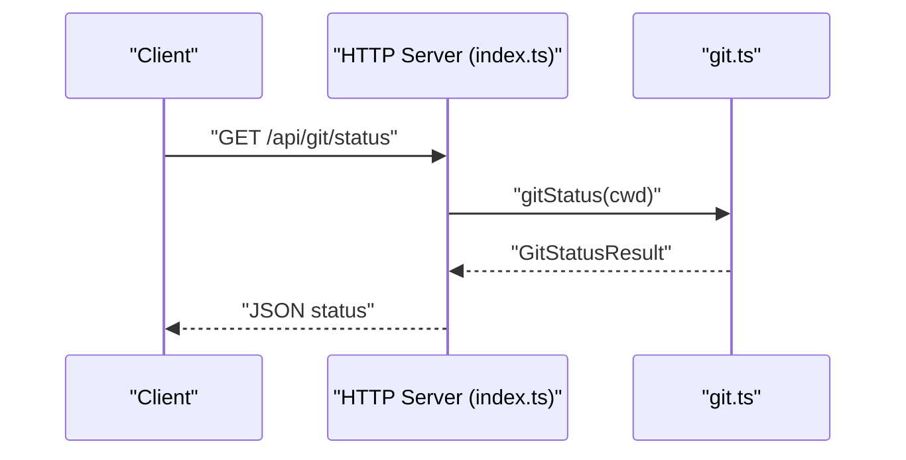
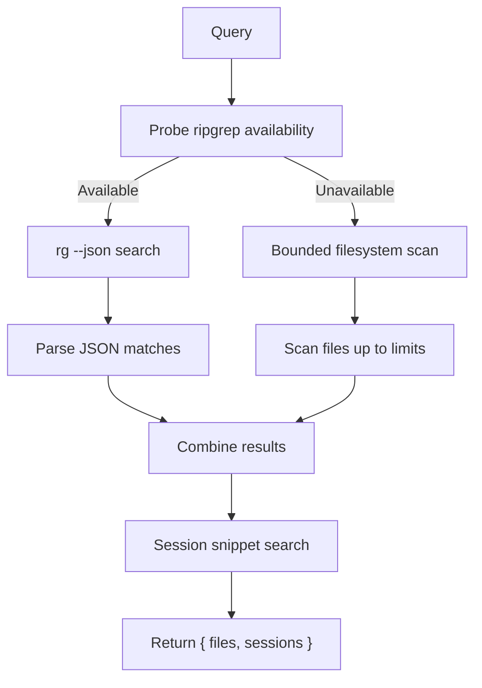
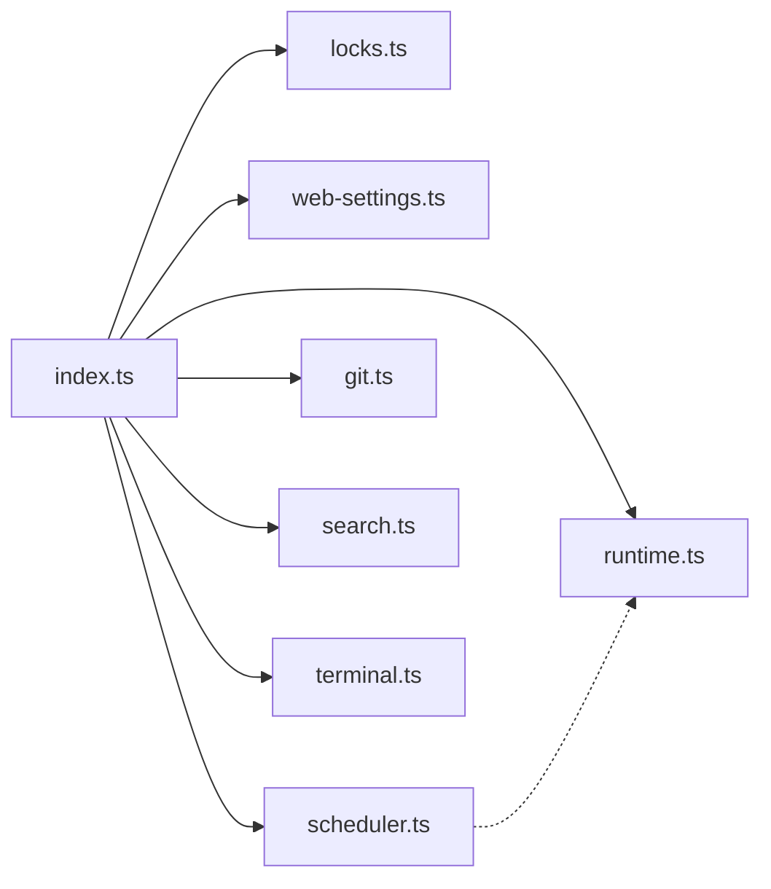

# Utility Services

<cite>
**Referenced Files in This Document**
- [locks.ts](file://src/server/locks.ts)
- [web-settings.ts](file://src/server/web-settings.ts)
- [scheduler.ts](file://src/server/scheduler.ts)
- [git.ts](file://src/server/git.ts)
- [search.ts](file://src/server/search.ts)
- [index.ts](file://src/server/index.ts)
- [terminal.ts](file://src/server/terminal.ts)
- [runtime.ts](file://src/server/runtime.ts)
</cite>

## Table of Contents
1. [Introduction](#introduction)
2. [Project Structure](#project-structure)
3. [Core Components](#core-components)
4. [Architecture Overview](#architecture-overview)
5. [Detailed Component Analysis](#detailed-component-analysis)
6. [Dependency Analysis](#dependency-analysis)
7. [Performance Considerations](#performance-considerations)
8. [Troubleshooting Guide](#troubleshooting-guide)
9. [Conclusion](#conclusion)

## Introduction
This document explains the utility services powering the web server, focusing on concurrency control, persistence, scheduling, Git operations, and search. It covers:
- Async lock and single-flight patterns for safe concurrent execution
- Web settings persistence with atomic writes
- Scheduler with cron-like expressions and task lifecycle
- Git integration for status, diffs, staging, committing, pushing, and PR creation
- Search indexing and retrieval with ripgrep fallback

These services are wired into the HTTP server and used by the runtime and UI.

## Project Structure
The relevant server-side modules are organized by responsibility:
- Concurrency and synchronization: locks.ts
- Web settings persistence: web-settings.ts
- Task scheduling: scheduler.ts
- Git operations: git.ts
- Search: search.ts
- HTTP server and wiring: index.ts
- Terminal execution: terminal.ts
- Runtime orchestration: runtime.ts

**Diagram sources**
- [index.ts:16-25](file://src/server/index.ts#L16-L25)
- [locks.ts:1-38](file://src/server/locks.ts#L1-L38)
- [web-settings.ts:13-64](file://src/server/web-settings.ts#L13-L64)
- [scheduler.ts:54-242](file://src/server/scheduler.ts#L54-L242)
- [git.ts:94-334](file://src/server/git.ts#L94-L334)
- [search.ts:97-284](file://src/server/search.ts#L97-L284)
- [terminal.ts:21-87](file://src/server/terminal.ts#L21-L87)
- [runtime.ts:12-30](file://src/server/runtime.ts#L12-L30)

**Section sources**
- [index.ts:16-25](file://src/server/index.ts#L16-L25)

## Core Components
- AsyncLock: serializes async operations to prevent overlap
- SingleFlight: ensures only one execution of a labeled operation at a time
- WebSettingsService: reads/writes persistent web settings with atomic updates
- Scheduler: manages cron-like tasks, persists state, and triggers executions
- Git integration: status, diff, stage/unstage, commit, push, branch, and PR creation
- Search: file content search via ripgrep with fallback, and session-based search

**Section sources**
- [locks.ts:1-38](file://src/server/locks.ts#L1-L38)
- [web-settings.ts:13-64](file://src/server/web-settings.ts#L13-L64)
- [scheduler.ts:54-242](file://src/server/scheduler.ts#L54-L242)
- [git.ts:94-334](file://src/server/git.ts#L94-L334)
- [search.ts:97-284](file://src/server/search.ts#L97-L284)

## Architecture Overview
The server initializes services and wires them into HTTP routes. Concurrency-sensitive operations are guarded by AsyncLock and SingleFlight. Persistence is handled by atomic write patterns. Git and search are exposed via dedicated endpoints.

**Diagram sources**
- [index.ts:255-374](file://src/server/index.ts#L255-L374)
- [locks.ts:4-16](file://src/server/locks.ts#L4-L16)
- [runtime.ts:60-62](file://src/server/runtime.ts#L60-L62)
- [terminal.ts:36-87](file://src/server/terminal.ts#L36-L87)

## Detailed Component Analysis

### Concurrency Control: AsyncLock and SingleFlight
AsyncLock enforces serialized execution of async tasks. SingleFlight prevents overlapping execution of a labeled operation.

Usage highlights:
- AsyncLock wraps sensitive runtime commands to serialize them
- SingleFlight guards terminal execution to avoid concurrent runs

**Diagram sources**
- [locks.ts:1-38](file://src/server/locks.ts#L1-L38)
- [index.ts:72-73](file://src/server/index.ts#L72-L73)
- [index.ts:311-367](file://src/server/index.ts#L311-L367)
- [terminal.ts:36-87](file://src/server/terminal.ts#L36-L87)

**Section sources**
- [locks.ts:1-38](file://src/server/locks.ts#L1-L38)
- [index.ts:72-73](file://src/server/index.ts#L72-L73)
- [index.ts:311-367](file://src/server/index.ts#L311-L367)
- [terminal.ts:36-87](file://src/server/terminal.ts#L36-L87)

### Web Settings Persistence
WebSettingsService persists user preferences to a JSON file with atomic writes:
- Reads current settings (with pending-write coalescing)
- Applies patches with deep merges for nested objects
- Writes via temp file + rename to ensure atomicity
- Provides helpers to toggle extension enablement

**Diagram sources**
- [web-settings.ts:36-50](file://src/server/web-settings.ts#L36-L50)
- [web-settings.ts:21-34](file://src/server/web-settings.ts#L21-L34)

**Section sources**
- [web-settings.ts:13-64](file://src/server/web-settings.ts#L13-L64)
- [index.ts:462-464](file://src/server/index.ts#L462-L464)
- [index.ts:564-567](file://src/server/index.ts#L564-L567)

### Scheduler: Task Management and Execution
Scheduler provides a lightweight cron-like system:
- Stores tasks in a JSON file under the workspace
- Validates cron expressions and computes next run
- Runs a periodic tick to check and fire eligible tasks
- Prevents overlapping runs and double-fires within a tick window
- Integrates with runtime via a task runner callback

**Diagram sources**
- [scheduler.ts:54-242](file://src/server/scheduler.ts#L54-L242)

**Section sources**
- [scheduler.ts:54-242](file://src/server/scheduler.ts#L54-L242)
- [index.ts:75-83](file://src/server/index.ts#L75-L83)
- [index.ts:520-563](file://src/server/index.ts#L520-L563)

### Git Integration Patterns
Git service exposes operations backed by the Git CLI:
- Status: branch, ahead/behind, and file changes with staged/worktree stats
- Diff: staged or working-tree unified diff, with synthetic diff for untracked
- Stage/Unstage: add/reset with normalized path handling
- Commit: commit with message and capture commit hash
- Push: push with automatic upstream setup when missing
- Branch: current branch name
- Pull Request: creates PR via GitHub CLI (gh) with error handling

**Diagram sources**
- [index.ts:478-480](file://src/server/index.ts#L478-L480)
- [git.ts:165-212](file://src/server/git.ts#L165-L212)

**Section sources**
- [git.ts:94-334](file://src/server/git.ts#L94-L334)
- [index.ts:478-513](file://src/server/index.ts#L478-L513)

### Search Indexing and Retrieval
Search supports two modes:
- File content search: prefers ripgrep with JSON output, falls back to a bounded JS scanner
- Session search: scans session metadata and messages for snippets

**Diagram sources**
- [search.ts:97-106](file://src/server/search.ts#L97-L106)
- [search.ts:108-142](file://src/server/search.ts#L108-L142)
- [search.ts:169-191](file://src/server/search.ts#L169-L191)
- [search.ts:269-283](file://src/server/search.ts#L269-L283)

**Section sources**
- [search.ts:97-284](file://src/server/search.ts#L97-L284)
- [index.ts:514-519](file://src/server/index.ts#L514-L519)

## Dependency Analysis
- index.ts depends on locks, web-settings, scheduler, git, search, runtime, and terminal
- Scheduler is wired to runtime's prompt method to execute scheduled tasks
- Web settings integrates with extension toggles and runtime settings
- Git and search endpoints delegate to their respective modules

**Diagram sources**
- [index.ts:16-25](file://src/server/index.ts#L16-L25)
- [index.ts:75-83](file://src/server/index.ts#L75-L83)

**Section sources**
- [index.ts:16-25](file://src/server/index.ts#L16-L25)
- [index.ts:75-83](file://src/server/index.ts#L75-L83)

## Performance Considerations
- Concurrency control
  - AsyncLock prevents resource contention for sensitive operations
  - SingleFlight avoids redundant work for terminal runs
- Persistence
  - Atomic writes (temp file + rename) minimize partial writes and race conditions
- Scheduler
  - Periodic tick with minute-bucket deduplication avoids double-fires
  - Running set prevents overlapping executions of the same task
- Git
  - Parallelized numstat queries reduce latency
  - Controlled timeouts and buffer sizes bound resource usage
- Search
  - ripgrep preferred for speed; bounded results and file size limits cap cost
  - Skip directories to avoid irrelevant scans

[No sources needed since this section provides general guidance]

## Troubleshooting Guide
- Scheduler errors
  - Validation failures for name, prompt, or cron trigger custom errors with HTTP-friendly status codes
  - Missing task runner during fire throws a specific error
- Git operations
  - Missing commands or upstream misconfiguration surfaced with actionable messages
  - gh absence detected and reported clearly
- Search
  - rg spawn failures or non-match exit handled gracefully; fallback activated
- Settings
  - JSON parsing errors on read return defaults; patch returns latest merged settings

**Section sources**
- [scheduler.ts:250-257](file://src/server/scheduler.ts#L250-L257)
- [git.ts:317-333](file://src/server/git.ts#L317-L333)
- [search.ts:133-141](file://src/server/search.ts#L133-L141)
- [web-settings.ts:26-34](file://src/server/web-settings.ts#L26-L34)

## Conclusion
The utility services provide robust, production-ready foundations:
- Concurrency-safe execution via AsyncLock and SingleFlight
- Reliable persistence with atomic writes
- Flexible, cron-like scheduling with persistence and deduplication
- Comprehensive Git integration with clear error handling
- Efficient search with ripgrep and graceful fallback

They are cleanly integrated into the server and ready for extension and monitoring.
