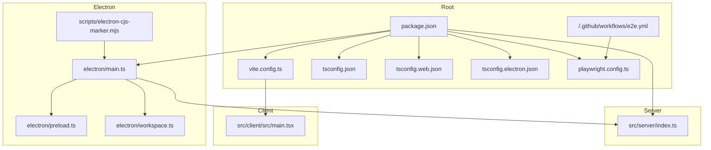
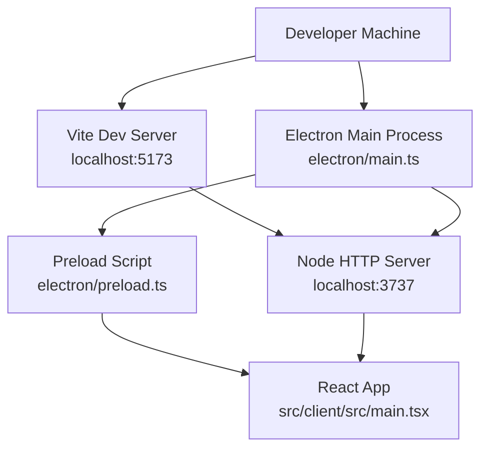
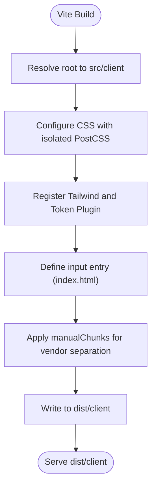
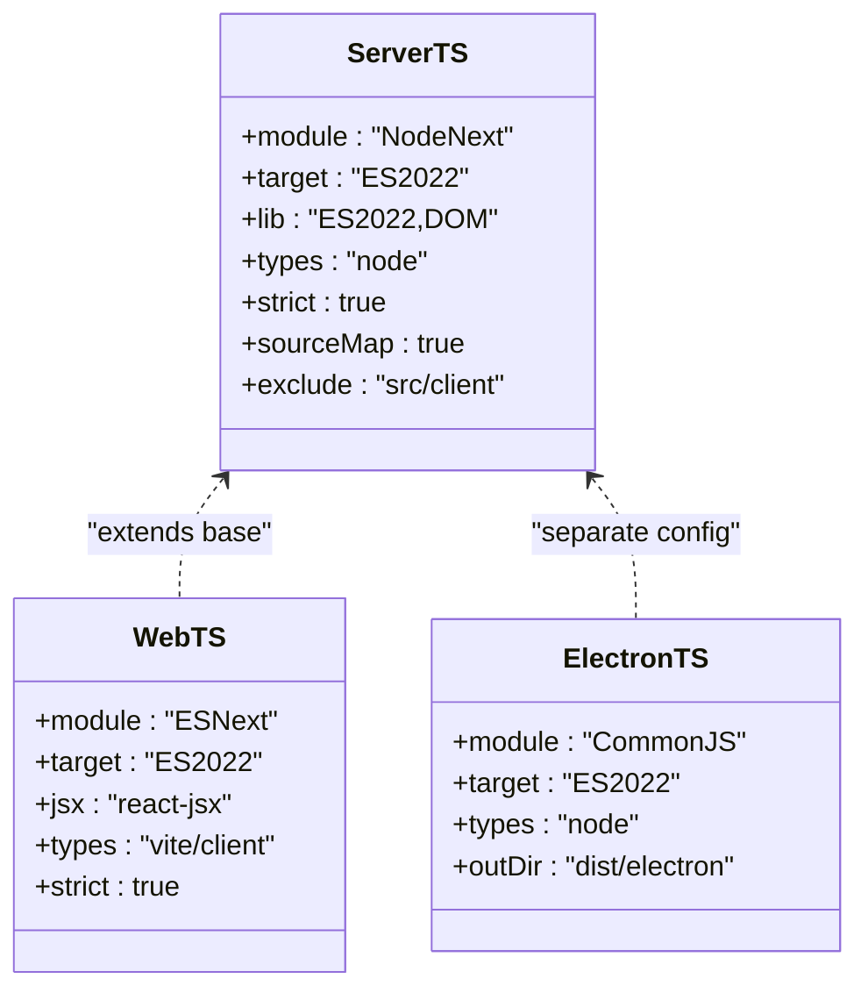
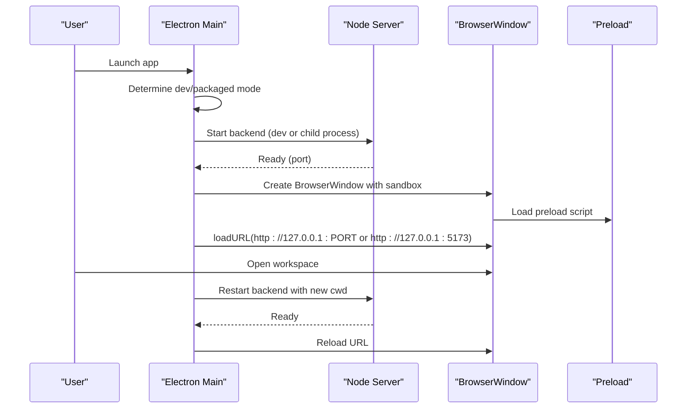
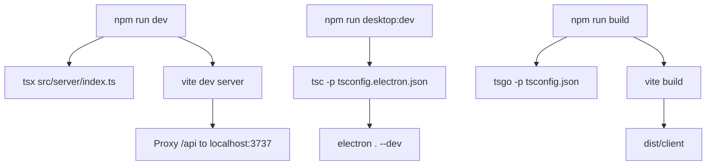
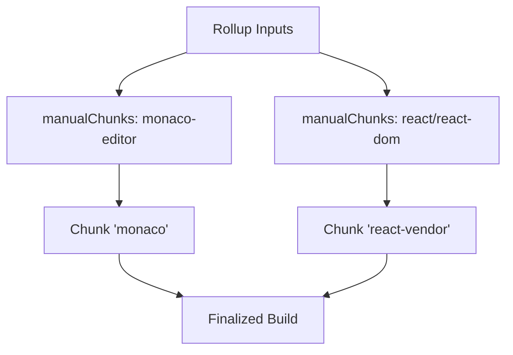
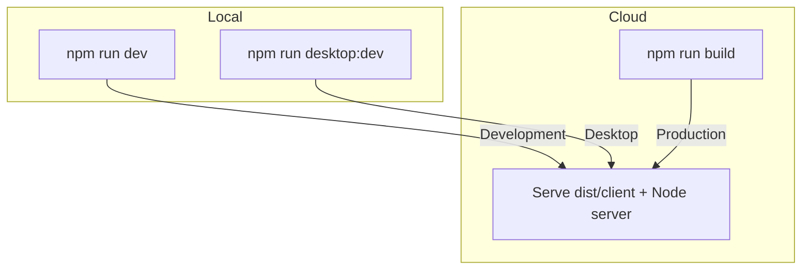
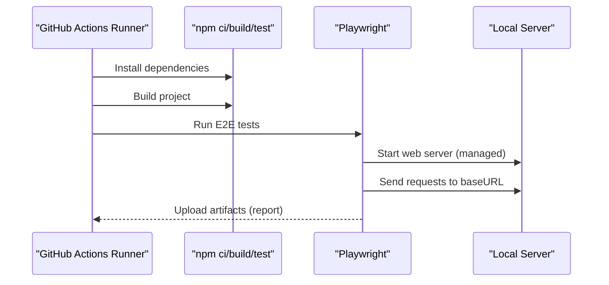
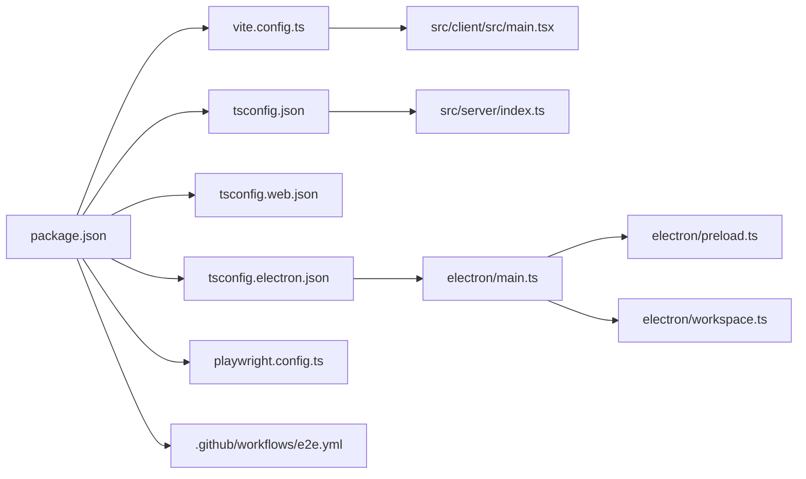

# Build and Deployment

<cite>
**Referenced Files in This Document**
- [package.json](file://package.json)
- [vite.config.ts](file://vite.config.ts)
- [tsconfig.json](file://tsconfig.json)
- [tsconfig.web.json](file://tsconfig.web.json)
- [tsconfig.electron.json](file://tsconfig.electron.json)
- [electron/main.ts](file://electron/main.ts)
- [electron/preload.ts](file://electron/preload.ts)
- [electron/workspace.ts](file://electron/workspace.ts)
- [scripts/electron-cjs-marker.mjs](file://scripts/electron-cjs-marker.mjs)
- [playwright.config.ts](file://playwright.config.ts)
- [.github/workflows/e2e.yml](file://.github/workflows/e2e.yml)
- [src/server/index.ts](file://src/server/index.ts)
- [src/client/src/main.tsx](file://src/client/src/main.tsx)
- [README.md](file://README.md)
- [docs/architecture.md](file://docs/architecture.md)
</cite>

## Table of Contents
1. [Introduction](#introduction)
2. [Project Structure](#project-structure)
3. [Core Components](#core-components)
4. [Architecture Overview](#architecture-overview)
5. [Detailed Component Analysis](#detailed-component-analysis)
6. [Dependency Analysis](#dependency-analysis)
7. [Performance Considerations](#performance-considerations)
8. [Troubleshooting Guide](#troubleshooting-guide)
9. [Conclusion](#conclusion)
10. [Appendices](#appendices)

## Introduction
This document describes the multi-environment build and deployment system for the Quake Code Web application. It covers:
- Vite configuration for web builds and development server
- TypeScript compilation settings for server, client, and Electron
- Electron packaging and runtime integration
- Development versus production differences
- Asset optimization and bundling strategies
- Deployment options: local development servers, packaged desktop applications, and cloud hosting
- CI/CD pipeline configuration, automated testing, and release management

## Project Structure
The project is organized as a multi-package workspace with a web client, a Node.js server, and an Electron shell. Key build and configuration files are centralized at the repository root, while environment-specific configurations live under Electron and TypeScript configuration files.

**Diagram sources**
- [package.json:1-69](file://package.json#L1-L69)
- [vite.config.ts:1-50](file://vite.config.ts#L1-L50)
- [tsconfig.json:1-21](file://tsconfig.json#L1-L21)
- [tsconfig.web.json:1-19](file://tsconfig.web.json#L1-L19)
- [tsconfig.electron.json:1-20](file://tsconfig.electron.json#L1-L20)
- [playwright.config.ts:1-28](file://playwright.config.ts#L1-L28)
- [.github/workflows/e2e.yml:1-33](file://.github/workflows/e2e.yml#L1-L33)
- [electron/main.ts:1-171](file://electron/main.ts#L1-L171)
- [electron/preload.ts:1-15](file://electron/preload.ts#L1-L15)
- [electron/workspace.ts:1-66](file://electron/workspace.ts#L1-L66)
- [scripts/electron-cjs-marker.mjs:1-7](file://scripts/electron-cjs-marker.mjs#L1-L7)
- [src/server/index.ts:1-679](file://src/server/index.ts#L1-L679)
- [src/client/src/main.tsx:1-800](file://src/client/src/main.tsx#L1-L800)

**Section sources**
- [package.json:1-69](file://package.json#L1-L69)
- [vite.config.ts:1-50](file://vite.config.ts#L1-L50)
- [tsconfig.json:1-21](file://tsconfig.json#L1-L21)
- [tsconfig.web.json:1-19](file://tsconfig.web.json#L1-L19)
- [tsconfig.electron.json:1-20](file://tsconfig.electron.json#L1-L20)
- [playwright.config.ts:1-28](file://playwright.config.ts#L1-L28)
- [.github/workflows/e2e.yml:1-33](file://.github/workflows/e2e.yml#L1-L33)
- [electron/main.ts:1-171](file://electron/main.ts#L1-L171)
- [electron/preload.ts:1-15](file://electron/preload.ts#L1-L15)
- [electron/workspace.ts:1-66](file://electron/workspace.ts#L1-L66)
- [scripts/electron-cjs-marker.mjs:1-7](file://scripts/electron-cjs-marker.mjs#L1-L7)
- [src/server/index.ts:1-679](file://src/server/index.ts#L1-L679)
- [src/client/src/main.tsx:1-800](file://src/client/src/main.tsx#L1-L800)

## Core Components
- Scripts and toolchain:
  - Development: concurrently orchestrates the server and Vite dev server
  - Production build: TypeScript compilation for server and Electron, followed by Vite build
  - Electron: TypeScript compile for main process, marker script to emit CommonJS package metadata, and desktop start/dev flows
  - Testing: Playwright E2E tests with a managed web server lifecycle
- Vite configuration:
  - Root and output directories for client assets
  - Tailwind plugin and a custom HTML transform plugin for injecting a token in development
  - Proxy for API endpoints to the local backend
  - Rollup manual chunking strategy for vendor bundles
- TypeScript configurations:
  - Base server config targeting NodeNext with strictness and source maps
  - Web client config targeting ESNext with JSX and Vite client types
  - Electron main process config targeting CommonJS with Node types and output under dist/electron
- Electron runtime:
  - Main process manages backend lifecycle, window creation, IPC, and workspace switching
  - Preload exposes a minimal secure API surface to renderer
  - Workspace utilities manage persisted state and folder picker

**Section sources**
- [package.json:8-24](file://package.json#L8-L24)
- [vite.config.ts:21-49](file://vite.config.ts#L21-L49)
- [tsconfig.json:1-21](file://tsconfig.json#L1-L21)
- [tsconfig.web.json:1-19](file://tsconfig.web.json#L1-L19)
- [tsconfig.electron.json:1-20](file://tsconfig.electron.json#L1-L20)
- [electron/main.ts:10-43](file://electron/main.ts#L10-L43)
- [electron/preload.ts:5-14](file://electron/preload.ts#L5-L14)
- [electron/workspace.ts:31-65](file://electron/workspace.ts#L31-L65)

## Architecture Overview
The build and deployment architecture integrates three primary environments:
- Web development: Vite dev server proxies API calls to the Node server, enabling hot module replacement and fast iteration
- Production web build: Vite bundles the React client with optimized chunking and output to dist/client
- Electron desktop: Electron loads the bundled client and runs the Node server either embedded or in development mode, depending on environment flags

**Diagram sources**
- [vite.config.ts:43-48](file://vite.config.ts#L43-L48)
- [electron/main.ts:10-43](file://electron/main.ts#L10-L43)
- [electron/preload.ts:5-14](file://electron/preload.ts#L5-L14)
- [src/server/index.ts:50-51](file://src/server/index.ts#L50-L51)

**Section sources**
- [vite.config.ts:43-48](file://vite.config.ts#L43-L48)
- [electron/main.ts:10-43](file://electron/main.ts#L10-L43)
- [electron/preload.ts:5-14](file://electron/preload.ts#L5-L14)
- [src/server/index.ts:50-51](file://src/server/index.ts#L50-L51)

## Detailed Component Analysis

### Vite Configuration and Web Build
- Root and output:
  - Sets Vite root to the client directory and outputs to dist/client
- CSS isolation:
  - Disables inherited PostCSS/Tailwind to avoid conflicts with host machine configuration
- Plugins:
  - Tailwind plugin integrated via @tailwindcss/vite
  - Custom HTML transform plugin injects a token into the page head when a token environment is present
- Bundling:
  - Manual chunking separates monaco-editor and react-dom packages into dedicated chunks for better caching
- Dev server:
  - Proxies /api to the Node server running on localhost:3737
  - Enables WebSocket proxying for terminal streaming

**Diagram sources**
- [vite.config.ts:21-42](file://vite.config.ts#L21-L42)

**Section sources**
- [vite.config.ts:21-49](file://vite.config.ts#L21-L49)

### TypeScript Compilation Settings
- Base server configuration:
  - Targets NodeNext with ES2022, strict type checking, source maps, and excludes client sources
- Web client configuration:
  - Targets ESNext with JSX transform and Vite client types; excludes server and Electron sources
- Electron main process:
  - Targets ES2022 with CommonJS and Node types; outputs to dist/electron

**Diagram sources**
- [tsconfig.json:1-21](file://tsconfig.json#L1-L21)
- [tsconfig.web.json:1-19](file://tsconfig.web.json#L1-L19)
- [tsconfig.electron.json:1-20](file://tsconfig.electron.json#L1-L20)

**Section sources**
- [tsconfig.json:1-21](file://tsconfig.json#L1-L21)
- [tsconfig.web.json:1-19](file://tsconfig.web.json#L1-L19)
- [tsconfig.electron.json:1-20](file://tsconfig.electron.json#L1-L20)

### Electron Packaging and Runtime
- Main process:
  - Determines dev vs packaged mode via command-line flags
  - Starts the Node server in dev mode or launches a child process in production
  - Creates a BrowserWindow with sandboxing, context isolation, and preload
  - Registers IPC handlers for window controls and titlebar overlay updates
  - Resolves workspace and restarts backend when changing directories
- Preload:
  - Exposes a minimal API surface to the renderer (window controls and overlay)
- Workspace utilities:
  - Persists last workspace and resolves initial workspace from environment or user data
  - Provides a native folder picker dialog
- Packaging marker:
  - Writes a CommonJS package marker in dist/electron to ensure Electron loads the compiled main correctly

**Diagram sources**
- [electron/main.ts:10-43](file://electron/main.ts#L10-L43)
- [electron/main.ts:68-114](file://electron/main.ts#L68-L114)
- [electron/main.ts:116-130](file://electron/main.ts#L116-L130)
- [electron/preload.ts:5-14](file://electron/preload.ts#L5-L14)
- [src/server/index.ts:50-51](file://src/server/index.ts#L50-L51)

**Section sources**
- [electron/main.ts:10-43](file://electron/main.ts#L10-L43)
- [electron/main.ts:68-114](file://electron/main.ts#L68-L114)
- [electron/main.ts:116-130](file://electron/main.ts#L116-L130)
- [electron/preload.ts:5-14](file://electron/preload.ts#L5-L14)
- [electron/workspace.ts:31-65](file://electron/workspace.ts#L31-L65)
- [scripts/electron-cjs-marker.mjs:1-7](file://scripts/electron-cjs-marker.mjs#L1-L7)

### Development vs Production Builds
- Development:
  - Concurrently runs the Node server and Vite dev server
  - Vite dev server proxies /api to the Node server and enables WebSocket for terminal streaming
  - Electron dev mode starts the server and Vite, then launches Electron with dev flag
- Production:
  - Server and Electron are compiled via TypeScript
  - Vite builds the client with optimized chunking and output to dist/client
  - Electron main process loads the compiled server and serves the built client

**Diagram sources**
- [package.json:9-18](file://package.json#L9-L18)
- [vite.config.ts:43-48](file://vite.config.ts#L43-L48)
- [tsconfig.electron.json:7](file://tsconfig.electron.json#L7)

**Section sources**
- [package.json:9-18](file://package.json#L9-L18)
- [vite.config.ts:43-48](file://vite.config.ts#L43-L48)
- [tsconfig.electron.json:7](file://tsconfig.electron.json#L7)

### Asset Optimization and Bundle Analysis
- Vendor chunking:
  - Manual chunking groups monaco-editor and React vendor libraries into dedicated chunks to improve caching and reduce initial payload
- CSS isolation:
  - Vite's CSS is configured to avoid inheriting host PostCSS/Tailwind settings, ensuring deterministic builds
- Output directories:
  - Client assets written to dist/client; Electron assets to dist/electron
- Recommendations:
  - Integrate a Vite bundle analyzer plugin during development to track chunk sizes and identify oversized dependencies
  - Consider dynamic imports for rarely-used features to further optimize initial load

**Diagram sources**
- [vite.config.ts:36-41](file://vite.config.ts#L36-L41)

**Section sources**
- [vite.config.ts:24-27](file://vite.config.ts#L24-L27)
- [vite.config.ts:36-41](file://vite.config.ts#L36-L41)

### Deployment Options
- Local development servers:
  - Run the Node server and Vite dev server concurrently for rapid iteration
  - Environment variables control host, port, workspace, and authentication
- Packaged desktop applications:
  - Electron main process determines dev vs packaged mode and starts the backend accordingly
  - Workspace persistence and folder picker enable flexible project switching
- Cloud hosting:
  - Build the client with npm run build and serve dist/client behind a reverse proxy
  - Ensure the Node server is reachable at /api endpoints and WebSocket for terminal streaming is supported

**Diagram sources**
- [package.json:9-18](file://package.json#L9-L18)
- [README.md:30-61](file://README.md#L30-L61)

**Section sources**
- [package.json:9-18](file://package.json#L9-L18)
- [README.md:30-61](file://README.md#L30-L61)

### CI/CD Pipeline and Automated Testing
- Workflow:
  - Runs on push and pull_request to main
  - Installs dependencies with npm ci, installs Playwright Chromium, builds the project, and executes E2E tests
  - Uploads Playwright report artifacts on completion
- Playwright configuration:
  - Uses a managed web server command to start the Node server
  - Configures baseURL to the local server, trace capture on first retry, and screenshots on failure
  - Reuses an existing server in non-CI environments to speed up local runs

**Diagram sources**
- [.github/workflows/e2e.yml:10-25](file://.github/workflows/e2e.yml#L10-L25)
- [playwright.config.ts:21-26](file://playwright.config.ts#L21-L26)

**Section sources**
- [.github/workflows/e2e.yml:1-33](file://.github/workflows/e2e.yml#L1-L33)
- [playwright.config.ts:1-28](file://playwright.config.ts#L1-L28)

### Release Management Procedures
- Versioning:
  - Application version is derived from package.json and exposed via the server configuration
- Packaging:
  - Electron packaging relies on the compiled main process and a CommonJS marker to ensure proper loading
- Distribution:
  - Distribute dist/client for web hosting and Electron app for desktop platforms
- Security:
  - Authentication defaults to local token unless disabled; workspace allowlists and terminal policies should be configured for production deployments

**Section sources**
- [src/server/index.ts:39-46](file://src/server/index.ts#L39-L46)
- [scripts/electron-cjs-marker.mjs:1-7](file://scripts/electron-cjs-marker.mjs#L1-L7)
- [README.md:116-128](file://README.md#L116-L128)

## Dependency Analysis
The build system exhibits clear separation of concerns:
- package.json defines scripts that coordinate Vite, TypeScript, and Electron
- Vite focuses on client bundling and dev/proxy behavior
- TypeScript configurations isolate server, web, and Electron targets
- Electron main process coordinates backend lifecycle and window management
- Playwright automates E2E testing against the local server

**Diagram sources**
- [package.json:1-69](file://package.json#L1-L69)
- [vite.config.ts:1-50](file://vite.config.ts#L1-L50)
- [tsconfig.json:1-21](file://tsconfig.json#L1-L21)
- [tsconfig.web.json:1-19](file://tsconfig.web.json#L1-L19)
- [tsconfig.electron.json:1-20](file://tsconfig.electron.json#L1-L20)
- [playwright.config.ts:1-28](file://playwright.config.ts#L1-L28)
- [electron/main.ts:1-171](file://electron/main.ts#L1-L171)
- [electron/preload.ts:1-15](file://electron/preload.ts#L1-L15)
- [electron/workspace.ts:1-66](file://electron/workspace.ts#L1-L66)
- [.github/workflows/e2e.yml:1-33](file://.github/workflows/e2e.yml#L1-L33)

**Section sources**
- [package.json:1-69](file://package.json#L1-L69)
- [vite.config.ts:1-50](file://vite.config.ts#L1-L50)
- [tsconfig.json:1-21](file://tsconfig.json#L1-L21)
- [tsconfig.web.json:1-19](file://tsconfig.web.json#L1-L19)
- [tsconfig.electron.json:1-20](file://tsconfig.electron.json#L1-L20)
- [playwright.config.ts:1-28](file://playwright.config.ts#L1-L28)
- [electron/main.ts:1-171](file://electron/main.ts#L1-L171)
- [electron/preload.ts:1-15](file://electron/preload.ts#L1-L15)
- [electron/workspace.ts:1-66](file://electron/workspace.ts#L1-L66)
- [.github/workflows/e2e.yml:1-33](file://.github/workflows/e2e.yml#L1-L33)

## Performance Considerations
- Optimize initial load by leveraging manual chunking for large vendor libraries
- Enable source maps only in development to reduce production bundle size
- Use environment variables to disable token auth only in trusted local experiments
- Limit terminal command durations and output sizes to prevent resource exhaustion
- Consider lazy-loading heavy components and deferring non-critical features

[No sources needed since this section provides general guidance]

## Troubleshooting Guide
- Authentication issues:
  - Verify token presence and validity when QUAK_WEB_AUTH is enabled
  - Disable token auth only for local experimentation by setting the appropriate environment variable
- Workspace and permissions:
  - Ensure workspace allowlist and remote access settings align with security posture
  - Validate that the workspace root is accessible and not restricted by OS policies
- Electron startup failures:
  - Confirm backend readiness before loading the window in dev mode
  - Check that the packaged main process loads the compiled server and that the CommonJS marker is present
- E2E test flakiness:
  - Use managed web server lifecycle and ensure baseURL matches the local server address
  - Capture traces and screenshots on first retry to diagnose intermittent failures

**Section sources**
- [src/server/index.ts:56-61](file://src/server/index.ts#L56-L61)
- [electron/main.ts:26-43](file://electron/main.ts#L26-L43)
- [scripts/electron-cjs-marker.mjs:1-7](file://scripts/electron-cjs-marker.mjs#L1-L7)
- [playwright.config.ts:10-14](file://playwright.config.ts#L10-L14)

## Conclusion
The Quake Code Web build and deployment system combines a modern Vite-based web client, a TypeScript-configured Node server, and an Electron shell. Development and production workflows are clearly separated, with robust automation for testing and packaging. By adhering to the documented scripts, configurations, and environment variables, teams can reliably iterate, test, and ship across local development, desktop packaging, and cloud hosting scenarios.

[No sources needed since this section summarizes without analyzing specific files]

## Appendices
- Additional documentation references:
  - Architecture overview and runtime rule
  - Security model and environment variables
  - Run commands and validation checklist

**Section sources**
- [docs/architecture.md:1-45](file://docs/architecture.md#L1-L45)
- [README.md:105-131](file://README.md#L105-L131)
- [README.md:30-61](file://README.md#L30-L61)
- [README.md:213-223](file://README.md#L213-L223)
