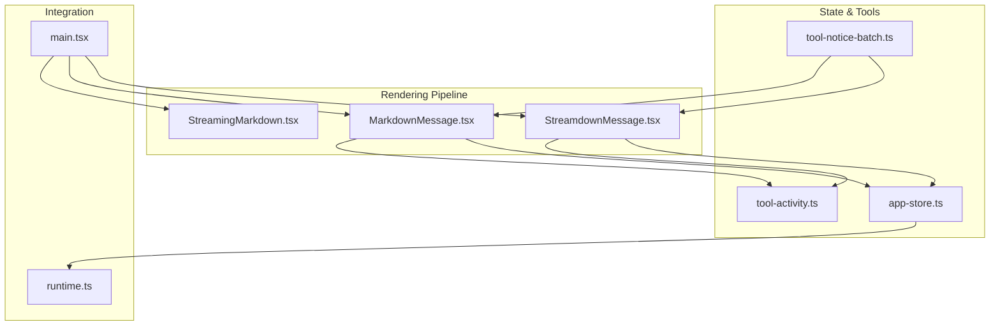
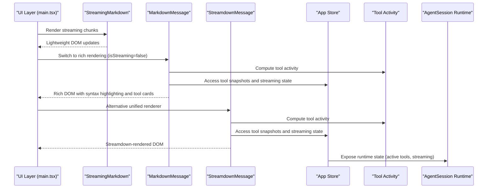
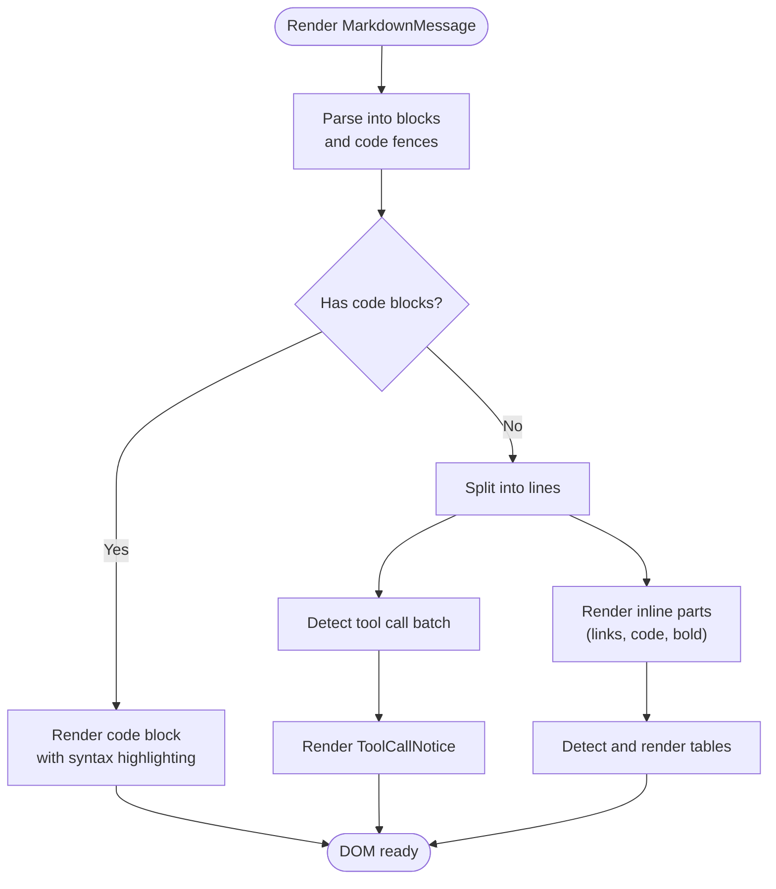
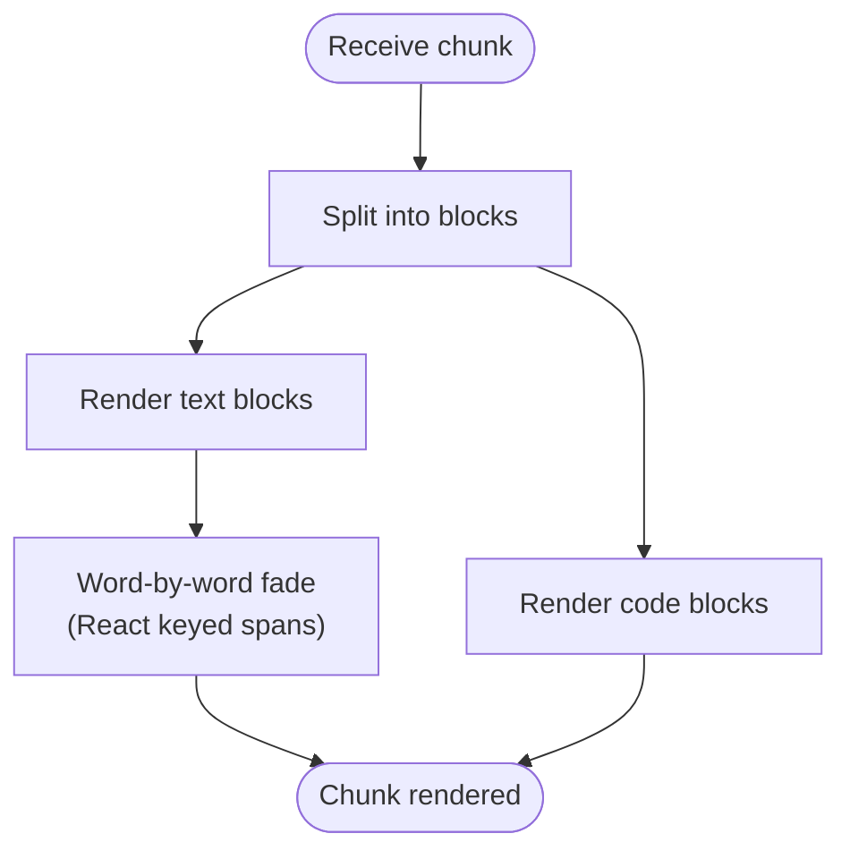
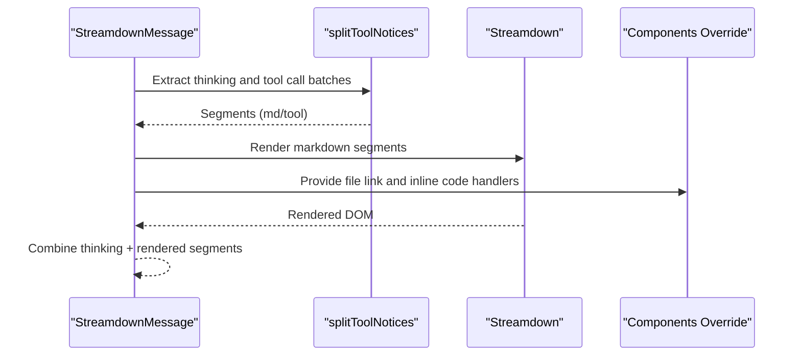
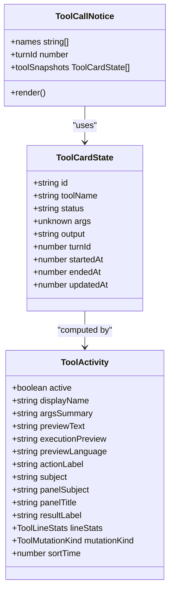
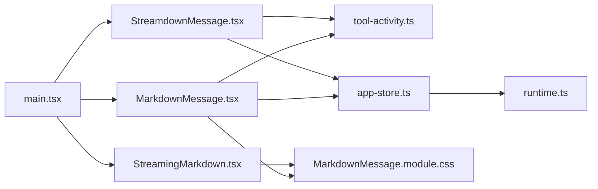

# Chat Interface

<cite>
**Referenced Files in This Document**
- [MarkdownMessage.tsx](file://src/client/src/components/markdown/MarkdownMessage.tsx)
- [StreamingMarkdown.tsx](file://src/client/src/components/markdown/StreamingMarkdown.tsx)
- [StreamdownMessage.tsx](file://src/client/src/components/markdown/StreamdownMessage.tsx)
- [tool-notice-batch.ts](file://src/client/src/components/markdown/tool-notice-batch.ts)
- [MarkdownMessage.module.css](file://src/client/src/components/markdown/MarkdownMessage.module.css)
- [app-store.ts](file://src/client/src/state/app-store.ts)
- [tool-activity.ts](file://src/client/src/lib/tool-activity.ts)
- [constants.ts](file://src/client/src/constants.ts)
- [main.tsx](file://src/client/src/main.tsx)
- [runtime.ts](file://src/server/runtime.ts)
</cite>

## Table of Contents
1. [Introduction](#introduction)
2. [Project Structure](#project-structure)
3. [Core Components](#core-components)
4. [Architecture Overview](#architecture-overview)
5. [Detailed Component Analysis](#detailed-component-analysis)
6. [Dependency Analysis](#dependency-analysis)
7. [Performance Considerations](#performance-considerations)
8. [Troubleshooting Guide](#troubleshooting-guide)
9. [Conclusion](#conclusion)

## Introduction
This document explains the AI chat interface implementation with a focus on Markdown rendering, streaming response handling, and tool execution visualization. It covers:
- The MarkdownMessage component's parsing logic, syntax highlighting, and interactive elements
- The lightweight StreamingMarkdown component for real-time response display during streaming
- Tool call notices for AI tool execution tracking integrated with the AgentSession runtime
- Configuration options for markdown rendering, performance optimizations for large responses, and troubleshooting common rendering issues

## Project Structure
The chat rendering pipeline consists of three primary components:
- MarkdownMessage: Full-featured renderer with syntax highlighting, tool cards, and animations
- StreamingMarkdown: Lightweight renderer optimized for streaming chunks
- StreamdownMessage: Unified renderer using Streamdown for markdown and Shiki for syntax highlighting

These components integrate with the AgentSession runtime via the application store and tool activity utilities.

**Diagram sources**
- [StreamingMarkdown.tsx:1-210](file://src/client/src/components/markdown/StreamingMarkdown.tsx#L1-L210)
- [MarkdownMessage.tsx:1-1137](file://src/client/src/components/markdown/MarkdownMessage.tsx#L1-L1137)
- [StreamdownMessage.tsx:1-154](file://src/client/src/components/markdown/StreamdownMessage.tsx#L1-L154)
- [tool-notice-batch.ts:1-35](file://src/client/src/components/markdown/tool-notice-batch.ts#L1-L35)
- [app-store.ts:1-253](file://src/client/src/state/app-store.ts#L1-L253)
- [tool-activity.ts:1-442](file://src/client/src/lib/tool-activity.ts#L1-L442)
- [main.tsx:1786-1806](file://src/client/src/main.tsx#L1786-L1806)
- [runtime.ts:24-62](file://src/server/runtime.ts#L24-L62)

**Section sources**
- [StreamingMarkdown.tsx:1-210](file://src/client/src/components/markdown/StreamingMarkdown.tsx#L1-L210)
- [MarkdownMessage.tsx:1-1137](file://src/client/src/components/markdown/MarkdownMessage.tsx#L1-L1137)
- [StreamdownMessage.tsx:1-154](file://src/client/src/components/markdown/StreamdownMessage.tsx#L1-L154)
- [tool-notice-batch.ts:1-35](file://src/client/src/components/markdown/tool-notice-batch.ts#L1-L35)
- [app-store.ts:1-253](file://src/client/src/state/app-store.ts#L1-L253)
- [tool-activity.ts:1-442](file://src/client/src/lib/tool-activity.ts#L1-L442)
- [main.tsx:1786-1806](file://src/client/src/main.tsx#L1786-L1806)
- [runtime.ts:24-62](file://src/server/runtime.ts#L24-L62)

## Core Components
- MarkdownMessage: Parses Markdown into blocks, renders code with syntax highlighting, supports inline links and file opening, and displays tool call notices and live tool execution cards.
- StreamingMarkdown: Renders streaming chunks efficiently with word-by-word fade animations and minimal re-rendering.
- StreamdownMessage: Uses Streamdown for markdown rendering and Shiki for syntax highlighting, with app-specific extensions for thinking traces and tool notices.

Key integration points:
- Tool call detection via tool-notice-batch
- Tool activity computation via tool-activity utilities
- Store-managed tool snapshots and streaming state
- AgentSession runtime state exposed to the UI

**Section sources**
- [MarkdownMessage.tsx:42-69](file://src/client/src/components/markdown/MarkdownMessage.tsx#L42-L69)
- [StreamingMarkdown.tsx:24-50](file://src/client/src/components/markdown/StreamingMarkdown.tsx#L24-L50)
- [StreamdownMessage.tsx:18-24](file://src/client/src/components/markdown/StreamdownMessage.tsx#L18-L24)
- [tool-notice-batch.ts:1-35](file://src/client/src/components/markdown/tool-notice-batch.ts#L1-L35)
- [tool-activity.ts:59-82](file://src/client/src/lib/tool-activity.ts#L59-L82)
- [app-store.ts:186-252](file://src/client/src/state/app-store.ts#L186-L252)
- [runtime.ts:36-54](file://src/server/runtime.ts#L36-L54)

## Architecture Overview
The chat interface switches between lightweight streaming rendering and rich rendering based on streaming state. Tool execution is tracked via the store and visualized through tool call notices and live tool cards.

**Diagram sources**
- [main.tsx:1786-1806](file://src/client/src/main.tsx#L1786-L1806)
- [StreamingMarkdown.tsx:195-210](file://src/client/src/components/markdown/StreamingMarkdown.tsx#L195-L210)
- [MarkdownMessage.tsx:276-325](file://src/client/src/components/markdown/MarkdownMessage.tsx#L276-L325)
- [StreamdownMessage.tsx:120-151](file://src/client/src/components/markdown/StreamdownMessage.tsx#L120-L151)
- [tool-activity.ts:59-82](file://src/client/src/lib/tool-activity.ts#L59-L82)
- [app-store.ts:186-252](file://src/client/src/state/app-store.ts#L186-L252)
- [runtime.ts:36-54](file://src/server/runtime.ts#L36-L54)

## Detailed Component Analysis

### MarkdownMessage: Parsing, Syntax Highlighting, and Interactive Elements
- Parses Markdown into blocks and code fences, then renders paragraphs, lists, headings, and tables.
- Highlights code with language-aware rules and supports line numbers for read-like tools.
- Provides interactive elements:
  - Copy-to-clipboard for code blocks
  - Clickable file paths and inline code that opens files in-editor
  - Tool call notices and live tool execution cards
- Handles thinking traces and inline markdown tokens (links, code, bold).

Syntax highlighting and language inference:
- Uses language-specific rules for comments, strings, keywords, numbers, tags, attributes, and functions.
- Infers language from explicit fence info, content heuristics, or defaults to TypeScript.

Tool call notices:
- Detects batches of tool calls using tool-notice-batch and renders ToolCallNotice.
- Integrates with live tool state from the store and history snapshots.

**Diagram sources**
- [MarkdownMessage.tsx:75-87](file://src/client/src/components/markdown/MarkdownMessage.tsx#L75-L87)
- [MarkdownMessage.tsx:212-265](file://src/client/src/components/markdown/MarkdownMessage.tsx#L212-L265)
- [MarkdownMessage.tsx:1101-1121](file://src/client/src/components/markdown/MarkdownMessage.tsx#L1101-L1121)
- [tool-notice-batch.ts:13-34](file://src/client/src/components/markdown/tool-notice-batch.ts#L13-L34)

**Section sources**
- [MarkdownMessage.tsx:75-1137](file://src/client/src/components/markdown/MarkdownMessage.tsx#L75-L1137)
- [MarkdownMessage.module.css:1-664](file://src/client/src/components/markdown/MarkdownMessage.module.css#L1-L664)
- [tool-notice-batch.ts:1-35](file://src/client/src/components/markdown/tool-notice-batch.ts#L1-L35)

### StreamingMarkdown: Lightweight Streaming Renderer
- Optimized for streaming: parses blocks, escapes HTML, and renders inline markdown with word-by-word fade animations.
- Uses memoized paragraph rendering so only the growing paragraph re-renders per frame.
- Supports code blocks, headings, lists, and tables with minimal overhead.

**Diagram sources**
- [StreamingMarkdown.tsx:26-50](file://src/client/src/components/markdown/StreamingMarkdown.tsx#L26-L50)
- [StreamingMarkdown.tsx:142-168](file://src/client/src/components/markdown/StreamingMarkdown.tsx#L142-L168)
- [StreamingMarkdown.tsx:182-193](file://src/client/src/components/markdown/StreamingMarkdown.tsx#L182-L193)

**Section sources**
- [StreamingMarkdown.tsx:1-210](file://src/client/src/components/markdown/StreamingMarkdown.tsx#L1-L210)

### StreamdownMessage: Unified Renderer with Streamdown and Shiki
- Uses Streamdown for markdown rendering and Shiki for syntax highlighting.
- Extracts thinking traces and tool call batches from the text and renders them separately.
- Overrides components to support clickable file links and inline code that opens files in-editor.
- Configurable theme pairing and animation settings for streaming.

**Diagram sources**
- [StreamdownMessage.tsx:61-83](file://src/client/src/components/markdown/StreamdownMessage.tsx#L61-L83)
- [StreamdownMessage.tsx:120-151](file://src/client/src/components/markdown/StreamdownMessage.tsx#L120-L151)
- [StreamdownMessage.tsx:102-118](file://src/client/src/components/markdown/StreamdownMessage.tsx#L102-L118)

**Section sources**
- [StreamdownMessage.tsx:1-154](file://src/client/src/components/markdown/StreamdownMessage.tsx#L1-L154)

### Tool Execution Visualization and AgentSession Integration
- Tool call notices aggregate live and historical tool executions from the store.
- ToolRunDetails renders previews, line stats, and execution status using tool-activity utilities.
- The AgentSession runtime exposes active tools and streaming state to the UI.

**Diagram sources**
- [app-store.ts:10-23](file://src/client/src/state/app-store.ts#L10-L23)
- [tool-activity.ts:14-29](file://src/client/src/lib/tool-activity.ts#L14-L29)
- [MarkdownMessage.tsx:276-325](file://src/client/src/components/markdown/MarkdownMessage.tsx#L276-L325)

**Section sources**
- [MarkdownMessage.tsx:276-527](file://src/client/src/components/markdown/MarkdownMessage.tsx#L276-L527)
- [tool-activity.ts:59-82](file://src/client/src/lib/tool-activity.ts#L59-L82)
- [app-store.ts:186-252](file://src/client/src/state/app-store.ts#L186-L252)
- [runtime.ts:36-54](file://src/server/runtime.ts#L36-L54)

## Dependency Analysis
- MarkdownMessage depends on:
  - tool-activity utilities for tool metadata and previews
  - app-store for tool snapshots and streaming state
  - CSS module for styling and animations
- StreamingMarkdown depends on:
  - CSS module for styling
- StreamdownMessage depends on:
  - Streamdown and Shiki for markdown and syntax highlighting
  - tool-activity utilities and app-store for tool notices
- main.tsx orchestrates switching between streaming and rich rendering based on streaming state.

**Diagram sources**
- [MarkdownMessage.tsx:1-22](file://src/client/src/components/markdown/MarkdownMessage.tsx#L1-L22)
- [StreamingMarkdown.tsx:1-2](file://src/client/src/components/markdown/StreamingMarkdown.tsx#L1-L2)
- [StreamdownMessage.tsx:1-7](file://src/client/src/components/markdown/StreamdownMessage.tsx#L1-L7)
- [tool-activity.ts:1-2](file://src/client/src/lib/tool-activity.ts#L1-L2)
- [app-store.ts:1-48](file://src/client/src/state/app-store.ts#L1-L48)
- [main.tsx:1786-1806](file://src/client/src/main.tsx#L1786-L1806)
- [runtime.ts:24-34](file://src/server/runtime.ts#L24-L34)

**Section sources**
- [MarkdownMessage.tsx:1-22](file://src/client/src/components/markdown/MarkdownMessage.tsx#L1-L22)
- [StreamingMarkdown.tsx:1-2](file://src/client/src/components/markdown/StreamingMarkdown.tsx#L1-L2)
- [StreamdownMessage.tsx:1-7](file://src/client/src/components/markdown/StreamdownMessage.tsx#L1-L7)
- [tool-activity.ts:1-2](file://src/client/src/lib/tool-activity.ts#L1-L2)
- [app-store.ts:1-48](file://src/client/src/state/app-store.ts#L1-L48)
- [main.tsx:1786-1806](file://src/client/src/main.tsx#L1786-L1806)
- [runtime.ts:24-34](file://src/server/runtime.ts#L24-L34)

## Performance Considerations
- StreamingMarkdown minimizes re-rendering by memoizing paragraphs and using word-by-word keyed spans for animations.
- MarkdownMessage limits live tool rendering with NOTICE_LIVE_TOOL_LIMIT and caches computed tool activity and previews.
- Tool output is compacted to prevent memory pressure with MAX_TOOL_OUTPUT_CHARS and TOOL_OUTPUT_HEAD_CHARS.
- Constants define streaming behavior thresholds and scanning limits (TOOL_SCAN_TEXT_LIMIT).

Recommendations:
- Prefer StreamdownMessage for large documents requiring syntax highlighting to leverage optimized rendering.
- Keep tool snapshots scoped to the current turn to reduce rendering overhead.
- Use line numbers selectively for read-like tools to balance readability and performance.

**Section sources**
- [StreamingMarkdown.tsx:1-22](file://src/client/src/components/markdown/StreamingMarkdown.tsx#L1-L22)
- [MarkdownMessage.tsx:23-40](file://src/client/src/components/markdown/MarkdownMessage.tsx#L23-L40)
- [MarkdownMessage.tsx:473-485](file://src/client/src/components/markdown/MarkdownMessage.tsx#L473-L485)
- [app-store.ts:60-66](file://src/client/src/state/app-store.ts#L60-L66)
- [constants.ts:25-32](file://src/client/src/constants.ts#L25-L32)

## Troubleshooting Guide
Common rendering issues and resolutions:
- Tool call notices not appearing:
  - Verify tool-notice-batch detects `[tool call: name]` markers and that toolSnapshots contain matching tool names.
  - Ensure the store has active tools for live tracking.
- Syntax highlighting incorrect:
  - Confirm language inference logic matches the code fence or content heuristics.
  - For StreamdownMessage, check that the Shiki theme pair matches the current theme.
- Streaming jitter or lag:
  - Use StreamingMarkdown for streaming chunks and switch to MarkdownMessage after completion.
  - Reduce tool snapshots scope and avoid excessive live tool rendering.
- Large tool outputs causing performance problems:
  - Tool output is compacted automatically; verify MAX_TOOL_OUTPUT_CHARS and TOOL_OUTPUT_HEAD_CHARS limits.
- Clickable file links not working:
  - Ensure file paths match workspace patterns and onOpenFile handler is provided.

**Section sources**
- [tool-notice-batch.ts:1-35](file://src/client/src/components/markdown/tool-notice-batch.ts#L1-L35)
- [MarkdownMessage.tsx:195-210](file://src/client/src/components/markdown/MarkdownMessage.tsx#L195-L210)
- [StreamdownMessage.tsx:102-118](file://src/client/src/components/markdown/StreamdownMessage.tsx#L102-L118)
- [app-store.ts:172-184](file://src/client/src/state/app-store.ts#L172-L184)

## Conclusion
The chat interface combines efficient streaming rendering with rich post-stream rendering to deliver a responsive and visually appealing experience. Tool execution is tightly integrated with the UI through notices and live cards, backed by the AgentSession runtime and tool activity utilities. By leveraging the provided components and configuration options, developers can optimize performance and maintain a consistent user experience across various content types and tool interactions.
