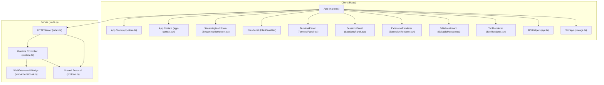
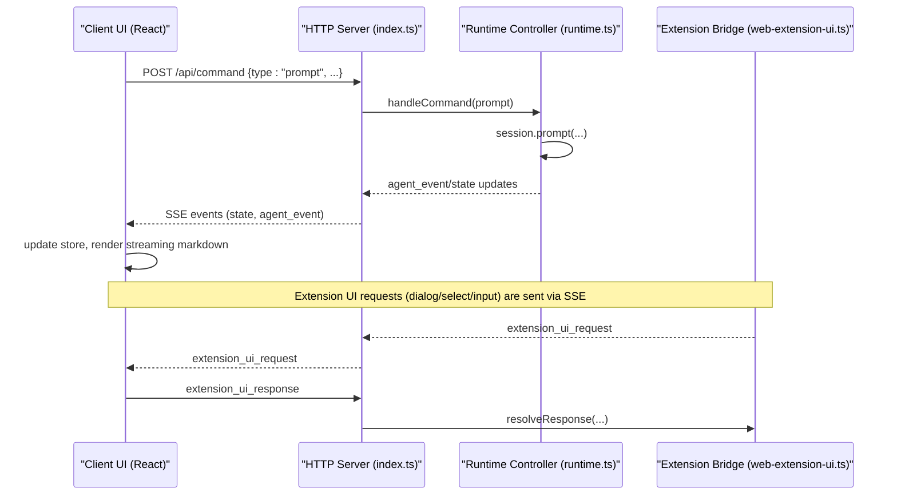
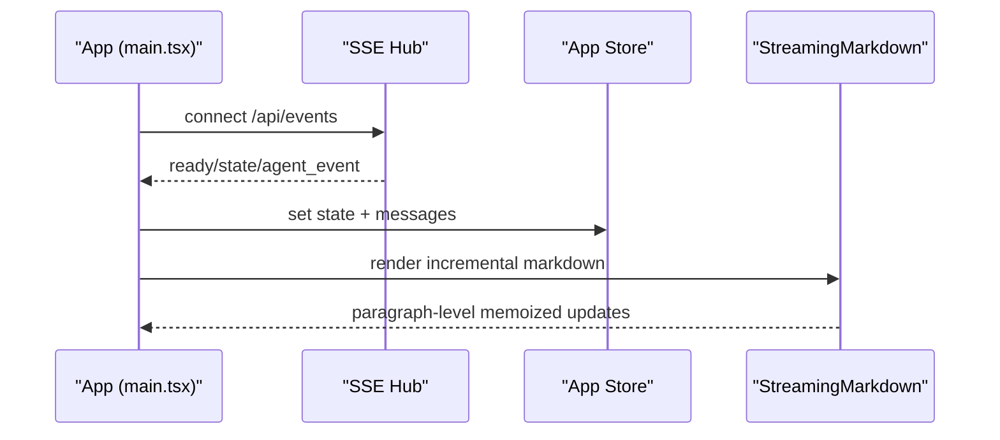
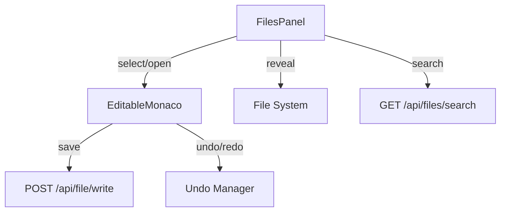
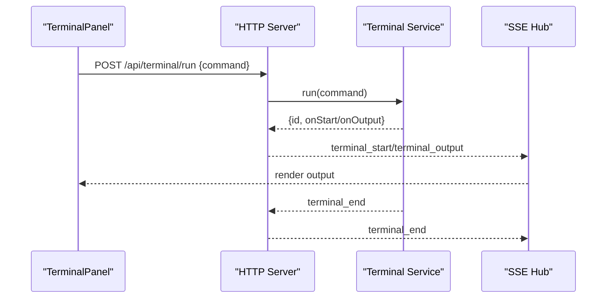
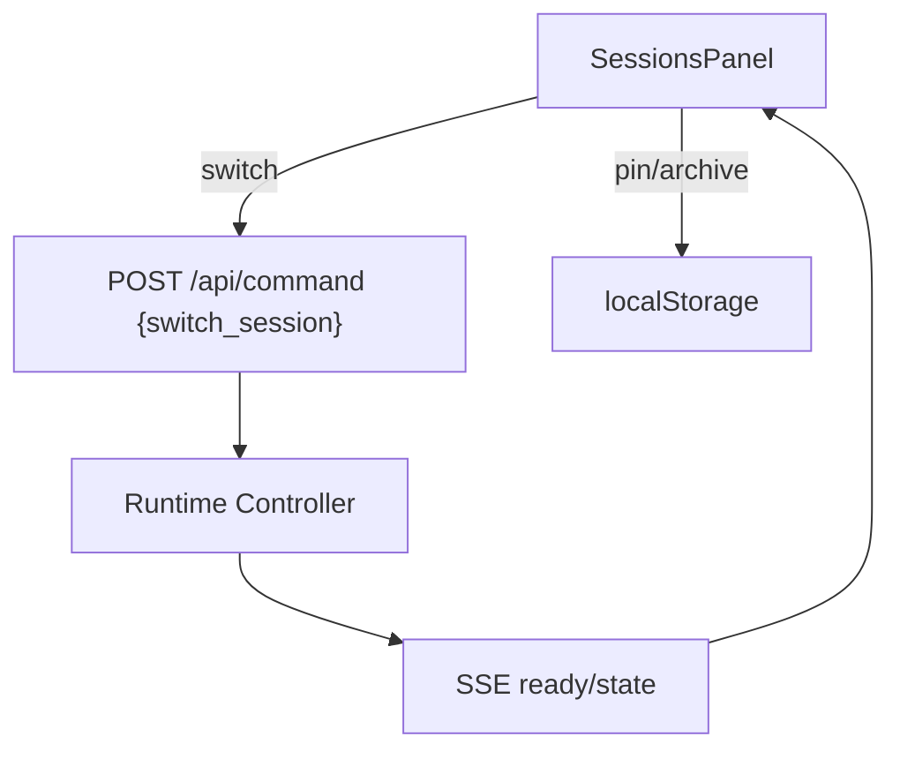
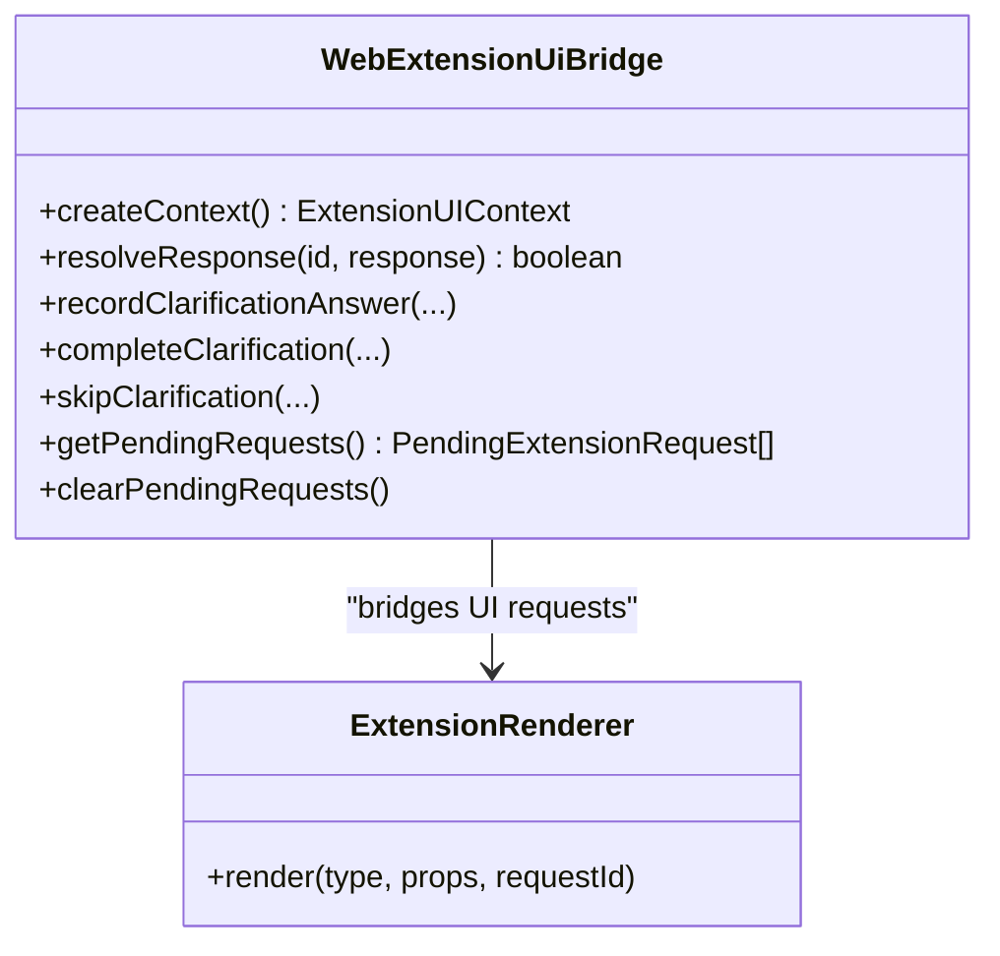
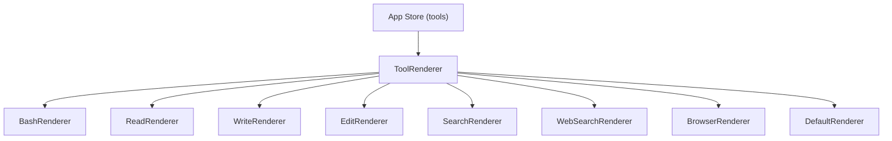
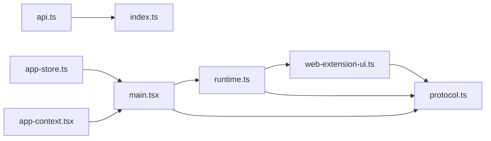

# Core Features

<cite>
**Referenced Files in This Document**
- [main.tsx](file://src/client/src/main.tsx)
- [app-store.ts](file://src/client/src/state/app-store.ts)
- [app-context.tsx](file://src/client/src/state/app-context.tsx)
- [runtime.ts](file://src/server/runtime.ts)
- [index.ts](file://src/server/index.ts)
- [protocol.ts](file://src/shared/protocol.ts)
- [StreamingMarkdown.tsx](file://src/client/src/components/markdown/StreamingMarkdown.tsx)
- [FilesPanel.tsx](file://src/client/src/components/files/FilesPanel.tsx)
- [TerminalPanel.tsx](file://src/client/src/components/terminal/TerminalPanel.tsx)
- [terminal-utils.ts](file://src/client/src/components/terminal/terminal-utils.ts)
- [SessionsPanel.tsx](file://src/client/src/components/sessions/SessionsPanel.tsx)
- [ExtensionRenderer.tsx](file://src/client/src/components/extensions/ExtensionRenderer.tsx)
- [web-extension-ui.ts](file://src/server/web-extension-ui.ts)
- [EditableMonaco.tsx](file://src/client/src/components/editor/EditableMonaco.tsx)
- [ToolRenderer.tsx](file://src/client/src/components/tools/ToolRenderer.tsx)
- [api.ts](file://src/client/src/lib/api.ts)
- [storage.ts](file://src/client/src/lib/storage.ts)
</cite>

## Table of Contents
1. [Introduction](#introduction)
2. [Project Structure](#project-structure)
3. [Core Components](#core-components)
4. [Architecture Overview](#architecture-overview)
5. [Detailed Component Analysis](#detailed-component-analysis)
6. [Dependency Analysis](#dependency-analysis)
7. [Performance Considerations](#performance-considerations)
8. [Troubleshooting Guide](#troubleshooting-guide)
9. [Conclusion](#conclusion)

## Introduction
This document explains the core features of Quake Code Web with a focus on:
- AI chat interface with streaming responses
- File explorer and editor integration
- Terminal panel functionality
- Session management system
- Extension framework bridging UI and AgentSession runtime

It covers component architecture, user interaction patterns, and the tool execution pipeline, along with configuration options, customization possibilities, and troubleshooting guidance.

## Project Structure
Quake Code Web is a React client served by a Node.js HTTP server. The client communicates with the server via REST and Server-Sent Events (SSE) to orchestrate the AgentSession runtime. The server exposes endpoints for chat, files, terminals, scheduling, and settings, and bridges extension UI requests to the runtime.

**Diagram sources**
- [main.tsx:145-588](file://src/client/src/main.tsx#L145-L588)
- [app-store.ts:186-252](file://src/client/src/state/app-store.ts#L186-L252)
- [app-context.tsx:33-57](file://src/client/src/state/app-context.tsx#L33-L57)
- [StreamingMarkdown.tsx:195-211](file://src/client/src/components/markdown/StreamingMarkdown.tsx#L195-L211)
- [FilesPanel.tsx:10-195](file://src/client/src/components/files/FilesPanel.tsx#L10-L195)
- [TerminalPanel.tsx:9-79](file://src/client/src/components/terminal/TerminalPanel.tsx#L9-L79)
- [SessionsPanel.tsx:10-47](file://src/client/src/components/sessions/SessionsPanel.tsx#L10-L47)
- [ExtensionRenderer.tsx:12-16](file://src/client/src/components/extensions/ExtensionRenderer.tsx#L12-L16)
- [EditableMonaco.tsx:17-151](file://src/client/src/components/editor/EditableMonaco.tsx#L17-L151)
- [ToolRenderer.tsx:20-51](file://src/client/src/components/tools/ToolRenderer.tsx#L20-L51)
- [api.ts:9-59](file://src/client/src/lib/api.ts#L9-L59)
- [storage.ts:12-49](file://src/client/src/lib/storage.ts#L12-L49)
- [index.ts:401-662](file://src/server/index.ts#L401-L662)
- [runtime.ts:12-456](file://src/server/runtime.ts#L12-L456)
- [web-extension-ui.ts:27-244](file://src/server/web-extension-ui.ts#L27-L244)
- [protocol.ts:148-198](file://src/shared/protocol.ts#L148-L198)

**Section sources**
- [main.tsx:145-588](file://src/client/src/main.tsx#L145-L588)
- [index.ts:401-662](file://src/server/index.ts#L401-L662)

## Core Components
- App orchestrator and state: central React component that initializes stores, subscribes to SSE, manages UI state, and routes commands to the runtime.
- App store: centralized Zustand store managing messages, tools, streaming message, toasts, and UI state.
- App context: provides configuration, current workspace, streaming state, and a typed sendCommand function.
- Runtime controller: wraps AgentSession runtime, exposes state, handles commands, and bridges extension UI requests.
- WebExtensionUiBridge: translates extension UI requests into SSE events and resolves promises for dialogs and clarifications.
- StreamingMarkdown: lightweight streaming renderer optimized for real-time updates during AI responses.
- FilesPanel: file tree browser with search, visibility toggles, and actions.
- TerminalPanel: multi-tab terminal with ANSI rendering, history, and safety checks.
- SessionsPanel: session listing with pin/archive/compare and navigation.
- ExtensionRenderer: renders extension-provided UI components (dialogs, editors, pickers).
- EditableMonaco: Monaco editor integration with save, revert, undo/redo, and backup.
- ToolRenderer: specialized rendering for tool executions (read, write, edit, search, browser, command).

**Section sources**
- [main.tsx:145-588](file://src/client/src/main.tsx#L145-L588)
- [app-store.ts:186-252](file://src/client/src/state/app-store.ts#L186-L252)
- [app-context.tsx:33-57](file://src/client/src/state/app-context.tsx#L33-L57)
- [runtime.ts:12-456](file://src/server/runtime.ts#L12-L456)
- [web-extension-ui.ts:27-244](file://src/server/web-extension-ui.ts#L27-L244)
- [StreamingMarkdown.tsx:195-211](file://src/client/src/components/markdown/StreamingMarkdown.tsx#L195-L211)
- [FilesPanel.tsx:10-195](file://src/client/src/components/files/FilesPanel.tsx#L10-L195)
- [TerminalPanel.tsx:9-79](file://src/client/src/components/terminal/TerminalPanel.tsx#L9-L79)
- [SessionsPanel.tsx:10-47](file://src/client/src/components/sessions/SessionsPanel.tsx#L10-L47)
- [ExtensionRenderer.tsx:12-16](file://src/client/src/components/extensions/ExtensionRenderer.tsx#L12-L16)
- [EditableMonaco.tsx:17-151](file://src/client/src/components/editor/EditableMonaco.tsx#L17-L151)
- [ToolRenderer.tsx:20-51](file://src/client/src/components/tools/ToolRenderer.tsx#L20-L51)

## Architecture Overview
The client-server architecture uses SSE for live updates and REST for commands and data retrieval. The runtime controller mediates between UI and AgentSession, while the extension bridge handles interactive UI requests from extensions.

**Diagram sources**
- [index.ts:255-374](file://src/server/index.ts#L255-L374)
- [runtime.ts:452-456](file://src/server/runtime.ts#L452-L456)
- [web-extension-ui.ts:204-243](file://src/server/web-extension-ui.ts#L204-L243)
- [protocol.ts:161-169](file://src/shared/protocol.ts#L161-L169)

## Detailed Component Analysis

### AI Chat Interface with Streaming Responses
- SSE subscription: The App component opens an SSE connection to receive state and agent events, refreshing UI and reconciling dangling UI state.
- Streaming renderer: StreamingMarkdown parses and renders markdown blocks incrementally, optimizing for smooth streaming without heavy re-renders.
- Store integration: Messages and streaming message are managed in the app store; deduplication and normalization keep memory bounded.

**Diagram sources**
- [main.tsx:573-588](file://src/client/src/main.tsx#L573-L588)
- [StreamingMarkdown.tsx:142-180](file://src/client/src/components/markdown/StreamingMarkdown.tsx#L142-L180)
- [app-store.ts:102-127](file://src/client/src/state/app-store.ts#L102-L127)

**Section sources**
- [main.tsx:573-588](file://src/client/src/main.tsx#L573-L588)
- [StreamingMarkdown.tsx:195-211](file://src/client/src/components/markdown/StreamingMarkdown.tsx#L195-L211)
- [app-store.ts:102-127](file://src/client/src/state/app-store.ts#L102-L127)

### File Explorer and Editor Integration
- FilesPanel: Lists workspace files with search, visibility toggles, breadcrumb navigation, and actions (open, reveal, summarize, copy path).
- EditableMonaco: Integrates Monaco editor with language detection, save/revert, undo/redo, and backup creation via API.
- Undo stack: Per-file undo manager tracks edits and persists state in local storage.

**Diagram sources**
- [FilesPanel.tsx:10-195](file://src/client/src/components/files/FilesPanel.tsx#L10-L195)
- [EditableMonaco.tsx:17-151](file://src/client/src/components/editor/EditableMonaco.tsx#L17-L151)
- [api.ts:68-68](file://src/client/src/lib/api.ts#L68-L68)

**Section sources**
- [FilesPanel.tsx:10-195](file://src/client/src/components/files/FilesPanel.tsx#L10-L195)
- [EditableMonaco.tsx:17-151](file://src/client/src/components/editor/EditableMonaco.tsx#L17-L151)
- [storage.ts:12-49](file://src/client/src/lib/storage.ts#L12-L49)

### Terminal Panel Functionality
- Multi-tab support: TerminalPanel maintains tabs with status, output, and scroll lock.
- ANSI rendering: Parses and renders ANSI escape sequences for colored output.
- Safety checks: Warns on potentially dangerous commands; integrates with terminal policy.
- Real-time updates: SSE events carry terminal_start, terminal_output, terminal_end.

**Diagram sources**
- [TerminalPanel.tsx:9-79](file://src/client/src/components/terminal/TerminalPanel.tsx#L9-L79)
- [terminal-utils.ts:1-6](file://src/client/src/components/terminal/terminal-utils.ts#L1-L6)
- [index.ts:631-644](file://src/server/index.ts#L631-L644)

**Section sources**
- [TerminalPanel.tsx:9-79](file://src/client/src/components/terminal/TerminalPanel.tsx#L9-L79)
- [terminal-utils.ts:1-6](file://src/client/src/components/terminal/terminal-utils.ts#L1-L6)
- [index.ts:631-644](file://src/server/index.ts#L631-L644)

### Session Management System
- SessionsPanel: Lists sessions with pin/archive/compare, grouped by date, searchable, and navigable.
- Switch/fork/new: Commands routed to runtime controller; SSE emits ready/state after changes.
- Persistence: Local storage keys for pinned/archived sessions and aliases.

**Diagram sources**
- [SessionsPanel.tsx:10-47](file://src/client/src/components/sessions/SessionsPanel.tsx#L10-L47)
- [index.ts:297-331](file://src/server/index.ts#L297-L331)
- [runtime.ts:145-154](file://src/server/runtime.ts#L145-L154)

**Section sources**
- [SessionsPanel.tsx:10-47](file://src/client/src/components/sessions/SessionsPanel.tsx#L10-L47)
- [index.ts:297-331](file://src/server/index.ts#L297-L331)
- [runtime.ts:145-154](file://src/server/runtime.ts#L145-L154)

### Extension Framework and UI Bridging
- ExtensionRenderer: Renders extension-provided components (filepicker, codeeditor, formbuilder, select, confirm, input, notify).
- WebExtensionUiBridge: Exposes UI context to extensions (select, confirm, input, notify, setStatus, setWidget, setSidebar, setTitle, editor, pasteToEditor, setEditorText/getEditorText).
- Plan clarifications: Supports pending requests, recording answers, completing clarifications, and skipping.
- SSE bridge: Converts extension UI requests into SSE events and resolves promises.

**Diagram sources**
- [web-extension-ui.ts:27-244](file://src/server/web-extension-ui.ts#L27-L244)
- [ExtensionRenderer.tsx:12-16](file://src/client/src/components/extensions/ExtensionRenderer.tsx#L12-L16)

**Section sources**
- [ExtensionRenderer.tsx:12-16](file://src/client/src/components/extensions/ExtensionRenderer.tsx#L12-L16)
- [web-extension-ui.ts:27-244](file://src/server/web-extension-ui.ts#L27-L244)

### Tool Execution Pipeline
- ToolRenderer: Specialized rendering per tool category (command/bash, read, write/edit, search, web/browser).
- Tool state: Managed in the app store with status, timing, and output limits; pruning keeps memory bounded.
- Images and diffs: Browser and edit tools can surface screenshots and diff previews.

**Diagram sources**
- [ToolRenderer.tsx:20-51](file://src/client/src/components/tools/ToolRenderer.tsx#L20-L51)
- [app-store.ts:10-23](file://src/client/src/state/app-store.ts#L10-L23)

**Section sources**
- [ToolRenderer.tsx:20-51](file://src/client/src/components/tools/ToolRenderer.tsx#L20-L51)
- [app-store.ts:10-23](file://src/client/src/state/app-store.ts#L10-L23)

## Dependency Analysis
- Client depends on:
  - App store for state and UI primitives
  - API helpers for HTTP communication
  - Storage for preferences and persistence
  - Components for rendering and interaction
- Server depends on:
  - Runtime controller for AgentSession orchestration
  - Extension bridge for UI requests
  - Shared protocol for types and SSE payloads

**Diagram sources**
- [api.ts:9-59](file://src/client/src/lib/api.ts#L9-L59)
- [index.ts:401-662](file://src/server/index.ts#L401-L662)
- [runtime.ts:12-456](file://src/server/runtime.ts#L12-L456)
- [web-extension-ui.ts:27-244](file://src/server/web-extension-ui.ts#L27-L244)
- [protocol.ts:148-198](file://src/shared/protocol.ts#L148-L198)

**Section sources**
- [api.ts:9-59](file://src/client/src/lib/api.ts#L9-L59)
- [index.ts:401-662](file://src/server/index.ts#L401-L662)
- [runtime.ts:12-456](file://src/server/runtime.ts#L12-L456)
- [web-extension-ui.ts:27-244](file://src/server/web-extension-ui.ts#L27-L244)
- [protocol.ts:148-198](file://src/shared/protocol.ts#L148-L198)

## Performance Considerations
- StreamingMarkdown avoids heavy re-renders by memoizing paragraphs and rendering words with stable keys.
- App store normalizes messages and prunes tools to bounded sizes, reducing memory pressure.
- Terminal output parsing uses a single pass with minimal allocations; ANSI segments are computed once per update.
- FilesPanel virtualizes tree rendering with windowed selection and lazy loading of directory entries.

[No sources needed since this section provides general guidance]

## Troubleshooting Guide
Common issues and remedies:
- SSE connection drops or stale state:
  - The App component periodically refreshes state and settles active tools if idle. Reconnects trigger a refresh.
- Terminal command fails or unsafe:
  - TerminalPanel warns on risky patterns; check terminal policy mode and timeouts.
- File save failures:
  - EditableMonaco reports errors via toasts; verify permissions and workspace allowlist.
- Extension UI not responding:
  - Ensure extension_ui_request is received and extension_ui_response is posted; bridge resolves pending requests on completion.
- Session switching errors:
  - Runtime cancels pending interactions before switching; retry after abort completes.

**Section sources**
- [main.tsx:573-588](file://src/client/src/main.tsx#L573-L588)
- [TerminalPanel.tsx:184-190](file://src/client/src/components/terminal/TerminalPanel.tsx#L184-L190)
- [EditableMonaco.tsx:64-85](file://src/client/src/components/editor/EditableMonaco.tsx#L64-L85)
- [index.ts:274-276](file://src/server/index.ts#L274-L276)
- [runtime.ts:145-154](file://src/server/runtime.ts#L145-L154)

## Conclusion
Quake Code Web integrates a reactive UI with a robust runtime and extension framework. SSE ensures responsive updates, while specialized components optimize for streaming chat, file operations, terminal execution, and session management. The extension bridge enables dynamic UI interactions, and the protocol defines a clear contract for client-server communication.
