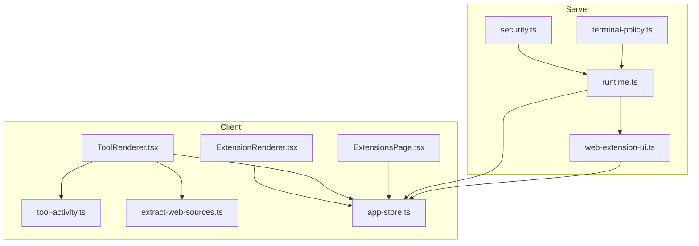
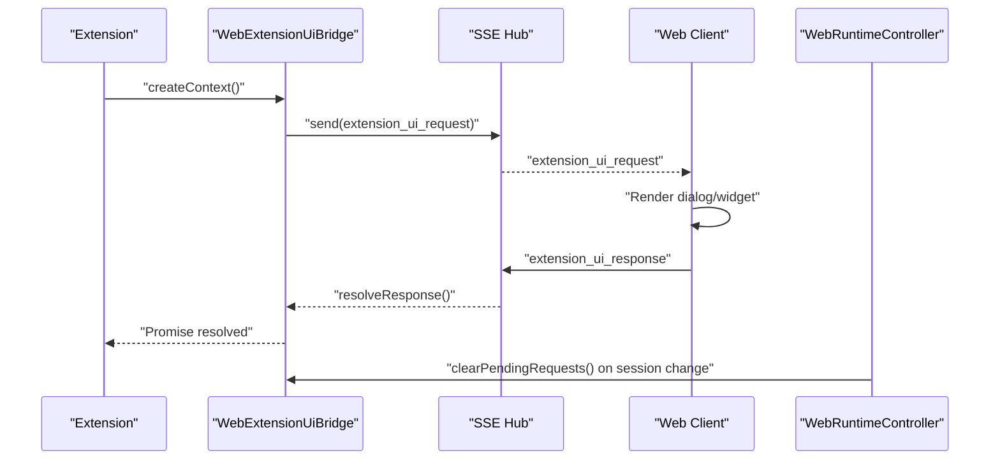
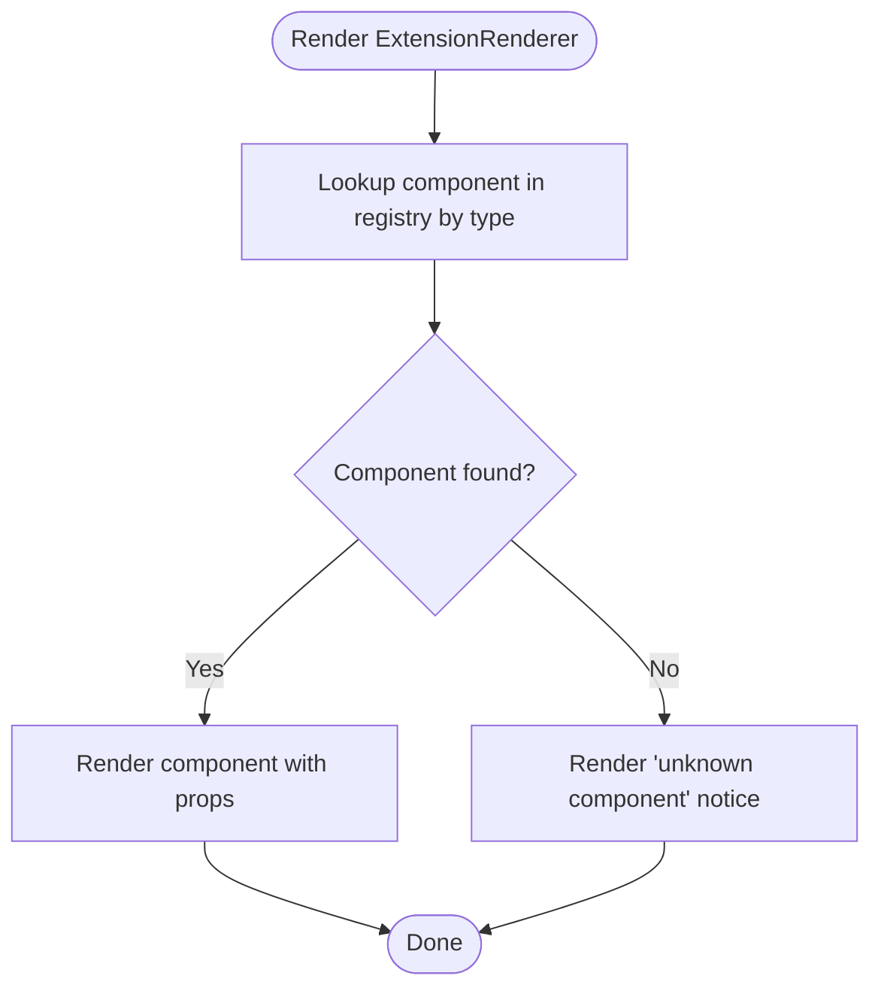
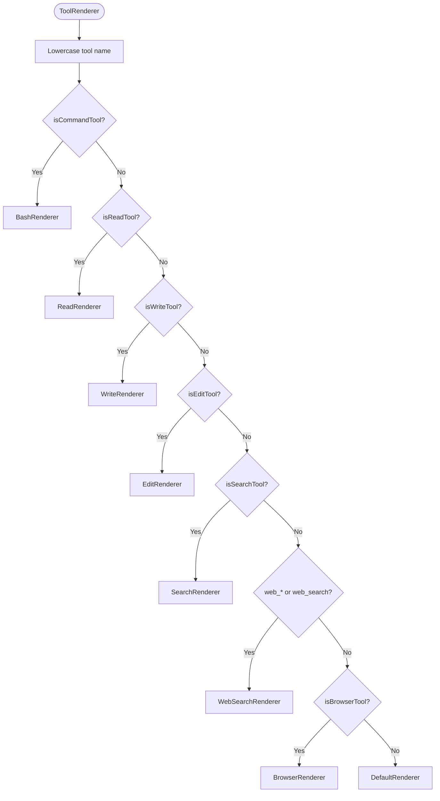
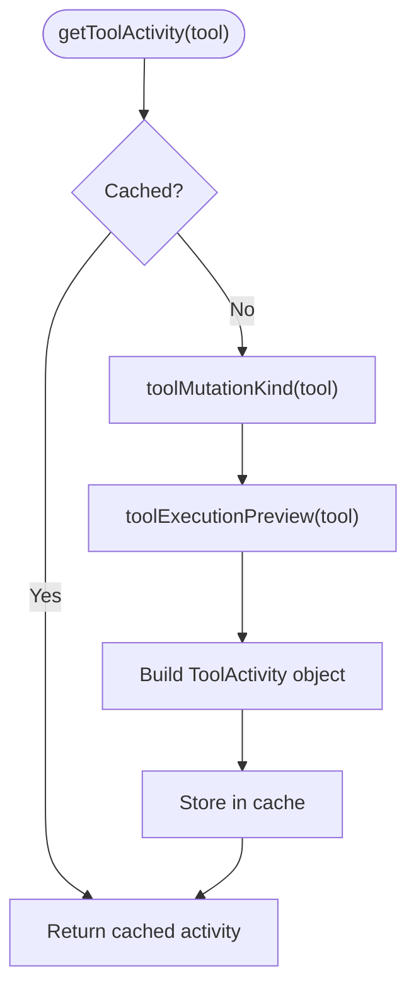
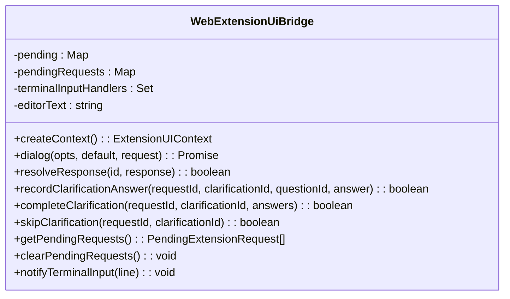
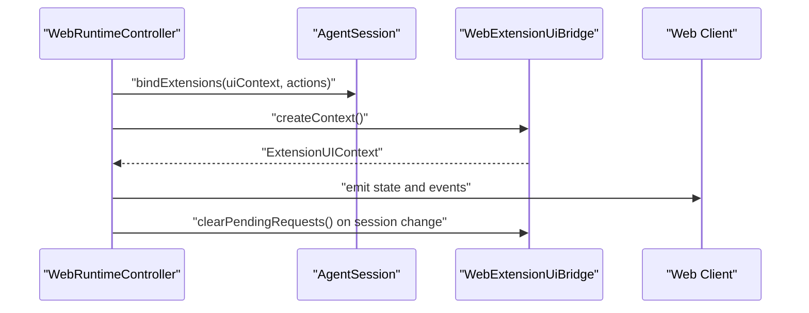
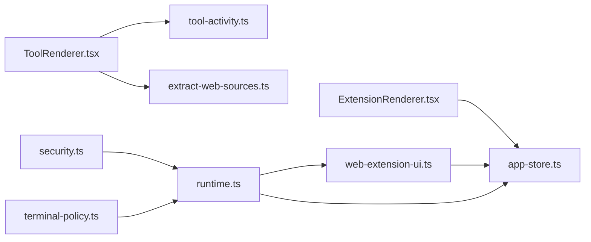

# Extension System

<cite>
**Referenced Files in This Document**
- [ExtensionRenderer.tsx](file://src/client/src/components/extensions/ExtensionRenderer.tsx)
- [ExtensionRenderer.module.css](file://src/client/src/components/extensions/ExtensionRenderer.module.css)
- [ToolRenderer.tsx](file://src/client/src/components/tools/ToolRenderer.tsx)
- [ToolRenderer.module.css](file://src/client/src/components/tools/ToolRenderer.module.css)
- [web-extension-ui.ts](file://src/server/web-extension-ui.ts)
- [runtime.ts](file://src/server/runtime.ts)
- [tool-activity.ts](file://src/client/src/lib/tool-activity.ts)
- [extract-web-sources.ts](file://src/client/src/lib/extract-web-sources.ts)
- [app-store.ts](file://src/client/src/state/app-store.ts)
- [ExtensionsPage.tsx](file://src/client/src/components/pages/ExtensionsPage.tsx)
- [security.ts](file://src/server/security.ts)
- [terminal-policy.ts](file://src/server/terminal-policy.ts)
- [security.md](file://docs/security.md)
</cite>

## Table of Contents
1. [Introduction](#introduction)
2. [Project Structure](#project-structure)
3. [Core Components](#core-components)
4. [Architecture Overview](#architecture-overview)
5. [Detailed Component Analysis](#detailed-component-analysis)
6. [Dependency Analysis](#dependency-analysis)
7. [Performance Considerations](#performance-considerations)
8. [Troubleshooting Guide](#troubleshooting-guide)
9. [Conclusion](#conclusion)
10. [Appendices](#appendices)

## Introduction
This document explains the extension and tool system powering the web client. It covers how custom extension components are rendered, how tools are presented and interpreted, and how the WebExtension UI bridge connects the AgentSession runtime to the browser. It also documents the tool discovery and categorization mechanisms, extension security policies, and practical guidance for extension authors building robust integrations.

## Project Structure
The extension and tool system spans client-side rendering, server-side runtime orchestration, and shared utilities for tool interpretation and web source extraction.

**Diagram sources**
- [ExtensionRenderer.tsx:1-138](file://src/client/src/components/extensions/ExtensionRenderer.tsx#L1-L138)
- [ToolRenderer.tsx:1-286](file://src/client/src/components/tools/ToolRenderer.tsx#L1-L286)
- [tool-activity.ts:1-973](file://src/client/src/lib/tool-activity.ts#L1-L973)
- [extract-web-sources.ts:1-131](file://src/client/src/lib/extract-web-sources.ts#L1-L131)
- [app-store.ts:1-253](file://src/client/src/state/app-store.ts#L1-L253)
- [ExtensionsPage.tsx:1-432](file://src/client/src/components/pages/ExtensionsPage.tsx#L1-L432)
- [runtime.ts:1-499](file://src/server/runtime.ts#L1-L499)
- [web-extension-ui.ts:1-309](file://src/server/web-extension-ui.ts#L1-L309)
- [security.ts:1-47](file://src/server/security.ts#L1-L47)
- [terminal-policy.ts:1-38](file://src/server/terminal-policy.ts#L1-L38)

**Section sources**
- [ExtensionRenderer.tsx:1-138](file://src/client/src/components/extensions/ExtensionRenderer.tsx#L1-L138)
- [ToolRenderer.tsx:1-286](file://src/client/src/components/tools/ToolRenderer.tsx#L1-L286)
- [runtime.ts:1-499](file://src/server/runtime.ts#L1-L499)
- [web-extension-ui.ts:1-309](file://src/server/web-extension-ui.ts#L1-L309)

## Core Components
- ExtensionRenderer: Renders rich extension UI components (file picker, code editor, forms, dialogs, notifications) based on a type registry.
- ToolRenderer: Renders tool execution cards with contextual previews, diffs, and metadata, driven by tool classification logic.
- WebExtension UI Bridge: Bridges extension UI requests to the web client via SSE, managing dialogs, plan clarification, and status updates.
- AgentSession Runtime: Integrates with the AgentSession runtime, binding extension UI contexts and forwarding events to the client.
- Tool Activity Utilities: Detect tool categories, compute line statistics, and produce human-friendly summaries and previews.
- Web Source Extraction: Extracts and normalizes web sources from tool arguments, output, and structured results.
- App Store: Central state for tools, widgets, sidebars, and statuses, with tool upsert and pruning logic.
- Extensions Page: Lists installed extensions and skills, and toggles extension enablement.

**Section sources**
- [ExtensionRenderer.tsx:1-138](file://src/client/src/components/extensions/ExtensionRenderer.tsx#L1-L138)
- [ToolRenderer.tsx:1-286](file://src/client/src/components/tools/ToolRenderer.tsx#L1-L286)
- [web-extension-ui.ts:1-309](file://src/server/web-extension-ui.ts#L1-L309)
- [runtime.ts:1-499](file://src/server/runtime.ts#L1-L499)
- [tool-activity.ts:1-973](file://src/client/src/lib/tool-activity.ts#L1-L973)
- [extract-web-sources.ts:1-131](file://src/client/src/lib/extract-web-sources.ts#L1-L131)
- [app-store.ts:1-253](file://src/client/src/state/app-store.ts#L1-L253)
- [ExtensionsPage.tsx:1-432](file://src/client/src/components/pages/ExtensionsPage.tsx#L1-L432)

## Architecture Overview
The system integrates the AgentSession runtime with a web UI through a bridge that translates extension UI requests into SSE events. Tools are categorized and rendered with rich previews, and web sources are extracted for browser-focused tools.

**Diagram sources**
- [web-extension-ui.ts:48-244](file://src/server/web-extension-ui.ts#L48-L244)
- [runtime.ts:413-426](file://src/server/runtime.ts#L413-L426)

**Section sources**
- [runtime.ts:413-426](file://src/server/runtime.ts#L413-L426)
- [web-extension-ui.ts:48-244](file://src/server/web-extension-ui.ts#L48-L244)

## Detailed Component Analysis

### ExtensionRenderer
Renders extension components by type using a registry. Supported types include file picker, code editor, form builder, selection dialog, confirmation dialog, input dialog, and notification. Props are passed through to each component variant.

**Diagram sources**
- [ExtensionRenderer.tsx:12-26](file://src/client/src/components/extensions/ExtensionRenderer.tsx#L12-L26)

**Section sources**
- [ExtensionRenderer.tsx:1-138](file://src/client/src/components/extensions/ExtensionRenderer.tsx#L1-L138)
- [ExtensionRenderer.module.css:1-153](file://src/client/src/components/extensions/ExtensionRenderer.module.css#L1-L153)

### ToolRenderer
Selects a renderer based on the tool name and category. Categories include command, read, write, edit, search, web search, and browser. Each renderer displays relevant metadata, previews, and optional diffs or images.

**Diagram sources**
- [ToolRenderer.tsx:35-51](file://src/client/src/components/tools/ToolRenderer.tsx#L35-L51)

**Section sources**
- [ToolRenderer.tsx:1-286](file://src/client/src/components/tools/ToolRenderer.tsx#L1-L286)
- [ToolRenderer.module.css:1-152](file://src/client/src/components/tools/ToolRenderer.module.css#L1-L152)

### Tool Discovery and Categorization
Tool classification determines how tools are summarized and rendered. The library detects read/write/edit/search/browser/command tools and infers preview languages and intent.

**Diagram sources**
- [tool-activity.ts:59-83](file://src/client/src/lib/tool-activity.ts#L59-L83)

**Section sources**
- [tool-activity.ts:1-973](file://src/client/src/lib/tool-activity.ts#L1-L973)

### WebExtension UI Bridge
The bridge manages extension UI requests and responses, supporting dialogs, plan clarification, terminal input hooks, and status/widget updates. It tracks pending requests and resolves them upon user response or cancellation.

**Diagram sources**
- [web-extension-ui.ts:27-244](file://src/server/web-extension-ui.ts#L27-L244)

**Section sources**
- [web-extension-ui.ts:1-309](file://src/server/web-extension-ui.ts#L1-L309)

### AgentSession Runtime Integration
The runtime controller binds the AgentSession to the web UI, exposing extension UI context and command actions. It forwards session events and manages plan mode, clarifications, and session lifecycle.

**Diagram sources**
- [runtime.ts:413-426](file://src/server/runtime.ts#L413-L426)
- [web-extension-ui.ts:48-134](file://src/server/web-extension-ui.ts#L48-L134)

**Section sources**
- [runtime.ts:1-499](file://src/server/runtime.ts#L1-L499)
- [web-extension-ui.ts:1-309](file://src/server/web-extension-ui.ts#L1-L309)

### Tool Rendering Details
- BashRenderer: Displays command, exit code, and duration.
- ReadRenderer: Shows file path and line count preview.
- WriteRenderer: Indicates new or modified file and line count.
- EditRenderer: Shows edit count and optional diff preview.
- SearchRenderer: Displays query and match count.
- Web/Browser Renderers: Extract and display web sources, favicons, and screenshots.
- DefaultRenderer: Generic fallback for other tools.

**Section sources**
- [ToolRenderer.tsx:53-253](file://src/client/src/components/tools/ToolRenderer.tsx#L53-L253)
- [extract-web-sources.ts:98-131](file://src/client/src/lib/extract-web-sources.ts#L98-L131)

### Extension Management UI
The Extensions page lists installed extensions and skills, supports filtering and installation, and triggers extension toggling via API.

**Section sources**
- [ExtensionsPage.tsx:1-432](file://src/client/src/components/pages/ExtensionsPage.tsx#L1-L432)

## Dependency Analysis
- ExtensionRenderer depends on the app store for file listings and renders a variety of component types.
- ToolRenderer depends on tool-activity utilities for categorization and preview generation, and on extract-web-sources for browser tool metadata.
- WebExtension UI Bridge depends on SSE hub to communicate with the client and maintains pending request state.
- Runtime controller orchestrates binding the extension UI context and forwards session events.
- Security and terminal policy modules enforce safe defaults and configurable restrictions.

**Diagram sources**
- [ExtensionRenderer.tsx:1-138](file://src/client/src/components/extensions/ExtensionRenderer.tsx#L1-L138)
- [ToolRenderer.tsx:1-286](file://src/client/src/components/tools/ToolRenderer.tsx#L1-L286)
- [tool-activity.ts:1-973](file://src/client/src/lib/tool-activity.ts#L1-L973)
- [extract-web-sources.ts:1-131](file://src/client/src/lib/extract-web-sources.ts#L1-L131)
- [web-extension-ui.ts:1-309](file://src/server/web-extension-ui.ts#L1-L309)
- [runtime.ts:1-499](file://src/server/runtime.ts#L1-L499)
- [security.ts:1-47](file://src/server/security.ts#L1-L47)
- [terminal-policy.ts:1-38](file://src/server/terminal-policy.ts#L1-L38)

**Section sources**
- [app-store.ts:1-253](file://src/client/src/state/app-store.ts#L1-L253)
- [tool-activity.ts:1-973](file://src/client/src/lib/tool-activity.ts#L1-L973)
- [extract-web-sources.ts:1-131](file://src/client/src/lib/extract-web-sources.ts#L1-L131)
- [web-extension-ui.ts:1-309](file://src/server/web-extension-ui.ts#L1-L309)
- [runtime.ts:1-499](file://src/server/runtime.ts#L1-L499)
- [security.ts:1-47](file://src/server/security.ts#L1-L47)
- [terminal-policy.ts:1-38](file://src/server/terminal-policy.ts#L1-L38)

## Performance Considerations
- Tool output is pruned and compacted to manage memory and rendering performance.
- Tool activity caching avoids recomputation for repeated renders.
- Web source extraction limits the number of sources and uses breadth-limited traversal.
- SSE-based UI bridge minimizes DOM churn by batching updates and clearing stale pending requests on session changes.

[No sources needed since this section provides general guidance]

## Troubleshooting Guide
Common issues and remedies:
- Extension UI requests not appearing: Verify SSE hub connectivity and that the runtime controller is bound and emitting state.
- Dialog timeouts or cancellations: Ensure proper signal handling and timeout configuration in the UI bridge.
- Plan clarification stale state: On session changes, pending requests are cleared; re-run the plan to refresh.
- Terminal command blocked: Adjust terminal policy mode to allow-all or safe depending on environment needs.
- Workspace boundary violations: Confirm working directory is within allowed roots and remote access is permitted.

**Section sources**
- [web-extension-ui.ts:193-202](file://src/server/web-extension-ui.ts#L193-L202)
- [runtime.ts:123-132](file://src/server/runtime.ts#L123-L132)
- [security.ts:24-41](file://src/server/security.ts#L24-L41)
- [terminal-policy.ts:21-38](file://src/server/terminal-policy.ts#L21-L38)
- [security.md:1-48](file://docs/security.md#L1-L48)

## Conclusion
The extension and tool system combines a flexible extension renderer, rich tool visualization, and a secure runtime bridge. Together, they enable extension authors to deliver interactive UIs and for users to observe and understand tool executions, while maintaining strong security defaults and clear operational boundaries.

[No sources needed since this section summarizes without analyzing specific files]

## Appendices

### Extension Development Patterns
- Use the extension UI context to present dialogs, notifications, and status updates.
- Keep component props minimal and typed; rely on the registry to route to the correct component.
- For browser tools, leverage web source extraction to surface favicons and links.

**Section sources**
- [web-extension-ui.ts:48-134](file://src/server/web-extension-ui.ts#L48-L134)
- [ExtensionRenderer.tsx:18-26](file://src/client/src/components/extensions/ExtensionRenderer.tsx#L18-L26)
- [extract-web-sources.ts:98-131](file://src/client/src/lib/extract-web-sources.ts#L98-L131)

### Tool Integration Workflows
- Categorize tools using the classification helpers to choose the appropriate renderer.
- Provide concise summaries and previews; use diff rendering for edits.
- For web tools, extract and display sources to improve transparency.

**Section sources**
- [tool-activity.ts:444-472](file://src/client/src/lib/tool-activity.ts#L444-L472)
- [ToolRenderer.tsx:146-204](file://src/client/src/components/tools/ToolRenderer.tsx#L146-L204)
- [extract-web-sources.ts:98-131](file://src/client/src/lib/extract-web-sources.ts#L98-L131)

### Relationship Between Extensions and AgentSession Runtime
- The runtime controller binds the extension UI context and forwards session events.
- Plan mode and clarifications are coordinated through the UI bridge and reflected in the client state.

**Section sources**
- [runtime.ts:413-426](file://src/server/runtime.ts#L413-L426)
- [web-extension-ui.ts:148-191](file://src/server/web-extension-ui.ts#L148-L191)

### Extension Security Policies
- Defaults: localhost-only binding, token-authenticated APIs, workspace boundary enforcement, and safe terminal policy.
- Environment variables control host, port, token, auth, remote access, workspace allowlist, and terminal policy.

**Section sources**
- [security.ts:4-47](file://src/server/security.ts#L4-L47)
- [security.md:15-26](file://docs/security.md#L15-L26)
- [terminal-policy.ts:21-38](file://src/server/terminal-policy.ts#L21-L38)
