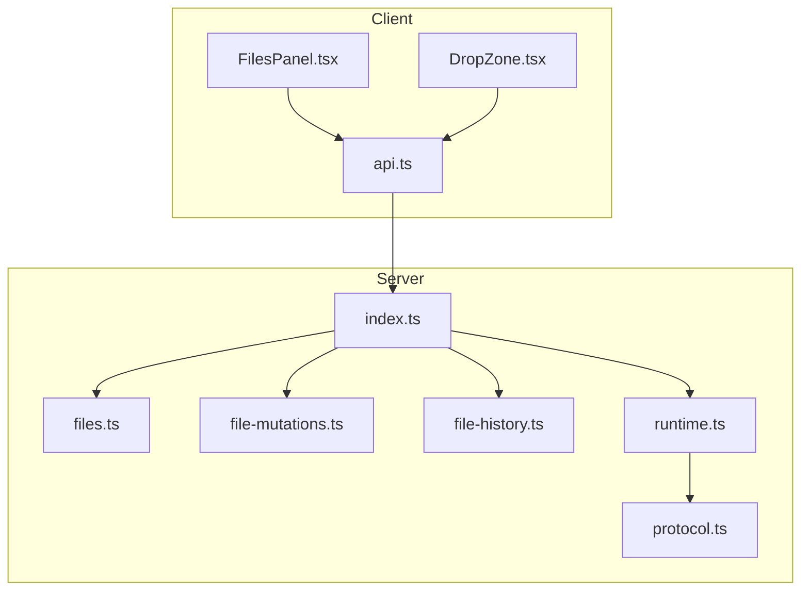
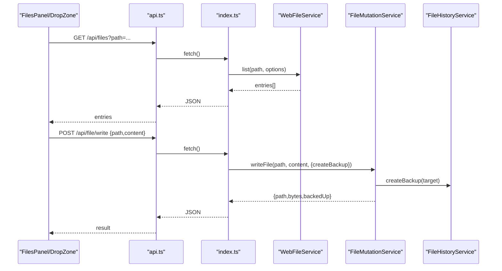
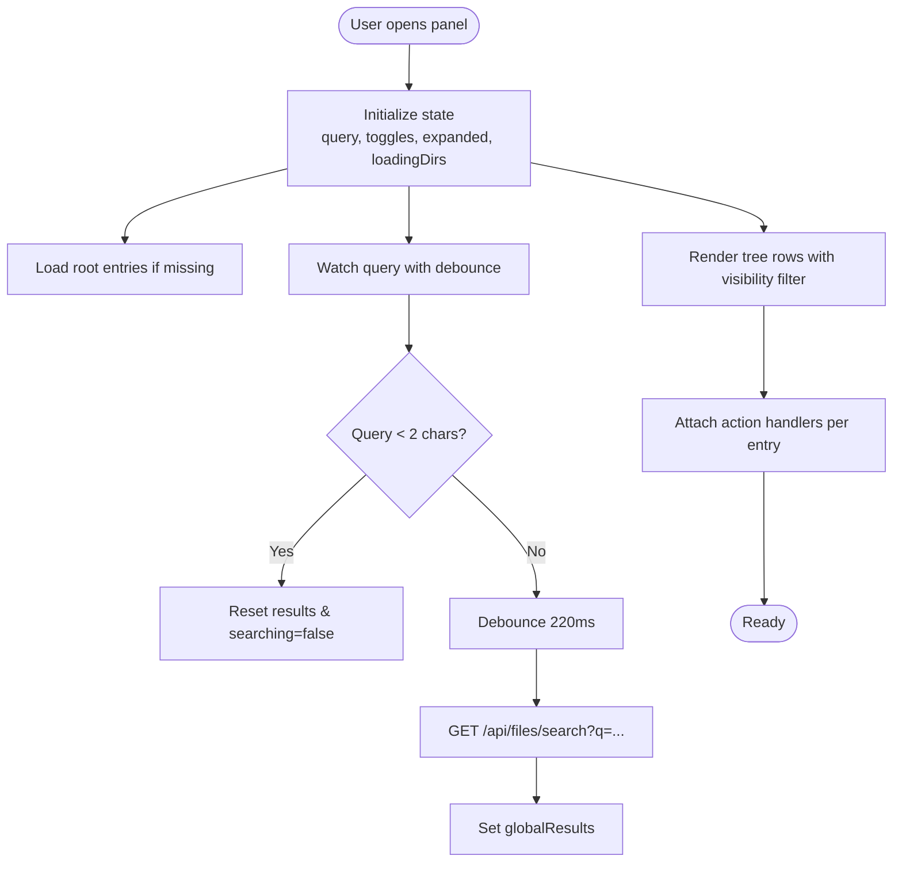
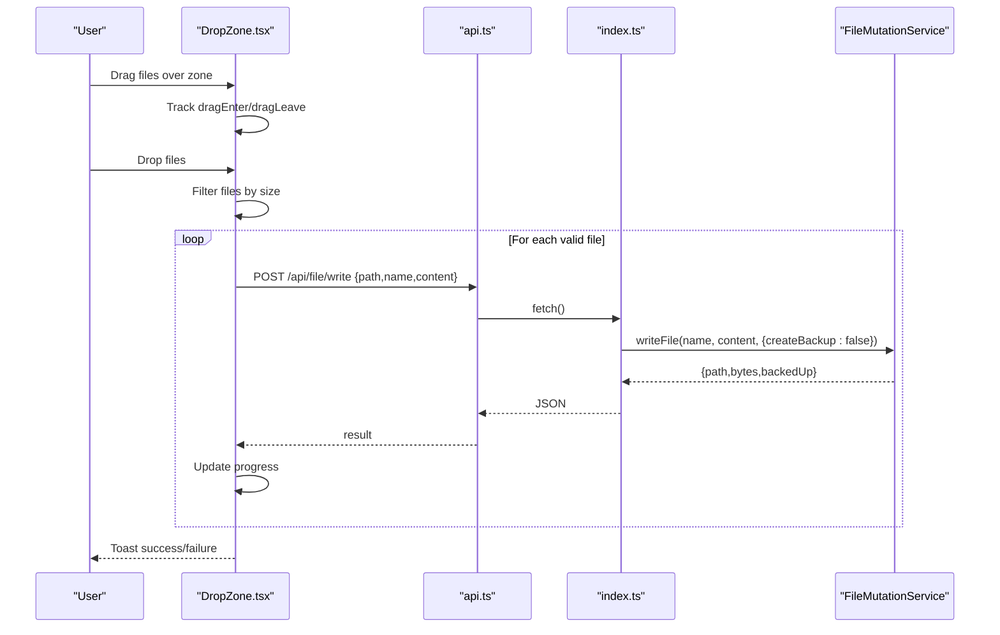
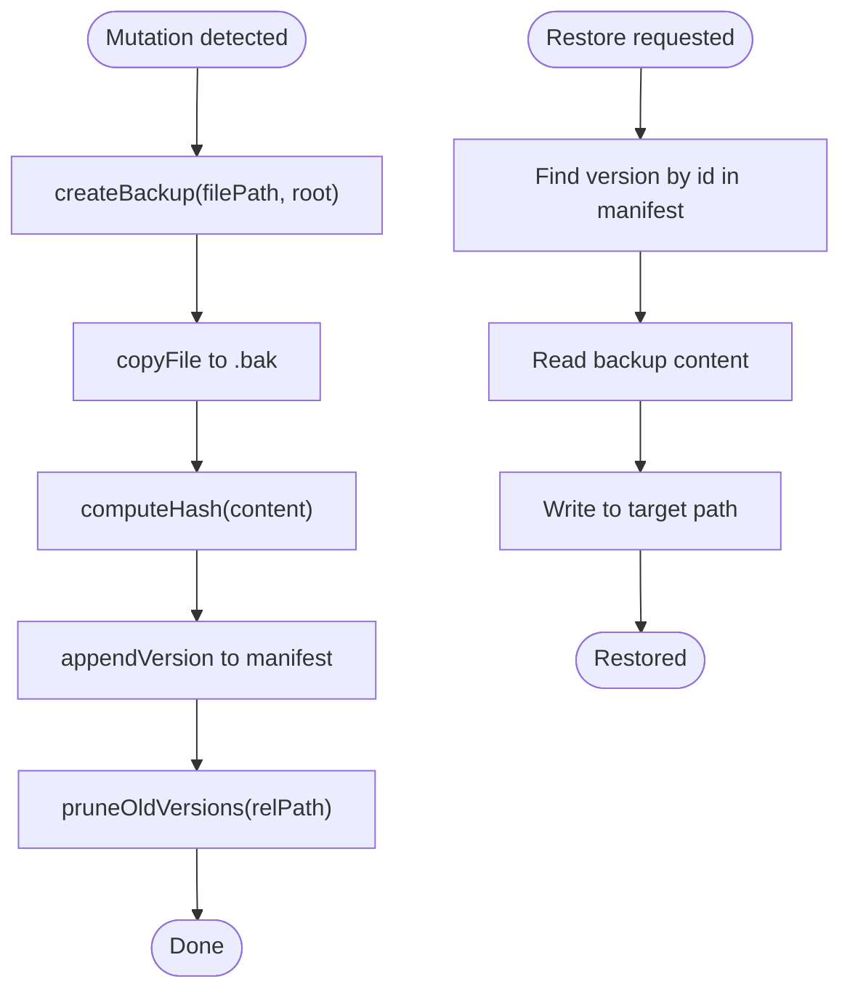
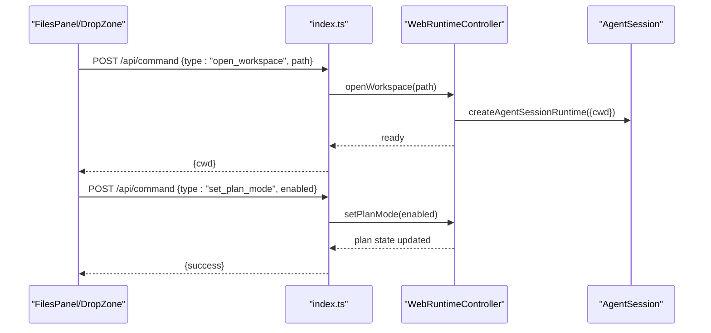
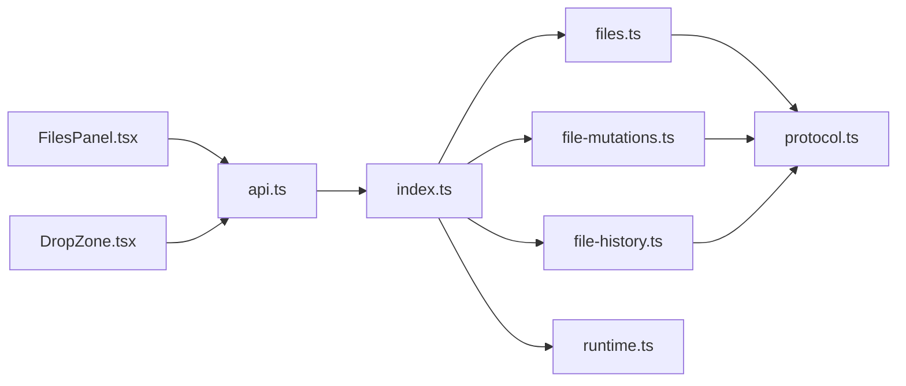

# File Management

<cite>
**Referenced Files in This Document**
- [FilesPanel.tsx](file://src/client/src/components/files/FilesPanel.tsx)
- [DropZone.tsx](file://src/client/src/components/files/DropZone.tsx)
- [DropZone.module.css](file://src/client/src/components/files/DropZone.module.css)
- [files.ts](file://src/server/files.ts)
- [file-mutations.ts](file://src/server/file-mutations.ts)
- [file-history.ts](file://src/server/file-history.ts)
- [index.ts](file://src/server/index.ts)
- [api.ts](file://src/client/src/lib/api.ts)
- [protocol.ts](file://src/shared/protocol.ts)
- [runtime.ts](file://src/server/runtime.ts)
</cite>

## Table of Contents
1. [Introduction](#introduction)
2. [Project Structure](#project-structure)
3. [Core Components](#core-components)
4. [Architecture Overview](#architecture-overview)
5. [Detailed Component Analysis](#detailed-component-analysis)
6. [Dependency Analysis](#dependency-analysis)
7. [Performance Considerations](#performance-considerations)
8. [Troubleshooting Guide](#troubleshooting-guide)
9. [Conclusion](#conclusion)

## Introduction
This document explains the file management system for the workspace, covering:
- FilesPanel: workspace browsing, filtering, keyboard navigation, and file actions
- DropZone: drag-and-drop upload with progress feedback
- Server-side file operations: safe access, workspace validation, and security policies
- Version history and backups
- Integration with the AgentSession runtime for file-based tool execution

## Project Structure
The file management system spans the client UI and the server runtime:
- Client-side UI components for browsing and uploading files
- Server-side services for listing/searching, mutating, and versioning files
- Shared protocol types for file entries and server configuration
- Runtime integration enabling file-aware tools and plan mode



**Diagram sources**
- [FilesPanel.tsx:1-267](file://src/client/src/components/files/FilesPanel.tsx#L1-L267)
- [DropZone.tsx:1-122](file://src/client/src/components/files/DropZone.tsx#L1-L122)
- [api.ts:1-59](file://src/client/src/lib/api.ts#L1-L59)
- [index.ts:568-625](file://src/server/index.ts#L568-L625)
- [files.ts:13-131](file://src/server/files.ts#L13-L131)
- [file-mutations.ts:13-140](file://src/server/file-mutations.ts#L13-L140)
- [file-history.ts:20-159](file://src/server/file-history.ts#L20-L159)
- [runtime.ts:12-499](file://src/server/runtime.ts#L12-L499)
- [protocol.ts:124-130](file://src/shared/protocol.ts#L124-L130)

**Section sources**
- [FilesPanel.tsx:1-267](file://src/client/src/components/files/FilesPanel.tsx#L1-L267)
- [DropZone.tsx:1-122](file://src/client/src/components/files/DropZone.tsx#L1-L122)
- [index.ts:568-625](file://src/server/index.ts#L568-L625)

## Core Components
- FilesPanel: renders the workspace tree, supports search, toggles visibility of hidden/generated items, and triggers file actions (open, reveal, summarize, ask, copy path).
- DropZone: handles drag-and-drop file uploads, validates sizes, uploads sequentially, and reports progress and results.
- Server-side services:
  - WebFileService: safe listing, search, and reading with workspace bounds and filters
  - FileMutationService: write, delete, mkdir, rename, and patch with backups and safety checks
  - FileHistoryService: maintains per-file version history with pruning and restoration
- Runtime integration: exposes file-aware capabilities via AgentSession runtime and plan mode.

**Section sources**
- [FilesPanel.tsx:10-195](file://src/client/src/components/files/FilesPanel.tsx#L10-L195)
- [DropZone.tsx:11-112](file://src/client/src/components/files/DropZone.tsx#L11-L112)
- [files.ts:13-131](file://src/server/files.ts#L13-L131)
- [file-mutations.ts:13-140](file://src/server/file-mutations.ts#L13-L140)
- [file-history.ts:20-159](file://src/server/file-history.ts#L20-L159)
- [runtime.ts:12-499](file://src/server/runtime.ts#L12-L499)

## Architecture Overview
The client communicates with the server over HTTP with optional token-based authentication. The server enforces workspace boundaries and security policies, exposes file APIs, and integrates with the AgentSession runtime for file-based tool execution.



**Diagram sources**
- [api.ts:9-25](file://src/client/src/lib/api.ts#L9-L25)
- [index.ts:568-625](file://src/server/index.ts#L568-L625)
- [files.ts:16-29](file://src/server/files.ts#L16-L29)
- [file-mutations.ts:21-34](file://src/server/file-mutations.ts#L21-L34)
- [file-history.ts:35-59](file://src/server/file-history.ts#L35-L59)

## Detailed Component Analysis

### FilesPanel Component
Responsibilities:
- Render and manage the workspace file tree
- Filter entries by visibility (hidden/generated)
- Search across the workspace with debounced requests
- Keyboard navigation and selection
- Trigger file actions: open, reveal, summarize, ask, copy path, open in Monaco

Key behaviors:
- Debounced search with request sequencing to avoid race conditions
- Lazy loading of directory entries with loading indicators
- Visibility toggles persisted in local storage
- Tree rendering with depth-based indentation and icons
- Action buttons per file entry



**Diagram sources**
- [FilesPanel.tsx:25-56](file://src/client/src/components/files/FilesPanel.tsx#L25-L56)
- [FilesPanel.tsx:72-93](file://src/client/src/components/files/FilesPanel.tsx#L72-L93)
- [FilesPanel.tsx:167-191](file://src/client/src/components/files/FilesPanel.tsx#L167-L191)

**Section sources**
- [FilesPanel.tsx:10-195](file://src/client/src/components/files/FilesPanel.tsx#L10-L195)

### DropZone Component
Responsibilities:
- Accept dragged files and upload them to the server
- Validate file sizes (< 10 MB)
- Upload sequentially with progress indication
- Report success/failure via toast notifications

Upload flow:
- Drag enter/leave counters track drag state
- On drop, filter valid files, iterate, read as text, POST to /api/file/write
- Update progress per file and show final toast



**Diagram sources**
- [DropZone.tsx:41-85](file://src/client/src/components/files/DropZone.tsx#L41-L85)
- [api.ts:16-25](file://src/client/src/lib/api.ts#L16-L25)
- [index.ts:582-588](file://src/server/index.ts#L582-L588)
- [file-mutations.ts:21-34](file://src/server/file-mutations.ts#L21-L34)

**Section sources**
- [DropZone.tsx:11-112](file://src/client/src/components/files/DropZone.tsx#L11-L112)
- [DropZone.module.css:1-50](file://src/client/src/components/files/DropZone.module.css#L1-L50)

### Server-Side File Operations
Services and endpoints:
- Listing and search: GET /api/files and /api/files/search
- Reading: GET /api/file
- Writing: POST /api/file/write
- Patching: POST /api/file/patch
- Deleting: POST /api/file/delete
- Creating directory: POST /api/file/mkdir
- Renaming: POST /api/file/rename
- History: GET /api/file/history, POST /api/file/restore

Safety and validation:
- Safe path resolution prevents escaping the workspace root
- Workspace allowlist enforcement
- Size limits for previews and uploads
- Generated directories filtered by default

```mermaid
classDiagram
class WebFileService {
+list(dir, options) WebFileEntry[]
+search(query, options) WebFileEntry[]
+read(path) {path,content,size}
-toEntry(fullPath,isDirectory) WebFileEntry
-shouldInclude(name,options) bool
-sortEntries(entries) WebFileEntry[]
-resolveSafe(path) string
-safeTarget(path) string
-normalizeInputPath(path) string
-stripWorkspacePrefix(path) string
-toRelative(path) string
}
class FileMutationService {
+writeFile(relPath, content, options) {path,bytes,backedUp}
+deleteFile(relPath) {path,wasiDirectory}
+createDirectory(relPath) {path}
+renameEntry(fromRel,toRel) {from,to}
+patchFile(relPath, patches) {path,edits,backedUp}
+listDirectory(relPath, options) entry[]
-resolveSafe(relPath) string
}
class FileHistoryService {
+init() void
+createBackup(filePath, workspaceRoot) FileVersion|null
+getHistory(relPath) FileVersion[]
+restoreVersion(versionId, workspaceRoot) string|null
+restoreToVersion(versionId, workspaceRoot) boolean
-appendVersion(relPath, version) void
-pruneOldVersions(relPath) void
-readManifest() Record
-writeManifest(manifest) void
-computeHash(content) string
}
WebFileService <.. FileMutationService : "used by"
FileMutationService --> FileHistoryService : "creates backups"
```

**Diagram sources**
- [files.ts:13-131](file://src/server/files.ts#L13-L131)
- [file-mutations.ts:13-140](file://src/server/file-mutations.ts#L13-L140)
- [file-history.ts:20-159](file://src/server/file-history.ts#L20-L159)

**Section sources**
- [index.ts:568-625](file://src/server/index.ts#L568-L625)
- [files.ts:16-61](file://src/server/files.ts#L16-L61)
- [file-mutations.ts:21-98](file://src/server/file-mutations.ts#L21-L98)
- [file-history.ts:35-93](file://src/server/file-history.ts#L35-L93)

### Version History Management
- Backups are stored under the workspace's .quake-web/file-history with a manifest
- Each version captures content hash, size, timestamp, and backup path
- Automatic pruning per-file and total-version caps
- Restoration reads a specific backup and writes to the target path



**Diagram sources**
- [file-history.ts:35-116](file://src/server/file-history.ts#L35-L116)
- [file-history.ts:118-152](file://src/server/file-history.ts#L118-L152)

**Section sources**
- [file-history.ts:20-159](file://src/server/file-history.ts#L20-L159)

### Integration with AgentSession Runtime
- The runtime manages sessions, models, and tools, including file-aware capabilities
- Commands can trigger plan mode, which surfaces file-aware decisions and clarifications
- The runtime exposes file operations through its extension context and tool execution pipeline



**Diagram sources**
- [index.ts:315-327](file://src/server/index.ts#L315-L327)
- [runtime.ts:64-75](file://src/server/runtime.ts#L64-L75)
- [runtime.ts:134-143](file://src/server/runtime.ts#L134-L143)

**Section sources**
- [runtime.ts:12-499](file://src/server/runtime.ts#L12-L499)
- [index.ts:315-327](file://src/server/index.ts#L315-L327)

## Dependency Analysis
- Client depends on api.ts for HTTP communication and on server endpoints defined in index.ts
- Server routes delegate to WebFileService, FileMutationService, and FileHistoryService
- Protocol types define shared shapes for file entries and server configuration
- Runtime bridges UI actions to AgentSession tool execution



**Diagram sources**
- [api.ts:1-59](file://src/client/src/lib/api.ts#L1-L59)
- [index.ts:568-625](file://src/server/index.ts#L568-L625)
- [files.ts:13-131](file://src/server/files.ts#L13-L131)
- [file-mutations.ts:13-140](file://src/server/file-mutations.ts#L13-L140)
- [file-history.ts:20-159](file://src/server/file-history.ts#L20-L159)
- [runtime.ts:12-499](file://src/server/runtime.ts#L12-L499)
- [protocol.ts:124-130](file://src/shared/protocol.ts#L124-L130)

**Section sources**
- [api.ts:1-59](file://src/client/src/lib/api.ts#L1-L59)
- [index.ts:568-625](file://src/server/index.ts#L568-L625)

## Performance Considerations
- Debounced search reduces network load during typing
- Lazy loading of directory entries avoids heavy initial renders
- Workspace filters reduce traversal overhead
- Sequential uploads in DropZone prevent server overload; consider batching if needed
- History pruning caps memory footprint and disk usage

## Troubleshooting Guide
Common issues and remedies:
- Request rejected or unauthorized: ensure token header is present for protected routes
- Path outside workspace: server rejects attempts to escape the root; verify relative paths
- File too large: preview limit is ~1 MB; uploads are limited to 10 MB
- Hidden/generated files not shown: toggle visibility in FilesPanel
- No results in search: ensure query is at least two characters long

**Section sources**
- [api.ts:52-58](file://src/client/src/lib/api.ts#L52-L58)
- [files.ts:54-61](file://src/server/files.ts#L54-L61)
- [file-mutations.ts:14-15](file://src/server/file-mutations.ts#L14-L15)
- [FilesPanel.tsx:95-107](file://src/client/src/components/files/FilesPanel.tsx#L95-L107)

## Conclusion
The file management system combines a responsive client UI with robust server-side safeguards. FilesPanel offers efficient workspace exploration and actions, while DropZone simplifies uploads with feedback. Server-side services enforce workspace boundaries, maintain version history, and integrate with the AgentSession runtime to support file-based tool execution and plan mode workflows.
