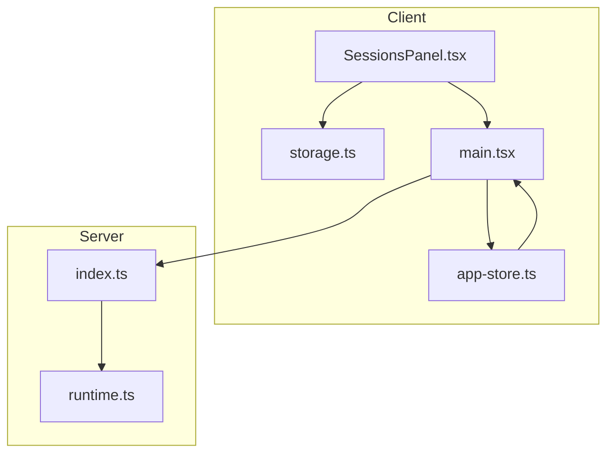
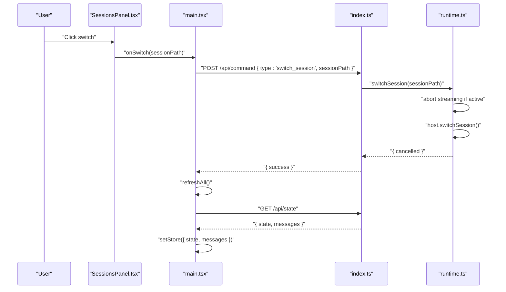
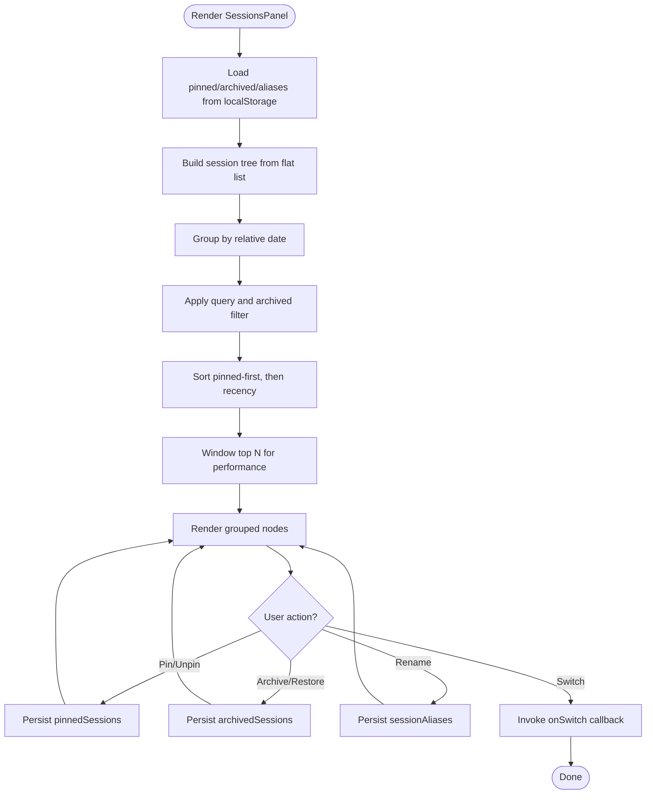
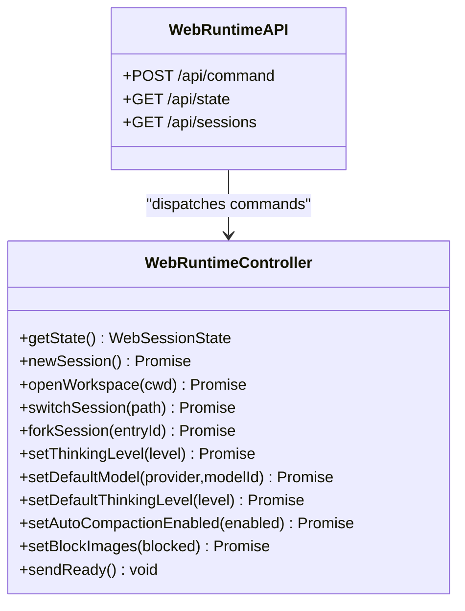
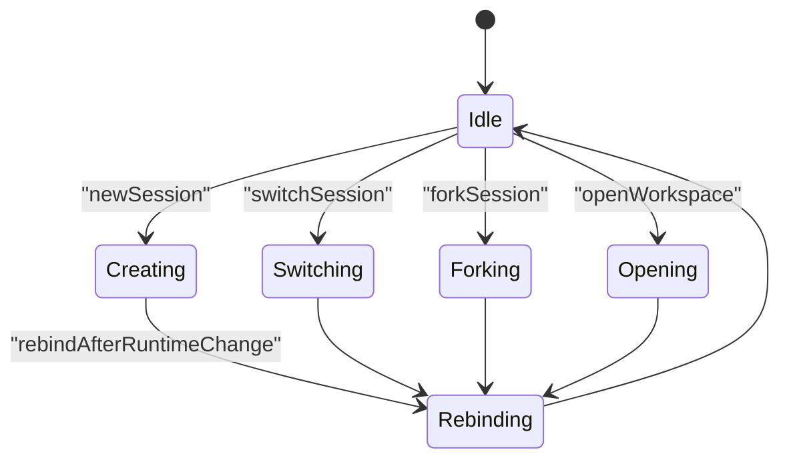
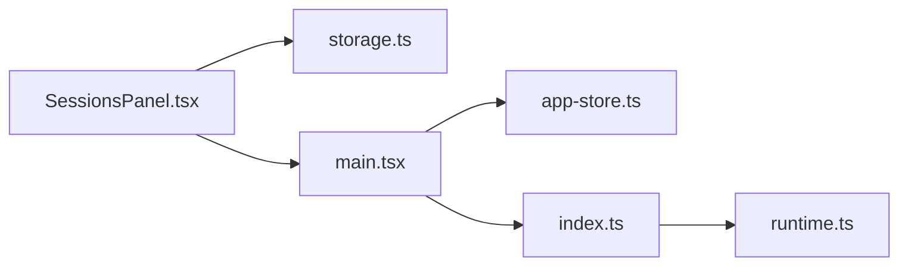

# Session Management

<cite>
**Referenced Files in This Document**
- [SessionsPanel.tsx](file://src/client/src/components/sessions/SessionsPanel.tsx)
- [storage.ts](file://src/client/src/lib/storage.ts)
- [app-store.ts](file://src/client/src/state/app-store.ts)
- [main.tsx](file://src/client/src/main.tsx)
- [runtime.ts](file://src/server/runtime.ts)
- [index.ts](file://src/server/index.ts)
- [session-management.spec.ts](file://test/e2e/session-management.spec.ts)
</cite>

## Table of Contents
1. [Introduction](#introduction)
2. [Project Structure](#project-structure)
3. [Core Components](#core-components)
4. [Architecture Overview](#architecture-overview)
5. [Detailed Component Analysis](#detailed-component-analysis)
6. [Dependency Analysis](#dependency-analysis)
7. [Performance Considerations](#performance-considerations)
8. [Troubleshooting Guide](#troubleshooting-guide)
9. [Conclusion](#conclusion)

## Introduction
This document explains the session management system in the application, focusing on:
- The SessionsPanel component for discovering, filtering, pinning, archiving, renaming, and switching sessions.
- AgentSession runtime integration, session state management, and persistence mechanisms.
- Session lifecycle management, workspace switching, session forking, and collaborative session features.
- Session configuration options, performance implications of multiple sessions, and troubleshooting session-related issues.

## Project Structure
The session management spans client-side UI, local persistence, and server-side runtime orchestration:
- Client-side UI: SessionsPanel renders and manipulates session views, persists user preferences locally, and triggers runtime commands.
- Client-side state: Zustand app store holds runtime state, messages, and session metadata.
- Server-side runtime: WebRuntimeController manages AgentSession lifecycles, exposes APIs for session operations, and streams state updates.

**Diagram sources**
- [SessionsPanel.tsx:10-48](file://src/client/src/components/sessions/SessionsPanel.tsx#L10-L48)
- [storage.ts:1-49](file://src/client/src/lib/storage.ts#L1-L49)
- [app-store.ts:186-252](file://src/client/src/state/app-store.ts#L186-L252)
- [main.tsx:145-184](file://src/client/src/main.tsx#L145-L184)
- [runtime.ts:24-54](file://src/server/runtime.ts#L24-L54)
- [index.ts:401-424](file://src/server/index.ts#L401-L424)

**Section sources**
- [SessionsPanel.tsx:10-48](file://src/client/src/components/sessions/SessionsPanel.tsx#L10-L48)
- [storage.ts:1-49](file://src/client/src/lib/storage.ts#L1-L49)
- [app-store.ts:186-252](file://src/client/src/state/app-store.ts#L186-L252)
- [main.tsx:145-184](file://src/client/src/main.tsx#L145-L184)
- [runtime.ts:24-54](file://src/server/runtime.ts#L24-L54)
- [index.ts:401-424](file://src/server/index.ts#L401-L424)

## Core Components
- SessionsPanel: Renders a paginated, filterable, and sortable list of sessions with support for pinning, archiving, renaming, and comparison. It reads/writes user preferences via localStorage abstractions and delegates session switching to the runtime.
- Local storage utilities: Provide robust read/write/remove helpers for arrays, records, and raw values with safe fallbacks.
- App store: Holds runtime state, messages, and session metadata; normalizes and prunes data to maintain performance.
- Runtime controller: Manages AgentSession lifecycles, exposes session operations (new, switch, fork), and emits state updates.

**Section sources**
- [SessionsPanel.tsx:10-48](file://src/client/src/components/sessions/SessionsPanel.tsx#L10-L48)
- [storage.ts:1-49](file://src/client/src/lib/storage.ts#L1-L49)
- [app-store.ts:186-252](file://src/client/src/state/app-store.ts#L186-L252)
- [runtime.ts:123-165](file://src/server/runtime.ts#L123-L165)

## Architecture Overview
The session lifecycle integrates UI actions with server-side runtime operations and SSE state propagation.

**Diagram sources**
- [SessionsPanel.tsx:113-123](file://src/client/src/components/sessions/SessionsPanel.tsx#L113-L123)
- [main.tsx:496-507](file://src/client/src/main.tsx#L496-L507)
- [index.ts:255-374](file://src/server/index.ts#L255-L374)
- [runtime.ts:145-154](file://src/server/runtime.ts#L145-L154)
- [runtime.ts:401-411](file://src/server/runtime.ts#L401-L411)

## Detailed Component Analysis

### SessionsPanel: Discovery, Filtering, and Persistence
- Rendering pipeline:
  - Builds a session tree from flat session list using parentSessionPath.
  - Groups nodes by relative date (today/locale date).
  - Applies filters: query, archived visibility, pinned sorting, and windowed selection.
- Interaction model:
  - Pin/unpin toggles persistent preference stored under quake-web:pinnedSessions.
  - Archive/unarchive moves sessions between persistent lists under quake-web:archivedSessions.
  - Rename stores alias under quake-web:sessionAliases.
  - Compare selects up to two sessions for side-by-side viewing.
- Persistence:
  - Uses readStorageArray/readStorageRecord for typed retrieval.
  - Writes via writeStorageJson with immediate UI updates.

**Diagram sources**
- [SessionsPanel.tsx:53-89](file://src/client/src/components/sessions/SessionsPanel.tsx#L53-L89)
- [SessionsPanel.tsx:91-111](file://src/client/src/components/sessions/SessionsPanel.tsx#L91-L111)
- [storage.ts:1-49](file://src/client/src/lib/storage.ts#L1-L49)

**Section sources**
- [SessionsPanel.tsx:10-48](file://src/client/src/components/sessions/SessionsPanel.tsx#L10-L48)
- [SessionsPanel.tsx:53-89](file://src/client/src/components/sessions/SessionsPanel.tsx#L53-L89)
- [SessionsPanel.tsx:91-111](file://src/client/src/components/sessions/SessionsPanel.tsx#L91-L111)
- [storage.ts:1-49](file://src/client/src/lib/storage.ts#L1-L49)

### AgentSession Runtime Integration and State Management
- Runtime controller exposes:
  - Session state snapshot via getState().
  - Commands: newSession, openWorkspace, switchSession, forkSession, setThinkingLevel, setDefaultModel, setDefaultThinkingLevel, setAutoCompactionEnabled, setBlockImages.
  - SSE-ready signaling via sendReady() and event forwarding.
- UI-to-runtime flow:
  - UI sends /api/command requests for session operations.
  - Server validates and dispatches to runtime.Lock ensures serialized operations.
  - On successful switch/fork/new, runtime rebinds and emits state.

**Diagram sources**
- [runtime.ts:24-54](file://src/server/runtime.ts#L24-L54)
- [runtime.ts:123-165](file://src/server/runtime.ts#L123-L165)
- [runtime.ts:167-201](file://src/server/runtime.ts#L167-L201)
- [runtime.ts:401-411](file://src/server/runtime.ts#L401-L411)
- [index.ts:255-374](file://src/server/index.ts#L255-L374)
- [index.ts:417-423](file://src/server/index.ts#L417-L423)

**Section sources**
- [runtime.ts:24-54](file://src/server/runtime.ts#L24-L54)
- [runtime.ts:123-165](file://src/server/runtime.ts#L123-L165)
- [runtime.ts:167-201](file://src/server/runtime.ts#L167-L201)
- [runtime.ts:401-411](file://src/server/runtime.ts#L401-L411)
- [index.ts:255-374](file://src/server/index.ts#L255-L374)
- [index.ts:417-423](file://src/server/index.ts#L417-L423)

### Session Lifecycle Management
- New session: aborts ongoing streaming, creates a new session, rebinds runtime, and signals ready.
- Switch session: aborts streaming, switches to requested session path, rebinds, and signals ready.
- Fork session: aborts streaming, forks by entryId, rebinds, and signals ready.
- Workspace switch: recreates runtime for new cwd, updates services, and signals ready.

**Diagram sources**
- [runtime.ts:123-165](file://src/server/runtime.ts#L123-L165)
- [runtime.ts:405-411](file://src/server/runtime.ts#L405-L411)
- [index.ts:315-327](file://src/server/index.ts#L315-L327)

**Section sources**
- [runtime.ts:123-165](file://src/server/runtime.ts#L123-L165)
- [runtime.ts:405-411](file://src/server/runtime.ts#L405-L411)
- [index.ts:315-327](file://src/server/index.ts#L315-L327)

### Workspace Switching and Collaborative Features
- Workspace switching:
  - Validates path against allowlist.
  - Recreates runtime and associated services (files, terminal, settings, mutations).
  - Updates server config and restarts scheduler.
- Collaborative session features:
  - Parent-child relationship supported via parentSessionPath; UI renders nested branches accordingly.
  - Comparison mode supports selecting two sessions for side-by-side review.

**Section sources**
- [index.ts:211-219](file://src/server/index.ts#L211-L219)
- [index.ts:315-327](file://src/server/index.ts#L315-L327)
- [SessionsPanel.tsx:91-101](file://src/client/src/components/sessions/SessionsPanel.tsx#L91-L101)
- [SessionsPanel.tsx:113-132](file://src/client/src/components/sessions/SessionsPanel.tsx#L113-L132)

### Session Configuration Options
- Thinking level: adjustable via setThinkingLevel and persisted via runtime settings manager.
- Model defaults: setDefaultModel/provider updates runtime settings and flushes to disk.
- Auto-compaction: toggled via setAutoCompactionEnabled and reflected in emitted state.
- Image policies: setBlockImages/showImages update runtime settings and flush.

**Section sources**
- [runtime.ts:167-201](file://src/server/runtime.ts#L167-L201)
- [runtime.ts:172-181](file://src/server/runtime.ts#L172-L181)

### Data Persistence Mechanisms
- Client-side:
  - SessionsPanel persists pinned, archived, and aliases to localStorage via typed helpers.
  - App store normalizes and prunes messages and tools to cap memory usage.
- Server-side:
  - Runtime settings and session state are persisted through settings manager and session files managed by the AgentSession runtime.

**Section sources**
- [SessionsPanel.tsx:32-34](file://src/client/src/components/sessions/SessionsPanel.tsx#L32-L34)
- [storage.ts:1-49](file://src/client/src/lib/storage.ts#L1-L49)
- [app-store.ts:102-127](file://src/client/src/state/app-store.ts#L102-L127)
- [app-store.ts:137-170](file://src/client/src/state/app-store.ts#L137-L170)

## Dependency Analysis
- UI depends on app-store for runtime state and messages, and on runtime.ts via server endpoints.
- SessionsPanel depends on storage.ts for user preferences and on main.tsx for invoking runtime commands.
- Server routes in index.ts dispatch to runtime.ts, which manages AgentSession lifecycles.

**Diagram sources**
- [SessionsPanel.tsx:1-10](file://src/client/src/components/sessions/SessionsPanel.tsx#L1-L10)
- [storage.ts:1-49](file://src/client/src/lib/storage.ts#L1-L49)
- [app-store.ts:186-252](file://src/client/src/state/app-store.ts#L186-L252)
- [main.tsx:145-184](file://src/client/src/main.tsx#L145-L184)
- [index.ts:401-424](file://src/server/index.ts#L401-L424)
- [runtime.ts:24-54](file://src/server/runtime.ts#L24-L54)

**Section sources**
- [SessionsPanel.tsx:1-10](file://src/client/src/components/sessions/SessionsPanel.tsx#L1-L10)
- [storage.ts:1-49](file://src/client/src/lib/storage.ts#L1-L49)
- [app-store.ts:186-252](file://src/client/src/state/app-store.ts#L186-L252)
- [main.tsx:145-184](file://src/client/src/main.tsx#L145-L184)
- [index.ts:401-424](file://src/server/index.ts#L401-L424)
- [runtime.ts:24-54](file://src/server/runtime.ts#L24-L54)

## Performance Considerations
- Client-side:
  - SessionsPanel applies a windowed rendering strategy to limit DOM nodes and improve responsiveness.
  - App store normalizes and prunes messages and tools to cap memory usage and maintain UI smoothness.
- Server-side:
  - Runtime operations are serialized via a lock to prevent contention during session switches and forks.
  - Streaming abortion ensures clean transitions when switching or forking.

**Section sources**
- [SessionsPanel.tsx:70-82](file://src/client/src/components/sessions/SessionsPanel.tsx#L70-L82)
- [app-store.ts:102-127](file://src/client/src/state/app-store.ts#L102-L127)
- [app-store.ts:137-170](file://src/client/src/state/app-store.ts#L137-L170)
- [index.ts:311-367](file://src/server/index.ts#L311-L367)
- [runtime.ts:145-165](file://src/server/runtime.ts#L145-L165)

## Troubleshooting Guide
- Cannot switch session:
  - Verify /api/command accepts switch_session and returns success.
  - Ensure runtime is not streaming; switching aborts streaming before switching.
- Cannot list sessions:
  - Confirm /api/sessions endpoint returns a sessions array.
- Cannot fork session:
  - Confirm /api/command accepts fork_session and returns success.
- State not updating after operation:
  - Call /api/state to fetch latest runtime state and messages.
  - UI refreshAll() should be invoked after command completion.

**Section sources**
- [session-management.spec.ts:42-75](file://test/e2e/session-management.spec.ts#L42-L75)
- [index.ts:626-629](file://src/server/index.ts#L626-L629)
- [index.ts:417-423](file://src/server/index.ts#L417-L423)
- [main.tsx:496-507](file://src/client/src/main.tsx#L496-L507)

## Conclusion
The session management system combines a responsive client UI with a robust server runtime. SessionsPanel provides powerful discovery and manipulation capabilities backed by local persistence. The runtime orchestrates session lifecycles, enforces safe transitions, and exposes configuration options. Together, these components enable efficient workspace switching, collaborative branching, and scalable performance.
