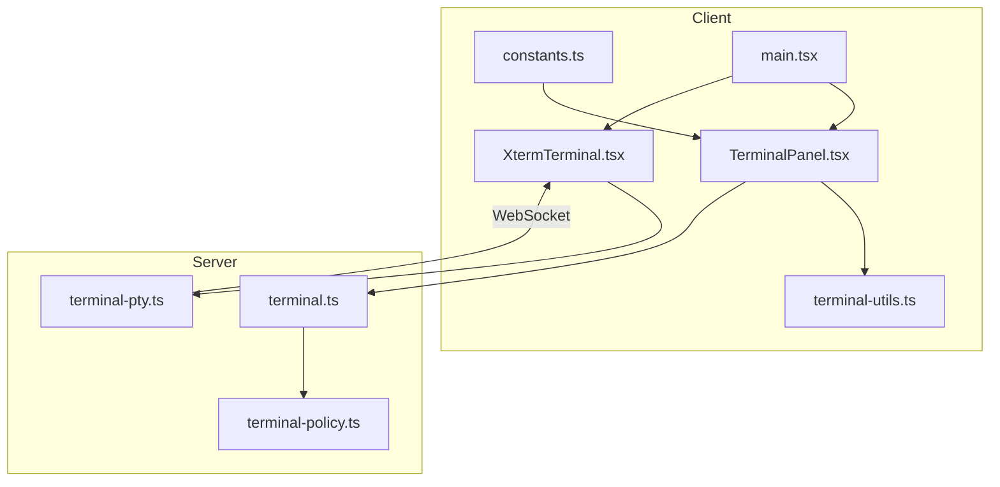
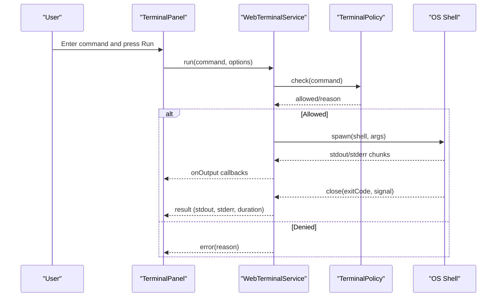
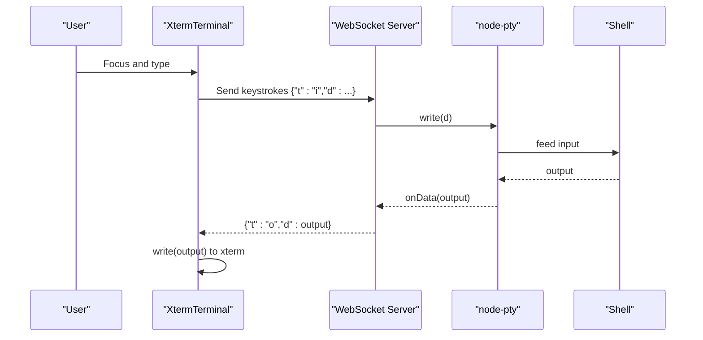
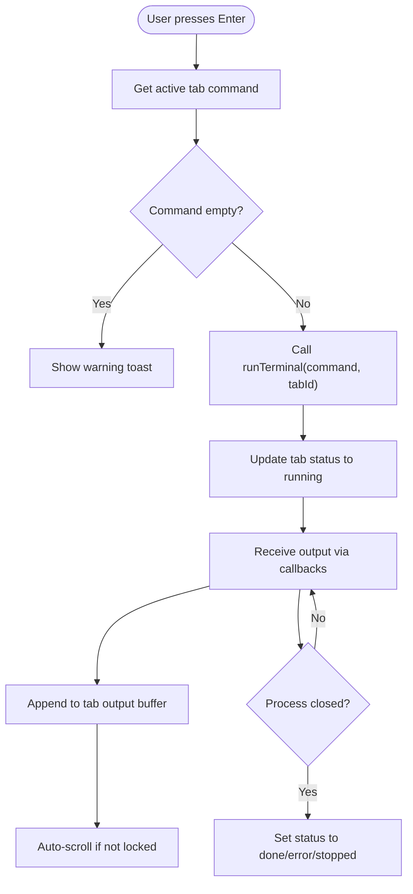
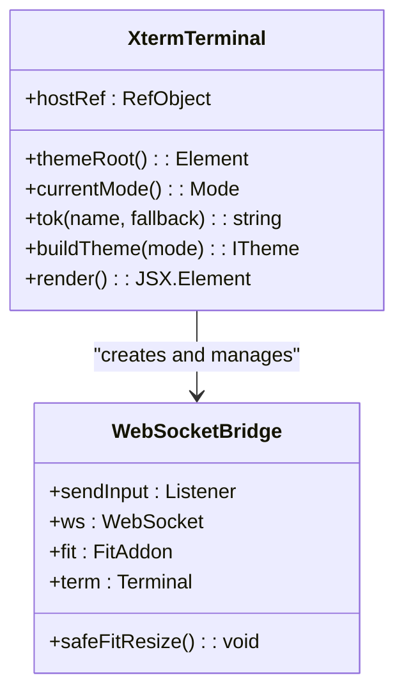
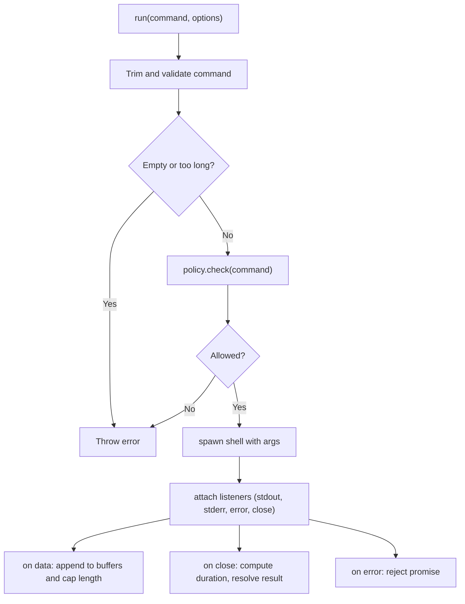
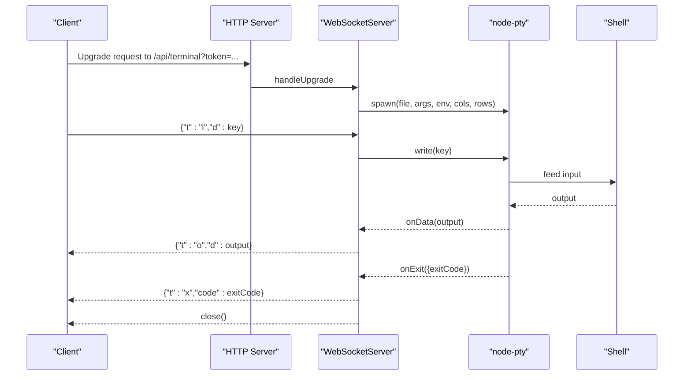
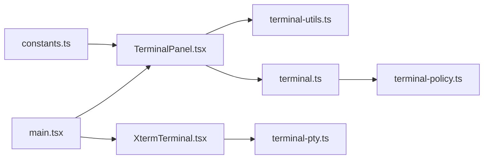

# Terminal Integration

<cite>
**Referenced Files in This Document**
- [TerminalPanel.tsx](file://src/client/src/components/terminal/TerminalPanel.tsx)
- [XtermTerminal.tsx](file://src/client/src/components/terminal/XtermTerminal.tsx)
- [terminal-utils.ts](file://src/client/src/components/terminal/terminal-utils.ts)
- [terminal.ts](file://src/server/terminal.ts)
- [terminal-policy.ts](file://src/server/terminal-policy.ts)
- [terminal-pty.ts](file://src/server/terminal-pty.ts)
- [terminal.spec.ts](file://test/e2e/terminal.spec.ts)
- [constants.ts](file://src/client/src/constants.ts)
- [main.tsx](file://src/client/src/main.tsx)
</cite>

## Table of Contents
1. [Introduction](#introduction)
2. [Project Structure](#project-structure)
3. [Core Components](#core-components)
4. [Architecture Overview](#architecture-overview)
5. [Detailed Component Analysis](#detailed-component-analysis)
6. [Dependency Analysis](#dependency-analysis)
7. [Performance Considerations](#performance-considerations)
8. [Troubleshooting Guide](#troubleshooting-guide)
9. [Conclusion](#conclusion)

## Introduction
This document explains the terminal integration system in the application, covering the frontend terminal panels, the interactive xterm terminal, and the backend terminal services. It details how commands are executed, routed, and streamed, how tabs are managed, and how security and policy enforcement are applied. It also documents configuration options, performance characteristics for long-running processes, and troubleshooting steps for connectivity issues.

## Project Structure
The terminal integration spans client and server components:
- Frontend components:
  - TerminalPanel: a React component that renders a command-line interface with tab management and output rendering.
  - XtermTerminal: a real-time interactive terminal backed by xterm.js and a WebSocket connection to the backend.
  - terminal-utils: shared types and helpers for terminal tab state.
- Backend services:
  - WebTerminalService: executes commands synchronously in Node child processes with policy checks and streaming-like callbacks.
  - TerminalPolicy: enforces safety rules for commands.
  - Terminal WebSocket service: manages persistent PTY-backed terminals via WebSocket for interactive sessions.

**Diagram sources**
- [TerminalPanel.tsx:1-217](file://src/client/src/components/terminal/TerminalPanel.tsx#L1-L217)
- [XtermTerminal.tsx:1-138](file://src/client/src/components/terminal/XtermTerminal.tsx#L1-L138)
- [terminal-utils.ts:1-6](file://src/client/src/components/terminal/terminal-utils.ts#L1-L6)
- [terminal.ts:1-87](file://src/server/terminal.ts#L1-L87)
- [terminal-policy.ts:1-39](file://src/server/terminal-policy.ts#L1-L39)
- [terminal-pty.ts:1-95](file://src/server/terminal-pty.ts#L1-L95)
- [constants.ts:1-35](file://src/client/src/constants.ts#L1-L35)
- [main.tsx:66-69](file://src/client/src/main.tsx#L66-L69)

**Section sources**
- [TerminalPanel.tsx:1-217](file://src/client/src/components/terminal/TerminalPanel.tsx#L1-L217)
- [XtermTerminal.tsx:1-138](file://src/client/src/components/terminal/XtermTerminal.tsx#L1-L138)
- [terminal-utils.ts:1-6](file://src/client/src/components/terminal/terminal-utils.ts#L1-L6)
- [terminal.ts:1-87](file://src/server/terminal.ts#L1-L87)
- [terminal-policy.ts:1-39](file://src/server/terminal-policy.ts#L1-L39)
- [terminal-pty.ts:1-95](file://src/server/terminal-pty.ts#L1-L95)
- [constants.ts:1-35](file://src/client/src/constants.ts#L1-L35)
- [main.tsx:66-69](file://src/client/src/main.tsx#L66-L69)

## Core Components
- TerminalPanel: Renders command input, history navigation, tabbed output, and actions (run, stop, copy, scroll lock). Implements ANSI output parsing and risk warnings for potentially dangerous commands.
- XtermTerminal: Creates an xterm terminal instance, loads addons (fit, links, search), connects to a WebSocket endpoint for interactive PTY sessions, and handles resizing and theming.
- terminal-utils: Defines TerminalTabState and ensures a new tab exists for a given ID.
- WebTerminalService: Spawns OS shells, enforces policy, streams stdout/stderr chunks, enforces timeouts, and returns structured results.
- TerminalPolicy: Evaluates commands against predefined patterns and modes ("safe", "allow-all", "disabled").
- Terminal WebSocket service: Upgrades HTTP to WebSocket, spawns a PTY per connection, bridges keystrokes to the PTY and PTY output to the client.

**Section sources**
- [TerminalPanel.tsx:9-79](file://src/client/src/components/terminal/TerminalPanel.tsx#L9-L79)
- [XtermTerminal.tsx:64-135](file://src/client/src/components/terminal/XtermTerminal.tsx#L64-L135)
- [terminal-utils.ts:1-6](file://src/client/src/components/terminal/terminal-utils.ts#L1-L6)
- [terminal.ts:21-85](file://src/server/terminal.ts#L21-L85)
- [terminal-policy.ts:21-33](file://src/server/terminal-policy.ts#L21-L33)
- [terminal-pty.ts:25-94](file://src/server/terminal-pty.ts#L25-L94)

## Architecture Overview
The system supports two terminal modes:
- Command runner: synchronous execution via WebTerminalService with policy checks and streaming callbacks.
- Interactive PTY terminal: persistent WebSocket connection to a PTY-backed shell for interactive use.

**Diagram sources**
- [TerminalPanel.tsx:48-66](file://src/client/src/components/terminal/TerminalPanel.tsx#L48-L66)
- [terminal.ts:36-85](file://src/server/terminal.ts#L36-L85)
- [terminal-policy.ts:24-32](file://src/server/terminal-policy.ts#L24-L32)

**Diagram sources**
- [XtermTerminal.tsx:102-113](file://src/client/src/components/terminal/XtermTerminal.tsx#L102-L113)
- [terminal-pty.ts:77-88](file://src/server/terminal-pty.ts#L77-L88)

## Detailed Component Analysis

### TerminalPanel Component
Responsibilities:
- Render command input with history navigation (Up/Down arrows).
- Manage tabs (new, close, activate) and maintain per-tab state (id, name, command, output, status, duration).
- Provide actions: run, stop, copy output (with ANSI stripping), toggle scroll lock, re-run last command, analyze output.
- Display ANSI-colored output using a custom parser/renderer.
- Warn on risky commands and show status indicators.

Key behaviors:
- Copy to clipboard with optional ANSI stripping.
- Auto-scroll when not locked; scroll lock toggled via a custom event.
- Status labels and emoji mapping for UI feedback.
- Duration formatting for elapsed time.

**Diagram sources**
- [TerminalPanel.tsx:48-79](file://src/client/src/components/terminal/TerminalPanel.tsx#L48-L79)

**Section sources**
- [TerminalPanel.tsx:9-79](file://src/client/src/components/terminal/TerminalPanel.tsx#L9-L79)
- [terminal-utils.ts:1-6](file://src/client/src/components/terminal/terminal-utils.ts#L1-L6)
- [constants.ts:19-20](file://src/client/src/constants.ts#L19-L20)

### XtermTerminal Component
Responsibilities:
- Initialize xterm with theme-aware colors and addons (fit, links, search).
- Connect to the WebSocket terminal endpoint with auth token and initial dimensions.
- Forward keystrokes to the server and render server output in the terminal.
- Handle resize events and theme changes.

Notable implementation details:
- Uses a theme derived from CSS custom properties on the root element.
- Disables WebGL addon to avoid disposal issues under React StrictMode.
- Sends resize requests to the server after fitting the terminal to the container.

**Diagram sources**
- [XtermTerminal.tsx:64-135](file://src/client/src/components/terminal/XtermTerminal.tsx#L64-L135)

**Section sources**
- [XtermTerminal.tsx:64-135](file://src/client/src/components/terminal/XtermTerminal.tsx#L64-L135)

### Terminal Utility Types and Helpers
- TerminalTabState: defines the shape of a terminal tab including id, name, command, output, status, exitCode, durationMs, and scrollLock.
- ensureTerminalTab: ensures a tab exists for a given id, initializing with default values if missing.

**Section sources**
- [terminal-utils.ts:1-6](file://src/client/src/components/terminal/terminal-utils.ts#L1-L6)

### Server-Side Terminal Service (Command Execution)
Responsibilities:
- Spawn OS-specific shells (/bin/sh or cmd.exe) and execute commands.
- Enforce policy decisions before execution.
- Stream stdout/stderr chunks to callbacks and cap buffers to prevent memory growth.
- Enforce timeouts and return structured results including exitCode, signal, stdout, stderr, duration, and timeout flag.
- Track active processes by id and support stopping via SIGTERM.

**Diagram sources**
- [terminal.ts:36-85](file://src/server/terminal.ts#L36-L85)

**Section sources**
- [terminal.ts:21-85](file://src/server/terminal.ts#L21-L85)

### Terminal Policy Enforcement
Responsibilities:
- Evaluate commands against a set of dangerous patterns (e.g., recursive delete, format, publish, piping downloads to shells, sensitive chmod).
- Support three modes: "safe" (enforced), "allow-all" (permissive), "disabled" (blocked).
- Provide a parser to convert environment variable values to a valid mode.

**Section sources**
- [terminal-policy.ts:21-39](file://src/server/terminal-policy.ts#L21-L39)

### Terminal WebSocket Service (Interactive PTY)
Responsibilities:
- Upgrade HTTP connections to WebSocket at /api/terminal with authentication.
- Spawn a PTY per connection using node-pty with appropriate shell and environment.
- Bridge client keystrokes to PTY input and PTY output to client via WebSocket.
- Handle resize messages and process exit, closing the connection gracefully.

**Diagram sources**
- [terminal-pty.ts:25-94](file://src/server/terminal-pty.ts#L25-L94)

**Section sources**
- [terminal-pty.ts:25-94](file://src/server/terminal-pty.ts#L25-L94)

## Dependency Analysis
- TerminalPanel depends on terminal-utils for tab state and on the application store for UI feedback.
- XtermTerminal depends on xterm and WebSocket for interactive sessions.
- WebTerminalService depends on TerminalPolicy for enforcement and on Node child_process for execution.
- Terminal WebSocket service depends on node-pty and ws for PTY lifecycle and transport.

**Diagram sources**
- [TerminalPanel.tsx:1-10](file://src/client/src/components/terminal/TerminalPanel.tsx#L1-L10)
- [terminal-utils.ts:1-6](file://src/client/src/components/terminal/terminal-utils.ts#L1-L6)
- [terminal.ts:1-10](file://src/server/terminal.ts#L1-L10)
- [terminal-policy.ts:1-10](file://src/server/terminal-policy.ts#L1-L10)
- [XtermTerminal.tsx:1-10](file://src/client/src/components/terminal/XtermTerminal.tsx#L1-L10)
- [terminal-pty.ts:1-10](file://src/server/terminal-pty.ts#L1-L10)
- [main.tsx:66-69](file://src/client/src/main.tsx#L66-L69)
- [constants.ts:1-10](file://src/client/src/constants.ts#L1-L10)

**Section sources**
- [TerminalPanel.tsx:1-10](file://src/client/src/components/terminal/TerminalPanel.tsx#L1-L10)
- [terminal-utils.ts:1-6](file://src/client/src/components/terminal/terminal-utils.ts#L1-L6)
- [terminal.ts:1-10](file://src/server/terminal.ts#L1-L10)
- [terminal-policy.ts:1-10](file://src/server/terminal-policy.ts#L1-L10)
- [XtermTerminal.tsx:1-10](file://src/client/src/components/terminal/XtermTerminal.tsx#L1-L10)
- [terminal-pty.ts:1-10](file://src/server/terminal-pty.ts#L1-L10)
- [main.tsx:66-69](file://src/client/src/main.tsx#L66-L69)
- [constants.ts:1-10](file://src/client/src/constants.ts#L1-L10)

## Performance Considerations
- Buffer limits: The client caps terminal output to a fixed number of characters and keeps a head/tail for efficient rendering. See [constants.ts:19-20](file://src/client/src/constants.ts#L19-L20).
- Server-side buffering: The command runner caps stdout/stderr buffers to prevent unbounded growth during streaming.
- Timeouts: The command runner enforces a configurable timeout with a minimum and maximum bound, ensuring long-running commands are terminated.
- Memory pressure: Both client and server trim buffers to recent content to reduce memory footprint.
- Long-running processes: Prefer the interactive PTY terminal for extended sessions; the command runner is optimized for short-lived tasks.

**Section sources**
- [constants.ts:19-20](file://src/client/src/constants.ts#L19-L20)
- [terminal.ts:56-67](file://src/server/terminal.ts#L56-L67)
- [terminal.ts:57-60](file://src/server/terminal.ts#L57-L60)

## Troubleshooting Guide
Common issues and resolutions:
- Terminal panel not appearing:
  - Verify lazy loading flags and that the terminal components are imported. See [main.tsx:66-69](file://src/client/src/main.tsx#L66-L69).
- Interactive terminal disconnects:
  - Check WebSocket URL construction and authentication token propagation. See [XtermTerminal.tsx:98-100](file://src/client/src/components/terminal/XtermTerminal.tsx#L98-L100).
  - Confirm the server-side upgrade handler accepts the path and validates auth. See [terminal-pty.ts:28-42](file://src/server/terminal-pty.ts#L28-L42).
- Commands blocked by policy:
  - Review TerminalPolicy mode and patterns. See [terminal-policy.ts:21-33](file://src/server/terminal-policy.ts#L21-L33).
- Slow or laggy terminal:
  - Reduce output volume or disable ANSI rendering temporarily.
  - Adjust buffer limits and ensure scroll lock is enabled for large outputs. See [constants.ts:19-20](file://src/client/src/constants.ts#L19-L20).
- Copy/paste issues:
  - Ensure clipboard API is supported and accessible. See [TerminalPanel.tsx:17-25](file://src/client/src/components/terminal/TerminalPanel.tsx#L17-L25).
- End-to-end tests:
  - Validate command execution and security warnings. See [terminal.spec.ts:13-37](file://test/e2e/terminal.spec.ts#L13-L37) and [terminal.spec.ts:59-69](file://test/e2e/terminal.spec.ts#L59-L69).

**Section sources**
- [main.tsx:66-69](file://src/client/src/main.tsx#L66-L69)
- [XtermTerminal.tsx:98-100](file://src/client/src/components/terminal/XtermTerminal.tsx#L98-L100)
- [terminal-pty.ts:28-42](file://src/server/terminal-pty.ts#L28-L42)
- [terminal-policy.ts:21-33](file://src/server/terminal-policy.ts#L21-L33)
- [constants.ts:19-20](file://src/client/src/constants.ts#L19-L20)
- [TerminalPanel.tsx:17-25](file://src/client/src/components/terminal/TerminalPanel.tsx#L17-L25)
- [terminal.spec.ts:13-37](file://test/e2e/terminal.spec.ts#L13-L37)
- [terminal.spec.ts:59-69](file://test/e2e/terminal.spec.ts#L59-L69)

## Conclusion
The terminal integration provides both a command execution interface and a full-featured interactive terminal. The frontend components offer a polished UX with tab management, ANSI rendering, and security warnings, while the backend services enforce policies, manage PTY lifecycles, and stream output efficiently. Proper configuration of policy modes and buffer limits ensures secure and responsive terminal experiences.
