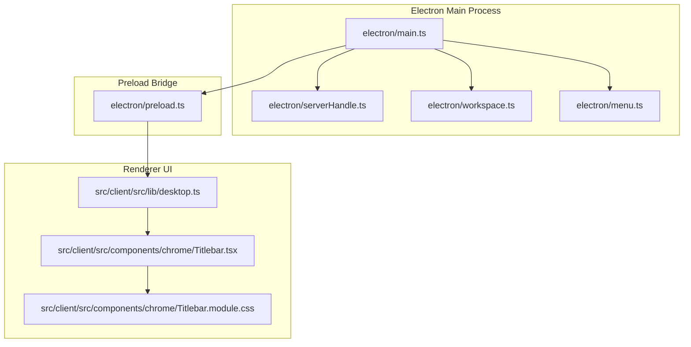
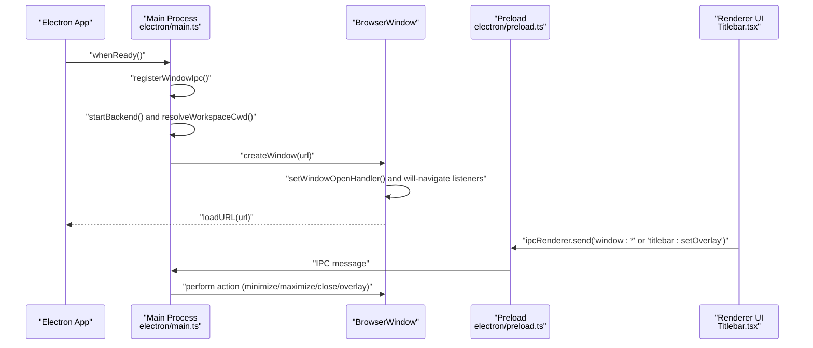
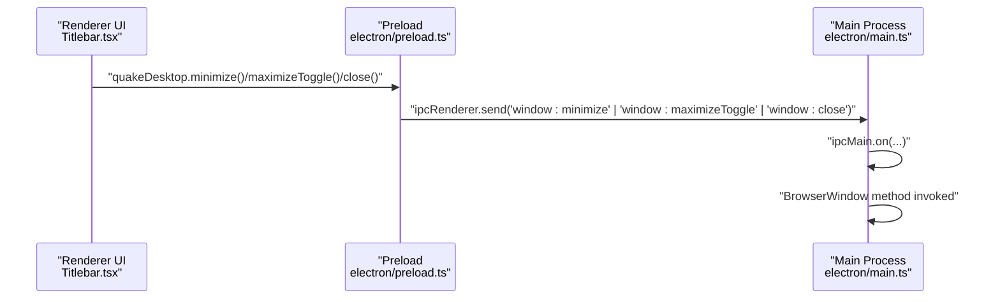
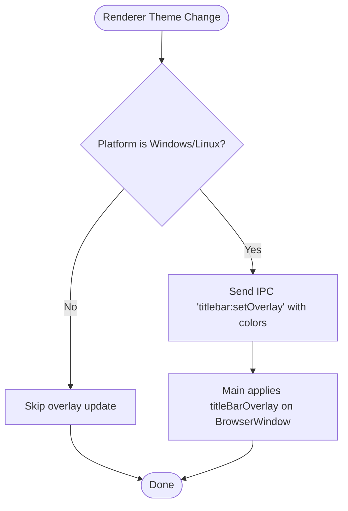
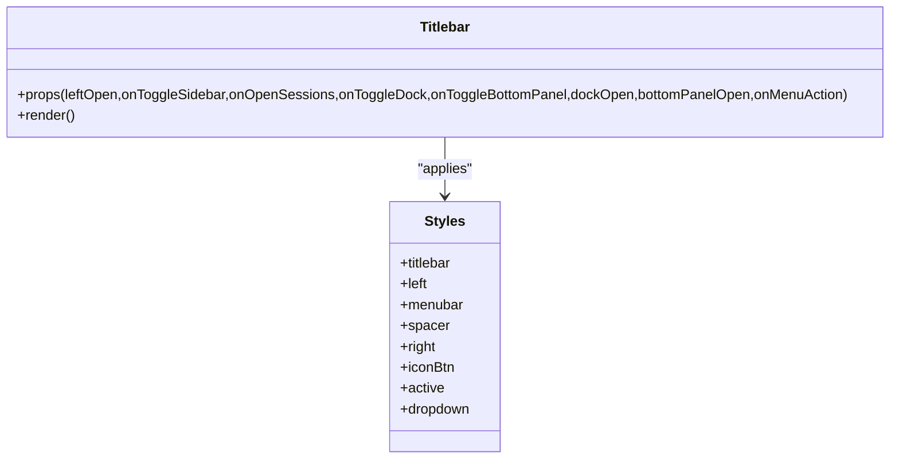
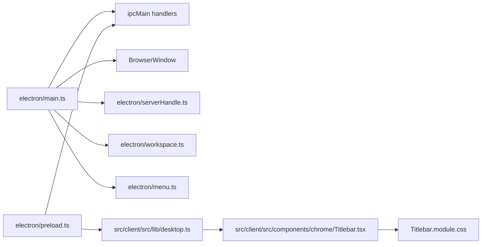

# Browser Window Management

<cite>
**Referenced Files in This Document**
- [main.ts](file://electron/main.ts)
- [preload.ts](file://electron/preload.ts)
- [desktop.ts](file://src/client/src/lib/desktop.ts)
- [Titlebar.tsx](file://src/client/src/components/chrome/Titlebar.tsx)
- [Titlebar.module.css](file://src/client/src/components/chrome/Titlebar.module.css)
- [menu.ts](file://electron/menu.ts)
- [serverHandle.ts](file://electron/serverHandle.ts)
- [workspace.ts](file://electron/workspace.ts)
- [package.json](file://package.json)
</cite>

## Table of Contents
1. [Introduction](#introduction)
2. [Project Structure](#project-structure)
3. [Core Components](#core-components)
4. [Architecture Overview](#architecture-overview)
5. [Detailed Component Analysis](#detailed-component-analysis)
6. [Dependency Analysis](#dependency-analysis)
7. [Performance Considerations](#performance-considerations)
8. [Troubleshooting Guide](#troubleshooting-guide)
9. [Conclusion](#conclusion)

## Introduction
This document explains the Electron browser window configuration and management for the application. It covers window creation, size constraints, platform-specific behaviors, frameless window implementation, title bar overlay configuration on Windows and Linux, macOS title bar styling, web preferences security settings, context isolation, preload script integration, navigation restrictions, external link handling, and window control IPC communication. Platform-specific considerations for window controls, accessibility, and user experience optimizations are also included.

## Project Structure
The window management spans three primary areas:
- Electron main process: window lifecycle, security policies, IPC registration, and navigation restrictions
- Preload script: safe exposure of desktop APIs to the renderer via contextBridge
- Renderer UI: custom titlebar and drag regions, integrating with platform-specific window controls

**Diagram sources**
- [main.ts](file://electron/main.ts)
- [serverHandle.ts](file://electron/serverHandle.ts)
- [workspace.ts](file://electron/workspace.ts)
- [menu.ts](file://electron/menu.ts)
- [preload.ts](file://electron/preload.ts)
- [desktop.ts](file://src/client/src/lib/desktop.ts)
- [Titlebar.tsx](file://src/client/src/components/chrome/Titlebar.tsx)
- [Titlebar.module.css](file://src/client/src/components/chrome/Titlebar.module.css)

**Section sources**
- [main.ts](file://electron/main.ts)
- [preload.ts](file://electron/preload.ts)
- [desktop.ts](file://src/client/src/lib/desktop.ts)
- [Titlebar.tsx](file://src/client/src/components/chrome/Titlebar.tsx)
- [Titlebar.module.css](file://src/client/src/components/chrome/Titlebar.module.css)
- [menu.ts](file://electron/menu.ts)
- [serverHandle.ts](file://electron/serverHandle.ts)
- [workspace.ts](file://electron/workspace.ts)
- [package.json](file://package.json)

## Core Components
- Electron main window configuration and lifecycle
- IPC handlers for window controls and titlebar overlay updates
- Navigation restrictions and external link handling
- Security webPreferences and preload bridge
- Custom titlebar with drag regions and platform-specific adjustments
- Application menu tailored per platform

**Section sources**
- [main.ts](file://electron/main.ts)
- [preload.ts](file://electron/preload.ts)
- [desktop.ts](file://src/client/src/lib/desktop.ts)
- [Titlebar.tsx](file://src/client/src/components/chrome/Titlebar.tsx)
- [Titlebar.module.css](file://src/client/src/components/chrome/Titlebar.module.css)
- [menu.ts](file://electron/menu.ts)

## Architecture Overview
The application launches a single BrowserWindow configured as frameless with platform-specific title bar overlays. The renderer communicates with the main process through a controlled IPC channel exposed via a preload script. Navigation is restricted to local backend resources, while external links open in the system browser.

**Diagram sources**
- [main.ts](file://electron/main.ts)
- [preload.ts](file://electron/preload.ts)
- [Titlebar.tsx](file://src/client/src/components/chrome/Titlebar.tsx)

## Detailed Component Analysis

### Window Creation and Lifecycle
- Size constraints: initial size and minimum bounds are defined during window construction.
- Background color and title are set for consistent branding.
- Auto-hide menu bar except on macOS.
- Frameless design with hidden title bar on macOS; Windows/Linux use titleBarOverlay to place OS controls in the title area.
- Web preferences enable context isolation, disable nodeIntegration, enable sandbox, allow webviewTag, and specify preload path.
- Navigation restrictions: deny navigations outside the local backend host; external http/https links open externally.
- Window open handler denies popups except external links which open in the system browser.
- Dev tools are opened in development mode.
- Single instance lock prevents multiple instances; second instances focus the existing window.

**Section sources**
- [main.ts](file://electron/main.ts)

### IPC Communication for Window Controls
- Renderer sends commands to main via ipcRenderer to minimize, toggle maximize, and close the window.
- Main registers ipcMain handlers to perform these actions on the BrowserWindow.
- Theme-driven titlebar overlay updates are sent from renderer to main to adjust overlay colors on Windows/Linux.

**Diagram sources**
- [preload.ts](file://electron/preload.ts)
- [main.ts](file://electron/main.ts)
- [Titlebar.tsx](file://src/client/src/components/chrome/Titlebar.tsx)

**Section sources**
- [preload.ts](file://electron/preload.ts)
- [main.ts](file://electron/main.ts)

### Title Bar Overlay and Platform-Specific Behaviors
- Windows and Linux: titleBarOverlay is enabled with a fixed height and colors; updates are applied dynamically via IPC.
- macOS: titleBarStyle is hidden; traffic light buttons are inset on the left side; no overlay is used.
- Renderer exposes a setOverlay function to synchronize overlay colors with the active theme.

**Diagram sources**
- [main.ts](file://electron/main.ts)
- [preload.ts](file://electron/preload.ts)
- [desktop.ts](file://src/client/src/lib/desktop.ts)

**Section sources**
- [main.ts](file://electron/main.ts)
- [preload.ts](file://electron/preload.ts)
- [desktop.ts](file://src/client/src/lib/desktop.ts)

### Custom Titlebar Implementation
- The titlebar is a 40px tall, draggable region with non-draggable controls on the left and right.
- Drag region uses -webkit-app-region: drag on the spacer element; buttons and menus use -webkit-app-region: no-drag.
- On macOS, left padding accommodates traffic light buttons; right padding leaves room for OS window controls overlay.
- Menu dropdowns are positioned absolutely and marked as no-drag to allow interaction.

**Diagram sources**
- [Titlebar.tsx](file://src/client/src/components/chrome/Titlebar.tsx)
- [Titlebar.module.css](file://src/client/src/components/chrome/Titlebar.module.css)

**Section sources**
- [Titlebar.tsx](file://src/client/src/components/chrome/Titlebar.tsx)
- [Titlebar.module.css](file://src/client/src/components/chrome/Titlebar.module.css)

### Navigation Restrictions and External Link Handling
- Popups are denied by default; external http/https links open in the system browser.
- will-navigate blocks navigation outside the local backend host; external links are opened externally.
- These policies ensure the window remains a secure wrapper around the local backend.

**Section sources**
- [main.ts](file://electron/main.ts)

### Security Model: Web Preferences and Preload Bridge
- Web preferences:
  - contextIsolation: true
  - nodeIntegration: false
  - sandbox: true
  - webviewTag: true
  - preload: path to preload script
- Preload script:
  - Exposes a minimal, typed API surface via contextBridge under window.quakeDesktop.
  - Provides window control functions and overlay color updates.
  - Ensures renderer cannot access Node.js APIs directly.

**Section sources**
- [main.ts](file://electron/main.ts)
- [preload.ts](file://electron/preload.ts)
- [desktop.ts](file://src/client/src/lib/desktop.ts)

### Backend Server and Workspace Management
- The backend runs in a separate Electron UtilityProcess with environment variables for host, port, and working directory.
- Workspace selection persists last-used directory and resolves initial CWD from environment, state, or OS documents/home.
- Changing workspaces restarts the backend with a new port and reloads the window URL.

**Section sources**
- [serverHandle.ts](file://electron/serverHandle.ts)
- [workspace.ts](file://electron/workspace.ts)
- [main.ts](file://electron/main.ts)

### Application Menu
- Platform-aware menu template with macOS app menu and standard roles.
- Adds an “Open FolderÔÇØ action wired to workspace switching.

**Section sources**
- [menu.ts](file://electron/menu.ts)
- [main.ts](file://electron/main.ts)

## Dependency Analysis
The main process orchestrates window creation, IPC, and navigation policies. The preload script mediates safe IPC to the renderer. The renderer composes UI with drag regions and platform-specific spacing. The backend server is managed as a separate process with workspace-scoped environment.

**Diagram sources**
- [main.ts](file://electron/main.ts)
- [serverHandle.ts](file://electron/serverHandle.ts)
- [workspace.ts](file://electron/workspace.ts)
- [menu.ts](file://electron/menu.ts)
- [preload.ts](file://electron/preload.ts)
- [desktop.ts](file://src/client/src/lib/desktop.ts)
- [Titlebar.tsx](file://src/client/src/components/chrome/Titlebar.tsx)
- [Titlebar.module.css](file://src/client/src/components/chrome/Titlebar.module.css)

**Section sources**
- [main.ts](file://electron/main.ts)
- [serverHandle.ts](file://electron/serverHandle.ts)
- [workspace.ts](file://electron/workspace.ts)
- [menu.ts](file://electron/menu.ts)
- [preload.ts](file://electron/preload.ts)
- [desktop.ts](file://src/client/src/lib/desktop.ts)
- [Titlebar.tsx](file://src/client/src/components/chrome/Titlebar.tsx)
- [Titlebar.module.css](file://src/client/src/components/chrome/Titlebar.module.css)

## Performance Considerations
- Keep the preload script minimal to reduce overhead and attack surface.
- Avoid frequent titlebar overlay updates; batch theme changes where possible.
- Restrict navigation early to prevent unnecessary resource loading.
- Use devtools only in development to avoid performance impact in production builds.

## Troubleshooting Guide
- Window does not open or closes immediately:
  - Verify single instance lock and window-all-closed behavior.
  - Check backend startup and port availability.
- External links do not open:
  - Confirm setWindowOpenHandler and will-navigate handlers are registered.
- Titlebar overlay not updating:
  - Ensure IPC handler exists and platform is Windows/Linux.
  - Verify setTitleBarOverlay is supported on the OS version.
- Menu actions not working:
  - Confirm menu template and click handlers are built correctly.
- Workspace switching fails:
  - Validate backend restart and port listening before reloading the window.

**Section sources**
- [main.ts](file://electron/main.ts)
- [serverHandle.ts](file://electron/serverHandle.ts)
- [workspace.ts](file://electron/workspace.ts)
- [menu.ts](file://electron/menu.ts)

## Conclusion
The application implements a secure, frameless Electron window with platform-specific title bar overlays and a custom titlebar UI. Strict navigation policies and a sandboxed security model protect the renderer. IPC channels provide controlled window management and dynamic theming. The backend runs in a dedicated process with workspace scoping, ensuring robust operation across platforms.
