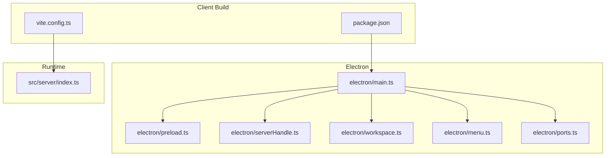
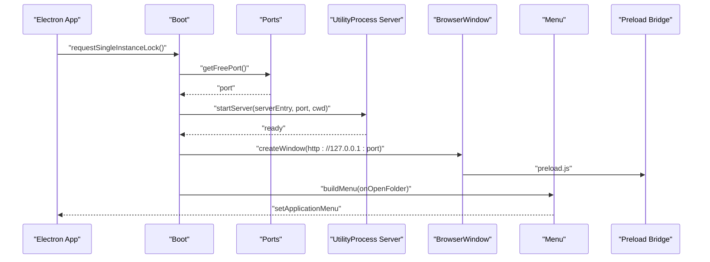
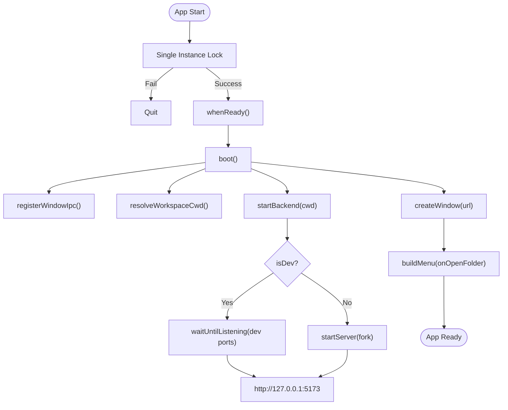
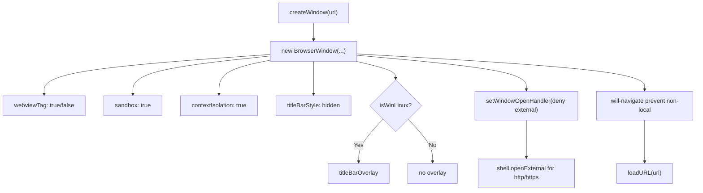
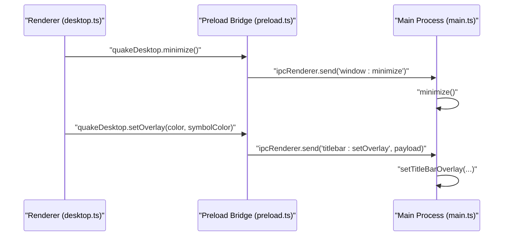
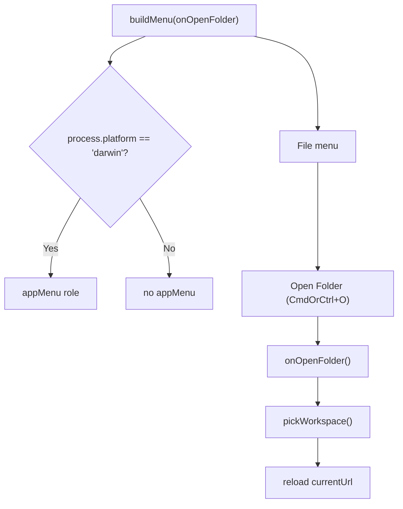
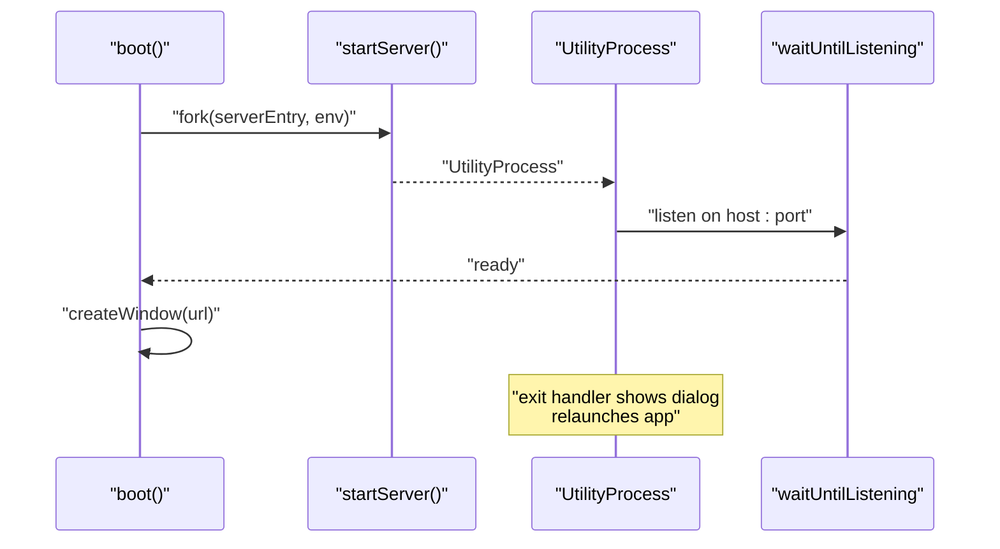
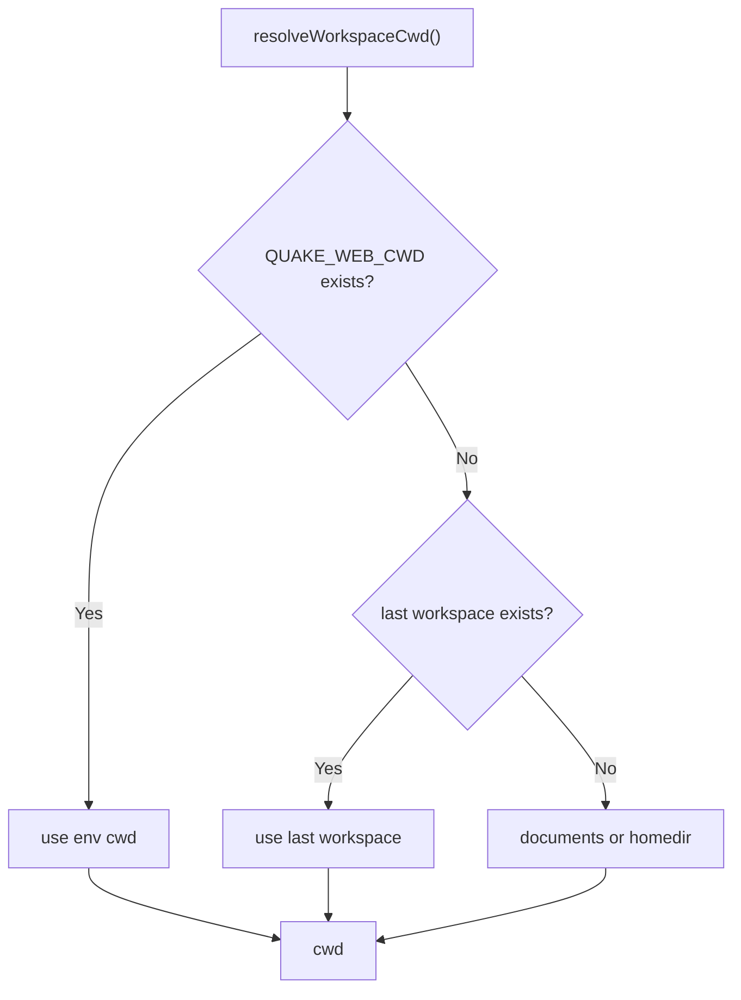
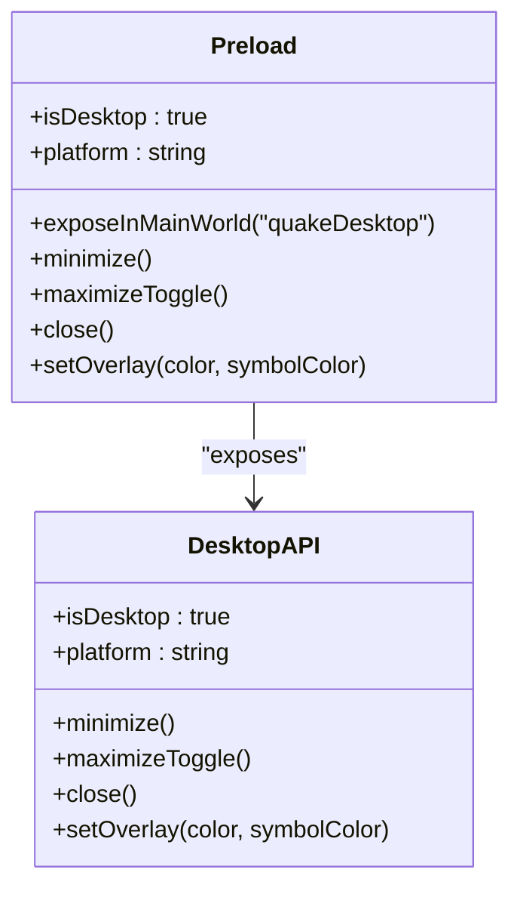
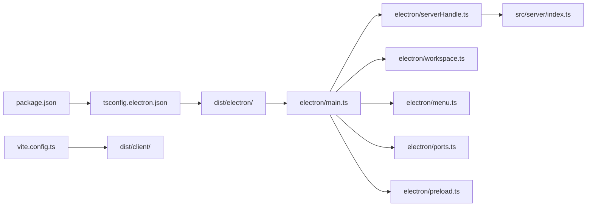

# Desktop Integration

<cite>
**Referenced Files in This Document**
- [main.ts](file://electron/main.ts)
- [preload.ts](file://electron/preload.ts)
- [menu.ts](file://electron/menu.ts)
- [workspace.ts](file://electron/workspace.ts)
- [serverHandle.ts](file://electron/serverHandle.ts)
- [ports.ts](file://electron/ports.ts)
- [desktop.ts](file://src/client/src/lib/desktop.ts)
- [vite.config.ts](file://vite.config.ts)
- [package.json](file://package.json)
- [tsconfig.electron.json](file://tsconfig.electron.json)
- [architecture.md](file://docs/architecture.md)
- [security.md](file://docs/security.md)
- [electron-dev.bat](file://electron-dev.bat)
</cite>

## Table of Contents
1. [Introduction](#introduction)
2. [Project Structure](#project-structure)
3. [Core Components](#core-components)
4. [Architecture Overview](#architecture-overview)
5. [Detailed Component Analysis](#detailed-component-analysis)
6. [Dependency Analysis](#dependency-analysis)
7. [Performance Considerations](#performance-considerations)
8. [Troubleshooting Guide](#troubleshooting-guide)
9. [Conclusion](#conclusion)
10. [Appendices](#appendices)

## Introduction
This document explains the Electron desktop wrapper implementation for the Quake Code Web application. It covers the application lifecycle, browser window configuration, IPC communication patterns, menu system, server startup/shutdown, workspace management, preload script security, desktop-specific features, native integrations, platform behaviors, build configuration, and packaging strategy. The goal is to provide a comprehensive yet accessible guide for developers extending or maintaining the desktop integration.

## Project Structure
The desktop integration is implemented under the electron/ directory and integrates with the web client built via Vite. The main entry point initializes the Electron app, starts the backend server, configures the BrowserWindow, registers IPC handlers, builds the application menu, and manages workspace selection. The preload script exposes a minimal, secure API surface to the renderer.

**Diagram sources**
- [main.ts](file://electron/main.ts)
- [preload.ts](file://electron/preload.ts)
- [serverHandle.ts](file://electron/serverHandle.ts)
- [workspace.ts](file://electron/workspace.ts)
- [menu.ts](file://electron/menu.ts)
- [ports.ts](file://electron/ports.ts)
- [vite.config.ts](file://vite.config.ts)
- [package.json](file://package.json)

**Section sources**
- [main.ts](file://electron/main.ts)
- [vite.config.ts](file://vite.config.ts)
- [package.json](file://package.json)

## Core Components
- Application lifecycle and window management: Initializes single-instance lock, handles ready/quit/activate events, creates and restores the main BrowserWindow, and enforces navigation restrictions.
- IPC communication: Exposes window controls and titlebar overlay updates to the renderer via a controlled preload bridge.
- Menu system: Builds a cross-platform menu with workspace selection and standard roles.
- Server lifecycle: Starts/stops the backend server in a dedicated Electron UtilityProcess with environment propagation and logging.
- Workspace management: Resolves the working directory from environment, last-used state, or user documents/home; persists selections and supports runtime switching.
- Port utilities: Allocates free ports and waits for listeners with timeouts.

**Section sources**
- [main.ts](file://electron/main.ts)
- [preload.ts](file://electron/preload.ts)
- [menu.ts](file://electron/menu.ts)
- [serverHandle.ts](file://electron/serverHandle.ts)
- [workspace.ts](file://electron/workspace.ts)
- [ports.ts](file://electron/ports.ts)

## Architecture Overview
The desktop app runs a local HTTP server inside a separate Node process, served to a BrowserWindow that loads either the development Vite dev server or the production-built client. Navigation is restricted to localhost resources, external links open in the system browser, and the preload script exposes a narrow desktop API surface.

**Diagram sources**
- [main.ts](file://electron/main.ts)
- [serverHandle.ts](file://electron/serverHandle.ts)
- [ports.ts](file://electron/ports.ts)

## Detailed Component Analysis

### Application Lifecycle Management
- Single-instance enforcement prevents multiple instances; second-instance events restore and focus the existing window.
- Ready-time boot initializes IPC, resolves workspace, starts the backend, creates the window, and sets the application menu.
- Quit and activate handlers manage lifecycle transitions, ensuring the server is stopped gracefully and windows are recreated when needed.
- Dev mode enables remote debugging and opens developer tools automatically.

**Diagram sources**
- [main.ts](file://electron/main.ts)

**Section sources**
- [main.ts](file://electron/main.ts)

### Browser Window Configuration and Navigation Policy
- Creates a frameless window with hidden titlebar and optional title bar overlay on Windows/Linux for native window controls.
- Enforces strict navigation policy: only URLs starting with the local host are allowed; external HTTP(S) links open in the system browser.
- Disables webview tag usage in production builds and enables sandboxing with context isolation.

**Diagram sources**
- [main.ts](file://electron/main.ts)

**Section sources**
- [main.ts](file://electron/main.ts)

### IPC Communication Patterns
- The main process registers handlers for window controls and titlebar overlay updates.
- The preload script exposes a minimal API surface via contextBridge, forwarding calls to ipcRenderer.
- The renderer detects desktop availability through a typed global and conditionally renders native UI when available.

**Diagram sources**
- [desktop.ts](file://src/client/src/lib/desktop.ts)
- [preload.ts](file://electron/preload.ts)
- [main.ts](file://electron/main.ts)

**Section sources**
- [desktop.ts](file://src/client/src/lib/desktop.ts)
- [preload.ts](file://electron/preload.ts)
- [main.ts](file://electron/main.ts)

### Menu System Implementation
- Cross-platform menu template with macOS-specific app menu and standard roles.
- Provides a “Open FolderÔÇØ action bound to a workspace picker callback, enabling dynamic workspace switching.

**Diagram sources**
- [menu.ts](file://electron/menu.ts)
- [workspace.ts](file://electron/workspace.ts)
- [main.ts](file://electron/main.ts)

**Section sources**
- [menu.ts](file://electron/menu.ts)
- [workspace.ts](file://electron/workspace.ts)
- [main.ts](file://electron/main.ts)

### Server Startup and Shutdown Procedures
- Backend is started as a separate UtilityProcess with environment variables for host, port, and working directory.
- stdout/stderr are forwarded to Electron's process streams for visibility.
- On unexpected exit, a dialog is shown and the app relaunches automatically.
- Graceful shutdown occurs on window-all-closed and before-quit events.

**Diagram sources**
- [serverHandle.ts](file://electron/serverHandle.ts)
- [ports.ts](file://electron/ports.ts)
- [main.ts](file://electron/main.ts)

**Section sources**
- [serverHandle.ts](file://electron/serverHandle.ts)
- [ports.ts](file://electron/ports.ts)
- [main.ts](file://electron/main.ts)

### Workspace Management
- Resolves the working directory from environment variable, last-used workspace, or user documents/home.
- Persists the last workspace to a JSON state file in the Electron userData directory.
- Provides a native folder picker dialog and updates the running server in dev mode or restarts the server in prod mode.

**Diagram sources**
- [workspace.ts](file://electron/workspace.ts)

**Section sources**
- [workspace.ts](file://electron/workspace.ts)

### Preload Script Security Considerations
- Sandboxed execution with contextIsolation enabled and webviewTag disabled in production.
- Minimal exposure via contextBridge: only a typed desktop API object with window control and overlay setters.
- Renderer-side detection ensures native UI is only shown when the desktop API is present.

**Diagram sources**
- [preload.ts](file://electron/preload.ts)
- [desktop.ts](file://src/client/src/lib/desktop.ts)

**Section sources**
- [preload.ts](file://electron/preload.ts)
- [desktop.ts](file://src/client/src/lib/desktop.ts)

### Desktop-Specific Features and Native Integrations
- Platform-aware titlebar overlay on Windows/Linux for native window controls and themed symbols.
- External link handling opens in the system browser, preventing navigation outside the local server.
- Single-instance behavior with focus/restore on second-instance events.

**Section sources**
- [main.ts](file://electron/main.ts)

### Platform-Specific Behaviors
- macOS: Hidden titlebar with inset traffic light indicators; auto-hide menu bar except on macOS.
- Windows/Linux: Hidden titlebar with titleBarOverlay enabling native window controls in the top-right corner; menu bar auto-hidden to preserve shortcuts.

**Section sources**
- [main.ts](file://electron/main.ts)

## Dependency Analysis
The desktop entry depends on several Electron modules and internal helpers. The build pipeline compiles TypeScript to CommonJS for the Electron main process and produces the client bundle via Vite. The server module is packaged alongside the main process and executed as a forked process.

**Diagram sources**
- [package.json](file://package.json)
- [tsconfig.electron.json](file://tsconfig.electron.json)
- [main.ts](file://electron/main.ts)
- [serverHandle.ts](file://electron/serverHandle.ts)
- [workspace.ts](file://electron/workspace.ts)
- [menu.ts](file://electron/menu.ts)
- [ports.ts](file://electron/ports.ts)
- [preload.ts](file://electron/preload.ts)
- [vite.config.ts](file://vite.config.ts)

**Section sources**
- [package.json](file://package.json)
- [tsconfig.electron.json](file://tsconfig.electron.json)
- [vite.config.ts](file://vite.config.ts)

## Performance Considerations
- UtilityProcess separation isolates the server from the renderer, reducing contention and improving stability.
- Free port allocation avoids conflicts during startup; timeouts prevent indefinite blocking.
- Dev mode leverages Vite's fast refresh; production builds chunk vendor libraries to optimize load times.
- Sandboxed preload reduces overhead while maintaining security.

[No sources needed since this section provides general guidance]

## Troubleshooting Guide
- Server unexpectedly exits: The main process detects abnormal termination and relaunches the app after displaying an error dialog. Check server logs forwarded to stdout/stderr.
- Window controls not working: Verify preload exposure and that the renderer detects the desktop API. Ensure contextIsolation and sandbox are enabled.
- Navigation blocked: External links are intentionally blocked; verify the URL scheme and ensure local resources are served from the configured host/port.
- Workspace switching fails: Confirm the selected directory exists and is writable; check the last workspace persistence file in the userData directory.

**Section sources**
- [main.ts](file://electron/main.ts)
- [serverHandle.ts](file://electron/serverHandle.ts)
- [workspace.ts](file://electron/workspace.ts)
- [preload.ts](file://electron/preload.ts)

## Conclusion
The Electron wrapper cleanly separates concerns between the renderer, preload bridge, and a dedicated server process. Strict navigation policies, sandboxed execution, and platform-aware UI deliver a secure and native-feeling desktop experience. The modular design supports easy maintenance and future enhancements such as auto-updates and platform-specific packaging.

[No sources needed since this section summarizes without analyzing specific files]

## Appendices

### Build Configuration and Scripts
- Electron main compilation uses a dedicated TypeScript configuration targeting CommonJS.
- Development scripts orchestrate concurrent server, client, and Electron processes for rapid iteration.
- Production build compiles the client and prepares the Electron main process for distribution.

**Section sources**
- [tsconfig.electron.json](file://tsconfig.electron.json)
- [package.json](file://package.json)

### Development Workflow
- Development batch script demonstrates a practical way to run the desktop app with integrated server and client.

**Section sources**
- [electron-dev.bat](file://electron-dev.bat)

### Runtime and Security Context
- The runtime architecture keeps the AgentSession and related server logic on the backend, with the browser handling presentation and events.
- Security defaults enforce localhost-only binding, token-based auth for APIs, workspace boundaries, and terminal policy controls.

**Section sources**
- [architecture.md](file://docs/architecture.md)
- [security.md](file://docs/security.md)
