# Electron Application Lifecycle

<cite>
**Referenced Files in This Document**
- [electron/main.ts](file://electron/main.ts)
- [electron/serverHandle.ts](file://electron/serverHandle.ts)
- [electron/ports.ts](file://electron/ports.ts)
- [electron/workspace.ts](file://electron/workspace.ts)
- [electron/preload.ts](file://electron/preload.ts)
- [electron/menu.ts](file://electron/menu.ts)
- [src/server/index.ts](file://src/server/index.ts)
- [src/client/src/lib/desktop.ts](file://src/client/src/lib/desktop.ts)
- [package.json](file://package.json)
- [scripts/smoke.mjs](file://scripts/smoke.mjs)
- [scripts/e2e.mjs](file://scripts/e2e.mjs)
</cite>

## Table of Contents
1. [Introduction](#introduction)
2. [Project Structure](#project-structure)
3. [Core Components](#core-components)
4. [Architecture Overview](#architecture-overview)
5. [Detailed Component Analysis](#detailed-component-analysis)
6. [Dependency Analysis](#dependency-analysis)
7. [Performance Considerations](#performance-considerations)
8. [Troubleshooting Guide](#troubleshooting-guide)
9. [Conclusion](#conclusion)

## Introduction
This document explains the Electron application lifecycle for the desktop shell, covering startup sequencing, server initialization, graceful shutdown, single instance enforcement, second instance handling, and state management. It details how the Electron main process supervises the Node.js backend server, manages ports, and coordinates with the renderer through IPC and a preload bridge. It also documents error handling, automatic restart mechanisms, and cleanup procedures for robust termination.

## Project Structure
The desktop shell is composed of:
- Electron main process entry and orchestration
- Backend server implemented as a separate Node process
- Port allocation and readiness checks
- Workspace selection and persistence
- Menu and preload bridge for renderer integration
- Scripts for smoke and end-to-end testing

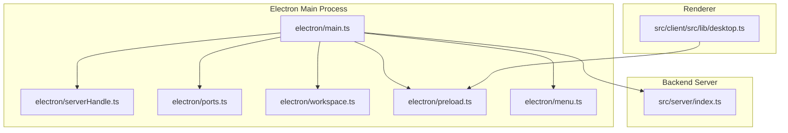

**Diagram sources**
- [electron/main.ts:1-171](file://electron/main.ts#L1-L171)
- [electron/serverHandle.ts:1-47](file://electron/serverHandle.ts#L1-L47)
- [electron/ports.ts:1-36](file://electron/ports.ts#L1-L36)
- [electron/workspace.ts:1-66](file://electron/workspace.ts#L1-L66)
- [electron/preload.ts:1-15](file://electron/preload.ts#L1-L15)
- [electron/menu.ts:1-21](file://electron/menu.ts#L1-L21)
- [src/server/index.ts:1-679](file://src/server/index.ts#L1-L679)
- [src/client/src/lib/desktop.ts:1-23](file://src/client/src/lib/desktop.ts#L1-L23)

**Section sources**
- [electron/main.ts:1-171](file://electron/main.ts#L1-L171)
- [electron/serverHandle.ts:1-47](file://electron/serverHandle.ts#L1-L47)
- [electron/ports.ts:1-36](file://electron/ports.ts#L1-L36)
- [electron/workspace.ts:1-66](file://electron/workspace.ts#L1-L66)
- [electron/preload.ts:1-15](file://electron/preload.ts#L1-L15)
- [electron/menu.ts:1-21](file://electron/menu.ts#L1-L21)
- [src/server/index.ts:1-679](file://src/server/index.ts#L1-L679)
- [src/client/src/lib/desktop.ts:1-23](file://src/client/src/lib/desktop.ts#L1-L23)

## Core Components
- Electron main process orchestrates lifecycle, window creation, IPC, and server supervision.
- Backend server runs as a separate Node process forked by the main process.
- Port management ensures dynamic allocation and readiness verification.
- Workspace resolution and persistence enable user-selected directories.
- Preload bridge exposes a minimal, secure API surface to the renderer.
- Menu integrates with the OS shell and provides workspace switching.

**Section sources**
- [electron/main.ts:132-138](file://electron/main.ts#L132-L138)
- [electron/serverHandle.ts:17-31](file://electron/serverHandle.ts#L17-L31)
- [electron/ports.ts:4-15](file://electron/ports.ts#L4-L15)
- [electron/workspace.ts:43-53](file://electron/workspace.ts#L43-L53)
- [electron/preload.ts:5-14](file://electron/preload.ts#L5-L14)
- [electron/menu.ts:3-20](file://electron/menu.ts#L3-L20)

## Architecture Overview
The desktop shell initializes the Electron main process, resolves workspace, starts the backend server in a separate process, waits for readiness, creates the BrowserWindow, and sets up IPC and menus. The renderer communicates via a preload-exposed bridge.

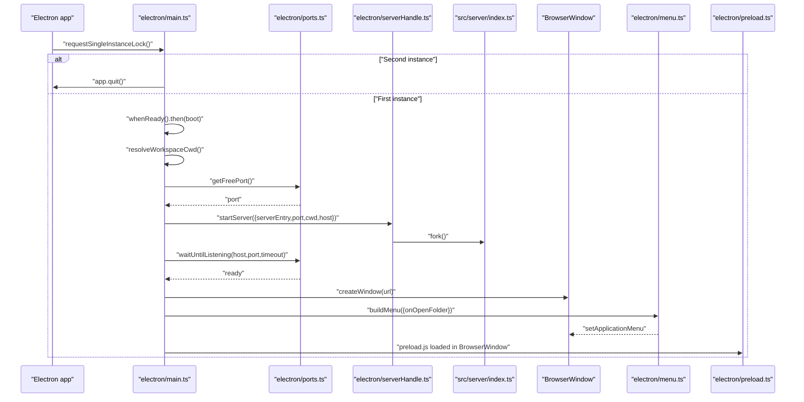

**Diagram sources**
- [electron/main.ts:140-155](file://electron/main.ts#L140-L155)
- [electron/main.ts:132-138](file://electron/main.ts#L132-L138)
- [electron/ports.ts:4-15](file://electron/ports.ts#L4-L15)
- [electron/ports.ts:18-35](file://electron/ports.ts#L18-L35)
- [electron/serverHandle.ts:17-31](file://electron/serverHandle.ts#L17-L31)
- [src/server/index.ts:664-667](file://src/server/index.ts#L664-L667)

## Detailed Component Analysis

### Single Instance Lock and Second Instance Handling
- The main process requests a single instance lock. If another instance exists, it exits immediately.
- On a second instance, the main process listens for the “second-instanceÔÇØ event and focuses the existing window.

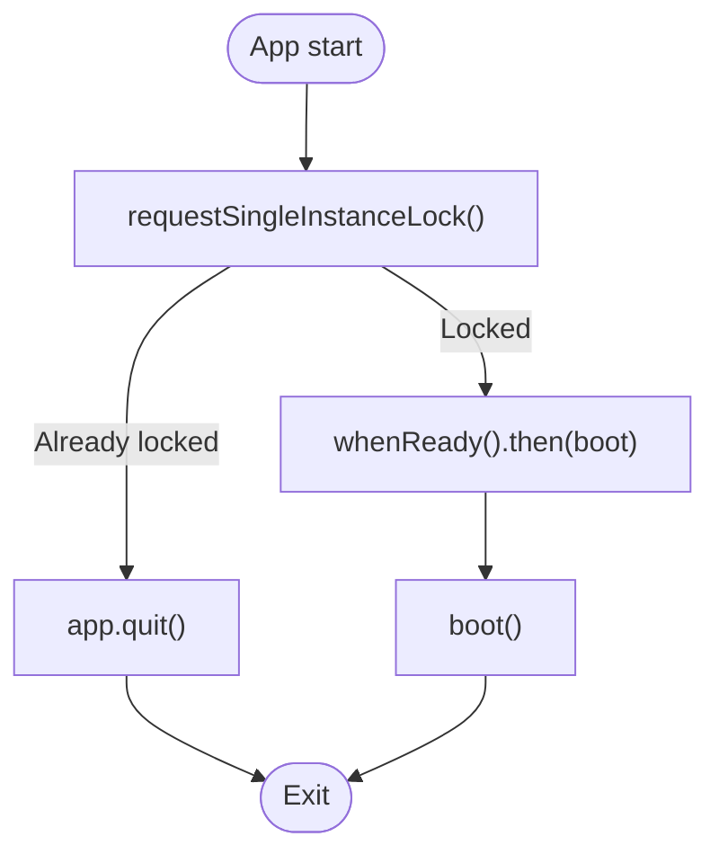

**Diagram sources**
- [electron/main.ts:140-148](file://electron/main.ts#L140-L148)

**Section sources**
- [electron/main.ts:140-148](file://electron/main.ts#L140-L148)

### Startup Sequence and Boot Procedure
- Boot registers window IPC handlers, resolves workspace, starts backend, creates the window, and builds the application menu.
- In development mode, it waits for both server and Vite dev server readiness before loading the renderer.

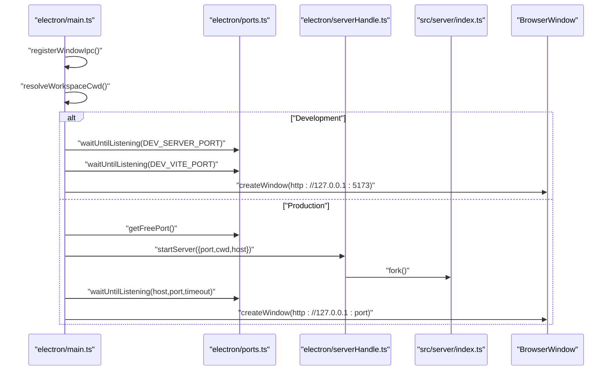

**Diagram sources**
- [electron/main.ts:132-138](file://electron/main.ts#L132-L138)
- [electron/main.ts:26-43](file://electron/main.ts#L26-L43)
- [electron/ports.ts:4-15](file://electron/ports.ts#L4-L15)
- [electron/ports.ts:18-35](file://electron/ports.ts#L18-L35)
- [electron/serverHandle.ts:17-31](file://electron/serverHandle.ts#L17-L31)

**Section sources**
- [electron/main.ts:132-138](file://electron/main.ts#L132-L138)
- [electron/main.ts:26-43](file://electron/main.ts#L26-L43)

### Server Initialization and Process Supervision
- The backend server is started as a separate Node process via a utility process fork.
- Environment variables carry host, port, and workspace directory to the server.
- The main process monitors the child process exit and triggers relaunch/restart behavior.

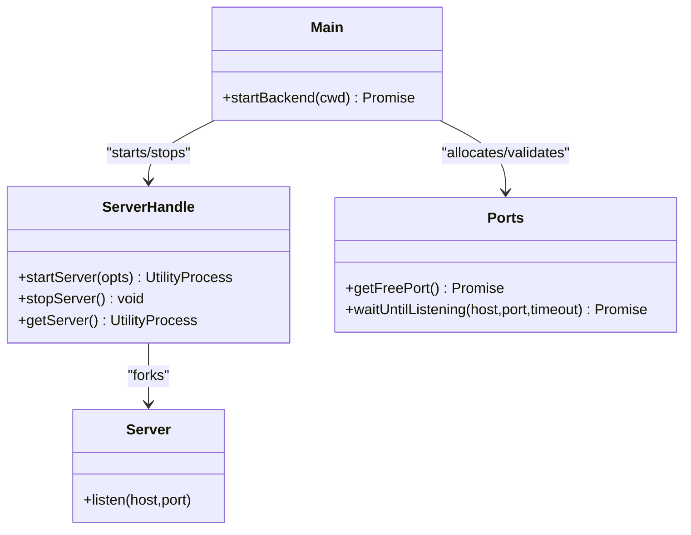

**Diagram sources**
- [electron/serverHandle.ts:17-31](file://electron/serverHandle.ts#L17-L31)
- [electron/ports.ts:4-15](file://electron/ports.ts#L4-L15)
- [electron/ports.ts:18-35](file://electron/ports.ts#L18-L35)
- [src/server/index.ts:664-667](file://src/server/index.ts#L664-L667)

**Section sources**
- [electron/serverHandle.ts:17-31](file://electron/serverHandle.ts#L17-L31)
- [electron/main.ts:33-42](file://electron/main.ts#L33-L42)

### Port Management and Readiness Checks
- A free ephemeral port is allocated and the main process waits until the backend is listening.
- Readiness polling uses a small socket connect loop with exponential backoff-like retries and a configurable timeout.

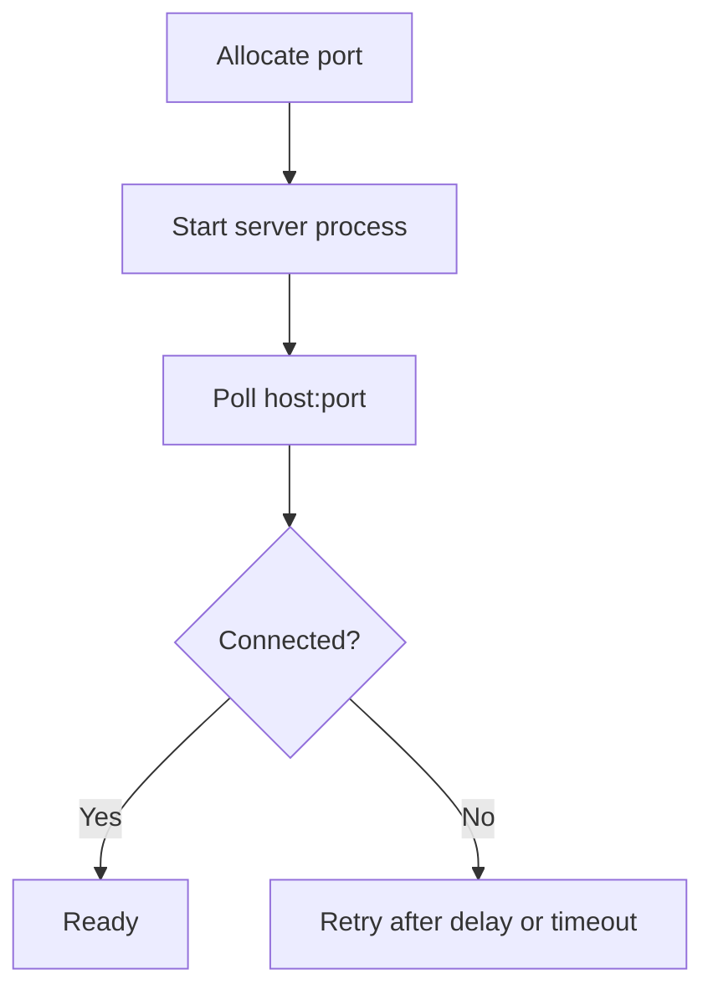

**Diagram sources**
- [electron/ports.ts:4-15](file://electron/ports.ts#L4-L15)
- [electron/ports.ts:18-35](file://electron/ports.ts#L18-L35)

**Section sources**
- [electron/ports.ts:4-15](file://electron/ports.ts#L4-L15)
- [electron/ports.ts:18-35](file://electron/ports.ts#L18-L35)

### Workspace Resolution and Persistence
- Workspace resolution prefers environment variable, then last used workspace, then OS documents directory.
- The last workspace is persisted to a JSON state file under the app's userData path.

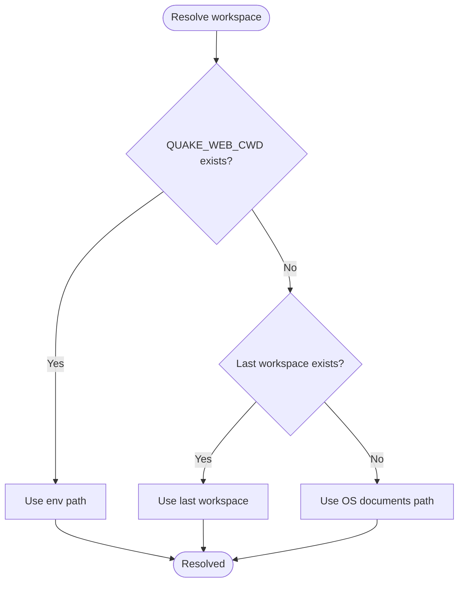

**Diagram sources**
- [electron/workspace.ts:43-53](file://electron/workspace.ts#L43-L53)
- [electron/workspace.ts:31-40](file://electron/workspace.ts#L31-L40)

**Section sources**
- [electron/workspace.ts:43-53](file://electron/workspace.ts#L43-L53)
- [electron/workspace.ts:31-40](file://electron/workspace.ts#L31-L40)

### Window Creation, Navigation Constraints, and IPC
- The main process creates a BrowserWindow with strict web preferences and a preload script.
- Navigation is constrained to local server URLs; external links open in the system browser.
- IPC handlers expose window controls and theme overlay updates.

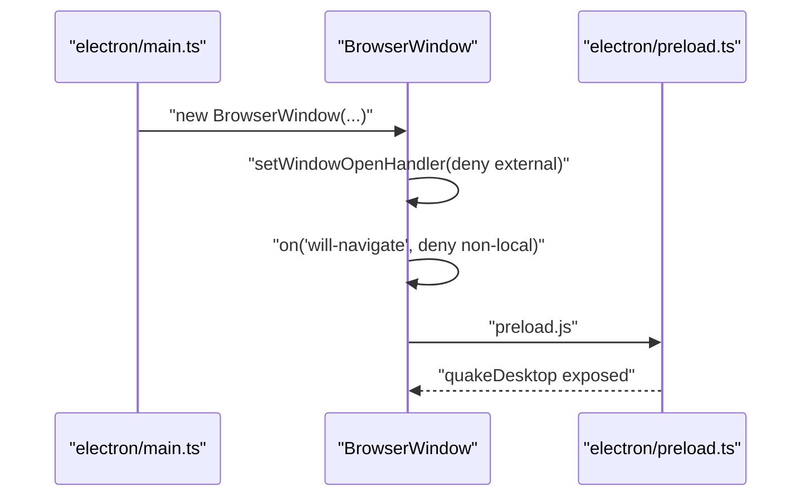

**Diagram sources**
- [electron/main.ts:68-114](file://electron/main.ts#L68-L114)
- [electron/preload.ts:5-14](file://electron/preload.ts#L5-L14)

**Section sources**
- [electron/main.ts:68-114](file://electron/main.ts#L68-L114)
- [electron/preload.ts:5-14](file://electron/preload.ts#L5-L14)

### Menu Integration and Workspace Switching
- The application menu provides a “Open Folder…ÔÇØ action that triggers workspace selection and persistence.
- In development, the renderer runtime switches workspaces without restarting the backend.

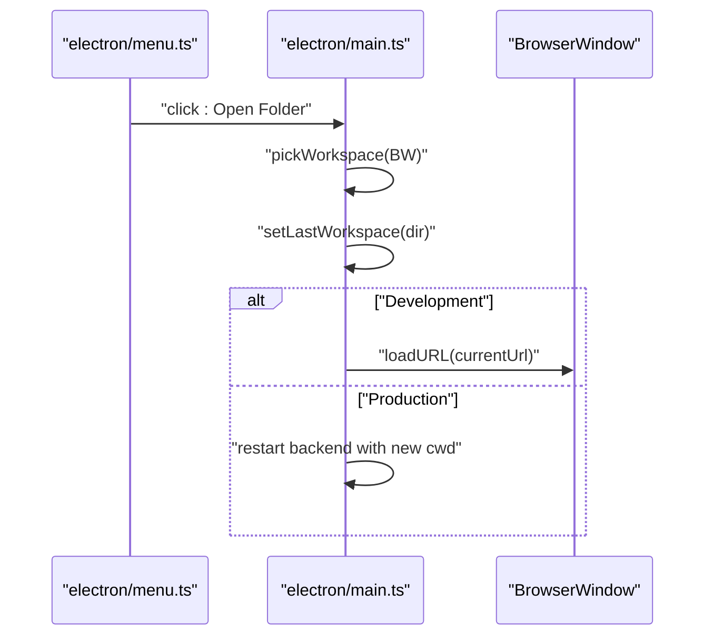

**Diagram sources**
- [electron/menu.ts:3-20](file://electron/menu.ts#L3-L20)
- [electron/main.ts:116-130](file://electron/main.ts#L116-L130)

**Section sources**
- [electron/menu.ts:3-20](file://electron/menu.ts#L3-L20)
- [electron/main.ts:116-130](file://electron/main.ts#L116-L130)

### Renderer Integration via Preload Bridge
- The preload script exposes a minimal API surface to the renderer, enabling window controls and overlay updates.
- The renderer-side desktop module defines the contract and guards against missing APIs.

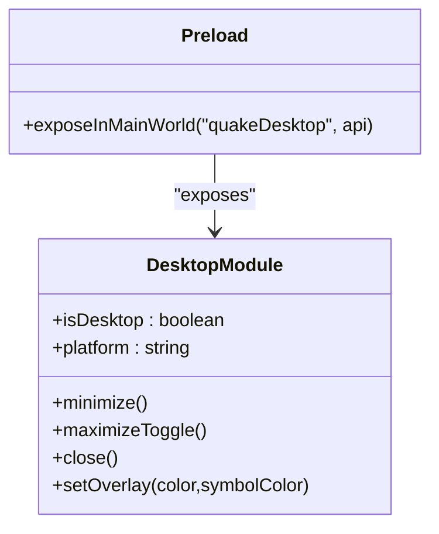

**Diagram sources**
- [electron/preload.ts:5-14](file://electron/preload.ts#L5-L14)
- [src/client/src/lib/desktop.ts:5-23](file://src/client/src/lib/desktop.ts#L5-L23)

**Section sources**
- [electron/preload.ts:5-14](file://electron/preload.ts#L5-L14)
- [src/client/src/lib/desktop.ts:5-23](file://src/client/src/lib/desktop.ts#L5-L23)

### Graceful Shutdown and Cleanup
- The main process stops the backend server on “before-quitÔÇØ and quits the app on “window-all-closedÔÇØ (except macOS).
- The backend server listens for SIGINT/SIGTERM and shuts down cleanly, stopping schedulers and closing the HTTP server.

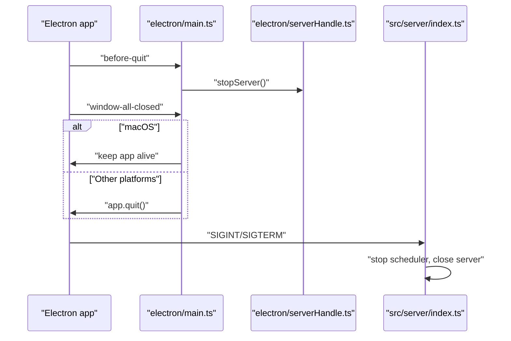

**Diagram sources**
- [electron/main.ts:157-169](file://electron/main.ts#L157-L169)
- [electron/serverHandle.ts:33-42](file://electron/serverHandle.ts#L33-L42)
- [src/server/index.ts:669-679](file://src/server/index.ts#L669-L679)

**Section sources**
- [electron/main.ts:157-169](file://electron/main.ts#L157-L169)
- [electron/serverHandle.ts:33-42](file://electron/serverHandle.ts#L33-L42)
- [src/server/index.ts:669-679](file://src/server/index.ts#L669-L679)

### Error Handling and Automatic Restart
- If the backend process exits unexpectedly, the main process displays an error dialog and relaunches the app automatically.
- Development mode relies on external dev servers; readiness checks ensure the UI loads only when both dev servers are available.

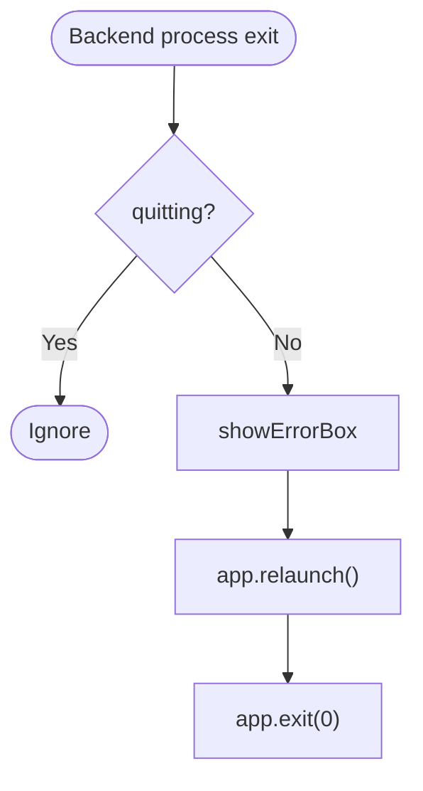

**Diagram sources**
- [electron/main.ts:35-40](file://electron/main.ts#L35-L40)

**Section sources**
- [electron/main.ts:35-40](file://electron/main.ts#L35-L40)
- [electron/main.ts:27-32](file://electron/main.ts#L27-L32)

## Dependency Analysis
- The main process depends on serverHandle for process management and ports for readiness checks.
- The backend server depends on runtime services and environment variables for configuration.
- The renderer depends on preload for a controlled API surface and desktop module for platform detection.

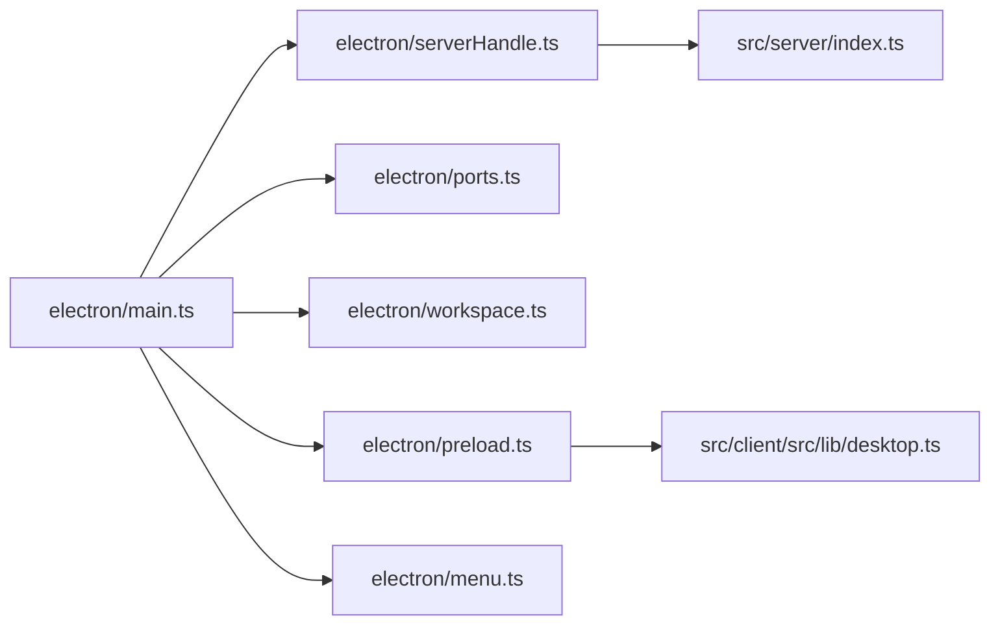

**Diagram sources**
- [electron/main.ts:1-7](file://electron/main.ts#L1-L7)
- [electron/serverHandle.ts:1-9](file://electron/serverHandle.ts#L1-L9)
- [electron/ports.ts:1](file://electron/ports.ts#L1)
- [electron/workspace.ts:1](file://electron/workspace.ts#L1)
- [electron/preload.ts:1](file://electron/preload.ts#L1)
- [electron/menu.ts:1](file://electron/menu.ts#L1)
- [src/server/index.ts:1-26](file://src/server/index.ts#L1-L26)
- [src/client/src/lib/desktop.ts:1](file://src/client/src/lib/desktop.ts#L1)

**Section sources**
- [electron/main.ts:1-7](file://electron/main.ts#L1-L7)
- [electron/serverHandle.ts:1-9](file://electron/serverHandle.ts#L1-L9)
- [electron/ports.ts:1](file://electron/ports.ts#L1)
- [electron/workspace.ts:1](file://electron/workspace.ts#L1)
- [electron/preload.ts:1](file://electron/preload.ts#L1)
- [electron/menu.ts:1](file://electron/menu.ts#L1)
- [src/server/index.ts:1-26](file://src/server/index.ts#L1-L26)
- [src/client/src/lib/desktop.ts:1](file://src/client/src/lib/desktop.ts#L1)

## Performance Considerations
- Using a separate backend process isolates CPU-intensive tasks from the UI thread.
- Dynamic port allocation avoids conflicts and reduces manual configuration overhead.
- Readiness polling with timeouts prevents indefinite hangs during startup.
- Strict navigation policies reduce unnecessary network activity and potential security risks.

[No sources needed since this section provides general guidance]

## Troubleshooting Guide
- Backend does not start:
  - Verify port allocation succeeded and the process is forked.
  - Check readiness polling timeout and host/port configuration.
- Unexpected exit during operation:
  - Inspect the error dialog and relaunch behavior.
  - Review backend logs captured by the main process.
- Development mode issues:
  - Ensure both dev server and Vite are running and reachable.
  - Confirm readiness checks pass before loading the renderer.
- Testing:
  - Smoke and e2e scripts demonstrate server readiness and basic API coverage.

**Section sources**
- [electron/serverHandle.ts:28-29](file://electron/serverHandle.ts#L28-L29)
- [scripts/smoke.mjs:12-51](file://scripts/smoke.mjs#L12-L51)
- [scripts/e2e.mjs:14-25](file://scripts/e2e.mjs#L14-L25)

## Conclusion
The Electron desktop shell enforces a single instance, manages a dedicated backend server process, and coordinates lifecycle events with robust error handling and graceful shutdown. The preload bridge and menu integrate the renderer and OS shell while maintaining a secure, minimal API surface. Development and production modes share the same lifecycle semantics, with readiness checks and process supervision ensuring reliable startup and termination.
